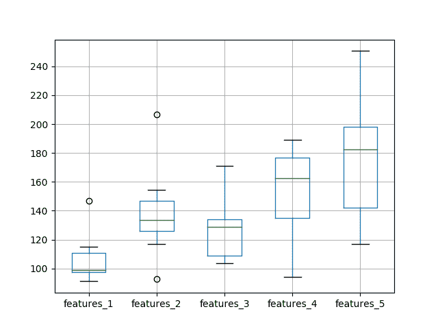
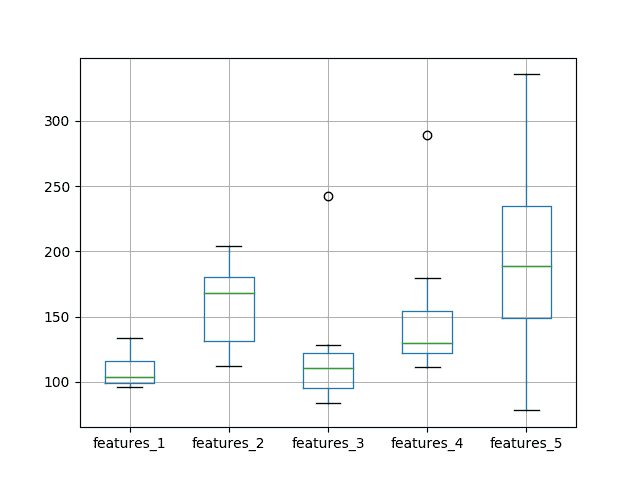

# 如何使用 LSTM 网络中的特征进行时间序列预测

> 原文： [https://machinelearningmastery.com/use-features-lstm-networks-time-series-forecasting/](https://machinelearningmastery.com/use-features-lstm-networks-time-series-forecasting/)

Keras 中的长短期记忆（LSTM）网络支持多种输入功能。

这就提出了一个问题，即单变量时间序列的滞后观测是否可以用作 LSTM 的特征，以及这是否会改善预测表现。

在本教程中，我们将研究使用滞后观察作为 Python 中 LSTM 模型的特征。

完成本教程后，您将了解：

*   如何开发测试工具以系统地评估 LSTM 功能以进行时间序列预测。
*   使用不同数量的滞后观测值作为 LSTM 模型的输入特征的影响。
*   对 LSTM 模型使用不同数量的滞后观察和匹配数量的神经元的影响。

让我们开始吧。


如何使用 LSTM 网络中的功能进行时间​​序列预测
[Tom Hodgkinson](https://www.flickr.com/photos/hodgers/117655250/in/photostream/) 的照片，保留一些权利。

## 教程概述

本教程分为 4 个部分。他们是：

1.  洗发水销售数据集
2.  实验测试线束
3.  使用 Timesteps 的实验
4.  时间步和神经元的实验

### 环境

本教程假定您已安装 Python SciPy 环境。您可以在此示例中使用 Python 2 或 3。

本教程假设您安装了 TensorFlow 或 Theano 后端的 Keras v2.0 或更高版本。

本教程还假设您安装了 scikit-learn，Pandas，NumPy 和 Matplotlib。

如果您在设置 Python 环境时需要帮助，请参阅以下帖子：

*   [如何使用 Anaconda 设置用于机器学习和深度学习的 Python 环境](http://machinelearningmastery.com/setup-python-environment-machine-learning-deep-learning-anaconda/)

## 洗发水销售数据集

该数据集描述了 3 年期间每月洗发水的销售数量。

单位是销售计数，有 36 个观察。原始数据集归功于 Makridakis，Wheelwright 和 Hyndman（1998）。

[您可以在此处下载并了解有关数据集的更多信息](https://datamarket.com/data/set/22r0/sales-of-shampoo-over-a-three-year-period)。

下面的示例加载并创建已加载数据集的图。

```
# load and plot dataset
from pandas import read_csv
from pandas import datetime
from matplotlib import pyplot
# load dataset
def parser(x):
	return datetime.strptime('190'+x, '%Y-%m')
series = read_csv('shampoo-sales.csv', header=0, parse_dates=[0], index_col=0, squeeze=True, date_parser=parser)
# summarize first few rows
print(series.head())
# line plot
series.plot()
pyplot.show()
```

运行该示例将数据集作为 Pandas Series 加载并打印前 5 行。

```
Month
1901-01-01 266.0
1901-02-01 145.9
1901-03-01 183.1
1901-04-01 119.3
1901-05-01 180.3
Name: Sales, dtype: float64
```

然后创建该系列的线图，显示明显的增加趋势。


洗发水销售数据集的线图

接下来，我们将了解实验中使用的 LSTM 配置和测试工具。

## 实验测试线束

本节介绍本教程中使用的测试工具。

### 数据拆分

我们将 Shampoo Sales 数据集分为两部分：训练和测试集。

前两年的数据将用于训练数据集，剩余的一年数据将用于测试集。

将使用训练数据集开发模型，并对测试数据集进行预测。

测试数据集的持久性预测（天真预测）实现了每月洗发水销售 136.761 的错误。这在测试集上提供了较低的可接受表现限制。

### 模型评估

将使用滚动预测场景，也称为前进模型验证。

测试数据集的每个时间步骤将一次一个地走。将使用模型对时间步长进行预测，然后将获取测试集的实际预期值，并使其可用于下一时间步的预测模型。

这模仿了一个真实世界的场景，每个月都会有新的洗发水销售观察结果，并用于下个月的预测。

这将通过列车和测试数据集的结构进行模拟。

将收集关于测试数据集的所有预测，并计算错误分数以总结模型的技能。将使用均方根误差（RMSE），因为它会对大错误进行处罚，并产生与预测数据相同的分数，即每月洗发水销售额。

### 数据准备

在我们将 LSTM 模型拟合到数据集之前，我们必须转换数据。

在拟合模型和进行预测之前，对数据集执行以下三个数据变换。

1.  **转换时间序列数据，使其静止**。具体而言，滞后= 1 差分以消除数据中的增加趋势。
2.  **将时间序列转换为监督学习问题**。具体而言，将数据组织成输入和输出模式，其中前一时间步的观察被用作预测当前时间步的观察的输入
3.  **将观察结果转换为具有特定比例**。具体而言，要将数据重新调整为-1 到 1 之间的值，以满足 LSTM 模型的默认双曲正切激活函数。

这些变换在预测时反转，在计算和误差分数之前将它们恢复到原始比例。

### LSTM 模型

我们将使用基础状态 LSTM 模型，其中 1 个神经元适合 500 个时期。

批量大小为 1 是必需的，因为我们将使用前向验证并对最后 12 个月的测试数据进行一步预测。

批量大小为 1 意味着该模型将使用在线训练（而不是批量训练或小批量训练）。因此，预计模型拟合将具有一些变化。

理想情况下，将使用更多的训练时期（例如 1000 或 1500），但这被截断为 500 以保持运行时间合理。

使用有效的 ADAM 优化算法和均方误差损失函数来拟合模型。

### 实验运行

每个实验场景将运行 10 次。

其原因在于，每次训练给定配置时，LSTM 网络的随机初始条件可能导致非常不同的结果。

让我们深入研究实验。

## 具有特征的实验

我们将进行 5 次实验;每个将使用不同数量的滞后观察作为 1 至 5 的特征。

使用有状态 LSTM 时，具有 1 输入要素的表示将是默认表示。设计使用 2 到 5 个功能。希望是滞后观测的附加背景可以改善预测模型的表现。

在训练模型之前，单变量时间序列被转换为监督学习问题。指定数量的特征定义用于预测下一次观察的输入变量（ _X_ ）的数量（ _y_ ）。因此，对于表示中使用的每个要素，必须从数据集的开头删除许多行。这是因为没有先前的观察结果可用作数据集中第一个值的特征。

下面提供了测试 1 输入功能的完整代码清单。

对于 5 个实验中的每一个， _run（）_ 函数中的特征参数从 1 到 5 变化。此外，结果在实验结束时保存到文件中，并且还必须针对每个不同的实验运行更改该文件名，例如， _experiment_features_1.csv_ ， _experiment_features_2.csv_ 等

```
from pandas import DataFrame
from pandas import Series
from pandas import concat
from pandas import read_csv
from pandas import datetime
from sklearn.metrics import mean_squared_error
from sklearn.preprocessing import MinMaxScaler
from keras.models import Sequential
from keras.layers import Dense
from keras.layers import LSTM
from math import sqrt
import matplotlib
import numpy
from numpy import concatenate

# date-time parsing function for loading the dataset
def parser(x):
	return datetime.strptime('190'+x, '%Y-%m')

# frame a sequence as a supervised learning problem
def timeseries_to_supervised(data, lag=1):
	df = DataFrame(data)
	columns = [df.shift(i) for i in range(1, lag+1)]
	columns.append(df)
	df = concat(columns, axis=1)
	return df

# create a differenced series
def difference(dataset, interval=1):
	diff = list()
	for i in range(interval, len(dataset)):
		value = dataset[i] - dataset[i - interval]
		diff.append(value)
	return Series(diff)

# invert differenced value
def inverse_difference(history, yhat, interval=1):
	return yhat + history[-interval]

# scale train and test data to [-1, 1]
def scale(train, test):
	# fit scaler
	scaler = MinMaxScaler(feature_range=(-1, 1))
	scaler = scaler.fit(train)
	# transform train
	train = train.reshape(train.shape[0], train.shape[1])
	train_scaled = scaler.transform(train)
	# transform test
	test = test.reshape(test.shape[0], test.shape[1])
	test_scaled = scaler.transform(test)
	return scaler, train_scaled, test_scaled

# inverse scaling for a forecasted value
def invert_scale(scaler, X, yhat):
	new_row = [x for x in X] + [yhat]
	array = numpy.array(new_row)
	array = array.reshape(1, len(array))
	inverted = scaler.inverse_transform(array)
	return inverted[0, -1]

# fit an LSTM network to training data
def fit_lstm(train, batch_size, nb_epoch, neurons):
	X, y = train[:, 0:-1], train[:, -1]
	X = X.reshape(X.shape[0], 1, X.shape[1])
	model = Sequential()
	model.add(LSTM(neurons, batch_input_shape=(batch_size, X.shape[1], X.shape[2]), stateful=True))
	model.add(Dense(1))
	model.compile(loss='mean_squared_error', optimizer='adam')
	for i in range(nb_epoch):
		model.fit(X, y, epochs=1, batch_size=batch_size, verbose=0, shuffle=False)
		model.reset_states()
	return model

# make a one-step forecast
def forecast_lstm(model, batch_size, X):
	X = X.reshape(1, 1, len(X))
	yhat = model.predict(X, batch_size=batch_size)
	return yhat[0,0]

# run a repeated experiment
def experiment(repeats, series, features):
	# transform data to be stationary
	raw_values = series.values
	diff_values = difference(raw_values, 1)
	# transform data to be supervised learning
	supervised = timeseries_to_supervised(diff_values, features)
	supervised_values = supervised.values[features:,:]
	# split data into train and test-sets
	train, test = supervised_values[0:-12, :], supervised_values[-12:, :]
	# transform the scale of the data
	scaler, train_scaled, test_scaled = scale(train, test)
	# run experiment
	error_scores = list()
	for r in range(repeats):
		# fit the base model
		lstm_model = fit_lstm(train_scaled, 1, 500, 1)
		# forecast test dataset
		predictions = list()
		for i in range(len(test_scaled)):
			# predict
			X, y = test_scaled[i, 0:-1], test_scaled[i, -1]
			yhat = forecast_lstm(lstm_model, 1, X)
			# invert scaling
			yhat = invert_scale(scaler, X, yhat)
			# invert differencing
			yhat = inverse_difference(raw_values, yhat, len(test_scaled)+1-i)
			# store forecast
			predictions.append(yhat)
		# report performance
		rmse = sqrt(mean_squared_error(raw_values[-12:], predictions))
		print('%d) Test RMSE: %.3f' % (r+1, rmse))
		error_scores.append(rmse)
	return error_scores

# execute the experiment
def run():
	# load dataset
	series = read_csv('shampoo-sales.csv', header=0, parse_dates=[0], index_col=0, squeeze=True, date_parser=parser)
	# experiment
	repeats = 10
	results = DataFrame()
	# run experiment
	features = 1
	results['results'] = experiment(repeats, series, features)
	# summarize results
	print(results.describe())
	# save results
	results.to_csv('experiment_features_1.csv', index=False)

 # entry point
run()
```

针对 5 种不同数量的特征运行 5 个不同的实验。

如果有足够的内存和 CPU 资源，可以并行运行它们。这些实验不需要 GPU 资源，运行应该在几分钟到几十分钟内完成。

运行实验后，您应该有 5 个包含结果的文件，如下所示：

*   _experiment_features_1.csv_
*   _experiment_features_2.csv_
*   _experiment_features_3.csv_
*   _experiment_features_4.csv_
*   _experiment_features_5.csv_

我们可以编写一些代码来加载和汇总这些结果。

具体而言，查看每次运行的描述性统计数据并使用方框和胡须图比较每次运行的结果非常有用。

下面列出了总结结果的代码。

```
from pandas import DataFrame
from pandas import read_csv
from matplotlib import pyplot
# load results into a dataframe
filenames = ['experiment_features_1.csv', 'experiment_features_2.csv',
	'experiment_features_3.csv','experiment_features_4.csv','experiment_features_5.csv']
results = DataFrame()
for name in filenames:
	results[name[11:-4]] = read_csv(name, header=0)
# describe all results
print(results.describe())
# box and whisker plot
results.boxplot()
pyplot.show()
```

首先运行代码会为每组结果打印描述性统计信息。

我们可以从单独的平均表现中看出，使用单个功能的默认值可以获得最佳表现。在查看中位数测试 RMSE（第 50 百分位数）时也会显示这一点。

```
       features_1  features_2  features_3  features_4  features_5
count   10.000000   10.000000   10.000000   10.000000   10.000000
mean   104.588249  126.597800  118.268251  107.694178  116.414887
std     10.205840   18.639757   14.359983    8.683271   18.806281
min     89.046814   93.857991  103.900339   93.702085   98.245871
25%     97.850827  120.296634  107.664087  102.992045  105.660897
50%    103.713285  133.582095  116.123790  106.116922  112.950460
75%    111.441655  134.362198  121.794533  111.498255  117.926664
max    122.341580  149.807155  152.412861  123.006088  164.598542
```

还创建了比较结果分布的盒子和胡须图。

该情节与描述性统计数据相同。随着功能数量的增加，测试 RMSE 似乎跃升了 2 个功能并且趋势向上。


测试 RMSE 的盒子和晶须图与输入特征的数量

至少在使用数据集和 LSTM 配置的情况下，没有观察到随着特征的增加而减少的误差的期望。

这就提出了一个问题，即网络的容量是否是一个限制因素。我们将在下一节中看到这一点。

## 特征和神经元的实验

LSTM 网络中的神经元（也称为单元）的数量定义了其学习能力。

在先前的实验中，可能使用一个神经元限制了网络的学习能力，使得它不能有效地使用滞后观察作为特征。

我们可以重复上述实验，并随着特征的增加增加 LSTM 中神经元的数量，看看它是否会导致表现的提高。

这可以通过更改实验函数中的行来实现：

```
lstm_model = fit_lstm(train_scaled, 1, 500, 1, features)
```

至

```
lstm_model = fit_lstm(train_scaled, 1, 500, features, features)
```

此外，我们可以通过在文件名中添加“ __neurons_ ”后缀来保持写入文件的结果与第一个实验的结果分开，例如，更改：

```
results.to_csv('experiment_features_1.csv', index=False)
```

至

```
results.to_csv('experiment_features_1_neurons.csv', index=False)
```

用这些变化重复相同的 5 个实验。

运行这些实验后，您应该有 5 个结果文件。

*   _experiment_features_1_neurons.csv_
*   _experiment_features_2_neurons.csv_
*   _experiment_features_3_neurons.csv_
*   _experiment_features_4_neurons.csv_
*   _experiment_features_5_neurons.csv_

与前一个实验一样，我们可以加载结果，计算描述性统计数据，并创建一个盒子和须状图。完整的代码清单如下。

```
from pandas import DataFrame
from pandas import read_csv
from matplotlib import pyplot
# load results into a dataframe
filenames = ['experiment_features_1_neurons.csv', 'experiment_features_2_neurons.csv',
	'experiment_features_3_neurons.csv','experiment_features_4_neurons.csv','experiment_features_5_neurons.csv']
results = DataFrame()
for name in filenames:
	results[name[11:-12]] = read_csv(name, header=0)
# describe all results
print(results.describe())
# box and whisker plot
results.boxplot()
pyplot.show()
```

运行代码首先打印 5 个实验中的每一个的描述性统计数据。

结果用一个神经元 LSTM 对第一组实验说明了不同的故事。当神经元数量和特征数量设置为 1 时，平均测试 RMSE 显得最低，然后随着神经元和特征的增加，误差增加。

```
       features_1  features_2  features_3  features_4  features_5
count   10.000000   10.000000   10.000000   10.000000   10.000000
mean   106.219189  138.411111  127.687128  154.281694  175.951500
std     16.100488   29.700981   21.411766   30.526294   44.839217
min     91.073598   92.641030  103.503546   94.063639  117.017109
25%     97.263723  125.748973  108.972440  134.805621  142.146601
50%     99.036766  133.639168  128.627349  162.295657  182.406707
75%    110.625302  146.896608  134.012859  176.969980  197.913894
max    146.638148  206.760081  170.899267  188.911768  250.685187
```

创建框和胡须图以比较分布。

随着神经元数量和输入特征的增加，扩散和中位表现的趋势几乎表明测试 RMSE 呈线性增加。

线性趋势可能表明增加的网络容量没有足够的时间来拟合数据。也许还需要增加时代数量。



测试 RMSE 的盒子和晶须图与神经元和输入特征的数量

## 特征和神经元的实验更多时代

在本节中，我们重复上述实验，以增加具有特征数量的神经元数量，但将训练时期的数量从 500 增加到 1000。

这可以通过更改实验函数中的行来实现：

```
lstm_model = fit_lstm(train_scaled, 1, 500, features, features)
```

至

```
lstm_model = fit_lstm(train_scaled, 1, 1000, features, features)
```

此外，我们可以通过在文件名中添加“ _1000_ ”后缀来保持写入文件的结果与上一次实验的结果分开，例如，更改：

```
results.to_csv('experiment_features_1_neurons.csv', index=False)
```

至

```
results.to_csv('experiment_features_1_neurons1000.csv', index=False)
```

用这些变化重复相同的 5 个实验。

运行这些实验后，您应该有 5 个结果文件。

*   _experiment_features_1_neurons1000.csv_
*   _experiment_features_2_neurons1000.csv_
*   _experiment_features_3_neurons1000.csv_
*   _experiment_features_4_neurons1000.csv_
*   _experiment_features_5_neurons1000.csv_

与前一个实验一样，我们可以加载结果，计算描述性统计数据，并创建一个盒子和须状图。完整的代码清单如下。

```
from pandas import DataFrame
from pandas import read_csv
from matplotlib import pyplot
# load results into a dataframe
filenames = ['experiment_features_1_neurons1000.csv', 'experiment_features_2_neurons1000.csv',
	'experiment_features_3_neurons1000.csv','experiment_features_4_neurons1000.csv','experiment_features_5_neurons1000.csv']
results = DataFrame()
for name in filenames:
	results[name[11:-16]] = read_csv(name, header=0)
# describe all results
print(results.describe())
# box and whisker plot
results.boxplot()
pyplot.show()
```

运行代码首先打印 5 个实验中的每一个的描述性统计数据。

结果与前一个实验的故事非常相似，训练时期数量减少了一半。平均而言，具有 1 个输入特征和 1 个神经元的模型优于其他配置。

```
       features_1  features_2  features_3  features_4  features_5
count   10.000000   10.000000   10.000000   10.000000   10.000000
mean   109.262674  158.295172  120.340623  149.741882  201.992209
std     13.850525   32.288109   45.219564   53.121113   82.986691
min     95.927393  111.936394   83.983325  111.017837   78.040385
25%     98.754253  130.875314   95.198556  122.287208  148.840499
50%    103.990988  167.915523  110.256517  129.552084  188.498836
75%    116.055435  180.679252  122.158321  154.283676  234.519359
max    133.270446  204.260072  242.186747  288.907803  335.595974
```

还创建了一个盒子和胡须图来比较分布。在情节中，我们看到了与描述性统计中明确相同的趋势。

至少在这个问题和选择的 LSTM 配置中，我们没有看到增加输入功能数量的任何明显好处。



测试 RMSE 的盒子和晶须图与神经元和输入特征的数量以及 1000 个时期

## 扩展

本节列出了您可能考虑探索的一些进一步调查的领域。

*   **诊断运行图**。对于给定的实验，在多次运行的情况下查看列车和测试 RMSE 的图可能是有帮助的。这可能有助于梳理过度拟合或过度拟合是否正在发生，反过来又是解决它的方法。
*   **增加重复次数**。使用 10 次重复导致相对少量的测试 RMSE 结果。将重复增加至 30 或 100（或甚至更高）可能导致更稳定的结果。

你有没有探索过这些扩展？
在下面的评论中分享您的发现;我很想听听你发现了什么。

## 摘要

在本教程中，您了解了如何使用滞后观察作为 LSTM 网络中的输入要素进行调查。

具体来说，你学到了：

*   如何开发一个强大的测试工具来尝试使用 LSTM 进行输入表示。
*   如何使用滞后观测作为 LSTM 时间序列预测的输入特征。
*   如何通过增加输入功能来增加网络的学习能力。

您发现“_ 使用滞后观察作为输入功能可以提高模型技能 _”并未降低所选问题和 LSTM 配置的测试 RMSE。

你有任何问题吗？
在下面的评论中提出您的问题，我会尽力回答。