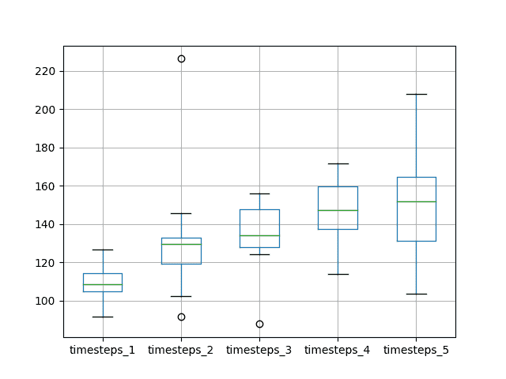

# 如何将 LSTM 网络用于时间序列预测

> 原文： [https://machinelearningmastery.com/use-timesteps-lstm-networks-time-series-forecasting/](https://machinelearningmastery.com/use-timesteps-lstm-networks-time-series-forecasting/)

Keras 的长短期记忆（LSTM）网络支持时间步骤。

这提出了一个问题，即单变量时间序列的滞后观察是否可以用作 LSTM 的时间步长以及这是否会改善预测表现。

在本教程中，我们将研究使用滞后观察作为 Python 中 LSTMs 模型的时间步长。

完成本教程后，您将了解：

*   如何开发测试工具以系统地评估 LSTM 时间序列的时间序列预测。
*   使用不同数量的滞后观测值作为 LSTM 模型的输入时间步长的影响。
*   对 LSTM 模型使用不同数量的滞后观察和匹配数量的神经元的影响。

让我们开始吧。


如何在 LSTM 网络中使用时间序列进行时间序列预测
照片来自 [YoTuT](https://www.flickr.com/photos/yotut/326537449/) ，保留一些权利。

## 教程概述

本教程分为 4 个部分。他们是：

1.  洗发水销售数据集
2.  实验测试线束
3.  时间步骤的实验
4.  时间步和神经元的实验

### 环境

本教程假定您已安装 Python SciPy 环境。您可以在此示例中使用 Python 2 或 3。

本教程假设您安装了 TensorFlow 或 Theano 后端的 Keras v2.0 或更高版本。

本教程还假设您安装了 scikit-learn，Pandas，NumPy 和 Matplotlib。

如果您在设置 Python 环境时需要帮助，请参阅以下帖子：

*   [如何使用 Anaconda 设置用于机器学习和深度学习的 Python 环境](http://machinelearningmastery.com/setup-python-environment-machine-learning-deep-learning-anaconda/)

## 洗发水销售数据集

该数据集描述了 3 年期间每月洗发水的销售数量。

单位是销售计数，有 36 个观察。原始数据集归功于 Makridakis，Wheelwright 和 Hyndman（1998）。

[您可以在此处下载并了解有关数据集的更多信息](https://datamarket.com/data/set/22r0/sales-of-shampoo-over-a-three-year-period)。

下面的示例加载并创建已加载数据集的图。

```py
# load and plot dataset
from pandas import read_csv
from pandas import datetime
from matplotlib import pyplot
# load dataset
def parser(x):
	return datetime.strptime('190'+x, '%Y-%m')
series = read_csv('shampoo-sales.csv', header=0, parse_dates=[0], index_col=0, squeeze=True, date_parser=parser)
# summarize first few rows
print(series.head())
# line plot
series.plot()
pyplot.show()
```

运行该示例将数据集作为 Pandas Series 加载并打印前 5 行。

```py
Month
1901-01-01 266.0
1901-02-01 145.9
1901-03-01 183.1
1901-04-01 119.3
1901-05-01 180.3
Name: Sales, dtype: float64
```

然后创建该系列的线图，显示明显的增加趋势。


洗发水销售数据集的线图

接下来，我们将了解实验中使用的 LSTM 配置和测试工具。

## 实验测试线束

本节介绍本教程中使用的测试工具。

### 数据拆分

我们将 Shampoo Sales 数据集分为两部分：训练和测试集。

前两年的数据将用于训练数据集，剩余的一年数据将用于测试集。

将使用训练数据集开发模型，并对测试数据集做出预测。

测试数据集的持久性预测（朴素预测）实现了每月洗发水销售 136.761 的错误。这在测试集上提供了较低的可接受表现限制。

### 模型评估

将使用滚动预测场景，也称为前进模型验证。

测试数据集的每个时间步骤将一次一个地走。将使用模型对时间步长做出预测，然后将获取测试集的实际预期值，并使其可用于下一时间步的预测模型。

这模仿了一个真实世界的场景，每个月都会有新的洗发水销售观察结果，并用于下个月的预测。

这将通过训练和测试数据集的结构进行模拟。

将收集关于测试数据集的所有预测，并计算错误分数以总结模型的技能。将使用均方根误差（RMSE），因为它会对大错误进行处罚，并产生与预测数据相同的分数，即每月洗发水销售额。

### 数据准备

在我们将 LSTM 模型拟合到数据集之前，我们必须转换数据。

在拟合模型和做出预测之前，对数据集执行以下三个数据变换。

1.  **转换时间序列数据，使其静止**。具体而言，滞后= 1 差分以消除数据中的增加趋势。
2.  **将时间序列转换为监督学习问题**。具体而言，将数据组织成输入和输出模式，其中前一时间步的观察被用作在当前时间步长预测观测的输入
3.  **将观察结果转换为具有特定比例**。具体而言，要将数据重新调整为-1 到 1 之间的值，以满足 LSTM 模型的默认双曲正切激活函数。

这些变换在预测时反转，在计算和误差分数之前将它们恢复到原始比例。

### LSTM 模型

我们将使用基础状态 LSTM 模型，其中 1 个神经元适合 500 个时期。

批量大小为 1 是必需的，因为我们将使用前向验证并对最后 12 个月的测试数据进行一步预测。

批量大小为 1 意味着该模型将使用在线训练（而不是批量训练或小批量训练）。因此，预计模型拟合将具有一些变化。

理想情况下，将使用更多的训练时期（例如 1000 或 1500），但这被截断为 500 以保持运行时间合理。

使用有效的 ADAM 优化算法和均方误差损失函数来拟合模型。

### 实验运行

每个实验场景将运行 10 次。

其原因在于，每次训练给定配置时，LSTM 网络的随机初始条件可能导致非常不同的结果。

让我们深入研究实验。

## 时间步骤的实验

我们将进行 5 次实验，每次实验将使用不同数量的滞后观察作为 1 到 5 的时间步长。

使用有状态 LSTM 时，具有 1 个时间步长的表示将是默认表示。设计使用 2 到 5 个步骤。希望是滞后观测的附加背景可以改善预测模型的表现。

在训练模型之前，单变量时间序列被转换为监督学习问题。指定的时间步数定义了用于预测下一个时间步长（`y`）的输入变量（`X`）的数量。因此，对于表示中使用的每个时间步，必须从数据集的开头删除许多行。这是因为没有先前的观察结果可用作数据集中第一个值的时间步长。

下面列出了测试 1 个时间步的完整代码清单。

对于 5 个实验中的每一个，`run()`函数中的时间步长参数从 1 到 5 变化。此外，结果将在实验结束时保存到文件中，并且还必须针对每个不同的实验运行更改此文件名;例如：`experiment_timesteps_1.csv`，`experiment_timesteps_2.csv`等。

```py
from pandas import DataFrame
from pandas import Series
from pandas import concat
from pandas import read_csv
from pandas import datetime
from sklearn.metrics import mean_squared_error
from sklearn.preprocessing import MinMaxScaler
from keras.models import Sequential
from keras.layers import Dense
from keras.layers import LSTM
from math import sqrt
import matplotlib
import numpy
from numpy import concatenate

# date-time parsing function for loading the dataset
def parser(x):
	return datetime.strptime('190'+x, '%Y-%m')

# frame a sequence as a supervised learning problem
def timeseries_to_supervised(data, lag=1):
	df = DataFrame(data)
	columns = [df.shift(i) for i in range(1, lag+1)]
	columns.append(df)
	df = concat(columns, axis=1)
	return df

# create a differenced series
def difference(dataset, interval=1):
	diff = list()
	for i in range(interval, len(dataset)):
		value = dataset[i] - dataset[i - interval]
		diff.append(value)
	return Series(diff)

# invert differenced value
def inverse_difference(history, yhat, interval=1):
	return yhat + history[-interval]

# scale train and test data to [-1, 1]
def scale(train, test):
	# fit scaler
	scaler = MinMaxScaler(feature_range=(-1, 1))
	scaler = scaler.fit(train)
	# transform train
	train = train.reshape(train.shape[0], train.shape[1])
	train_scaled = scaler.transform(train)
	# transform test
	test = test.reshape(test.shape[0], test.shape[1])
	test_scaled = scaler.transform(test)
	return scaler, train_scaled, test_scaled

# inverse scaling for a forecasted value
def invert_scale(scaler, X, yhat):
	new_row = [x for x in X] + [yhat]
	array = numpy.array(new_row)
	array = array.reshape(1, len(array))
	inverted = scaler.inverse_transform(array)
	return inverted[0, -1]

# fit an LSTM network to training data
def fit_lstm(train, batch_size, nb_epoch, neurons, timesteps):
	X, y = train[:, 0:-1], train[:, -1]
	X = X.reshape(X.shape[0], timesteps, 1)
	model = Sequential()
	model.add(LSTM(neurons, batch_input_shape=(batch_size, X.shape[1], X.shape[2]), stateful=True))
	model.add(Dense(1))
	model.compile(loss='mean_squared_error', optimizer='adam')
	for i in range(nb_epoch):
		model.fit(X, y, epochs=1, batch_size=batch_size, verbose=0, shuffle=False)
		model.reset_states()
	return model

# make a one-step forecast
def forecast_lstm(model, batch_size, X):
	X = X.reshape(1, len(X), 1)
	yhat = model.predict(X, batch_size=batch_size)
	return yhat[0,0]

# run a repeated experiment
def experiment(repeats, series, timesteps):
	# transform data to be stationary
	raw_values = series.values
	diff_values = difference(raw_values, 1)
	# transform data to be supervised learning
	supervised = timeseries_to_supervised(diff_values, timesteps)
	supervised_values = supervised.values[timesteps:,:]
	# split data into train and test-sets
	train, test = supervised_values[0:-12, :], supervised_values[-12:, :]
	# transform the scale of the data
	scaler, train_scaled, test_scaled = scale(train, test)
	# run experiment
	error_scores = list()
	for r in range(repeats):
		# fit the base model
		lstm_model = fit_lstm(train_scaled, 1, 500, 1, timesteps)
		# forecast test dataset
		predictions = list()
		for i in range(len(test_scaled)):
			# predict
			X, y = test_scaled[i, 0:-1], test_scaled[i, -1]
			yhat = forecast_lstm(lstm_model, 1, X)
			# invert scaling
			yhat = invert_scale(scaler, X, yhat)
			# invert differencing
			yhat = inverse_difference(raw_values, yhat, len(test_scaled)+1-i)
			# store forecast
			predictions.append(yhat)
		# report performance
		rmse = sqrt(mean_squared_error(raw_values[-12:], predictions))
		print('%d) Test RMSE: %.3f' % (r+1, rmse))
		error_scores.append(rmse)
	return error_scores

# execute the experiment
def run():
	# load dataset
	series = read_csv('shampoo-sales.csv', header=0, parse_dates=[0], index_col=0, squeeze=True, date_parser=parser)
	# experiment
	repeats = 10
	results = DataFrame()
	# run experiment
	timesteps = 1
	results['results'] = experiment(repeats, series, timesteps)
	# summarize results
	print(results.describe())
	# save results
	results.to_csv('experiment_timesteps_1.csv', index=False)

 # entry point
run()
```

针对 5 个不同数量的时间步长运行 5 个不同的实验。

如果有足够的内存和 CPU 资源，可以并行运行它们。这些实验不需要 GPU 资源，实验应该在几分钟到几十分钟内完成。

运行实验后，您应该有 5 个包含结果的文件，如下所示：

```py
experiment_timesteps_1.csv
experiment_timesteps_2.csv
experiment_timesteps_3.csv
experiment_timesteps_4.csv
experiment_timesteps_5.csv
```

我们可以编写一些代码来加载和汇总这些结果。

具体而言，查看每次运行的描述性统计数据并使用方框和胡须图比较每次运行的结果非常有用。

下面列出了总结结果的代码。

```py
from pandas import DataFrame
from pandas import read_csv
from matplotlib import pyplot
# load results into a dataframe
filenames = ['experiment_timesteps_1.csv', 'experiment_timesteps_2.csv',
	'experiment_timesteps_3.csv','experiment_timesteps_4.csv','experiment_timesteps_5.csv']
results = DataFrame()
for name in filenames:
	results[name[11:-4]] = read_csv(name, header=0)
# describe all results
print(results.describe())
# box and whisker plot
results.boxplot()
pyplot.show()
```

首先运行代码会为每组结果打印描述性统计信息。

我们可以从单独的平均表现中看出，使用单个时间步的默认值导致了最佳表现。在查看中位数测试 RMSE（第 50 百分位数）时也会显示这一点。

```py
       timesteps_1  timesteps_2  timesteps_3  timesteps_4  timesteps_5
count    10.000000    10.000000    10.000000    10.000000    10.000000
mean    102.785197   127.308725   136.182907   146.277122   142.631684
std       6.299329    22.171668     7.760161     5.609412     6.611638
min      92.603903   106.124901   124.724903   138.845314   137.359503
25%      98.979692   114.100891   130.719154   141.906083   138.354265
50%     103.904185   114.519986   137.055840   145.865171   141.409855
75%     108.434727   144.328534   139.615541   150.729938   143.604275
max     110.270559   164.880226   150.497130   155.603461   159.948033
```

还创建了比较结果分布的盒子和胡须图。

该情节与描述性统计数据相同。随着时间步数的增加，存在增加测试 RMSE 的一般趋势。


时间步长与 RMSE 的盒子和晶须图

至少在使用数据集和 LSTM 配置的情况下，没有观察到随着时间步长的增加而提高表现的期望。

这就提出了一个问题，即网络的容量是否是一个限制因素。我们将在下一节中看到这一点。

## 时间步和神经元的实验

LSTM 网络中的神经元（也称为块）的数量定义了其学习能力。

在先前的实验中，可能使用一个神经元限制了网络的学习能力，使得它不能有效地使用滞后观察作为时间步长。

我们可以重复上述实验，并随着时间步长的增加增加 LSTM 中神经元的数量，看看它是否会导致表现提高。

这可以通过更改实验函数中的行来实现：

```py
lstm_model = fit_lstm(train_scaled, 1, 500, 1, timesteps)
```

至

```py
lstm_model = fit_lstm(train_scaled, 1, 500, timesteps, timesteps)
```

此外，我们可以通过在文件名中添加“`_neurons`”后缀来保持写入文件的结果与第一个实验中创建的结果分开，例如，更改：

```py
results.to_csv('experiment_timesteps_1.csv', index=False)
```

至

```py
results.to_csv('experiment_timesteps_1_neurons.csv', index=False)
```

用这些变化重复相同的 5 个实验。

运行这些实验后，您应该有 5 个结果文件。

```py
experiment_timesteps_1_neurons.csv
experiment_timesteps_2_neurons.csv
experiment_timesteps_3_neurons.csv
experiment_timesteps_4_neurons.csv
experiment_timesteps_5_neurons.csv
```

与前一个实验一样，我们可以加载结果，计算描述性统计数据，并创建一个盒子和须状图。完整的代码清单如下。

```py
from pandas import DataFrame
from pandas import read_csv
from matplotlib import pyplot
# load results into a dataframe
filenames = ['experiment_timesteps_1_neurons.csv', 'experiment_timesteps_2_neurons.csv',
	'experiment_timesteps_3_neurons.csv','experiment_timesteps_4_neurons.csv','experiment_timesteps_5_neurons.csv']
results = DataFrame()
for name in filenames:
	results[name[11:-12]] = read_csv(name, header=0)
# describe all results
print(results.describe())
# box and whisker plot
results.boxplot()
pyplot.show()
```

运行代码首先打印 5 个实验中的每一个的描述性统计数据。

结果与使用一个神经元 LSTM 的第一组实验相似。当神经元数量和时间步数设置为 1 时，平均测试 RMSE 显得最低。

```py
       timesteps_1  timesteps_2  timesteps_3  timesteps_4  timesteps_5
count    10.000000    10.000000    10.000000    10.000000    10.000000
mean    109.484374   133.195856   133.432933   145.843701   149.854229
std       9.663732    36.328757    19.347675    19.389278    30.194324
min      91.803241    91.791014    87.739484   113.808683   103.612424
25%     104.757265   119.269854   127.937277   137.417983   131.278548
50%     108.464050   129.775765   134.076721   147.222168   151.999097
75%     114.265381   132.796259   147.557091   159.518828   164.741625
max     126.581011   226.396127   156.019616   171.570206   208.030615
```

创建框和胡须图以比较分布。

随着神经元数量和时间步长的增加，扩散和中位表现的趋势几乎表明测试 RMSE 呈线性增加。

线性趋势可能表明网络容量的增加没有足够的时间来拟合数据。也许还需要增加时代数量。



时间步和神经元的盒子和晶须图与 RMSE

## 扩展

本节列出了您可能考虑探索的一些进一步调查的领域。

*   **作为特征**。使用滞后观测作为时间步长也提出了滞后观测是否可以用作输入特征的问题。目前尚不清楚 Keras LSTM 实施是否在内部以相同的方式处理时间步骤和特征。
*   **诊断运行图**。对于给定的实验，在多次运行的情况下查看训练和测试 RMSE 的图可能是有帮助的。这可能有助于梳理过拟合或过拟合是否正在发生，反过来又是解决它的方法。
*   **增加训练时期**。第二组实验中 LSTM 中神经元的增加可受益于训练时期数量的增加。这可以通过一些后续实验来探索。
*   **增加重复次数**。使用 10 次重复导致相对少量的测试 RMSE 结果。将重复增加至 30 或 100（或甚至更高）可能导致更稳定的结果。

你有没有探索过这些扩展？
在下面的评论中分享您的发现;我很想听听你发现了什么。

## 摘要

在本教程中，您了解了如何使用滞后观察作为 LSTM 网络中的输入时间步骤进行调查。

具体来说，你学到了：

*   如何开发一个强大的测试工具来尝试使用 LSTM 进行输入表示。
*   如何使用滞后观测值作为 LSTM 时间序列预测的输入时间步长。
*   如何随着时间步长的增加提高网络的学习能力。

您发现使用滞后观察作为输入时间步长的期望并未降低所选问题和 LSTM 配置的测试 RMSE。

你有任何问题吗？
在下面的评论中提出您的问题，我会尽力回答。