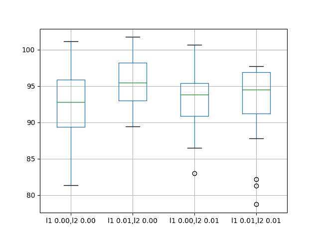
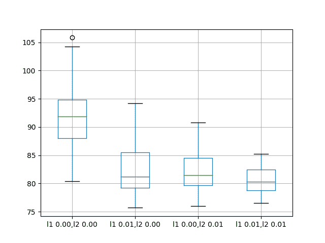

# 如何利用 LSTM 网络进行权重正则化进行时间序列预测

> 原文： [https://machinelearningmastery.com/use-weight-regularization-lstm-networks-time-series-forecasting/](https://machinelearningmastery.com/use-weight-regularization-lstm-networks-time-series-forecasting/)

长短期记忆（LSTM）模型是能够学习观察序列的循环神经网络。

这可能使它们成为一个非常适合时间序列预测的网络。

LSTM 的一个问题是他们可以轻松地过度训练训练数据，降低他们的预测技巧。

权重正则化是一种对 LSTM 节点内的权重施加约束（例如 L1 或 L2）的技术。这具有减少过度拟合和改善模型表现的效果。

在本教程中，您将了解如何使用 LSTM 网络进行权重正则化，并设计实验来测试其对时间序列预测的有效性。

完成本教程后，您将了解：

*   如何设计一个强大的测试工具来评估 LSTM 网络的时间序列预测。
*   如何设计，执行和解释使用 LSTM 的偏置权重正则化的结果。
*   如何设计，执行和解释使用 LSTM 的输入和循环权重正则化的结果。

让我们开始吧。


如何使用 LSTM 网络进行权重正则化进行时间序列预测
摄影：Julian Fong，保留一些权利。

## 教程概述

本教程分为 6 个部分。他们是：

1.  洗发水销售数据集
2.  实验测试线束
3.  偏差权重正则化
4.  输入权重正则化
5.  复发性体重正则化
6.  审查结果

### 环境

本教程假定您已安装 Python SciPy 环境。您可以在此示例中使用 Python 2 或 3。

本教程假设您安装了 TensorFlow 或 Theano 后端的 Keras v2.0 或更高版本。

本教程还假设您安装了 scikit-learn，Pandas，NumPy 和 Matplotlib。

如果您在设置 Python 环境时需要帮助，请参阅以下帖子：

*   [如何使用 Anaconda 设置用于机器学习和深度学习的 Python 环境](http://machinelearningmastery.com/setup-python-environment-machine-learning-deep-learning-anaconda/)

接下来，让我们看看标准时间序列预测问题，我们可以将其用作此实验的上下文。

## 洗发水销售数据集

该数据集描述了 3 年期间每月洗发水的销售数量。

单位是销售计数，有 36 个观察。原始数据集归功于 Makridakis，Wheelwright 和 Hyndman（1998）。

[您可以在此处下载并了解有关数据集的更多信息](https://datamarket.com/data/set/22r0/sales-of-shampoo-over-a-three-year-period)。

下面的示例加载并创建已加载数据集的图。

```py
# load and plot dataset
from pandas import read_csv
from pandas import datetime
from matplotlib import pyplot
# load dataset
def parser(x):
	return datetime.strptime('190'+x, '%Y-%m')
series = read_csv('shampoo-sales.csv', header=0, parse_dates=[0], index_col=0, squeeze=True, date_parser=parser)
# summarize first few rows
print(series.head())
# line plot
series.plot()
pyplot.show()
```

运行该示例将数据集作为 Pandas Series 加载并打印前 5 行。

```py
Month
1901-01-01 266.0
1901-02-01 145.9
1901-03-01 183.1
1901-04-01 119.3
1901-05-01 180.3
Name: Sales, dtype: float64
```

然后创建该系列的线图，显示明显的增加趋势。


洗发水销售数据集的线图

接下来，我们将看一下实验中使用的模型配置和测试工具。

## 实验测试线束

本节介绍本教程中使用的测试工具。

### 数据拆分

我们将 Shampoo Sales 数据集分为两部分：训练和测试集。

前两年的数据将用于训练数据集，剩余的一年数据将用于测试集。

将使用训练数据集开发模型，并对测试数据集进行预测。

测试数据集的持久性预测（朴素预测）实现了每月洗发水销售 136.761 的错误。这在测试集上提供了较低的可接受表现限制。

### 模型评估

将使用滚动预测场景，也称为前进模型验证。

测试数据集的每个时间步骤将一次一个地走。将使用模型对时间步长进行预测，然后将获取测试集的实际预期值，并使其可用于下一时间步的预测模型。

这模仿了一个真实世界的场景，每个月都会有新的洗发水销售观察结果，并用于下个月的预测。

这将通过训练和测试数据集的结构进行模拟。

将收集关于测试数据集的所有预测，并计算错误分数以总结模型的技能。将使用均方根误差（RMSE），因为它会对大错误进行处罚，并产生与预测数据相同的分数，即每月洗发水销售额。

### 数据准备

在我们将模型拟合到数据集之前，我们必须转换数据。

在拟合模型和进行预测之前，对数据集执行以下三个数据变换。

1.  转换时间序列数据，使其静止不动。具体而言，滞后= 1 差分以消除数据中的增加趋势。
2.  将时间序列转换为监督学习问题。具体而言，将数据组织成输入和输出模式，其中前一时间步的观察被用作预测当前时间步的观察的输入
3.  将观察结果转换为具有特定比例。具体而言，将数据重新调整为-1 到 1 之间的值。

这些变换在预测时反转，在计算和误差分数之前将它们恢复到原始比例。

### LSTM 模型

我们将使用基础状态 LSTM 模型，其中 1 个神经元适合 1000 个时期。

理想情况下，批量大小为 1 将用于步行前导验证。我们将假设前进验证并预测全年的速度。因此，我们可以使用任何可以按样本数量分割的批量大小，在这种情况下，我们将使用值 4。

理想情况下，将使用更多的训练时期（例如 1500），但这被截断为 1000 以保持运行时间合理。

使用有效的 ADAM 优化算法和均方误差损失函数来拟合模型。

### 实验运行

每个实验场景将运行 30 次，并且测试集上的 RMSE 得分将从每次运行结束时记录。

让我们深入研究实验。

## 基线 LSTM 模型

让我们从基线 LSTM 模型开始。

此问题的基线 LSTM 模型具有以下配置：

*   滞后输入：1
*   时代：1000
*   LSTM 隐藏层中的单位：3
*   批量大小：4
*   重复：3

完整的代码清单如下。

此代码清单将用作所有后续实验的基础，后续部分中仅提供对此代码的更改。

```py
from pandas import DataFrame
from pandas import Series
from pandas import concat
from pandas import read_csv
from pandas import datetime
from sklearn.metrics import mean_squared_error
from sklearn.preprocessing import MinMaxScaler
from keras.models import Sequential
from keras.layers import Dense
from keras.layers import LSTM
from keras.regularizers import L1L2
from math import sqrt
import matplotlib
# be able to save images on server
matplotlib.use('Agg')
from matplotlib import pyplot
import numpy

# date-time parsing function for loading the dataset
def parser(x):
	return datetime.strptime('190'+x, '%Y-%m')

# frame a sequence as a supervised learning problem
def timeseries_to_supervised(data, lag=1):
	df = DataFrame(data)
	columns = [df.shift(i) for i in range(1, lag+1)]
	columns.append(df)
	df = concat(columns, axis=1)
	return df

# create a differenced series
def difference(dataset, interval=1):
	diff = list()
	for i in range(interval, len(dataset)):
		value = dataset[i] - dataset[i - interval]
		diff.append(value)
	return Series(diff)

# invert differenced value
def inverse_difference(history, yhat, interval=1):
	return yhat + history[-interval]

# scale train and test data to [-1, 1]
def scale(train, test):
	# fit scaler
	scaler = MinMaxScaler(feature_range=(-1, 1))
	scaler = scaler.fit(train)
	# transform train
	train = train.reshape(train.shape[0], train.shape[1])
	train_scaled = scaler.transform(train)
	# transform test
	test = test.reshape(test.shape[0], test.shape[1])
	test_scaled = scaler.transform(test)
	return scaler, train_scaled, test_scaled

# inverse scaling for a forecasted value
def invert_scale(scaler, X, yhat):
	new_row = [x for x in X] + [yhat]
	array = numpy.array(new_row)
	array = array.reshape(1, len(array))
	inverted = scaler.inverse_transform(array)
	return inverted[0, -1]

# fit an LSTM network to training data
def fit_lstm(train, n_batch, nb_epoch, n_neurons):
	X, y = train[:, 0:-1], train[:, -1]
	X = X.reshape(X.shape[0], 1, X.shape[1])
	model = Sequential()
	model.add(LSTM(n_neurons, batch_input_shape=(n_batch, X.shape[1], X.shape[2]), stateful=True))
	model.add(Dense(1))
	model.compile(loss='mean_squared_error', optimizer='adam')
	for i in range(nb_epoch):
		model.fit(X, y, epochs=1, batch_size=n_batch, verbose=0, shuffle=False)
		model.reset_states()
	return model

# run a repeated experiment
def experiment(series, n_lag, n_repeats, n_epochs, n_batch, n_neurons):
	# transform data to be stationary
	raw_values = series.values
	diff_values = difference(raw_values, 1)
	# transform data to be supervised learning
	supervised = timeseries_to_supervised(diff_values, n_lag)
	supervised_values = supervised.values[n_lag:,:]
	# split data into train and test-sets
	train, test = supervised_values[0:-12], supervised_values[-12:]
	# transform the scale of the data
	scaler, train_scaled, test_scaled = scale(train, test)
	# run experiment
	error_scores = list()
	for r in range(n_repeats):
		# fit the model
		train_trimmed = train_scaled[2:, :]
		lstm_model = fit_lstm(train_trimmed, n_batch, n_epochs, n_neurons)
		# forecast test dataset
		test_reshaped = test_scaled[:,0:-1]
		test_reshaped = test_reshaped.reshape(len(test_reshaped), 1, 1)
		output = lstm_model.predict(test_reshaped, batch_size=n_batch)
		predictions = list()
		for i in range(len(output)):
			yhat = output[i,0]
			X = test_scaled[i, 0:-1]
			# invert scaling
			yhat = invert_scale(scaler, X, yhat)
			# invert differencing
			yhat = inverse_difference(raw_values, yhat, len(test_scaled)+1-i)
			# store forecast
			predictions.append(yhat)
		# report performance
		rmse = sqrt(mean_squared_error(raw_values[-12:], predictions))
		print('%d) Test RMSE: %.3f' % (r+1, rmse))
		error_scores.append(rmse)
	return error_scores

# configure the experiment
def run():
	# load dataset
	series = read_csv('shampoo-sales.csv', header=0, parse_dates=[0], index_col=0, squeeze=True, date_parser=parser)
	# configure the experiment
	n_lag = 1
	n_repeats = 30
	n_epochs = 1000
	n_batch = 4
	n_neurons = 3
	# run the experiment
	results = DataFrame()
	results['results'] = experiment(series, n_lag, n_repeats, n_epochs, n_batch, n_neurons)
	# summarize results
	print(results.describe())
	# save boxplot
	results.boxplot()
	pyplot.savefig('experiment_baseline.png')

# entry point
run()
```

运行实验将打印所有重复测试 RMSE 的摘要统计信息。

我们可以看到，平均而言，这种模型配置实现了约 92 个月洗发水销售的测试 RMSE，标准偏差为 5。

```py
          results
count   30.000000
mean    92.842537
std      5.748456
min     81.205979
25%     89.514367
50%     92.030003
75%     96.926145
max    105.247117
```

还会根据测试 RMSE 结果的分布创建一个盒子和胡须图并保存到文件中。

该图清楚地描述了结果的传播，突出了中间 50％的值（框）和中位数（绿线）。


洗发水销售数据集中基线表现的盒子和晶须图

## 偏差权重正则化

权重正则化可以应用于 LSTM 节点内的偏置连接。

在 Keras 中，在创建 LSTM 层时使用`bias_regularizer`参数指定。正则化器被定义为 L1，L2 或 L1L2 类之一的实例。

更多细节在这里：

*   [Keras 用于规范制定者](https://keras.io/regularizers/)

在本实验中，我们将 L1，L2 和 L1L2 与基线模型的默认值 0.01 进行比较。我们可以使用 L1L2 类指定所有配置，如下所示：

*   L1L2（0.0,0.0）[例如基线]
*   L1L2（0.01,0.0）[例如 L1]
*   L1L2（0.0,0.01）[例如 L2]
*   L1L2（0.01,0.01）[例如 L1L2 或弹性网]

下面列出了更新的 _fit_lstm（）_，_ 实验（）_ 和 _run（）_ 函数，用于使用 LSTM 的偏置权重正则化。

```py
# fit an LSTM network to training data
def fit_lstm(train, n_batch, nb_epoch, n_neurons, reg):
	X, y = train[:, 0:-1], train[:, -1]
	X = X.reshape(X.shape[0], 1, X.shape[1])
	model = Sequential()
	model.add(LSTM(n_neurons, batch_input_shape=(n_batch, X.shape[1], X.shape[2]), stateful=True, bias_regularizer=reg))
	model.add(Dense(1))
	model.compile(loss='mean_squared_error', optimizer='adam')
	for i in range(nb_epoch):
		model.fit(X, y, epochs=1, batch_size=n_batch, verbose=0, shuffle=False)
		model.reset_states()
	return model

# run a repeated experiment
def experiment(series, n_lag, n_repeats, n_epochs, n_batch, n_neurons, reg):
	# transform data to be stationary
	raw_values = series.values
	diff_values = difference(raw_values, 1)
	# transform data to be supervised learning
	supervised = timeseries_to_supervised(diff_values, n_lag)
	supervised_values = supervised.values[n_lag:,:]
	# split data into train and test-sets
	train, test = supervised_values[0:-12], supervised_values[-12:]
	# transform the scale of the data
	scaler, train_scaled, test_scaled = scale(train, test)
	# run experiment
	error_scores = list()
	for r in range(n_repeats):
		# fit the model
		train_trimmed = train_scaled[2:, :]
		lstm_model = fit_lstm(train_trimmed, n_batch, n_epochs, n_neurons, reg)
		# forecast test dataset
		test_reshaped = test_scaled[:,0:-1]
		test_reshaped = test_reshaped.reshape(len(test_reshaped), 1, 1)
		output = lstm_model.predict(test_reshaped, batch_size=n_batch)
		predictions = list()
		for i in range(len(output)):
			yhat = output[i,0]
			X = test_scaled[i, 0:-1]
			# invert scaling
			yhat = invert_scale(scaler, X, yhat)
			# invert differencing
			yhat = inverse_difference(raw_values, yhat, len(test_scaled)+1-i)
			# store forecast
			predictions.append(yhat)
		# report performance
		rmse = sqrt(mean_squared_error(raw_values[-12:], predictions))
		print('%d) Test RMSE: %.3f' % (r+1, rmse))
		error_scores.append(rmse)
	return error_scores

# configure the experiment
def run():
	# load dataset
	series = read_csv('shampoo-sales.csv', header=0, parse_dates=[0], index_col=0, squeeze=True, date_parser=parser)
	# configure the experiment
	n_lag = 1
	n_repeats = 30
	n_epochs = 1000
	n_batch = 4
	n_neurons = 3
	regularizers = [L1L2(l1=0.0, l2=0.0), L1L2(l1=0.01, l2=0.0), L1L2(l1=0.0, l2=0.01), L1L2(l1=0.01, l2=0.01)]
	# run the experiment
	results = DataFrame()
	for reg in regularizers:
		name = ('l1 %.2f,l2 %.2f' % (reg.l1, reg.l2))
		results[name] = experiment(series, n_lag, n_repeats, n_epochs, n_batch, n_neurons, reg)
	# summarize results
	print(results.describe())
	# save boxplot
	results.boxplot()
	pyplot.savefig('experiment_reg_bias.png')
```

运行此实验会打印每个已评估配置的描述性统计信息。

结果表明，与所考虑的所有其他配置相比，平均而言，无偏差正则化的默认值导致更好的表现。

```py
       l1 0.00,l2 0.00  l1 0.01,l2 0.00  l1 0.00,l2 0.01  l1 0.01,l2 0.01
count        30.000000        30.000000        30.000000        30.000000
mean         92.821489        95.520003        93.285389        92.901021
std           4.894166         3.637022         3.906112         5.082358
min          81.394504        89.477398        82.994480        78.729224
25%          89.356330        93.017723        90.907343        91.210105
50%          92.822871        95.502700        93.837562        94.525965
75%          95.899939        98.195980        95.426270        96.882378
max         101.194678       101.750900       100.650130        97.766301
```

还会创建一个框和胡须图来比较每个配置的结果分布。

该图显示所有配置具有大约相同的扩展，并且均匀地添加偏置正则化对该问题没有帮助。



在洗发水销售数据集中偏差重量正规化的盒子和晶须图

## 输入权重正则化

我们还可以将正则化应用于每个 LSTM 单元上的输入连接。

在 Keras 中，这是通过将`kernel_regularizer`参数设置为正则化类来实现的。

我们将测试与前一节中使用的相同的正则化器配置，具体为：

*   L1L2（0.0,0.0）[例如基线]
*   L1L2（0.01,0.0）[例如 L1]
*   L1L2（0.0,0.01）[例如 L2]
*   L1L2（0.01,0.01）[例如 L1L2 或弹性网]

下面列出了更新的 _fit_lstm（）_，_ 实验（）_ 和 _run（）_ 函数，用于使用 LSTM 的偏置权重正则化。

```py
# fit an LSTM network to training data
def fit_lstm(train, n_batch, nb_epoch, n_neurons, reg):
	X, y = train[:, 0:-1], train[:, -1]
	X = X.reshape(X.shape[0], 1, X.shape[1])
	model = Sequential()
	model.add(LSTM(n_neurons, batch_input_shape=(n_batch, X.shape[1], X.shape[2]), stateful=True, kernel_regularizer=reg))
	model.add(Dense(1))
	model.compile(loss='mean_squared_error', optimizer='adam')
	for i in range(nb_epoch):
		model.fit(X, y, epochs=1, batch_size=n_batch, verbose=0, shuffle=False)
		model.reset_states()
	return model

# run a repeated experiment
def experiment(series, n_lag, n_repeats, n_epochs, n_batch, n_neurons, reg):
	# transform data to be stationary
	raw_values = series.values
	diff_values = difference(raw_values, 1)
	# transform data to be supervised learning
	supervised = timeseries_to_supervised(diff_values, n_lag)
	supervised_values = supervised.values[n_lag:,:]
	# split data into train and test-sets
	train, test = supervised_values[0:-12], supervised_values[-12:]
	# transform the scale of the data
	scaler, train_scaled, test_scaled = scale(train, test)
	# run experiment
	error_scores = list()
	for r in range(n_repeats):
		# fit the model
		train_trimmed = train_scaled[2:, :]
		lstm_model = fit_lstm(train_trimmed, n_batch, n_epochs, n_neurons, reg)
		# forecast test dataset
		test_reshaped = test_scaled[:,0:-1]
		test_reshaped = test_reshaped.reshape(len(test_reshaped), 1, 1)
		output = lstm_model.predict(test_reshaped, batch_size=n_batch)
		predictions = list()
		for i in range(len(output)):
			yhat = output[i,0]
			X = test_scaled[i, 0:-1]
			# invert scaling
			yhat = invert_scale(scaler, X, yhat)
			# invert differencing
			yhat = inverse_difference(raw_values, yhat, len(test_scaled)+1-i)
			# store forecast
			predictions.append(yhat)
		# report performance
		rmse = sqrt(mean_squared_error(raw_values[-12:], predictions))
		print('%d) Test RMSE: %.3f' % (r+1, rmse))
		error_scores.append(rmse)
	return error_scores

# configure the experiment
def run():
	# load dataset
	series = read_csv('shampoo-sales.csv', header=0, parse_dates=[0], index_col=0, squeeze=True, date_parser=parser)
	# configure the experiment
	n_lag = 1
	n_repeats = 30
	n_epochs = 1000
	n_batch = 4
	n_neurons = 3
	regularizers = [L1L2(l1=0.0, l2=0.0), L1L2(l1=0.01, l2=0.0), L1L2(l1=0.0, l2=0.01), L1L2(l1=0.01, l2=0.01)]
	# run the experiment
	results = DataFrame()
	for reg in regularizers:
		name = ('l1 %.2f,l2 %.2f' % (reg.l1, reg.l2))
		results[name] = experiment(series, n_lag, n_repeats, n_epochs, n_batch, n_neurons, reg)
	# summarize results
	print(results.describe())
	# save boxplot
	results.boxplot()
	pyplot.savefig('experiment_reg_input.png')
```

运行此实验会打印每个已评估配置的描述性统计信息。

结果表明，在输入连接中增加重量正则化确实在这种设置上提供了全面的好处。

我们可以看到，对于所有配置，测试 RMSE 大约低 10 个单位，当 L1 和 L2 都组合成弹性网类型约束时，可能会带来更多好处。

```py
       l1 0.00,l2 0.00  l1 0.01,l2 0.00  l1 0.00,l2 0.01  l1 0.01,l2 0.01
count        30.000000        30.000000        30.000000        30.000000
mean         91.640028        82.118980        82.137198        80.471685
std           6.086401         4.116072         3.378984         2.212213
min          80.392310        75.705210        76.005173        76.550909
25%          88.025135        79.237822        79.698162        78.780802
50%          91.843761        81.235433        81.463882        80.283913
75%          94.860117        85.510177        84.563980        82.443390
max         105.820586        94.210503        90.823454        85.243135
```

还会创建一个框和胡须图来比较每个配置的结果分布。

该图显示了输入正则化的一般较低的误差分布。结果还表明，随着 L1L2 配置获得更好的结果，正则化结果可能更加明显。

这是一个令人鼓舞的发现，表明用于输入正则化的具有不同 L1L2 值的额外实验将是值得研究的。



洗发水销售数据集中输入重量正规化表现的盒子和晶须图

## 复发性体重正则化

最后，我们还可以将正则化应用于每个 LSTM 单元上的循环连接。

在 Keras 中，这是通过将`recurrent_regularizer`参数设置为正则化类来实现的。

我们将测试与前一节中使用的相同的正则化器配置，具体为：

*   L1L2（0.0,0.0）[例如基线]
*   L1L2（0.01,0.0）[例如 L1]
*   L1L2（0.0,0.01）[例如 L2]
*   L1L2（0.01,0.01）[例如 L1L2 或弹性网]

下面列出了更新的 _fit_lstm（）_，_ 实验（）_ 和 _run（）_ 函数，用于使用 LSTM 的偏置权重正则化。

```py
# fit an LSTM network to training data
def fit_lstm(train, n_batch, nb_epoch, n_neurons, reg):
	X, y = train[:, 0:-1], train[:, -1]
	X = X.reshape(X.shape[0], 1, X.shape[1])
	model = Sequential()
	model.add(LSTM(n_neurons, batch_input_shape=(n_batch, X.shape[1], X.shape[2]), stateful=True, recurrent_regularizer=reg))
	model.add(Dense(1))
	model.compile(loss='mean_squared_error', optimizer='adam')
	for i in range(nb_epoch):
		model.fit(X, y, epochs=1, batch_size=n_batch, verbose=0, shuffle=False)
		model.reset_states()
	return model

# run a repeated experiment
def experiment(series, n_lag, n_repeats, n_epochs, n_batch, n_neurons, reg):
	# transform data to be stationary
	raw_values = series.values
	diff_values = difference(raw_values, 1)
	# transform data to be supervised learning
	supervised = timeseries_to_supervised(diff_values, n_lag)
	supervised_values = supervised.values[n_lag:,:]
	# split data into train and test-sets
	train, test = supervised_values[0:-12], supervised_values[-12:]
	# transform the scale of the data
	scaler, train_scaled, test_scaled = scale(train, test)
	# run experiment
	error_scores = list()
	for r in range(n_repeats):
		# fit the model
		train_trimmed = train_scaled[2:, :]
		lstm_model = fit_lstm(train_trimmed, n_batch, n_epochs, n_neurons, reg)
		# forecast test dataset
		test_reshaped = test_scaled[:,0:-1]
		test_reshaped = test_reshaped.reshape(len(test_reshaped), 1, 1)
		output = lstm_model.predict(test_reshaped, batch_size=n_batch)
		predictions = list()
		for i in range(len(output)):
			yhat = output[i,0]
			X = test_scaled[i, 0:-1]
			# invert scaling
			yhat = invert_scale(scaler, X, yhat)
			# invert differencing
			yhat = inverse_difference(raw_values, yhat, len(test_scaled)+1-i)
			# store forecast
			predictions.append(yhat)
		# report performance
		rmse = sqrt(mean_squared_error(raw_values[-12:], predictions))
		print('%d) Test RMSE: %.3f' % (r+1, rmse))
		error_scores.append(rmse)
	return error_scores

# configure the experiment
def run():
	# load dataset
	series = read_csv('shampoo-sales.csv', header=0, parse_dates=[0], index_col=0, squeeze=True, date_parser=parser)
	# configure the experiment
	n_lag = 1
	n_repeats = 30
	n_epochs = 1000
	n_batch = 4
	n_neurons = 3
	regularizers = [L1L2(l1=0.0, l2=0.0), L1L2(l1=0.01, l2=0.0), L1L2(l1=0.0, l2=0.01), L1L2(l1=0.01, l2=0.01)]
	# run the experiment
	results = DataFrame()
	for reg in regularizers:
		name = ('l1 %.2f,l2 %.2f' % (reg.l1, reg.l2))
		results[name] = experiment(series, n_lag, n_repeats, n_epochs, n_batch, n_neurons, reg)
	# summarize results
	print(results.describe())
	# save boxplot
	results.boxplot()
	pyplot.savefig('experiment_reg_recurrent.png')
```

运行此实验会打印每个已评估配置的描述性统计信息。

结果表明，对 LSTM 的复发连接使用正则化对此问题没有明显的好处。

尝试的所有变化的平均表现导致比基线模型更差的表现。

```py
       l1 0.00,l2 0.00  l1 0.01,l2 0.00  l1 0.00,l2 0.01  l1 0.01,l2 0.01
count        30.000000        30.000000        30.000000        30.000000
mean         92.918797       100.675386       101.302169        96.820026
std           7.172764         3.866547         5.228815         3.966710
min          72.967841        93.789854        91.063592        89.367600
25%          90.311185        98.014045        98.222732        94.787647
50%          92.327824       100.546756       101.903350        95.727549
75%          95.989761       103.491192       104.918266        98.240613
max         110.529422       108.788604       110.712064       111.185747
```

还会创建一个框和胡须图来比较每个配置的结果分布。

该图显示了与摘要统计相同的故事，表明使用复发体重正则化几乎没有益处。


洗发水销售数据集中复发重量正常化的盒子和晶须图

## 扩展

本节列出了后续实验的想法，以扩展本教程中的工作。

*   **输入权重正则化**。输入权重正则化对该问题的实验结果表明了上市绩效的巨大希望。这可以通过网格搜索不同的 L1 和 L2 值来进一步研究，以找到最佳配置。
*   **行为动态**。可以通过在训练时期上绘制训练和测试 RMSE 来研究每个权重正则化方案的动态行为，以获得对过度拟合或欠拟合行为模式的权重正则化的想法。
*   **结合正则化**。可以设计实验来探索组合不同重量正则化方案的效果。
*   **激活正则化**。 Keras 还支持激活正则化，这可能是探索对 LSTM 施加约束并减少过度拟合的另一种途径。

## 摘要

在本教程中，您了解了如何将权重正则化与 LSTM 一起用于时间序列预测。

具体来说，你学到了：

*   如何设计一个强大的测试工具来评估 LSTM 网络的时间序列预测。
*   如何在 LSTM 上配置偏差权重正则化用于时间序列预测。
*   如何在 LSTM 上配置输入和循环权重正则化以进行时间序列预测。

您对使用 LSTM 网络的权重正则化有任何疑问吗？
在下面的评论中提出您的问题，我会尽力回答。