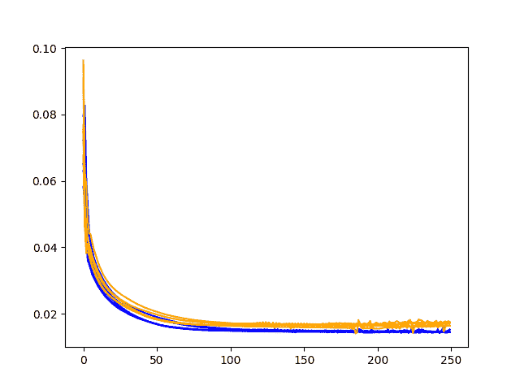

# 如何通过深度学习快速获得时间序列预测的结果

> 原文： [https://machinelearningmastery.com/get-good-results-fast-deep-learning-time-series-forecasting/](https://machinelearningmastery.com/get-good-results-fast-deep-learning-time-series-forecasting/)

#### 3
您的预测性建模问题设计实验和管理复杂性的策略。

新的时间序列预测项目很难开始。

鉴于多年的数据，适合深度学习模型可能需要数天或数周。你是如何开始的？

对于一些从业者来说，这可能会导致项目一开始就瘫痪甚至拖延。在其他情况下，它可能导致陷入只尝试和使用以前工作的陷阱，而不是真正探索问题。

在这篇文章中，您将发现在将多层神经网络和长短期记忆（LSTM）循环神经网络模型等深度学习方法应用于时间序列预测问题时可以使用的实用策略。

这篇文章中的策略并非万无一失，但是我在处理大型时间序列数据集时发现了很难学到的经验法则。

阅读这篇文章后，你会知道：

*   一种平衡思想探索和利用对你的问题起作用的策略。
*   一种快速学习和利用数据扩展思路的策略，以确认它们能够解决更广泛的问题。
*   一种策略，可以解决问题框架的复杂性以及所选深度学习模型的复杂性。

让我们开始吧。

## 1.勘探和开发战略

在搜索能够很好地解决问题的模型时，平衡探索和利用非常重要。

我建议两种不同的方法应该串联使用：

*   诊断。
*   网格搜索。

### 诊断

诊断涉及使用一组超参数执行运行，并在每个训练时期的训练和测试数据集上生成模型技能的痕迹。

这些图提供了对过度学习或学习不足以及特定超参数集的潜力的深入了解。

它们是健全性检查或种子，用于深入研究可以探索的参数范围，并防止您浪费时间，使其具有比合理要求更多的时代，或者太大的网络。

以下是来自模型运行的诊断图的示例，其显示了训练和验证 RMSE。

示例诊断线图比较训练时期的训练和测试损失

### 网格搜索

基于对诊断结果的学习，网格搜索提供了针对特定模型超参数的一组值的扫描，例如神经元的数量，批量大小等。

它们允许您以分段方式系统地拨入特定的超参数值。

### 交织方法

我建议交错诊断运行和网格搜索运行。

您可以通过诊断检查您的假设，并通过网格搜索结果从有前途的想法中获得最佳效果。

我强烈建议你测试一下你对模型的每一个假设。这包括简单的事情，如数据缩放，权重初始化，甚至激活函数，损失函数等的选择。

与下面的数据处理策略一起使用，您将快速构建一个有关预测问题的有效和无效的映射。

下面是模型批量大小的网格搜索结果示例，显示每个实验重复 30 次的结果分布。

示例框和晶须图比较不同模型参数值的模型技巧

## 2.处理数据大小的策略

我建议首先使用较小的数据样本来测试想法并慢慢增加数据量，以查看在小样本上学到的东西是否包含更大的样本。

例如，如果您有多年的每小时测量，则可以按如下方式拆分数据：

*   1 周样本。
*   1 个月的样本。
*   1 年样本。
*   所有数据。

另一种方法是，您可以在整个数据集中拟合和探索模型，其中每个模型可能需要数天才能适应，这反过来意味着您的学习速度会大幅降低。

这种方法的好处是，您可以在几分钟内快速测试多次重复（例如统计上显着）的想法，然后将这些有前途的想法扩展到越来越多的数据。

一般来说，有了良好框架的监督学习问题，学习的确会随着数据而扩展。然而，存在这样的风险：在不同的数据规模上问题存在很大差异，并且结果不成立。您可以使用更简单的模型来检查这一点，这些模型可以更快地进行训练，并在早期就弄清楚这是否是一个问题。

最后，当您将模型扩展到更多数据时，您还可以减少实验的重复次数，以帮助加快结果的周转时间。

## 3.模型复杂性策略

与数据大小一样，模型的复杂性是另一个必须管理并可以扩展的问题。

我们可以从监督学习问题的框架和模型本身来看待这一点。

### 模型框架复杂性

例如，我们可以假设包括外生变量的时间序列预测问题（例如，多输入序列或多变量输入）。

我们可以扩展问题的复杂性，看看在一个复杂程度（例如，单变量输入）中工作的是复杂的复杂程度（多变量输入）。

例如，您可以通过以下方式处理模型复杂性：

*   单变量输入，单步输出。
*   单变量输入，多步输出。
*   多变量输入，单步输出。
*   多变量输入，多步输出。

这也可以扩展到多变量预测。

在每个步骤中，目标是证明增加复杂性可以提升模型的技能。

例如：

*   神经网络模型能否胜过持久性预测模型？
*   神经网络模型能否胜过线性预测模型？
*   外生输入变量可以通过单变量输入提升模型的技能吗？
*   直接多步骤预测能否比递归单步预测更具技巧性？

如果这些问题无法克服或轻易克服，它可以帮助您快速解决问题框架和所选模型。

### 模型能力的复杂性

当使用更复杂的神经网络模型（如 LSTM）时，可以使用相同的方法。

例如：

*   将问题建模为输入到输出的映射（例如，没有内部状态或 BPTT）。
*   将问题建模为仅在输入序列中具有内部状态的映射问题（无 BPTT）。
*   将问题建模为具有内部状态和 BPTT 的映射问题。

在每个步骤中，增加的模型复杂性必须证明技能处于或高于先前的复杂程度。换句话说，增加的模型复杂性必须通过模型技能或能力的相应增加来证明。

例如：

*   LSTM 能否胜过带窗口的 MLP？
*   具有内部状态且没有 BPTT 的 LSTM 能否优于 LSTM，其中状态在每个样本后重置？
*   BPTT 超过输入序列的 LSTM 能否优于每个时间步后更新的 LSTM 吗？

### 进一步阅读

如果您要深入了解，本节将提供有关该主题的更多资源。

*   [如何通过时间序列预测项目](http://machinelearningmastery.com/work-time-series-forecast-project/)
*   [如何用 Keras 调整 LSTM 超参数进行时间序列预测](http://machinelearningmastery.com/tune-lstm-hyperparameters-keras-time-series-forecasting/)
*   [如何提高深度学习效能](http://machinelearningmastery.com/improve-deep-learning-performance/)

## 摘要

在本教程中，您了解了如何克服在深度学习项目开始时可能出现的瘫痪。

具体来说，您了解了如何系统地分解可用于快速获得结果的复杂性和策略：

*   一种平衡思想探索和利用对你的问题起作用的策略。
*   一种快速学习和利用数据扩展思路的策略，以确认它们能够解决更广泛的问题。
*   一种策略，可以解决问题框架的复杂性以及所选深度学习模型的复杂性。

你有任何问题吗？
在下面的评论中提出您的问题，我会尽力回答。