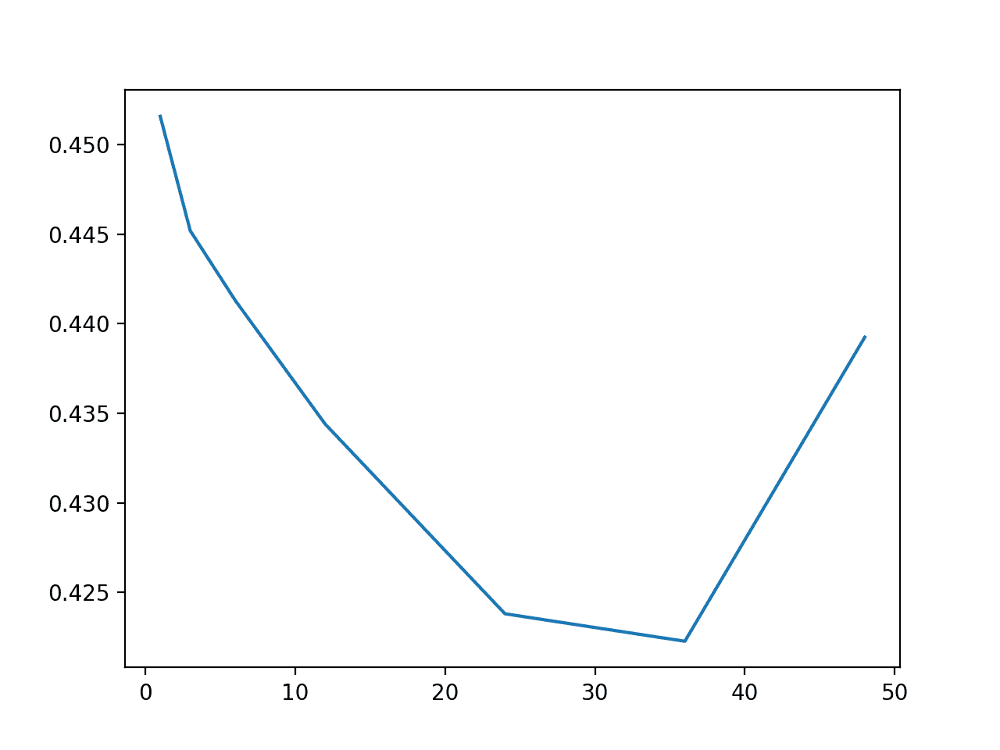

# 如何开发用于多元多步空气污染时间序列预测的机器学习模型

> 原文： [https://machinelearningmastery.com/how-to-develop-machine-learning-models-for-multivariate-multi-step-air-pollution-time-series-forecasting/](https://machinelearningmastery.com/how-to-develop-machine-learning-models-for-multivariate-multi-step-air-pollution-time-series-forecasting/)

实时世界时间序列预测具有挑战性，其原因不仅限于问题特征，例如具有多个输入变量，需要预测多个时间步骤，以及需要对多个物理站点执行相同类型的预测。

EMC Data Science Global Hackathon 数据集或简称“空气质量预测”数据集描述了多个站点的天气状况，需要预测随后三天的空气质量测量结果。

机器学习算法可以应用于时间序列预测问题，并提供诸如处理具有嘈杂的复杂依赖性的多个输入变量的能力的好处。

在本教程中，您将了解如何开发用于空气污染数据的多步时间序列预测的机器学习模型。

完成本教程后，您将了解：

*   如何估算缺失值并转换时间序列数据，以便可以通过监督学习算法对其进行建模。
*   如何开发和评估一套线性算法用于多步时间序列预测。
*   如何开发和评估一套非线性算法用于多步时间序列预测。

让我们开始吧。


如何开发多变量多步空气污染时间序列预测的机器学习模型
照片由 [Eric Sc​​hmuttenmaer](https://www.flickr.com/photos/akeg/376488289/) ，保留一些权利。

## 教程概述

本教程分为九个部分;他们是：

1.  问题描述
2.  模型评估
3.  机器学习建模
4.  机器学习数据准备
5.  模型评估测试线束
6.  评估线性算法
7.  评估非线性算法
8.  调整滞后大小

## 问题描述

空气质量预测数据集描述了多个地点的天气状况，需要预测随后三天的空气质量测量结果。

具体而言，对于多个站点，每小时提供 8 天的温度，压力，风速和风向等天气观测。目标是预测未来 3 天在多个地点的空气质量测量。预测的提前期不是连续的;相反，必须在 72 小时预测期内预测特定提前期。他们是：

```py
+1, +2, +3, +4, +5, +10, +17, +24, +48, +72
```

此外，数据集被划分为不相交但连续的数据块，其中 8 天的数据随后是需要预测的 3 天。

并非所有站点或块都可以获得所有观察结果，并且并非所有站点和块都可以使用所有输出变量。必须解决大部分缺失数据。

该数据集被用作 2012 年 Kaggle 网站上[短期机器学习竞赛](https://www.kaggle.com/c/dsg-hackathon)（或黑客马拉松）的基础。

根据从参与者中扣留的真实观察结果评估竞赛的提交，并使用平均绝对误差（MAE）进行评分。提交要求在由于缺少数据而无法预测的情况下指定-1,000,000 的值。实际上，提供了一个插入缺失值的模板，并且要求所有提交都采用（模糊的是什么）。

获胜者在滞留测试集（[私人排行榜](https://www.kaggle.com/c/dsg-hackathon/leaderboard)）上使用随机森林在滞后观察中获得了 0.21058 的 MAE。该帖子中提供了此解决方案的说明：

*   [把所有东西都扔进随机森林：Ben Hamner 赢得空气质量预测黑客马拉松](http://blog.kaggle.com/2012/05/01/chucking-everything-into-a-random-forest-ben-hamner-on-winning-the-air-quality-prediction-hackathon/)，2012。

在本教程中，我们将探索如何为可用作基线的问题开发朴素预测，以确定模型是否具有该问题的技能。

## 模型评估

在我们评估朴素的预测方法之前，我们必须开发一个测试工具。

这至少包括如何准备数据以及如何评估预测。

### 加载数据集

第一步是下载数据集并将其加载到内存中。

数据集可以从 Kaggle 网站免费下载。您可能必须创建一个帐户并登录才能下载数据集。

下载整个数据集，例如“_ 将所有 _”下载到您的工作站，并使用名为'`AirQualityPrediction`'的文件夹解压缩当前工作目录中的存档。

*   [EMC 数据科学全球黑客马拉松（空气质量预测）数据](https://www.kaggle.com/c/dsg-hackathon/data)

我们的重点将是包含训练数据集的'`TrainingData.csv`'文件，特别是块中的数据，其中每个块是八个连续的观察日和目标变量。

我们可以使用 Pandas [read_csv（）函数](https://pandas.pydata.org/pandas-docs/stable/generated/pandas.read_csv.html)将数据文件加载到内存中，并在第 0 行指定标题行。

```py
# load dataset
dataset = read_csv('AirQualityPrediction/TrainingData.csv', header=0)
```

我们可以通过'chunkID'变量（列索引 1）对数据进行分组。

首先，让我们获取唯一的块标识符列表。

```py
chunk_ids = unique(values[:, 1])
```

然后，我们可以收集每个块标识符的所有行，并将它们存储在字典中以便于访问。

```py
chunks = dict()
# sort rows by chunk id
for chunk_id in chunk_ids:
	selection = values[:, chunk_ix] == chunk_id
	chunks[chunk_id] = values[selection, :]
```

下面定义了一个名为`to_chunks()`的函数，它接受加载数据的 NumPy 数组，并将`chunk_id`的字典返回到块的行。

```py
# split the dataset by 'chunkID', return a dict of id to rows
def to_chunks(values, chunk_ix=1):
	chunks = dict()
	# get the unique chunk ids
	chunk_ids = unique(values[:, chunk_ix])
	# group rows by chunk id
	for chunk_id in chunk_ids:
		selection = values[:, chunk_ix] == chunk_id
		chunks[chunk_id] = values[selection, :]
	return chunks
```

下面列出了加载数据集并将其拆分为块的完整示例。

```py
# load data and split into chunks
from numpy import unique
from pandas import read_csv

# split the dataset by 'chunkID', return a dict of id to rows
def to_chunks(values, chunk_ix=1):
	chunks = dict()
	# get the unique chunk ids
	chunk_ids = unique(values[:, chunk_ix])
	# group rows by chunk id
	for chunk_id in chunk_ids:
		selection = values[:, chunk_ix] == chunk_id
		chunks[chunk_id] = values[selection, :]
	return chunks

# load dataset
dataset = read_csv('AirQualityPrediction/TrainingData.csv', header=0)
# group data by chunks
values = dataset.values
chunks = to_chunks(values)
print('Total Chunks: %d' % len(chunks))
```

运行该示例将打印数据集中的块数。

```py
Total Chunks: 208
```

### 数据准备

既然我们知道如何加载数据并将其拆分成块，我们就可以将它们分成训练和测试数据集。

尽管每个块内的实际观测数量可能差异很大，但每个块的每小时观察间隔为 8 天。

我们可以将每个块分成前五天的训练观察和最后三天的测试。

每个观察都有一行称为'`position_within_chunk`'，从 1 到 192（8 天* 24 小时）不等。因此，我们可以将此列中值小于或等于 120（5 * 24）的所有行作为训练数据，将任何大于 120 的值作为测试数据。

此外，任何在训练或测试分割中没有任何观察的块都可以被丢弃，因为不可行。

在使用朴素模型时，我们只对目标变量感兴趣，而不对输入的气象变量感兴趣。因此，我们可以删除输入数据，并使训练和测试数据仅包含每个块的 39 个目标变量，以及块和观察时间内的位置。

下面的`split_train_test()`函数实现了这种行为;给定一个块的字典，它将每个分成训练和测试块数据。

```py
# split each chunk into train/test sets
def split_train_test(chunks, row_in_chunk_ix=2):
	train, test = list(), list()
	# first 5 days of hourly observations for train
	cut_point = 5 * 24
	# enumerate chunks
	for k,rows in chunks.items():
		# split chunk rows by 'position_within_chunk'
		train_rows = rows[rows[:,row_in_chunk_ix] <= cut_point, :]
		test_rows = rows[rows[:,row_in_chunk_ix] > cut_point, :]
		if len(train_rows) == 0 or len(test_rows) == 0:
			print('>dropping chunk=%d: train=%s, test=%s' % (k, train_rows.shape, test_rows.shape))
			continue
		# store with chunk id, position in chunk, hour and all targets
		indices = [1,2,5] + [x for x in range(56,train_rows.shape[1])]
		train.append(train_rows[:, indices])
		test.append(test_rows[:, indices])
	return train, test
```

我们不需要整个测试数据集;相反，我们只需要在三天时间内的特定提前期进行观察，特别是提前期：

```py
+1, +2, +3, +4, +5, +10, +17, +24, +48, +72
```

其中，每个提前期相对于训练期结束。

首先，我们可以将这些提前期放入函数中以便于参考：

```py
# return a list of relative forecast lead times
def get_lead_times():
	return [1, 2 ,3, 4, 5, 10, 17, 24, 48, 72]
```

接下来，我们可以将测试数据集缩减为仅在首选提前期的数据。

我们可以通过查看'`position_within_chunk`'列并使用提前期作为距离训练数据集末尾的偏移量来实现，例如： 120 + 1,120 +2 等

如果我们在测试集中找到匹配的行，则保存它，否则生成一行 NaN 观测值。

下面的函数`to_forecasts()`实现了这一点，并为每个块的每个预测提前期返回一行 NumPy 数组。

```py
# convert the rows in a test chunk to forecasts
def to_forecasts(test_chunks, row_in_chunk_ix=1):
	# get lead times
	lead_times = get_lead_times()
	# first 5 days of hourly observations for train
	cut_point = 5 * 24
	forecasts = list()
	# enumerate each chunk
	for rows in test_chunks:
		chunk_id = rows[0, 0]
		# enumerate each lead time
		for tau in lead_times:
			# determine the row in chunk we want for the lead time
			offset = cut_point + tau
			# retrieve data for the lead time using row number in chunk
			row_for_tau = rows[rows[:,row_in_chunk_ix]==offset, :]
			# check if we have data
			if len(row_for_tau) == 0:
				# create a mock row [chunk, position, hour] + [nan...]
				row = [chunk_id, offset, nan] + [nan for _ in range(39)]
				forecasts.append(row)
			else:
				# store the forecast row
				forecasts.append(row_for_tau[0])
	return array(forecasts)
```

我们可以将所有这些组合在一起并将数据集拆分为训练集和测试集，并将结果保存到新文件中。

完整的代码示例如下所示。

```py
# split data into train and test sets
from numpy import unique
from numpy import nan
from numpy import array
from numpy import savetxt
from pandas import read_csv

# split the dataset by 'chunkID', return a dict of id to rows
def to_chunks(values, chunk_ix=1):
	chunks = dict()
	# get the unique chunk ids
	chunk_ids = unique(values[:, chunk_ix])
	# group rows by chunk id
	for chunk_id in chunk_ids:
		selection = values[:, chunk_ix] == chunk_id
		chunks[chunk_id] = values[selection, :]
	return chunks

# split each chunk into train/test sets
def split_train_test(chunks, row_in_chunk_ix=2):
	train, test = list(), list()
	# first 5 days of hourly observations for train
	cut_point = 5 * 24
	# enumerate chunks
	for k,rows in chunks.items():
		# split chunk rows by 'position_within_chunk'
		train_rows = rows[rows[:,row_in_chunk_ix] <= cut_point, :]
		test_rows = rows[rows[:,row_in_chunk_ix] > cut_point, :]
		if len(train_rows) == 0 or len(test_rows) == 0:
			print('>dropping chunk=%d: train=%s, test=%s' % (k, train_rows.shape, test_rows.shape))
			continue
		# store with chunk id, position in chunk, hour and all targets
		indices = [1,2,5] + [x for x in range(56,train_rows.shape[1])]
		train.append(train_rows[:, indices])
		test.append(test_rows[:, indices])
	return train, test

# return a list of relative forecast lead times
def get_lead_times():
	return [1, 2 ,3, 4, 5, 10, 17, 24, 48, 72]

# convert the rows in a test chunk to forecasts
def to_forecasts(test_chunks, row_in_chunk_ix=1):
	# get lead times
	lead_times = get_lead_times()
	# first 5 days of hourly observations for train
	cut_point = 5 * 24
	forecasts = list()
	# enumerate each chunk
	for rows in test_chunks:
		chunk_id = rows[0, 0]
		# enumerate each lead time
		for tau in lead_times:
			# determine the row in chunk we want for the lead time
			offset = cut_point + tau
			# retrieve data for the lead time using row number in chunk
			row_for_tau = rows[rows[:,row_in_chunk_ix]==offset, :]
			# check if we have data
			if len(row_for_tau) == 0:
				# create a mock row [chunk, position, hour] + [nan...]
				row = [chunk_id, offset, nan] + [nan for _ in range(39)]
				forecasts.append(row)
			else:
				# store the forecast row
				forecasts.append(row_for_tau[0])
	return array(forecasts)

# load dataset
dataset = read_csv('AirQualityPrediction/TrainingData.csv', header=0)
# group data by chunks
values = dataset.values
chunks = to_chunks(values)
# split into train/test
train, test = split_train_test(chunks)
# flatten training chunks to rows
train_rows = array([row for rows in train for row in rows])
# print(train_rows.shape)
print('Train Rows: %s' % str(train_rows.shape))
# reduce train to forecast lead times only
test_rows = to_forecasts(test)
print('Test Rows: %s' % str(test_rows.shape))
# save datasets
savetxt('AirQualityPrediction/naive_train.csv', train_rows, delimiter=',')
savetxt('AirQualityPrediction/naive_test.csv', test_rows, delimiter=',')
```

运行该示例首先评论了从数据集中移除了块 69 以获得不足的数据。

然后我们可以看到每个训练和测试集中有 42 列，一个用于块 ID，块内位置，一天中的小时和 39 个训练变量。

我们还可以看到测试数据集的显着缩小版本，其中行仅在预测前置时间。

新的训练和测试数据集分别保存在'`naive_train.csv`'和'`naive_test.csv`'文件中。

```py
>dropping chunk=69: train=(0, 95), test=(28, 95)
Train Rows: (23514, 42)
Test Rows: (2070, 42)
```

### 预测评估

一旦做出预测，就需要对它们进行评估。

在评估预测时，使用更简单的格式会很有帮助。例如，我们将使用 _[chunk] [变量] [时间]_ 的三维结构，其中变量是从 0 到 38 的目标变量数，time 是从 0 到 9 的提前期索引。

模型有望以这种格式做出预测。

我们还可以重新构建测试数据集以使此数据集进行比较。下面的`prepare_test_forecasts()`函数实现了这一点。

```py
# convert the test dataset in chunks to [chunk][variable][time] format
def prepare_test_forecasts(test_chunks):
	predictions = list()
	# enumerate chunks to forecast
	for rows in test_chunks:
		# enumerate targets for chunk
		chunk_predictions = list()
		for j in range(3, rows.shape[1]):
			yhat = rows[:, j]
			chunk_predictions.append(yhat)
		chunk_predictions = array(chunk_predictions)
		predictions.append(chunk_predictions)
	return array(predictions)
```

我们将使用平均绝对误差或 MAE 来评估模型。这是在竞争中使用的度量，并且在给定目标变量的非高斯分布的情况下是合理的选择。

如果提前期不包含测试集中的数据（例如`NaN`），则不会计算该预测的错误。如果提前期确实在测试集中有数据但预测中没有数据，那么观察的全部大小将被视为错误。最后，如果测试集具有观察值并做出预测，则绝对差值将被记录为误差。

`calculate_error()`函数实现这些规则并返回给定预测的错误。

```py
# calculate the error between an actual and predicted value
def calculate_error(actual, predicted):
	# give the full actual value if predicted is nan
	if isnan(predicted):
		return abs(actual)
	# calculate abs difference
	return abs(actual - predicted)
```

错误在所有块和所有提前期之间求和，然后取平均值。

将计算总体 MAE，但我们还将计算每个预测提前期的 MAE。这通常有助于模型选择，因为某些模型在不同的提前期可能会有不同的表现。

下面的 evaluate_forecasts（）函数实现了这一点，计算了 _[chunk] [variable] [time]_ 格式中提供的预测和期望值的 MAE 和每个引导时间 MAE。

```py
# evaluate a forecast in the format [chunk][variable][time]
def evaluate_forecasts(predictions, testset):
	lead_times = get_lead_times()
	total_mae, times_mae = 0.0, [0.0 for _ in range(len(lead_times))]
	total_c, times_c = 0, [0 for _ in range(len(lead_times))]
	# enumerate test chunks
	for i in range(len(test_chunks)):
		# convert to forecasts
		actual = testset[i]
		predicted = predictions[i]
		# enumerate target variables
		for j in range(predicted.shape[0]):
			# enumerate lead times
			for k in range(len(lead_times)):
				# skip if actual in nan
				if isnan(actual[j, k]):
					continue
				# calculate error
				error = calculate_error(actual[j, k], predicted[j, k])
				# update statistics
				total_mae += error
				times_mae[k] += error
				total_c += 1
				times_c[k] += 1
	# normalize summed absolute errors
	total_mae /= total_c
	times_mae = [times_mae[i]/times_c[i] for i in range(len(times_mae))]
	return total_mae, times_mae
```

一旦我们对模型进行评估，我们就可以呈现它。

下面的`summarize_error()`函数首先打印模型表现的一行摘要，然后创建每个预测提前期的 MAE 图。

```py
# summarize scores
def summarize_error(name, total_mae, times_mae):
	# print summary
	lead_times = get_lead_times()
	formatted = ['+%d %.3f' % (lead_times[i], times_mae[i]) for i in range(len(lead_times))]
	s_scores = ', '.join(formatted)
	print('%s: [%.3f MAE] %s' % (name, total_mae, s_scores))
	# plot summary
	pyplot.plot([str(x) for x in lead_times], times_mae, marker='.')
	pyplot.show()
```

我们现在准备开始探索朴素预测方法的表现。

机器学习建模

问题可以通过机器学习来建模。

大多数机器学习模型并不直接支持随时间推移的观测概念。相反，必须将滞后观察视为输入要素才能做出预测。

这是时间序列预测的机器学习算法的一个好处。具体来说，他们能够支持大量的输入功能。这些可能是一个或多个输入时间序列的滞后观察。

用于经典方法的时间序列预测的机器学习算法的其他一般好处包括：

*   能够支持变量之间关系中的噪声特征和噪声。
*   能够处理不相关的功能。
*   能够支持变量之间的复杂关系。

该数据集面临的挑战是需要进行多步预测。机器学习方法有两种主要方法可用于进行多步预测;他们是：

*   **直接**。开发了一个单独的模型来预测每个预测提前期。
*   **递归**。开发单一模型以进行一步预测，并且递归地使用该模型，其中先前预测被用作输入以预测随后的提前期。

递归方法在预测短的连续交付时间块时是有意义的，而直接方法在预测不连续的交付周期时可能更有意义。直接方法可能更适合空气污染预测问题，因为我们有兴趣预测三天内 10 个连续和不连续交付时间的混合。

数据集有 39 个目标变量，我们根据预测的提前期为每个目标变量开发一个模型。这意味着我们需要（39 * 10）390 个机器学习模型。

使用机器学习算法进行时间序列预测的关键是输入数据的选择。我们可以考虑三个主要的数据来源，它们可以用作输入并映射到目标变量的每个预测提前期;他们是：

*   **单变量数据**，例如来自正在预测的目标变量的滞后观察。
*   **多变量数据**，例如来自其他变量（天气和目标）的滞后观测。
*   **元数据**，例如有关预测日期或时间的数据。

可以从所有块中提取数据，提供丰富的数据集，用于学习从输入到目标预测提前期的映射。

39 个目标变量实际上包含 14 个站点的 12 个变量。

由于提供数据的方式，建模的默认方法是将每个变量站点视为独立的。可以通过变量折叠数据，并为多个站点的变量使用相同的模型。

一些变量被故意贴错标签（例如，不同的数据使用具有相同标识符的变量）。然而，也许这些错误标记的变量可以从多站点模型中识别和排除。

## 机器学习数据准备

在我们探索此数据集的机器学习模型之前，我们必须以能够适合模型的方式准备数据。

这需要两个数据准备步骤：

*   处理缺失数据。
*   准备输入输出模式。

目前，我们将关注 39 个目标变量并忽略气象和元数据。

### 处理缺失数据

对于 39 个目标变量，块由五小时或更少的小时观察组成。

许多块没有全部五天的数据，并且没有任何块具有所有 39 个目标变量的数据。

在块没有目标变量数据的情况下，不需要预测。

如果一个块确实有一些目标变量的数据，但不是所有五天的值，那么该系列中将存在空白。这些间隙可能需要几个小时到一天的观察时间，有时甚至更长。

处理这些差距的三种候选战略如下：

*   忽略差距。
*   无间隙地使用数据。
*   填补空白。

我们可以忽略这些差距。这样做的一个问题是，在将数据分成输入和输出时，数据不会是连续的。在训练模型时，输入将不一致，但可能意味着最后 n 小时的数据或数据分布在最后`n`天。这种不一致将使学习从输入到输出的映射非常嘈杂，并且可能比模型更难以实现。

我们只能使用无间隙的数据。这是一个不错的选择。风险在于我们可能没有足够或足够的数据来适应模型。

最后，我们可以填补空白。这称为数据插补，有许多策略可用于填补空白。可能表现良好的三种方法包括：

*   保持最后观察到的值向前（线性）。
*   使用块中一天中的小时的中值。
*   使用跨块的一小时的中值。

在本教程中，我们将使用后一种方法，并通过使用跨块的时间的中位数来填补空白。经过一点点测试后，这种方法似乎可以产生更多的训练样本和更好的模型表现。

对于给定变量，可能缺少由缺失行定义的观察值。具体地，每个观察具有'`position_within_chunk`'。我们期望训练数据集中的每个块有 120 个观察值，其中“`positions_within_chunk`”从 1 到 120 包含。

因此，我们可以为每个变量创建一个 120`NaN`值的数组，使用'`positions_within_chunk`'值标记块中的所有观察值，剩下的任何值都将被标记为`NaN`。然后我们可以绘制每个变量并寻找差距。

下面的`variable_to_series()`函数将获取目标变量的块和给定列索引的行，并将为变量返回一系列 120 个时间步长，所有可用数据都标记为来自块。

```py
# layout a variable with breaks in the data for missing positions
def variable_to_series(chunk_train, col_ix, n_steps=5*24):
	# lay out whole series
	data = [nan for _ in range(n_steps)]
	# mark all available data
	for i in range(len(chunk_train)):
		# get position in chunk
		position = int(chunk_train[i, 1] - 1)
		# store data
		data[position] = chunk_train[i, col_ix]
	return data
```

我们需要为每个块计算一个小时的并行序列，我们可以使用它来为块中的每个变量输入小时特定数据。

给定一系列部分填充的小时，下面的`interpolate_hours()`函数将填充一天中缺少的小时数。它通过找到第一个标记的小时，然后向前计数，填写一天中的小时，然后向后执行相同的操作来完成此操作。

```py
# interpolate series of hours (in place) in 24 hour time
def interpolate_hours(hours):
	# find the first hour
	ix = -1
	for i in range(len(hours)):
		if not isnan(hours[i]):
			ix = i
			break
	# fill-forward
	hour = hours[ix]
	for i in range(ix+1, len(hours)):
		# increment hour
		hour += 1
		# check for a fill
		if isnan(hours[i]):
			hours[i] = hour % 24
	# fill-backward
	hour = hours[ix]
	for i in range(ix-1, -1, -1):
		# decrement hour
		hour -= 1
		# check for a fill
		if isnan(hours[i]):
			hours[i] = hour % 24
```

我们可以调用相同的`variable_to_series()`函数（上面）来创建具有缺失值的系列小时（列索引 2），然后调用`interpolate_hours()`来填补空白。

```py
# prepare sequence of hours for the chunk
hours = variable_to_series(rows, 2)
# interpolate hours
interpolate_hours(hours)
```

然后我们可以将时间传递给可以使用它的任何 impute 函数。

我们现在可以尝试在同一系列中使用相同小时填充值中的缺失值。具体来说，我们将在系列中找到所有具有相同小时的行并计算中值。

下面的`impute_missing()`获取块中的所有行，准备好的块的一天中的小时数，以及具有变量的缺失值和变量的列索引的系列。

它首先检查系列是否全部缺失数据，如果是这种情况则立即返回，因为不能执行任何插补。然后，它会在系列的时间步骤中进行枚举，当它检测到没有数据的时间步长时，它会收集序列中所有行，并使用相同小时的数据并计算中值。

```py
# impute missing data
def impute_missing(train_chunks, rows, hours, series, col_ix):
	# impute missing using the median value for hour in all series
	imputed = list()
	for i in range(len(series)):
		if isnan(series[i]):
			# collect all rows across all chunks for the hour
			all_rows = list()
			for rows in train_chunks:
				[all_rows.append(row) for row in rows[rows[:,2]==hours[i]]]
			# calculate the central tendency for target
			all_rows = array(all_rows)
			# fill with median value
			value = nanmedian(all_rows[:, col_ix])
			if isnan(value):
				value = 0.0
			imputed.append(value)
		else:
			imputed.append(series[i])
	return imputed
```

### 监督表示

我们需要将每个目标变量的系列变换为具有输入和输出的行，以便我们可以适应有监督的机器学习算法。

具体来说，我们有一个系列，如：

```py
[1, 2, 3, 4, 5, 6, 7, 8, 9]
```

当使用 2 个滞后变量预测+1 的前置时间时，我们将系列分为输入（`X`）和输出（`y`）模式，如下所示：

```py
X,			y
1, 2,		3
2, 3,		4
3, 4,		5
4, 5,		6
5, 6,		7
6, 7,		8
7, 8,		9
```

这首先要求我们选择一些滞后观察值作为输入。没有正确的答案;相反，测试不同的数字并查看哪些有效是一个好主意。

然后，我们必须将系列分为 10 个预测提前期中的每一个的监督学习格式。例如，使用 2 个滞后观察预测+24 可能如下所示：

```py
X,			y
1, 2,		24
```

然后对 39 个目标变量中的每一个重复该过程。

然后，可以跨块来聚集为每个目标变量的每个提前期准备的模式，以提供模型的训练数据集。

我们还必须准备一个测试数据集。也就是说，为每个块的每个目标变量输入数据（`X`），以便我们可以将其用作输入来预测测试数据集中的提前期。如果我们选择滞后为 2，则测试数据集将包含每个块的每个目标变量的最后两个观察值。非常直截了当。

我们可以从定义一个函数开始，该函数将为给定的完整（插补）系列创建输入输出模式。

下面的`supervised_for_lead_time()`函数将采用一系列滞后观察作为输入，预测前置时间做出预测，然后返回从该系列中抽取的输入/输出行列表。

```py
# created input/output patterns from a sequence
def supervised_for_lead_time(series, n_lag, lead_time):
	samples = list()
	# enumerate observations and create input/output patterns
	for i in range(n_lag, len(series)):
		end_ix = i + (lead_time - 1)
		# check if can create a pattern
		if end_ix >= len(series):
			break
		# retrieve input and output
		start_ix = i - n_lag
		row = series[start_ix:i] + [series[end_ix]]
		samples.append(row)
	return samples
```

理解这件作品很重要。

我们可以测试此函数并探索不同数量的滞后变量并预测小型测试数据集的提前期。

下面是一个完整的示例，它生成一系列 20 个整数并创建一个具有两个输入滞后的系列，并预测+6 前置时间。

```py
# test supervised to input/output patterns
from numpy import array

# created input/output patterns from a sequence
def supervised_for_lead_time(series, n_lag, lead_time):
	data = list()
	# enumerate observations and create input/output patterns
	for i in range(n_lag, len(series)):
		end_ix = i + (lead_time - 1)
		# check if can create a pattern
		if end_ix >= len(series):
			break
		# retrieve input and output
		start_ix = i - n_lag
		row = series[start_ix:i] + [series[end_ix]]
		data.append(row)
	return array(data)

# define test dataset
data = [x for x in range(20)]
# convert to supervised format
result = supervised_for_lead_time(data, 2, 6)
# display result
print(result)
```

运行该示例将打印显示滞后观察结果及其相关预测提前期的结果模式。

尝试使用此示例来熟悉此数据转换，因为它是使用机器学习算法建模时间序列的关键。

```py
[[ 0  1  7]
 [ 1  2  8]
 [ 2  3  9]
 [ 3  4 10]
 [ 4  5 11]
 [ 5  6 12]
 [ 6  7 13]
 [ 7  8 14]
 [ 8  9 15]
 [ 9 10 16]
 [10 11 17]
 [11 12 18]
 [12 13 19]]
```

我们现在可以为给定目标变量系列的每个预测提前期调用 _supervised_for_lead_time（）_。

下面的`target_to_supervised()`函数实现了这个功能。首先，将目标变量转换为系列，并使用上一节中开发的函数进行估算。然后为每个目标提前期创建训练样本。还创建了目标变量的测试样本。

然后，为该目标变量返回每个预测提前期的训练数据和测试输入数据。

```py
# create supervised learning data for each lead time for this target
def target_to_supervised(chunks, rows, hours, col_ix, n_lag):
	train_lead_times = list()
	# get series
	series = variable_to_series(rows, col_ix)
	if not has_data(series):
		return None, [nan for _ in range(n_lag)]
	# impute
	imputed = impute_missing(chunks, rows, hours, series, col_ix)
	# prepare test sample for chunk-variable
	test_sample = array(imputed[-n_lag:])
	# enumerate lead times
	lead_times = get_lead_times()
	for lead_time in lead_times:
		# make input/output data from series
		train_samples = supervised_for_lead_time(imputed, n_lag, lead_time)
		train_lead_times.append(train_samples)
	return train_lead_times, test_sample
```

我们有件;我们现在需要定义驱动数据准备过程的函数。

此功能可构建训练和测试数据集。

该方法是枚举每个目标变量，并从所有块中收集每个提前期的训练数据。同时，我们在对测试数据集做出预测时收集所需的样本作为输入。

结果是具有维度 _[var] [提前期] [样本]_ 的训练数据集，其中最终维度是目标变量的预测提前期的训练样本行。该函数还返回具有维度 _[chunk] [var] [样本]_ 的测试数据集，其中最终维度是用于对块的目标变量做出预测的输入数据。

下面的`data_prep()`函数实现了这种行为，并将块格式的数据和指定数量的滞后观察值用作输入。

```py
# prepare training [var][lead time][sample] and test [chunk][var][sample]
def data_prep(chunks, n_lag, n_vars=39):
	lead_times = get_lead_times()
	train_data = [[list() for _ in range(len(lead_times))] for _ in range(n_vars)]
	test_data = [[list() for _ in range(n_vars)] for _ in range(len(chunks))]
	# enumerate targets for chunk
	for var in range(n_vars):
		# convert target number into column number
		col_ix = 3 + var
		# enumerate chunks to forecast
		for c_id in range(len(chunks)):
			rows = chunks[c_id]
			# prepare sequence of hours for the chunk
			hours = variable_to_series(rows, 2)
			# interpolate hours
			interpolate_hours(hours)
			# check for no data
			if not has_data(rows[:, col_ix]):
				continue
			# convert series into training data for each lead time
			train, test_sample = target_to_supervised(chunks, rows, hours, col_ix, n_lag)
			# store test sample for this var-chunk
			test_data[c_id][var] = test_sample
			if train is not None:
				# store samples per lead time
				for lead_time in range(len(lead_times)):
					# add all rows to the existing list of rows
					train_data[var][lead_time].extend(train[lead_time])
		# convert all rows for each var-lead time to a numpy array
		for lead_time in range(len(lead_times)):
			train_data[var][lead_time] = array(train_data[var][lead_time])
	return array(train_data), array(test_data)
```

### 完整的例子

我们可以将所有内容组合在一起，并使用监督学习格式为机器学习算法准备训练和测试数据集。

在预测每个预测提前期时，我们将使用先前 12 小时的滞后观测作为输入。

然后，生成的训练和测试数据集将保存为二进制 NumPy 数组。

下面列出了完整的示例。

```py
# prepare data
from numpy import loadtxt
from numpy import nan
from numpy import isnan
from numpy import count_nonzero
from numpy import unique
from numpy import array
from numpy import nanmedian
from numpy import save

# split the dataset by 'chunkID', return a list of chunks
def to_chunks(values, chunk_ix=0):
	chunks = list()
	# get the unique chunk ids
	chunk_ids = unique(values[:, chunk_ix])
	# group rows by chunk id
	for chunk_id in chunk_ids:
		selection = values[:, chunk_ix] == chunk_id
		chunks.append(values[selection, :])
	return chunks

# return a list of relative forecast lead times
def get_lead_times():
	return [1, 2, 3, 4, 5, 10, 17, 24, 48, 72]

# interpolate series of hours (in place) in 24 hour time
def interpolate_hours(hours):
	# find the first hour
	ix = -1
	for i in range(len(hours)):
		if not isnan(hours[i]):
			ix = i
			break
	# fill-forward
	hour = hours[ix]
	for i in range(ix+1, len(hours)):
		# increment hour
		hour += 1
		# check for a fill
		if isnan(hours[i]):
			hours[i] = hour % 24
	# fill-backward
	hour = hours[ix]
	for i in range(ix-1, -1, -1):
		# decrement hour
		hour -= 1
		# check for a fill
		if isnan(hours[i]):
			hours[i] = hour % 24

# return true if the array has any non-nan values
def has_data(data):
	return count_nonzero(isnan(data)) < len(data)

# impute missing data
def impute_missing(train_chunks, rows, hours, series, col_ix):
	# impute missing using the median value for hour in all series
	imputed = list()
	for i in range(len(series)):
		if isnan(series[i]):
			# collect all rows across all chunks for the hour
			all_rows = list()
			for rows in train_chunks:
				[all_rows.append(row) for row in rows[rows[:,2]==hours[i]]]
			# calculate the central tendency for target
			all_rows = array(all_rows)
			# fill with median value
			value = nanmedian(all_rows[:, col_ix])
			if isnan(value):
				value = 0.0
			imputed.append(value)
		else:
			imputed.append(series[i])
	return imputed

# layout a variable with breaks in the data for missing positions
def variable_to_series(chunk_train, col_ix, n_steps=5*24):
	# lay out whole series
	data = [nan for _ in range(n_steps)]
	# mark all available data
	for i in range(len(chunk_train)):
		# get position in chunk
		position = int(chunk_train[i, 1] - 1)
		# store data
		data[position] = chunk_train[i, col_ix]
	return data

# created input/output patterns from a sequence
def supervised_for_lead_time(series, n_lag, lead_time):
	samples = list()
	# enumerate observations and create input/output patterns
	for i in range(n_lag, len(series)):
		end_ix = i + (lead_time - 1)
		# check if can create a pattern
		if end_ix >= len(series):
			break
		# retrieve input and output
		start_ix = i - n_lag
		row = series[start_ix:i] + [series[end_ix]]
		samples.append(row)
	return samples

# create supervised learning data for each lead time for this target
def target_to_supervised(chunks, rows, hours, col_ix, n_lag):
	train_lead_times = list()
	# get series
	series = variable_to_series(rows, col_ix)
	if not has_data(series):
		return None, [nan for _ in range(n_lag)]
	# impute
	imputed = impute_missing(chunks, rows, hours, series, col_ix)
	# prepare test sample for chunk-variable
	test_sample = array(imputed[-n_lag:])
	# enumerate lead times
	lead_times = get_lead_times()
	for lead_time in lead_times:
		# make input/output data from series
		train_samples = supervised_for_lead_time(imputed, n_lag, lead_time)
		train_lead_times.append(train_samples)
	return train_lead_times, test_sample

# prepare training [var][lead time][sample] and test [chunk][var][sample]
def data_prep(chunks, n_lag, n_vars=39):
	lead_times = get_lead_times()
	train_data = [[list() for _ in range(len(lead_times))] for _ in range(n_vars)]
	test_data = [[list() for _ in range(n_vars)] for _ in range(len(chunks))]
	# enumerate targets for chunk
	for var in range(n_vars):
		# convert target number into column number
		col_ix = 3 + var
		# enumerate chunks to forecast
		for c_id in range(len(chunks)):
			rows = chunks[c_id]
			# prepare sequence of hours for the chunk
			hours = variable_to_series(rows, 2)
			# interpolate hours
			interpolate_hours(hours)
			# check for no data
			if not has_data(rows[:, col_ix]):
				continue
			# convert series into training data for each lead time
			train, test_sample = target_to_supervised(chunks, rows, hours, col_ix, n_lag)
			# store test sample for this var-chunk
			test_data[c_id][var] = test_sample
			if train is not None:
				# store samples per lead time
				for lead_time in range(len(lead_times)):
					# add all rows to the existing list of rows
					train_data[var][lead_time].extend(train[lead_time])
		# convert all rows for each var-lead time to a numpy array
		for lead_time in range(len(lead_times)):
			train_data[var][lead_time] = array(train_data[var][lead_time])
	return array(train_data), array(test_data)

# load dataset
train = loadtxt('AirQualityPrediction/naive_train.csv', delimiter=',')
test = loadtxt('AirQualityPrediction/naive_test.csv', delimiter=',')
# group data by chunks
train_chunks = to_chunks(train)
test_chunks = to_chunks(test)
# convert training data into supervised learning data
n_lag = 12
train_data, test_data = data_prep(train_chunks, n_lag)
print(train_data.shape, test_data.shape)
# save train and test sets to file
save('AirQualityPrediction/supervised_train.npy', train_data)
save('AirQualityPrediction/supervised_test.npy', test_data)
```

运行示例可能需要一分钟。

结果是包含训练和测试数据集的两个二进制文件，我们可以在以下部分加载这些文件，以便训练和评估问题的机器学习算法。

## 模型评估测试线束

在我们开始评估算法之前，我们需要更多的测试工具元素。

首先，我们需要能够在训练数据上使用 scikit-learn 模型。下面的`fit_model()`函数将复制模型配置，并使其适合所提供的训练数据。我们需要适应每个配置模型的许多（360）版本，因此这个函数将被调用很多。

```py
# fit a single model
def fit_model(model, X, y):
	# clone the model configuration
	local_model = clone(model)
	# fit the model
	local_model.fit(X, y)
	return local_model
```

接下来，我们需要为每个变量拟合一个模型并预测提前期组合。

我们可以通过首先通过变量枚举训练数据集，然后通过提前期来完成此操作。然后我们可以拟合模型并将其存储在具有相同结构的列表列表中，具体为： _[var] [time] [model]_ 。

下面的`fit_models()`函数实现了这一点。

```py
# fit one model for each variable and each forecast lead time [var][time][model]
def fit_models(model, train):
	# prepare structure for saving models
	models = [[list() for _ in range(train.shape[1])] for _ in range(train.shape[0])]
	# enumerate vars
	for i in range(train.shape[0]):
		# enumerate lead times
		for j in range(train.shape[1]):
			# get data
			data = train[i, j]
			X, y = data[:, :-1], data[:, -1]
			# fit model
			local_model = fit_model(model, X, y)
			models[i][j].append(local_model)
	return models
```

拟合模型是缓慢的部分，可以从并行化中受益，例如使用 Joblib 库。这是一个扩展。

一旦模型适合，它们就可用于对测试数据集做出预测。

准备好的测试数据集首先按块组织，然后按目标变量组织。预测很快，首先要检查是否可以做出预测（我们有输入数据），如果是，则使用适当的模型作为目标变量。然后，将使用每个直接模型预测变量的 10 个预测前置时间中的每一个。

下面的`make_predictions()`函数实现了这一点，将模型列表列表和加载的测试数据集作为参数，并返回结构 _[chunks] [var] [time]的预测数组 _。

```py
# return forecasts as [chunks][var][time]
def make_predictions(models, test):
	lead_times = get_lead_times()
	predictions = list()
	# enumerate chunks
	for i in range(test.shape[0]):
		# enumerate variables
		chunk_predictions = list()
		for j in range(test.shape[1]):
			# get the input pattern for this chunk and target
			pattern = test[i,j]
			# assume a nan forecast
			forecasts = array([nan for _ in range(len(lead_times))])
			# check we can make a forecast
			if has_data(pattern):
				pattern = pattern.reshape((1, len(pattern)))
				# forecast each lead time
				forecasts = list()
				for k in range(len(lead_times)):
					yhat = models[j][k][0].predict(pattern)
					forecasts.append(yhat[0])
				forecasts = array(forecasts)
			# save forecasts fore each lead time for this variable
			chunk_predictions.append(forecasts)
		# save forecasts for this chunk
		chunk_predictions = array(chunk_predictions)
		predictions.append(chunk_predictions)
	return array(predictions)
```

我们需要一个要评估的模型列表。

我们可以定义一个通用的`get_models()`函数，该函数负责定义映射到已配置的 scikit-learn 模型对象的模型名称字典。

```py
# prepare a list of ml models
def get_models(models=dict()):
	# ...
	return models
```

最后，我们需要一个功能来推动模型评估过程。

给定模型字典，枚举模型，首先在训练数据上拟合模型矩阵，预测测试数据集，评估预测，并总结结果。

下面的`evaluate_models()`函数实现了这一点。

```py
# evaluate a suite of models
def evaluate_models(models, train, test, actual):
	for name, model in models.items():
		# fit models
		fits = fit_models(model, train)
		# make predictions
		predictions = make_predictions(fits, test)
		# evaluate forecast
		total_mae, _ = evaluate_forecasts(predictions, actual)
		# summarize forecast
		summarize_error(name, total_mae)
```

我们现在拥有评估机器学习模型所需的一切。

## 评估线性算法

在本节中，我们将检查一套线性机器学习算法。

线性算法是假设输出是输入变量的线性函数的算法。这很像 ARIMA 等经典时间序列预测模型的假设。

现场检查意味着评估一套模型，以便大致了解哪些有效。我们感兴趣的是任何超过简单自回归模型 AR（2）的模型，其实现的 MAE 误差约为 0.487。

我们将使用默认配置测试八种线性机器学习算法;特别：

*   线性回归
*   套索线性回归
*   岭回归
*   弹性网络回归
*   胡贝尔回归
*   Lasso Lars 线性回归
*   被动攻击性回归
*   随机梯度下降回归

我们可以在`get_models()`函数中定义这些模型。

```py
# prepare a list of ml models
def get_models(models=dict()):
	# linear models
	models['lr'] = LinearRegression()
	models['lasso'] = Lasso()
	models['ridge'] = Ridge()
	models['en'] = ElasticNet()
	models['huber'] = HuberRegressor()
	models['llars'] = LassoLars()
	models['pa'] = PassiveAggressiveRegressor(max_iter=1000, tol=1e-3)
	models['sgd'] = SGDRegressor(max_iter=1000, tol=1e-3)
	print('Defined %d models' % len(models))
	return models
```

完整的代码示例如下所示。

```py
# evaluate linear algorithms
from numpy import load
from numpy import loadtxt
from numpy import nan
from numpy import isnan
from numpy import count_nonzero
from numpy import unique
from numpy import array
from sklearn.base import clone
from sklearn.linear_model import LinearRegression
from sklearn.linear_model import Lasso
from sklearn.linear_model import Ridge
from sklearn.linear_model import ElasticNet
from sklearn.linear_model import HuberRegressor
from sklearn.linear_model import LassoLars
from sklearn.linear_model import PassiveAggressiveRegressor
from sklearn.linear_model import SGDRegressor

# split the dataset by 'chunkID', return a list of chunks
def to_chunks(values, chunk_ix=0):
	chunks = list()
	# get the unique chunk ids
	chunk_ids = unique(values[:, chunk_ix])
	# group rows by chunk id
	for chunk_id in chunk_ids:
		selection = values[:, chunk_ix] == chunk_id
		chunks.append(values[selection, :])
	return chunks

# return true if the array has any non-nan values
def has_data(data):
	return count_nonzero(isnan(data)) < len(data)

# return a list of relative forecast lead times
def get_lead_times():
	return [1, 2, 3, 4, 5, 10, 17, 24, 48, 72]

# fit a single model
def fit_model(model, X, y):
	# clone the model configuration
	local_model = clone(model)
	# fit the model
	local_model.fit(X, y)
	return local_model

# fit one model for each variable and each forecast lead time [var][time][model]
def fit_models(model, train):
	# prepare structure for saving models
	models = [[list() for _ in range(train.shape[1])] for _ in range(train.shape[0])]
	# enumerate vars
	for i in range(train.shape[0]):
		# enumerate lead times
		for j in range(train.shape[1]):
			# get data
			data = train[i, j]
			X, y = data[:, :-1], data[:, -1]
			# fit model
			local_model = fit_model(model, X, y)
			models[i][j].append(local_model)
	return models

# return forecasts as [chunks][var][time]
def make_predictions(models, test):
	lead_times = get_lead_times()
	predictions = list()
	# enumerate chunks
	for i in range(test.shape[0]):
		# enumerate variables
		chunk_predictions = list()
		for j in range(test.shape[1]):
			# get the input pattern for this chunk and target
			pattern = test[i,j]
			# assume a nan forecast
			forecasts = array([nan for _ in range(len(lead_times))])
			# check we can make a forecast
			if has_data(pattern):
				pattern = pattern.reshape((1, len(pattern)))
				# forecast each lead time
				forecasts = list()
				for k in range(len(lead_times)):
					yhat = models[j][k][0].predict(pattern)
					forecasts.append(yhat[0])
				forecasts = array(forecasts)
			# save forecasts for each lead time for this variable
			chunk_predictions.append(forecasts)
		# save forecasts for this chunk
		chunk_predictions = array(chunk_predictions)
		predictions.append(chunk_predictions)
	return array(predictions)

# convert the test dataset in chunks to [chunk][variable][time] format
def prepare_test_forecasts(test_chunks):
	predictions = list()
	# enumerate chunks to forecast
	for rows in test_chunks:
		# enumerate targets for chunk
		chunk_predictions = list()
		for j in range(3, rows.shape[1]):
			yhat = rows[:, j]
			chunk_predictions.append(yhat)
		chunk_predictions = array(chunk_predictions)
		predictions.append(chunk_predictions)
	return array(predictions)

# calculate the error between an actual and predicted value
def calculate_error(actual, predicted):
	# give the full actual value if predicted is nan
	if isnan(predicted):
		return abs(actual)
	# calculate abs difference
	return abs(actual - predicted)

# evaluate a forecast in the format [chunk][variable][time]
def evaluate_forecasts(predictions, testset):
	lead_times = get_lead_times()
	total_mae, times_mae = 0.0, [0.0 for _ in range(len(lead_times))]
	total_c, times_c = 0, [0 for _ in range(len(lead_times))]
	# enumerate test chunks
	for i in range(len(test_chunks)):
		# convert to forecasts
		actual = testset[i]
		predicted = predictions[i]
		# enumerate target variables
		for j in range(predicted.shape[0]):
			# enumerate lead times
			for k in range(len(lead_times)):
				# skip if actual in nan
				if isnan(actual[j, k]):
					continue
				# calculate error
				error = calculate_error(actual[j, k], predicted[j, k])
				# update statistics
				total_mae += error
				times_mae[k] += error
				total_c += 1
				times_c[k] += 1
	# normalize summed absolute errors
	total_mae /= total_c
	times_mae = [times_mae[i]/times_c[i] for i in range(len(times_mae))]
	return total_mae, times_mae

# summarize scores
def summarize_error(name, total_mae):
	print('%s: %.3f MAE' % (name, total_mae))

# prepare a list of ml models
def get_models(models=dict()):
	# linear models
	models['lr'] = LinearRegression()
	models['lasso'] = Lasso()
	models['ridge'] = Ridge()
	models['en'] = ElasticNet()
	models['huber'] = HuberRegressor()
	models['llars'] = LassoLars()
	models['pa'] = PassiveAggressiveRegressor(max_iter=1000, tol=1e-3)
	models['sgd'] = SGDRegressor(max_iter=1000, tol=1e-3)
	print('Defined %d models' % len(models))
	return models

# evaluate a suite of models
def evaluate_models(models, train, test, actual):
	for name, model in models.items():
		# fit models
		fits = fit_models(model, train)
		# make predictions
		predictions = make_predictions(fits, test)
		# evaluate forecast
		total_mae, _ = evaluate_forecasts(predictions, actual)
		# summarize forecast
		summarize_error(name, total_mae)

# load supervised datasets
train = load('AirQualityPrediction/supervised_train.npy')
test = load('AirQualityPrediction/supervised_test.npy')
print(train.shape, test.shape)
# load test chunks for validation
testset = loadtxt('AirQualityPrediction/naive_test.csv', delimiter=',')
test_chunks = to_chunks(testset)
actual = prepare_test_forecasts(test_chunks)
# prepare list of models
models = get_models()
# evaluate models
evaluate_models(models, train, test, actual)
```

运行该示例为每个评估的算法打印 MAE。

我们可以看到，与简单的 AR 模型相比，许多算法显示出技能，实现了低于 0.487 的 MAE。

Huber 回归似乎表现最佳（使用默认配置），实现了 0.434 的 MAE。

这很有趣，因为 [Huber 回归](http://scikit-learn.org/stable/modules/generated/sklearn.linear_model.HuberRegressor.html)或[稳健回归](https://en.wikipedia.org/wiki/Robust_regression)与 Huber 损失，是一种设计为对训练数据集中的异常值具有鲁棒性的方法。这可能表明其他方法可以通过更多的数据准备（例如标准化和/或异常值去除）来表现更好。

```py
lr: 0.454 MAE
lasso: 0.624 MAE
ridge: 0.454 MAE
en: 0.595 MAE
huber: 0.434 MAE
llars: 0.631 MAE
pa: 0.833 MAE
sgd: 0.457 MAE
```

## 非线性算法

我们可以使用相同的框架来评估一套非线性和集成机器学习算法的表现。

特别：

**非线性算法**

*   k-最近邻居
*   分类和回归树
*   额外的树
*   支持向量回归

**集成算法**

*   Adaboost 的
*   袋装决策树
*   随机森林
*   额外的树木
*   梯度增压机

下面的`get_models()`函数定义了这九个模型。

```py
# prepare a list of ml models
def get_models(models=dict()):
	# non-linear models
	models['knn'] = KNeighborsRegressor(n_neighbors=7)
	models['cart'] = DecisionTreeRegressor()
	models['extra'] = ExtraTreeRegressor()
	models['svmr'] = SVR()
	# # ensemble models
	n_trees = 100
	models['ada'] = AdaBoostRegressor(n_estimators=n_trees)
	models['bag'] = BaggingRegressor(n_estimators=n_trees)
	models['rf'] = RandomForestRegressor(n_estimators=n_trees)
	models['et'] = ExtraTreesRegressor(n_estimators=n_trees)
	models['gbm'] = GradientBoostingRegressor(n_estimators=n_trees)
	print('Defined %d models' % len(models))
	return models
```

完整的代码清单如下。

```py
# spot check nonlinear algorithms
from numpy import load
from numpy import loadtxt
from numpy import nan
from numpy import isnan
from numpy import count_nonzero
from numpy import unique
from numpy import array
from sklearn.base import clone
from sklearn.neighbors import KNeighborsRegressor
from sklearn.tree import DecisionTreeRegressor
from sklearn.tree import ExtraTreeRegressor
from sklearn.svm import SVR
from sklearn.ensemble import AdaBoostRegressor
from sklearn.ensemble import BaggingRegressor
from sklearn.ensemble import RandomForestRegressor
from sklearn.ensemble import ExtraTreesRegressor
from sklearn.ensemble import GradientBoostingRegressor

# split the dataset by 'chunkID', return a list of chunks
def to_chunks(values, chunk_ix=0):
	chunks = list()
	# get the unique chunk ids
	chunk_ids = unique(values[:, chunk_ix])
	# group rows by chunk id
	for chunk_id in chunk_ids:
		selection = values[:, chunk_ix] == chunk_id
		chunks.append(values[selection, :])
	return chunks

# return true if the array has any non-nan values
def has_data(data):
	return count_nonzero(isnan(data)) < len(data)

# return a list of relative forecast lead times
def get_lead_times():
	return [1, 2, 3, 4, 5, 10, 17, 24, 48, 72]

# fit a single model
def fit_model(model, X, y):
	# clone the model configuration
	local_model = clone(model)
	# fit the model
	local_model.fit(X, y)
	return local_model

# fit one model for each variable and each forecast lead time [var][time][model]
def fit_models(model, train):
	# prepare structure for saving models
	models = [[list() for _ in range(train.shape[1])] for _ in range(train.shape[0])]
	# enumerate vars
	for i in range(train.shape[0]):
		# enumerate lead times
		for j in range(train.shape[1]):
			# get data
			data = train[i, j]
			X, y = data[:, :-1], data[:, -1]
			# fit model
			local_model = fit_model(model, X, y)
			models[i][j].append(local_model)
	return models

# return forecasts as [chunks][var][time]
def make_predictions(models, test):
	lead_times = get_lead_times()
	predictions = list()
	# enumerate chunks
	for i in range(test.shape[0]):
		# enumerate variables
		chunk_predictions = list()
		for j in range(test.shape[1]):
			# get the input pattern for this chunk and target
			pattern = test[i,j]
			# assume a nan forecast
			forecasts = array([nan for _ in range(len(lead_times))])
			# check we can make a forecast
			if has_data(pattern):
				pattern = pattern.reshape((1, len(pattern)))
				# forecast each lead time
				forecasts = list()
				for k in range(len(lead_times)):
					yhat = models[j][k][0].predict(pattern)
					forecasts.append(yhat[0])
				forecasts = array(forecasts)
			# save forecasts for each lead time for this variable
			chunk_predictions.append(forecasts)
		# save forecasts for this chunk
		chunk_predictions = array(chunk_predictions)
		predictions.append(chunk_predictions)
	return array(predictions)

# convert the test dataset in chunks to [chunk][variable][time] format
def prepare_test_forecasts(test_chunks):
	predictions = list()
	# enumerate chunks to forecast
	for rows in test_chunks:
		# enumerate targets for chunk
		chunk_predictions = list()
		for j in range(3, rows.shape[1]):
			yhat = rows[:, j]
			chunk_predictions.append(yhat)
		chunk_predictions = array(chunk_predictions)
		predictions.append(chunk_predictions)
	return array(predictions)

# calculate the error between an actual and predicted value
def calculate_error(actual, predicted):
	# give the full actual value if predicted is nan
	if isnan(predicted):
		return abs(actual)
	# calculate abs difference
	return abs(actual - predicted)

# evaluate a forecast in the format [chunk][variable][time]
def evaluate_forecasts(predictions, testset):
	lead_times = get_lead_times()
	total_mae, times_mae = 0.0, [0.0 for _ in range(len(lead_times))]
	total_c, times_c = 0, [0 for _ in range(len(lead_times))]
	# enumerate test chunks
	for i in range(len(test_chunks)):
		# convert to forecasts
		actual = testset[i]
		predicted = predictions[i]
		# enumerate target variables
		for j in range(predicted.shape[0]):
			# enumerate lead times
			for k in range(len(lead_times)):
				# skip if actual in nan
				if isnan(actual[j, k]):
					continue
				# calculate error
				error = calculate_error(actual[j, k], predicted[j, k])
				# update statistics
				total_mae += error
				times_mae[k] += error
				total_c += 1
				times_c[k] += 1
	# normalize summed absolute errors
	total_mae /= total_c
	times_mae = [times_mae[i]/times_c[i] for i in range(len(times_mae))]
	return total_mae, times_mae

# summarize scores
def summarize_error(name, total_mae):
	print('%s: %.3f MAE' % (name, total_mae))

# prepare a list of ml models
def get_models(models=dict()):
	# non-linear models
	models['knn'] = KNeighborsRegressor(n_neighbors=7)
	models['cart'] = DecisionTreeRegressor()
	models['extra'] = ExtraTreeRegressor()
	models['svmr'] = SVR()
	# # ensemble models
	n_trees = 100
	models['ada'] = AdaBoostRegressor(n_estimators=n_trees)
	models['bag'] = BaggingRegressor(n_estimators=n_trees)
	models['rf'] = RandomForestRegressor(n_estimators=n_trees)
	models['et'] = ExtraTreesRegressor(n_estimators=n_trees)
	models['gbm'] = GradientBoostingRegressor(n_estimators=n_trees)
	print('Defined %d models' % len(models))
	return models

# evaluate a suite of models
def evaluate_models(models, train, test, actual):
	for name, model in models.items():
		# fit models
		fits = fit_models(model, train)
		# make predictions
		predictions = make_predictions(fits, test)
		# evaluate forecast
		total_mae, _ = evaluate_forecasts(predictions, actual)
		# summarize forecast
		summarize_error(name, total_mae)

# load supervised datasets
train = load('AirQualityPrediction/supervised_train.npy')
test = load('AirQualityPrediction/supervised_test.npy')
print(train.shape, test.shape)
# load test chunks for validation
testset = loadtxt('AirQualityPrediction/naive_test.csv', delimiter=',')
test_chunks = to_chunks(testset)
actual = prepare_test_forecasts(test_chunks)
# prepare list of models
models = get_models()
# evaluate models
evaluate_models(models, train, test, actual)
```

运行该示例，我们可以看到许多算法与自回归算法的基线相比表现良好，尽管在上一节中没有一个表现与 Huber 回归一样好。

支持向量回归和可能的梯度增强机器可能值得进一步研究分别达到 0.437 和 0.450 的 MAE。

```py
knn: 0.484 MAE
cart: 0.631 MAE
extra: 0.630 MAE
svmr: 0.437 MAE
ada: 0.717 MAE
bag: 0.471 MAE
rf: 0.470 MAE
et: 0.469 MAE
gbm: 0.450 MAE
```

## 调整滞后大小

在之前的抽查实验中，滞后观察的数量被任意固定为 12。

我们可以改变滞后观察的数量并评估对 MAE 的影响。一些算法可能需要更多或更少的先前观察，但是一般趋势可能跨越算法。

准备具有一系列不同数量的滞后观察的监督学习数据集并拟合并评估每个观察数据的 HuberRegressor。

我试验了以下数量的滞后观察：

```py
[1, 3, 6, 12, 24, 36, 48]
```

结果如下：

```py
1:	0.451
3:	0.445
6:	0.441
12:	0.434
24:	0.423
36:	0.422
48:	0.439
```

下面提供了这些结果的图表。



Huber 回归的滞后观测数与 MAE 的线图

随着滞后观测数量的增加，我们可以看到整体 MAE 降低的总趋势，至少到一个点，之后误差再次开始上升。

结果表明，至少对于 HuberRegressor 算法，36 个滞后观察可能是实现 MAE 为 0.422 的良好配置。

## 扩展

本节列出了一些扩展您可能希望探索的教程的想法。

*   **数据准备**。探索简单数据准备（如标准化或统计异常值删除）是否可以提高模型表现。
*   **工程特征**。探索工程特征（如预测时段的中值）是否可以提高模型表现
*   **气象变量**。探索在模型中添加滞后气象变量是否可以提高表现。
*   **跨站点模型**。探索组合相同类型的目标变量以及跨站点重用模型是否会提高表现。
*   **算法调整**。探索调整一些表现更好的算法的超参数是否可以带来表现改进。

如果你探索任何这些扩展，我很想知道。

## 进一步阅读

如果您希望深入了解，本节将提供有关该主题的更多资源。

*   [EMC 数据科学全球黑客马拉松（空气质量预测）](https://www.kaggle.com/c/dsg-hackathon/data)
*   [将所有东西放入随机森林：Ben Hamner 赢得空气质量预测黑客马拉松](http://blog.kaggle.com/2012/05/01/chucking-everything-into-a-random-forest-ben-hamner-on-winning-the-air-quality-prediction-hackathon/)
*   [EMC 数据科学全球黑客马拉松（空气质量预测）的获奖代码](https://github.com/benhamner/Air-Quality-Prediction-Hackathon-Winning-Model)
*   [分区模型的一般方法？](https://www.kaggle.com/c/dsg-hackathon/discussion/1821)

## 摘要

在本教程中，您了解了如何为空气污染数据的多步时间序列预测开发机器学习模型。

具体来说，你学到了：

*   如何估算缺失值并转换时间序列数据，以便可以通过监督学习算法对其进行建模。
*   如何开发和评估一套线性算法用于多步时间序列预测。
*   如何开发和评估一套非线性算法用于多步时间序列预测。

你有任何问题吗？
在下面的评论中提出您的问题，我会尽力回答。