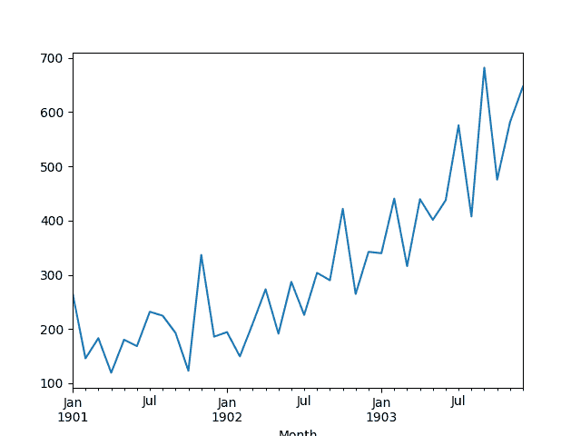
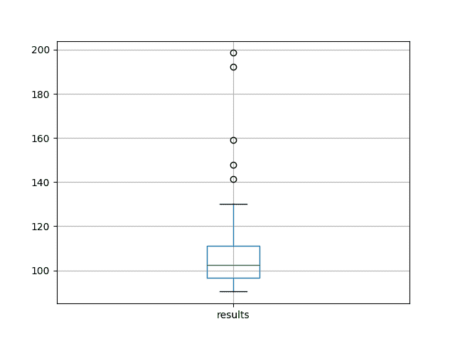

# 用于时间序列预测的有状态 LSTM 在线学习的不稳定性

> 原文： [https://machinelearningmastery.com/instability-online-learning-stateful-lstm-time-series-forecasting/](https://machinelearningmastery.com/instability-online-learning-stateful-lstm-time-series-forecasting/)

一些神经网络配置可能导致模型不稳定。

这可能会使用描述性统计量难以表征和比较同一问题的其他模型配置。

看似不稳定模型的一个很好的例子是使用有状态长短期记忆（LSTM）模型的在线学习（批量大小为 1）。

在本教程中，您将了解如何使用在线学习标准时间序列预测问题来探索有状态 LSTM 拟合的结果。

完成本教程后，您将了解：

*   如何设计一个强大的测试工具来评估 LSTM 模型的时间序列预测问题。
*   如何分析结果的总体，包括摘要统计，传播和结果分布。
*   如何分析增加实验重复次数的影响。

让我们开始吧。


用于时间序列预测的有状态 LSTM 在线学习的不稳定性
[Magnus Brath](https://www.flickr.com/photos/magnusbrath/5396568150/) 的照片，保留一些权利。

## 模型不稳定

当您在同一数据上多次训练相同的网络时，您可能会得到截然不同的结果。

这是因为神经网络是随机初始化的，并且它们如何适合训练数据的优化性质可导致网络内的不同最终权重。在给定相同输入数据的情况下，这些不同的网络可以反过来导致变化的预测。

因此，重复在神经网络上重复任何实验以找到平均预期表现是很重要的。

有关神经网络等机器学习算法的随机性的更多信息，请参阅帖子：

*   [在机器学习中拥抱随机性](http://machinelearningmastery.com/randomness-in-machine-learning/)

神经网络中的批量大小定义了在暴露于训练数据集的情况下网络中权重的更新频率。

批量大小为 1 意味着在每行训练数据之后更新网络权重。这称为在线学习。结果是一个可以快速学习的网络，但配置可能非常不稳定。

在本教程中，我们将探讨用于时间序列预测的有状态 LSTM 配置的在线学习的不稳定性。

我们将通过查看 LSTM 配置在标准时间序列预测问题上的平均表现来探索这一问题，该问题涉及可变数量的实验重复。

也就是说，我们将多次在相同数据上重新训练相同的模型配置，并在保留数据集上查看模型的表现，并查看模型的不稳定性。

## 教程概述

本教程分为 6 个部分。他们是：

1.  洗发水销售数据集
2.  实验测试线束
3.  代码和收集结果
4.  结果基本情况
5.  重复与测试 RMSE
6.  审查结果

### 环境

本教程假定您已安装 Python SciPy 环境。您可以在此示例中使用 Python 2 或 3。

本教程假设您安装了 TensorFlow 或 Theano 后端的 Keras v2.0 或更高版本。

本教程还假设您安装了 scikit-learn，Pandas，NumPy 和 Matplotlib。

接下来，让我们看看标准时间序列预测问题，我们可以将其用作此实验的上下文。

如果您在设置 Python 环境时需要帮助，请参阅以下帖子：

*   [如何使用 Anaconda 设置用于机器学习和深度学习的 Python 环境](http://machinelearningmastery.com/setup-python-environment-machine-learning-deep-learning-anaconda/)

## 洗发水销售数据集

该数据集描述了 3 年期间每月洗发水的销售数量。

单位是销售计数，有 36 个观察。原始数据集归功于 Makridakis，Wheelwright 和 Hyndman（1998）。

[您可以在此处下载并了解有关数据集的更多信息](https://datamarket.com/data/set/22r0/sales-of-shampoo-over-a-three-year-period)。

下面的示例加载并创建已加载数据集的图。

```py
# load and plot dataset
from pandas import read_csv
from pandas import datetime
from matplotlib import pyplot
# load dataset
def parser(x):
	return datetime.strptime('190'+x, '%Y-%m')
series = read_csv('shampoo-sales.csv', header=0, parse_dates=[0], index_col=0, squeeze=True, date_parser=parser)
# summarize first few rows
print(series.head())
# line plot
series.plot()
pyplot.show()
```

运行该示例将数据集作为 Pandas Series 加载并打印前 5 行。

```py
Month
1901-01-01 266.0
1901-02-01 145.9
1901-03-01 183.1
1901-04-01 119.3
1901-05-01 180.3
Name: Sales, dtype: float64
```

然后创建该系列的线图，显示明显的增加趋势。



洗发水销售数据集的线图

接下来，我们将了解实验中使用的 LSTM 配置和测试工具。

## 实验测试线束

本节介绍本教程中使用的测试工具。

### 数据拆分

我们将 Shampoo Sales 数据集分为两部分：训练和测试集。

前两年的数据将用于训练数据集，剩余的一年数据将用于测试集。

将使用训练数据集开发模型，并对测试数据集做出预测。

测试数据集的持久性预测（朴素预测）实现了每月洗发水销售 136.761 的错误。这在测试集上提供了较低的可接受表现限制。

### 模型评估

将使用滚动预测场景，也称为前进模型验证。

测试数据集的每个时间步骤将一次一个地走。将使用模型对时间步长做出预测，然后将获取测试集的实际预期值，并使其可用于下一时间步的预测模型。

这模仿了一个真实世界的场景，每个月都会有新的洗发水销售观察结果，并用于下个月的预测。

这将通过训练和测试数据集的结构进行模拟。

将收集关于测试数据集的所有预测，并计算错误分数以总结模型的技能。将使用均方根误差（RMSE），因为它会对大错误进行处罚，并产生与预测数据相同的分数，即每月洗发水销售额。

### 数据准备

在我们将 LSTM 模型拟合到数据集之前，我们必须转换数据。

在拟合模型和做出预测之前，对数据集执行以下三个数据变换。

1.  **转换时间序列数据，使其静止**。具体而言，滞后= 1 差分以消除数据中的增加趋势。
2.  **将时间序列转换为监督学习问题**。具体而言，将数据组织成输入和输出模式，其中前一时间步的观察被用作预测当前时间步的观察的输入
3.  **将观察结果转换为具有特定比例**。具体而言，要将数据重缩放为-1 到 1 之间的值，以满足 LSTM 模型的默认双曲正切激活函数。

这些变换在预测时反转，在计算和误差分数之前将它们恢复到原始比例。

### LSTM 模型

我们将使用基础状态 LSTM 模型，其中 1 个神经元适合 1000 个时期。

批量大小为 1 是必需的，因为我们将使用前向验证并对最后 12 个月的测试数据进行一步预测。

批量大小为 1 意味着该模型将使用在线训练（而不是批量训练或小批量训练）。因此，预计模型拟合将具有一些变化。

理想情况下，将使用更多的训练时期（例如 1500），但这被截断为 1000 以保持运行时间合理。

使用有效的 ADAM 优化算法和均方误差损失函数来拟合模型。

### 实验运行

每个实验场景将运行 100 次，并且测试集上的 RMSE 得分将从每次运行结束时记录。

所有测试 RMSE 分数都写入文件以供以后分析。

让我们深入研究实验。

## 代码和收集结果

完整的代码清单如下。

在现代硬件上运行可能需要几个小时。

```py
from pandas import DataFrame
from pandas import Series
from pandas import concat
from pandas import read_csv
from pandas import datetime
from sklearn.metrics import mean_squared_error
from sklearn.preprocessing import MinMaxScaler
from keras.models import Sequential
from keras.layers import Dense
from keras.layers import LSTM
from math import sqrt
import matplotlib
import numpy
from numpy import concatenate

# date-time parsing function for loading the dataset
def parser(x):
	return datetime.strptime('190'+x, '%Y-%m')

# frame a sequence as a supervised learning problem
def timeseries_to_supervised(data, lag=1):
	df = DataFrame(data)
	columns = [df.shift(i) for i in range(1, lag+1)]
	columns.append(df)
	df = concat(columns, axis=1)
	return df

# create a differenced series
def difference(dataset, interval=1):
	diff = list()
	for i in range(interval, len(dataset)):
		value = dataset[i] - dataset[i - interval]
		diff.append(value)
	return Series(diff)

# invert differenced value
def inverse_difference(history, yhat, interval=1):
	return yhat + history[-interval]

# scale train and test data to [-1, 1]
def scale(train, test):
	# fit scaler
	scaler = MinMaxScaler(feature_range=(-1, 1))
	scaler = scaler.fit(train)
	# transform train
	train = train.reshape(train.shape[0], train.shape[1])
	train_scaled = scaler.transform(train)
	# transform test
	test = test.reshape(test.shape[0], test.shape[1])
	test_scaled = scaler.transform(test)
	return scaler, train_scaled, test_scaled

# inverse scaling for a forecasted value
def invert_scale(scaler, X, yhat):
	new_row = [x for x in X] + [yhat]
	array = numpy.array(new_row)
	array = array.reshape(1, len(array))
	inverted = scaler.inverse_transform(array)
	return inverted[0, -1]

# fit an LSTM network to training data
def fit_lstm(train, batch_size, nb_epoch, neurons):
	X, y = train[:, 0:-1], train[:, -1]
	X = X.reshape(X.shape[0], 1, X.shape[1])
	model = Sequential()
	model.add(LSTM(neurons, batch_input_shape=(batch_size, X.shape[1], X.shape[2]), stateful=True))
	model.add(Dense(1))
	model.compile(loss='mean_squared_error', optimizer='adam')
	for i in range(nb_epoch):
		model.fit(X, y, epochs=1, batch_size=batch_size, verbose=0, shuffle=False)
		model.reset_states()
	return model

# make a one-step forecast
def forecast_lstm(model, batch_size, X):
	X = X.reshape(1, 1, len(X))
	yhat = model.predict(X, batch_size=batch_size)
	return yhat[0,0]

# run a repeated experiment
def experiment(repeats, series):
	# transform data to be stationary
	raw_values = series.values
	diff_values = difference(raw_values, 1)
	# transform data to be supervised learning
	supervised = timeseries_to_supervised(diff_values, 1)
	supervised_values = supervised.values[1:,:]
	# split data into train and test-sets
	train, test = supervised_values[0:-12, :], supervised_values[-12:, :]
	# transform the scale of the data
	scaler, train_scaled, test_scaled = scale(train, test)
	# run experiment
	error_scores = list()
	for r in range(repeats):
		# fit the base model
		lstm_model = fit_lstm(train_scaled, 1, 1000, 1)
		# forecast test dataset
		predictions = list()
		for i in range(len(test_scaled)):
			# predict
			X, y = test_scaled[i, 0:-1], test_scaled[i, -1]
			yhat = forecast_lstm(lstm_model, 1, X)
			# invert scaling
			yhat = invert_scale(scaler, X, yhat)
			# invert differencing
			yhat = inverse_difference(raw_values, yhat, len(test_scaled)+1-i)
			# store forecast
			predictions.append(yhat)
		# report performance
		rmse = sqrt(mean_squared_error(raw_values[-12:], predictions))
		print('%d) Test RMSE: %.3f' % (r+1, rmse))
		error_scores.append(rmse)
	return error_scores

# execute the experiment
def run():
	# load dataset
	series = read_csv('shampoo-sales.csv', header=0, parse_dates=[0], index_col=0, squeeze=True, date_parser=parser)
	# experiment
	repeats = 100
	results = DataFrame()
	# run experiment
	results['results'] = experiment(repeats, series)
	# summarize results
	print(results.describe())
	# save results
	results.to_csv('experiment_stateful.csv', index=False)

 # entry point
run()
```

运行实验会在测试数据集中保存拟合模型的 RMSE 分数。

结果保存到文件“`experiment_stateful.csv`”。

下面提供了截断的结果列表。

自己重新运行实验可能会给出不同的结果，因为我们没有为随机数生成器播种。

```py
...
116.39769471284067
105.0459745537738
93.57827109861229
128.973001927212
97.02915084460737
198.56877142225886
113.09568645243242
97.84127724751188
124.60413895331735
111.62139008607713
```

## 结果基本情况

我们可以从计算 100 个测试 RMSE 分数的整个人口的一些基本统计量开始。

通常，我们希望机器学习结果具有高斯分布。这允许我们报告模型的平均值和标准偏差，并在对看不见的数据做出预测时指示模型的置信区间。

下面的代码段会加载结果文件并计算一些描述性统计量。

```py
from pandas import DataFrame
from pandas import read_csv
from numpy import mean
from numpy import std
from matplotlib import pyplot
# load results file
results = read_csv('experiment_stateful.csv', header=0)
# descriptive stats
print(results.describe())
# box and whisker plot
results.boxplot()
pyplot.show()
```

运行该示例将从结果中打印描述性统计量。

我们可以看到，平均而言，该配置实现了约 107 个月洗发水销售的 RMSE，标准偏差约为 17。

我们还可以看到观察到的最佳测试 RMSE 大约是 90 个销售，而更差的是不到 200 个，这是相当多的分数。

```py
          results
count  100.000000
mean   107.051146
std     17.694512
min     90.407323
25%     96.630800
50%    102.603908
75%    111.199574
max    198.568771
```

为了更好地了解数据的传播，还创建了一个盒子和胡须图。

该图显示了中位数（绿线），中间 50％的数据（框）和异常值（点）。我们可以看到数据差异很大，导致 RMSE 评分不佳。



在洗发水销售数据集上的 100 个测试 RMSE 分数的盒子和晶须图

还创建原始结果值的直方图。

该图表示倾斜甚至是指数分布，其质量在 RMSE 为 100 左右，长尾导向 RMSE 为 200。

结果的分布显然不是高斯分布。这是不幸的，因为平均值和标准偏差不能直接用于估计模型的置信区间（例如 [95％置信度为平均值](https://en.wikipedia.org/wiki/68%E2%80%9395%E2%80%9399.7_rule)附近标准偏差的 2 倍）。

偏态分布还强调，中位数（第 50 百分位数）将是更好的集中趋势，而不是使用这些结果的均值。对于异常结果，中位数应该比平均值更稳健。


洗发水销售数据集中测试 RMSE 评分的直方图

## 重复与测试 RMSE

我们可以开始研究实验的摘要统计量如何随着重复次数从 1 增加到 100 而改变。

我们可以累积测试 RMSE 分数并计算描述性统计量。例如，来自一次重复的得分，来自第一次和第二次重复的得分，来自前三次重复的得分，等等至 100 次重复。

我们可以回顾一下中心趋势如何随着线图的重复次数的增加而变化。我们将看看均值和中位数。

一般来说，我们预计随着实验重复次数的增加，分布将越来越好地与基础分布相匹配，包括中心趋势，如均值。

完整的代码清单如下。

```py
from pandas import DataFrame
from pandas import read_csv
from numpy import median
from numpy import mean
from matplotlib import pyplot
import numpy
# load results file
results = read_csv('experiment_stateful.csv', header=0)
values = results.values
# collect cumulative stats
medians, means = list(), list()
for i in range(1,len(values)+1):
	data = values[0:i, 0]
	mean_rmse, median_rmse = mean(data), median(data)
	means.append(mean_rmse)
	medians.append(median_rmse)
	print(i, mean_rmse, median_rmse)
# line plot of cumulative values
line1, = pyplot.plot(medians, label='Median RMSE')
line2, = pyplot.plot(means, label='Mean RMSE')
pyplot.legend(handles=[line1, line2])
pyplot.show()
```

随着重复次数的增加，打印分布的累积大小，平均值和中值。截断的输出如下所示。

```py
...
90 105.759546832 101.477640071
91 105.876449555 102.384620485
92 105.867422653 102.458057114
93 105.735281239 102.384620485
94 105.982491033 102.458057114
95 105.888245347 102.384620485
96 106.853667494 102.458057114
97 106.918018205 102.531493742
98 106.825398399 102.458057114
99 107.004981637 102.531493742
100 107.051145721 102.603907965
```

还创建了线图，显示随着重复次数的增加，平均值和中位数如何变化。

结果表明，正如预期的那样，平均值受异常值结果的影响大于中位数。

我们可以看到中位数在 99-100 附近看起来相当稳定。在情节结束时跳跃到 102，表明在后来的重复中出现了一系列较差的 RMSE 分数。


平均值和中值测试 RMSE 与重复次数的线图

## 审查结果

我们根据标准时间序列预测问题对有状态 LSTM 的 100 次重复进行了一些有用的观察。

特别：

*   我们观察到结果的分布不是高斯分布。它可能是倾斜的高斯分布或具有长尾和异常值的指数分布。
*   我们观察到结果的分布不随着重复从 1 增加到 100 而稳定。

观察结果表明了一些重要的特性：

*   LSTM 和问题的在线学习的选择导致相对不稳定的模型。
*   所选择的重复次数（100）可能不足以表征模型的行为。

这是一个有用的发现，因为从 100 次或更少的实验重复中对模型做出有力的结论是错误的。

在描述您自己的机器学习结果时，这是一个需要考虑的重要注意事项。

这表明该实验有一些扩展，例如：

*   探索重复次数对更稳定模型的影响，例如使用批量或小批量学习的模型。
*   将重复次数增加到数千或更多，以试图通过在线学习解释模型的一般不稳定性。

## 摘要

在本教程中，您了解了如何使用在线学习分析 LSTM 模型的实验结果。

你了解到：

*   如何设计一个强大的测试工具来评估 LSTM 模型的时间序列预测问题。
*   如何分析实验结果，包括汇总统计。
*   如何分析增加实验重复次数的影响以及如何识别不稳定模型。

你有任何问题吗？
在下面的评论中提出您的问题，我会尽力回答。