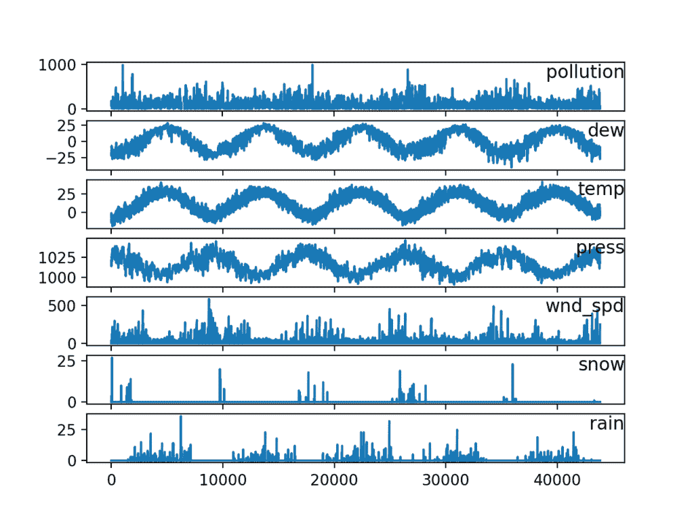
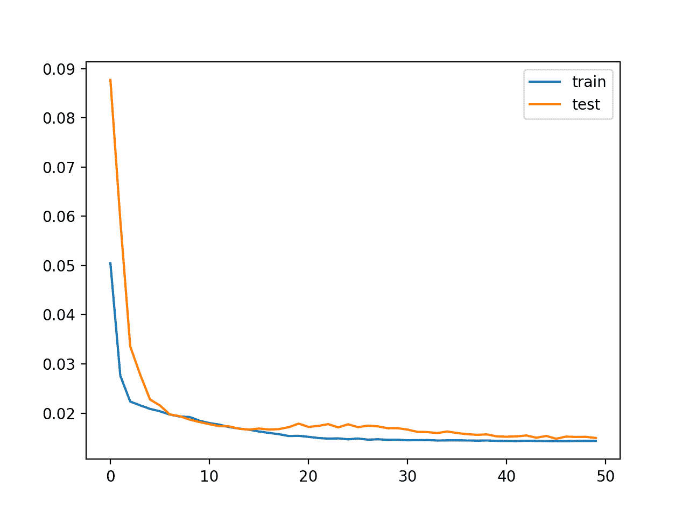

# Keras 中使用 LSTM 的多变量时间序列预测

> 原文： [https://machinelearningmastery.com/multivariate-time-series-forecasting-lstms-keras/](https://machinelearningmastery.com/multivariate-time-series-forecasting-lstms-keras/)

像长短期记忆（LSTM）循环神经网络这样的神经网络能够几乎无缝地模拟多个输入变量的问题。

这在时间序列预测中是一个很大的好处，其中经典线性方法难以适应多变量或多输入预测问题。

在本教程中，您将了解如何在 Keras 深度学习库中为多变量时间序列预测开发 LSTM 模型。

完成本教程后，您将了解：

*   如何将原始数据集转换为可用于时间序列预测的内容。
*   如何准备数据并使 LSTM 适合多变量时间序列预测问题。
*   如何做出预测并将结果重缩放回原始单位。

让我们开始吧。

*   **2017 年 8 月更新**：修正了在计算最终 RMSE 时与前一时间段的 obs 进行比较的错误。谢谢，Songbin Xu 和 David Righart。
*   **2017 年 10 月更新**：添加了一个新示例，显示如何根据大众需求训练多个先前时间步骤。
*   **Update Sep / 2018** ：更新了数据集的链接。

## 教程概述

本教程分为 3 个部分;他们是：

1.  空气污染预测
2.  基本数据准备
3.  多变量 LSTM 预测模型

### Python 环境

本教程假定您已安装 Python SciPy 环境。您可以在本教程中使用 Python 2 或 3。

您必须安装带有 TensorFlow 或 Theano 后端的 Keras（2.0 或更高版本）。

本教程还假设您安装了 scikit-learn，Pandas，NumPy 和 Matplotlib。

如果您需要有关环境的帮助，请参阅此帖子：

*   [如何使用 Anaconda 设置用于机器学习和深度学习的 Python 环境](http://machinelearningmastery.com/setup-python-environment-machine-learning-deep-learning-anaconda/)

## 1.空气污染预测

在本教程中，我们将使用空气质量数据集。

这是一个数据集，在美国驻中国大使馆报告五年来每小时的天气和污染程度。

数据包括日期时间，称为 PM2.5 浓度的污染，以及包括露点，温度，压力，风向，风速和累积的下雪小时数的天气信息。原始数据中的完整功能列表如下：

1.  **否**：行号
2.  **年**：此行中的数据年份
3.  **月**：此行中的数据月份
4.  **天**：此行中的数据日
5.  **小时**：此行中的数据小时数
6.  **pm2.5** ：PM2.5 浓度
7.  **DEWP** ：露点
8.  **TEMP** ：温度
9.  **PRES** ：压力
10.  **cbwd** ：风向相结合
11.  **Iws** ：累积风速
12.  ：积雪累积了几个小时
13.  **Ir** ：累计下雨时间

我们可以使用这些数据并构建一个预测问题，考虑到前一个小时的天气条件和污染，我们预测下一个小时的污染。

此数据集可用于构建其他预测问题。
你有好主意吗？请在下面的评论中告诉我。

您可以从 UCI 机器学习库下载数据集。

**更新**，我在这里镜像了数据集，因为 UCI 变得不可靠：

*   [北京 PM2.5 数据集](https://raw.githubusercontent.com/jbrownlee/Datasets/master/pollution.csv)

下载数据集并将其放在当前工作目录中，文件名为“`raw.csv`”。

## 2.基本数据准备

数据尚未准备好使用。我们必须先做好准备。

下面是原始数据集的前几行。

```py
No,year,month,day,hour,pm2.5,DEWP,TEMP,PRES,cbwd,Iws,Is,Ir
1,2010,1,1,0,NA,-21,-11,1021,NW,1.79,0,0
2,2010,1,1,1,NA,-21,-12,1020,NW,4.92,0,0
3,2010,1,1,2,NA,-21,-11,1019,NW,6.71,0,0
4,2010,1,1,3,NA,-21,-14,1019,NW,9.84,0,0
5,2010,1,1,4,NA,-20,-12,1018,NW,12.97,0,0
```

第一步是将日期时间信息合并为一个日期时间，以便我们可以将其用作 Pandas 中的索引。

快速检查显示前 24 小时内 pm2.5 的 NA 值。因此，我们需要删除第一行数据。在数据集的后面还有一些分散的“NA”值;我们现在可以用 0 值标记它们。

下面的脚本加载原始数据集并将日期时间信息解析为 Pandas DataFrame 索引。删除“否”列，然后为每列指定更清晰的名称。最后，将 NA 值替换为“0”值，并删除前 24 小时。

删除“否”列，然后为每列指定更清晰的名称。最后，将 NA 值替换为“0”值，并删除前 24 小时。

```py
from pandas import read_csv
from datetime import datetime
# load data
def parse(x):
	return datetime.strptime(x, '%Y %m %d %H')
dataset = read_csv('raw.csv',  parse_dates = [['year', 'month', 'day', 'hour']], index_col=0, date_parser=parse)
dataset.drop('No', axis=1, inplace=True)
# manually specify column names
dataset.columns = ['pollution', 'dew', 'temp', 'press', 'wnd_dir', 'wnd_spd', 'snow', 'rain']
dataset.index.name = 'date'
# mark all NA values with 0
dataset['pollution'].fillna(0, inplace=True)
# drop the first 24 hours
dataset = dataset[24:]
# summarize first 5 rows
print(dataset.head(5))
# save to file
dataset.to_csv('pollution.csv')
```

运行该示例将打印转换数据集的前 5 行，并将数据集保存到“`pollution.csv`”。

```py
                     pollution  dew  temp   press wnd_dir  wnd_spd  snow  rain
date
2010-01-02 00:00:00      129.0  -16  -4.0  1020.0      SE     1.79     0     0
2010-01-02 01:00:00      148.0  -15  -4.0  1020.0      SE     2.68     0     0
2010-01-02 02:00:00      159.0  -11  -5.0  1021.0      SE     3.57     0     0
2010-01-02 03:00:00      181.0   -7  -5.0  1022.0      SE     5.36     1     0
2010-01-02 04:00:00      138.0   -7  -5.0  1022.0      SE     6.25     2     0
```

现在我们以易于使用的形式获得数据，我们可以创建每个系列的快速绘图并查看我们拥有的内容。

下面的代码加载新的“`pollution.csv`”文件，并将每个系列绘制为一个单独的子图，除了风速 dir，这是绝对的。

```py
from pandas import read_csv
from matplotlib import pyplot
# load dataset
dataset = read_csv('pollution.csv', header=0, index_col=0)
values = dataset.values
# specify columns to plot
groups = [0, 1, 2, 3, 5, 6, 7]
i = 1
# plot each column
pyplot.figure()
for group in groups:
	pyplot.subplot(len(groups), 1, i)
	pyplot.plot(values[:, group])
	pyplot.title(dataset.columns[group], y=0.5, loc='right')
	i += 1
pyplot.show()
```

运行该示例将创建一个包含 7 个子图的图，显示每个变量的 5 年数据。



空气污染时间序列的线图

## 3.多变量 LSTM 预测模型

在本节中，我们将使 LSTM 适应问题。

### LSTM 数据准备

第一步是为 LSTM 准备污染数据集。

这涉及将数据集构建为监督学习问题并对输入变量进行标准化。

考虑到污染测量和前一时间步的天气条件，我们将监督学习问题定为预测当前小时（t）的污染。

这个表述很简单，只是为了这个演示。您可以探索的其他一些秘籍包括：

*   根据过去 24 小时内的天气状况和污染情况预测下一小时的污染情况。
*   如上所述预测下一小时的污染，并给出下一小时的“预期”天气状况。

我们可以使用博客文章中开发的`series_to_supervised()`函数来转换数据集：

*   [如何将时间序列转换为 Python 中的监督学习问题](http://machinelearningmastery.com/convert-time-series-supervised-learning-problem-python/)

首先，加载“`pollution.csv`”数据集。风速特征是标签编码的（整数编码）。如果您有兴趣探索它，将来可能会进一步编码。

接下来，将所有特征标准化，然后将数据集转换为监督学习问题。然后移除要预测的小时（t）的天气变量。

完整的代码清单如下。

```py
# convert series to supervised learning
def series_to_supervised(data, n_in=1, n_out=1, dropnan=True):
	n_vars = 1 if type(data) is list else data.shape[1]
	df = DataFrame(data)
	cols, names = list(), list()
	# input sequence (t-n, ... t-1)
	for i in range(n_in, 0, -1):
		cols.append(df.shift(i))
		names += [('var%d(t-%d)' % (j+1, i)) for j in range(n_vars)]
	# forecast sequence (t, t+1, ... t+n)
	for i in range(0, n_out):
		cols.append(df.shift(-i))
		if i == 0:
			names += [('var%d(t)' % (j+1)) for j in range(n_vars)]
		else:
			names += [('var%d(t+%d)' % (j+1, i)) for j in range(n_vars)]
	# put it all together
	agg = concat(cols, axis=1)
	agg.columns = names
	# drop rows with NaN values
	if dropnan:
		agg.dropna(inplace=True)
	return agg

# load dataset
dataset = read_csv('pollution.csv', header=0, index_col=0)
values = dataset.values
# integer encode direction
encoder = LabelEncoder()
values[:,4] = encoder.fit_transform(values[:,4])
# ensure all data is float
values = values.astype('float32')
# normalize features
scaler = MinMaxScaler(feature_range=(0, 1))
scaled = scaler.fit_transform(values)
# frame as supervised learning
reframed = series_to_supervised(scaled, 1, 1)
# drop columns we don't want to predict
reframed.drop(reframed.columns[[9,10,11,12,13,14,15]], axis=1, inplace=True)
print(reframed.head())
```

运行该示例将打印转换后的数据集的前 5 行。我们可以看到 8 个输入变量（输入系列）和 1 个输出变量（当前小时的污染水平）。

```py
   var1(t-1)  var2(t-1)  var3(t-1)  var4(t-1)  var5(t-1)  var6(t-1)  \
1   0.129779   0.352941   0.245902   0.527273   0.666667   0.002290
2   0.148893   0.367647   0.245902   0.527273   0.666667   0.003811
3   0.159960   0.426471   0.229508   0.545454   0.666667   0.005332
4   0.182093   0.485294   0.229508   0.563637   0.666667   0.008391
5   0.138833   0.485294   0.229508   0.563637   0.666667   0.009912

   var7(t-1)  var8(t-1)   var1(t)
1   0.000000        0.0  0.148893
2   0.000000        0.0  0.159960
3   0.000000        0.0  0.182093
4   0.037037        0.0  0.138833
5   0.074074        0.0  0.109658
```

这个数据准备很简单，我们可以探索更多。您可以看到的一些想法包括：

*   单热编码风速。
*   通过差分和季节性调整使所有系列保持静止。
*   提供超过 1 小时的输入时间步长。

考虑到学习序列预测问题时 LSTM 在时间上使用反向传播，最后一点可能是最重要的。

### 定义和拟合模型

在本节中，我们将在多变量输入数据上拟合 LSTM。

首先，我们必须将准备好的数据集拆分为训练集和测试集。为了加速本演示模型的训练，我们只在数据的第一年拟合模型，然后在剩余的 4 年数据上进行评估。如果您有时间，请考虑探索此测试工具的倒置版本。

下面的示例将数据集拆分为训练集和测试集，然后将训练集和测试集拆分为输入和输出变量。最后，输入（X）被重新整形为 LSTM 所期望的 3D 格式，即[样本，时间步长，特征]。

```py
# split into train and test sets
values = reframed.values
n_train_hours = 365 * 24
train = values[:n_train_hours, :]
test = values[n_train_hours:, :]
# split into input and outputs
train_X, train_y = train[:, :-1], train[:, -1]
test_X, test_y = test[:, :-1], test[:, -1]
# reshape input to be 3D [samples, timesteps, features]
train_X = train_X.reshape((train_X.shape[0], 1, train_X.shape[1]))
test_X = test_X.reshape((test_X.shape[0], 1, test_X.shape[1]))
print(train_X.shape, train_y.shape, test_X.shape, test_y.shape)
```

运行此示例打印训练的形状并测试输入和输出集，其中大约 9K 小时的数据用于训练，大约 35K 小时用于测试。

```py
(8760, 1, 8) (8760,) (35039, 1, 8) (35039,)
```

现在我们可以定义和拟合我们的 LSTM 模型。

我们将定义 LSTM，在第一个隐藏层中有 50 个神经元，在输出层中有 1 个神经元用于预测污染。输入形状将是 1 个步骤，具有 8 个功能。

我们将使用平均绝对误差（MAE）损失函数和随机梯度下降的有效 Adam 版本。

该模型适用于批量大小为 72 的 50 个训练时期。请记住，Keras 中 LSTM 的内部状态在每个批次结束时重置，因此内部状态可能是若干天的函数。有帮助（试试这个）。

最后，我们通过在 fit（）函数中设置`validation_data`参数来跟踪训练期间的训练和测试丢失。在运行结束时，绘制训练和测试损失。

```py
# design network
model = Sequential()
model.add(LSTM(50, input_shape=(train_X.shape[1], train_X.shape[2])))
model.add(Dense(1))
model.compile(loss='mae', optimizer='adam')
# fit network
history = model.fit(train_X, train_y, epochs=50, batch_size=72, validation_data=(test_X, test_y), verbose=2, shuffle=False)
# plot history
pyplot.plot(history.history['loss'], label='train')
pyplot.plot(history.history['val_loss'], label='test')
pyplot.legend()
pyplot.show()
```

### 评估模型

在模型拟合后，我们可以预测整个测试数据集。

我们将预测与测试数据集结合起来并反转缩放。我们还使用预期的污染数反转测试数据集上的缩放。

通过原始比例的预测和实际值，我们可以计算模型的误差分数。在这种情况下，我们计算出均方误差（RMSE），它以与变量本身相同的单位给出误差。

```py
# make a prediction
yhat = model.predict(test_X)
test_X = test_X.reshape((test_X.shape[0], test_X.shape[2]))
# invert scaling for forecast
inv_yhat = concatenate((yhat, test_X[:, 1:]), axis=1)
inv_yhat = scaler.inverse_transform(inv_yhat)
inv_yhat = inv_yhat[:,0]
# invert scaling for actual
test_y = test_y.reshape((len(test_y), 1))
inv_y = concatenate((test_y, test_X[:, 1:]), axis=1)
inv_y = scaler.inverse_transform(inv_y)
inv_y = inv_y[:,0]
# calculate RMSE
rmse = sqrt(mean_squared_error(inv_y, inv_yhat))
print('Test RMSE: %.3f' % rmse)
```

### 完整的例子

下面列出了完整的示例。

**注**：此示例假设您已正确准备数据，例如将下载的“`raw.csv`”转换为准备好的“`pollution.csv`”。请参阅本教程的第一部分。

```py
from math import sqrt
from numpy import concatenate
from matplotlib import pyplot
from pandas import read_csv
from pandas import DataFrame
from pandas import concat
from sklearn.preprocessing import MinMaxScaler
from sklearn.preprocessing import LabelEncoder
from sklearn.metrics import mean_squared_error
from keras.models import Sequential
from keras.layers import Dense
from keras.layers import LSTM

# convert series to supervised learning
def series_to_supervised(data, n_in=1, n_out=1, dropnan=True):
	n_vars = 1 if type(data) is list else data.shape[1]
	df = DataFrame(data)
	cols, names = list(), list()
	# input sequence (t-n, ... t-1)
	for i in range(n_in, 0, -1):
		cols.append(df.shift(i))
		names += [('var%d(t-%d)' % (j+1, i)) for j in range(n_vars)]
	# forecast sequence (t, t+1, ... t+n)
	for i in range(0, n_out):
		cols.append(df.shift(-i))
		if i == 0:
			names += [('var%d(t)' % (j+1)) for j in range(n_vars)]
		else:
			names += [('var%d(t+%d)' % (j+1, i)) for j in range(n_vars)]
	# put it all together
	agg = concat(cols, axis=1)
	agg.columns = names
	# drop rows with NaN values
	if dropnan:
		agg.dropna(inplace=True)
	return agg

# load dataset
dataset = read_csv('pollution.csv', header=0, index_col=0)
values = dataset.values
# integer encode direction
encoder = LabelEncoder()
values[:,4] = encoder.fit_transform(values[:,4])
# ensure all data is float
values = values.astype('float32')
# normalize features
scaler = MinMaxScaler(feature_range=(0, 1))
scaled = scaler.fit_transform(values)
# frame as supervised learning
reframed = series_to_supervised(scaled, 1, 1)
# drop columns we don't want to predict
reframed.drop(reframed.columns[[9,10,11,12,13,14,15]], axis=1, inplace=True)
print(reframed.head())

# split into train and test sets
values = reframed.values
n_train_hours = 365 * 24
train = values[:n_train_hours, :]
test = values[n_train_hours:, :]
# split into input and outputs
train_X, train_y = train[:, :-1], train[:, -1]
test_X, test_y = test[:, :-1], test[:, -1]
# reshape input to be 3D [samples, timesteps, features]
train_X = train_X.reshape((train_X.shape[0], 1, train_X.shape[1]))
test_X = test_X.reshape((test_X.shape[0], 1, test_X.shape[1]))
print(train_X.shape, train_y.shape, test_X.shape, test_y.shape)

# design network
model = Sequential()
model.add(LSTM(50, input_shape=(train_X.shape[1], train_X.shape[2])))
model.add(Dense(1))
model.compile(loss='mae', optimizer='adam')
# fit network
history = model.fit(train_X, train_y, epochs=50, batch_size=72, validation_data=(test_X, test_y), verbose=2, shuffle=False)
# plot history
pyplot.plot(history.history['loss'], label='train')
pyplot.plot(history.history['val_loss'], label='test')
pyplot.legend()
pyplot.show()

# make a prediction
yhat = model.predict(test_X)
test_X = test_X.reshape((test_X.shape[0], test_X.shape[2]))
# invert scaling for forecast
inv_yhat = concatenate((yhat, test_X[:, 1:]), axis=1)
inv_yhat = scaler.inverse_transform(inv_yhat)
inv_yhat = inv_yhat[:,0]
# invert scaling for actual
test_y = test_y.reshape((len(test_y), 1))
inv_y = concatenate((test_y, test_X[:, 1:]), axis=1)
inv_y = scaler.inverse_transform(inv_y)
inv_y = inv_y[:,0]
# calculate RMSE
rmse = sqrt(mean_squared_error(inv_y, inv_yhat))
print('Test RMSE: %.3f' % rmse)
```

首先运行该示例创建一个图表，显示训练期间的训练和测试损失。

有趣的是，我们可以看到测试损失低于训练损失。该模型可能过拟合训练数据。在训练期间测量和绘制 RMSE 可能会对此有所了解。


训练期间多变量 LSTM 的训练线路和试验损失

训练和测试损失在每个训练时期结束时打印。在运行结束时，将打印测试数据集上模型的最终 RMSE。

我们可以看到该模型实现了 26.496 的可观 RMSE，低于使用持久性模型找到的 30 的 RMSE。

```py
...
Epoch 46/50
0s - loss: 0.0143 - val_loss: 0.0133
Epoch 47/50
0s - loss: 0.0143 - val_loss: 0.0133
Epoch 48/50
0s - loss: 0.0144 - val_loss: 0.0133
Epoch 49/50
0s - loss: 0.0143 - val_loss: 0.0133
Epoch 50/50
0s - loss: 0.0144 - val_loss: 0.0133
Test RMSE: 26.496
```

此模型未调整。你能做得更好吗？
请在下面的评论中告诉我您的问题框架，模型配置和 RMSE。

## 更新：训练多个滞后时间步长示例

关于如何调整上述示例以在多个先前时间步骤上训练模型，已经有许多关于建议的请求。

在编写原始帖子时，我尝试了这个以及无数其他配置，并决定不包括它们，因为他们没有提升模型技能。

尽管如此，我已将此示例作为参考模板包含在内，您可以根据自己的问题进行调整。

在多个先前时间步骤上训练模型所需的更改非常小，如下所示：

首先，在调用 series_to_supervised（）时必须适当地构建问题。我们将使用 3 小时的数据作为输入。另请注意，我们不再明确地删除 ob（t）处所有其他字段中的列。

```py
# specify the number of lag hours
n_hours = 3
n_features = 8
# frame as supervised learning
reframed = series_to_supervised(scaled, n_hours, 1)
```

接下来，我们需要更加谨慎地指定输入和输出列。

我们的框架数据集中有 3 * 8 + 8 列。我们将在前 3 个小时内将 3 * 8 或 24 列作为所有功能的视角输入。我们将在下一个小时将污染变量作为输出，如下所示：

```py
# split into input and outputs
n_obs = n_hours * n_features
train_X, train_y = train[:, :n_obs], train[:, -n_features]
test_X, test_y = test[:, :n_obs], test[:, -n_features]
print(train_X.shape, len(train_X), train_y.shape)
```

接下来，我们可以正确地重塑输入数据以反映时间步骤和功能。

```py
# reshape input to be 3D [samples, timesteps, features]
train_X = train_X.reshape((train_X.shape[0], n_hours, n_features))
test_X = test_X.reshape((test_X.shape[0], n_hours, n_features))
```

拟合模型是一样的。

唯一的另一个小变化是如何评估模型。具体来说，我们如何重建具有 8 列的行，这些行适合于反转缩放操作以使 y 和 yhat 返回到原始比例，以便我们可以计算 RMSE。

更改的要点是我们将 y 或 yhat 列与测试数据集的最后 7 个特征连接起来，以便反转缩放，如下所示：

```py
# invert scaling for forecast
inv_yhat = concatenate((yhat, test_X[:, -7:]), axis=1)
inv_yhat = scaler.inverse_transform(inv_yhat)
inv_yhat = inv_yhat[:,0]
# invert scaling for actual
test_y = test_y.reshape((len(test_y), 1))
inv_y = concatenate((test_y, test_X[:, -7:]), axis=1)
inv_y = scaler.inverse_transform(inv_y)
inv_y = inv_y[:,0]
```

我们可以将所有这些修改与上述示例结合在一起。下面列出了具有多个滞后输入的多变量时间序列预测的完整示例：

```py
from math import sqrt
from numpy import concatenate
from matplotlib import pyplot
from pandas import read_csv
from pandas import DataFrame
from pandas import concat
from sklearn.preprocessing import MinMaxScaler
from sklearn.preprocessing import LabelEncoder
from sklearn.metrics import mean_squared_error
from keras.models import Sequential
from keras.layers import Dense
from keras.layers import LSTM

# convert series to supervised learning
def series_to_supervised(data, n_in=1, n_out=1, dropnan=True):
	n_vars = 1 if type(data) is list else data.shape[1]
	df = DataFrame(data)
	cols, names = list(), list()
	# input sequence (t-n, ... t-1)
	for i in range(n_in, 0, -1):
		cols.append(df.shift(i))
		names += [('var%d(t-%d)' % (j+1, i)) for j in range(n_vars)]
	# forecast sequence (t, t+1, ... t+n)
	for i in range(0, n_out):
		cols.append(df.shift(-i))
		if i == 0:
			names += [('var%d(t)' % (j+1)) for j in range(n_vars)]
		else:
			names += [('var%d(t+%d)' % (j+1, i)) for j in range(n_vars)]
	# put it all together
	agg = concat(cols, axis=1)
	agg.columns = names
	# drop rows with NaN values
	if dropnan:
		agg.dropna(inplace=True)
	return agg

# load dataset
dataset = read_csv('pollution.csv', header=0, index_col=0)
values = dataset.values
# integer encode direction
encoder = LabelEncoder()
values[:,4] = encoder.fit_transform(values[:,4])
# ensure all data is float
values = values.astype('float32')
# normalize features
scaler = MinMaxScaler(feature_range=(0, 1))
scaled = scaler.fit_transform(values)
# specify the number of lag hours
n_hours = 3
n_features = 8
# frame as supervised learning
reframed = series_to_supervised(scaled, n_hours, 1)
print(reframed.shape)

# split into train and test sets
values = reframed.values
n_train_hours = 365 * 24
train = values[:n_train_hours, :]
test = values[n_train_hours:, :]
# split into input and outputs
n_obs = n_hours * n_features
train_X, train_y = train[:, :n_obs], train[:, -n_features]
test_X, test_y = test[:, :n_obs], test[:, -n_features]
print(train_X.shape, len(train_X), train_y.shape)
# reshape input to be 3D [samples, timesteps, features]
train_X = train_X.reshape((train_X.shape[0], n_hours, n_features))
test_X = test_X.reshape((test_X.shape[0], n_hours, n_features))
print(train_X.shape, train_y.shape, test_X.shape, test_y.shape)

# design network
model = Sequential()
model.add(LSTM(50, input_shape=(train_X.shape[1], train_X.shape[2])))
model.add(Dense(1))
model.compile(loss='mae', optimizer='adam')
# fit network
history = model.fit(train_X, train_y, epochs=50, batch_size=72, validation_data=(test_X, test_y), verbose=2, shuffle=False)
# plot history
pyplot.plot(history.history['loss'], label='train')
pyplot.plot(history.history['val_loss'], label='test')
pyplot.legend()
pyplot.show()

# make a prediction
yhat = model.predict(test_X)
test_X = test_X.reshape((test_X.shape[0], n_hours*n_features))
# invert scaling for forecast
inv_yhat = concatenate((yhat, test_X[:, -7:]), axis=1)
inv_yhat = scaler.inverse_transform(inv_yhat)
inv_yhat = inv_yhat[:,0]
# invert scaling for actual
test_y = test_y.reshape((len(test_y), 1))
inv_y = concatenate((test_y, test_X[:, -7:]), axis=1)
inv_y = scaler.inverse_transform(inv_y)
inv_y = inv_y[:,0]
# calculate RMSE
rmse = sqrt(mean_squared_error(inv_y, inv_yhat))
print('Test RMSE: %.3f' % rmse)
```

该模型在一两分钟内就像以前一样合适。

```py
...
Epoch 45/50
1s - loss: 0.0143 - val_loss: 0.0154
Epoch 46/50
1s - loss: 0.0143 - val_loss: 0.0148
Epoch 47/50
1s - loss: 0.0143 - val_loss: 0.0152
Epoch 48/50
1s - loss: 0.0143 - val_loss: 0.0151
Epoch 49/50
1s - loss: 0.0143 - val_loss: 0.0152
Epoch 50/50
1s - loss: 0.0144 - val_loss: 0.0149
```

绘制了在时期上的训练和测试损失的图。



训练和测试数据集损失情节

最后，测试 RMSE 被打印出来，至少在这个问题上并没有真正显示出技能上的任何优势。

```py
Test RMSE: 27.177
```

我想补充一点，LSTM [似乎不适合自回归类型问题](https://machinelearningmastery.com/suitability-long-short-term-memory-networks-time-series-forecasting/)，你可能最好去探索一个大窗口的 MLP。

我希望这个例子可以帮助您进行自己的时间序列预测实验。

## 进一步阅读

如果您要深入了解，本节将提供有关该主题的更多资源。

*   [北京 PM2.5 数据集在 UCI 机器学习库](https://archive.ics.uci.edu/ml/datasets/Beijing+PM2.5+Data)
*   [Keras 中长期短期记忆模型的 5 步生命周期](http://machinelearningmastery.com/5-step-life-cycle-long-short-term-memory-models-keras/)
*   [Python 中长期短期记忆网络的时间序列预测](http://machinelearningmastery.com/time-series-forecasting-long-short-term-memory-network-python/)
*   [Python 中长期短期记忆网络的多步时间序列预测](http://machinelearningmastery.com/multi-step-time-series-forecasting-long-short-term-memory-networks-python/)

## 摘要

在本教程中，您了解了如何使 LSTM 适应多变量时间序列预测问题。

具体来说，你学到了：

*   如何将原始数据集转换为可用于时间序列预测的内容。
*   如何准备数据并使 LSTM 适合多变量时间序列预测问题。
*   如何做出预测并将结果重缩放回原始单位。

你有任何问题吗？
在下面的评论中提出您的问题，我会尽力回答。