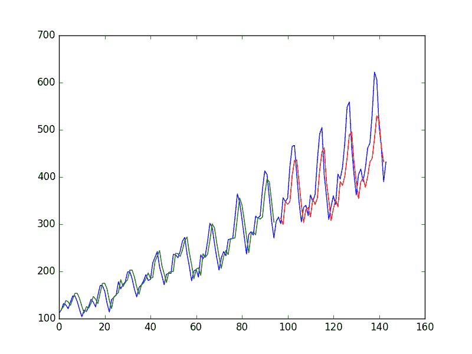
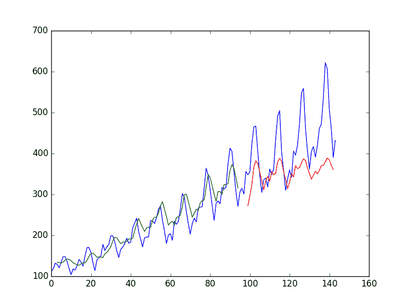

# 基于 Python 和 Keras 的使用 LSTM 循环神经网络的时间序列预测

> 原文： [https://machinelearningmastery.com/time-series-prediction-lstm-recurrent-neural-networks-python-keras/](https://machinelearningmastery.com/time-series-prediction-lstm-recurrent-neural-networks-python-keras/)

时间序列预测问题是一种难以预测的建模问题。

与回归预测性建模不同，时间序列还增加了输入变量之间序列依赖性的复杂性。

设计用于处理序列依赖性的强大类型的神经网络称为[循环神经网络](http://machinelearningmastery.com/crash-course-recurrent-neural-networks-deep-learning/)。长短期记忆网络或 LSTM 网络是一种用于深度学习的循环神经网络，因为可以成功训练非常大的架构。

在本文中，您将了解如何使用 Keras 深度学习库在 Python 中开发 LSTM 网络，以解决演示时间序列预测问题。

完成本教程后，您将了解如何为您自己的时间序列预测问题和其他更常见的序列问题实现和开发 LSTM 网络。你会知道：

*   关于国际航空公司乘客时间序列预测问题。
*   如何开发 LSTM 网络用于基于回归，窗口和时间步长的时间序列预测问题的框架。
*   如何使用 LSTM 网络开发和预测，这些网络在很长的序列中维护状态（内存）。

在本教程中，我们将针对标准时间序列预测问题开发许多 LSTM。 LSTM 网络的问题和所选配置仅用于演示目的，仅用于优化。

这些示例将向您展示如何为时间序列预测性建模问题开发自己的不同结构的 LSTM 网络。

让我们开始吧。

*   **2016 年 10 月更新**：在每个示例中计算 RMSE 的方式出错。报告的 RMSE 是完全错误的。现在，RMSE 直接根据预测计算，RMSE 和预测图都以原始数据集为单位。使用 Keras 1.1.0，TensorFlow 0.10.0 和 scikit-learn v0.18 评估模型。感谢所有指出这个问题的人，以及 Philip O'Brien 帮助指出修复的问题。
*   **2017 年 3 月更新**：更新了 Keras 2.0.2，TensorFlow 1.0.1 和 Theano 0.9.0 的示例。
*   **2017 年 4 月更新**：有关时间序列预测的更完整和更好解释的 LSTM 教程，请参阅 Python 中的长期短期记忆网络[时间序列预测。](http://machinelearningmastery.com/time-series-forecasting-long-short-term-memory-network-python/)

### 更新了 LSTM 时间序列预测帖子：

这篇文章中的例子非常陈旧，我有更好的例子可用于在时间序列中使用 LSTM，请参阅：

1.  [用于单变量时间序列预测的 LSTM](https://machinelearningmastery.com/time-series-forecasting-long-short-term-memory-network-python/)
2.  [多变量时间序列预测的 LSTM](https://machinelearningmastery.com/multivariate-time-series-forecasting-lstms-keras/)
3.  [用于多步时间序列预测的 LSTM](https://machinelearningmastery.com/multi-step-time-series-forecasting-long-short-term-memory-networks-python/)


时间序列预测与 LSTM 循环神经网络在 Python 与 Keras
照片由 [Margaux-Marguerite Duquesnoy](https://www.flickr.com/photos/124559226@N08/15792381395/) ，保留一些权利。

## 问题描述

我们将在这篇文章中讨论的问题是国际航空公司乘客预测问题。

这是一个问题，在一年零一个月的情况下，任务是以 1,000 为单位预测国际航空公司乘客的数量。数据范围从 1949 年 1 月到 1960 年 12 月，或 12 年，有 144 个观测值。

该数据集可从 [DataMarket 网页免费下载，作为 CSV 下载](https://datamarket.com/data/set/22u3/international-airline-passengers-monthly-totals-in-thousands-jan-49-dec-60#!ds=22u3&display=line)，文件名为“ _international-airline-passengers.csv_ ”。

下面是该文件前几行的示例。

```py
"Month","International airline passengers: monthly totals in thousands. Jan 49 ? Dec 60"
"1949-01",112
"1949-02",118
"1949-03",132
"1949-04",129
"1949-05",121
```

我们可以使用 Pandas 库轻松加载此数据集。鉴于每个观察以一个月的相同间隔分开，我们对日期不感兴趣。因此，当我们加载数据集时，我们可以排除第一列。

下载的数据集还有页脚信息，我们可以将 **skipfooter** 参数排除到 **pandas.read_csv（）**为 3 页脚行设置为 3。加载后，我们可以轻松绘制整个数据集。下面列出了加载和绘制数据集的代码。

```py
import pandas
import matplotlib.pyplot as plt
dataset = pandas.read_csv('international-airline-passengers.csv', usecols=[1], engine='python', skipfooter=3)
plt.plot(dataset)
plt.show()
```

随着时间的推移，您可以看到数据集中的上升趋势。

您还可以看到数据集的某些周期性，可能与北半球度假期相对应。


航空公司乘客数据集的情节

我们将保持简单并按原样处理数据。

通常，研究各种数据准备技术以重缩放数据并使其静止是一个好主意。

## 长短期记忆网络

长期短期记忆网络或 LSTM 网络是一种循环神经网络，使用反向传播时间训练并克服消失的梯度问题。

因此，它可用于创建大型循环网络，这些网络又可用于解决机器学习中的困难序列问题并实现最先进的结果。

LSTM 网络具有通过层连接的存储块，而不是神经元。

块具有使其比经典神经元更聪明的组件和用于最近序列的存储器。块包含管理块状态和输出的门。块对输入序列进行操作，并且块内的每个门使用 S 形激活单元来控制它们是否被触发，使状态的改变和流过块的信息的添加成为条件。

一个单元内有三种类型的门：

*   **忘记门**：有条件地决定从块中丢弃的信息。
*   **输入门**：有条件地决定输入中的哪些值来更新存储器状态。
*   **输出门**：根据输入和块的存储器有条件地决定输出内容。

每个单元就像一个小型状态机，其中单元的门具有在训练过程中学习的权重。

您可以看到如何通过一层 LSTM 实现复杂的学习和记忆，并且不难想象高阶抽象如何与多个这样的层分层。

## LSTM 回归网络

我们可以将问题表述为回归问题。

也就是说，考虑到本月乘客人数（以千人为单位），下个月的乘客人数是多少？

我们可以编写一个简单的函数将我们的单列数据转换为两列数据集：第一列包含本月的（t）乘客数，第二列包含下个月的（t + 1）乘客数，可以预测。

在我们开始之前，让我们首先导入我们打算使用的所有函数和类。这假设一个工作的 SciPy 环境安装了 Keras 深度学习库。

```py
import numpy
import matplotlib.pyplot as plt
import pandas
import math
from keras.models import Sequential
from keras.layers import Dense
from keras.layers import LSTM
from sklearn.preprocessing import MinMaxScaler
from sklearn.metrics import mean_squared_error
```

在我们做任何事情之前，最好修复随机数种子以确保我们的结果可重复。

```py
# fix random seed for reproducibility
numpy.random.seed(7)
```

我们还可以使用上一节中的代码将数据集作为 Pandas 数据帧加载。然后，我们可以从数据帧中提取 NumPy 数组，并将整数值转换为浮点值，这些值更适合使用神经网络进行建模。

```py
# load the dataset
dataframe = pandas.read_csv('international-airline-passengers.csv', usecols=[1], engine='python', skipfooter=3)
dataset = dataframe.values
dataset = dataset.astype('float32')
```

LSTM 对输入数据的比例敏感，特别是在使用 sigmoid（默认）或 tanh 激活函数时。将数据重缩放到 0 到 1 的范围是一种很好的做法，也称为标准化。我们可以使用 scikit-learn 库中的 **MinMaxScaler** 预处理类轻松地规范化数据集。

```py
# normalize the dataset
scaler = MinMaxScaler(feature_range=(0, 1))
dataset = scaler.fit_transform(dataset)
```

在我们对数据建模并估计模型在训练数据集上的技能之后，我们需要了解模型在新的看不见的数据上的技能。对于正常的分类或回归问题，我们将使用交叉验证来执行此操作。

对于时间序列数据，值的序列很重要。我们可以使用的一种简单方法是将有序数据集拆分为训练和测试数据集。下面的代码计算分裂点的索引，并将数据分成训练数据集，其中 67％的观测值可用于训练我们的模型，剩余的 33％用于测试模型。

```py
# split into train and test sets
train_size = int(len(dataset) * 0.67)
test_size = len(dataset) - train_size
train, test = dataset[0:train_size,:], dataset[train_size:len(dataset),:]
print(len(train), len(test))
```

现在我们可以定义一个函数来创建一个新的数据集，如上所述。

该函数有两个参数：**数据集**，它是我们想要转换为数据集的 NumPy 数组，以及 **look_back** ，它是之前使用的时间步数输入变量来预测下一个时间段 - 在这种情况下默认为 1。

此默认值将创建一个数据集，其中 X 是给定时间（t）的乘客数量，Y 是下次乘客的数量（t + 1）。

它可以配置，我们将在下一节中构建一个不同形状的数据集。

```py
# convert an array of values into a dataset matrix
def create_dataset(dataset, look_back=1):
	dataX, dataY = [], []
	for i in range(len(dataset)-look_back-1):
		a = dataset[i:(i+look_back), 0]
		dataX.append(a)
		dataY.append(dataset[i + look_back, 0])
	return numpy.array(dataX), numpy.array(dataY)
```

让我们看一下这个函数对数据集第一行的影响（为了清晰起见，以非标准化形式显示）。

```py
X		Y
112		118
118		132
132		129
129		121
121		135
```

如果将前 5 行与上一节中列出的原始数据集样本进行比较，则可以在数字中看到 X = t 和 Y = t + 1 模式。

让我们使用这个函数来准备训练和测试数据集以进行建模。

```py
# reshape into X=t and Y=t+1
look_back = 1
trainX, trainY = create_dataset(train, look_back)
testX, testY = create_dataset(test, look_back)
```

LSTM 网络期望输入数据（X）以以下形式提供特定的数组结构： _[样本，时间步长，特征]_ 。

目前，我们的数据形式为：[_ 样本，特征 _]，我们将问题定为每个样本的一个时间步长。我们可以使用 **numpy.reshape（）**将准备好的训练和测试输入数据转换为预期结构，如下所示：

```py
# reshape input to be [samples, time steps, features]
trainX = numpy.reshape(trainX, (trainX.shape[0], 1, trainX.shape[1]))
testX = numpy.reshape(testX, (testX.shape[0], 1, testX.shape[1]))
```

我们现在准备设计并适应我们的 LSTM 网络来解决这个问题。

网络具有带有 1 个输入的可见层，带有 4 个 LSTM 块或神经元的隐藏层，以及进行单个值预测的输出层。默认的 sigmoid 激活函数用于 LSTM 块。对网络进行 100 个迭代的训练，并使用 1 的批量大小。

```py
# create and fit the LSTM network
model = Sequential()
model.add(LSTM(4, input_shape=(1, look_back)))
model.add(Dense(1))
model.compile(loss='mean_squared_error', optimizer='adam')
model.fit(trainX, trainY, epochs=100, batch_size=1, verbose=2)
```

一旦模型拟合，我们就可以估计模型在训练和测试数据集上的表现。这将为我们提供新模型的比较点。

请注意，我们在计算错误分数之前反转预测，以确保以与原始数据相同的单位报告表现（每月数千名乘客）。

```py
# make predictions
trainPredict = model.predict(trainX)
testPredict = model.predict(testX)
# invert predictions
trainPredict = scaler.inverse_transform(trainPredict)
trainY = scaler.inverse_transform([trainY])
testPredict = scaler.inverse_transform(testPredict)
testY = scaler.inverse_transform([testY])
# calculate root mean squared error
trainScore = math.sqrt(mean_squared_error(trainY[0], trainPredict[:,0]))
print('Train Score: %.2f RMSE' % (trainScore))
testScore = math.sqrt(mean_squared_error(testY[0], testPredict[:,0]))
print('Test Score: %.2f RMSE' % (testScore))
```

最后，我们可以使用模型为训练和测试数据集生成预测，以获得模型技能的直观指示。

由于数据集的准备方式，我们必须改变预测，使它们在 x 轴上与原始数据集对齐。准备好后，绘制数据，以蓝色显示原始数据集，以绿色显示训练数据集的预测，以及以红色显示未见测试数据集的预测。

```py
# shift train predictions for plotting
trainPredictPlot = numpy.empty_like(dataset)
trainPredictPlot[:, :] = numpy.nan
trainPredictPlot[look_back:len(trainPredict)+look_back, :] = trainPredict
# shift test predictions for plotting
testPredictPlot = numpy.empty_like(dataset)
testPredictPlot[:, :] = numpy.nan
testPredictPlot[len(trainPredict)+(look_back*2)+1:len(dataset)-1, :] = testPredict
# plot baseline and predictions
plt.plot(scaler.inverse_transform(dataset))
plt.plot(trainPredictPlot)
plt.plot(testPredictPlot)
plt.show()
```

我们可以看到该模型在拟合训练和测试数据集方面做得非常出色。



LSTM 对乘客预测问题的回归制定进行了训练

为了完整起见，下面是整个代码示例。

```py
# LSTM for international airline passengers problem with regression framing
import numpy
import matplotlib.pyplot as plt
from pandas import read_csv
import math
from keras.models import Sequential
from keras.layers import Dense
from keras.layers import LSTM
from sklearn.preprocessing import MinMaxScaler
from sklearn.metrics import mean_squared_error
# convert an array of values into a dataset matrix
def create_dataset(dataset, look_back=1):
	dataX, dataY = [], []
	for i in range(len(dataset)-look_back-1):
		a = dataset[i:(i+look_back), 0]
		dataX.append(a)
		dataY.append(dataset[i + look_back, 0])
	return numpy.array(dataX), numpy.array(dataY)
# fix random seed for reproducibility
numpy.random.seed(7)
# load the dataset
dataframe = read_csv('international-airline-passengers.csv', usecols=[1], engine='python', skipfooter=3)
dataset = dataframe.values
dataset = dataset.astype('float32')
# normalize the dataset
scaler = MinMaxScaler(feature_range=(0, 1))
dataset = scaler.fit_transform(dataset)
# split into train and test sets
train_size = int(len(dataset) * 0.67)
test_size = len(dataset) - train_size
train, test = dataset[0:train_size,:], dataset[train_size:len(dataset),:]
# reshape into X=t and Y=t+1
look_back = 1
trainX, trainY = create_dataset(train, look_back)
testX, testY = create_dataset(test, look_back)
# reshape input to be [samples, time steps, features]
trainX = numpy.reshape(trainX, (trainX.shape[0], 1, trainX.shape[1]))
testX = numpy.reshape(testX, (testX.shape[0], 1, testX.shape[1]))
# create and fit the LSTM network
model = Sequential()
model.add(LSTM(4, input_shape=(1, look_back)))
model.add(Dense(1))
model.compile(loss='mean_squared_error', optimizer='adam')
model.fit(trainX, trainY, epochs=100, batch_size=1, verbose=2)
# make predictions
trainPredict = model.predict(trainX)
testPredict = model.predict(testX)
# invert predictions
trainPredict = scaler.inverse_transform(trainPredict)
trainY = scaler.inverse_transform([trainY])
testPredict = scaler.inverse_transform(testPredict)
testY = scaler.inverse_transform([testY])
# calculate root mean squared error
trainScore = math.sqrt(mean_squared_error(trainY[0], trainPredict[:,0]))
print('Train Score: %.2f RMSE' % (trainScore))
testScore = math.sqrt(mean_squared_error(testY[0], testPredict[:,0]))
print('Test Score: %.2f RMSE' % (testScore))
# shift train predictions for plotting
trainPredictPlot = numpy.empty_like(dataset)
trainPredictPlot[:, :] = numpy.nan
trainPredictPlot[look_back:len(trainPredict)+look_back, :] = trainPredict
# shift test predictions for plotting
testPredictPlot = numpy.empty_like(dataset)
testPredictPlot[:, :] = numpy.nan
testPredictPlot[len(trainPredict)+(look_back*2)+1:len(dataset)-1, :] = testPredict
# plot baseline and predictions
plt.plot(scaler.inverse_transform(dataset))
plt.plot(trainPredictPlot)
plt.plot(testPredictPlot)
plt.show()
```

运行该示例将生成以下输出。

```py
...
Epoch 95/100
0s - loss: 0.0020
Epoch 96/100
0s - loss: 0.0020
Epoch 97/100
0s - loss: 0.0020
Epoch 98/100
0s - loss: 0.0020
Epoch 99/100
0s - loss: 0.0020
Epoch 100/100
0s - loss: 0.0020
Train Score: 22.93 RMSE
Test Score: 47.53 RMSE
```

我们可以看到该模型在训练数据集上的平均误差约为 23 名乘客（以千计），在测试数据集上的平均误差约为 52 名乘客（以千计）。没那么糟。

## 使用窗口方法进行回归的 LSTM

我们还可以对问题进行短语，以便可以使用多个最近时间步骤来对下一个时间步做出预测。

这称为窗口，窗口的大小是可以针对每个问题进行调整的参数。

例如，给定当前时间（t）我们想要预测序列中下一次的值（t + 1），我们可以使用当前时间（t），以及前两次（t-1）和 t-2）作为输入变量。

当表达为回归问题时，输入变量为 t-2，t-1，t，输出变量为 t + 1。

我们在上一节中创建的 **create_dataset（）**函数允许我们通过将 **look_back** 参数从 1 增加到 3 来创建时间序列问题的这个公式。

具有此秘籍的数据集样本如下所示：

```py
X1	X2	X3	Y
112	118	132	129
118	132	129	121
132	129	121	135
129	121	135	148
121	135	148	148
```

我们可以使用更大的窗口大小重新运行上一节中的示例。为了完整性，下面列出了仅包含窗口大小更改的整个代码清单。

```py
# LSTM for international airline passengers problem with window regression framing
import numpy
import matplotlib.pyplot as plt
from pandas import read_csv
import math
from keras.models import Sequential
from keras.layers import Dense
from keras.layers import LSTM
from sklearn.preprocessing import MinMaxScaler
from sklearn.metrics import mean_squared_error
# convert an array of values into a dataset matrix
def create_dataset(dataset, look_back=1):
	dataX, dataY = [], []
	for i in range(len(dataset)-look_back-1):
		a = dataset[i:(i+look_back), 0]
		dataX.append(a)
		dataY.append(dataset[i + look_back, 0])
	return numpy.array(dataX), numpy.array(dataY)
# fix random seed for reproducibility
numpy.random.seed(7)
# load the dataset
dataframe = read_csv('international-airline-passengers.csv', usecols=[1], engine='python', skipfooter=3)
dataset = dataframe.values
dataset = dataset.astype('float32')
# normalize the dataset
scaler = MinMaxScaler(feature_range=(0, 1))
dataset = scaler.fit_transform(dataset)
# split into train and test sets
train_size = int(len(dataset) * 0.67)
test_size = len(dataset) - train_size
train, test = dataset[0:train_size,:], dataset[train_size:len(dataset),:]
# reshape into X=t and Y=t+1
look_back = 3
trainX, trainY = create_dataset(train, look_back)
testX, testY = create_dataset(test, look_back)
# reshape input to be [samples, time steps, features]
trainX = numpy.reshape(trainX, (trainX.shape[0], 1, trainX.shape[1]))
testX = numpy.reshape(testX, (testX.shape[0], 1, testX.shape[1]))
# create and fit the LSTM network
model = Sequential()
model.add(LSTM(4, input_shape=(1, look_back)))
model.add(Dense(1))
model.compile(loss='mean_squared_error', optimizer='adam')
model.fit(trainX, trainY, epochs=100, batch_size=1, verbose=2)
# make predictions
trainPredict = model.predict(trainX)
testPredict = model.predict(testX)
# invert predictions
trainPredict = scaler.inverse_transform(trainPredict)
trainY = scaler.inverse_transform([trainY])
testPredict = scaler.inverse_transform(testPredict)
testY = scaler.inverse_transform([testY])
# calculate root mean squared error
trainScore = math.sqrt(mean_squared_error(trainY[0], trainPredict[:,0]))
print('Train Score: %.2f RMSE' % (trainScore))
testScore = math.sqrt(mean_squared_error(testY[0], testPredict[:,0]))
print('Test Score: %.2f RMSE' % (testScore))
# shift train predictions for plotting
trainPredictPlot = numpy.empty_like(dataset)
trainPredictPlot[:, :] = numpy.nan
trainPredictPlot[look_back:len(trainPredict)+look_back, :] = trainPredict
# shift test predictions for plotting
testPredictPlot = numpy.empty_like(dataset)
testPredictPlot[:, :] = numpy.nan
testPredictPlot[len(trainPredict)+(look_back*2)+1:len(dataset)-1, :] = testPredict
# plot baseline and predictions
plt.plot(scaler.inverse_transform(dataset))
plt.plot(trainPredictPlot)
plt.plot(testPredictPlot)
plt.show()
```

运行该示例提供以下输出：

```py
...
Epoch 95/100
0s - loss: 0.0021
Epoch 96/100
0s - loss: 0.0021
Epoch 97/100
0s - loss: 0.0021
Epoch 98/100
0s - loss: 0.0021
Epoch 99/100
0s - loss: 0.0022
Epoch 100/100
0s - loss: 0.0020
Train Score: 24.19 RMSE
Test Score: 58.03 RMSE
```

我们可以看到，与上一节相比，误差略有增加。窗口大小和网络架构没有调整：这只是如何构建预测问题的演示。


LSTM 训练乘客预测问题的窗口方法

## 带时间步长的回归 LSTM

您可能已经注意到 LSTM 网络的数据准备包括时间步骤。

一些序列问题可能每个样本具有不同数量的时间步长。例如，您可能会测量导致故障点或喘振点的物理机器。每个事件都是一个样本，导致事件的观察将是时间步骤，观察到的变量将是特征。

时间步骤提供了另一种表达时间序列问题的方法。与上面的窗口示例一样，我们可以将时间序列中的先前时间步长作为输入来预测下一时间步的输出。

我们可以将它们用作一个输入要素的时间步长，而不是将过去的观察结果作为单独的输入要素，这确实是对问题的更准确的框架。

我们可以使用与上一个基于窗口的示例相同的数据表示来执行此操作，除非我们对数据进行整形，我们将列设置为时间步长维并将要素维更改为 1.例如：

```py
# reshape input to be [samples, time steps, features]
trainX = numpy.reshape(trainX, (trainX.shape[0], trainX.shape[1], 1))
testX = numpy.reshape(testX, (testX.shape[0], testX.shape[1], 1))
```

下面提供了整个代码清单，以确保完整性。

```py
# LSTM for international airline passengers problem with time step regression framing
import numpy
import matplotlib.pyplot as plt
from pandas import read_csv
import math
from keras.models import Sequential
from keras.layers import Dense
from keras.layers import LSTM
from sklearn.preprocessing import MinMaxScaler
from sklearn.metrics import mean_squared_error
# convert an array of values into a dataset matrix
def create_dataset(dataset, look_back=1):
	dataX, dataY = [], []
	for i in range(len(dataset)-look_back-1):
		a = dataset[i:(i+look_back), 0]
		dataX.append(a)
		dataY.append(dataset[i + look_back, 0])
	return numpy.array(dataX), numpy.array(dataY)
# fix random seed for reproducibility
numpy.random.seed(7)
# load the dataset
dataframe = read_csv('international-airline-passengers.csv', usecols=[1], engine='python', skipfooter=3)
dataset = dataframe.values
dataset = dataset.astype('float32')
# normalize the dataset
scaler = MinMaxScaler(feature_range=(0, 1))
dataset = scaler.fit_transform(dataset)
# split into train and test sets
train_size = int(len(dataset) * 0.67)
test_size = len(dataset) - train_size
train, test = dataset[0:train_size,:], dataset[train_size:len(dataset),:]
# reshape into X=t and Y=t+1
look_back = 3
trainX, trainY = create_dataset(train, look_back)
testX, testY = create_dataset(test, look_back)
# reshape input to be [samples, time steps, features]
trainX = numpy.reshape(trainX, (trainX.shape[0], trainX.shape[1], 1))
testX = numpy.reshape(testX, (testX.shape[0], testX.shape[1], 1))
# create and fit the LSTM network
model = Sequential()
model.add(LSTM(4, input_shape=(look_back, 1)))
model.add(Dense(1))
model.compile(loss='mean_squared_error', optimizer='adam')
model.fit(trainX, trainY, epochs=100, batch_size=1, verbose=2)
# make predictions
trainPredict = model.predict(trainX)
testPredict = model.predict(testX)
# invert predictions
trainPredict = scaler.inverse_transform(trainPredict)
trainY = scaler.inverse_transform([trainY])
testPredict = scaler.inverse_transform(testPredict)
testY = scaler.inverse_transform([testY])
# calculate root mean squared error
trainScore = math.sqrt(mean_squared_error(trainY[0], trainPredict[:,0]))
print('Train Score: %.2f RMSE' % (trainScore))
testScore = math.sqrt(mean_squared_error(testY[0], testPredict[:,0]))
print('Test Score: %.2f RMSE' % (testScore))
# shift train predictions for plotting
trainPredictPlot = numpy.empty_like(dataset)
trainPredictPlot[:, :] = numpy.nan
trainPredictPlot[look_back:len(trainPredict)+look_back, :] = trainPredict
# shift test predictions for plotting
testPredictPlot = numpy.empty_like(dataset)
testPredictPlot[:, :] = numpy.nan
testPredictPlot[len(trainPredict)+(look_back*2)+1:len(dataset)-1, :] = testPredict
# plot baseline and predictions
plt.plot(scaler.inverse_transform(dataset))
plt.plot(trainPredictPlot)
plt.plot(testPredictPlot)
plt.show()
```

运行该示例提供以下输出：

```py
...
Epoch 95/100
1s - loss: 0.0021
Epoch 96/100
1s - loss: 0.0021
Epoch 97/100
1s - loss: 0.0021
Epoch 98/100
1s - loss: 0.0020
Epoch 99/100
1s - loss: 0.0021
Epoch 100/100
1s - loss: 0.0020
Train Score: 23.69 RMSE
Test Score: 58.88 RMSE
```

我们可以看到结果略好于前面的例子，尽管输入数据的结构更有意义。


LSTM 训练乘客预测问题的时间步长形式

## LSTM 与批次之间的内存

LSTM 网络具有内存，能够记住长序列。

通常，在拟合模型时，在每次训练批次之后重置网络内的状态，以及每次调用 **model.predict（）**或 **model.evaluate（）**。

通过使 LSTM 层“有状态”，我们可以更好地控制何时在 Keras 中清除 LSTM 网络的内部状态。这意味着它可以在整个训练序列中构建状态，甚至在需要做出预测时保持该状态。

它要求在安装网络时不要改组训练数据。它还要求通过调用 **model.reset_states（）**，在每次暴露于训练数据（时期）后明确重置网络状态。这意味着我们必须在每个时代调用 **model.fit（）**和 **model.reset_states（）**内创建我们自己的时代外环。例如：

```py
for i in range(100):
	model.fit(trainX, trainY, epochs=1, batch_size=batch_size, verbose=2, shuffle=False)
	model.reset_states()
```

最后，当构造 LSTM 层时，**有状态**参数必须设置为 **True** 而不是指定输入维度，我们必须硬编码批次中的样本数量，通过设置 **batch_input_shape** 参数，样本中的时间步长和时间步长中的要素数量。例如：

```py
model.add(LSTM(4, batch_input_shape=(batch_size, time_steps, features), stateful=True))
```

然后，在评估模型和做出预测时，必须使用相同的批量大小。例如：

```py
model.predict(trainX, batch_size=batch_size)
```

我们可以调整前一个时间步骤示例以使用有状态 LSTM。完整的代码清单如下。

```py
# LSTM for international airline passengers problem with memory
import numpy
import matplotlib.pyplot as plt
from pandas import read_csv
import math
from keras.models import Sequential
from keras.layers import Dense
from keras.layers import LSTM
from sklearn.preprocessing import MinMaxScaler
from sklearn.metrics import mean_squared_error
# convert an array of values into a dataset matrix
def create_dataset(dataset, look_back=1):
	dataX, dataY = [], []
	for i in range(len(dataset)-look_back-1):
		a = dataset[i:(i+look_back), 0]
		dataX.append(a)
		dataY.append(dataset[i + look_back, 0])
	return numpy.array(dataX), numpy.array(dataY)
# fix random seed for reproducibility
numpy.random.seed(7)
# load the dataset
dataframe = read_csv('international-airline-passengers.csv', usecols=[1], engine='python', skipfooter=3)
dataset = dataframe.values
dataset = dataset.astype('float32')
# normalize the dataset
scaler = MinMaxScaler(feature_range=(0, 1))
dataset = scaler.fit_transform(dataset)
# split into train and test sets
train_size = int(len(dataset) * 0.67)
test_size = len(dataset) - train_size
train, test = dataset[0:train_size,:], dataset[train_size:len(dataset),:]
# reshape into X=t and Y=t+1
look_back = 3
trainX, trainY = create_dataset(train, look_back)
testX, testY = create_dataset(test, look_back)
# reshape input to be [samples, time steps, features]
trainX = numpy.reshape(trainX, (trainX.shape[0], trainX.shape[1], 1))
testX = numpy.reshape(testX, (testX.shape[0], testX.shape[1], 1))
# create and fit the LSTM network
batch_size = 1
model = Sequential()
model.add(LSTM(4, batch_input_shape=(batch_size, look_back, 1), stateful=True))
model.add(Dense(1))
model.compile(loss='mean_squared_error', optimizer='adam')
for i in range(100):
	model.fit(trainX, trainY, epochs=1, batch_size=batch_size, verbose=2, shuffle=False)
	model.reset_states()
# make predictions
trainPredict = model.predict(trainX, batch_size=batch_size)
model.reset_states()
testPredict = model.predict(testX, batch_size=batch_size)
# invert predictions
trainPredict = scaler.inverse_transform(trainPredict)
trainY = scaler.inverse_transform([trainY])
testPredict = scaler.inverse_transform(testPredict)
testY = scaler.inverse_transform([testY])
# calculate root mean squared error
trainScore = math.sqrt(mean_squared_error(trainY[0], trainPredict[:,0]))
print('Train Score: %.2f RMSE' % (trainScore))
testScore = math.sqrt(mean_squared_error(testY[0], testPredict[:,0]))
print('Test Score: %.2f RMSE' % (testScore))
# shift train predictions for plotting
trainPredictPlot = numpy.empty_like(dataset)
trainPredictPlot[:, :] = numpy.nan
trainPredictPlot[look_back:len(trainPredict)+look_back, :] = trainPredict
# shift test predictions for plotting
testPredictPlot = numpy.empty_like(dataset)
testPredictPlot[:, :] = numpy.nan
testPredictPlot[len(trainPredict)+(look_back*2)+1:len(dataset)-1, :] = testPredict
# plot baseline and predictions
plt.plot(scaler.inverse_transform(dataset))
plt.plot(trainPredictPlot)
plt.plot(testPredictPlot)
plt.show()
```

运行该示例提供以下输出：

```py
...
Epoch 1/1
1s - loss: 0.0017
Epoch 1/1
1s - loss: 0.0017
Epoch 1/1
1s - loss: 0.0017
Epoch 1/1
1s - loss: 0.0017
Epoch 1/1
1s - loss: 0.0017
Epoch 1/1
1s - loss: 0.0016
Train Score: 20.74 RMSE
Test Score: 52.23 RMSE
```

我们确实看到结果更糟。该模型可能需要更多模块，并且可能需要针对更多时期进行训练以内化问题的结构。


有状态 LSTM 训练乘客预测问题的回归形式

## 栈式 LSTM 与批次之间的内存

最后，我们将了解 LSTM 的一大优势：它们可以在堆叠到深层网络架构中时成功进行训练。

LSTM 网络可以像其他层类型堆叠一样堆叠在 Keras 中。对配置的一个补充是每个后续 LSTM 层之前的 LSTM 层必须返回序列。这可以通过将层上的 **return_sequences** 参数设置为 **True** 来完成。

我们可以在上一节中扩展有状态 LSTM，使其具有两层，如下所示：

```py
model.add(LSTM(4, batch_input_shape=(batch_size, look_back, 1), stateful=True, return_sequences=True))
model.add(LSTM(4, batch_input_shape=(batch_size, look_back, 1), stateful=True))
```

下面提供了整个代码清单，以确保完整性。

```py
# Stacked LSTM for international airline passengers problem with memory
import numpy
import matplotlib.pyplot as plt
from pandas import read_csv
import math
from keras.models import Sequential
from keras.layers import Dense
from keras.layers import LSTM
from sklearn.preprocessing import MinMaxScaler
from sklearn.metrics import mean_squared_error
# convert an array of values into a dataset matrix
def create_dataset(dataset, look_back=1):
	dataX, dataY = [], []
	for i in range(len(dataset)-look_back-1):
		a = dataset[i:(i+look_back), 0]
		dataX.append(a)
		dataY.append(dataset[i + look_back, 0])
	return numpy.array(dataX), numpy.array(dataY)
# fix random seed for reproducibility
numpy.random.seed(7)
# load the dataset
dataframe = read_csv('international-airline-passengers.csv', usecols=[1], engine='python', skipfooter=3)
dataset = dataframe.values
dataset = dataset.astype('float32')
# normalize the dataset
scaler = MinMaxScaler(feature_range=(0, 1))
dataset = scaler.fit_transform(dataset)
# split into train and test sets
train_size = int(len(dataset) * 0.67)
test_size = len(dataset) - train_size
train, test = dataset[0:train_size,:], dataset[train_size:len(dataset),:]
# reshape into X=t and Y=t+1
look_back = 3
trainX, trainY = create_dataset(train, look_back)
testX, testY = create_dataset(test, look_back)
# reshape input to be [samples, time steps, features]
trainX = numpy.reshape(trainX, (trainX.shape[0], trainX.shape[1], 1))
testX = numpy.reshape(testX, (testX.shape[0], testX.shape[1], 1))
# create and fit the LSTM network
batch_size = 1
model = Sequential()
model.add(LSTM(4, batch_input_shape=(batch_size, look_back, 1), stateful=True, return_sequences=True))
model.add(LSTM(4, batch_input_shape=(batch_size, look_back, 1), stateful=True))
model.add(Dense(1))
model.compile(loss='mean_squared_error', optimizer='adam')
for i in range(100):
	model.fit(trainX, trainY, epochs=1, batch_size=batch_size, verbose=2, shuffle=False)
	model.reset_states()
# make predictions
trainPredict = model.predict(trainX, batch_size=batch_size)
model.reset_states()
testPredict = model.predict(testX, batch_size=batch_size)
# invert predictions
trainPredict = scaler.inverse_transform(trainPredict)
trainY = scaler.inverse_transform([trainY])
testPredict = scaler.inverse_transform(testPredict)
testY = scaler.inverse_transform([testY])
# calculate root mean squared error
trainScore = math.sqrt(mean_squared_error(trainY[0], trainPredict[:,0]))
print('Train Score: %.2f RMSE' % (trainScore))
testScore = math.sqrt(mean_squared_error(testY[0], testPredict[:,0]))
print('Test Score: %.2f RMSE' % (testScore))
# shift train predictions for plotting
trainPredictPlot = numpy.empty_like(dataset)
trainPredictPlot[:, :] = numpy.nan
trainPredictPlot[look_back:len(trainPredict)+look_back, :] = trainPredict
# shift test predictions for plotting
testPredictPlot = numpy.empty_like(dataset)
testPredictPlot[:, :] = numpy.nan
testPredictPlot[len(trainPredict)+(look_back*2)+1:len(dataset)-1, :] = testPredict
# plot baseline and predictions
plt.plot(scaler.inverse_transform(dataset))
plt.plot(trainPredictPlot)
plt.plot(testPredictPlot)
plt.show()
```

运行该示例将生成以下输出。

```py
...
Epoch 1/1
1s - loss: 0.0017
Epoch 1/1
1s - loss: 0.0017
Epoch 1/1
1s - loss: 0.0017
Epoch 1/1
1s - loss: 0.0017
Epoch 1/1
1s - loss: 0.0016
Train Score: 20.49 RMSE
Test Score: 56.35 RMSE
```

对测试数据集的预测再次恶化。这是更多证据表明需要额外的训练时期。



堆积状态 LSTM 训练对乘客预测问题的回归表达式

## 摘要

在这篇文章中，您了解了如何使用 Keras 深度学习网络在 Python 中开发用于时间序列预测的 LSTM 循环神经网络。

具体来说，你学到了：

*   关于国际航空公司客运时间序列预测问题。
*   如何为回归创建 LSTM 以及时间序列问题的窗口公式。
*   如何使用时间序列问题的时间步长公式创建 LSTM。
*   如何使用状态和堆叠的 LSTM 创建具有状态的 LSTM 以学习长序列。

您对 LSTMs 有关时间序列预测或关于这篇文章的任何疑问吗？
在下面的评论中提出您的问题，我会尽力回答。

### 更新了 LSTM 时间序列预测帖子：

这篇文章中的例子非常陈旧，我有更好的例子可用于在时间序列中使用 LSTM，请参阅：

1.  [用于单变量时间序列预测的 LSTM](https://machinelearningmastery.com/time-series-forecasting-long-short-term-memory-network-python/)
2.  [多变量时间序列预测的 LSTM](https://machinelearningmastery.com/multivariate-time-series-forecasting-lstms-keras/)
3.  [用于多步时间序列预测的 LSTM](https://machinelearningmastery.com/multi-step-time-series-forecasting-long-short-term-memory-networks-python/)