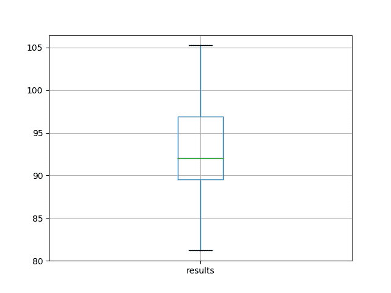

# 如何为时间序列预测使用 LSTM 网络的丢弃法

> 原文： [https://machinelearningmastery.com/use-dropout-lstm-networks-time-series-forecasting/](https://machinelearningmastery.com/use-dropout-lstm-networks-time-series-forecasting/)

长短期记忆（LSTM）模型是一种能够学习观察序列的循环神经网络。

这可能使它们成为一个非常适合时间序列预测的网络。

LSTM 的一个问题是他们可以轻松地过度训练训练数据，降低他们的预测技巧。

Dropout 是一种正规化方法，在训练网络时，LSTM 单元的输入和重复连接在概率上被排除在激活和权重更新之外。这具有减少过拟合和改善模型表现的效果。

在本教程中，您将了解如何在 LSTM 网络和设计实验中使用 dropout 来测试其对时间序列预测的有效性。

完成本教程后，您将了解：

*   如何设计一个强大的测试工具来评估 LSTM 网络的时间序列预测。
*   如何使用 LSTM 使用输入权重丢失来设计，执行和解释结果。
*   如何设计，执行和解释使用 LSTM 重复丢失重量的结果。

让我们开始吧。


如何使用 LSTM 网络的 Dropout 进行时间序列预测
照片来自 Jonas Bengtsson，保留一些权利。

## 教程概述

本教程分为 5 个部分。他们是：

1.  洗发水销售数据集
2.  实验测试线束
3.  输入 dropout
4.  经常性 dropout
5.  审查结果

### 环境

本教程假定您已安装 Python SciPy 环境。您可以在此示例中使用 Python 2 或 3。

本教程假设您安装了 TensorFlow 或 Theano 后端的 Keras v2.0 或更高版本。

本教程还假设您安装了 scikit-learn，Pandas，NumPy 和 Matplotlib。

接下来，让我们看看标准时间序列预测问题，我们可以将其用作此实验的上下文。

如果您在设置 Python 环境时需要帮助，请参阅以下帖子：

*   [如何使用 Anaconda 设置用于机器学习和深度学习的 Python 环境](http://machinelearningmastery.com/setup-python-environment-machine-learning-deep-learning-anaconda/)

## 洗发水销售数据集

该数据集描述了 3 年期间每月洗发水的销售数量。

单位是销售计数，有 36 个观察。原始数据集归功于 Makridakis，Wheelwright 和 Hyndman（1998）。

[您可以在此处下载并了解有关数据集的更多信息](https://datamarket.com/data/set/22r0/sales-of-shampoo-over-a-three-year-period)。

下面的示例加载并创建已加载数据集的图。

```py
# load and plot dataset
from pandas import read_csv
from pandas import datetime
from matplotlib import pyplot
# load dataset
def parser(x):
	return datetime.strptime('190'+x, '%Y-%m')
series = read_csv('shampoo-sales.csv', header=0, parse_dates=[0], index_col=0, squeeze=True, date_parser=parser)
# summarize first few rows
print(series.head())
# line plot
series.plot()
pyplot.show()
```

运行该示例将数据集作为 Pandas Series 加载并打印前 5 行。

```py
Month
1901-01-01 266.0
1901-02-01 145.9
1901-03-01 183.1
1901-04-01 119.3
1901-05-01 180.3
Name: Sales, dtype: float64
```

然后创建该系列的线图，显示明显的增加趋势。


洗发水销售数据集的线图

接下来，我们将看一下实验中使用的模型配置和测试工具。

## 实验测试线束

本节介绍本教程中使用的测试工具。

### 数据拆分

我们将 Shampoo Sales 数据集分为两部分：训练和测试集。

前两年的数据将用于训练数据集，剩余的一年数据将用于测试集。

将使用训练数据集开发模型，并对测试数据集做出预测。

测试数据集的持久性预测（朴素预测）实现了每月洗发水销售 136.761 的错误。这在测试集上提供了较低的可接受表现限制。

#### 模型评估

将使用滚动预测场景，也称为前进模型验证。

测试数据集的每个时间步骤将一次一个地走。将使用模型对时间步长做出预测，然后将获取测试集的实际预期值，并使其可用于下一时间步的预测模型。

这模仿了一个真实世界的场景，每个月都会有新的洗发水销售观察结果，并用于下个月的预测。

这将通过训练和测试数据集的结构进行模拟。

将收集关于测试数据集的所有预测，并计算错误分数以总结模型的技能。将使用均方根误差（RMSE），因为它会对大错误进行处罚，并产生与预测数据相同的分数，即每月洗发水销售额。

### 数据准备

在我们将模型拟合到数据集之前，我们必须转换数据。

在拟合模型和做出预测之前，对数据集执行以下三个数据变换。

1.  **转换时间序列数据，使其静止**。具体而言，滞后= 1 差分以消除数据中的增加趋势。
2.  **将时间序列转换为监督学习问题**。具体而言，将数据组织成输入和输出模式，其中前一时间步的观察被用作预测当前时间步的观察的输入
3.  **将观察结果转换为具有特定比例**。具体而言，将数据重缩放为-1 到 1 之间的值。

这些变换在预测时反转，在计算和误差分数之前将它们恢复到原始比例。

### LSTM 模型

我们将使用基础状态 LSTM 模型，其中 1 个神经元适合 1000 个时期。

批量大小为 1 是必需的，因为我们将使用前向验证并对最后 12 个月的测试数据进行一步预测。

批量大小为 1 意味着该模型将使用在线训练（而不是批量训练或小批量训练）。因此，预计模型拟合将具有一些变化。

理想情况下，将使用更多的训练时期（例如 1500），但这被截断为 1000 以保持运行时间合理。

使用有效的 ADAM 优化算法和均方误差损失函数来拟合模型。

### 实验运行

每个实验场景将运行 30 次，并且测试集上的 RMSE 得分将从每次运行结束时记录。

让我们深入研究实验。

## 基线 LSTM 模型

让我们从基线 LSTM 模型开始。

此问题的基线 LSTM 模型具有以下配置：

*   滞后输入：1
*   时代：1000
*   LSTM 隐藏层中的单位：3
*   批量大小：4
*   重复：3

完整的代码清单如下。

此代码清单将用作所有后续实验的基础，只有后续部分中提供的此代码清单的更改。

```py
from pandas import DataFrame
from pandas import Series
from pandas import concat
from pandas import read_csv
from pandas import datetime
from sklearn.metrics import mean_squared_error
from sklearn.preprocessing import MinMaxScaler
from keras.models import Sequential
from keras.layers import Dense
from keras.layers import LSTM
from math import sqrt
import matplotlib
# be able to save images on server
matplotlib.use('Agg')
from matplotlib import pyplot
import numpy

# date-time parsing function for loading the dataset
def parser(x):
	return datetime.strptime('190'+x, '%Y-%m')

# frame a sequence as a supervised learning problem
def timeseries_to_supervised(data, lag=1):
	df = DataFrame(data)
	columns = [df.shift(i) for i in range(1, lag+1)]
	columns.append(df)
	df = concat(columns, axis=1)
	return df

# create a differenced series
def difference(dataset, interval=1):
	diff = list()
	for i in range(interval, len(dataset)):
		value = dataset[i] - dataset[i - interval]
		diff.append(value)
	return Series(diff)

# invert differenced value
def inverse_difference(history, yhat, interval=1):
	return yhat + history[-interval]

# scale train and test data to [-1, 1]
def scale(train, test):
	# fit scaler
	scaler = MinMaxScaler(feature_range=(-1, 1))
	scaler = scaler.fit(train)
	# transform train
	train = train.reshape(train.shape[0], train.shape[1])
	train_scaled = scaler.transform(train)
	# transform test
	test = test.reshape(test.shape[0], test.shape[1])
	test_scaled = scaler.transform(test)
	return scaler, train_scaled, test_scaled

# inverse scaling for a forecasted value
def invert_scale(scaler, X, yhat):
	new_row = [x for x in X] + [yhat]
	array = numpy.array(new_row)
	array = array.reshape(1, len(array))
	inverted = scaler.inverse_transform(array)
	return inverted[0, -1]

# fit an LSTM network to training data
def fit_lstm(train, n_batch, nb_epoch, n_neurons):
	X, y = train[:, 0:-1], train[:, -1]
	X = X.reshape(X.shape[0], 1, X.shape[1])
	model = Sequential()
	model.add(LSTM(n_neurons, batch_input_shape=(n_batch, X.shape[1], X.shape[2]), stateful=True))
	model.add(Dense(1))
	model.compile(loss='mean_squared_error', optimizer='adam')
	for i in range(nb_epoch):
		model.fit(X, y, epochs=1, batch_size=n_batch, verbose=0, shuffle=False)
		model.reset_states()
	return model

# run a repeated experiment
def experiment(series, n_lag, n_repeats, n_epochs, n_batch, n_neurons):
	# transform data to be stationary
	raw_values = series.values
	diff_values = difference(raw_values, 1)
	# transform data to be supervised learning
	supervised = timeseries_to_supervised(diff_values, n_lag)
	supervised_values = supervised.values[n_lag:,:]
	# split data into train and test-sets
	train, test = supervised_values[0:-12], supervised_values[-12:]
	# transform the scale of the data
	scaler, train_scaled, test_scaled = scale(train, test)
	# run experiment
	error_scores = list()
	for r in range(n_repeats):
		# fit the model
		train_trimmed = train_scaled[2:, :]
		lstm_model = fit_lstm(train_trimmed, n_batch, n_epochs, n_neurons)
		# forecast test dataset
		test_reshaped = test_scaled[:,0:-1]
		test_reshaped = test_reshaped.reshape(len(test_reshaped), 1, 1)
		output = lstm_model.predict(test_reshaped, batch_size=n_batch)
		predictions = list()
		for i in range(len(output)):
			yhat = output[i,0]
			X = test_scaled[i, 0:-1]
			# invert scaling
			yhat = invert_scale(scaler, X, yhat)
			# invert differencing
			yhat = inverse_difference(raw_values, yhat, len(test_scaled)+1-i)
			# store forecast
			predictions.append(yhat)
		# report performance
		rmse = sqrt(mean_squared_error(raw_values[-12:], predictions))
		print('%d) Test RMSE: %.3f' % (r+1, rmse))
		error_scores.append(rmse)
	return error_scores

# configure the experiment
def run():
	# load dataset
	series = read_csv('shampoo-sales.csv', header=0, parse_dates=[0], index_col=0, squeeze=True, date_parser=parser)
	# configure the experiment
	n_lag = 1
	n_repeats = 30
	n_epochs = 1000
	n_batch = 4
	n_neurons = 3
	# run the experiment
	results = DataFrame()
	results['results'] = experiment(series, n_lag, n_repeats, n_epochs, n_batch, n_neurons)
	# summarize results
	print(results.describe())
	# save boxplot
	results.boxplot()
	pyplot.savefig('experiment_baseline.png')

# entry point
run()
```

运行实验将打印所有重复测试 RMSE 的摘要统计量。

我们可以看到，平均而言，这种模型配置实现了约 92 个月洗发水销售的测试 RMSE，标准偏差为 5。

```py
          results
count   30.000000
mean    92.842537
std      5.748456
min     81.205979
25%     89.514367
50%     92.030003
75%     96.926145
max    105.247117
```

还会根据测试 RMSE 结果的分布创建一个盒子和胡须图并保存到文件中。

该图清楚地描述了结果的传播，突出了中间 50％的值（框）和中位数（绿线）。



洗发水销售数据集中基线表现的盒子和晶须图

网络配置需要考虑的另一个角度是模型适应时的行为方式。

我们可以在每个训练时期之后评估训练和测试数据集上的模型，以了解配置是否过拟合或不适合问题。

我们将在每组实验的最佳结果上使用此诊断方法。将运行总共 10 次重复的配置，并且在线图上绘制每个训练迭代之后的训练和测试 RMSE 得分。

在这种情况下，我们将在适用于 1000 个时期的 LSTM 上使用此诊断。

完整的诊断代码清单如下。

与前面的代码清单一样，下面的代码将用作本教程中所有诊断的基础，并且后续部分中仅提供对此列表的更改。

```py
from pandas import DataFrame
from pandas import Series
from pandas import concat
from pandas import read_csv
from pandas import datetime
from sklearn.metrics import mean_squared_error
from sklearn.preprocessing import MinMaxScaler
from keras.models import Sequential
from keras.layers import Dense
from keras.layers import LSTM
from math import sqrt
import matplotlib
# be able to save images on server
matplotlib.use('Agg')
from matplotlib import pyplot
import numpy

# date-time parsing function for loading the dataset
def parser(x):
	return datetime.strptime('190'+x, '%Y-%m')

# frame a sequence as a supervised learning problem
def timeseries_to_supervised(data, lag=1):
	df = DataFrame(data)
	columns = [df.shift(i) for i in range(1, lag+1)]
	columns.append(df)
	df = concat(columns, axis=1)
	return df

# create a differenced series
def difference(dataset, interval=1):
	diff = list()
	for i in range(interval, len(dataset)):
		value = dataset[i] - dataset[i - interval]
		diff.append(value)
	return Series(diff)

# scale train and test data to [-1, 1]
def scale(train, test):
	# fit scaler
	scaler = MinMaxScaler(feature_range=(-1, 1))
	scaler = scaler.fit(train)
	# transform train
	train = train.reshape(train.shape[0], train.shape[1])
	train_scaled = scaler.transform(train)
	# transform test
	test = test.reshape(test.shape[0], test.shape[1])
	test_scaled = scaler.transform(test)
	return scaler, train_scaled, test_scaled

# inverse scaling for a forecasted value
def invert_scale(scaler, X, yhat):
	new_row = [x for x in X] + [yhat]
	array = numpy.array(new_row)
	array = array.reshape(1, len(array))
	inverted = scaler.inverse_transform(array)
	return inverted[0, -1]

# evaluate the model on a dataset, returns RMSE in transformed units
def evaluate(model, raw_data, scaled_dataset, scaler, offset, batch_size):
	# separate
	X, y = scaled_dataset[:,0:-1], scaled_dataset[:,-1]
	# reshape
	reshaped = X.reshape(len(X), 1, 1)
	# forecast dataset
	output = model.predict(reshaped, batch_size=batch_size)
	# invert data transforms on forecast
	predictions = list()
	for i in range(len(output)):
		yhat = output[i,0]
		# invert scaling
		yhat = invert_scale(scaler, X[i], yhat)
		# invert differencing
		yhat = yhat + raw_data[i]
		# store forecast
		predictions.append(yhat)
	# report performance
	rmse = sqrt(mean_squared_error(raw_data[1:], predictions))
	# reset model state
	model.reset_states()
	return rmse

# fit an LSTM network to training data
def fit_lstm(train, test, raw, scaler, batch_size, nb_epoch, neurons):
	X, y = train[:, 0:-1], train[:, -1]
	X = X.reshape(X.shape[0], 1, X.shape[1])
	# prepare model
	model = Sequential()
	model.add(LSTM(neurons, batch_input_shape=(batch_size, X.shape[1], X.shape[2]), stateful=True))
	model.add(Dense(1))
	model.compile(loss='mean_squared_error', optimizer='adam')
	# fit model
	train_rmse, test_rmse = list(), list()
	for i in range(nb_epoch):
		model.fit(X, y, epochs=1, batch_size=batch_size, verbose=0, shuffle=False)
		model.reset_states()
		# evaluate model on train data
		raw_train = raw[-(len(train)+len(test)+1):-len(test)]
		train_rmse.append(evaluate(model, raw_train, train, scaler, 0, batch_size))
		# evaluate model on test data
		raw_test = raw[-(len(test)+1):]
		test_rmse.append(evaluate(model, raw_test, test, scaler, 0, batch_size))
	history = DataFrame()
	history['train'], history['test'] = train_rmse, test_rmse
	return history

# run diagnostic experiments
def run():
	# config
	n_lag = 1
	n_repeats = 10
	n_epochs = 1000
	n_batch = 4
	n_neurons = 3
	# load dataset
	series = read_csv('shampoo-sales.csv', header=0, parse_dates=[0], index_col=0, squeeze=True, date_parser=parser)
	# transform data to be stationary
	raw_values = series.values
	diff_values = difference(raw_values, 1)
	# transform data to be supervised learning
	supervised = timeseries_to_supervised(diff_values, n_lag)
	supervised_values = supervised.values[n_lag:,:]
	# split data into train and test-sets
	train, test = supervised_values[0:-12], supervised_values[-12:]
	# transform the scale of the data
	scaler, train_scaled, test_scaled = scale(train, test)
	# fit and evaluate model
	train_trimmed = train_scaled[2:, :]
	# run diagnostic tests
	for i in range(n_repeats):
		history = fit_lstm(train_trimmed, test_scaled, raw_values, scaler, n_batch, n_epochs, n_neurons)
		pyplot.plot(history['train'], color='blue')
		pyplot.plot(history['test'], color='orange')
		print('%d) TrainRMSE=%f, TestRMSE=%f' % (i+1, history['train'].iloc[-1], history['test'].iloc[-1]))
	pyplot.savefig('diagnostic_baseline.png')

# entry point
run()
```

运行诊断程序打印最终训练并测试每次运行的 RMSE。更有趣的是创建的最终线图。

线图显示了每个训练时期之后的训练 RMSE（蓝色）和测试 RMSE（橙色）。

在这种情况下，诊断图显示训练和测试 RMSE 稳定下降到大约 400-500 个时期，此后似乎可能发生一些过拟合。这表现为训练 RMSE 的持续下降和测试 RMSE 的增加。


洗发水销售数据集基线模型的诊断线图

## 输入 dropout

Dropout 可以应用于 LSTM 节点内的输入连接。

输入的丢失意味着对于给定的概率，每个 LSTM 块的输入连接上的数据将从节点激活和权重更新中排除。

在 Keras 中，在创建 LSTM 层时使用`dropout`参数指定。丢失值是 0（无丢失）和 1（无连接）之间的百分比。

在这个实验中，我们将比较没有 dropout 率和 20％，40％和 60％的输入 dropout 率。

下面列出了更新的 _fit_lstm（）_，_ 实验（）_ 和`run()`函数，用于将输入丢失与 LSTM 一起使用。

```py
# fit an LSTM network to training data
def fit_lstm(train, n_batch, nb_epoch, n_neurons, dropout):
	X, y = train[:, 0:-1], train[:, -1]
	X = X.reshape(X.shape[0], 1, X.shape[1])
	model = Sequential()
	model.add(LSTM(n_neurons, batch_input_shape=(n_batch, X.shape[1], X.shape[2]), stateful=True, dropout=dropout))
	model.add(Dense(1))
	model.compile(loss='mean_squared_error', optimizer='adam')
	for i in range(nb_epoch):
		model.fit(X, y, epochs=1, batch_size=n_batch, verbose=0, shuffle=False)
		model.reset_states()
	return model

# run a repeated experiment
def experiment(series, n_lag, n_repeats, n_epochs, n_batch, n_neurons, dropout):
	# transform data to be stationary
	raw_values = series.values
	diff_values = difference(raw_values, 1)
	# transform data to be supervised learning
	supervised = timeseries_to_supervised(diff_values, n_lag)
	supervised_values = supervised.values[n_lag:,:]
	# split data into train and test-sets
	train, test = supervised_values[0:-12], supervised_values[-12:]
	# transform the scale of the data
	scaler, train_scaled, test_scaled = scale(train, test)
	# run experiment
	error_scores = list()
	for r in range(n_repeats):
		# fit the model
		train_trimmed = train_scaled[2:, :]
		lstm_model = fit_lstm(train_trimmed, n_batch, n_epochs, n_neurons, dropout)
		# forecast test dataset
		test_reshaped = test_scaled[:,0:-1]
		test_reshaped = test_reshaped.reshape(len(test_reshaped), 1, 1)
		output = lstm_model.predict(test_reshaped, batch_size=n_batch)
		predictions = list()
		for i in range(len(output)):
			yhat = output[i,0]
			X = test_scaled[i, 0:-1]
			# invert scaling
			yhat = invert_scale(scaler, X, yhat)
			# invert differencing
			yhat = inverse_difference(raw_values, yhat, len(test_scaled)+1-i)
			# store forecast
			predictions.append(yhat)
		# report performance
		rmse = sqrt(mean_squared_error(raw_values[-12:], predictions))
		print('%d) Test RMSE: %.3f' % (r+1, rmse))
		error_scores.append(rmse)
	return error_scores

# configure the experiment
def run():
	# load dataset
	series = read_csv('shampoo-sales.csv', header=0, parse_dates=[0], index_col=0, squeeze=True, date_parser=parser)
	# configure the experiment
	n_lag = 1
	n_repeats = 30
	n_epochs = 1000
	n_batch = 4
	n_neurons = 3
	n_dropout = [0.0, 0.2, 0.4, 0.6]
	# run the experiment
	results = DataFrame()
	for dropout in n_dropout:
		results[str(dropout)] = experiment(series, n_lag, n_repeats, n_epochs, n_batch, n_neurons, dropout)
	# summarize results
	print(results.describe())
	# save boxplot
	results.boxplot()
	pyplot.savefig('experiment_dropout_input.png')
```

运行此实验会打印每个已评估配置的描述性统计量。

结果表明，平均输入 dropout 率为 40％会带来更好的表现，但 dropout 率为 20％，40％和 60％的平均结果之间的差异非常小。所有人似乎都胜过 dropout。

```py
              0.0         0.2        0.4        0.6
count   30.000000   30.000000  30.000000  30.000000
mean    97.578280   89.448450  88.957421  89.810789
std      7.927639    5.807239   4.070037   3.467317
min     84.749785   81.315336  80.662878  84.300135
25%     92.520968   84.712064  85.885858  87.766818
50%     97.324110   88.109654  88.790068  89.585945
75%    101.258252   93.642621  91.515127  91.109452
max    123.578235  104.528209  96.687333  99.660331
```

还会创建一个框和胡须图来比较每个配置的结果分布。

该图显示结果的扩散随输入 dropout 的增加而减少。该图还表明输入丢失率为 20％可能略低于中值测试 RMSE。

结果确实鼓励对所选 LSTM 配置使用一些输入丢失，可能设置为 40％。


洗发水销售数据集中输入 dropout 表现的盒子和晶须图

我们可以查看 40％的输入丢失如何影响模型的动态，同时适合训练数据。

下面的代码总结了`fit_lstm()`和`run()`函数与诊断脚本基线版本的更新。

```py
# fit an LSTM network to training data
def fit_lstm(train, test, raw, scaler, batch_size, nb_epoch, neurons, dropout):
	X, y = train[:, 0:-1], train[:, -1]
	X = X.reshape(X.shape[0], 1, X.shape[1])
	# prepare model
	model = Sequential()
	model.add(LSTM(neurons, batch_input_shape=(batch_size, X.shape[1], X.shape[2]), stateful=True, dropout=dropout))
	model.add(Dense(1))
	model.compile(loss='mean_squared_error', optimizer='adam')
	# fit model
	train_rmse, test_rmse = list(), list()
	for i in range(nb_epoch):
		model.fit(X, y, epochs=1, batch_size=batch_size, verbose=0, shuffle=False)
		model.reset_states()
		# evaluate model on train data
		raw_train = raw[-(len(train)+len(test)+1):-len(test)]
		train_rmse.append(evaluate(model, raw_train, train, scaler, 0, batch_size))
		# evaluate model on test data
		raw_test = raw[-(len(test)+1):]
		test_rmse.append(evaluate(model, raw_test, test, scaler, 0, batch_size))
	history = DataFrame()
	history['train'], history['test'] = train_rmse, test_rmse
	return history

# run diagnostic experiments
def run():
	# config
	n_lag = 1
	n_repeats = 10
	n_epochs = 1000
	n_batch = 4
	n_neurons = 3
	dropout = 0.4
	# load dataset
	series = read_csv('shampoo-sales.csv', header=0, parse_dates=[0], index_col=0, squeeze=True, date_parser=parser)
	# transform data to be stationary
	raw_values = series.values
	diff_values = difference(raw_values, 1)
	# transform data to be supervised learning
	supervised = timeseries_to_supervised(diff_values, n_lag)
	supervised_values = supervised.values[n_lag:,:]
	# split data into train and test-sets
	train, test = supervised_values[0:-12], supervised_values[-12:]
	# transform the scale of the data
	scaler, train_scaled, test_scaled = scale(train, test)
	# fit and evaluate model
	train_trimmed = train_scaled[2:, :]
	# run diagnostic tests
	for i in range(n_repeats):
		history = fit_lstm(train_trimmed, test_scaled, raw_values, scaler, n_batch, n_epochs, n_neurons, dropout)
		pyplot.plot(history['train'], color='blue')
		pyplot.plot(history['test'], color='orange')
		print('%d) TrainRMSE=%f, TestRMSE=%f' % (i+1, history['train'].iloc[-1], history['test'].iloc[-1]))
	pyplot.savefig('diagnostic_dropout_input.png')
```

运行更新的诊断会在每个训练时期之后创建训练图并测试模型的 RMSE 表现以及输入丢失。

结果显示在训练上明显增加了凸起并测试了 RMSE 轨迹，这在测试 RMSE 分数上更为明显。

我们还可以看到过拟合的症状已经通过测试 RMSE 在整个 1000 个时期内持续下降来解决，这可能表明需要额外的训练时期来利用这种行为。


洗发水销售数据集中输入 dropout 表现的诊断线图

## 经常性 dropout

丢失也可以应用于 LSTM 单元上的循环输入信号。

在 Keras 中，这是通过在定义 LSTM 层时设置`recurrent_dropout`参数来实现的。

在这个实验中，我们将比较没有 dropout 率与 20％，40％和 60％的复发 dropout 率。

下面列出了更新的 _fit_lstm（）_，_ 实验（）_ 和`run()`函数，用于将输入丢失与 LSTM 一起使用。

```py
# fit an LSTM network to training data
def fit_lstm(train, n_batch, nb_epoch, n_neurons, dropout):
	X, y = train[:, 0:-1], train[:, -1]
	X = X.reshape(X.shape[0], 1, X.shape[1])
	model = Sequential()
	model.add(LSTM(n_neurons, batch_input_shape=(n_batch, X.shape[1], X.shape[2]), stateful=True, recurrent_dropout=dropout))
	model.add(Dense(1))
	model.compile(loss='mean_squared_error', optimizer='adam')
	for i in range(nb_epoch):
		model.fit(X, y, epochs=1, batch_size=n_batch, verbose=0, shuffle=False)
		model.reset_states()
	return model

# run a repeated experiment
def experiment(series, n_lag, n_repeats, n_epochs, n_batch, n_neurons, dropout):
	# transform data to be stationary
	raw_values = series.values
	diff_values = difference(raw_values, 1)
	# transform data to be supervised learning
	supervised = timeseries_to_supervised(diff_values, n_lag)
	supervised_values = supervised.values[n_lag:,:]
	# split data into train and test-sets
	train, test = supervised_values[0:-12], supervised_values[-12:]
	# transform the scale of the data
	scaler, train_scaled, test_scaled = scale(train, test)
	# run experiment
	error_scores = list()
	for r in range(n_repeats):
		# fit the model
		train_trimmed = train_scaled[2:, :]
		lstm_model = fit_lstm(train_trimmed, n_batch, n_epochs, n_neurons, dropout)
		# forecast test dataset
		test_reshaped = test_scaled[:,0:-1]
		test_reshaped = test_reshaped.reshape(len(test_reshaped), 1, 1)
		output = lstm_model.predict(test_reshaped, batch_size=n_batch)
		predictions = list()
		for i in range(len(output)):
			yhat = output[i,0]
			X = test_scaled[i, 0:-1]
			# invert scaling
			yhat = invert_scale(scaler, X, yhat)
			# invert differencing
			yhat = inverse_difference(raw_values, yhat, len(test_scaled)+1-i)
			# store forecast
			predictions.append(yhat)
		# report performance
		rmse = sqrt(mean_squared_error(raw_values[-12:], predictions))
		print('%d) Test RMSE: %.3f' % (r+1, rmse))
		error_scores.append(rmse)
	return error_scores

# configure the experiment
def run():
	# load dataset
	series = read_csv('shampoo-sales.csv', header=0, parse_dates=[0], index_col=0, squeeze=True, date_parser=parser)
	# configure the experiment
	n_lag = 1
	n_repeats = 30
	n_epochs = 1000
	n_batch = 4
	n_neurons = 3
	n_dropout = [0.0, 0.2, 0.4, 0.6]
	# run the experiment
	results = DataFrame()
	for dropout in n_dropout:
		results[str(dropout)] = experiment(series, n_lag, n_repeats, n_epochs, n_batch, n_neurons, dropout)
	# summarize results
	print(results.describe())
	# save boxplot
	results.boxplot()
	pyplot.savefig('experiment_dropout_recurrent.png')
```

运行此实验会打印每个已评估配置的描述性统计量。

平均结果表明，平均复发性 dropout 率为 20％或 40％是首选，但总体而言，结果并不比基线好多少。

```py
              0.0         0.2         0.4         0.6
count   30.000000   30.000000   30.000000   30.000000
mean    95.743719   93.658016   93.706112   97.354599
std      9.222134    7.318882    5.591550    5.626212
min     80.144342   83.668154   84.585629   87.215540
25%     88.336066   87.071944   89.859503   93.940016
50%     96.703481   92.522428   92.698024   97.119864
75%    101.902782  100.554822   96.252689  100.915336
max    113.400863  106.222955  104.347850  114.160922
```

还会创建一个框和胡须图来比较每个配置的结果分布。

该图显示了更紧密的分布，反复 dropout 率为 40％，相比之下，20％和基线，可能使这种配置更可取。该图还强调，当使用反复丢失时，分布中的最小（最佳）测试 RMSE 似乎已受到影响，从而提供更差的表现。


洗发水销售数据集中反复 dropout 表现的盒子和晶须图

我们可以查看 40％的经常性 dropout 率如何影响模型的动态，同时适合训练数据。

下面的代码总结了`fit_lstm()`和`run()`函数与诊断脚本基线版本的更新。

```py
# fit an LSTM network to training data
def fit_lstm(train, test, raw, scaler, batch_size, nb_epoch, neurons, dropout):
	X, y = train[:, 0:-1], train[:, -1]
	X = X.reshape(X.shape[0], 1, X.shape[1])
	# prepare model
	model = Sequential()
	model.add(LSTM(neurons, batch_input_shape=(batch_size, X.shape[1], X.shape[2]), stateful=True, recurrent_dropout=dropout))
	model.add(Dense(1))
	model.compile(loss='mean_squared_error', optimizer='adam')
	# fit model
	train_rmse, test_rmse = list(), list()
	for i in range(nb_epoch):
		model.fit(X, y, epochs=1, batch_size=batch_size, verbose=0, shuffle=False)
		model.reset_states()
		# evaluate model on train data
		raw_train = raw[-(len(train)+len(test)+1):-len(test)]
		train_rmse.append(evaluate(model, raw_train, train, scaler, 0, batch_size))
		# evaluate model on test data
		raw_test = raw[-(len(test)+1):]
		test_rmse.append(evaluate(model, raw_test, test, scaler, 0, batch_size))
	history = DataFrame()
	history['train'], history['test'] = train_rmse, test_rmse
	return history

# run diagnostic experiments
def run():
	# config
	n_lag = 1
	n_repeats = 10
	n_epochs = 1000
	n_batch = 4
	n_neurons = 3
	dropout = 0.4
	# load dataset
	series = read_csv('shampoo-sales.csv', header=0, parse_dates=[0], index_col=0, squeeze=True, date_parser=parser)
	# transform data to be stationary
	raw_values = series.values
	diff_values = difference(raw_values, 1)
	# transform data to be supervised learning
	supervised = timeseries_to_supervised(diff_values, n_lag)
	supervised_values = supervised.values[n_lag:,:]
	# split data into train and test-sets
	train, test = supervised_values[0:-12], supervised_values[-12:]
	# transform the scale of the data
	scaler, train_scaled, test_scaled = scale(train, test)
	# fit and evaluate model
	train_trimmed = train_scaled[2:, :]
	# run diagnostic tests
	for i in range(n_repeats):
		history = fit_lstm(train_trimmed, test_scaled, raw_values, scaler, n_batch, n_epochs, n_neurons, dropout)
		pyplot.plot(history['train'], color='blue')
		pyplot.plot(history['test'], color='orange')
		print('%d) TrainRMSE=%f, TestRMSE=%f' % (i+1, history['train'].iloc[-1], history['test'].iloc[-1]))
	pyplot.savefig('diagnostic_dropout_recurrent.png')
```

运行更新的诊断会在每个训练时期之后创建训练图并测试模型的 RMSE 表现以及输入丢失。

该图显示了测试 RMSE 迹线上增加的凸起，对训练 RMSE 迹线几乎没有影响。该图还表明，在大约 500 个时期之后，如果不是测试 RMSE 的增加趋势，则该平台也是如此。

至少在这个 LSTM 配置和这个问题上，可能反复发生的丢失可能不会增加太多价值。


洗发水销售数据集中经常性 dropout 表现的诊断线图

## 扩展

本节列出了在完成本教程后您可能希望考虑进一步实验的一些想法。

*   **输入层丢失**。可能值得探讨在输入层上使用压差以及它如何影响 LSTM 的表现和过拟合。
*   **组合输入和循环**。可能值得探索输入和重复丢失的组合，以查看是否可以提供任何额外的好处。
*   **其他正则化方法**。使用 LSTM 网络探索其他正则化方法可能是值得的，例如各种输入，循环和偏置权重正则化函数。

## 进一步阅读

有关在 Keras 中使用 MLP 模型退出的更多信息，请参阅帖子：

*   [具有 Keras 的深度学习模型中的丢失正则化](http://machinelearningmastery.com/dropout-regularization-deep-learning-models-keras/)

以下是一些关于 LSTM 网络 dropout 的论文，您可能会发现这些论文对于进一步阅读非常有用。

*   [循环神经网络正则化](https://arxiv.org/abs/1409.2329)
*   [dropout 在循环神经网络中的理论基础应用](https://arxiv.org/abs/1512.05287)
*   [Dropout 改进了手写识别的循环神经网络](https://arxiv.org/abs/1312.4569)

## 摘要

在本教程中，您了解了如何将 dropout 与 LSTM 一起用于时间序列预测。

具体来说，你学到了：

*   如何设计一个强大的测试工具来评估 LSTM 网络的时间序列预测。
*   如何在 LSTM 上配置输入权重丢失以进行时间序列预测。
*   如何在 LSTM 上配置循环重量丢失以进行时间序列预测。

您对使用 LSTM 网络的丢失有任何疑问吗？
在下面的评论中提出您的问题，我会尽力回答。