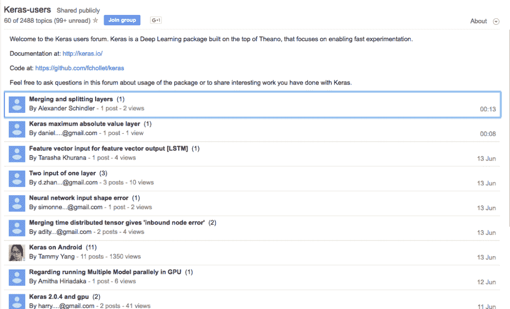
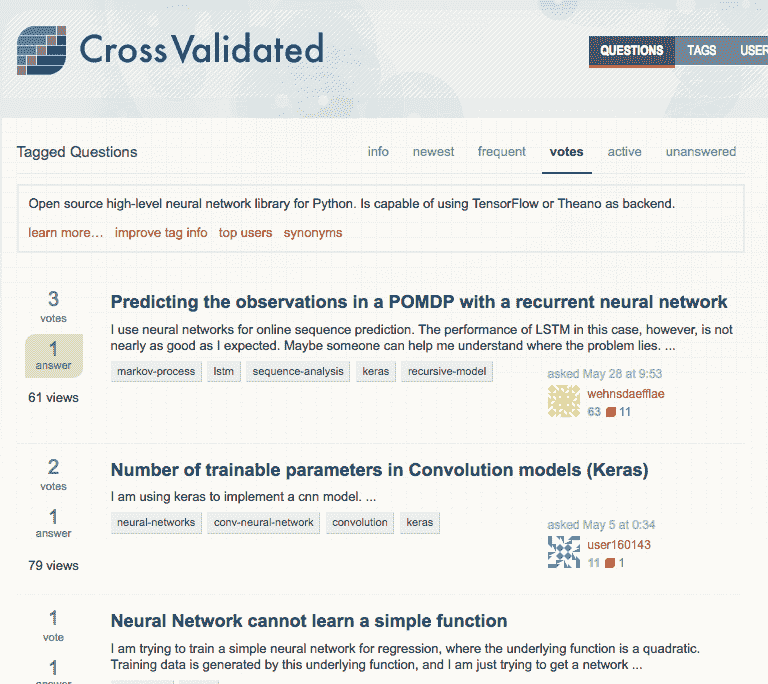

# 在 Keras 深度学习中获得帮助的 9 种方法

> 原文： [https://machinelearningmastery.com/get-help-with-keras/](https://machinelearningmastery.com/get-help-with-keras/)

Keras 是一个 Python 深度学习库，可以使用高效的 Theano 或 TensorFlow 符号数学库作为后端。

Keras 非常易于使用，您可以在几分钟内开发出您的第一个[多层感知机](http://machinelearningmastery.com/tutorial-first-neural-network-python-keras/)，[卷积神经网络](http://machinelearningmastery.com/handwritten-digit-recognition-using-convolutional-neural-networks-python-keras/)或 [LSTM 递归神经网络](http://machinelearningmastery.com/time-series-prediction-lstm-recurrent-neural-networks-python-keras/)。

当您开始使用 Keras 时，您可能会遇到技术问题，这时候您可能需要一些帮助。

在这篇文章中，您将会发现在 Keras 开发深度学习模型遇到问题时可以提供解决方案的 9 种途径。

让我们现在开始吧！

## 如何最好地使用这些资源

第一步是了解此从哪里可以获得帮助，但除此之外您需要知道如何充分利用这些资源。

以下是您可以使用的一些提示：

*   将您的问题简化为最简单的形式，例如：不应该是“_ 我的模型不起作用 _” 而是转化为 “_x 如何工作 _”。
*   在提问之前搜索答案。
*   提供尽可能小的工作示例来演示您的问题。

## 1\. Keras 用户 Google Group

Keras 用户 Google Group

也许向 Keras 社区提问的最直接的地方就是在 Google 群组（旧的 usenet）上的 Keras Users 群组上。

在这里，你不需要接受任何电子邮件，你可以直接在线访问，我推荐以下方式：

*   [Keras Google 用户组](https://groups.google.com/forum/#!forum/keras-users)

## 2\. Keras Slack Channel

也许 Keras Slacks 频道是可以直接聊聊 Keras 和相关问题的最佳方式。

这种方式现在基本上取代了 IM 和 IIRC。

不过，您必须先提交要求加入的申请。

*   [Keras Slack 加入表格](https://keras-slack-autojoin.herokuapp.com/)
*   [Keras Slack Channel](https://kerasteam.slack.com/)

## 3\. Gitter 上的 Keras

另一个交流 Keras 的好地方是 Keras Giiter，尽管组织比较松散，但这个平台上仍然有大量的人。

尽管在这个论坛里尽情“遨游”吧！

*   [Keras Gitter 组织](https://gitter.im/Keras-io/Lobby#)

## 4\. StackOverflow 上的 Keras 标签

StackOverflow 是一个致力于编程问题的问答网站，在这里有大量有关深度学习和与 Keras 相关的问题，我建议您可以直接搜索带有“_Keras_”标签的相关回答。

*   StackOverflow 上的 [Keras 标签](https://stackoverflow.com/questions/tagged/keras)

## 5. CrossValidated 上的 Keras 标签

CrossValidated 是一个致力于机器学习的问答网站，并且有很多关于 Keras 相关的问题，但它们可能多的是一些理论上的问题集合，而不是专注于代码和编程。

同样，我建议搜索并访问使用“_keras_”标签的问题。

*   CrossValidated 上的 [Keras 标签](https://stats.stackexchange.com/questions/tagged/keras)

## 6.数据科学上的 Keras 标签

支持 StackOverflow 和 CrossValidated 的 StackExchange 网站也有一个专用于 DataScience 的站点。

它现在仍处于测试阶段，尚未成为该网站的正式成员，尽管如此，该网站上还是有很多关于 Keras 的话题。

与其他两个站点不同，这些话题可能更多的以过程导向为主。

同样，我建议搜索并访问带有“`keras`”标签的话题。

*   [数据科学 StackExchange 中的 Keras 标签](https://datascience.stackexchange.com/questions/tagged/keras)

## 7\. Quora 上的 Keras 主题

Quora 是一个大型的通用问答网站（类似于中国的知乎），虽然它是通用的，但是仍然拥有很多技术相关的话题，包括 Keras 和深度学习。

这些问题的重点更多是基于文本解释和说明性的，您可能会获得有关技术的更多详细信息，而不是实现细节。

我建议您直接在“`Keras`”主题中搜索和提问。

*   关于 Quora 的 [Keras 主题](https://www.quora.com/topic/Keras)

## 8\. Keras Github 问题

Keras 是一个在 GitHub 上托管的开源项目。

GitHub 提供了一个基本的问题管理系统，Keras 项目报告了很多问题，虽然问题应该仅限于代码的技术问题，但在这些问题上对 Keras 的讨论却令人惊讶。

我建议您搜索 Keras 问题，但只有您在发现错误或有新功能请求时才发布您的问题（[请参阅指南](https://github.com/fchollet/keras/blob/master/CONTRIBUTING.md)）。

*   [Keras Github 问题](https://github.com/fchollet/keras/issues)

## 9\.Twitter 上的 Keras 问题

您可以直接在 Twitter 上快速获有关 Keras 的相关问题。

我建议您直接在 Twitter 搜索“`keras`”。

我建议您还可以使用“`keras`”标签进行搜索并发布新的问题。

*   Twitter 上的 [Keras 话题标签](https://twitter.com/hashtag/keras)

您也可以通过关注 Keras 背后的创造者和首席开发人员，[FrançoisChollet](https://twitter.com/fchollet)来获得对于 Keras 更深刻的理解。

## 其他 Keras 站点

以下是其他 Keras 网站，您可以在此获得相关帮助。

*   [Keras 官方博客](https://blog.keras.io/)
*   [Keras API 文档](https://keras.io/)
*   [Keras 源代码项目](https://github.com/fchollet/keras)

### 摘要

在这篇文章中，您了解了可以在全网范围内获得有关 Keras 深度学习的问答网站。

你有没有使用过这些资源？你是怎么做到的？

您是否想在其他地方获得有关 Keras 的帮助？请在下面的评论中告诉我。