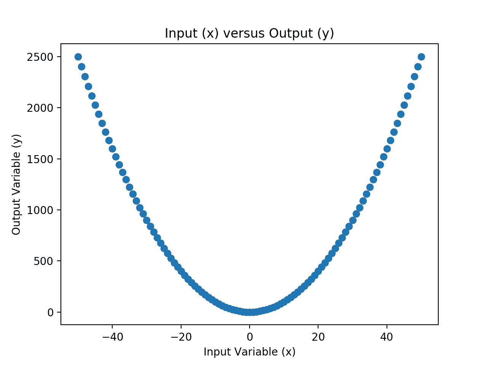

# 神经网络是函数近似算法

> 原文：<https://machinelearningmastery.com/neural-networks-are-function-approximators/>

最后更新于 2020 年 8 月 27 日

机器学习中的监督学习可以用函数近似来描述。

给定一个由输入和输出组成的数据集，我们假设有一个未知的底层函数，它在目标域中将输入映射到输出并生成数据集时是一致的。然后我们使用监督学习算法来近似这个函数。

神经网络是有监督的机器学习算法的一个例子，也许在函数近似的背景下最容易理解。这可以通过神经网络近似简单的一维函数的例子来证明，这有助于培养对模型所学内容的直觉。

在本教程中，您将发现神经网络作为函数近似算法背后的直觉。

完成本教程后，您将知道:

*   在数据上训练神经网络近似于从输入到输出的未知底层映射函数。
*   一维输入输出数据集为开发函数近似的直观性提供了有用的基础。
*   如何开发和评估用于函数近似的小型神经网络？

**用我的新书[用 Python 深度学习](https://machinelearningmastery.com/deep-learning-with-python/)来启动你的项目**，包括*分步教程*和所有示例的 *Python 源代码*文件。

我们开始吧。


神经网络是函数近似算法
图片由[达维宁](https://flickr.com/photos/daveynin/6281062965/)提供，版权所有。

## 教程概述

本教程分为三个部分；它们是:

1.  什么是函数近似
2.  简单函数的定义
3.  近似简单函数

## 什么是函数近似

[函数近似](https://en.wikipedia.org/wiki/Function_approximation)是一种使用来自域的历史或可用观测值来估计未知基础函数的技术。

人工神经网络学习近似一个函数。

在监督学习中，数据集由输入和输出组成，监督学习算法学习如何最好地将输入示例映射到输出示例。

我们可以把这个映射看作是由一个数学函数支配的，这个函数叫做**映射函数**，监督学习算法试图最好地近似的就是这个函数。

神经网络是监督学习算法的一个例子，它试图近似你的数据所代表的函数。这是通过计算预测输出和预期输出之间的误差并在训练过程中最小化该误差来实现的。

> 最好将前馈网络视为功能近似机器，旨在实现统计泛化，偶尔从我们对大脑的了解中获得一些见解，而不是将其视为大脑功能的模型。

—第 169 页，[深度学习](https://amzn.to/2rvcEi4)，2016。

我们说“*近似*”是因为虽然我们怀疑这样的映射函数存在，但我们对此一无所知。

将输入映射到输出的真实函数是未知的，通常被称为**目标函数**。这是学习过程的目标，也是我们试图仅使用可用数据来近似的功能。如果我们知道目标函数，我们就不需要近似它，也就是说，我们不需要有监督的机器学习算法。因此，当底层目标映射函数未知时，函数近似只是一个有用的工具。

我们所拥有的只是来自包含输入和输出示例的领域的观察。这意味着数据的大小和质量；例如:

*   我们拥有的例子越多，我们就越能理解映射函数。
*   观测中的噪声越小，我们对映射函数的近似就越清晰。

那么为什么我们喜欢用神经网络进行函数近似呢？

原因是他们是**通用近似器**。理论上，它们可以用来近似任何函数。

> ……通用近似定理指出，具有线性输出层和至少一个具有任何“挤压”激活函数(如逻辑 sigmoid 激活函数)的隐藏层的前馈网络可以用任何期望的非零误差量近似从一个有限维空间到另一个有限维空间的任何[…]函数，前提是网络被给予足够的隐藏单元

—第 198 页，[深度学习](https://amzn.to/2rvcEi4)，2016。

回归预测建模包括预测给定输入的数值。分类预测建模包括预测给定输入的类别标签。

这两个预测建模问题都可以看作是函数近似的例子。

为了使这一点具体化，我们可以回顾一个工作的例子。

在下一节中，让我们定义一个简单的函数，稍后我们可以对其进行近似。

## 简单函数的定义

我们可以定义一个具有一个数值输入变量和一个数值输出变量的简单函数，并以此作为理解函数近似的神经网络的基础。

我们可以定义一个数字域作为我们的输入，比如从-50 到 50 的浮点值。

然后，我们可以选择一个数学运算应用于输入，以获得输出值。选择的数学运算将是映射函数，因为我们正在选择它，所以我们将知道它是什么。实际上，情况并非如此，这就是为什么我们会使用像神经网络这样的监督学习算法来学习或发现映射函数。

在这种情况下，我们将使用输入的平方作为映射函数，定义为:

*   y = x^2

其中 *y* 为输出变量， *x* 为输入变量。

我们可以通过枚举输入变量范围内的值，计算每个输入的输出值并绘制结果，来为这个映射函数开发一种直觉。

下面的例子用 Python 实现了这一点。

```py
# example of creating a univariate dataset with a given mapping function
from matplotlib import pyplot
# define the input data
x = [i for i in range(-50,51)]
# define the output data
y = [i**2.0 for i in x]
# plot the input versus the output
pyplot.scatter(x,y)
pyplot.title('Input (x) versus Output (y)')
pyplot.xlabel('Input Variable (x)')
pyplot.ylabel('Output Variable (y)')
pyplot.show()
```

运行该示例首先在整个输入域中创建一个整数值列表。

然后使用映射函数计算输出值，然后用 x 轴上的输入值和 y 轴上的输出值创建一个图。



所选映射函数的输入和输出值散点图

输入和输出变量代表我们的数据集。

接下来，我们可以假装忘记我们知道映射函数是什么，并使用神经网络来重新学习或重新发现映射函数。

## 近似简单函数

我们可以在输入和输出的例子上拟合神经网络模型，看看该模型是否能够学习映射函数。

这是一个非常简单的映射函数，所以我们希望一个小的神经网络可以快速学习它。

我们将使用 Keras 深度学习库定义网络，并使用 Sklearn 库中的一些数据准备工具。

首先，让我们定义数据集。

```py
...
# define the dataset
x = asarray([i for i in range(-50,51)])
y = asarray([i**2.0 for i in x])
print(x.min(), x.max(), y.min(), y.max())
```

接下来，我们可以重塑数据，使输入和输出变量是每行一个观察值的列，正如使用监督学习模型时所预期的那样。

```py
...
# reshape arrays into into rows and cols
x = x.reshape((len(x), 1))
y = y.reshape((len(y), 1))
```

接下来，我们需要缩放输入和输出。

输入范围在-50 和 50 之间，而输出范围在-50^2 (2500)和 0^2 (0)之间。大的输入输出值会使[训练神经网络变得不稳定](https://machinelearningmastery.com/how-to-improve-neural-network-stability-and-modeling-performance-with-data-scaling/)，因此，先对数据进行缩放是个好主意。

我们可以使用[最小最大缩放器](https://Sklearn.org/stable/modules/generated/sklearn.preprocessing.MinMaxScaler.html)将输入值和输出值分别归一化为 0 到 1 之间的值。

```py
...
# separately scale the input and output variables
scale_x = MinMaxScaler()
x = scale_x.fit_transform(x)
scale_y = MinMaxScaler()
y = scale_y.fit_transform(y)
print(x.min(), x.max(), y.min(), y.max())
```

我们现在可以定义一个神经网络模型。

经过一些反复试验，我选择了一个模型，它有两个隐藏层，每层有 10 个节点。也许可以尝试其他配置，看看是否可以做得更好。

```py
...
# design the neural network model
model = Sequential()
model.add(Dense(10, input_dim=1, activation='relu', kernel_initializer='he_uniform'))
model.add(Dense(10, activation='relu', kernel_initializer='he_uniform'))
model.add(Dense(1))
```

我们将使用均方损失来拟合模型，并使用随机梯度下降的有效 adam 版本来优化模型。

这意味着模型在试图近似映射函数时，将寻求最小化预测值和预期输出值( *y* )之间的均方误差。

```py
...
# define the loss function and optimization algorithm
model.compile(loss='mse', optimizer='adam')
```

我们没有很多数据(例如，大约 100 行)，因此我们将适合 500 个时代的模型，并使用 10 的小批量。

同样，这些值是经过一点点反复试验后发现的；尝试不同的价值观，看看你是否能做得更好。

```py
...
# ft the model on the training dataset
model.fit(x, y, epochs=500, batch_size=10, verbose=0)
```

一旦符合，我们就可以评估模型。

我们将对数据集中的每个示例进行预测，并计算误差。完美的近似值是 0.0。这通常是不可能的，因为观测中的噪声、不完整的数据以及未知的底层映射函数的复杂性。

在这种情况下，这是可能的，因为我们有所有的观测值，数据中没有噪声，底层函数也不复杂。

首先，我们可以做出预测。

```py
...
# make predictions for the input data
yhat = model.predict(x)
```

然后，我们必须反转我们执行的缩放。

这是因为错误是以目标变量的原始单位报告的。

```py
...
# inverse transforms
x_plot = scale_x.inverse_transform(x)
y_plot = scale_y.inverse_transform(y)
yhat_plot = scale_y.inverse_transform(yhat)
```

然后，我们可以用目标变量的原始单位来计算和报告预测误差。

```py
...
# report model error
print('MSE: %.3f' % mean_squared_error(y_plot, yhat_plot))
```

最后，我们可以创建输入到输出的真实映射的散点图，并将其与输入到预测输出的映射进行比较，看看映射函数的近似在空间上是什么样子。

这有助于发展神经网络正在学习的东西背后的直觉。

```py
...
# plot x vs yhat
pyplot.scatter(x_plot,yhat_plot, label='Predicted')
pyplot.title('Input (x) versus Output (y)')
pyplot.xlabel('Input Variable (x)')
pyplot.ylabel('Output Variable (y)')
pyplot.legend()
pyplot.show()
```

将这些联系在一起，完整的示例如下所示。

```py
# example of fitting a neural net on x vs x^2
from sklearn.preprocessing import MinMaxScaler
from sklearn.metrics import mean_squared_error
from keras.models import Sequential
from keras.layers import Dense
from numpy import asarray
from matplotlib import pyplot
# define the dataset
x = asarray([i for i in range(-50,51)])
y = asarray([i**2.0 for i in x])
print(x.min(), x.max(), y.min(), y.max())
# reshape arrays into into rows and cols
x = x.reshape((len(x), 1))
y = y.reshape((len(y), 1))
# separately scale the input and output variables
scale_x = MinMaxScaler()
x = scale_x.fit_transform(x)
scale_y = MinMaxScaler()
y = scale_y.fit_transform(y)
print(x.min(), x.max(), y.min(), y.max())
# design the neural network model
model = Sequential()
model.add(Dense(10, input_dim=1, activation='relu', kernel_initializer='he_uniform'))
model.add(Dense(10, activation='relu', kernel_initializer='he_uniform'))
model.add(Dense(1))
# define the loss function and optimization algorithm
model.compile(loss='mse', optimizer='adam')
# ft the model on the training dataset
model.fit(x, y, epochs=500, batch_size=10, verbose=0)
# make predictions for the input data
yhat = model.predict(x)
# inverse transforms
x_plot = scale_x.inverse_transform(x)
y_plot = scale_y.inverse_transform(y)
yhat_plot = scale_y.inverse_transform(yhat)
# report model error
print('MSE: %.3f' % mean_squared_error(y_plot, yhat_plot))
# plot x vs y
pyplot.scatter(x_plot,y_plot, label='Actual')
# plot x vs yhat
pyplot.scatter(x_plot,yhat_plot, label='Predicted')
pyplot.title('Input (x) versus Output (y)')
pyplot.xlabel('Input Variable (x)')
pyplot.ylabel('Output Variable (y)')
pyplot.legend()
pyplot.show()
```

运行该示例首先报告输入和输出变量的值范围，然后报告缩放后相同变量的范围。这证实了缩放操作的执行符合我们的预期。

然后在数据集上拟合和评估模型。

**注**:考虑到算法或评估程序的随机性，或数值精确率的差异，您的[结果可能会有所不同](https://machinelearningmastery.com/different-results-each-time-in-machine-learning/)。考虑运行该示例几次，并比较平均结果。

在这种情况下，我们可以看到均方误差约为 1，300，单位为平方。如果我们计算平方根，这就给出了以原始单位表示的均方根误差(RMSE)。我们可以看到平均误差在 36 个单位左右，这是可以的，但不是很大。

**你得到了什么结果？**你能做得更好吗？
请在下面的评论中告诉我。

```py
-50 50 0.0 2500.0
0.0 1.0 0.0 1.0
MSE: 1300.776
```

然后创建散点图，比较输入和实际输出，以及输入和预测输出。

这两个数据系列之间的区别在于映射函数近似的误差。我们可以看出近似是合理的；它捕捉到了大致的形状。我们可以看到有错误，尤其是在 0 输入值附近。

这表明还有很大的改进空间，例如使用不同的激活函数或不同的网络架构来更好地近似映射函数。


神经网络近似的输入与实际和预测值的散点图

## 进一步阅读

如果您想更深入地了解这个主题，本节将提供更多资源。

### 教程

*   [你的第一个 Python 深度学习项目，采用 Keras 分步](https://machinelearningmastery.com/tutorial-first-neural-network-python-keras/)

### 书

*   [深度学习](https://amzn.to/2rvcEi4)，2016 年。

#### 文章

*   [函数近似，维基百科](https://en.wikipedia.org/wiki/Function_approximation)。

## 摘要

在本教程中，您发现了神经网络作为函数近似算法背后的直觉。

具体来说，您了解到:

*   在数据上训练神经网络近似于从输入到输出的未知底层映射函数。
*   一维输入输出数据集为开发函数近似的直观性提供了有用的基础。
*   如何开发和评估用于函数近似的小型神经网络？

你有什么问题吗？
在下面的评论中提问，我会尽力回答。