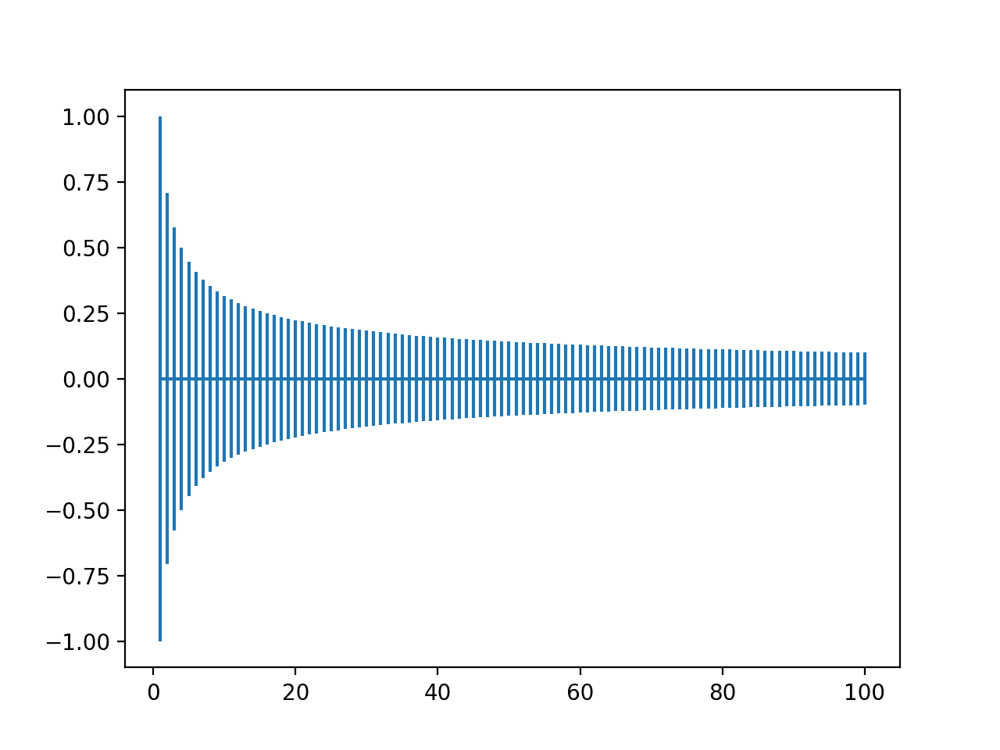
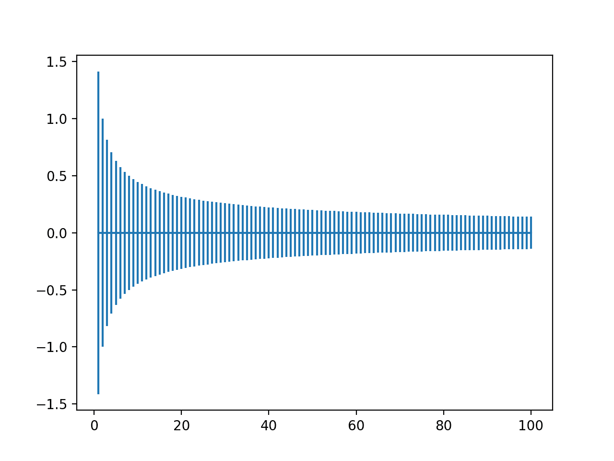

# 深度学习神经网络的权重初始化

> 原文：<https://machinelearningmastery.com/weight-initialization-for-deep-learning-neural-networks/>

最后更新于 2021 年 2 月 8 日

**权重初始化**是开发深度学习神经网络模型时的重要设计选择。

历史上，权重初始化涉及使用小随机数，尽管在过去十年中，已经开发了使用信息的更具体的试探法，例如正在使用的激活函数的类型和节点的输入数量。

这些更定制的试探法可以导致使用随机梯度下降优化算法更有效地训练神经网络模型。

在本教程中，您将发现如何为深度学习神经网络实现权重初始化技术。

完成本教程后，您将知道:

*   权重初始化用于在数据集上训练模型之前定义神经网络模型中参数的初始值。
*   如何实现用于使用 Sigmoid 或 Tanh 激活函数的节点的 xavier 和规范化 xavier 权重初始化试探法。
*   如何实现用于使用 ReLU 激活函数的节点的权重初始化启发式算法。

我们开始吧。

*   **2020 年 2 月更新**:修正了归一化泽维尔公式中的错别字。


深度学习神经网络的权重初始化
图片由[安德烈斯·阿尔瓦拉多](https://www.flickr.com/photos/104082864@N04/50552430823/)提供，保留部分权利。

## 教程概述

本教程分为三个部分；它们是:

1.  神经网络的权值初始化
2.  Sigmoid 和 Tanh 的权重初始化
    1.  泽维尔权重初始化
    2.  归一化泽维尔权重初始化
3.  ReLU 的权重初始化
    1.  何权重初始化

## 神经网络的权值初始化

**权重初始化**是设计神经网络模型的重要考虑因素。

神经网络中的节点由被称为权重的参数组成，用于计算输入的加权和。

神经网络模型使用一种称为随机梯度下降的优化算法进行拟合，该算法递增地改变网络权重以最小化损失函数，有望产生一组能够做出有用预测的模式权重。

该优化算法要求在可能的权重值空间中有一个起始点，从该点开始优化过程。权重初始化是将神经网络的权重设置为小的随机值的过程，该随机值定义了神经网络模型优化(学习或训练)的起点。

> ……训练深度模型是一项非常困难的任务，大多数算法都会受到初始化选择的强烈影响。初始点可以决定算法是否收敛，一些初始点非常不稳定，以至于算法遇到数值困难并完全失败。

—第 301 页，[深度学习](https://amzn.to/3qSk3C2)，2016。

每次，用不同的权重集初始化神经网络，导致优化过程的不同起点，并潜在地导致具有不同表现特征的不同最终权重集。

有关每次在同一数据集上训练相同算法时不同结果的预期的更多信息，请参见教程:

*   [为什么机器学习每次得到的结果都不一样？](https://machinelearningmastery.com/different-results-each-time-in-machine-learning/)

我们无法将所有权重初始化为值 0.0，因为优化算法会导致误差梯度出现一些不对称，从而开始有效搜索。

有关为什么用随机权重初始化神经网络的更多信息，请参见教程:

*   [为什么用随机权重初始化神经网络？](https://machinelearningmastery.com/why-initialize-a-neural-network-with-random-weights/)

历史上，权重初始化遵循简单的试探法，例如:

*   范围[-0.3，0.3]内的小随机值
*   范围[0，1]内的小随机值
*   [-1，1]范围内的小随机值

总的来说，这些试探法继续有效。

> 我们几乎总是将模型中的所有权重初始化为从高斯或均匀分布中随机抽取的值。高斯分布或均匀分布的选择似乎不太重要，但尚未进行详尽的研究。然而，初始分布的规模对优化过程的结果和网络的泛化能力都有很大的影响。

—第 302 页，[深度学习](https://amzn.to/3qSk3C2)，2016。

尽管如此，在过去的十年中，已经开发出了更多定制的方法，这些方法已经成为事实上的标准，因为它们可能导致稍微更有效的优化(模型训练)过程。

这些现代权重初始化技术根据正在初始化的节点中使用的激活函数类型进行划分，例如“ *Sigmoid 和 Tanh* ”和“ *ReLU* ”

接下来，让我们仔细看看这些针对具有 Sigmoid 和 Tanh 激活函数的节点的现代权重初始化试探法。

## Sigmoid 和 Tanh 的权重初始化

使用 Sigmoid 或 TanH 激活函数初始化神经网络层和节点权重的当前标准方法称为“ *glorot* 或“ *xavier* ”初始化。

它以[Xavier glrot](https://www.linkedin.com/in/xglorot/)命名，Xavier glrot 目前是 Google DeepMind 的研究科学家，Xavier 和 Yoshua Bengio 在 2010 年发表的题为“[理解训练深度前馈神经网络的难度](http://proceedings.mlr.press/v9/glorot10a.html)的论文中对此进行了描述。”

这个权重初始化方法有两个版本，我们称之为“ *xavier* ”和“*归一化 xavier* ”

> 格洛特和本吉奥建议采用适当比例的均匀分布进行初始化。这被称为“泽维尔”初始化[……]它的推导是基于激活是线性的假设。这个假设对 ReLU 和 PReLU 无效。

——[深入探究整流器:在 ImageNet 分类](https://arxiv.org/abs/1502.01852)上超越人类水平的表现，2015。

这两种方法都是在假设激活函数是线性的情况下推导出来的，然而，它们已经成为像 Sigmoid 和 Tanh 这样的非线性激活函数的标准，而不是 ReLU。

让我们依次仔细看看每一个。

### 泽维尔权重初始化

xavier 初始化方法被计算为在范围-(1/sqrt(n))和 1/sqrt(n)之间具有均匀概率分布(U)的随机数，其中 *n* 是节点的输入数。

*   weight = u[(1/sqrt(n))，1/sqrt(n)]

我们可以直接在 Python 中实现。

下面的示例假设一个节点有 10 个输入，然后计算范围的下限和上限，并计算 1000 个初始权重值，这些值可用于使用 sigmoid 或 tanh 激活函数的层或网络中的节点。

计算权重后，打印下限和上限，以及生成的权重的最小、最大、平均和标准偏差。

下面列出了完整的示例。

```py
# example of the xavier weight initialization
from math import sqrt
from numpy import mean
from numpy.random import rand
# number of nodes in the previous layer
n = 10
# calculate the range for the weights
lower, upper = -(1.0 / sqrt(n)), (1.0 / sqrt(n))
# generate random numbers
numbers = rand(1000)
# scale to the desired range
scaled = lower + numbers * (upper - lower)
# summarize
print(lower, upper)
print(scaled.min(), scaled.max())
print(scaled.mean(), scaled.std())
```

运行该示例会生成权重并打印汇总统计数据。

我们可以看到权重值的界限大约是-0.316 和 0.316。输入越少，这些界限越宽，输入越多，界限越窄。

我们可以看到，生成的权重遵守这些界限，平均权重值接近零，标准偏差接近 0.17。

```py
-0.31622776601683794 0.31622776601683794
-0.3157663248679193 0.3160839282916222
0.006806069733149146 0.17777128902976705
```

它还有助于了解权重的分布如何随着输入数量而变化。

为此，我们可以用从 1 到 100 的不同输入数计算权重初始化的界限，并绘制结果。

下面列出了完整的示例。

```py
# plot of the bounds on xavier weight initialization for different numbers of inputs
from math import sqrt
from matplotlib import pyplot
# define the number of inputs from 1 to 100
values = [i for i in range(1, 101)]
# calculate the range for each number of inputs
results = [1.0 / sqrt(n) for n in values]
# create an error bar plot centered on 0 for each number of inputs
pyplot.errorbar(values, [0.0 for _ in values], yerr=results)
pyplot.show()
```

运行该示例会创建一个图表，允许我们比较不同数量输入值的权重范围。

我们可以看到，在输入很少的情况下，范围很大，例如-1 到 1 或-0.7 到-7 之间。然后我们可以看到，我们的范围迅速下降到大约 20 个权重，接近-0.1 和 0.1，在这里它保持合理的恒定。



输入从 1 到 100 的泽维尔重量初始化范围图

### 归一化泽维尔权重初始化

归一化 xavier 初始化方法被计算为在范围-(sqrt(6)/sqrt(n + m))和 sqrt(6)/sqrt(n + m)之间具有均匀概率分布(U)的随机数，其中 *n* 表示节点的输入数量(例如前一层中的节点数量) *m* 表示该层的输出数量(例如当前层中的节点数量)。

*   weight = u[(sqrt(6)/sqrt(n+m))、sqrt(6)/sqrt(n + m)]

我们可以像上一节一样直接在 Python 中实现这一点，并总结 1000 个生成权重的统计摘要。

下面列出了完整的示例。

```py
# example of the normalized xavier weight initialization
from math import sqrt
from numpy import mean
from numpy.random import rand
# number of nodes in the previous layer
n = 10
# number of nodes in the next layer
m = 20
# calculate the range for the weights
lower, upper = -(sqrt(6.0) / sqrt(n + m)), (sqrt(6.0) / sqrt(n + m))
# generate random numbers
numbers = rand(1000)
# scale to the desired range
scaled = lower + numbers * (upper - lower)
# summarize
print(lower, upper)
print(scaled.min(), scaled.max())
print(scaled.mean(), scaled.std())
```

运行该示例会生成权重并打印汇总统计数据。

我们可以看到权重值的界限大约是-0.447 和 0.447。输入越少，这些界限越宽，输入越多，界限越窄。

我们可以看到，生成的权重遵守这些界限，平均权重值接近零，标准偏差接近 0.17。

```py
-0.44721359549995787 0.44721359549995787
-0.4447861894315135 0.4463641245392874
-0.01135636099916006 0.2581340352889168
```

它还有助于了解权重的分布如何随着输入数量而变化。

为此，我们可以用从 1 到 100 的不同输入数和 10 个固定输出数计算权重初始化的界限，并绘制结果。

下面列出了完整的示例。

```py
# plot of the bounds of normalized xavier weight initialization for different numbers of inputs
from math import sqrt
from matplotlib import pyplot
# define the number of inputs from 1 to 100
values = [i for i in range(1, 101)]
# define the number of outputs
m = 10
# calculate the range for each number of inputs
results = [1.0 / sqrt(n + m) for n in values]
# create an error bar plot centered on 0 for each number of inputs
pyplot.errorbar(values, [0.0 for _ in values], yerr=results)
pyplot.show()
```

运行该示例会创建一个图表，允许我们比较不同数量输入值的权重范围。

我们可以看到，在输入较少的情况下，范围从-0.3 到 0.3 左右开始变宽，随着输入数量的增加，范围减小到-0.1 到 0.1 左右。

与上一节中的非标准化版本相比，范围最初较小，尽管以类似的速率过渡到紧凑范围。


输入从 1 到 100 的归一化泽维尔权重初始化范围图

## ReLU 的权重初始化

当用于初始化使用整流线性( [ReLU](https://machinelearningmastery.com/rectified-linear-activation-function-for-deep-learning-neural-networks/) )激活函数的网络时，发现“ *xavier* ”权重初始化有问题。

因此，该方法的修改版本是专门为使用 ReLU 激活的节点和层开发的，在大多数多层感知机和卷积神经网络模型的隐藏层中很流行。

当前使用校正线性(ReLU)激活函数初始化神经网络层和节点权重的标准方法被称为“T0”初始化。

它以的研究科学家何命名，在何等人 2015 年的论文《深入研究整流器:在 ImageNet 分类中超越人类水平的表现》中有描述

### 何权重初始化

该初始化方法被计算为具有高斯概率分布(G)的随机数，平均值为 0.0，标准偏差为 sqrt(2/n)，其中 *n* 是节点的输入数。

*   重量=克(0.0，平方英尺(2/n))

我们可以直接在 Python 中实现。

下面的示例假设节点有 10 个输入，然后计算高斯分布的标准偏差，并计算 1000 个初始权重值，这些值可用于使用 ReLU 激活函数的层或网络中的节点。

计算权重后，将打印计算的标准偏差以及生成权重的最小、最大、平均和标准偏差。

下面列出了完整的示例。

```py
# example of the he weight initialization
from math import sqrt
from numpy.random import randn
# number of nodes in the previous layer
n = 10
# calculate the range for the weights
std = sqrt(2.0 / n)
# generate random numbers
numbers = randn(1000)
# scale to the desired range
scaled = numbers * std
# summarize
print(std)
print(scaled.min(), scaled.max())
print(scaled.mean(), scaled.std())
```

运行该示例会生成权重并打印汇总统计数据。

我们可以看到，权重的计算标准偏差的界限约为 0.447。输入越少，标准偏差越大，输入越多，标准偏差越小。

我们可以看到权重的范围约为-1.573 到 1.433，接近理论范围约为-1.788 和 1.788，是[标准偏差的 4 倍，在高斯分布](https://en.wikipedia.org/wiki/68%E2%80%9395%E2%80%9399.7_rule)中捕获了 99.7%的观测值。我们还可以看到，生成权重的均值和标准差分别接近规定的 0.0 和 0.447。

```py
0.4472135954999579
-1.5736761136523203 1.433348584081719
-0.00023406487278826836 0.4522609460629265
```

它还有助于了解权重的分布如何随着输入数量而变化。

为此，我们可以用从 1 到 100 的不同输入数计算权重初始化的界限，并绘制结果。

下面列出了完整的示例。

```py
# plot of the bounds on he weight initialization for different numbers of inputs
from math import sqrt
from matplotlib import pyplot
# define the number of inputs from 1 to 100
values = [i for i in range(1, 101)]
# calculate the range for each number of inputs
results = [sqrt(2.0 / n) for n in values]
# create an error bar plot centered on 0 for each number of inputs
pyplot.errorbar(values, [0.0 for _ in values], yerr=results)
pyplot.show()
```

运行该示例会创建一个图表，允许我们比较不同数量输入值的权重范围。

我们可以看到，在输入很少的情况下，范围很大，接近-1.5 和 1.5 或-1.0 到-1.0。然后我们可以看到，我们的范围迅速下降到大约 20 个权重，接近-0.1 和 0.1，在这里它保持合理的恒定。



输入从 1 到 100 的重量初始化范围图

## 进一步阅读

如果您想更深入地了解这个主题，本节将提供更多资源。

### 教程

*   [为什么用随机权重初始化神经网络？](https://machinelearningmastery.com/why-initialize-a-neural-network-with-random-weights/)
*   [整流线性单元的温和介绍](https://machinelearningmastery.com/rectified-linear-activation-function-for-deep-learning-neural-networks/)

### 报纸

*   [理解深度前馈神经网络的训练难度](http://proceedings.mlr.press/v9/glorot10a.html)，2010。
*   [深究整流器:在 ImageNet 分类上超越人类水平的表现](https://arxiv.org/abs/1502.01852)，2015。

### 书

*   [深度学习](https://amzn.to/3qSk3C2)，2016 年。

## 摘要

在本教程中，您发现了如何为深度学习神经网络实现权重初始化技术。

具体来说，您了解到:

*   权重初始化用于在数据集上训练模型之前定义神经网络模型中参数的初始值。
*   如何实现用于使用 Sigmoid 或 Tanh 激活函数的节点的 xavier 和规范化 xavier 权重初始化试探法。
*   如何实现用于使用 ReLU 激活函数的节点的权重初始化启发式算法。

**你有什么问题吗？**
在下面的评论中提问，我会尽力回答。