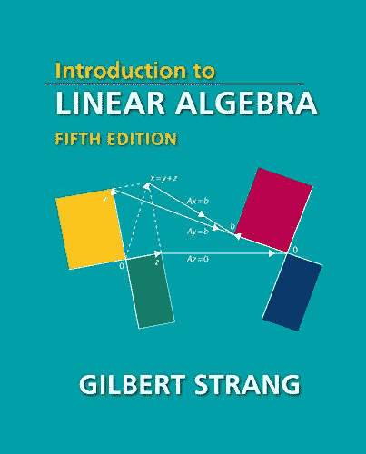
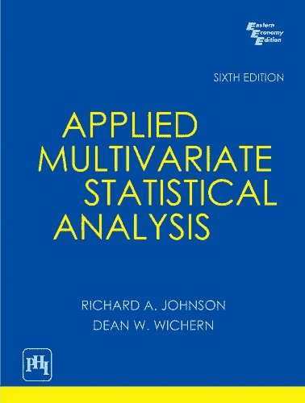

# 在机器学习中学习线性代数的主要资源

> 原文： [https://machinelearningmastery.com/resources-for-linear-algebra-in-machine-learning/](https://machinelearningmastery.com/resources-for-linear-algebra-in-machine-learning/)

### 如何获得机器学习的线性代数帮助？

线性代数是数学领域，是机器学习领域的重要支柱。

对于初学者或几十年来没有看过这个主题的从业者来说，这可能是一个具有挑战性的话题。

在这篇文章中，您将了解如何获得机器学习的线性代数帮助。

阅读这篇文章后，你会知道：

*   您可以参考线性代数的维基百科文章和教科书。
*   您可以学习或复习线性代数的大学课程和在线课程。
*   问答网站，您可以在其中发布有关线性代数主题的问题。

让我们开始吧。

学习用于机器学习的线性代数的主要资源
照片来自 [mickey](https://www.flickr.com/photos/mc-pictures/7870273950/) ，保留一些权利。

## 概观

这篇文章分为 6 个部分;他们是：

1.  维基百科上的线性代数
2.  线性代数教科书
3.  线性代数大学课程
4.  线性代数在线课程
5.  询问有关线性代数的问题
6.  NumPy 资源

## 维基百科上的线性代数

维基百科是一个很好的起点。

涵盖了所有重要主题，描述简洁，方程式一致且可读。缺少的是更多的人类层面描述，如类比和直觉。

然而，当你对线性代数有疑问时，我建议先按维基百科停止。

一些好的高级页面包括：

*   [线性代数](https://en.wikipedia.org/wiki/Linear_algebra)
*   [矩阵（数学）](https://en.wikipedia.org/wiki/Matrix_(mathematics))
*   [矩阵分解](https://en.wikipedia.org/wiki/Matrix_decomposition)
*   [线性代数主题列表](https://en.wikipedia.org/wiki/List_of_linear_algebra_topics)

## 线性代数教科书

我强烈建议您获得一本关于线性代数主题的优秀教科书，并将其作为参考。

好的教科书的好处是，您所需的各种操作的解释将是一致的（或应该是）。教科书的缺点是它们可能非常昂贵。

一本好的教科书通常很容易被发现，因为它将成为顶尖大学的一系列本科或研究生课程的基础。

我推荐的一些关于线性代数的入门教材包括：

*   [线性代数简介](http://amzn.to/2j2J0g4)，第五版，Gilbert Strang，2016。
*   [Linear Algebra Done Right](http://amzn.to/2BGuEqI) ，第三版，2015 年。
*   [没有废话指导线性代数](http://amzn.to/2k76D4C)，Ivan Savov，2017 年。

我推荐的一些更高级的教科书包括：

*   [Matrix Computations](http://amzn.to/2B9xnLD) ，Gene Golub 和 Charles Van Loan，2012。
*   [数值线性代数](http://amzn.to/2kjEF4S)，Lloyd Trefethen 和 David Bau 1997。

我还推荐一本关于多元统计的好教科书，它是线性代数和数值统计方法的交集。一些好的入门教材包括：

*   [应用多变量统计分析](http://amzn.to/2AUcEc5)，Richard Johnson 和 Dean Wichern，2012 年。
*   [应用多变量统计分析](http://amzn.to/2AWIViz)，Wolfgang Karl Hardle 和 Leopold Simar，2015 年。

还有许多由学者撰写的免费在线书籍。有关广泛（且令人印象深刻）的阅读列表，请参阅 Wikipedia 上[线性代数页面的末尾。](https://en.wikipedia.org/wiki/Linear_algebra#Further_reading)

## 线性代数大学课程

关于线性代数的大学课程是有用的，因为它们布置了本科生应该知道的主题。

作为一个机器学习从业者，它不仅仅是你需要的，而是为你需要知道的元素提供上下文。

许多大学课程现在提供 PDF 版本的演讲幻灯片，笔记和阅读材料。有些人甚至提供预先录制的视频讲座，这些讲座非常宝贵。

我鼓励您通过浸入课程来手术使用大学课程材料，以获得有关特定主题的更深入的知识。我认为通过端到端的特定课程进行操作太耗费时间，并且对于普通的机器学习从业者来说太多了。

美国顶尖学校的一些推荐课程包括：

*   麻省理工学院的[线性代数](https://ocw.mit.edu/courses/mathematics/18-06-linear-algebra-spring-2010/index.htm)由 Gilbert Strang 撰写。
*   [计算机科学中的矩阵](http://cs.brown.edu/courses/cs053/current/index.htm)在布朗由菲利普克莱因。
*   [计算线性代数](https://github.com/fastai/numerical-linear-algebra/)，由雷切尔托马斯在旧金山大学编码。

## 线性代数在线课程

在线课程与大学课程不同。

它们专为远程教育而设计，通常不如完整的本科课程完整或不那么严格。对于希望快速掌握主题的机器学习从业者而言，这是一个很好的功能。

如果课程很短，可能值得通过端到端进行。一般而言，和大学课程一样，我建议对主题进行外科手术并根据需要进行深入研究。

我推荐的一些在线课程包括：

*   [可汗学院的线性代数](https://www.khanacademy.org/math/linear-algebra)
*   [线性代数：edX 上的前沿基础](https://www.edx.org/course/laff-linear-algebra-foundations-to-frontiers)

## 询问有关线性代数的问题

鉴于当前丰富的问答平台，有很多地方可以在线询问有关线性代数的问题。

以下是我建议发布问题的热门地点列表。请务必在发布之前搜索您的问题，以防以前被询问和回答。

*   [数学栈交换中的线性代数标签](https://math.stackexchange.com/?tags=linear-algebra)
*   [交叉验证的线性代数标签](https://stats.stackexchange.com/questions/tagged/linear-algebra)
*   [Stack Overflow](https://stackoverflow.com/questions/tagged/linear-algebra) 上的线性代数标签
*   [Quora 上的线性代数](https://www.quora.com/topic/Linear-Algebra)
*   [Math Subreddit](https://www.reddit.com/r/math/)

## NumPy 资源

在 Python 中实现线性代数时，您可能需要 NumPy 的帮助。

NumPy API 文档非常好，下面是一些资源，您可以使用它们来了解有关 NumPy 如何工作或如何使用特定 NumPy 函数的更多信息。

*   [NumPy 参考](https://docs.scipy.org/doc/numpy/reference/)
*   [NumPy 数组创建例程](https://docs.scipy.org/doc/numpy/reference/routines.array-creation.html)
*   [NumPy 数组操作例程](https://docs.scipy.org/doc/numpy/reference/routines.array-manipulation.html)
*   [NumPy 线性代数](https://docs.scipy.org/doc/numpy/reference/routines.linalg.html)
*   [SciPy 线性代数](https://docs.scipy.org/doc/scipy/reference/linalg.html)

如果您正在寻找对 NumPy 和 SciPy 使用的更广泛理解，以下书籍提供了一个很好的起始参考：

*   [Python for Data Analysis](http://amzn.to/2B1sfXi) ，2017。
*   [优雅的 SciPy](http://amzn.to/2yujXnT) ，2017。
*   [NumPy 指南](http://amzn.to/2j3kEzd)，2015 年。

## 摘要

在这篇文章中，您发现了如何获得机器学习的线性代数帮助。

具体来说，您了解到：

*   您可以参考线性代数的维基百科文章和教科书。
*   您可以学习或复习线性代数的大学课程和在线课程。
*   问答网站，您可以在其中发布有关线性代数主题的问题。

你有任何问题吗？
在下面的评论中提出您的问题，我会尽力回答。