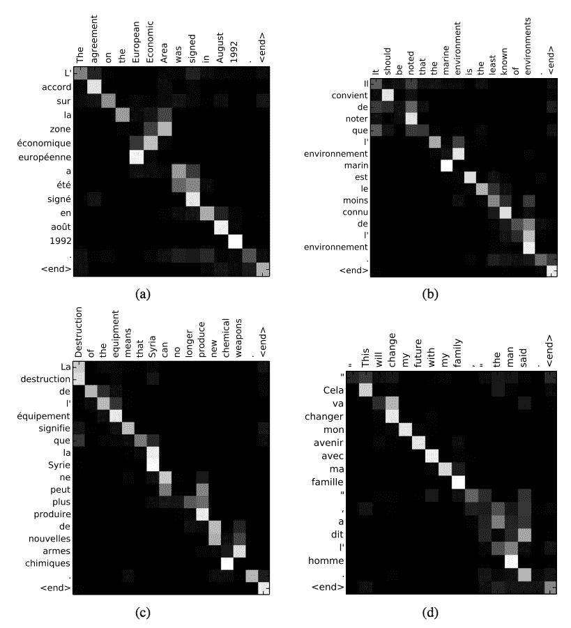
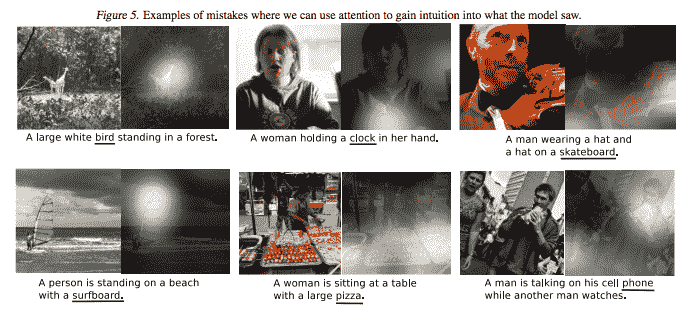
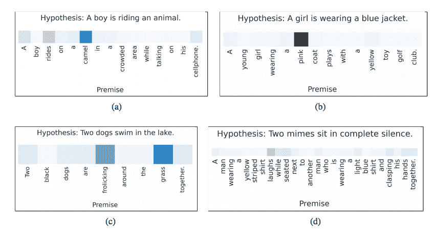
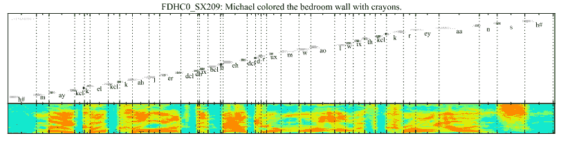

# 长短时记忆循环神经网络的注意事项

> 原文： [https://machinelearningmastery.com/attention-long-short-term-memory-recurrent-neural-networks/](https://machinelearningmastery.com/attention-long-short-term-memory-recurrent-neural-networks/)

编码器 - 解码器架构很受欢迎，因为它已经在一系列领域中展示了最先进的结果。

该体系结构的局限性在于它将输入序列编码为固定长度的内部表示。这对可以合理学习的输入序列的长度施加了限制，并且导致非常长的输入序列的表现更差。

在这篇文章中，您将发现寻求克服此限制的循环神经网络的注意机制。

阅读这篇文章后，你会知道：

*   编码 - 解码器架构和固定长度内部表示的限制。
*   克服限制的注意机制允许网络在输出序列中的每个项目的输入序列中学习在哪里注意。
*   在诸如文本翻译，语音识别等领域中具有循环神经网络的注意机制的5种应用。

让我们开始吧。

长期记忆循环神经网络
的注意事项 [Jonas Schleske](https://www.flickr.com/photos/jonasschleske/11457906754/) 的照片，保留一些权利。

## 长序列的问题

编码器 - 解码器循环神经网络是这样的架构，其中一组LSTM学习将输入序列编码成固定长度的内部表示，第二组LSTM读取内部表示并将其解码成输出序列。

这种架构已经在诸如文本翻译等困难的序列预测问题上展示了最先进的结果，并迅速成为主导方法。

例如，请参阅：

*   [用神经网络进行序列学习的序列](https://arxiv.org/abs/1409.3215)，2014
*   [使用RNN编码器 - 解码器进行统计机器翻译的学习短语表示](https://arxiv.org/abs/1406.1078)，2014

编码器 - 解码器架构仍然在广泛的问题上实现了出色的结果。然而，它受到所有输入序列被强制编码为固定长度内部向量的约束。

这被认为限制了这些网络的表现，特别是在考虑长输入序列时，例如文本翻译问题中的非常长的句子。

> 这种编码器 - 解码器方法的潜在问题是神经网络需要能够将源句子的所有必要信息压缩成固定长度的向量。这可能使神经网络难以处理长句，特别是那些比训练语料库中的句子长的句子。

- Dzmitry Bahdanau等，[神经机器翻译通过联合学习调整和翻译](https://arxiv.org/abs/1409.0473)，2015

## 序列中的注意事项

注意是将编码器 - 解码器架构从固定长度内部表示中释放出来的想法。

这是通过保持来自编码器LSTM的中间输出来自输入序列的每个步骤并训练模型以学习选择性地关注这些输入并将它们与输出序列中的项目相关联来实现的。

换句话说，输出序列中的每个项都取决于输入序列中的选择项。

> 每次所提出的模型在翻译中生成单词时，它（软）搜索源语句中的一组位置，其中最相关的信息被集中。然后，模型基于与这些源位置和所有先前生成的目标词相关联的上下文向量来预测目标词。
> 
> ...它将输入句子编码成一系列向量，并在解码翻译时自适应地选择这些向量的子集。这使得神经翻译模型不必将源句的所有信息（无论其长度）压缩成固定长度的向量。

— Dzmitry Bahdanau, et al., [Neural machine translation by jointly learning to align and translate](https://arxiv.org/abs/1409.0473), 2015

这增加了模型的计算负担，但产生了更有针对性和更好表现的模型。

此外，该模型还能够显示在预测输出序列时如何关注输入序列。这有助于理解和诊断模型正在考虑的具体内容以及特定输入 - 输出对的程度。

> 所提出的方法提供了一种直观的方式来检查生成的翻译中的单词与源句中的单词之间的（软）对齐。这是通过可视化注释权重来完成的......每个图中矩阵的每一行都表示与注释相关的权重。由此我们看到源句中哪些位置在生成目标词时被认为更重要。

— Dzmitry Bahdanau, et al., [Neural machine translation by jointly learning to align and translate](https://arxiv.org/abs/1409.0473), 2015

## 大图像问题

应用于计算机视觉问题的卷积神经网络也受到类似的限制，其中在非常大的图像上学习模型可能是困难的。

结果，可以对大图像进行一系列的瞥见，以在进行预测之前形成图像的近似印象。

> 人类感知的一个重要特性是人们不会倾向于一次完整地处理整个场景。相反，人们将注意力有选择地集中在视觉空间的某些部分上以在需要的时间和地点获取信息，并且随着时间的推移组合来自不同注视的信息以建立场景的内部表示，指导未来的眼睛运动和决策。

- [视觉注意的复发模型](https://arxiv.org/abs/1406.6247)，2014

这些基于瞥见的修改也可能被视为关注，但在本文中未予考虑。

看文件。

*   [视觉注意的复发模型](https://arxiv.org/abs/1406.6247)，2014
*   [DRAW：用于图像生成的循环神经网络](https://arxiv.org/abs/1502.04623)，2014
*   [具有视觉注意力的多目标识别](https://arxiv.org/abs/1412.7755)，2014

## 5序列预测中的注意事项

本节提供了一些具体示例，说明如何将注意力用于具有循环神经网络的序列预测。

### 1.文本翻译中的注意力

上面提到的激励例子是文本翻译。

给定法语句子的输入序列，翻译并输出英语句子。注意用于注意输出序列中每个单词的输入序列中的特定单词。

> 我们通过在生成每个目标字时对模型（软）搜索一组输入字或由编码器计算的注释来扩展基本编码器 - 解码器。这使得模型不必将整个源句子编码成固定长度的向量，并且还使模型仅关注与下一个目标词的生成相关的信息。

— Dzmitry Bahdanau, et al., [Neural machine translation by jointly learning to align and translate](https://arxiv.org/abs/1409.0473), 2015

法语与英语翻译的注意解释
摘自Dzmitry Bahdanau等人，通过联合学习对齐和翻译的神经机器翻译，2015

### 2.图像描述中的注意事项

与瞥见方法不同，基于序列的注意机制可以应用于计算机视觉问题，以帮助了解如何在输出序列（例如标题）时最好地使用卷积神经网络来关注图像。

给定图像的输入，输出图像的英文描述。注意用于将焦点集中在输出序列中每个单词的图像的不同部分。

> 我们提出了一种基于注意力的方法，它可以在三个基准数据集上提供最先进的表现...我们还展示了如何利用学习的注意力来为模型生成过程提供更多的可解释性，并证明学习的对齐与人类的直觉非常吻合。 。

输入图像输出图像的注意解释
取自显示，参与和告诉：神经图像标题生成与视觉注意，2016

- [显示，参与和讲述：视觉注意的神经图像标题生成](https://arxiv.org/abs/1502.03044)，2016

### 3.蕴涵中的注意力

给出一个前提情景和关于英语情景的假设，输出前提是否矛盾，是否相关，或是否有假设。

例如：

*   前提：“_婚礼派对拍照_”
*   假设：“_有人结婚_”

注意用于将假设中的每个单词与前提中的单词相关联，反之亦然。

> 我们提出了一个基于LSTM的神经模型，它一次读取两个句子来确定蕴涵，而不是将每个句子独立地映射到语义空间。我们用神经逐字注意机制来扩展这个模型，以鼓励对词语和短语对的蕴涵进行推理。 ......具有逐字神经注意力的扩展超越了这一强大的基准LSTM结果2.6个百分点，创造了一种新的最先进的准确性......

- [关于神经注意蕴涵的推理](https://arxiv.org/abs/1509.06664)，2016年

关于假设词的前提词的注意解释
摘自2016年神经注意蕴涵的推理

### 4.语音识别中的注意力

给定英语语音片段的输入序列，输出一系列音素。

注意用于将输出序列中的每个音素与输入序列中的特定音频帧相关联。

> ...基于混合注意机制的新颖的端到端可训练语音识别架构，其结合内容和位置信息以便选择输入序列中的下一个位置用于解码。所提出的模型的一个理想特性是它能够比它训练的那些更长时间地识别话语。

- [基于注意力的语音识别模型](https://arxiv.org/abs/1506.07503)，2015。

从基于注意力的语音识别模型中获取音频输入帧的输出音素位置的注意解释
，2015

### 5.文本摘要中的注意事项

给定英文文章的输入序列，输出一系列总结输入的英语单词。

注意用于将输出摘要中的每个单词与输入文档中的特定单词相关联。

> 基于神经机器翻译的最新发展，基于神经注意的抽象概括模型。我们将此概率模型与生成算法相结合，生成算法可生成准确的抽象摘要。

- [抽象句概括的神经注意模型](https://arxiv.org/abs/1509.00685)，2015

输入文件中输入文字中词汇的注意解释
摘自抽象句概括的神经注意模型，2015。

## 进一步阅读

如果您想了解有关增加对LSTM的关注的更多信息，本节将提供其他资源。

*   [深度学习和NLP中的注意力和记忆](http://www.wildml.com/2016/01/attention-and-memory-in-deep-learning-and-nlp/)
*   [注意机制](https://blog.heuritech.com/2016/01/20/attention-mechanism/)
*   [应用于NLP的基于注意力模型的调查](http://yanran.li/peppypapers/2015/10/07/survey-attention-model-1.html)
*   [RNN引入的注意机制究竟是什么？ Quora上的](https://www.quora.com/What-is-exactly-the-attention-mechanism-introduced-to-RNN-recurrent-neural-network-It-would-be-nice-if-you-could-make-it-easy-to-understand)。
*   [什么是神经网络中的注意机制？](https://www.quora.com/What-is-Attention-Mechanism-in-Neural-Networks)

在撰写本文时，Keras并未提供开箱即用的注意事项，但很少有第三方实施。看到：

*   [使用Keras进行问答的深度语言建模](http://ben.bolte.cc/blog/2016/language.html)
*   [注意模型可用！](https://github.com/fchollet/keras/issues/2067)
*   [Keras注意机制](https://github.com/philipperemy/keras-attention-mechanism)
*   [注意和增强循环神经网络](http://distill.pub/2016/augmented-rnns/)
*   [如何在循环层（文本分类）](https://github.com/fchollet/keras/issues/4962)之上添加注意
*   [注意机制实施问题](https://github.com/fchollet/keras/issues/1472)
*   [实施简单的神经注意模型（用于填充输入）](https://github.com/fchollet/keras/issues/2612)
*   [注意层需要另一个PR](https://github.com/fchollet/keras/issues/1094)
*   [seq2seq库](https://github.com/farizrahman4u/seq2seq)

你知道在循环神经网络中有一些关注的好资源吗？
请在评论中告诉我。

## 摘要

在这篇文章中，您发现了LSTM循环神经网络的序列预测问题的注意机制。

具体来说，你学到了：

*   用于循环神经网络的编码器 - 解码器架构使用固定长度的内部表示，其施加限制学习非常长的序列的约束。
*   该注意力通过允许网络学习在哪里注意输出序列中的每个项目的输入来克服编码 - 解码器架构中的限制。
*   该方法已用于不同类型的序列预测问题，包括文本翻译，语音识别等。

您对复发神经网络中的注意力有任何疑问吗？
在下面的评论中提出您的问题，我会尽力回答。