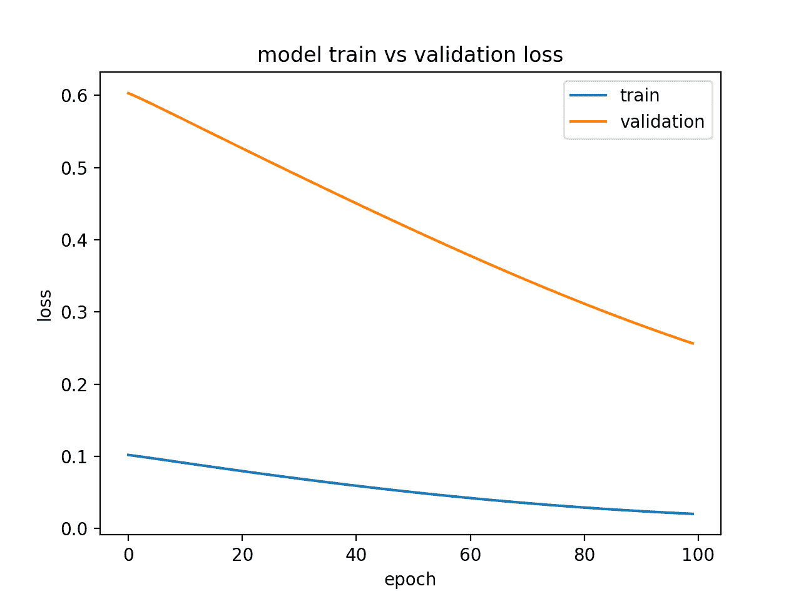

# 如何诊断LSTM模型的过度拟合和欠拟合

> 原文： [https://machinelearningmastery.com/diagnose-overfitting-underfitting-lstm-models/](https://machinelearningmastery.com/diagnose-overfitting-underfitting-lstm-models/)

可能很难确定您的长短期记忆模型是否在您的序列预测问题上表现良好。

您可能获得了良好的模型技能分数，但重要的是要知道您的模型是否适合您的数据，或者它是不合适还是过度适应，并且可以使用不同的配置做得更好。

在本教程中，您将了解如何诊断LSTM模型在序列预测问题上的拟合程度。

完成本教程后，您将了解：

*   如何收集和绘制LSTM模型的训练历史。
*   如何诊断身体不适，身体健康和过度模特。
*   如何通过平均多个模型运行来开发更强大的诊断。

让我们开始吧。

## 教程概述

本教程分为6个部分;他们是：

1.  在Keras训练历史
2.  诊断图
3.  Underfit示例
4.  合适的例子
5.  适合例子
6.  多次运行示例

## 1.在Keras训练历史

通过查看模型的表现，您可以了解很多关于模型行为的信息。

通过调用 _fit（）_函数来训练LSTM模型。此函数返回一个名为_历史记录_的变量，该变量包含损失的跟踪以及在编译模型期间指定的任何其他指标。这些分数记录在每个时代的末尾。

```py
...
history = model.fit(...)
```

例如，如果编译模型以优化对数损失（ _binary_crossentropy_ ）并测量每个时期的准确度，则将计算对数损失和准确度并记录在每个训练时期的历史记录中。

通过调用 _fit（）_返回的历史对象中的键访问每个分数。默认情况下，在拟合模型时优化的损失称为“_损失_”，精度称为“ _acc_ ”。

```py
...
model.compile(loss='binary_crossentropy', optimizer='adam', metrics=['accuracy'])
history = model.fit(X, Y, epochs=100)
print(history.history['loss'])
print(history.history['acc'])
```

Keras还允许您在拟合模型时指定单独的验证数据集，也可以使用相同的损失和指标进行评估。

这可以通过在 _fit（）_上设置 _validation_split_ 参数来使用一部分训练数据作为验证数据集来完成。

```py
...
history = model.fit(X, Y, epochs=100, validation_split=0.33)
```

这也可以通过设置 _validation_data_ 参数并传递X和y数据集的元组来完成。

```py
...
history = model.fit(X, Y, epochs=100, validation_data=(valX, valY))
```

在验证数据集上评估的度量标准使用相同的名称进行键控，并带有“ _val__ ”前缀。

```py
...
model.compile(loss='binary_crossentropy', optimizer='adam', metrics=['accuracy'])
history = model.fit(X, Y, epochs=100, validation_split=0.33)
print(history.history['loss'])
print(history.history['acc'])
print(history.history['val_loss'])
print(history.history['val_acc'])
```

## 2.诊断图

LSTM模型的训练历史记录可用于诊断模型的行为。

您可以使用Matplotlib库绘制模型的表现。例如，您可以如下绘制训练损失与测试损失的关系：

```py
from matplotlib import pyplot
...
history = model.fit(X, Y, epochs=100, validation_data=(valX, valY))
pyplot.plot(history.history['loss'])
pyplot.plot(history.history['val_loss'])
pyplot.title('model train vs validation loss')
pyplot.ylabel('loss')
pyplot.xlabel('epoch')
pyplot.legend(['train', 'validation'], loc='upper right')
pyplot.show()
```

创建和查看这些图可以帮助您了解可能的新配置，以便从模型中获得更好的表现。

接下来，我们将看一些例子。我们将考虑训练上的模型技能和最小化损失的验证集。您可以使用对您的问题有意义的任何指标。

## 3.适合的例子

欠适应模型被证明在训练数据集上表现良好而在测试数据集上表现不佳。

这可以从训练损失低于验证损失的图中诊断出来，并且验证损失具有表明可以进一步改进的趋势。

下面提供了一个下装LSTM模型的小例子。

```py
from keras.models import Sequential
from keras.layers import Dense
from keras.layers import LSTM
from matplotlib import pyplot
from numpy import array

# return training data
def get_train():
	seq = [[0.0, 0.1], [0.1, 0.2], [0.2, 0.3], [0.3, 0.4], [0.4, 0.5]]
	seq = array(seq)
	X, y = seq[:, 0], seq[:, 1]
	X = X.reshape((len(X), 1, 1))
	return X, y

# return validation data
def get_val():
	seq = [[0.5, 0.6], [0.6, 0.7], [0.7, 0.8], [0.8, 0.9], [0.9, 1.0]]
	seq = array(seq)
	X, y = seq[:, 0], seq[:, 1]
	X = X.reshape((len(X), 1, 1))
	return X, y

# define model
model = Sequential()
model.add(LSTM(10, input_shape=(1,1)))
model.add(Dense(1, activation='linear'))
# compile model
model.compile(loss='mse', optimizer='adam')
# fit model
X,y = get_train()
valX, valY = get_val()
history = model.fit(X, y, epochs=100, validation_data=(valX, valY), shuffle=False)
# plot train and validation loss
pyplot.plot(history.history['loss'])
pyplot.plot(history.history['val_loss'])
pyplot.title('model train vs validation loss')
pyplot.ylabel('loss')
pyplot.xlabel('epoch')
pyplot.legend(['train', 'validation'], loc='upper right')
pyplot.show()
```

运行此示例会生成训练和验证损失图，显示欠装模型的特征。在这种情况下，可以通过增加训练时期的数量来改善表现。

在这种情况下，可以通过增加训练时期的数量来改善表现。



显示一个适合模型的诊断线剧情

或者，如果训练集上的表现优于验证集并且表现已经趋于平稳，则模型可能不合适。以下是一个例子

以下是具有不足的存储器单元的欠装模型的示例。

```py
from keras.models import Sequential
from keras.layers import Dense
from keras.layers import LSTM
from matplotlib import pyplot
from numpy import array

# return training data
def get_train():
	seq = [[0.0, 0.1], [0.1, 0.2], [0.2, 0.3], [0.3, 0.4], [0.4, 0.5]]
	seq = array(seq)
	X, y = seq[:, 0], seq[:, 1]
	X = X.reshape((5, 1, 1))
	return X, y

# return validation data
def get_val():
	seq = [[0.5, 0.6], [0.6, 0.7], [0.7, 0.8], [0.8, 0.9], [0.9, 1.0]]
	seq = array(seq)
	X, y = seq[:, 0], seq[:, 1]
	X = X.reshape((len(X), 1, 1))
	return X, y

# define model
model = Sequential()
model.add(LSTM(1, input_shape=(1,1)))
model.add(Dense(1, activation='linear'))
# compile model
model.compile(loss='mae', optimizer='sgd')
# fit model
X,y = get_train()
valX, valY = get_val()
history = model.fit(X, y, epochs=300, validation_data=(valX, valY), shuffle=False)
# plot train and validation loss
pyplot.plot(history.history['loss'])
pyplot.plot(history.history['val_loss'])
pyplot.title('model train vs validation loss')
pyplot.ylabel('loss')
pyplot.xlabel('epoch')
pyplot.legend(['train', 'validation'], loc='upper right')
pyplot.show()
```

运行此示例显示了看似欠配置的欠装模型的特征。

在这种情况下，可以通过增加模型的容量来改善表现，例如隐藏层中的存储器单元的数量或隐藏层的数量。


通过状态显示适合模型的诊断线图

## 4.合适的例子

一个很好的拟合是模型的表现在训练和验证集上都很好。

这可以从训练和验证损失减少并在同一点附近稳定的图中诊断出来。

下面的小例子演示了一个非常合适的LSTM模型。

```py
from keras.models import Sequential
from keras.layers import Dense
from keras.layers import LSTM
from matplotlib import pyplot
from numpy import array

# return training data
def get_train():
	seq = [[0.0, 0.1], [0.1, 0.2], [0.2, 0.3], [0.3, 0.4], [0.4, 0.5]]
	seq = array(seq)
	X, y = seq[:, 0], seq[:, 1]
	X = X.reshape((5, 1, 1))
	return X, y

# return validation data
def get_val():
	seq = [[0.5, 0.6], [0.6, 0.7], [0.7, 0.8], [0.8, 0.9], [0.9, 1.0]]
	seq = array(seq)
	X, y = seq[:, 0], seq[:, 1]
	X = X.reshape((len(X), 1, 1))
	return X, y

# define model
model = Sequential()
model.add(LSTM(10, input_shape=(1,1)))
model.add(Dense(1, activation='linear'))
# compile model
model.compile(loss='mse', optimizer='adam')
# fit model
X,y = get_train()
valX, valY = get_val()
history = model.fit(X, y, epochs=800, validation_data=(valX, valY), shuffle=False)
# plot train and validation loss
pyplot.plot(history.history['loss'])
pyplot.plot(history.history['val_loss'])
pyplot.title('model train vs validation loss')
pyplot.ylabel('loss')
pyplot.xlabel('epoch')
pyplot.legend(['train', 'validation'], loc='upper right')
pyplot.show()
```

运行该示例将创建一个显示训练和验证丢失会议的线图。

理想情况下，如果可能的话，我们希望看到这样的模型表现，尽管这对于大量数据的挑战性问题可能是不可能的。


显示适合模型的诊断线图

## 5.过度配合示例

过度拟合模型是训练组上的表现良好并且持续改进的模型，而验证组上的表现改善到某一点然后开始降级。

这可以从训练损失向下倾斜并且验证损失向下倾斜，到达拐点并且再次开始向上倾斜的图中诊断出来。

下面的示例演示了一个过度拟合的LSTM模型。

```py
from keras.models import Sequential
from keras.layers import Dense
from keras.layers import LSTM
from matplotlib import pyplot
from numpy import array

# return training data
def get_train():
	seq = [[0.0, 0.1], [0.1, 0.2], [0.2, 0.3], [0.3, 0.4], [0.4, 0.5]]
	seq = array(seq)
	X, y = seq[:, 0], seq[:, 1]
	X = X.reshape((5, 1, 1))
	return X, y

# return validation data
def get_val():
	seq = [[0.5, 0.6], [0.6, 0.7], [0.7, 0.8], [0.8, 0.9], [0.9, 1.0]]
	seq = array(seq)
	X, y = seq[:, 0], seq[:, 1]
	X = X.reshape((len(X), 1, 1))
	return X, y

# define model
model = Sequential()
model.add(LSTM(10, input_shape=(1,1)))
model.add(Dense(1, activation='linear'))
# compile model
model.compile(loss='mse', optimizer='adam')
# fit model
X,y = get_train()
valX, valY = get_val()
history = model.fit(X, y, epochs=1200, validation_data=(valX, valY), shuffle=False)
# plot train and validation loss
pyplot.plot(history.history['loss'][500:])
pyplot.plot(history.history['val_loss'][500:])
pyplot.title('model train vs validation loss')
pyplot.ylabel('loss')
pyplot.xlabel('epoch')
pyplot.legend(['train', 'validation'], loc='upper right')
pyplot.show()
```

运行此示例会创建一个图表，显示过度拟合模型的验证丢失中的特征拐点。

这可能是太多训练时期的标志。

在这种情况下，模型训练可以在拐点处停止。或者，可以增加训练示例的数量。


显示适合模型的诊断线剧情

## 6.多次运行示例

LSTM是随机的，这意味着每次运行都会获得不同的诊断图。

多次重复诊断运行（例如5,10或30）可能很有用。然后可以绘制来自每次运行的训练和验证轨迹，以更加稳健地了解模型随时间的行为。

下面的示例在绘制每次运行的训练跟踪和验证损失之前多次运行相同的实验。

```py
from keras.models import Sequential
from keras.layers import Dense
from keras.layers import LSTM
from matplotlib import pyplot
from numpy import array
from pandas import DataFrame

# return training data
def get_train():
	seq = [[0.0, 0.1], [0.1, 0.2], [0.2, 0.3], [0.3, 0.4], [0.4, 0.5]]
	seq = array(seq)
	X, y = seq[:, 0], seq[:, 1]
	X = X.reshape((5, 1, 1))
	return X, y

# return validation data
def get_val():
	seq = [[0.5, 0.6], [0.6, 0.7], [0.7, 0.8], [0.8, 0.9], [0.9, 1.0]]
	seq = array(seq)
	X, y = seq[:, 0], seq[:, 1]
	X = X.reshape((len(X), 1, 1))
	return X, y

# collect data across multiple repeats
train = DataFrame()
val = DataFrame()
for i in range(5):
	# define model
	model = Sequential()
	model.add(LSTM(10, input_shape=(1,1)))
	model.add(Dense(1, activation='linear'))
	# compile model
	model.compile(loss='mse', optimizer='adam')
	X,y = get_train()
	valX, valY = get_val()
	# fit model
	history = model.fit(X, y, epochs=300, validation_data=(valX, valY), shuffle=False)
	# story history
	train[str(i)] = history.history['loss']
	val[str(i)] = history.history['val_loss']

# plot train and validation loss across multiple runs
pyplot.plot(train, color='blue', label='train')
pyplot.plot(val, color='orange', label='validation')
pyplot.title('model train vs validation loss')
pyplot.ylabel('loss')
pyplot.xlabel('epoch')
pyplot.show()
```

在得到的图中，我们可以看到欠拟合的总体趋势在5次运行中保持不变，并且可能增加训练时期的数量。


诊断线图显示模型的多个运行

## 进一步阅读

如果您要深入了解，本节将提供有关该主题的更多资源。

*   [历史回调Keras API](https://keras.io/callbacks/#history)
*   [维基百科机器学习中的学习曲线](https://en.wikipedia.org/wiki/Learning_curve#In_machine_learning)
*   [维基百科上的过度拟合](https://en.wikipedia.org/wiki/Overfitting)

## 摘要

在本教程中，您了解了如何诊断LSTM模型在序列预测问题上的拟合。

具体来说，你学到了：

*   如何收集和绘制LSTM模型的训练历史。
*   如何诊断身体不适，身体健康和过度模特。
*   如何通过平均多个模型运行来开发更强大的诊断。

你有任何问题吗？
在下面的评论中提出您的问题，我会尽力回答。