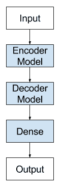

# 编解码器长短期存储器网络

> 原文： [https://machinelearningmastery.com/encoder-decoder-long-short-term-memory-networks/](https://machinelearningmastery.com/encoder-decoder-long-short-term-memory-networks/)

### 使用示例Python代码，轻松介绍
序列到序列预测的编解码器LSTM。

编解码器LSTM是一种循环神经网络，旨在解决序列到序列问题，有时称为seq2seq。

序列到序列预测问题具有挑战性，因为输入和输出序列中的项目数可以变化。例如，文本翻译和学习执行程序是seq2seq问题的例子。

在这篇文章中，您将发现用于序列到序列预测的编解码器LSTM架构。

完成这篇文章后，你会知道：

*   序列到序列预测的挑战。
*   编解码器架构以及它旨在解决的LSTM中的限制。
*   如何使用Keras在Python中实现编解码器LSTM模型架构。

让我们开始吧。


编解码器长短期记忆网络
照片来自 [slashvee](https://www.flickr.com/photos/slashvee/14992713152/) ，保留一些权利。

## 序列到序列预测问题

序列预测通常涉及预测实值序列中的下一个值或输出输入序列的类标签。

这通常被构造为一个输入时间步长到一个输出时间步长（例如一对一）或多个输入时间步长到一个输出时间步长（多对一）类型序列预测问题的序列。

存在更具挑战性的序列预测问题类型，其将序列作为输入并且需要序列预测作为输出。这些被称为序列到序列预测问题，或简称为seq2seq。

使这些问题具有挑战性的一个建模问题是输入和输出序列的长度可能变化。假设存在多个输入时间步长和多个输出时间步长，则这种形式的问题被称为多对多类型序列预测问题。

## 编解码器LSTM架构

已证明非常有效的seq2seq预测问题的一种方法称为编解码器LSTM。

该架构由两个模型组成：一个用于读取输入序列并将其编码为固定长度向量，第二个用于解码固定长度向量并输出预测序列。这些模型的使用使该架构的名称为Encoder-Decoder LSTM，专门针对seq2seq问题而设计。

> ... RNN编解码器，由两个循环神经网络（RNN）组成，充当编码器和解码器对。编码器将可变长度源序列映射到固定长度向量，并且解码器将向量表示映射回可变长度目标序列。

- [使用RNN编解码器进行统计机器翻译的学习短语表示](https://arxiv.org/abs/1406.1078)，2014。

编解码器LSTM是为自然语言处理问题而开发的，它展示了最先进的表现，特别是在称为统计机器翻译的文本翻译领域。

该架构的创新之处在于在模型的核心使用固定大小的内部表示，读取输入序列并读取输出序列。因此，该方法可以称为序列嵌入。

在该架构的第一个应用之一中，英语到法语的翻译，编码的英语短语的内部表示是可视化的。这些图揭示了用于翻译任务的短语的定性有意义的学习结构。

> 所提出的RNN编解码器自然地生成短语的连续空间表示。 [...]从可视化中，很明显RNN编解码器捕获短语的语义和句法结构

— [Learning Phrase Representations using RNN Encoder-Decoder for Statistical Machine Translation](https://arxiv.org/abs/1406.1078), 2014.

在翻译任务中，当输入序列被逆转时，发现模型更有效。此外，该模型甚至在很长的输入序列上也显示出有效性。

> 我们能够在长句子上做得好，因为我们颠倒了源句中的单词顺序，而不是训练和测试集中的目标句子。通过这样做，我们引入了许多短期依赖关系，使优化问题更加简单。 ......扭转源句中单词的简单技巧是这项工作的关键技术贡献之一

- [用神经网络进行序列学习的序列](https://arxiv.org/abs/1409.3215)，2014。

该方法还用于图像输入，其中卷积神经网络用作输入图像上的特征提取器，然后由解码器LSTM读取。

> ...我们建议遵循这个优雅的秘籍，用深度卷积神经网络（CNN）代替编码器RNN。 [...]使用CNN作为图像编码器“很自然，首先将其预训练用于图像分类任务，并使用最后一个隐藏层作为生成句子的RNN解码器的输入

- [Show and Tell：神经图像标题生成器](https://arxiv.org/abs/1411.4555)，2014。



编解码器LSTM模型架构

## 编解码器LSTM的应用

下面的列表突出了编解码器LSTM架构的一些有趣应用。

*   机器翻译，例如英语到法语的短语翻译。
*   学习执行，例如计算小程序的结果。
*   图像标题，例如生成图像的文本描述。
*   会话建模，例如产生文本问题的答案。
*   运动分类，例如从一系列手势生成一系列命令。

## 在Keras中实现编解码器LSTM

编解码器LSTM可以直接在Keras深度学习库中实现。

我们可以认为该模型由两个关键部分组成：编码器和解码器。

首先，输入序列一次向网络显示一个编码字符。我们需要一个编码级别来学习输入序列中的步骤之间的关系，并开发这些关系的内部表示。

可以使用一个或多个LSTM层来实现编码器模型。此模型的输出是固定大小的向量，表示输入序列的内部表示。该层中的存储器单元数定义了该固定大小的向量的长度。

```py
model = Sequential()
model.add(LSTM(..., input_shape=(...)))
```

解码器必须将输入序列的学习内部表示转换为正确的输出序列。

一个或多个LSTM层也可用于实现解码器模型。该模型从编码器模型的固定大小输出中读取。

与Vanilla LSTM一样，Dense层用作网络的输出。通过将Dense层包装在TimeDistributed包装器中，可以使用相同的权重输出输出序列中的每个时间步长。

```py
model.add(LSTM(..., return_sequences=True))
model.add(TimeDistributed(Dense(...)))
```

但是有一个问题。

我们必须将编码器连接到解码器，它们不适合。

也就是说，编码器将产生2维输出矩阵，其中长度由层中的存储器单元的数量来定义。解码器是LSTM层，其期望[样本，时间步长，特征]的3D输入，以便产生由问题定义的某个不同长度的解码序列。

如果您尝试将这些碎片强制在一起，则会出现错误，指示解码器的输出为2D，并且需要向解码器输入3D。

我们可以使用RepeatVector层来解决这个问题。该层简单地重复提供的2D输入多次以创建3D输出。

RepeatVector层可以像适配器一样使用，以将网络的编码器和解码器部分组合在一起。我们可以将RepeatVector配置为对输出序列中的每个时间步重复一次固定长度向量。

```py
model.add(RepeatVector(...))
```

把这些放在一起，我们有：

```py
model = Sequential()
model.add(LSTM(..., input_shape=(...)))
model.add(RepeatVector(...))
model.add(LSTM(..., return_sequences=True))
model.add(TimeDistributed(Dense(...)))
```

总而言之，RepeatVector用作适配器，以使编码器的固定大小的2D输出适合解码器所期望的不同长度和3D输入。 TimeDistributed包装器允许为输出序列中的每个元素重用相同的输出层。

## 进一步阅读

如果您要深入了解，本节将提供有关该主题的更多资源。

### 文件

*   [使用RNN编解码器进行统计机器翻译的学习短语表示](https://arxiv.org/abs/1406.1078)，2014。
*   [用神经网络进行序列学习的序列](https://arxiv.org/abs/1409.3215)，2014。
*   [Show and Tell：神经图像标题生成器](https://arxiv.org/abs/1411.4555)，2014。
*   [学习执行](http://arxiv.org/abs/1410.4615)，2015年。
*   [神经对话模型](https://arxiv.org/abs/1506.05869)，2015。

### Keras API

*   [RepeatVector Keras API](https://keras.io/layers/core/#repeatvector) 。
*   [TimeDistributed Keras API](https://keras.io/layers/wrappers/#timedistributed) 。

### 帖子

*   [如何将编解码器LSTM用于随机整数的回波序列](http://machinelearningmastery.com/how-to-use-an-encoder-decoder-lstm-to-echo-sequences-of-random-integers/)
*   [学习使用编解码器LSTM循环神经网络](http://machinelearningmastery.com/learn-add-numbers-seq2seq-recurrent-neural-networks/)添加数字
*   [长期短期记忆循环神经网络](http://machinelearningmastery.com/attention-long-short-term-memory-recurrent-neural-networks/)的注意事项

## 摘要

在这篇文章中，您发现了用于序列到序列预测的编解码器LSTM架构

具体来说，你学到了：

*   序列到序列预测的挑战。
*   编解码器架构以及它旨在解决的LSTM中的限制。
*   如何使用Keras在Python中实现编解码器LSTM模型架构。

你有任何问题吗？
在下面的评论中提出您的问题，我会尽力回答。