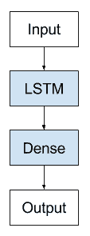

# 生成式长短期记忆网络的温和介绍

> 原文： [https://machinelearningmastery.com/gentle-introduction-generative-long-short-term-memory-networks/](https://machinelearningmastery.com/gentle-introduction-generative-long-short-term-memory-networks/)

开发了用于序列预测的长短期记忆循环神经网络。

除了序列预测问题。 LSTM也可以用作生成模型

在这篇文章中，您将了解LSTM如何用作生成模型。

完成这篇文章后，你会知道：

*   关于生成模型，重点关注称为语言建模的文本的生成模型。
*   使用LSTM Generative模型的应用示例。
*   如何使用LSTM为生成模型建模文本的示例。

让我们开始吧。


生成长短期记忆网络的温和介绍
[Fraser Mummery](https://www.flickr.com/photos/73014677@N05/10035345914/) 的照片，保留一些权利。

## 生成模型

LSTM可以用作生成模型。

给定大量序列数据，例如文本文档，可以设计LSTM模型以学习语料库的一般结构属性，并且当给定种子输入时，可以生成代表原始语料库的新序列。

开发用于概括文本语料库的模型的问题在自然语言处理领域被称为语言建模。语言模型可以在单词级别工作并学习文档中单词之间的概率关系，以便准确地完成句子并生成全新的句子。在最具挑战性的语言模型中，语言模型在角色级别工作，从角色序列中学习，并一次生成一个角色的新序列。

> 字符级语言建模的目标是预测序列中的下一个字符。

- [使用循环神经网络生成文本](http://www.cs.utoronto.ca/~ilya/pubs/2011/LANG-RNN.pdf)，2011。

虽然更具挑战性，但字符级模型的附加灵活性允许生成新单词，添加标点符号以及生成文本数据中可能存在的任何其他结构。

> ...从序列生成的角度来看，一次预测一个字符更有趣，因为它允许网络发明新颖的单词和字符串。

- [生成具有循环神经网络的序列](https://arxiv.org/abs/1308.0850)，2013。

语言建模是迄今为止生成LSTM最常研究的应用，可能是因为使用了可以量化和比较模型表现的标准数据集。这种方法已用于生成一系列有趣的语言建模问题的文本，例如：

*   生成维基百科文章（包括标记）。
*   生成莎士比亚等伟大作家的片段。
*   生成技术手稿（包括标记）。
*   生成计算机源代码。
*   生成文章标题。

结果的质量各不相同;例如，标记或源代码可能需要手动干预才能呈现或编译。然而，结果令人印象深刻。

该方法还应用于不同的域，其中可获得大量现有序列信息，并且可以一次一步地生成新序列，例如：

*   手写代。
*   音乐一代。
*   语音生成。


用于自动手写生成的LSTM的示例。
取自“[生成序列与循环神经网络](https://arxiv.org/abs/1308.0850)”，2014年。

## 生成LSTM

生成型LSTM实际上不是架构，它更多地是关于LSTM预测模型学习内容以及模型如何使用的观点的变化。

我们可以想象使用任何LSTM架构作为生成模型。在这种情况下，我们将使用简单的Vanilla LSTM。



用于生成模型的Vanilla LSTM架构

在字符级语言模型的情况下，所有可能字符的字母表是固定的。单热编码用于学习输入序列和预测输出序列。

使用一对一模型，其中针对每个输入时间步骤预测一步。这意味着输入序列可能需要专门处理以便被向量化或格式化以有效地训练监督模型。

例如，给定顺序：

```py
"hello world"
```

需要构建数据集，例如：

```py
'h' => 'e'
'e' => 'l'
'l' => 'l'
...
```

这可以按原样呈现为一个时间步骤样本的数据集，这可能对网络非常有限（例如，没有BPTT）。

或者，它可以被向量化为固定长度的输入序列，用于多对一时间步长模型，例如：

```py
['h', 'e', 'l'] => 'l'
['e', 'l', 'l'] => 'o'
['l', 'l', 'o'] => ' '
...
```

或者，一对多时间步长模型的固定长度输出序列：

```py
'h' => ['e', 'l', 'l']
'e' => ['l', 'l', 'o']
'l' => ['l', 'o', ' ']
...
```

或者这些方法的一些变化。

注意，在做出预测时将需要相同的向量化表示，这意味着需要将预测的字符作为后续样本的输入来呈现。这在实现中可能非常笨拙。

网络的内部状态可能需要仔细管理，可能在输入序列中的选择位置（例如段落，页面或章节的末尾）而不是在每个输入序列的末尾重置。

## 进一步阅读

如果您要深入了解，本节将提供有关该主题的更多资源。

### 文件

*   [使用循环神经网络生成文本](http://www.cs.utoronto.ca/~ilya/pubs/2011/LANG-RNN.pdf)，2011。
*   [使用循环神经网络生成序列](https://arxiv.org/abs/1308.0850)，2013。
*   [TTS合成与双向LSTM的循环神经网络](https://pdfs.semanticscholar.org/564f/ed868f652f361bb3e345f6f94073d8f6f261.pdf)，2014年。
*   [使用LSTM循环神经网络](http://people.idsia.ch/~juergen/blues/IDSIA-07-02.pdf)，2002年首次研究音乐作品。
*   [来自几个人类旋律的循环网络学习的爵士乐旋律](https://www.aaai.org/Papers/FLAIRS/2005/Flairs05-010.pdf)，2005。

### 帖子

*   [使用Keras进行LSTM循环神经网络的文本生成](http://machinelearningmastery.com/text-generation-lstm-recurrent-neural-networks-python-keras/)，2016
    [循环神经网络的不合理有效性](http://karpathy.github.io/2015/05/21/rnn-effectiveness/)，2015。
*   维基百科上的[语言模型](https://en.wikipedia.org/wiki/Language_model)。

## 摘要

在这篇文章中，您发现了使用LSTM作为生成模型。

具体来说，你学到了：

*   关于生成模型，重点关注称为语言建模的文本的生成模型。
*   使用LSTM Generative模型的应用示例。
*   如何使用LSTM为生成模型建模文本的示例。

你有任何问题吗？
在下面的评论中提出您的问题，我会尽力回答。