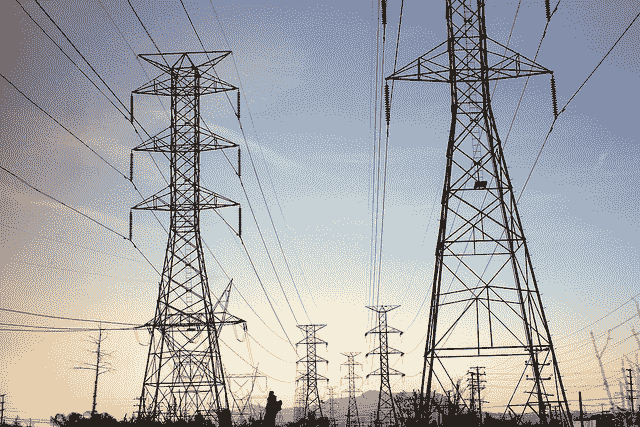

# 专家对长短期记忆网络的简要介绍

> 原文： [https://machinelearningmastery.com/gentle-introduction-long-short-term-memory-networks-experts/](https://machinelearningmastery.com/gentle-introduction-long-short-term-memory-networks-experts/)

长短期记忆（LSTM）网络是一种循环神经网络，能够学习序列预测问题中的顺序依赖性。

这是复杂问题域中所需的行为，如机器翻译，语音识别等。

LSTM是一个复杂的深度学习领域。很难掌握LSTM是什么，以及双向和序列到序列等术语如何与场相关。

在这篇文章中，您将使用开发方法并将其应用于新的重要问题的研究科学家的话来深入了解LSTM。

很少有人比制定它们的专家更清楚，更准确地阐明LSTM的承诺及其工作方式。

我们将使用专家的报价来探索LSTM领域的关键问题，如果您有兴趣，您将能够深入研究报价的原始论文。

专家对长期短期记忆网络的简要介绍
[Oran Viriyincy](https://www.flickr.com/photos/viriyincy/7004881064/) 的照片，保留一些权利。

## 循环神经网络的承诺

循环神经网络不同于传统的前馈神经网络。

增加复杂性的这种差异伴随着传统方法无法实现的新行为的承诺。

> 循环网络......具有可以表示上下文信息的内部状态。 ...... [他们]保留过去输入的信息一段时间不是先验固定的，而是取决于其权重和输入数据。
> 
> ...
> 
> 其输入不固定但构成输入序列的循环网络可用于将输入序列变换为输出序列，同时以灵活的方式考虑上下文信息。

- Yoshua Bengio等，[学习长期依赖与梯度下降是困难的](http://www-dsi.ing.unifi.it/~paolo/ps/tnn-94-gradient.pdf)，1994。

本文定义了循环神经网络的3个基本要求：

*   系统能够存储任意持续时间的信息。
*   系统抵抗噪声（即输入的波动是随机的或与预测正确输出无关）。
*   系统参数可以训练（在合理的时间内）。

本文还描述了用于演示循环神经网络的“最小任务”。

语境是关键。

循环神经网络在做出预测时必须使用上下文，但在这种程度上，还必须学习所需的上下文。

> ...循环神经网络包含循环，这些循环将来自前一时间步的网络激活作为网络的输入，以影响当前时间步的预测。这些激活存储在网络的内部状态中，其原则上可以保存长期时间上下文信息。该机制允许RNN在输入序列历史上利用动态变化的上下文窗口

- Hassim Sak等，用于大规模声学建模的[长短期记忆循环神经网络架构](https://arxiv.org/abs/1402.1128)，2014

## LSTM兑现承诺

LSTM的成功在于它们声称是首批克服技术问题并实现循环神经网络承诺的工具之一。

> 因此，在相关输入事件和目标信号之间存在大于5-10个离散时间步长的情况下，标准RNN无法学习。消失的错误问题使人们怀疑标准RNN是否确实能够在基于时间窗口的前馈网络上表现出显着的实际优势。最近的模型“长期短期记忆”（LSTM）不受此问题的影响。 LSTM可以通过在特殊单元（称为单元格）内通过“恒定误差转盘”（CEC）强制执行恒定误差来学习跨越超过1000个离散时间步长的最小时间滞后

- Felix A. Gers等，[学会忘记：用LSTM持续预测](http://www.mitpressjournals.org/doi/abs/10.1162/089976600300015015)，2000

LSTM克服的两个技术问题是消失的梯度和爆炸的梯度，这两者都与网络的训练方式有关。

> 不幸的是，标准RNN可以访问的上下文信息的范围在实践中非常有限。问题在于，给定输入对隐藏层的影响，以及因此对网络输出的影响，当它围绕网络的循环连接循环时，会以指数方式衰减或爆炸。这个缺点......在文献中被称为消失梯度问题......长短期记忆（LSTM）是一种RNN架构，专门用于解决消失的梯度问题。

- Alex Graves等，[一种用于无约束手写识别的新型连接系统](http://ieeexplore.ieee.org/document/4531750/)，2009

LSTM解决技术问题的关键是模型中使用的单元的特定内部结构。

> ......受其处理消失和梯度爆炸的能力的支配，这是设计和训练RNN的最常见挑战。为了应对这一挑战，引入了一种特殊形式的经常性网络，称为LSTM，并在翻译和序列生成方面取得了巨大成功。

- Alex Graves等， [Framewise Phoneme Classification with Bidirectional LSTM and other Neural Network Architectures](http://ieeexplore.ieee.org/document/1556215/?reload=true&arnumber=1556215) ，2005。

## LSTM如何工作？

类比是一个有用的工具，可以快速掌握它们的工作方式，而不是进入控制LSTM如何拟合的方程式。

> 我们使用具有一个输入层，一个隐藏层和一个输出层的网络......（完全）自连接隐藏层包含存储器单元和相应的门单元......
> 
> …
> 
> 每个存储器单元的内部架构保证在其恒定误差转盘CEC内的恒定误差...这代表了弥合很长时间滞后的基础。两个门单元学习在每个存储器单元的CEC内打开和关闭对错误的访问。乘法输入门保护CEC免受无关输入的扰动。同样，乘法输出门保护其他单元免受当前不相关的存储器内容的扰动。

- Sepp Hochreiter和Jurgen Schmidhuber，[长期短期记忆](http://www.mitpressjournals.org/doi/abs/10.1162/neco.1997.9.8.1735)，1997年。

多个类比可以帮助购买LSTM与简单神经元组成的传统神经网络的区别。

> 长短期记忆架构的动机是对现有RNN中的错误流进行分析，发现现有架构无法获得长时间滞后，因为反向传播的错误会以指数方式爆炸或衰减。
> 
> LSTM层由一组循环连接的块组成，称为内存块。这些块可以被认为是数字计算机中存储芯片的可区分版本。每个包含一个或多个循环连接的存储器单元和三个乘法单元 - 输入，输出和忘记门 - 为单元提供连续的写，读和复位操作模拟。 ......网只能通过门与细胞相互作用。

— Alex Graves, et al., [Framewise Phoneme Classification with Bidirectional LSTM and Other Neural Network Architectures](http://ieeexplore.ieee.org/document/1556215/?reload=true&arnumber=1556215), 2005.

有趣的是，即使经过20多年，简单（或香草）LSTM仍然是应用该技术时最好的起点。

> 最常用的LSTM架构（vanilla LSTM）在各种数据集上表现相当不错......
> 
> 学习率和网络规模是最关键的可调LSTM超参数...
> 
> ...这意味着超参数可以独立调整。特别是，可以使用相当小的网络首先校准学习率，从而节省大量的实验时间。

- Klaus Greff等， [LSTM：A Search Space Odyssey](https://arxiv.org/abs/1503.04069) ，2015

## 什么是LSTM应用程序？

掌握LSTM适合解决的确切类型的序列学习问题非常重要。

> 长期短期记忆（LSTM）可以解决以前的循环神经网络（RNN）学习算法无法解决的大量任务。
> 
> …
> 
> ... LSTM承诺任何顺序处理任务，我们怀疑可能存在层次分解，但事先并不知道这种分解是什么。

— Felix A. Gers, et al., [Learning to Forget: Continual Prediction with LSTM](http://www.mitpressjournals.org/doi/abs/10.1162/089976600300015015), 2000

> 循环神经网络（RNN）是神经序列模型，其在包括语言建模，语音识别和机器翻译的重要任务上实现最先进的表现。

- Wojciech Zaremba，[循环神经网络正则化](https://arxiv.org/abs/1409.2329)，2014年。

> 由于LSTM在捕获长期时间依赖性方面是有效的，而不会遇到困扰简单复发网络（SRN）的优化障碍，因此它们已被用于推进许多难题的现有技术水平。这包括手写识别和生成，语言建模和翻译，语音声学建模，语音合成，蛋白质二级结构预测，音频分析和视频数据等。

— Klaus Greff, et al., [LSTM: A Search Space Odyssey](https://arxiv.org/abs/1503.04069), 2015

## 什么是双向LSTM？

LSTM的一个常见改进是双向LSTM。

> 双向循环神经网络的基本思想是将每个训练序列向前和向后呈现给两个单独的循环网络，这两个网络都连接到相同的输出层。 ......这意味着对于给定序列中的每个点，BRNN都有关于它之前和之后所有点的完整，顺序信息。此外，由于网络可根据需要自由使用此上下文，因此无需查找（任务相关的）时间窗口或目标延迟大小。
> 
> ......对于像语音识别这样的时间问题，依赖于对未来的了解似乎乍看之下就是违反因果关系...我们如何能够根据我们对尚未说过的内容所听到的内容进行理解？然而，人类听众正是这样做的。根据未来的背景，听起来，单词甚至整个句子最初都意味着没有任何意义。

— Alex Graves, et al., [Framewise Phoneme Classification with Bidirectional LSTM and Other Neural Network Architectures](http://ieeexplore.ieee.org/document/1556215/?reload=true&arnumber=1556215), 2005.

> 传统RNN的一个缺点是它们只能利用先前的上下文。 ...双向RNN（BRNN）通过使用两个单独的隐藏层处理两个方向上的数据来完成此操作，然后将这些隐藏层转发到同一输出层。 ...将BRNN与LSTM相结合，可以提供双向LSTM，可以在两个输入方向上访问远程上下文

- Alex Graves等，[语音识别与深度复发神经网络](http://ieeexplore.ieee.org/abstract/document/6638947/)，2013

> 与传统的RNN不同，双向RNN通过使用两个单独的隐藏层处理来自两个方向的数据来利用先前和未来的上下文。一层处理正向输入序列，而另一层处理反向输入。然后通过组合两个层的隐藏向量来生成当前时间步长的输出...

- Di Wang和Eric Nyberg，
[问题回答](http://www.aclweb.org/anthology/P15-2116)，2015年答案句选择的长短期记忆模型

## 什么是seq2seq LSTM或RNN编解码器？

序列到序列LSTM，也称为编解码器LSTM，是LSTM的应用，由于其令人印象深刻的能力而受到很多关注。

> ......长期短期记忆（LSTM）架构的直接应用可以解决序列问题的一般顺序。
> 
> …
> 
> 想法是使用一个LSTM来读取输入序列，一次一个步骤，以获得大的固定维向量表示，然后使用另一个LSTM从该向量中提取输出序列。第二个LSTM本质上是一个循环神经网络语言模型，除了它以输入序列为条件。
> 
> LSTM成功学习具有长距离时间依赖性的数据的能力使其成为该应用的自然选择，因为输入与其相应输出之间存在相当大的时间滞后。
> 
> 我们能够在长句子上做得好，因为我们颠倒了源句中的单词顺序，而不是训练和测试集中的目标句子。通过这样做，我们引入了许多短期依赖关系，使优化问题更加简单。 ......扭转源句中单词的简单技巧是这项工作的关键技术贡献之一

- Ilya Sutskever等，[序列学习与神经网络](https://arxiv.org/abs/1409.3215)，2014

> “编码器”RNN读取源句子并将其转换为富的固定长度向量表示，其又用作生成目标句子的“解码器”RNN的初始隐藏状态。在这里，我们建议遵循这个优雅的秘籍，用深度卷积神经网络（CNN）代替编码器RNN。 ...使用CNN作为图像“编码器”是很自然的，首先将其预训练用于图像分类任务，并使用最后隐藏层作为生成句子的RNN解码器的输入。

- Oriol Vinyals等， [Show and Tell：神经图像字幕生成器](https://arxiv.org/abs/1411.4555)，2014

> ... RNN编解码器，由两个循环神经网络（RNN）组成，它们充当编码器和解码器对。编码器将可变长度源序列映射到固定长度向量，并且解码器将向量表示映射回可变长度目标序列。

- Kyunghyun Cho，et al。，[学习短语表示使用RNN编解码器进行统计机器翻译](https://arxiv.org/abs/1406.1078)，2014

## 摘要

在这篇文章中，您通过开发和应用这些技术的研究科学家的话来温和地介绍了LSTM。

这为您提供了关于LSTM是什么以及它们如何工作的清晰而准确的概念，以及关于LSTM在循环神经网络领域的承诺的重要阐述。

引用是否有助于您理解或激励您？
请在下面的评论中告诉我。