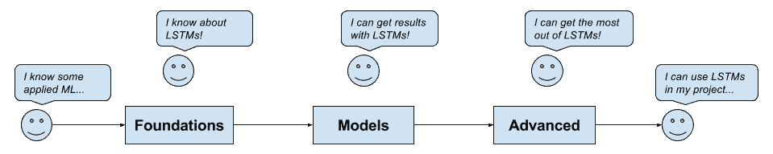

# Keras 长短期记忆循环神经网络的迷你课程

> 原文： [https://machinelearningmastery.com/long-short-term-memory-recurrent-neural-networks-mini-course/](https://machinelearningmastery.com/long-short-term-memory-recurrent-neural-networks-mini-course/)

长期短期记忆（LSTM）复现神经网络是目前最有趣的深度学习类型之一。

它们被用于展示复杂问题领域的世界级结果，例如语言翻译，自动图像字幕和文本生成。

LSTM与多层感知机和卷积神经网络的不同之处在于它们专门用于序列预测问题。

在这个迷你课程中，您将了解如何快速将LSTM模型用于您自己的序列预测问题。

完成这个迷你课程后，您将知道：

*   LSTM是什么，如何训练，以及如何准备训练LSTM模型的数据。
*   如何开发一套LSTM模型，包括堆叠，双向和编解码器模型。
*   如何通过超参数优化，更新和最终模型来充分利用模型。

让我们开始吧。

**注**：这是一个很大的指南;你可能想要为它添加书签。

具有Keras的长期短期记忆循环神经网络的迷你课程
照片由 [Nicholas A. Tonelli](https://www.flickr.com/photos/nicholas_t/14840636880/) ，保留一些权利。

## 这个迷你课程是谁？

在我们开始之前，让我们确保您在正确的位置。

本课程适用于了解一些应用机器学习并且需要快速掌握LSTM的开发人员。

也许您想要或需要在项目中开始使用LSTM。本指南旨在帮助您快速有效地完成此任务。

*   你了解Python的方法。
*   你知道你在SciPy周围的方式。
*   您知道如何在工作站上安装软件。
*   你知道如何纠缠自己的数据。
*   您知道如何使用机器学习来解决预测性建模问题。
*   你可能知道一点点深度学习。
*   你可能知道一点Keras。

您知道如何设置工作站以使用Keras和scikit-learn;如果没有，你可以在这里学习如何：

*   [如何使用Anaconda设置用于机器学习和深度学习的Python环境](http://machinelearningmastery.com/setup-python-environment-machine-learning-deep-learning-anaconda/)

本指南采用自上而下和结果优先的机器学习风格，您已经习惯了。它将教你如何获得结果，但它不是灵丹妙药。

您将通过本指南开发有用的技能。

完成本课程后，您将：

*   了解LSTM的工作原理。
*   知道如何为LSTM准备数据。
*   知道如何应用一系列类型的LSTM。
*   知道如何将LSTM调整为问题。
*   知道如何保存LSTM模型并使用它来做出预测。

接下来，让我们回顾一下课程。

## 迷你课程概述

这个迷你课程分为14节课。

您可以每天完成一节课（推荐）或在一天内完成所有课程（硬核！）。

这取决于你有空的时间和你的热情程度。

以下是14个课程，可以帮助您开始使用Python中的LSTM并提高工作效率。课程分为三个主题：基础，模型和高级。

LSTM迷你课程概述

### 基金会

这些课程的重点是在使用LSTM之前需要了解的事项。

*   **第01课**：什么是LSTM？
*   **第02课**：如何训练LSTM
*   **第03课**：如何为LSTM准备数据
*   **第04课**：如何在Keras开发LSTM

### 楷模

*   **第05课**：如何开发香草LSTMs
*   **第06课**：如何开发栈式LSTM
*   **第07课**：如何开发CNN LSTM
*   **第08课**：如何开发编解码器LSTM
*   **第09课**：如何开发双向LSTM
*   **第10课**：如何开发注意力的LSTM
*   **第11课**：如何开发生成LSTM

### 高级

*   **第12课**：如何调整LSTM超参数
*   **第13课**：如何更新LSTM模型
*   **第14课**：如何使用LSTM做出预测

每节课可能需要60秒或60分钟。花点时间，按照自己的进度完成课程。提出问题，甚至在下面的评论中发布结果。

课程期望你去学习如何做事。我会给你提示，但每节课的部分内容是强迫你去哪里寻求帮助（提示，我在这个博客上有所有的答案;使用搜索）。

我确实在早期课程中提供了更多帮助，因为我希望你建立一些自信和惯性。

挂在那里;不要放弃！

## 基金会

本节中的课程旨在让您了解LSTM的工作原理以及如何使用Keras库实现LSTM模型。

## 第1课：什么是LSTM？

### **目标**

本课程的目标是充分理解高级LSTM，以便您可以向同事或经理解释它们是什么以及它们如何工作。

### 问题

*   什么是序列预测？一些例子是什么？
*   传统神经网络对序列预测有哪些局限性？
*   RNN对序列预测的承诺是什么？
*   什么是LSTM及其组成部分是什么？
*   LSTM有哪些突出的应用？

### 进一步阅读

*   [深度学习的循环神经网络崩溃课程](http://machinelearningmastery.com/crash-course-recurrent-neural-networks-deep-learning/)
*   [循环神经网络序列预测模型的简要介绍](http://machinelearningmastery.com/handle-long-sequences-long-short-term-memory-recurrent-neural-networks/)
*   [循环神经网络对时间序列预测的承诺](http://machinelearningmastery.com/promise-recurrent-neural-networks-time-series-forecasting/)
*   [关于长短期记忆网络对时间序列预测的适用性](http://machinelearningmastery.com/suitability-long-short-term-memory-networks-time-series-forecasting/)
*   [专家对长短期记忆网络的简要介绍](http://machinelearningmastery.com/gentle-introduction-long-short-term-memory-networks-experts/)
*   [8深度学习的鼓舞人心的应用](http://machinelearningmastery.com/inspirational-applications-deep-learning/)

## 第2课：如何训练LSTM

### 目标

本课程的目的是了解如何在示例序列上训练LSTM模型。

### Questions

*   传统RNN的训练有哪些常见问题？
*   LSTM如何克服这些问题？
*   什么算法用于训练LSTM？
*   Backpropagation Through Time如何运作？
*   什么是截断的BPTT，它提供了什么好处？
*   如何在Keras中实现和配置BPTT？

### Further Reading

*   [沿时间反向传播的温和介绍](http://machinelearningmastery.com/gentle-introduction-backpropagation-time/)
*   [如何准备Keras中截断反向传播的序列预测](http://machinelearningmastery.com/truncated-backpropagation-through-time-in-keras/)

## 第3课：如何为LSTM准备数据

### Goal

本课程的目标是了解如何准备用于LSTM模型的序列预测数据。

### Questions

*   如何准备用于LSTM的数字数据？
*   如何准备用于LSTM的分类数据？
*   使用LSTM时如何处理序列中的缺失值？
*   如何将序列构建为监督学习问题？
*   在使用LSTM时，如何处理长序列？
*   你如何处理不同长度的输入序列？
*   如何重塑Keras中LSTM的输入数据？

### 实验

演示如何将数字输入序列转换为适合训练LSTM的形式。

### Further Reading

*   [如何在Python中扩展长短期记忆网络的数据](http://machinelearningmastery.com/how-to-scale-data-for-long-short-term-memory-networks-in-python/)
*   [如何使用Python编写单热编码序列数据](http://machinelearningmastery.com/how-to-one-hot-encode-sequence-data-in-python/)
*   [如何使用Python处理序列预测问题中的缺失时间步长](http://machinelearningmastery.com/handle-missing-timesteps-sequence-prediction-problems-python/)
*   [如何将时间序列转换为Python中的监督学习问题](http://machinelearningmastery.com/convert-time-series-supervised-learning-problem-python/)
*   [如何处理具有长短期记忆循环神经网络的超长序列](http://machinelearningmastery.com/handle-long-sequences-long-short-term-memory-recurrent-neural-networks/)
*   [如何准备Keras中截断反向传播的序列预测](http://machinelearningmastery.com/truncated-backpropagation-through-time-in-keras/)
*   [可变长度输入序列的数据准备](http://machinelearningmastery.com/data-preparation-variable-length-input-sequences-sequence-prediction/)

## 第4课：如何在Keras开发LSTM

### Goal

本课程的目标是了解如何使用Python中的Keras深度学习库定义，拟合和评估LSTM模型。

### Questions

*   你如何定义LSTM模型？
*   你如何编译LSTM模型？
*   你如何适应LSTM模型？
*   您如何评估LSTM模型？
*   如何使用LSTM模型做出预测？
*   如何将LSTM应用于不同类型的序列预测问题？

### Experiment

准备一个示例，演示LSTM模型在序列预测问题上的生命周期。

### Further Reading

*   [Keras中长期短期记忆模型的5步生命周期](http://machinelearningmastery.com/5-step-life-cycle-long-short-term-memory-models-keras/)
*   [循环神经网络序列预测模型的简要介绍](http://machinelearningmastery.com/handle-long-sequences-long-short-term-memory-recurrent-neural-networks/)

## 楷模

本节中的课程旨在教您如何使用LSTM模型获得序列预测问题的结果。

## 第5课：如何开发香草LSTM

### Goal

本课程的目标是学习如何开发和评估香草LSTM模型。

*   什么是香草LSTM架构？
*   什么是香草LSTM应用的例子？

### Experiment

设计并执行一个实验，演示序列预测问题的香草LSTM。

### Further Reading

*   [用Keras](http://machinelearningmastery.com/sequence-classification-lstm-recurrent-neural-networks-python-keras/) 在Python中用LSTM循环神经网络进行序列分类
*   [用Keras](http://machinelearningmastery.com/time-series-prediction-lstm-recurrent-neural-networks-python-keras/) 用Python中的LSTM循环神经网络进行时间序列预测
*   [Python中长期短期记忆网络的时间序列预测](http://machinelearningmastery.com/time-series-forecasting-long-short-term-memory-network-python/)

## 第6课：如何开发栈式LSTM

### Goal

本课程的目标是学习如何开发和评估堆叠的LSTM模型。

### Questions

*   在层次结构的序列问题上使用香草LSTM有什么困难？
*   堆叠的LSTM是什么？
*   什么是栈式LSTM应用于何处的示例？
*   栈式LSTM提供哪些好处？
*   如何在Keras中实现栈式LSTM？

### Experiment

设计并执行一个实验，演示具有分层输入结构的序列预测问题的栈式LSTM。

### Further Reading

*   [用Keras](http://machinelearningmastery.com/sequence-classification-lstm-recurrent-neural-networks-python-keras/) 在Python中用LSTM循环神经网络进行序列分类
*   [用Keras](http://machinelearningmastery.com/time-series-prediction-lstm-recurrent-neural-networks-python-keras/) 用Python中的LSTM循环神经网络进行时间序列预测

## 第7课：如何开发CNN LSTM

### Goal

本课程的目标是学习如何开发在前端使用卷积神经网络的LSTM模型。

### Questions

*   使用具有空间输入数据的香草LSTM有什么困难？
*   什么是CNN LSTM架构？
*   有哪些CNN LSTM的例子？
*   CNN LSTM提供哪些好处？
*   如何在Keras中实现CNN LSTM架构？

### Experiment

设计并执行一个实验，演示有空间输入的序列预测问题的CNN LSTM。

### Further Reading

*   [用Keras](http://machinelearningmastery.com/sequence-classification-lstm-recurrent-neural-networks-python-keras/) 在Python中用LSTM循环神经网络进行序列分类

## 第8课：如何开发编解码器LSTM

### Goal

本课程的目标是学习如何开发编解码器LSTM模型。

### Questions

*   什么是序列到序列（seq2seq）预测问题？
*   在seq2seq问题上使用香草LSTM有什么困难？
*   什么是编解码器LSTM架构？
*   编解码器LSTM有哪些例子？
*   编解码器LSTM有什么好处？
*   如何在Keras中实现编解码器LSTM？

### Experiment

设计并执行一个实验，演示序列到序列预测问题的编解码器LSTM。

### Further Reading

*   [如何在Python](http://machinelearningmastery.com/timedistributed-layer-for-long-short-term-memory-networks-in-python/) 中为长期短期记忆网络使用时间分布层
*   [如何学习使用seq2seq循环神经网络相加数字](http://machinelearningmastery.com/learn-add-numbers-seq2seq-recurrent-neural-networks/)
*   [如何将编解码器LSTM用于随机整数的回波序列](http://machinelearningmastery.com/how-to-use-an-encoder-decoder-lstm-to-echo-sequences-of-random-integers/)

## 第9课：如何开发双向LSTM

### Goal

本课程的目标是学习如何开发双向LSTM模型。

### Questions

*   什么是双向LSTM？
*   有哪些使用双向LSTM的例子？
*   双向LSTM比香草LSTM有什么好处？
*   双向架构引发了关于时间步长的问题？
*   如何在Keras中实现双向LSTM？

### Experiment

设计并执行一个实验，在序列预测问题上比较前向，后向和双向LSTM模型。

### Further Reading

*   [如何使用Keras开发用于Python序列分类的双向LSTM](http://machinelearningmastery.com/develop-bidirectional-lstm-sequence-classification-python-keras/)

## 第10课：如何开发注意力的LSTM

### Goal

本课的目的是学习如何开发LSTM模型。

### Questions

*   具有中性信息的长序列对LSTM有何影响？
*   LSTM型号的注意事项是什么？
*   在LSTM中使用注意力的一些例子是什么？
*   注意为序列预测提供了什么好处？
*   如何在Keras中实现注意力架构？

### Experiment

设计并执行一项实验，该实验将注意力集中在具有长序列中性信息的序列预测问题上。

### Further Reading

*   [长期短期记忆循环神经网络](http://machinelearningmastery.com/attention-long-short-term-memory-recurrent-neural-networks/)的注意事项

## 第11课：如何开发生成LSTM

### Goal

本课程的目标是学习如何开发用于生成模型的LSTM。

*   什么是生成模型？
*   如何将LSTM用作生成模型？
*   LSTM作为生成模型的一些例子是什么？
*   LSTM作为生成模型有哪些好处？

### Experiment

设计并执行实验以学习文本语料库并生成具有相同语法，语法和样式的新文本样本。

### Further Reading

*   [使用Keras](http://machinelearningmastery.com/text-generation-lstm-recurrent-neural-networks-python-keras/) 在Python中使用LSTM循环神经网络生成文本

## 高级

本节中的课程旨在教您如何根据自己的序列预测问题从LSTM模型中获得最大收益。

## 第12课：如何调整LSTM超参数

### Goal

本课程的目标是学习如何调整LSTM超参数。

### Questions

*   我们如何诊断LSTM模型的过度学习或学习不足？
*   调整模型超参数的两种方案是什么？
*   鉴于LSTM是随机算法，如何可靠地估计模型技能？
*   列出可以调整的LSTM超参数，并提供可以评估的值的示例：
    *   模型初始化和行为。
    *   模型架构和结构。
    *   学习行为。

### Experiment

设计并执行实验以调整LSTM的一个超参数并选择最佳配置。

### Further Reading

*   [如何评估深度学习模型的技巧](http://machinelearningmastery.com/evaluate-skill-deep-learning-models/)
*   [如何用Keras调整LSTM超参数进行时间序列预测](http://machinelearningmastery.com/tune-lstm-hyperparameters-keras-time-series-forecasting/)
*   [如何使用Keras网格搜索Python中的深度学习模型的超参数](http://machinelearningmastery.com/grid-search-hyperparameters-deep-learning-models-python-keras/)
*   [如何提高深度学习效能](http://machinelearningmastery.com/improve-deep-learning-performance/)

## 第13课：如何更新LSTM模型

### Goal

本课程的目标是学习如何在新数据可用后更新LSTM模型。

### Questions

*   更新LSTM模型以响应新数据有什么好处？
*   使用新数据更新LSTM模型有哪些方案？

### Experiment

设计并执行实验以使LSTM模型适应序列预测问题，该问题与不同模型更新方案的模型技能的影响形成对比。

### Further Reading

*   [如何在时间序列预测训练期间更新LSTM网络](http://machinelearningmastery.com/update-lstm-networks-training-time-series-forecasting/)

## 第14课：如何使用LSTM做出预测

### Goal

本课程的目标是学习如何最终确定LSTM模型并使用它来预测新数据。

### Questions

*   你如何在Keras中保存模型结构和重量？
*   你如何适应最终的LSTM模型？
*   如何使用最终模型做出预测？

### Experiment

设计并执行实验以适应最终的LSTM模型，将其保存到文件，然后加载它并对保留的验证数据集做出预测。

### Further Reading

*   [保存并加载您的Keras深度学习模型](http://machinelearningmastery.com/save-load-keras-deep-learning-models/)
*   [如何训练最终机器学习模型](http://machinelearningmastery.com/train-final-machine-learning-model/)

## 结束！
（_看你有多远_）

你做到了。做得好！

花点时间回顾一下你到底有多远。以下是您学到的知识：

1.  LSTM是什么以及为什么它们是序列预测的首选深度学习技术。
2.  LSTM使用BPTT算法进行训练，该算法也强加了一种思考序列预测问题的方法。
3.  用于序列预测的数据准备可以涉及掩蔽缺失值以及分割，填充和截断输入序列。
4.  Keras为LSTM模型提供了5步生命周期，包括定义，编译，拟合，评估和预测。
5.  香草LSTM由输入层，隐藏的LSTM层和密集输出层组成。
6.  隐藏的LSTM层可以堆叠，但必须从一层到另一层暴露整个序列的输出。
7.  在处理图像和视频数据时，CNN可用作LSTM的输入层。
8.  在预测可变长度输出序列时可以使用编解码器架构。
9.  在双向LSTM中向前和向后提供输入序列可以提高某些问题的技能。
10.  该注意力可以为包含中性信息的长输入序列提供优化。
11.  LSTM可以学习输入数据的结构化关系，进而可以用来生成新的例子。
12.  LSTM的LSTM超参数可以像任何其他随机模型一样进行调整。
13.  当新数据可用时，可以更新适合的LSTM模型。
14.  最终的LSTM模型可以保存到文件中，然后加载以便对新数据做出预测。

不要轻视这一点;你在很短的时间内走了很长的路。

这只是您与Keras的LSTM之旅的开始。继续练习和发展你的技能。

## 摘要

**你如何使用迷你课程？**
你喜欢这个迷你课吗？

**你有什么问题吗？有没有任何问题？**
让我知道。在下面发表评论。