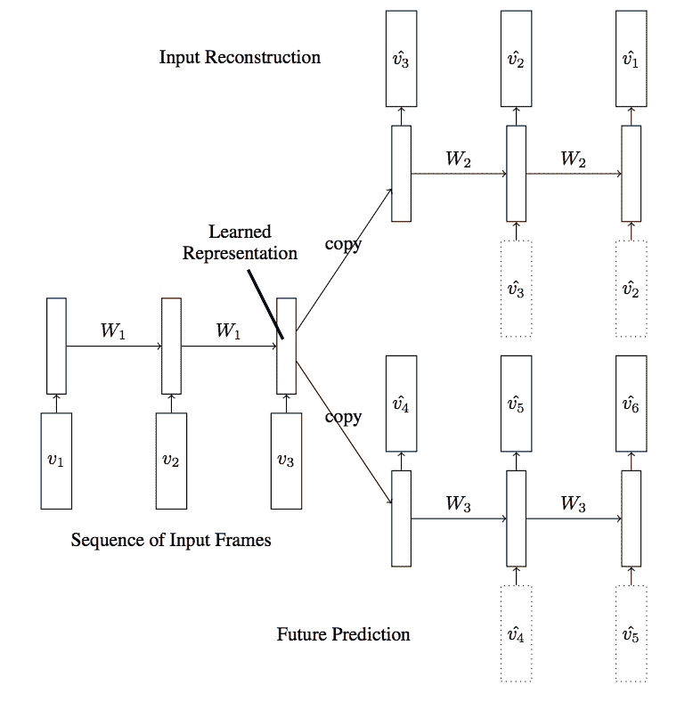
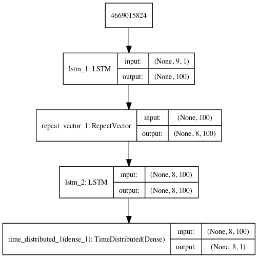
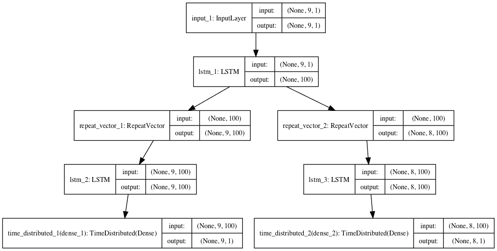
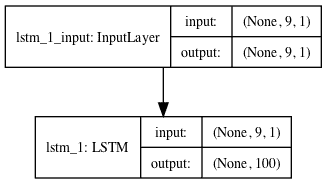

# LSTM自动编码器的温和介绍

> 原文： [https://machinelearningmastery.com/lstm-autoencoders/](https://machinelearningmastery.com/lstm-autoencoders/)

LSTM自动编码器是使用编解码器LSTM架构的用于序列数据的自动编码器的实现。

一旦拟合，模型的编码器部分可用于编码或压缩序列数据，而序列数据又可用于数据可视化或作为监督学习模型的特征向量输入。

在这篇文章中，您将发现LSTM Autoencoder模型以及如何使用Keras在Python中实现它。

阅读这篇文章后，你会知道：

*   自动编码器是一种自我监督的学习模型，可以学习输入数据的压缩表示。
*   LSTM自动编码器可以学习序列数据的压缩表示，并且已经用于视频，文本，音频和时间序列序列数据。
*   如何使用Keras深度学习库在Python中开发LSTM Autoencoder模型。

让我们开始吧。


LSTM自动编码器
的温和介绍 [Ken Lund](https://www.flickr.com/photos/kenlund/2379512850/) 的照片，保留一些权利。

## 概观

这篇文章分为六个部分;他们是：

1.  什么是自动编码器？
2.  序列问题
3.  编解码器LSTM模型
4.  什么是LSTM自动编码器？
5.  LSTM自动编码器的早期应用
6.  如何在Keras中创建LSTM自动编码器

## 什么是自动编码器？

[自动编码器](https://en.wikipedia.org/wiki/Autoencoder)是一种神经网络模型，旨在学习输入的压缩表示。

它们是一种无监督的学习方法，尽管从技术上讲，它们是使用有监督的学习方法训练的，称为自我监督。它们通常作为试图重新创建输入的更广泛模型的一部分进行训练。

例如：

```py
X = model.predict(X)
```

自动编码器模型的设计有目的地通过将架构限制在模型的中点处的瓶颈来实现这种挑战，从中执行输入数据的重建。

有许多类型的自动编码器，它们的使用各不相同，但更常见的用途可能是学习或自动特征提取模型。

在这种情况下，一旦模型拟合，就可以丢弃模型的重建方面，并且可以使用直到瓶颈点的模型。瓶颈处的模型输出是固定长度向量，其提供输入数据的压缩表示。

然后可以将来自域的输入数据提供给模型，并且瓶颈处的模型的输出可以用作监督学习模型中的特征向量，用于可视化，或者更一般地用于降低维度。

## 序列问题

序列预测问题具有挑战性，尤其是因为输入序列的长度可以变化。

这具有挑战性，因为机器学习算法，特别是神经网络，设计用于固定长度输入。

序列数据的另一个挑战是观察的时间顺序可能使得提取适合用作监督学习模型的输入的特征具有挑战性，通常需要在领域或信号处理领域的深入专业知识。

最后，涉及序列的许多预测建模问题需要预测其本身也是序列。这些被称为序列到序列或seq2seq预测问题。

您可以在此处详细了解序列预测问题：

*   [用序列做出预测](https://machinelearningmastery.com/sequence-prediction/)

## 编解码器LSTM模型

诸如长短期存储器或LSTM网络的循环神经网络专门设计用于支持输入数据序列。

它们能够学习输入序列的时间排序中的复杂动态，以及使用内部存储器来记忆或使用长输入序列中的信息。

LSTM网络可以组织成称为编解码器LSTM的架构，该架构允许该模型用于支持可变长度输入序列并预测或输出可变长度输出序列。

该架构是复杂序列预测问题（如语音识别和文本转换）中许多进步的基础。

在该架构中，编码器LSTM模型逐步读取输入序列。在读入整个输入序列之后，该模型的隐藏状态或输出将整个输入序列的内部学习表示表示为固定长度向量。然后将该向量作为输入提供给解码器模型，该解码器模型在生成输出序列中的每个步骤时对其进行解释。

您可以在此处了解有关编解码器架构的更多信息

*   [编解码器长短期存储器网络](https://machinelearningmastery.com/encoder-decoder-long-short-term-memory-networks/)

## 什么是LSTM自动编码器？

LSTM自动编码器是使用编解码器LSTM架构的用于序列数据的自动编码器的实现。

对于给定的序列数据集，编解码器LSTM被配置为读取输入序列，对其进行编码，对其进行解码并重新创建它。基于模型重新创建输入序列的能力来评估模型的表现。

一旦模型达到重建序列的所需表现水平，就可以移除模型的解码器部分，仅留下编码器模型。然后，该模型可用于将输入序列编码为固定长度的向量。

然后，所得到的向量可以用于各种应用中，尤其是作为序列的压缩表示，作为另一个监督学习模型的输入。

## LSTM自动编码器的早期应用

LSTM Autoencoder的早期和广泛引用的应用之一是在2015年的论文“[使用LSTM的视频表示的无监督学习](https://arxiv.org/abs/1502.04681)”。


LSTM自动编码器模型
取自“使用LSTM的无监督学习视频表示”

在论文中，Nitish Srivastava等人。将LSTM Autoencoder描述为编解码器LSTM的扩展或应用。

他们使用具有视频输入数据的模型来重建视频帧的序列以及预测视频帧，这两者都被描述为无监督学习任务。

> 模型的输入是一系列向量（图像块或特征）。编码器LSTM以此顺序读取。在读取了最后一个输入之后，解码器LSTM接管并输出对目标序列的预测。

- [使用LSTM的视频表示的无监督学习](https://arxiv.org/abs/1502.04681)，2015。

作者不仅仅是直接使用模型，而是探索一些有趣的架构选择，这些选择可能有助于为模型的未来应用提供信息。

他们设计模型的方式是以相反的顺序重新创建视频帧的目标序列，声称它使得模型解决的优化问题更容易处理。

> 目标序列与输入序列相同，但顺序相反。反转目标序列使得优化更容易，因为模型可以通过查看低范围相关性来实现。

- [使用LSTM的视频表示的无监督学习](https://arxiv.org/abs/1502.04681)，2015。

他们还探讨了训练解码器模型的两种方法，特别是在解码器生成的先前输出中调节的版本，以及没有任何这种调节的另一种方法。

> 解码器可以是两种 - 有条件的或无条件的。条件解码器接收最后生成的输出帧作为输入[...]。无条件解码器不接收该输入。

- [使用LSTM的视频表示的无监督学习](https://arxiv.org/abs/1502.04681)，2015。

还研究了更精细的自动编码器模型，其中两个解码器模型用于一个编码器：一个用于预测序列中的下一帧，一个用于重建序列中的帧，称为复合模型。

> ...重建输入和预测未来可以组合起来创建一个复合[...]。在这里，编码器LSTM被要求提出一种状态，我们既可以预测接下来的几帧，也可以重建输入。

- [使用LSTM的视频表示的无监督学习](https://arxiv.org/abs/1502.04681)，2015。



具有两个解码器的LSTM自动编码器模型
取自“使用LSTM的视频表示的无监督学习”

模型以多种方式进行评估，包括使用编码器来播种分类器。看来，不是使用编码器的输出作为分类输入，而是选择直接使用编码器模型的权重为独立的LSTM分类器播种。鉴于实施的复杂性，这是令人惊讶的。

> 我们使用编码器LSTM从该模型中学习的权重初始化LSTM分类器。

- [使用LSTM的视频表示的无监督学习](https://arxiv.org/abs/1502.04681)，2015。

发现在解码器上没有调节的复合模型在他们的实验中表现最佳。

> 表现最佳的模型是组合自动编码器和未来预测器的复合模型。条件变量在微调后的分类准确度方面没有给出任何显着的改进，但是它们确实给出了略低的预测误差。

- [使用LSTM的视频表示的无监督学习](https://arxiv.org/abs/1502.04681)，2015。

已经演示了LSTM自动编码器的许多其他应用，尤其是文本序列，音频数据和时间序列。

## 如何在Keras中创建LSTM自动编码器

在Keras中创建LSTM自动编码器可以通过实现编解码器LSTM架构并配置模型来重新创建输入序列来实现。

让我们看几个例子来说明这一点。

### 重建LSTM自动编码器

最简单的LSTM自动编码器是学习重建每个输入序列的自动编码器。

对于这些演示，我们将使用九个时间步骤和一个特征的一个样本的数据集：

```py
[0.1, 0.2, 0.3, 0.4, 0.5, 0.6, 0.7, 0.8, 0.9]
```

我们可以通过定义序列并将其重新整形为[_样本，时间步长，特征_]的首选形状来开始。

```py
# define input sequence
sequence = array([0.1, 0.2, 0.3, 0.4, 0.5, 0.6, 0.7, 0.8, 0.9])
# reshape input into [samples, timesteps, features]
n_in = len(sequence)
sequence = sequence.reshape((1, n_in, 1))
```

接下来，我们可以定义编解码器LSTM架构，该架构期望输入序列具有九个时间步长和一个特征，并输出具有九个时间步长和一个特征的序列。

```py
# define model
model = Sequential()
model.add(LSTM(100, activation='relu', input_shape=(n_in,1)))
model.add(RepeatVector(n_in))
model.add(LSTM(100, activation='relu', return_sequences=True))
model.add(TimeDistributed(Dense(1)))
model.compile(optimizer='adam', loss='mse')
```

接下来，我们可以将模型拟合到我们设计的数据集上。

```py
# fit model
model.fit(sequence, sequence, epochs=300, verbose=0)
```

下面列出了完整的示例。

模型的配置，例如单元数和训练时期，完全是任意的。

```py
# lstm autoencoder recreate sequence
from numpy import array
from keras.models import Sequential
from keras.layers import LSTM
from keras.layers import Dense
from keras.layers import RepeatVector
from keras.layers import TimeDistributed
from keras.utils import plot_model
# define input sequence
sequence = array([0.1, 0.2, 0.3, 0.4, 0.5, 0.6, 0.7, 0.8, 0.9])
# reshape input into [samples, timesteps, features]
n_in = len(sequence)
sequence = sequence.reshape((1, n_in, 1))
# define model
model = Sequential()
model.add(LSTM(100, activation='relu', input_shape=(n_in,1)))
model.add(RepeatVector(n_in))
model.add(LSTM(100, activation='relu', return_sequences=True))
model.add(TimeDistributed(Dense(1)))
model.compile(optimizer='adam', loss='mse')
# fit model
model.fit(sequence, sequence, epochs=300, verbose=0)
plot_model(model, show_shapes=True, to_file='reconstruct_lstm_autoencoder.png')
# demonstrate recreation
yhat = model.predict(sequence, verbose=0)
print(yhat[0,:,0])
```

运行该示例适合自动编码器并打印重建的输入序列。

结果足够接近，非常小的舍入误差。

```py
[0.10398503 0.20047213 0.29905337 0.3989646 0.4994707 0.60005534
0.70039135 0.80031013 0.8997728 ]
```

创建架构图以供参考。


用于序列重建的LSTM自动编码器

### 预测LSTM自动编码器

我们可以修改重建LSTM Autoencoder来预测序列中的下一步。

在我们的小设计问题的情况下，我们期望输出是序列：

```py
[0.2, 0.3, 0.4, 0.5, 0.6, 0.7, 0.8, 0.9]
```

这意味着模型将期望每个输入序列具有九个时间步长，并且输出序列具有八个时间步长。

```py
# reshape input into [samples, timesteps, features]
n_in = len(seq_in)
seq_in = seq_in.reshape((1, n_in, 1))
# prepare output sequence
seq_out = seq_in[:, 1:, :]
n_out = n_in - 1
```

下面列出了完整的示例。

```py
# lstm autoencoder predict sequence
from numpy import array
from keras.models import Sequential
from keras.layers import LSTM
from keras.layers import Dense
from keras.layers import RepeatVector
from keras.layers import TimeDistributed
from keras.utils import plot_model
# define input sequence
seq_in = array([0.1, 0.2, 0.3, 0.4, 0.5, 0.6, 0.7, 0.8, 0.9])
# reshape input into [samples, timesteps, features]
n_in = len(seq_in)
seq_in = seq_in.reshape((1, n_in, 1))
# prepare output sequence
seq_out = seq_in[:, 1:, :]
n_out = n_in - 1
# define model
model = Sequential()
model.add(LSTM(100, activation='relu', input_shape=(n_in,1)))
model.add(RepeatVector(n_out))
model.add(LSTM(100, activation='relu', return_sequences=True))
model.add(TimeDistributed(Dense(1)))
model.compile(optimizer='adam', loss='mse')
plot_model(model, show_shapes=True, to_file='predict_lstm_autoencoder.png')
# fit model
model.fit(seq_in, seq_out, epochs=300, verbose=0)
# demonstrate prediction
yhat = model.predict(seq_in, verbose=0)
print(yhat[0,:,0])
```

运行该示例将打印输出序列，该序列预测每个输入时间步的下一个时间步。

我们可以看到模型是准确的，除了一些小的舍入误差。

```py
[0.1657285 0.28903174 0.40304852 0.5096578 0.6104322 0.70671254
0.7997272 0.8904342 ]
```

创建架构图以供参考。



用于序列预测的LSTM自动编码器

### 复合LSTM自动编码器

最后，我们可以创建一个复合LSTM自动编码器，它具有一个编码器和两个解码器，一个用于重建，另一个用于预测。

我们可以使用功能API在Keras中实现这个多输出模型。您可以在此帖子中了解有关功能API的更多信息：

*   [如何使用Keras功能API进行深度学习](https://machinelearningmastery.com/keras-functional-api-deep-learning/)

首先，定义编码器。

```py
# define encoder
visible = Input(shape=(n_in,1))
encoder = LSTM(100, activation='relu')(visible)
```

然后是第一个用于重建的解码器。

```py
# define reconstruct decoder
decoder1 = RepeatVector(n_in)(encoder)
decoder1 = LSTM(100, activation='relu', return_sequences=True)(decoder1)
decoder1 = TimeDistributed(Dense(1))(decoder1)
```

然后是用于预测的第二个解码器。

```py
# define predict decoder
decoder2 = RepeatVector(n_out)(encoder)
decoder2 = LSTM(100, activation='relu', return_sequences=True)(decoder2)
decoder2 = TimeDistributed(Dense(1))(decoder2)
```

然后我们将整个模型联系在一起。

```py
# tie it together
model = Model(inputs=visible, outputs=[decoder1, decoder2])
```

下面列出了完整的示例。

```py
# lstm autoencoder reconstruct and predict sequence
from numpy import array
from keras.models import Model
from keras.layers import Input
from keras.layers import LSTM
from keras.layers import Dense
from keras.layers import RepeatVector
from keras.layers import TimeDistributed
from keras.utils import plot_model
# define input sequence
seq_in = array([0.1, 0.2, 0.3, 0.4, 0.5, 0.6, 0.7, 0.8, 0.9])
# reshape input into [samples, timesteps, features]
n_in = len(seq_in)
seq_in = seq_in.reshape((1, n_in, 1))
# prepare output sequence
seq_out = seq_in[:, 1:, :]
n_out = n_in - 1
# define encoder
visible = Input(shape=(n_in,1))
encoder = LSTM(100, activation='relu')(visible)
# define reconstruct decoder
decoder1 = RepeatVector(n_in)(encoder)
decoder1 = LSTM(100, activation='relu', return_sequences=True)(decoder1)
decoder1 = TimeDistributed(Dense(1))(decoder1)
# define predict decoder
decoder2 = RepeatVector(n_out)(encoder)
decoder2 = LSTM(100, activation='relu', return_sequences=True)(decoder2)
decoder2 = TimeDistributed(Dense(1))(decoder2)
# tie it together
model = Model(inputs=visible, outputs=[decoder1, decoder2])
model.compile(optimizer='adam', loss='mse')
plot_model(model, show_shapes=True, to_file='composite_lstm_autoencoder.png')
# fit model
model.fit(seq_in, [seq_in,seq_out], epochs=300, verbose=0)
# demonstrate prediction
yhat = model.predict(seq_in, verbose=0)
print(yhat)
```

运行该示例，使用两个解码器重建并预测输出序列。

```py
[array([[[0.10736275],
[0.20335874],
[0.30020815],
[0.3983948 ],
[0.4985725 ],
[0.5998295 ],
[0.700336 ,
[0.8001949 ],
[0.89984304]]], dtype=float32),

array([[[0.16298929],
[0.28785267],
[0.4030449 ],
[0.5104638 ],
[0.61162543],
[0.70776784],
[0.79992455],
[0.8889787 ]]], dtype=float32)]
```

创建架构图以供参考。



用于序列重建和预测的复合LSTM自动编码器

### 保留独立LSTM编码器

无论选择哪种方法（重建，预测或复合），一旦自适应编码器已经适合，就可以移除解码器并且可以将编码器保持为独立模型。

然后，编码器可用于将输入序列变换为固定长度的编码向量。

我们可以通过创建一个与原始模型具有相同输入的新模型，并在`RepeatVector`层之前直接从编码器模型的末尾输出。

```py
# connect the encoder LSTM as the output layer
model = Model(inputs=model.inputs, outputs=model.layers[0].output)
```

下面列出了使用重建LSTM自动编码器执行此操作的完整示例。

```py
# lstm autoencoder recreate sequence
from numpy import array
from keras.models import Sequential
from keras.models import Model
from keras.layers import LSTM
from keras.layers import Dense
from keras.layers import RepeatVector
from keras.layers import TimeDistributed
from keras.utils import plot_model
# define input sequence
sequence = array([0.1, 0.2, 0.3, 0.4, 0.5, 0.6, 0.7, 0.8, 0.9])
# reshape input into [samples, timesteps, features]
n_in = len(sequence)
sequence = sequence.reshape((1, n_in, 1))
# define model
model = Sequential()
model.add(LSTM(100, activation='relu', input_shape=(n_in,1)))
model.add(RepeatVector(n_in))
model.add(LSTM(100, activation='relu', return_sequences=True))
model.add(TimeDistributed(Dense(1)))
model.compile(optimizer='adam', loss='mse')
# fit model
model.fit(sequence, sequence, epochs=300, verbose=0)
# connect the encoder LSTM as the output layer
model = Model(inputs=model.inputs, outputs=model.layers[0].output)
plot_model(model, show_shapes=True, to_file='lstm_encoder.png')
# get the feature vector for the input sequence
yhat = model.predict(sequence)
print(yhat.shape)
print(yhat)
```

运行该示例将创建一个独立的编码器模型，可以使用或保存以供以后使用。

我们通过预测序列并返回编码器的100个元素输出来演示编码器。

显然，这对于我们微小的九步输入序列来说太过分了。

```py
[[0.03625513 0.04107533 0.10737951 0.02468692 0.06771207 0.
  0.0696108  0\.         0\.         0.0688471  0\.         0.
  0\.         0\.         0\.         0\.         0\.         0.03871286
  0\.         0\.         0.05252134 0\.         0.07473809 0.02688836
  0\.         0\.         0\.         0\.         0\.         0.0460703
  0\.         0\.         0.05190025 0\.         0\.         0.11807001
  0\.         0\.         0\.         0\.         0\.         0.
  0\.         0.14514188 0\.         0\.         0\.         0.
  0.02029926 0.02952124 0\.         0\.         0\.         0.
  0\.         0.08357017 0.08418129 0\.         0\.         0.
  0\.         0\.         0.09802645 0.07694854 0\.         0.03605933
  0\.         0.06378153 0\.         0.05267526 0.02744672 0.
  0.06623861 0\.         0\.         0\.         0.08133873 0.09208347
  0.03379713 0\.         0\.         0\.         0.07517676 0.08870222
  0\.         0\.         0\.         0\.         0.03976351 0.09128518
  0.08123557 0\.         0.08983088 0.0886112  0\.         0.03840019
  0.00616016 0.0620428  0\.         0\.        ]
```

创建架构图以供参考。



独立编码器LSTM模型

## 进一步阅读

如果您希望深入了解，本节将提供有关该主题的更多资源。

*   [用序列做出预测](https://machinelearningmastery.com/sequence-prediction/)
*   [编解码器长短期存储器网络](https://machinelearningmastery.com/encoder-decoder-long-short-term-memory-networks/)
*   [自动编码器，维基百科](https://en.wikipedia.org/wiki/Autoencoder)
*   [使用LSTM进行视频表示的无监督学习](https://arxiv.org/abs/1502.04681)，ArXiv 2015。
*   [使用LSTM进行视频表示的无监督学习](http://proceedings.mlr.press/v37/srivastava15.pdf)，PMLR，PDF，2015。
*   [使用LSTM](https://github.com/emansim/unsupervised-videos) ，GitHub存储库进行视频表示的无监督学习。
*   [在Keras建立自动编码器](https://blog.keras.io/building-autoencoders-in-keras.html)，2016年。
*   [如何使用Keras功能API进行深度学习](https://machinelearningmastery.com/keras-functional-api-deep-learning/)

## 摘要

在这篇文章中，您发现了LSTM Autoencoder模型以及如何使用Keras在Python中实现它。

具体来说，你学到了：

*   自动编码器是一种自我监督的学习模型，可以学习输入数据的压缩表示。
*   LSTM自动编码器可以学习序列数据的压缩表示，并且已经用于视频，文本，音频和时间序列序列数据。
*   如何使用Keras深度学习库在Python中开发LSTM Autoencoder模型。

你有任何问题吗？
在下面的评论中提出您的问题，我会尽力回答。