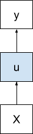
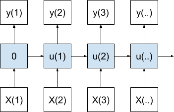
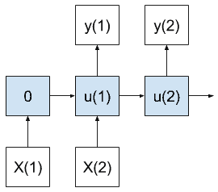

# 基于循环神经网络的序列预测模型的简要介绍

> 原文： [https://machinelearningmastery.com/models-sequence-prediction-recurrent-neural-networks/](https://machinelearningmastery.com/models-sequence-prediction-recurrent-neural-networks/)

序列预测是涉及使用历史序列信息来预测序列中的下一个或多个值的问题。

序列可以是符号，如句子中的字母，也可以是价格时间序列中的实际值。在时间序列预测的背景下，序列预测可能是最容易理解的，因为问题已经被普遍理解。

在这篇文章中，您将发现可用于构建自己的序列预测问题的标准序列预测模型。

阅读这篇文章后，你会知道：

*   如何使用循环神经网络对序列预测问题进行建模。
*   循环神经网络使用的 4 种标准序列预测模型。
*   在应用序列预测模型时，初学者所犯的两个最常见的误解。

让我们开始吧。

## 教程概述

本教程分为 4 个部分;他们是：

1.  循环神经网络序列预测
2.  序列预测模型
3.  来自 Timesteps 的基数不是特征
4.  从业者的两个常见误解

## 循环神经网络序列预测

循环神经网络，如长短期记忆（LSTM）网络，是为序列预测问题而设计的。

实际上，在撰写本文时，LSTM 在具有挑战性的序列预测问题（例如神经机器翻译（将英语翻译成法语））中实现了最先进的结果。

LSTM 通过学习将输入序列值（X）映射到输出序列值（y）的函数（f（...））来工作。

```py
y(t) = f(X(t))
```

学习的映射函数是静态的，可以被认为是一个获取输入变量并使用内部变量的程序。内部变量由网络维护的内部状态表示，并在输入序列中的每个值上建立或累积。

> ... RNN 将输入向量与其状态向量与固定（但已学习）函数组合以产生新的状态向量。在编程术语中，这可以解释为运行具有某些输入和一些内部变量的固定程序。

- Andrej Karpathy，[循环神经网络的不合理效力](http://karpathy.github.io/2015/05/21/rnn-effectiveness/)，2015

可以使用不同数量的输入或输出来定义静态映射函数，我们将在下一节中进行讨论。

## 序列预测模型

在本节中，将回顾序列预测的 4 个主要模型。

我们将使用以下术语：

*   X：输入序列值可以由时间步长界定，例如， X（1）。
*   u：隐藏状态值可以由时间步长界定，例如 U（1）。
*   y：输出序列值可以由时间步长界定，例如， Y（1）。

### 一对一模型

一对一模型为每个输入值生成一个输出值。



一对一序列预测模型

第一步的内部状态为零;从那时起，内部状态在前一时间步骤累积。



随时间变化的一对一序列预测模型

在序列预测的情况下，该模型将针对作为输入接收的每个观察时间步长产生一个时间步长预测。

这对 RNN 的使用很差，因为模型没有机会学习输入或输出时间步长（例如 [BPTT](http://machinelearningmastery.com/gentle-introduction-backpropagation-time/) ）。如果您发现为序列预测实现此模型，您可能打算使用多对一模型。

### 一对多模型

一对多模型为一个输入值生成多个输出值。


一对多序列预测模型

当产生输出序列中的每个值时，累积内部状态。

该模型可用于图像字幕，其中一个图像被提供作为输入并且一系列单词被生成为输出。

### 多对一模型

多对一模型在接收到多个输入值后生成一个输出值。


多对一序列预测模型

在产生最终输出值之前，内部状态与每个输入值累加。

在时间序列的情况下，该模型将使用一系列最近的观察来预测下一个时间步。该架构将代表经典的自回归时间序列模型。

### 多对多模型

多对多模型在接收到多个输入值后会产生多个输出。



多对多序列预测模型

与多对一情况一样，累积状态直到创建第一个输出，但在这种情况下输出多个时间步长。

重要的是，输入时间步数不必与输出时间步数相匹配。考虑以不同速率运行的输入和输出时间步长。

在时间序列预测的情况下，该模型将使用一系列最近的观测来进行多步预测。

从某种意义上说，它结合了多对一和一对多模型的功能。

## 来自 Timesteps 的基数（不是特色！）

常见的混淆点是将上述序列映射模型的示例与多个输入和输出特征混淆。

序列可以由单个值组成，每个时间步长一个。

或者，序列可以很容易地表示在时间步骤的多个观察的向量。时间步长的向量中的每个项可以被认为是其自己的单独时间序列。它不会影响上述模型的描述。

例如，将温度和压力的一个时间步长作为输入并且预测温度和压力的一个时间步长的模型是一对一模型，而不是多对多模型。


多特征序列预测模型

该模型确实将两个值作为输入并预测两个值，但是只有一个序列时间步长表示输入并预测为输出。

上面定义的序列预测模型的基数是指时间步骤，而不是特征（例如，单变量或多变量序列）。

## 从业者的两个常见误解

在从业者实现循环神经网络时，特征与时间步骤的混淆会导致两个主要的误解：

### **1.作为输入功能的时间步长**

先前时间步的观察被构造为模型的输入特征。

这是输入多层感知机使用的序列预测问题的经典的基于固定窗口的方法。相反，序列应该一次一步地进给。

这种混淆可能会导致您认为您已经实现了多对一或多对多序列预测模型，而实际上您只有一个时间步的单个向量输入。

### **2.作为输出特征的时间步长**

多个未来时间步骤的预测被构造为模型的输出特征。

这是多层感知机和其他机器学习算法使用的多步预测的经典固定窗口方法。相反，序列预测应该一次一步地生成。

这种混淆可能会导致您认为您已经实现了一对多或多对多的序列预测模型，而实际上您只有一个时间步的单个向量输出（例如 seq2vec 而不是 seq2seq）。

注意：将时间步长作为序列预测问题中的特征构建是一种有效的策略，即使使用循环神经网络也可以提高表现（尝试一下！）。这里的重点是了解常见的陷阱，而不是在构建自己的预测问题时欺骗自己。

## 进一步阅读

如果您要深入了解，本节将提供有关该主题的更多资源。

*   [循环神经网络的不合理有效性](http://karpathy.github.io/2015/05/21/rnn-effectiveness/)
*   [序列预测简介](http://data-mining.philippe-fournier-viger.com/an-introduction-to-sequence-prediction/)

## 摘要

在本教程中，您发现了使用循环神经网络进行序列预测的标准模型。

具体来说，你学到了：

*   如何使用循环神经网络对序列预测问题进行建模。
*   循环神经网络使用的 4 种标准序列预测模型。
*   在应用序列预测模型时，初学者所犯的两个最常见的误解。

你有任何问题吗？
在下面的评论中提出您的问题，我会尽力回答。