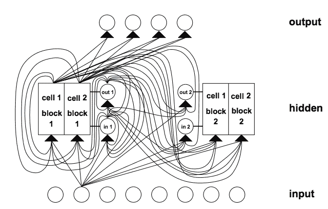

# 深度学习的循环神经网络算法之旅

> 原文： [https://machinelearningmastery.com/recurrent-neural-network-algorithms-for-deep-learning/](https://machinelearningmastery.com/recurrent-neural-network-algorithms-for-deep-learning/)

循环神经网络（RNN）是一种人工神经网络，其向网络添加额外的权重以在网络图中创建循环以努力维持内部状态。

向神经网络添加状态的承诺是，他们将能够明确地学习和利用序列预测问题中的上下文，例如订单或时间组件的问题。

在这篇文章中，您将参观用于深度学习的循环神经网络。

阅读这篇文章后，你会知道：

*   顶级循环神经网络如何用于深度学习，例如 LSTM，GRU 和 NTM。
*   顶级 RNN 如何与人工神经网络中更广泛的复发研究相关。
*   对 RNN 的研究如何在一系列具有挑战性的问题上取得了最先进的表现。

请注意，我们不会涵盖所有可能的循环神经网络。相反，我们将关注用于深度学习的循环神经网络（LSTM，GRU 和 NTM）以及理解它们所需的上下文。

让我们开始吧。


深度学习的循环神经网络算法之旅
照片由 [Santiago Medem](https://www.flickr.com/photos/fotos_medem/3398311871/) 拍摄，保留一些权利。

## 概观

我们将从为循环神经网络领域设置场景开始。

接下来，我们将深入研究用于深度学习的 LSTM，GRU 和 NTM。

然后，我们将花一些时间在与使用 RNN 进行深度学习相关的高级主题上。

*   循环神经网络
    *   完全经常性网络
    *   循环神经网络
    *   神经历史压缩机
*   长期短期记忆网络
*   门控递归单元神经网络
*   神经图灵机

## 循环神经网络

让我们设置场景。

流行的观点表明，重复会给网络拓扑带来内存。

考虑这一点的更好方法是训练集包含带有当前训练示例的一组输入的示例。这是“常规的，例如传统的多层感知机。

```py
X(i) -> y(i)
```

但是训练示例补充了前一个示例中的一组输入。这是“非常规的”，例如[循环神经网络](https://en.wikipedia.org/wiki/Recurrent_neural_network)。

```py
[X(i-1), X(i)] -> y(i)
```

与所有前馈网络范例一样，问题是如何将输入层连接到输出层，包括反馈激活，然后训练构造以收敛。

现在让我们来看看不同类型的循环神经网络，从非常简单的概念开始。

### 完全经常性网络

多层感知机的分层拓扑被保留，但每个元素都与架构中的每个其他元素具有加权连接，​​并且与其自身具有单个反馈连接。

并非所有连接都经过训练，并且误差导数的极端非线性意味着传统的反向传播将不起作用，因此采用[时间反向传播](https://en.wikipedia.org/wiki/Backpropagation_through_time)接近或随机梯度下降。

另请参阅 Bill Wilson 的 [Tensor 产品网络](http://www.cse.unsw.edu.au/~billw/cs9444/tensor-stuff/tensor-intro-04.html)（1991）。

### 循环神经网络

循环神经网络是[递归网络](https://en.wikipedia.org/wiki/Recursive_neural_network)的线性架构变体。

递归促进了分层特征空间中的分支，并且随着训练的进行，所得到的网络架构模仿了这一点。

使用梯度下降通过子梯度方法实现训练。

这在 R. Socher 等人， [Parsing Natural Scenes and Natural Language with Recursive Neural Networks](http://machinelearning.wustl.edu/mlpapers/paper_files/ICML2011Socher_125.pdf) ，2011 中有详细描述。

### 神经历史压缩机

Schmidhuber 在 1991 年首次报告了一个非常深入的学习器，他能够通过无人监督的 RNN 层次结构预训练，对数百个神经层进行信用分配。

每个 RNN 都经过无人监督训练，以预测下一个输入。然后，仅向前馈送生成错误的输入，将新信息传送到层级中的下一个 RNN，然后以较慢的自组织时间尺度处理。

结果表明，没有信息丢失，只是压缩了。 RNN 栈是数据的“深层生成模型”。可以从压缩形式重建数据。

参见 J. Schmidhuber 等人，[神经网络中的深度学习：概述](http://www2.econ.iastate.edu/tesfatsi/DeepLearningInNeuralNetworksOverview.JSchmidhuber2015.pdf)，2014。

随着误差通过大拓扑向后传播，非线性导数的极值计算增加，反向传播失败，即使不是不可能，信用分配也很困难。

## 长期短期记忆网络

对于传统的反向传播时间（BPTT）或实时循环学习（RTTL），在时间上向后流动的误差信号往往会爆炸或消失。

反向传播误差的时间演变指数地取决于权重的大小。重量爆炸可能导致重量振荡，而在消失导致学习弥合长时间滞后并花费大量时间，或根本不起作用。

*   LSTM 是一种新颖的循环网络架构训练，具有适当的基于梯度的学习算法。
*   LSTM 旨在克服错误回流问题。它可以学习桥接超过 1000 步的时间间隔。
*   这在存在嘈杂，不可压缩的输入序列时是真实的，而不会损失短时滞能力。

错误的回流问题通过一种有效的基于梯度的算法克服，该算法用于通过特殊单元的内部状态执行常量（因此既不爆炸也不消失）的错误流。这些单位减少了“输入权重冲突”和“输出权重冲突”的影响。

**输入权重冲突**：如果输入非零，则必须使用相同的输入权重来存储某些输入并忽略其他输入，然后通常会收到相互冲突的权重更新信号。

这些信号将尝试使重量参与存储输入和保护输入。这种冲突使得学习变得困难，并且需要更多上下文敏感的机制来通过输入权重来控制“写入操作”。

**输出权重冲突**：只要单元的输出不为零，来自该单元的输出连接的权重将吸引在序列处理期间产生的冲突的权重更新信号。

这些信号将试图使输出权重参与访问存储在处理单元中的信息，并且在不同时间保护后续单元不被正向馈送的单元的输出扰动。

这些冲突并非特定于长期滞后，同样会影响短期滞后。值得注意的是，随着滞后增加，必须保护存储的信息免受扰动，特别是在学习的高级阶段。

**网络架构**：不同类型的单元可以传达有关网络当前状态的有用信息。例如，输入门（输出门）可以使用来自其他存储器单元的输入来决定是否在其存储器单元中存储（访问）某些信息。

存储器单元包含门。盖茨特定于他们调解的联系。输入门用于补救输入权重冲突，而输出门工作则消除输出权重冲突。

**门**：具体来说，为了减轻输入和输出权重冲突和扰动，引入了乘法输入门单元，以保护存储内容免受无关输入的干扰，乘法输出门单元保护其他单元免受扰动通过当前无关的存储内容存储。



具有 8 个输入单元，4 个输出单元和 2 个大小为 2\. in1 的存储器单元块的 LSTM 网络的示例标记输入门，out1 标记输出门，并且 cell1 = block1 标记块 1 的第一存储器单元。
摘自 1997 年的长短记忆。

与多层感知机相比，LSTM 中的连接性是复杂的，因为处理元件的多样性和反馈连接的包含。

**存储器单元块**：共享相同输入门和相同输出门的存储器单元形成称为“存储器单元块”的结构。

存储单元块便于信息存储;与传统神经网络一样，在单个单元内编码分布式输入并不容易。大小为 1 的存储器单元块只是一个简单的存储器单元。

**学习**：实时循环学习（RTRL）的一种变体，它考虑了由输入和输出门引起的改变的乘法动力学，用于确保通过内存状态存储单元错误传播的非衰减误差到达“存储器单元网络输入”不会及时传播回来。

**猜测**：这种随机方法可以胜过许多术语滞后算法。已经确定，通过简单的随机权重猜测可以比通过所提出的算法更快地解决在先前工作中使用的许多长时滞后任务。

参见 S.Hochreiter 和 J. Schmidhuber， [Long-Short Term Memory](http://dl.acm.org/citation.cfm?id=1246450) ，1997。

LSTM 循环神经网络最有趣的应用是语言处理工作。有关全面的描述，请参阅 Gers 的工作。

*   F. Gers 和 J. Schmidhuber， [LSTM Recurrent Networks 学习简单的上下文无关和上下文敏感语言](ftp://ftp.idsia.ch/pub/juergen/L-IEEE.pdf)，2001。
*   F. Gers，[循环神经网络中的长短期记忆](http://www.felixgers.de/papers/phd.pdf)，博士。论文，2001 年。

### LSTM 限制

LSTM 的高效截断版本不会轻易解决类似“强烈延迟 XOR”的问题。

每个存储器单元块需要输入门和输出门。在其他经常性方法中没有必要。

通过存储器单元内的“恒定误差卡鲁塞尔”的恒定误差流产生与一次呈现整个输入串的传统前馈架构相同的效果。

与其他前馈方法一样，LSTM 与“摄政”概念一样存在缺陷。如果需要精确计数时间步长，则可能需要额外的计数机制。

### LSTM 的优点

算法弥合长时间滞后的能力是架构内存单元中持续误差反向传播的结果。

LSTM 可以近似噪声问题域，分布式表示和连续值。

LSTM 很好地概括了所考虑的问题域。这很重要，因为某些任务对于已经建立的循环网络来说是难以处理的。

在问题域上对网络参数进行微调似乎是不必要的。

就每个权重和时间步骤的更新复杂性而言，LSTM 基本上等同于 BPTT。

LSTM 显示出强大功能，在机器翻译等领域实现了最先进的结果。

## 门控递归单元神经网络

门控循环神经网络已成功应用于顺序或时间数据。

最适合语音识别，自然语言处理和机器翻译，与 LSTM 一起，它们在长序列问题域中表现良好。

在 LSTM 主题中考虑了门控，并且涉及门控网络生成信号，该信号用于控制当前输入和先前存储器如何工作以更新当前激活，从而控制当前网络状态。

在整个学习阶段，门自身被加权并根据算法选择性地更新。

门网络以增加的复杂性的形式引入了额外的计算开销，因此增加了参数化。

LSTM RNN 架构使用简单 RNN 的计算作为内部存储器单元（状态）的中间候选者。门控递归单元（GRU）RNN 将门控信号从 LSTM RNN 模型减少到两个。两个门被称为更新门和复位门。

GRU（和 LSTM）RNN 中的选通机制在参数化方面是简单 RNN 的复制品。对应于这些门的权重也使用 BPTT 随机梯度下降来更新，因为它试图使成本函数最小化。

每个参数更新将涉及与整个网络的状态有关的信息。这可能会产生不利影响。

门控的概念进一步探索并扩展了三种新的变量门控机制。
已经考虑的三个门控变量是 GRU1，其中每个门仅使用先前的隐藏状态和偏差来计算; GRU2，其中每个门仅使用先前的隐藏状态计算;和 GRU3，其中每个门仅使用偏差计算。使用 GRU3 观察到参数的显着减少，产生最小数量。

使用来自手写数字的 MNIST 数据库和 IMDB 电影评论数据集的数据对三种变体和 GRU RNN 进行基准测试。

从 MNIST 数据集生成两个序列长度，并且从 IMDB 数据集生成一个序列长度。

门的主要驱动信号似乎是（周期性）状态，因为它包含有关其他信号的基本信息。

随机梯度下降的使用隐含地携带关于网络状态的信息。这可以解释在门信号中单独使用偏置的相对成功，因为其自适应更新携带关于网络状态的信息。

门控变体通过有限的拓扑评估来探索门控的机制。

有关更多信息，请参阅

*   R. Dey 和 F. M. Salem，[门控变换单元（GRU）神经网络的门变量](https://arxiv.org/ftp/arxiv/papers/1701/1701.05923.pdf)，2017。
*   J. Chung，et al。，[关于序列建模的门控循环神经网络的实证评估](https://pdfs.semanticscholar.org/2d9e/3f53fcdb548b0b3c4d4efb197f164fe0c381.pdf)，2014。

## 神经图灵机

神经图灵机通过将它们耦合到外部存储器资源来扩展神经网络的能力，它们可以通过注意过程与之交互。

组合系统类似于图灵机或冯·诺依曼架构，但是端到端是可区分的，允许它通过梯度下降进行有效训练。

初步结果表明，神经图灵机可以推断出简单的算法，例如输入和输出示例中的复制，排序和关联召回。

RNN 在其他机器学习方法中脱颖而出，因为它们能够在长时间内学习和执行复杂的数据转换。此外，众所周知，RNN 是图灵完备的，因此如果连接正确，则具有模拟任意过程的能力。

扩展了标准 RNN 的功能，以简化算法任务的解决方案。这种丰富主要是通过一个大的，可寻址的存储器，因此，类似于图灵通过无限记忆磁带丰富有限状态机，并被称为“神经图灵机”（NTM）。

与图灵机不同，NTM 是一种可区分的计算机，可以通过梯度下降进行训练，从而为学习程序提供实用的机制。


NTM Architecture 通常如上所示。在每个更新周期期间，控制器网络接收来自外部环境的输入并作为响应发出输出。它还通过一组并行读写磁头读取和写入存储器矩阵。虚线表示 NTM 电路与外界之间的划分。
摘自神经图灵机，2014 年。

至关重要的是，该建筑的每个组成部分都是可区分的，因此可以直接用梯度下降进行训练。这是通过定义“模糊”读写操作来实现的，这些操作与存储器中的所有元素或多或少地相互作用（而不是像普通的图灵机或数字计算机那样寻址单个元素）。

For more information see:

*   A. Graves 等， [Neural Turing Machines](https://arxiv.org/pdf/1410.5401.pdf) ，2014。
*   R. Greve 等人， [Evolving Neural Turing Machines for Reward-based Learning](http://sebastianrisi.com/wp-content/uploads/greve_gecco16.pdf) ，2016。

### NTM 实验

复制任务测试 NTM 是否可以存储和调用一长串任意信息。向网络呈现随机二进制向量的输入序列，后跟定界符标志。

训练网络以复制 8 位随机向量的序列，其中序列长度在 1 和 20 之间随机化。目标序列只是输入序列的副本（没有定界符号）。

重复复制任务通过要求网络将复制的序列输出指定的次数然后发出序列结束标记来扩展复制。主要动机是看 NTM 是否可以学习一个简单的嵌套函数。

网络接收随机二进制向量的随机长度序列，随后是指示所需拷贝数的标量值，其出现在单独的输入通道上。

关联召回任务涉及组织由“间接”引起的数据，即当一个数据项指向另一个时。构造项目列表以便查询其中一个项目要求网络返回后续项目。

定义了由分隔符符号左右界定的二进制向量序列。在将多个项目传播到网络之后，通过显示随机项目来查询网络，并查看网络是否可以生成下一个项目。

动态 N-Grams 任务测试 NTM 是否可以通过使用内存作为可重写表来快速适应新的预测分布，它可以用来保持转换统计的计数，从而模拟传统的 N-Gram 模型。

考虑二进制序列上所有可能的 6-Gram 分布的集合。每个 6-Gram 分布可以表示为 32 个数字的表，指定下一个比特为 1 的概率，给定所有可能的长度为 5 的二进制历史。通过使用当前查找表绘制 200 个连续位来生成特定训练序列。网络一次一位地观察序列，然后被要求预测下一位。

优先级排序任务测试 NTM 的排序能力。随机二进制向量序列与每个向量的标量优先级一起输入到网络。优先级从[-1,1]范围内均匀绘制。目标序列包含根据其优先级排序的二元向量。

NTM 将 LSTM 的前馈架构作为其组件之一。

## 摘要

在这篇文章中，您发现了用于深度学习的循环神经网络。

具体来说，你学到了：

*   顶级循环神经网络如何用于深度学习，例如 LSTM，GRU 和 NTM。
*   顶级 RNN 如何与人工神经网络中更广泛的复发研究相关。
*   RNN 的研究如何在一系列具有挑战性的问题上实现最先进的表现。

这是一个很重要的帖子。

您对深度学习的 RNN 有任何疑问吗？
在下面的评论中提出您的问题，我会尽力回答。