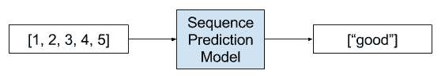

# 使用序列进行预测

> 原文： [https://machinelearningmastery.com/sequence-prediction/](https://machinelearningmastery.com/sequence-prediction/)

序列预测不同于其他类型的监督学习问题。

该序列对训练模型和进行预测时必须保留的观察结果施加顺序。

通常，涉及序列数据的预测问题被称为序列预测问题，尽管存在一组基于输入和输出序列而不同的问题。

在本教程中，您将发现不同类型的序列预测问题。

完成本教程后，您将了解：

*   4种类型的序列预测问题。
*   专家对每种序列预测问题的定义。
*   每种类型的序列预测问题的真实示例。

让我们开始吧。

使用序列进行预测的温和介绍
照 [abstrkt.ch](https://www.flickr.com/photos/xa4/6881309290/) ，保留一些权利。

## 教程概述

本教程分为5个部分;他们是：

1.  序列
2.  序列预测
3.  序列分类
4.  序列生成
5.  序列到序列预测

## 序列

我们经常处理应用机器学习中的集合，例如训练或测试样本集。

集合中的每个样本可以被认为是来自域的观察。

在一组中，观察的顺序并不重要。

序列不同。该序列对观察结果强加了明确的顺序。

订单很重要。在使用序列数据作为模型的输入或输出的预测问题的制定中必须遵守它。

### 序列预测

序列预测涉及预测给定输入序列的下一个值。

例如：

*   鉴于：1,2,3,4,5
*   预测：6

序列预测问题的示例

> 序列预测试图基于前面的元素来预测序列的元素

- [序列学习：从识别和预测到顺序决策](http://www.sts.rpi.edu/~rsun/sun.expert01.pdf)，2001。

> 使用一组训练序列训练预测模型。一旦训练，该模型用于执行序列预测。预测包括预测序列的下一项。此任务有许多应用程序，如网页预取，消费者产品推荐，天气预报和股票市场预测。

- [CPT +：减少紧凑预测树的时间/空间复杂度](https://link.springer.com/chapter/10.1007/978-3-319-18032-8_49)，2015

序列预测通常也可称为“_序列学习_”。

> 学习顺序数据仍然是模式识别和机器学习中的一项基本任务和挑战。涉及顺序数据的应用可能需要预测新事件，产生新序列，或决策制定，例如序列或子序列的分类。

- [关于使用变量马尔可夫模型的预测](http://www.jair.org/media/1491/live-1491-2335-jair.pdf)，2004。

从技术上讲，我们可以将这篇文章中的所有以下问题都称为一种序列预测问题。这会让初学者感到困惑。

序列预测问题的一些例子包括：

*   **天气预报**。鉴于随着时间的推移对天气的一系列观察，预测明天的预期天气。
*   **股市预测**。给定安全性随时间的一系列移动，预测安全性的下一个移动。
*   **产品推荐**。给定一系列过去购买的客户，预测下一次购买客户。

## 序列分类

序列分类涉及预测给定输入序列的类标签。

For example:

*   鉴于：1,2,3,4,5
*   预测：“好”或“坏”

序列分类问题的示例

> 序列分类的目的是使用标记的数据集D建立分类模型，以便该模型可用于预测看不见的序列的类标签。

- 第14章，[数据分类：算法和应用](http://www.amazon.com/dp/B00MOU4SC0?tag=inspiredalgor-20)，2015年

输入序列可以包括实数值或离散值。在后一种情况下，这些问题可以称为离散序列分类。

序列分类问题的一些例子包括：

*   **DNA序列分类**。给定ACGT值的DNA序列，预测序列是否编码编码区或非编码区。
*   **异常检测**。给定一系列观察结果，预测序列是否异常。
*   **情感分析**。给定一系列文本，如评论或推文，预测文本的情感是正面还是负面。

## 序列生成

序列生成涉及生成新的输出序列，其具有与语料库中的其他序列相同的一般特征。

For example:

*   鉴于：[1,3,5]，[7,9,11]
*   预测：[3,5,7]

> [循环神经网络]可以通过一次一步地处理实际数据序列并预测接下来会发生什么来训练序列生成。假设预测是概率性的，则可以通过从网络的输出分布迭代采样从训练的网络生成新的序列，然后在下一步骤中将样本作为输入馈入。换句话说，通过让网络将其发明看作是真实的，就像一个人在做梦

- [生成具有循环神经网络的序列](https://arxiv.org/abs/1308.0850)，2013。

序列生成问题的一些示例包括：

*   **文字生成**。给定一组文本，例如莎士比亚的作品，生成新的句子或段落的文字，如莎士比亚。
*   **手写预测**。给定手写示例语料库，为在语料库中具有手写属性的新短语生成手写。
*   **音乐生成**。给定一组音乐示例，生成具有语料库属性的新音乐作品。

序列生成还可以指给定单个观察作为输入的序列的生成。

一个例子是图像的自动文本描述。

*   **图像标题生成**。给定图像作为输入，生成描述图像的单词序列。

序列生成问题的示例

> 能够使用正确形成的英语句子自动描述图像的内容是一项非常具有挑战性的任务，但它可以产生很大的影响，例如通过帮助视障人士更好地理解网络上的图像内容。 [...]实际上，描述不仅必须捕获图像中包含的对象，还必须表达这些对象如何相互关联以及它们的属性和它们所涉及的活动。此外，上述语义知识具有用英语等自然语言表达，这意味着除了视觉理解之外还需要语言模型。

- [Show and Tell：神经图像标题生成器](https://arxiv.org/abs/1411.4555)，2015

## 序列到序列预测

序列到序列预测涉及在给定输入序列的情况下预测输出序列。

For example:

*   鉴于：1,2,3,4,5
*   预测：6,7,8,9,10

序列到序列预测问题的示例

> 尽管它们具有灵活性和功能，但[深度神经网络]只能应用于输入和目标可以用固定维数向量进行合理编码的问题。这是一个重要的限制，因为许多重要问题最好用长度未知的序列表达。例如，语音识别和机器翻译是顺序问题。同样，问答也可以被视为将表示问题的单词序列映射到表示答案的单词序列。

- [用神经网络进行序列学习的序列](https://arxiv.org/abs/1409.3215)，2014

这是序列预测的微妙但具有挑战性的扩展，其中不是预测序列中的单个下一个值，而是预测新序列可以具有或不具有与输入序列相同的长度或者与输入序列具有相同的时间。

这种类型的问题最近在自动文本翻译领域（例如，将英语翻译成法语）进行了大量研究，并且可以通过缩写seq2seq来引用。

> seq2seq学习的核心是使用循环神经网络将可变长度输入序列映射到可变长度输出序列。虽然相对较新，但seq2seq方法不仅在其原始应用 - 机器翻译方面取得了最先进的成果。

- [多任务序列到序列学习](https://arxiv.org/abs/1511.06114)，2016。

如果输入和输出序列是时间序列，则该问题可以称为多步时间序列预测。

*   **多步时间序列预测**。给定时间序列的观察，预测一系列未来时间步骤的观察结果。
*   **文字摘要**。给定文本文档，预测描述源文档的显着部分的较短文本序列。
*   **程序执行**。给定文本描述程序或数学方程，预测描述正确输出的字符序列。

## 进一步阅读

如果您要深入了解，本节将提供有关该主题的更多资源。

*   维基百科上的[序列](https://en.wikipedia.org/wiki/Sequence)
*   [CPT +：减少紧凑预测树的时间/空间复杂度](https://link.springer.com/chapter/10.1007/978-3-319-18032-8_49)，2015
*   [关于使用变量马尔可夫模型的预测](http://www.jair.org/media/1491/live-1491-2335-jair.pdf)，2004
*   [序列预测简介](http://data-mining.philippe-fournier-viger.com/an-introduction-to-sequence-prediction/)，2016
*   [序列学习：从识别和预测到顺序决策](http://www.sts.rpi.edu/~rsun/sun.expert01.pdf)，2001
*   第14章，离散序列分类，[数据分类：算法和应用](http://amzn.to/2tkM723)，2015
*   [使用循环神经网络生成序列](https://arxiv.org/abs/1308.0850)，2013
*   [Show and Tell：神经图像标题生成器](https://arxiv.org/abs/1411.4555)，2015
*   [多任务序列到序列学习](https://arxiv.org/abs/1511.06114)，2016
*   [用神经网络进行序列学习的序列](https://arxiv.org/abs/1409.3215)，2014
*   [递归和直接的多步预测：两全其美](https://robjhyndman.com/papers/rectify.pdf)，2012

## 摘要

在本教程中，您发现了不同类型的序列预测问题。

具体来说，你学到了：

*   4种类型的序列预测问题。
*   专家对每种序列预测问题的定义。
*   每种类型的序列预测问题的真实示例。

你有任何问题吗？
在下面的评论中提出您的问题，我会尽力回答。