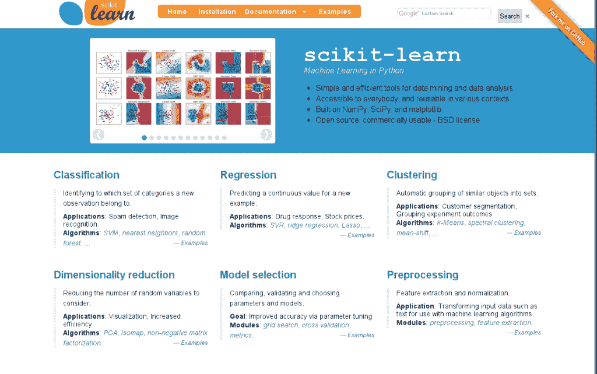
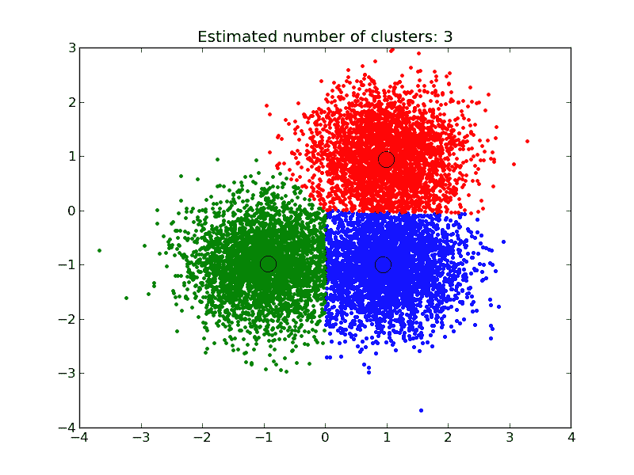

# Scikit-Learn 的温和介绍：Python 机器学习库

> 原文： [https://machinelearningmastery.com/a-gentle-introduction-to-scikit-learn-a-python-machine-learning-library/](https://machinelearningmastery.com/a-gentle-introduction-to-scikit-learn-a-python-machine-learning-library/)

如果您是一名 Python 程序员，或者您正在寻找一个强大的库，您可以将机器学习带入生产系统，那么您需要认真考虑的库是 scikit-learn。

在这篇文章中，您将获得 scikit-learn 库的概述以及可以从中了解更多信息的有用参考资料。

## 它从哪里来的？

Scikit-learn 最初是由 David Cournapeau 在 2007 年开发的 Google 夏季代码项目。

后来 Matthieu Brucher 加入了这个项目并开始将其作为论文工作的一部分。 2010 年，INRIA 参与其中，第一次公开发布（v0.1 beta）于 2010 年 1 月下旬发布。

该项目目前有超过 30 个活跃的贡献者，并已经 [INRIA](http://www.inria.fr/en/) ，谷歌， [Tinyclues](http://www.tinyclues.com/) 和 [Python 软件基金会](https://www.python.org/psf/)支付了赞助费。

[](https://3qeqpr26caki16dnhd19sv6by6v-wpengine.netdna-ssl.com/wp-content/uploads/2014/04/scikit-learn.png)

[Scikit-learn 主页](http://scikit-learn.org/stable/index.html)

## 什么是 scikit-learn？

Scikit-learn 通过 Python 中的一致接口提供一系列有监督和无监督的学习算法。

它根据许可的简化 BSD 许可证授权，并在许多 Linux 发行版下分发，鼓励学术和商业用途。

该库是基于 SciPy（Scientific Python）构建的，必须先安装才能使用 scikit-learn。这个堆栈包括：

*   **NumPy** ：基本 n 维数组包
*   **SciPy** ：科学计算的基础库
*   **Matplotlib** ：全面的 2D / 3D 绘图
*   **IPython** ：增强的交互式控制台
*   **Sympy** ：符号数学
*   **Pandas** ：数据结构和分析

SciPy 护理的扩展或模块通常命名为 [SciKits](http://scikits.appspot.com/scikits) 。因此，该模块提供学习算法，并命名为 scikit-learn。

该库的愿景是在生产系统中使用所需的稳健性和支持水平。这意味着要深入关注易用性，代码质量，协作，文档和表现等问题。

虽然接口是 Python，但 c-libraries 可以利用表现，例如数组和矩阵运算的 numpy， [LAPACK](http://www.netlib.org/lapack/) ， [LibSVM](http://www.csie.ntu.edu.tw/~cjlin/libsvm/) 以及谨慎使用 cython。

## 有什么特点？

该库专注于建模数据。它不专注于加载，操作和汇总数据。有关这些功能，请参阅 NumPy 和 Pandas。

[](https://3qeqpr26caki16dnhd19sv6by6v-wpengine.netdna-ssl.com/wp-content/uploads/2014/04/plot_mean_shift_1.png)

截图取自[平均移位聚类算法](http://scikit-learn.org/stable/auto_examples/cluster/plot_mean_shift.html)的演示

scikit-learn 提供的一些流行的模型组包括：

*   **聚类**：用于对未标记数据（如 KMeans）进行分组。
*   **交叉验证**：用于估计监督模型对未见数据的表现。
*   **数据集**：用于测试数据集以及用于生成具有用于调查模型行为的特定属性的数据集。
*   **维度降低**：用于减少数据中的属性数量，以进行摘要，可视化和特征选择，例如主成分分析。
*   **集合方法**：用于组合多个监督模型的预测。
*   **特征提取**：用于定义图像和文本数据中的属性。
*   **特征选择**：用于识别创建监督模型的有意义属性。
*   **参数调整**：用于充分利用受监督的模型。
*   **流形学习**：用于总结和描绘复杂的多维数据。
*   **监督模型**：一个庞大的阵列，不仅限于广义线性模型，判别分析，朴素贝叶斯，惰性方法，神经网络，支持向量机和决策树。

## 示例：分类和回归树

我想举个例子向您展示使用库是多么容易。

在此示例中，我们使用分类和回归树（CART）决策树算法来模拟 Iris 花数据集。

此数据集作为库的示例数据集提供并加载。分类器适合数据，然后对训练数据做出预测。

最后，打印分类准确度和混淆矩阵。

```
# Sample Decision Tree Classifier
from sklearn import datasets
from sklearn import metrics
from sklearn.tree import DecisionTreeClassifier
# load the iris datasets
dataset = datasets.load_iris()
# fit a CART model to the data
model = DecisionTreeClassifier()
model.fit(dataset.data, dataset.target)
print(model)
# make predictions
expected = dataset.target
predicted = model.predict(dataset.data)
# summarize the fit of the model
print(metrics.classification_report(expected, predicted))
print(metrics.confusion_matrix(expected, predicted))
```

运行此示例将生成以下输出，显示已训练模型的详细信息，根据一些常见指标的模型技能和混淆矩阵。

```
DecisionTreeClassifier(class_weight=None, criterion='gini', max_depth=None,
            max_features=None, max_leaf_nodes=None, min_samples_leaf=1,
            min_samples_split=2, min_weight_fraction_leaf=0.0,
            presort=False, random_state=None, splitter='best')
             precision    recall  f1-score   support

          0       1.00      1.00      1.00        50
          1       1.00      1.00      1.00        50
          2       1.00      1.00      1.00        50

avg / total       1.00      1.00      1.00       150

[[50  0  0]
 [ 0 50  0]
 [ 0  0 50]]
```

## 谁在使用它？

[scikit-learn 推荐页](http://scikit-learn.org/stable/testimonials/testimonials.html)列出了 Inria，Mendeley，wise.io，Evernote，Telecom ParisTech 和 AWeber 作为库的用户。

如果这是对使用过的公司的一个小指示，那么很可能有数十到数百个较大的组织使用该库。

它具有良好的测试覆盖率和管理版本，适用于原型和生产项目。

## 资源

如果您有兴趣了解更多信息，请查看包含文档和相关资源的 [Scikit-Learn 主页](http://scikit-learn.org)。

您可以从 [github 存储库](https://github.com/scikit-learn)获取代码，并且在 [Sourceforge 项目](http://sourceforge.net/projects/scikit-learn/)中可以获得历史版本。

### 文档

我建议您从快速入门教程开始，然后浏览用户指南和示例库，了解您感兴趣的算法。

最终，scikit-learn 是一个库，API 参考将是完成工作的最佳文档。

*   快速入门教程 [http://scikit-learn.org/stable/tutorial/basic/tutorial.html](http://scikit-learn.org/stable/tutorial/basic/tutorial.html)
*   用户指南 [http://scikit-learn.org/stable/user_guide.html](http://scikit-learn.org/stable/user_guide.html)
*   API 参考 [http://scikit-learn.org/stable/modules/classes.html](http://scikit-learn.org/stable/modules/classes.html)
*   示例图库 [http://scikit-learn.org/stable/auto_examples/index.html](http://scikit-learn.org/stable/auto_examples/index.html)

### 文件

如果您对项目如何开始以及它的愿景有更多信息感兴趣，那么您可能需要查看一些论文。

*   [Scikit-learn：Python 中的机器学习](http://jmlr.org/papers/v12/pedregosa11a.html)（2011）
*   [机器学习软件的 API 设计：来自 scikit-learn 项目的经验](http://arxiv.org/abs/1309.0238)（2013）

### 图书

如果您正在寻找一本好书，我推荐“使用 Python 构建机器学习系统”。它编写得很好，例子很有趣。

*   [学习 scikit-learn：Python 中的机器学习](http://www.amazon.com/dp/1783281936?tag=inspiredalgor-20)（2013）
*   [用 Python 构建机器学习系统](http://www.amazon.com/dp/1782161406?tag=inspiredalgor-20)（2013）
*   [天文学中的统计，数据挖掘和机器学习：用于分析调查数据的实用 Python 指南](http://www.amazon.com/dp/0691151687?tag=inspiredalgor-20)（2014）