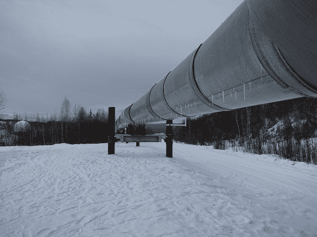

# 使用 Python 管道和 scikit-learn 自动化机器学习工作流程

> 原文： [https://machinelearningmastery.com/automate-machine-learning-workflows-pipelines-python-scikit-learn/](https://machinelearningmastery.com/automate-machine-learning-workflows-pipelines-python-scikit-learn/)

机器学习项目中有标准工作流程可以自动化。

在 Python scikit-learn 中，Pipelines 有助于清楚地定义和自动化这些工作流程。

在这篇文章中，您将发现 scikit-learn 中的 Pipelines 以及如何自动化常见的机器学习工作流程。

让我们开始吧。

*   **2017 年 1 月更新**：已更新，以反映版本 0.18 中 scikit-learn API 的更改。
*   **更新 March / 2018** ：添加了备用链接以下载数据集，因为原始图像已被删除。



使用 Python 管道和 scikit-learn
照片自动化机器学习工作流程 [Brian Cantoni](https://www.flickr.com/photos/cantoni/4426017757/) ，保留一些权利。

## 用于自动化机器学习工作流程的管道

应用机器学习中有标准的工作流程。标准是因为它们克服了测试工具中数据泄漏等常见问题。

Python scikit-learn 提供了一个 Pipeline 实用程序来帮助自动化机器学习工作流程。

管道工作通过允许将线性序列的数据变换链接在一起，最终形成可以评估的建模过程。

目标是确保管道中的所有步骤都受限于可用于评估的数据，例如训练数据集或交叉验证过程的每个折叠。

您可以通过阅读用户指南的 [Pipeline 部分，了解有关 scikit-learn 中管道的更多信息。您还可以查看](http://scikit-learn.org/stable/modules/pipeline.html)[管道模块](http://scikit-learn.org/stable/modules/classes.html#module-sklearn.pipeline)中 [Pipeline](http://scikit-learn.org/stable/modules/generated/sklearn.pipeline.Pipeline.html) 和 [FeatureUnion](http://scikit-learn.org/stable/modules/generated/sklearn.pipeline.FeatureUnion.html) 类的 API 文档。

## 管道 1：数据准备和建模

应用机器学习中的一个简单陷阱是将训练数据集中的数据泄漏到测试数据集中。

为了避免这种陷阱，您需要一个强大的测试工具，强大的训练和测试分离。这包括数据准备。

数据准备是将整个训练数据集的知识泄露给算法的一种简单方法。例如，在学习之前使用标准化或标准化在整个训练数据集上准备数据将不是有效的测试，因为训练数据集会受到测试集中数据规模的影响。

管道通过确保标准化等数据准备受限于交叉验证过程的每个折叠，帮助您防止测试工具中的数据泄漏。

以下示例演示了这一重要的数据准备和模型评估工作流程。管道定义有两个步骤：

1.  标准化数据。
2.  学习线性判别分析模型。

然后使用 10 倍交叉验证评估管道。

```
# Create a pipeline that standardizes the data then creates a model
from pandas import read_csv
from sklearn.model_selection import KFold
from sklearn.model_selection import cross_val_score
from sklearn.preprocessing import StandardScaler
from sklearn.pipeline import Pipeline
from sklearn.discriminant_analysis import LinearDiscriminantAnalysis
# load data
url = "https://raw.githubusercontent.com/jbrownlee/Datasets/master/pima-indians-diabetes.data.csv"
names = ['preg', 'plas', 'pres', 'skin', 'test', 'mass', 'pedi', 'age', 'class']
dataframe = read_csv(url, names=names)
array = dataframe.values
X = array[:,0:8]
Y = array[:,8]
# create pipeline
estimators = []
estimators.append(('standardize', StandardScaler()))
estimators.append(('lda', LinearDiscriminantAnalysis()))
model = Pipeline(estimators)
# evaluate pipeline
seed = 7
kfold = KFold(n_splits=10, random_state=seed)
results = cross_val_score(model, X, Y, cv=kfold)
print(results.mean())
```

运行该示例提供了数据集上设置准确率的摘要。

```
0.773462064252
```

## 管道 2：特征提取和建模

特征提取是另一个易受数据泄漏影响的过程。

与数据准备一样，特征提取过程必须限制在训练数据集中的数据。

该管道提供了一个名为 FeatureUnion 的便捷工具，它允许将多个特征选择和提取过程的结果组合成一个可以训练模型的较大数据集。重要的是，所有特征提取和特征联合都发生在交叉验证过程的每个折叠内。

下面的示例演示了使用四个步骤定义的管道：

1.  主成分分析的特征提取（3 个特征）
2.  统计选择特征提取（6 个特征）
3.  特色联盟
4.  学习 Logistic 回归模型

The pipeline is then evaluated using 10-fold cross validation.

```
# Create a pipeline that extracts features from the data then creates a model
from pandas import read_csv
from sklearn.model_selection import KFold
from sklearn.model_selection import cross_val_score
from sklearn.pipeline import Pipeline
from sklearn.pipeline import FeatureUnion
from sklearn.linear_model import LogisticRegression
from sklearn.decomposition import PCA
from sklearn.feature_selection import SelectKBest
# load data
url = "https://raw.githubusercontent.com/jbrownlee/Datasets/master/pima-indians-diabetes.data.csv"
names = ['preg', 'plas', 'pres', 'skin', 'test', 'mass', 'pedi', 'age', 'class']
dataframe = read_csv(url, names=names)
array = dataframe.values
X = array[:,0:8]
Y = array[:,8]
# create feature union
features = []
features.append(('pca', PCA(n_components=3)))
features.append(('select_best', SelectKBest(k=6)))
feature_union = FeatureUnion(features)
# create pipeline
estimators = []
estimators.append(('feature_union', feature_union))
estimators.append(('logistic', LogisticRegression()))
model = Pipeline(estimators)
# evaluate pipeline
seed = 7
kfold = KFold(n_splits=10, random_state=seed)
results = cross_val_score(model, X, Y, cv=kfold)
print(results.mean())
```

运行该示例提供了数据集上管道的准确率摘要。

```
0.776042378674
```

## 摘要

在这篇文章中，您发现了应用机器学习中数据泄漏的困难。

您在 Python scikit-learn 中发现了 Pipeline 实用程序，以及它们如何用于自动化标准应用的机器学习工作流程。

您学习了如何在两个重要的用例中使用 Pipelines：

1.  数据准备和建模受限于交叉验证程序的每个折叠。
2.  特征提取和特征联合约束于交叉验证过程的每个折叠。

您对数据泄漏，管道或此帖有任何疑问吗？在评论中提出您的问题，我会尽力回答。