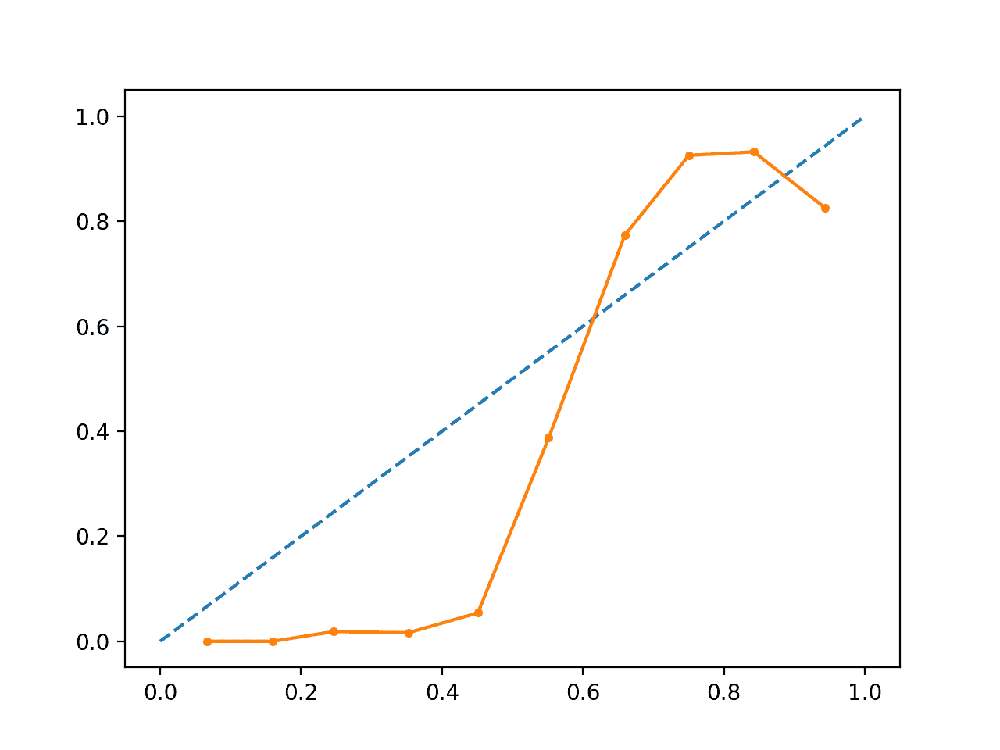
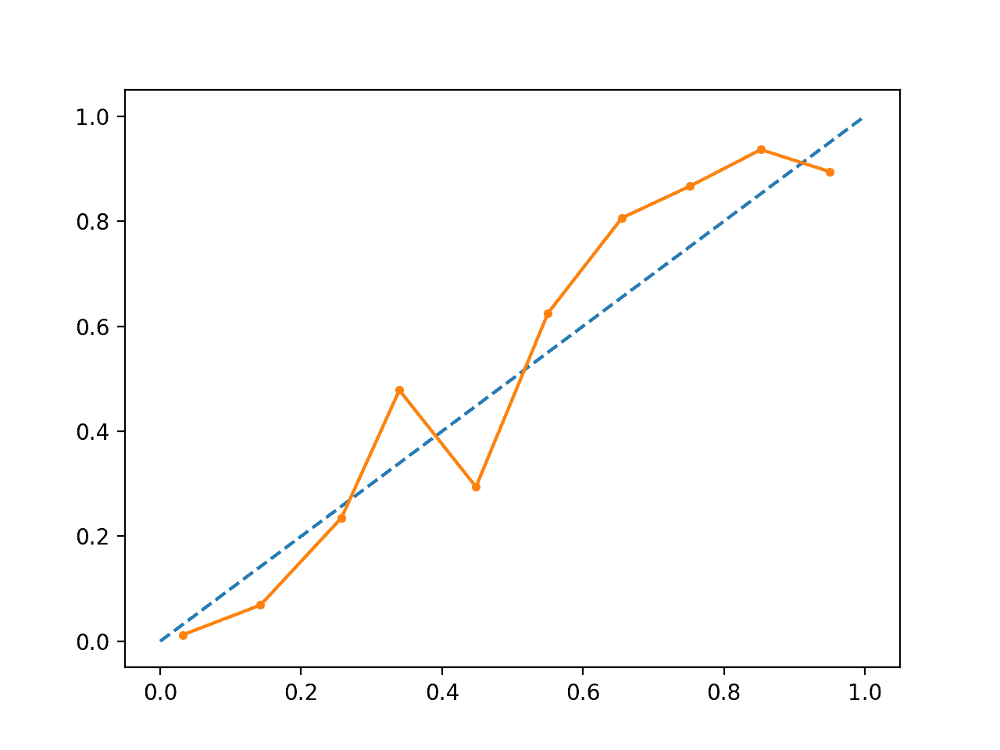
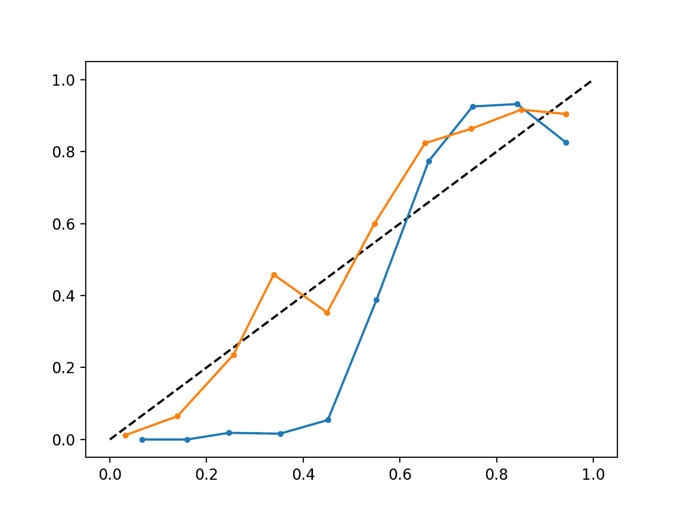

# 如何以及何时使用带有 scikit-learn 的校准分类模型

> 原文： [https://machinelearningmastery.com/calibrated-classification-model-in-scikit-learn/](https://machinelearningmastery.com/calibrated-classification-model-in-scikit-learn/)

不是直接为分类问题预测类值，而是可以方便地预测观察属于每个可能类别的概率。

预测概率允许一些灵活性，包括决定如何解释概率，呈现具有不确定性的预测，以及提供更细致的方式来评估模型的技能。

与每个类的概率的预期分布匹配的预测概率被称为校准的。问题是，并非所有机器学习模型都能够预测校准概率。

有一些方法既可以诊断校准的预测概率，又可以用观察到的每个类别的分布来更好地校准预测的概率。通常，这可以导致更好的质量预测，具体取决于如何评估模型的技能。

在本教程中，您将发现校准预测概率的重要性，以及如何诊断和改进用于概率分类的模型的校准。

完成本教程后，您将了解：

*   非线性机器学习算法通常预测未校准的类概率。
*   可靠性图可用于诊断模型的校准，并且可以使用方法来更好地校准问题的预测。
*   如何使用 scikit-learn 在 Python 中开发可靠性图并校准分类模型。

让我们开始吧。


如何以及何时使用带有 scikit-learn
照片的校准分类模型 [Nigel Howe](https://www.flickr.com/photos/legin101/6237221367/) ，保留一些权利。

## 教程概述

本教程分为四个部分;他们是：

1.  预测概率
2.  预测校准
3.  如何在 Python 中校准概率
4.  工作的校准 SVM 概率的示例

## 预测概率

分类预测建模问题需要预测或预测给定观察的标签。

作为直接预测标签的替代方案，模型可以预测观察属于每个可能的类别标签的概率。

这为解释和呈现预测的方式（阈值和预测不确定性的选择）以及评估模型的方式提供了一些灵活性。

尽管模型可能能够预测概率，但概率的分布和行为可能与训练数据中观察到的概率的预期分布不匹配。

这对于复杂的非线性机器学习算法尤其常见，这些算法不直接进行概率预测，而是使用近似。

可以调整概率的分布以更好地匹配在数据中观察到的预期分布。该调整被称为校准，如在模型的校准或类概率的分布的校准中。

> [...]我们希望估计的类概率反映样本的真实潜在概率。也就是说，需要对预测的类概率（或类似概率值）进行良好校准。为了进行良好校准，概率必须有效地反映感兴趣事件的真实可能性。

- 第 249 页， [Applied Predictive Modeling](https://amzn.to/2kXE35G) ，2013。

## 预测校准

校准概率有两个问题;他们正在诊断预测概率的校准和校准过程本身。

### 可靠性图（校准曲线）

可靠性图是观察到的相对频率（y 轴）与预测概率频率（x 轴）的线图。

> 可靠性图是用于说明概率预测系统属性的常用辅助工具。它们包括观察到的相对频率与预测概率的关系图，在调整概率预报系统时提供快速的可视比对，以及记录最终产品的表现

- [提高可靠性图的可靠性](https://journals.ametsoc.org/doi/abs/10.1175/WAF993.1)，2007。

具体地，预测概率沿 x 轴被划分为固定数量的桶。然后对每个箱计数事件数（等级= 1）（例如相对观察频率）。最后，计数被标准化。然后将结果绘制成线图。

这些图在预测文献中通常被称为“_ 可靠性 _”图，尽管也可称为“_ 校准 _”图或曲线，因为它们总结了预测概率的校准程度。

校准越好校准或越可靠，点将从图的左下角到右上角沿着主对角线出现越近。

点或曲线相对于对角线的位置有助于解释概率;例如：

*   **在对角线**下方：模型过度预测;概率太大了。
*   **在对角线**上方：该模型预测不足;概率太小。

根据定义，概率是连续的，因此我们期望与线分离，通常显示为 S 形曲线，显示过度预测低概率和低预测高概率的悲观倾向。

> 可靠性图提供诊断以检查预测值 Xi 是否可靠。粗略地说，如果事件实际发生时观察到的相对频率与预测值一致，则概率预测是可靠的。

— [Increasing the Reliability of Reliability Diagrams](https://journals.ametsoc.org/doi/abs/10.1175/WAF993.1), 2007.

可靠性图有助于理解来自不同预测模型的预测的相对校准。

### 概率校准

可以校准预测模型所做的预测。

校准的预测可能（或可能不）导致可靠性图上的校准改进。

一些算法以这样的方式拟合，即它们的预测概率已经被校准。没有详细说明为什么，逻辑回归就是这样一个例子。

其他算法不直接产生概率的预测，而是必须近似概率预测。一些示例包括神经网络，支持向量机和决策树。

来自这些方法的预测概率可能未经校准，并且可能通过校准进行修改而受益。

预测概率的校准是在通过预测模型进行预测之后应用的重新缩放操作。

校准概率有两种流行的方法;它们是 Platt Scaling 和 Isotonic Regression。

Platt Scaling 更简单，适用于 S 形可靠性图表。等压回归更复杂，需要更多数据（否则可能过度拟合），但可以支持不同形状的可靠性图（非参数）。

> 当预测概率的失真为 S 形时，Platt Scaling 最有效。等渗回归是一种更强大的校准方法，可以纠正任何单调失真。不幸的是，这种额外的功率是有代价的。学习曲线分析表明，当数据稀缺时，等渗回归更容易过度拟合，因此表现比 Platt Scaling 更差。

- [通过监督学习](https://www.cs.cornell.edu/~alexn/papers/calibration.icml05.crc.rev3.pdf)预测良好概率，2005 年。

**注意，这非常重要**：更好的校准概率可能会也可能不会导致更好的基于类别或基于概率的预测。它实际上取决于用于评估预测的特定指标。

实际上，一些实证结果表明，可以从校准预测概率中获益的算法包括 SVM，袋装决策树和随机森林。

> [...]校准后，最好的方法是增强树，随机森林和 SVM。

— [Predicting Good Probabilities With Supervised Learning](https://www.cs.cornell.edu/~alexn/papers/calibration.icml05.crc.rev3.pdf), 2005.

## 如何在 Python 中校准概率

scikit-learn 机器学习库允许您诊断分类器的概率校准并校准可预测概率的分类器。

### 诊断校准

您可以通过创建实际概率与测试集上预测概率的可靠性图来诊断分类器的校准。

在 scikit-learn 中，这称为校准曲线。

这可以通过首先计算 [calibration_curve（）函数](http://scikit-learn.org/stable/modules/generated/sklearn.calibration.calibration_curve.html)来实现。此函数采用数据集的真实类值和主类的预测概率（class = 1）。该函数返回每个 bin 的真实概率和每个 bin 的预测概率。可以通过`n_bins`参数指定箱数，默认为 5。

例如，下面是显示 API 使用情况的代码段：

```
...
# predict probabilities
probs = model.predic_proba(testX)[:,1]
# reliability diagram
fop, mpv = calibration_curve(testy, probs, n_bins=10)
# plot perfectly calibrated
pyplot.plot([0, 1], [0, 1], linestyle='--')
# plot model reliability
pyplot.plot(mpv, fop, marker='.')
pyplot.show()
```

### 校准分类器

可以使用 [CalibratedClassifierCV](http://scikit-learn.org/stable/modules/generated/sklearn.calibration.CalibratedClassifierCV.html) 类在 scikit-learn 中校准分类器。

有两种方法可以使用此类：prefit 和交叉验证。

您可以在训练数据集上拟合模型，并使用保持验证数据集校准此预装模型。

For example, below is a code snippet showing the API usage:

```
...
# prepare data
trainX, trainy = ...
valX, valy = ...
testX, testy = ...
# fit base model on training dataset
model = ...
model.fit(trainX, trainy)
# calibrate model on validation data
calibrator = CalibratedClassifierCV(model, cv='prefit')
calibrator.fit(valX, valy)
# evaluate the model
yhat = calibrator.predict(testX)
```

或者，CalibratedClassifierCV 可以使用 k 折交叉验证拟合模型的多个副本，并使用保持集校准这些模型预测的概率。使用每个训练模型进行预测。

For example, below is a code snippet showing the API usage:

```
...
# prepare data
trainX, trainy = ...
testX, testy = ...
# define base model
model = ...
# fit and calibrate model on training data
calibrator = CalibratedClassifierCV(model, cv=3)
calibrator.fit(trainX, trainy)
# evaluate the model
yhat = calibrator.predict(testX)
```

CalibratedClassifierCV 类支持两种类型的概率校准;具体而言，参数'`sigmoid`'方法（Platt 方法）和非参数'_ 等渗 _'方法可以通过'_ 方法 _'参数指定。

## 工作的校准 SVM 概率的示例

我们可以通过一些实例来讨论校准混凝土。

在这些示例中，我们将支持向量机（SVM）拟合到噪声二元分类问题并使用该模型来预测概率，然后使用可靠性图检查校准并校准分类器并查看结果。

SVM 是一个很好的候选校准模型，因为它本身不能预测概率，这意味着概率通常是未经校准的。

**关于 SVM** 的注释：可以通过在拟合模型上调用`decision_function()`函数而不是通常的`predict_proba()`函数来预测概率。概率不是标准化的，但可以通过将'`normalize`'参数设置为'`True`'来调用`calibration_curve()`函数时进行归一化。

以下示例拟合测试问题的 SVM 模型，预测概率，并将概率的校准绘制为可靠性图，

```
# SVM reliability diagram
from sklearn.datasets import make_classification
from sklearn.svm import SVC
from sklearn.model_selection import train_test_split
from sklearn.calibration import calibration_curve
from matplotlib import pyplot
# generate 2 class dataset
X, y = make_classification(n_samples=1000, n_classes=2, weights=[1,1], random_state=1)
# split into train/test sets
trainX, testX, trainy, testy = train_test_split(X, y, test_size=0.5, random_state=2)
# fit a model
model = SVC()
model.fit(trainX, trainy)
# predict probabilities
probs = model.decision_function(testX)
# reliability diagram
fop, mpv = calibration_curve(testy, probs, n_bins=10, normalize=True)
# plot perfectly calibrated
pyplot.plot([0, 1], [0, 1], linestyle='--')
# plot model reliability
pyplot.plot(mpv, fop, marker='.')
pyplot.show()
```

运行该示例创建了一个可靠性图表，显示了 SVM 预测概率的校准（实线）与沿着图的对角线的完美校准模型（虚线）的比较。

我们可以看到保守预测的预期 S 形曲线。



未校准的 SVM 可靠性图

我们可以使用 5 次交叉验证更新示例以通过 CalibratedClassifierCV 类适合 SVM，使用保持集来校准预测概率。

下面列出了完整的示例。

```
# SVM reliability diagram with calibration
from sklearn.datasets import make_classification
from sklearn.svm import SVC
from sklearn.calibration import CalibratedClassifierCV
from sklearn.model_selection import train_test_split
from sklearn.calibration import calibration_curve
from matplotlib import pyplot
# generate 2 class dataset
X, y = make_classification(n_samples=1000, n_classes=2, weights=[1,1], random_state=1)
# split into train/test sets
trainX, testX, trainy, testy = train_test_split(X, y, test_size=0.5, random_state=2)
# fit a model
model = SVC()
calibrated = CalibratedClassifierCV(model, method='sigmoid', cv=5)
calibrated.fit(trainX, trainy)
# predict probabilities
probs = calibrated.predict_proba(testX)[:, 1]
# reliability diagram
fop, mpv = calibration_curve(testy, probs, n_bins=10, normalize=True)
# plot perfectly calibrated
pyplot.plot([0, 1], [0, 1], linestyle='--')
# plot calibrated reliability
pyplot.plot(mpv, fop, marker='.')
pyplot.show()
```

运行该示例为校准概率创建可靠性图。

校准概率的形状是不同的，更好地拥抱对角线，尽管在上象限仍然低于预测。

从视觉上看，该图表显示了更好的校准模型。



校准的 SVM 可靠性图

通过在同一图上包含两个可靠性图，我们可以使两个模型之间的对比更加明显。

The complete example is listed below.

```
# SVM reliability diagrams with uncalibrated and calibrated probabilities
from sklearn.datasets import make_classification
from sklearn.svm import SVC
from sklearn.calibration import CalibratedClassifierCV
from sklearn.model_selection import train_test_split
from sklearn.calibration import calibration_curve
from matplotlib import pyplot

# predict uncalibrated probabilities
def uncalibrated(trainX, testX, trainy):
	# fit a model
	model = SVC()
	model.fit(trainX, trainy)
	# predict probabilities
	return model.decision_function(testX)

# predict calibrated probabilities
def calibrated(trainX, testX, trainy):
	# define model
	model = SVC()
	# define and fit calibration model
	calibrated = CalibratedClassifierCV(model, method='sigmoid', cv=5)
	calibrated.fit(trainX, trainy)
	# predict probabilities
	return calibrated.predict_proba(testX)[:, 1]

# generate 2 class dataset
X, y = make_classification(n_samples=1000, n_classes=2, weights=[1,1], random_state=1)
# split into train/test sets
trainX, testX, trainy, testy = train_test_split(X, y, test_size=0.5, random_state=2)
# uncalibrated predictions
yhat_uncalibrated = uncalibrated(trainX, testX, trainy)
# calibrated predictions
yhat_calibrated = calibrated(trainX, testX, trainy)
# reliability diagrams
fop_uncalibrated, mpv_uncalibrated = calibration_curve(testy, yhat_uncalibrated, n_bins=10, normalize=True)
fop_calibrated, mpv_calibrated = calibration_curve(testy, yhat_calibrated, n_bins=10)
# plot perfectly calibrated
pyplot.plot([0, 1], [0, 1], linestyle='--', color='black')
# plot model reliabilities
pyplot.plot(mpv_uncalibrated, fop_uncalibrated, marker='.')
pyplot.plot(mpv_calibrated, fop_calibrated, marker='.')
pyplot.show()
```

运行该示例将创建一个单一的可靠性图表，显示校准（橙色）和未校准（蓝色）概率。

由于校准模型所做的预测实际上是五个子模型的组合，因此并不是真正的苹果对苹果比较。

尽管如此，我们确实看到校准概率的可靠性存在显着差异（很可能是由校准过程引起的）。



校准和未校准的 SVM 可靠性图

## 进一步阅读

如果您希望深入了解，本节将提供有关该主题的更多资源。

### 书籍和论文

*   [Applied Predictive Modeling](https://amzn.to/2kXE35G) ，2013。
*   [通过监督学习](https://www.cs.cornell.edu/~alexn/papers/calibration.icml05.crc.rev3.pdf)预测良好概率，2005 年。
*   [从决策树和朴素贝叶斯分类器](http://cseweb.ucsd.edu/~elkan/calibrated.pdf)获得校准概率估计[2001]。
*   [提高可靠性图的可靠性](https://journals.ametsoc.org/doi/abs/10.1175/WAF993.1)，2007。

### API

*   [sklearn.calibration.CalibratedClassifierCV API](http://scikit-learn.org/stable/modules/generated/sklearn.calibration.CalibratedClassifierCV.html)
*   [sklearn.calibration.calibration_curve API](http://scikit-learn.org/stable/modules/generated/sklearn.calibration.calibration_curve.html#sklearn.calibration.calibration_curve)
*   [概率校准，scikit-learn 用户指南](http://scikit-learn.org/stable/modules/calibration.html)
*   [概率校准曲线，scikit-learn](http://scikit-learn.org/stable/auto_examples/calibration/plot_calibration_curve.html)
*   [分类器校准比较，scikit-learn](http://scikit-learn.org/stable/auto_examples/calibration/plot_compare_calibration.html)

### 用品

*   [CAWCAR 验证网站](http://www.cawcr.gov.au/projects/verification/)
*   维基百科上的[校准（统计）](https://en.wikipedia.org/wiki/Calibration_(statistics))
*   [维基百科上的概率分类](https://en.wikipedia.org/wiki/Probabilistic_classification)
*   [Scikit 在 CrossValidated](https://stats.stackexchange.com/questions/263393/scikit-correct-way-to-calibrate-classifiers-with-calibratedclassifiercv) 上使用 CalibratedClassifierCV 校准分类器的正确方法

## 摘要

在本教程中，您发现了校准预测概率以及如何诊断和改进用于概率分类的模型校准的重要性。

具体来说，你学到了：

*   非线性机器学习算法通常预测未校准的类概率。
*   可靠性图可用于诊断模型的校准，并且可以使用方法来更好地校准问题的预测。
*   如何使用 scikit-learn 在 Python 中开发可靠性图并校准分类模型。

你有任何问题吗？
在下面的评论中提出您的问题，我会尽力回答。