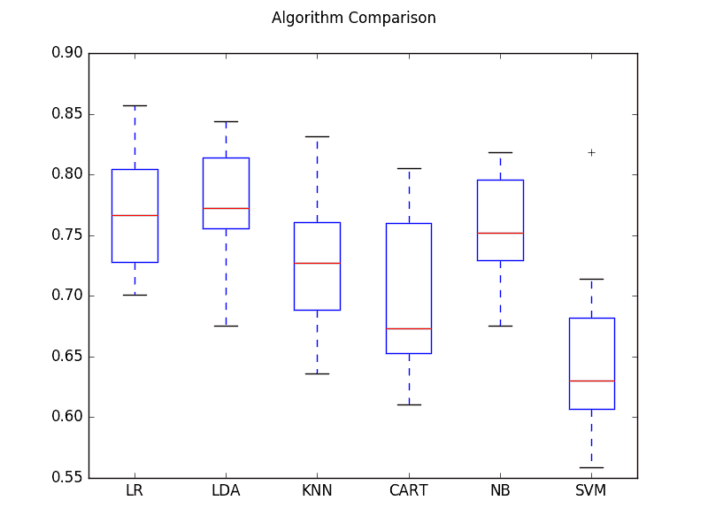

# 如何比较 Python 中的机器学习算法与 scikit-learn

> 原文： [https://machinelearningmastery.com/compare-machine-learning-algorithms-python-scikit-learn/](https://machinelearningmastery.com/compare-machine-learning-algorithms-python-scikit-learn/)

重要的是要一致地比较多种不同机器学习算法的表现。

在这篇文章中，您将了解如何创建测试工具来比较 Python 中的多种不同的机器学习算法和 scikit-learn。

您可以将此测试工具用作您自己的机器学习问题的模板，并添加更多不同的算法进行比较。

让我们开始吧。

*   **更新 March / 2018** ：添加了备用链接以下载数据集，因为原始图像已被删除。


如何比较 Python 中的机器学习算法与 scikit-learn
照片由 [Michael Knight](https://www.flickr.com/photos/mknightphoto/2295688304/) ，保留一些权利。

## 选择最佳机器学习模型

您如何为您的问题选择最佳型号？

当您从事机器学习项目时，通常会有多种好的模型可供选择。每种型号都有不同的表现特征。

使用交叉验证等重采样方法，您可以估算出每个模型对未见数据的准确程度。您需要能够使用这些估计值从您创建的模型套件中选择一个或两个最佳模型。

### 仔细比较机器学习模型

当您拥有新数据集时，最好使用不同的技术可视化数据，以便从不同的角度查看数据。

同样的想法适用于模型选择。您应该使用多种不同的方式来查看机器学习算法的估计精度，以便选择一个或两个来完成。

一种方法是使用不同的可视化方法来显示模型准确率分布的平均精度，方差和其他属性。

在下一节中，您将了解如何使用 scikit-learn 在 Python 中完成此操作。

## 一致地比较机器学习算法

公平比较机器学习算法的关键是确保在相同数据上以相同的方式评估每个算法。

您可以通过强制在一致的测试工具上评估每个算法来实现此目的。

在下面的示例中，比较了 6 种不同的算法：

1.  逻辑回归
2.  线性判别分析
3.  K-Nearest Neighbors
4.  分类和回归树
5.  朴素贝叶斯
6.  支持向量机

问题是来自 UCI 机器学习库的标准二分类数据集，称为 [Pima 印第安人糖尿病](https://archive.ics.uci.edu/ml/datasets/Pima+Indians+Diabetes)问题[更新：[从这里下载](https://raw.githubusercontent.com/jbrownlee/Datasets/master/pima-indians-diabetes.data.csv)）。该问题有两个类和八个不同比例的数字输入变量。

10 倍交叉验证程序用于评估每个算法，重要的是使用相同的随机种子配置，以确保执行与训练数据相同的分割，并且以完全相同的方式评估每个算法。

每个算法都有一个简短的名称，用于以后总结结果。

```
# Compare Algorithms
import pandas
import matplotlib.pyplot as plt
from sklearn import model_selection
from sklearn.linear_model import LogisticRegression
from sklearn.tree import DecisionTreeClassifier
from sklearn.neighbors import KNeighborsClassifier
from sklearn.discriminant_analysis import LinearDiscriminantAnalysis
from sklearn.naive_bayes import GaussianNB
from sklearn.svm import SVC
# load dataset
url = "https://raw.githubusercontent.com/jbrownlee/Datasets/master/pima-indians-diabetes.data.csv"
names = ['preg', 'plas', 'pres', 'skin', 'test', 'mass', 'pedi', 'age', 'class']
dataframe = pandas.read_csv(url, names=names)
array = dataframe.values
X = array[:,0:8]
Y = array[:,8]
# prepare configuration for cross validation test harness
seed = 7
# prepare models
models = []
models.append(('LR', LogisticRegression()))
models.append(('LDA', LinearDiscriminantAnalysis()))
models.append(('KNN', KNeighborsClassifier()))
models.append(('CART', DecisionTreeClassifier()))
models.append(('NB', GaussianNB()))
models.append(('SVM', SVC()))
# evaluate each model in turn
results = []
names = []
scoring = 'accuracy'
for name, model in models:
	kfold = model_selection.KFold(n_splits=10, random_state=seed)
	cv_results = model_selection.cross_val_score(model, X, Y, cv=kfold, scoring=scoring)
	results.append(cv_results)
	names.append(name)
	msg = "%s: %f (%f)" % (name, cv_results.mean(), cv_results.std())
	print(msg)
# boxplot algorithm comparison
fig = plt.figure()
fig.suptitle('Algorithm Comparison')
ax = fig.add_subplot(111)
plt.boxplot(results)
ax.set_xticklabels(names)
plt.show()
```

运行该示例提供了每个算法短名称，平均准确度和标准偏差准确度的列表。

```
LR: 0.769515 (0.048411)
LDA: 0.773462 (0.051592)
KNN: 0.726555 (0.061821)
CART: 0.695232 (0.062517)
NB: 0.755178 (0.042766)
SVM: 0.651025 (0.072141)
```

该示例还提供了框和须状图，显示了每个算法的每个交叉验证折叠的准确度分数的分布。



比较机器学习算法

从这些结果可以看出，逻辑回归和线性判别分析都可能值得进一步研究这个问题。

## 摘要

在这篇文章中，您发现了如何使用 scikit-learn 在 Python 中的数据集上评估多个不同的机器学习算法。

您学习了如何使用相同的测试工具来评估算法，以及如何使用数字和使用盒子和须状图来汇总结果。

您可以使用此秘籍作为模板来评估您自己问题的多种算法。

您对在 Python 中评估机器学习算法或关于此帖子有任何疑问吗？在下面的评论中提出您的问题，我会尽力回答。