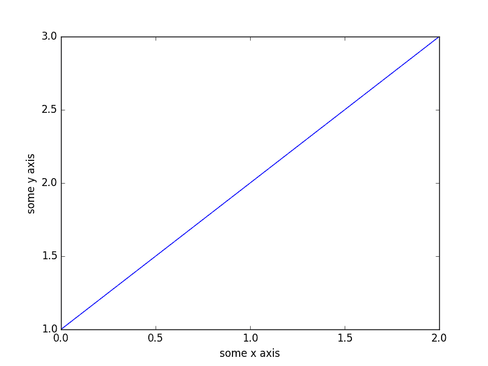
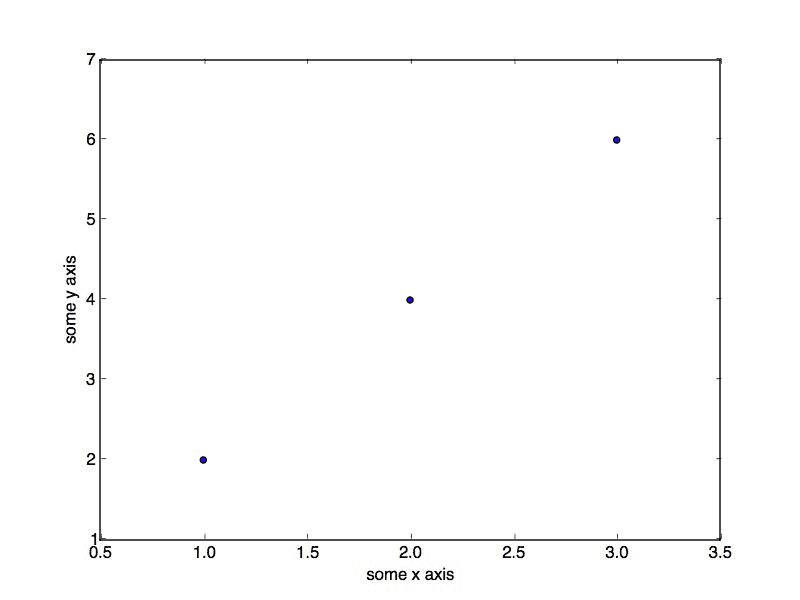

# 使用于机器学习开发人员的 Python 崩溃课程

> 原文： [https://machinelearningmastery.com/crash-course-python-machine-learning-developers/](https://machinelearningmastery.com/crash-course-python-machine-learning-developers/)

您不需要成为 Python 开发人员就可以开始使用 Python 生态系统进行机器学习。

作为一名已经知道如何使用一种或多种编程语言编程的开发人员，您可以非常快速地选择像 Python 这样的新语言。您只需要了解该语言的一些属性即可将您已知的语言转换为新语言。

在这篇文章中，您将获得 Python 的速成课程以及机器学习所需的核心库。即：NumPy，MatPlotLib 和 Pandas。

这将是足够的信息，可以帮助您阅读和理解机器学习的代码 Python 代码示例，并开始开发自己的脚本。如果你已经知道一点 Python，这篇文章将是一个友好的提醒。

让我们开始吧。

*   **2017 年 3 月更新**：更新了所有可用于 Python 2 和 Python 3 的打印语句。


用于机器学习开发人员的 Python 崩溃课程
摄影： [John Clouston](https://www.flickr.com/photos/58017169@N06/5353030024/) ，保留一些权利。

## Python 速成课程

在 Python 入门时，您需要了解有关语言语法的一些关键细节，以便能够阅读和理解 Python 代码。这包括：

*   分配
*   流量控制
*   数据结构
*   功能

我们将依次使用您可以键入和运行的小型独立示例来介绍这些主题。

请记住，whitespace 在 Python 中具有意义。

### 分配

作为一名程序员，作业和类型不应该让您感到惊讶。

#### 字符串

```
# Strings
data = 'hello world'
print(data[0])
print(len(data))
print(data)
```

运行示例打印：

```
h
11
hello world
```

#### 数字

```
# Numbers
value = 123.1
print(value)
value = 10
print(value)
```

Running the example prints:

```
123.1
10
```

#### 布尔

```
# Boolean
a = True
b = False
print(a, b)
```

Running the example prints:

```
(True, False)
```

#### 多次分配

```
# Multiple Assignment
a, b, c = 1, 2, 3
print(a, b, c)
```

Running the example prints:

```
(1, 2, 3)
```

#### 没有价值

```
# No value
a = None
print(a)
```

Running the example prints:

```
None
```

### 流量控制

您需要学习三种主要类型的流控制：If-Then-Else 条件，For-Loops 和 While-Loops。

#### If-Then-Else 条件示例

```
value = 99
if value >= 99:
	print('That is fast')
elif value > 200:
	print('That is too fast')
else:
	print('That that is safe')
```

运行此示例打印：

```
That is fast
```

#### For-Loop 示例

```
# For-Loop
for i in range(10):
	print(i)
```

Running this example prints:

```
0
1
2
3
4
5
6
7
8
9
```

#### While-Loop 示例

```
# While-Loop
i = 0
while i < 10:
	print(i)
	i += 1
```

Running this example prints:

```
0
1
2
3
4
5
6
7
8
9
```

### 数据结构

Python 中有三种数据结构，您会发现它们使用最多且最有用。它们是元组，列表和词典。

#### 元组示例

元组是项目的只读集合。

```
a = (1, 2, 3)
print(a)
```

Running the example prints:

```
(1, 2, 3)
```

#### 列表示例

列表使用方括号表示法，可以使用数组表示法进行索引。

```
mylist = [1, 2, 3]
print("Zeroth Value: %d" % mylist[0])
mylist.append(4)
print("List Length: %d" % len(mylist))
for value in mylist:
	print(value)
```

Running the example prints:

```
Zeroth Value: 1
List Length: 4
1
2
3
4
```

#### 字典示例

字典是名称与值的映射，如地图。请注意使用花括号表示法。

```
mydict = {'a': 1, 'b': 2, 'c': 3}
print("A value: %d" % mydict['a'])
mydict['a'] = 11
print("A value: %d" % mydict['a'])
print("Keys: %s" % mydict.keys())
print("Values: %s" % mydict.values())
for key in mydict.keys():
	print(mydict[key])
```

Running the example prints:

```
A value: 1
A value: 11
Keys: ['a', 'c', 'b']
Values: [11, 3, 2]
11
3
2
```

### 功能

Python 的最大问题是空白。确保缩进代码后有一个空的新行。

下面的示例定义了一个新函数来计算两个值的总和，并使用两个参数调用该函数。

```
# Sum function
def mysum(x, y):
	return x + y

# Test sum function
print(mysum(1, 3))
```

Running the example prints:

```
4
```

## NumPy 速成课程

NumPy 为 SciPy 提供基础数据结构和操作。这些是有效定义和操作的数组（ndarrays）。

### 创建阵列

```
# define an array
import numpy
mylist = [1, 2, 3]
myarray = numpy.array(mylist)
print(myarray)
print(myarray.shape)
```

Running the example prints:

```
[1 2 3]
(3,)
```

### 访问数据

数组表示法和范围可用于有效地访问 NumPy 数组中的数据。

```
# access values
import numpy
mylist = [[1, 2, 3], [3, 4, 5]]
myarray = numpy.array(mylist)
print(myarray)
print(myarray.shape)
print("First row: %s" % myarray[0])
print("Last row: %s" % myarray[-1])
print("Specific row and col: %s" % myarray[0, 2])
print("Whole col: %s" % myarray[:, 2])
```

Running the example prints:

```
[[1 2 3]
 [3 4 5]]
(2, 3)
First row: [1 2 3]
Last row: [3 4 5]
Specific row and col: 3
Whole col: [3 5]
```

### 算术

NumPy 数组可以直接用于算术运算。

```
# arithmetic
import numpy
myarray1 = numpy.array([2, 2, 2])
myarray2 = numpy.array([3, 3, 3])
print("Addition: %s" % (myarray1 + myarray2))
print("Multiplication: %s" % (myarray1 * myarray2))
```

Running the example prints:

```
Addition: [5 5 5]
Multiplication: [6 6 6]
```

NumPy 数组还有很多，但这些例子可以让您了解它们在处理大量数值数据时所提供的效率。

## Matplotlib 速成课程

Matplotlib 可用于创建图表和图表。

该库通常使用如下：

1.  使用一些数据调用绘图函数（例如 plot（））。
2.  调用许多函数来设置绘图的属性（例如标签和颜色）。
3.  使图可见（例如 show（））。

### 线图

下面的示例从一维数据创建一个简单的线图。

```
# basic line plot
import matplotlib.pyplot as plt
import numpy
myarray = numpy.array([1, 2, 3])
plt.plot(myarray)
plt.xlabel('some x axis')
plt.ylabel('some y axis')
plt.show()
```

运行该示例会产生：



Matplotlib 中的简单线图

### 散点图

下面是从二维数据创建散点图的简单示例。

```
# basic scatter plot
import matplotlib.pyplot as plt
import numpy
x = numpy.array([1, 2, 3])
y = numpy.array([2, 4, 6])
plt.scatter(x,y)
plt.xlabel('some x axis')
plt.ylabel('some y axis')
plt.show()
```

Running the example produces:



Matplotlib 中的简单散点图

还有更多的绘图类型和更多可以在绘图上设置的属性来配置它。

## 熊猫速成课程

Pandas 提供数据结构和功能，以快速操作和分析数据。理解 Pandas 机器学习的关键是理解 Series 和 DataFrame 数据结构。

### 系列

系列是一维数组，其中可以标记行和列。

```
# series
import numpy
import pandas
myarray = numpy.array([1, 2, 3])
rownames = ['a', 'b', 'c']
myseries = pandas.Series(myarray, index=rownames)
print(myseries)
```

Running the example prints:

```
a    1
b    2
c    3
```

您可以像 NumPy 数组一样访问数据，例如字典，例如：

```
print(myseries[0])
print(myseries['a'])
```

Running the example prints:

```
1
1
```

### 数据帧

数据帧是多维数组，其中可以标记行和列。

```
# dataframe
import numpy
import pandas
myarray = numpy.array([[1, 2, 3], [4, 5, 6]])
rownames = ['a', 'b']
colnames = ['one', 'two', 'three']
mydataframe = pandas.DataFrame(myarray, index=rownames, columns=colnames)
print(mydataframe)
```

Running the example prints:

```
   one  two  three
a    1    2      3
b    4    5      6
```

数据可以使用列名称进行索引。

```
print("one column: %s" % mydataframe['one'])
print("one column: %s" % mydataframe.one)
```

Running the example prints:

```
one column: a    1
b    4

one column: a    1
b    4
```

## 摘要

你已经在这篇文章中介绍了很多内容。您发现了 Python 的基本语法和用法以及用于机器学习的四个关键 Python 库：

*   NumPy 的
*   Matplotlib
*   熊猫

您现在已经掌握了足够的语法和用法信息，可以阅读和理解用于机器学习的 Python 代码并开始创建自己的脚本。

您对本文中的示例有任何疑问吗？在评论中提出您的问题，我会尽力回答。