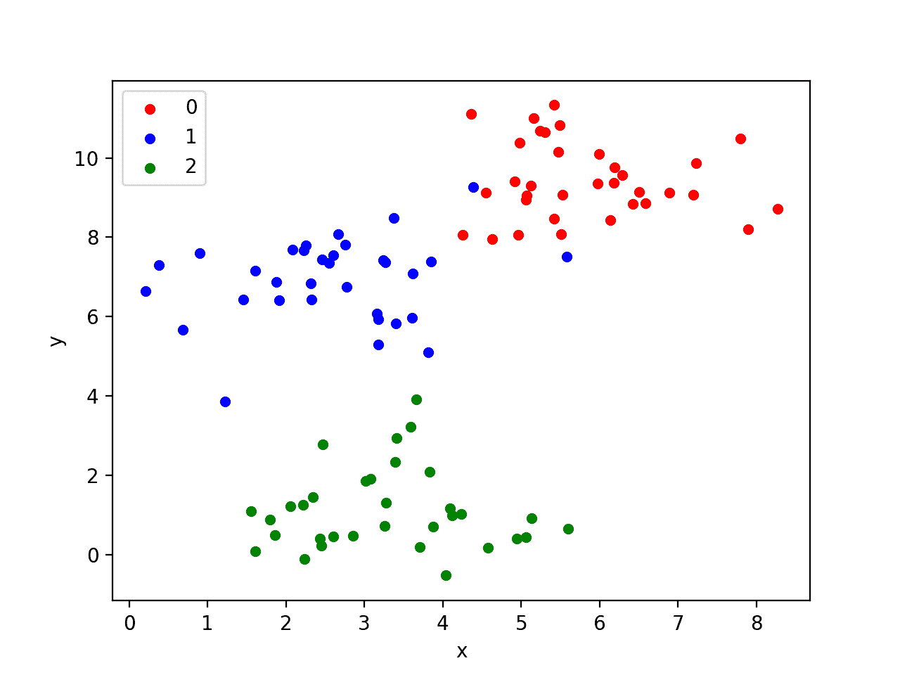
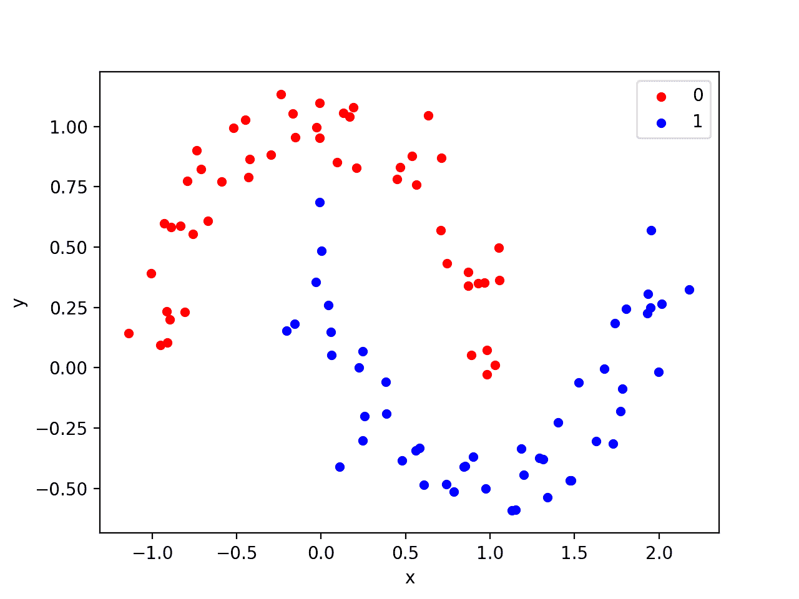
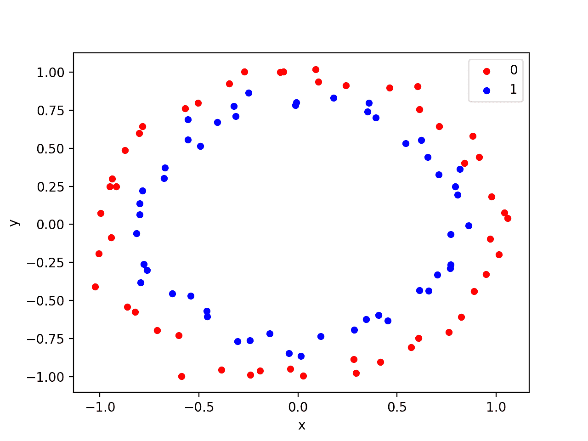
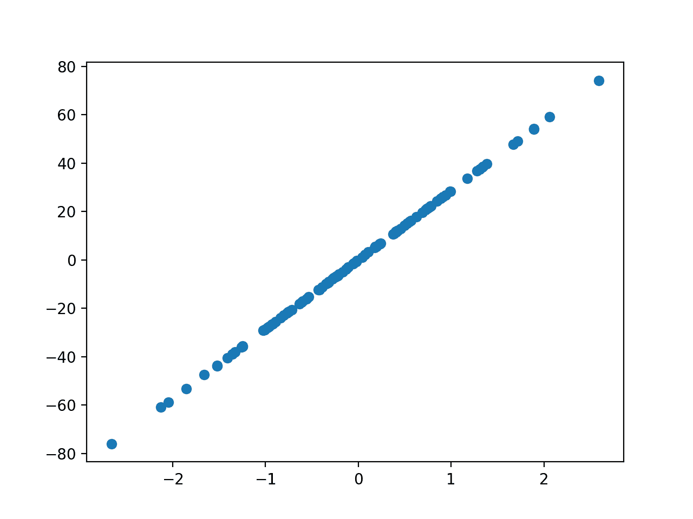

# 如何使用 scikit-learn 在 Python 中生成测试数据集

> 原文： [https://machinelearningmastery.com/generate-test-datasets-python-scikit-learn/](https://machinelearningmastery.com/generate-test-datasets-python-scikit-learn/)

测试数据集是一些小型设计数据集，可用于测试机器学习算法或测试工具。

来自测试数据集的数据具有明确定义的属性，例如线性或非线性，允许您探索特定的算法行为。 scikit-learn Python 库提供了一套函数，用于从可配置的测试问题生成样本以进行回归和分类。

在本教程中，您将发现测试问题以及如何在 Python 中使用 scikit-learn 来使用它们。

完成本教程后，您将了解：

*   如何生成多分类预测测试问题。
*   如何生成二分类预测测试问题。
*   如何生成线性回归预测测试问题。

让我们开始吧。

## 教程概述

本教程分为 3 个部分;他们是：

1.  测试数据集
2.  分类测试问题
3.  回归测试问题

## 测试数据集

开发和实现机器学习算法时的一个问题是，您如何知道是否已正确实现它们。他们似乎甚至可以使用 bug。

测试数据集是一些小的设计问题，允许您测试和调试算法和测试工具。它们对于更好地理解算法的行为以响应超参数的变化也很有用。

以下是测试数据集的一些理想属性：

*   它们可以快速轻松地生成。
*   它们包含“已知”或“理解”结果，用于与预测进行比较。
*   它们是随机的，每次生成时都允许对同一问题进行随机变化。
*   它们很小，很容易在两个维度上可视化。
*   它们可以轻松扩大规模。

我建议在开始使用新的机器学习算法时或在开发新的测试工具时使用测试数据集。

scikit-learn 是一个用于机器学习的 Python 库，它提供了生成一系列测试问题的函数。

在本教程中，我们将介绍为分类和回归算法生成测试问题的一些示例。

## 分类测试问题

分类是为观察分配标签的问题。

在本节中，我们将讨论三个分类问题：blob，moons 和 circle。

### Blob 分类问题

[make_blobs（）](http://scikit-learn.org/stable/modules/generated/sklearn.datasets.make_blobs.html)函数可用于生成具有高斯分布的点的斑点。

您可以控制要生成的 Blob 数量以及要生成的样本数量，以及许多其他属性。

考虑到斑点的线性可分离性，该问题适用于线性分类问题。

下面的示例生成具有三个 blob 的样本的 2D 数据集作为多分类预测问题。每个观察有两个输入和 0,1 或 2 个类值。

```
# generate 2d classification dataset
X, y = make_blobs(n_samples=100, centers=3, n_features=2)
```

下面列出了完整的示例。

```
from sklearn.datasets.samples_generator import make_blobs
from matplotlib import pyplot
from pandas import DataFrame
# generate 2d classification dataset
X, y = make_blobs(n_samples=100, centers=3, n_features=2)
# scatter plot, dots colored by class value
df = DataFrame(dict(x=X[:,0], y=X[:,1], label=y))
colors = {0:'red', 1:'blue', 2:'green'}
fig, ax = pyplot.subplots()
grouped = df.groupby('label')
for key, group in grouped:
    group.plot(ax=ax, kind='scatter', x='x', y='y', label=key, color=colors[key])
pyplot.show()
```

运行该示例会生成问题的输入和输出，然后创建一个方便的 2D 绘图，显示使用不同颜色的不同类的点。

请注意，鉴于问题生成器的随机性，您的特定数据集和结果图将会有所不同。这是一个功能，而不是一个 bug。



Blob 测试分类问题的散点图

我们将在以下示例中使用相同的示例结构。

### 卫星分类问题

[make_moons（）函数](http://scikit-learn.org/stable/modules/generated/sklearn.datasets.make_moons.html)用于二分类，并将生成一个漩涡模式或两个卫星。

您可以控制月亮形状的嘈杂程度以及要生成的样本数量。

该测试问题适用于能够学习非线性类边界的算法。

以下示例生成具有中等噪声的月球数据集。

```
# generate 2d classification dataset
X, y = make_moons(n_samples=100, noise=0.1)
```

The complete example is listed below.

```
from sklearn.datasets import make_moons
from matplotlib import pyplot
from pandas import DataFrame
# generate 2d classification dataset
X, y = make_moons(n_samples=100, noise=0.1)
# scatter plot, dots colored by class value
df = DataFrame(dict(x=X[:,0], y=X[:,1], label=y))
colors = {0:'red', 1:'blue'}
fig, ax = pyplot.subplots()
grouped = df.groupby('label')
for key, group in grouped:
    group.plot(ax=ax, kind='scatter', x='x', y='y', label=key, color=colors[key])
pyplot.show()
```

运行该示例生成并绘制数据集以供查看，再次按其指定的类对样本着色。



卫星测试分类问题的散点图

### 圈子分类问题

[make_circles（）函数](http://scikit-learn.org/stable/modules/generated/sklearn.datasets.make_circles.html)生成二分类问题，数据集属于同心圆。

同样，与卫星测试问题一样，您可以控制形状中的噪声量。

该测试问题适用于可以学习复杂非线性流形的算法。

以下示例生成带有一些噪音的圆形数据集。

```
# generate 2d classification dataset
X, y = make_circles(n_samples=100, noise=0.05)
```

The complete example is listed below.

```
from sklearn.datasets import make_circles
from matplotlib import pyplot
from pandas import DataFrame
# generate 2d classification dataset
X, y = make_circles(n_samples=100, noise=0.05)
# scatter plot, dots colored by class value
df = DataFrame(dict(x=X[:,0], y=X[:,1], label=y))
colors = {0:'red', 1:'blue'}
fig, ax = pyplot.subplots()
grouped = df.groupby('label')
for key, group in grouped:
    group.plot(ax=ax, kind='scatter', x='x', y='y', label=key, color=colors[key])
pyplot.show()
```

运行该示例会生成并绘制数据集以供审阅。



圆测试分类问题的散点图

## 回归测试问题

回归是预测给定观察量的问题。

[make_regression（）函数](http://scikit-learn.org/stable/modules/generated/sklearn.datasets.make_regression.html)将创建一个数据集，其输入和输出之间具有线性关系。

您可以配置样本数，输入要素数，噪声级别等。

该数据集适用于可以学习线性回归函数的算法。

下面的示例将生成 100 个示例，其中一个输入功能和一个具有适度噪声的输出功能。

```
# generate regression dataset
X, y = make_regression(n_samples=100, n_features=1, noise=0.1)
```

The complete example is listed below.

```
from sklearn.datasets import make_regression
from matplotlib import pyplot
# generate regression dataset
X, y = make_regression(n_samples=100, n_features=1, noise=0.1)
# plot regression dataset
pyplot.scatter(X,y)
pyplot.show()
```

运行该示例将生成数据并绘制 X 和 y 关系，假设它是线性的，则非常无聊。



回归测试问题的散点图

## 扩展

本节列出了一些扩展您可能希望探索的教程的想法。

*   **比较算法**。选择测试问题并比较一组算法并报告表现。
*   **放大问题**。选择一个测试问题并探索扩展它，使用渐进方法可视化结果，或者探索给定算法的模型技能与问题规模。
*   **其他问题**。该库提供了一系列额外的测试问题;为每个代码编写一个代码示例来演示它们的工作原理。

如果你探索任何这些扩展，我很想知道。

## 进一步阅读

如果您希望深入了解，本节将提供有关该主题的更多资源。

*   [scikit-learn 用户指南：数据集加载实用程序](http://scikit-learn.org/stable/datasets/index.html)
*   [scikit-learn API：sklearn.datasets：数据集](http://scikit-learn.org/stable/modules/classes.html#module-sklearn.datasets)

## 摘要

在本教程中，您发现了测试问题以及如何在 Python 中使用 scikit-learn 来使用它们。

具体来说，你学到了：

*   如何生成多分类预测测试问题。
*   如何生成二分类预测测试问题。
*   如何生成线性回归预测测试问题。

你有任何问题吗？
在下面的评论中提出您的问题，我会尽力回答。