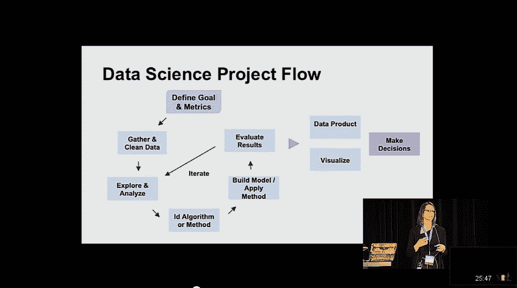

# 如何开始使用 Python 进行机器学习

> 原文： [https://machinelearningmastery.com/how-to-get-started-with-machine-learning-in-python/](https://machinelearningmastery.com/how-to-get-started-with-machine-learning-in-python/)

Python 会议 [PyCon2014](https://us.pycon.org/2014/) 最近举行，会议的视频在线。

我一直在研究有趣的机器学习方法，并将在未来几周内分享一些。

Melanie Warrick 在[如何开始机器学习](http://pyvideo.org/video/2604/how-to-get-started-with-machine-learning)中给出了一个很好的演讲，如果你是从数据科学或机器学习开始的。大约 25 分钟。谈话的摘要是：

> 提供机器学习的介绍，以阐明它是什么，它不是什么以及它如何适应这个关于数据分析和大数据的所有热门话题的图片。

&lt;iframe allowfullscreen="" frameborder="0" height="281" src="https://www.youtube.com/embed/uBorfxosVYs?feature=oembed" width="500"&gt;&lt;/iframe&gt;

Melanie 以机器学习的伟大[定义开始，指向](http://machinelearningmastery.com/what-is-machine-learning/ "What is Machine Learning: A Tour of Authoritative Definitions and a Handy One-Liner You Can Use") [Arthur Samuel](http://en.wikipedia.org/wiki/Arthur_Samuel) ：

> 计算机......没有......明确编程的学习能力

她将机器学习定位为人工智能和数据科学中使用的工具包。相关地，她将大数据描述为超出普通技术捕获和策划能力的数据。这个定义很适合我。虽然讲座是对机器学习的介绍，但重点是机器学习在数据科学中的应用。

Melanie 将四个主要的数据科学角色描述为数据主管，数据创意，数据开发人员和数据研究人员，并使用图表来指示每个角色执行的机器学习量。她还描述了一个数据科学项目工作流程。

Melanie Warrick 的数据科学项目流程。

她使用 [scikit-learn](http://machinelearningmastery.com/a-gentle-introduction-to-scikit-learn-a-python-machine-learning-library/ "A Gentle Introduction to Scikit-Learn: A Python Machine Learning Library") 在 2d 数据集（头部大小与脑重量）上提供了一个可爱的线性回归示例。有用的是，她总结了类别中的 Python 工具：

*   **探索数据**：pandas，statsmodels，matplotlib，numpy，unix
*   **构建模型**：scikit-learn，numpy，pandas，scipy
*   **测试模型**：scikit-learn，matplotlib
*   **数据产品**：API，Flask，Django
*   **可视化**：D3，Matplotplib，vincent 和 vega，ggplot

最后还有一个关于收缩 Python 和 R 的问题，并且她坚持使用一种语言（即 Python），因此您不需要在研究和生产之间更改语言。

在 youtube 和 [pyvideo 档案](http://pyvideo.org/video/2604/how-to-get-started-with-machine-learning)上的谈话是[。您可以查看谈话](https://www.youtube.com/watch?v=uBorfxosVYs)中的[幻灯片，并从 github](https://speakerdeck.com/nyghtowl/how-to-get-started-with-machine-learning) 下载[示例代码。 Melanie 在](https://github.com/nyghtowl/PyCon_2014) [nyghtowl.io](http://nyghtowl.io) 上保留了一个博客，您可以在这里上查看[上的帖子。](http://nyghtowl.io/2014/04/13/pycon-2014-how-to-get-started-with-machine-learning/)