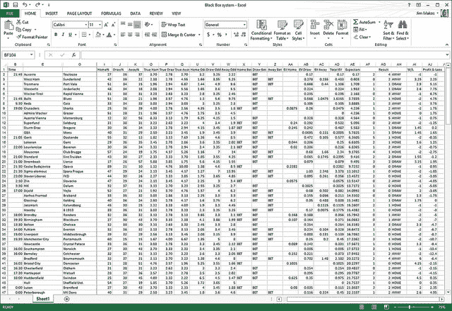

# 如何使用 Scikit-Learn 在 Python 中加载数据

> 原文： [https://machinelearningmastery.com/how-to-load-data-in-python-with-scikit-learn/](https://machinelearningmastery.com/how-to-load-data-in-python-with-scikit-learn/)

在构建机器学习模型之前，需要将数据加载到内存中。

在这篇文章中，您将了解如何使用 [scikit-learn](http://machinelearningmastery.com/a-gentle-introduction-to-scikit-learn-a-python-machine-learning-library/ "A Gentle Introduction to Scikit-Learn: A Python Machine Learning Library") 在 Python 中加载机器学习数据。

*   **更新 March / 2018** ：添加了备用链接以下载数据集，因为原始图像已被删除。

[](https://3qeqpr26caki16dnhd19sv6by6v-wpengine.netdna-ssl.com/wp-content/uploads/2014/07/load-csv-data.jpg)

加载 CSV 数据
照片由 [Jim Makos](https://www.flickr.com/photos/jim-makos/13775073055) 拍摄，保留一些权利

## 打包数据集

scikit-learn 库[与数据集](http://scikit-learn.org/stable/datasets/)打包在一起。在您自己的工作中使用它们之前，这些数据集对于获取给定的机器学习算法或库功能非常有用。

该秘籍演示了如何加载着名的[鸢尾花数据集](http://en.wikipedia.org/wiki/Iris_flower_data_set)。

Load the packaged iris flowers dataset Python

```
# Load the packaged iris flowers dataset
# Iris flower dataset (4x150, reals, multi-label classification)
iris = load_iris()
print(iris)
```

## 从 CSV 加载

在本地工作站或远程服务器上将数据集作为 CSV 文件非常常见。

此秘籍向您展示如何从 URL 加载 CSV 文件，在这种情况下来自 [UCI 机器学习库](https://archive.ics.uci.edu/ml/index.html)的 [Pima 印第安人糖尿病](https://archive.ics.uci.edu/ml/datasets/Pima+Indians+Diabetes)分类数据集（更新：[从此处下载](https://raw.githubusercontent.com/jbrownlee/Datasets/master/pima-indians-diabetes.data.csv)）。

从准备好的 X 和 y 变量，您可以训练机器学习模型。

Load the Pima Indians diabetes dataset from CSV URL Python

```
# Load the Pima Indians diabetes dataset from CSV URL
import numpy as np
import urllib
# URL for the Pima Indians Diabetes dataset (UCI Machine Learning Repository)
url = "https://raw.githubusercontent.com/jbrownlee/Datasets/master/pima-indians-diabetes.data.csv"
# download the file
raw_data = urllib.urlopen(url)
# load the CSV file as a numpy matrix
dataset = np.loadtxt(raw_data, delimiter=",")
print(dataset.shape)
# separate the data from the target attributes
X = dataset[:,0:7]
y = dataset[:,8]
```

## 摘要

在这篇文章中，您发现 scikit-learn 方法附带打包数据集，包括虹膜花数据集。这些数据集可以轻松加载并用于探索和试验不同的机器学习模型。

您还了解了如何使用 scikit-learn 加载 CSV 数据。您学习了一种使用 [urllib 库](https://docs.python.org/2/library/urllib.html)从 Web 打开 CSV 文件的方法，以及如何将该数据作为 NumPy 矩阵读取以用于 scikit-learn。