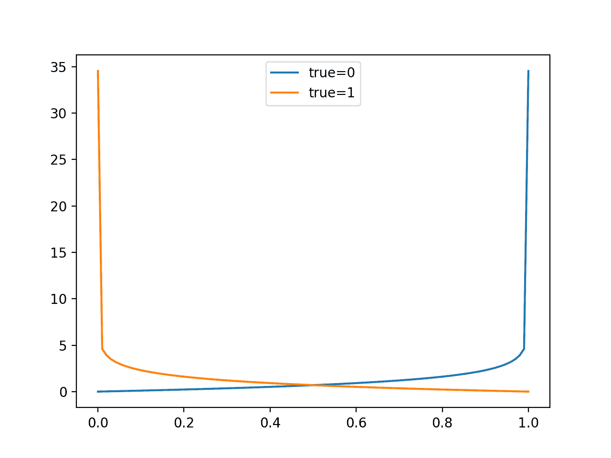
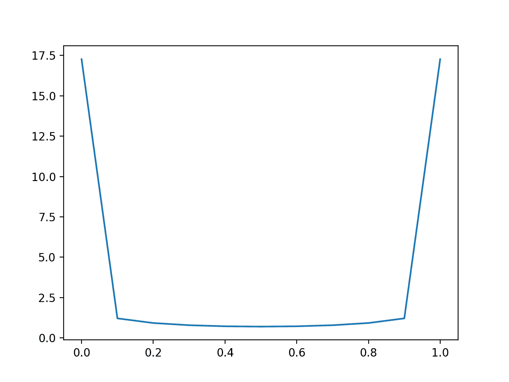
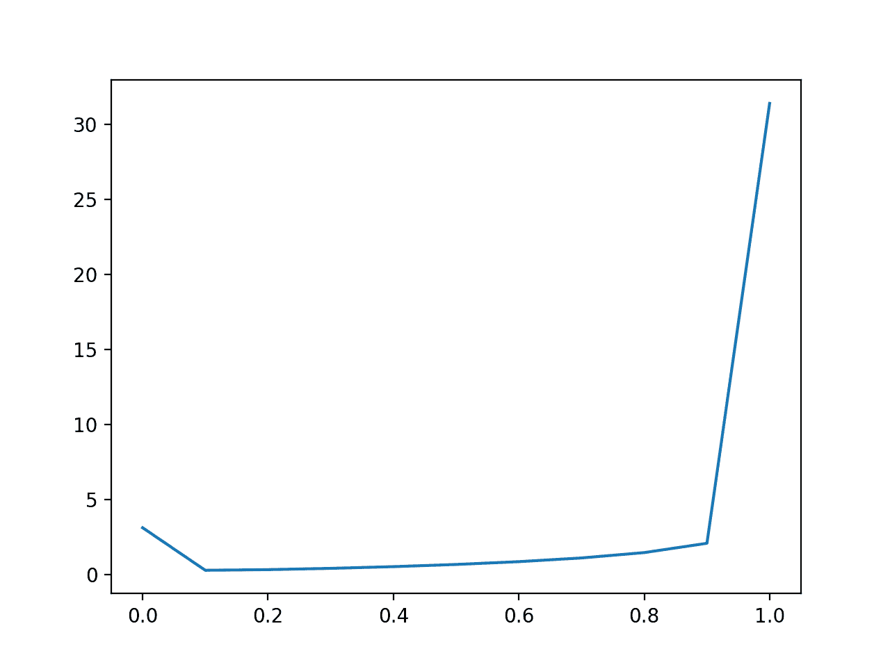
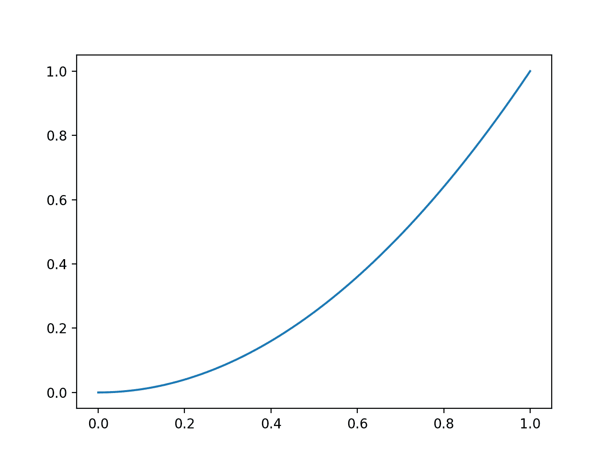
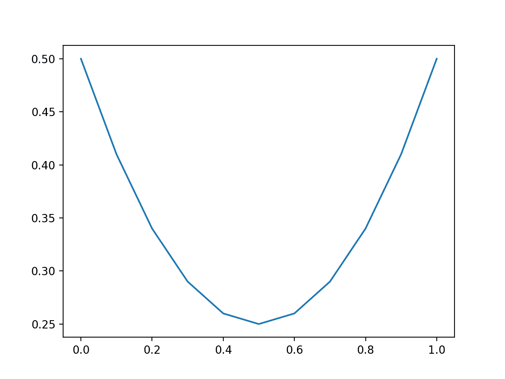
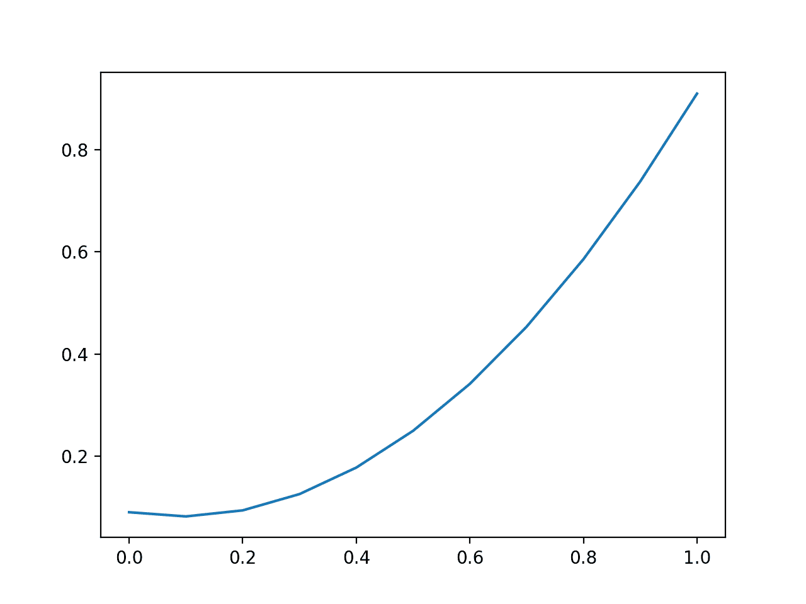
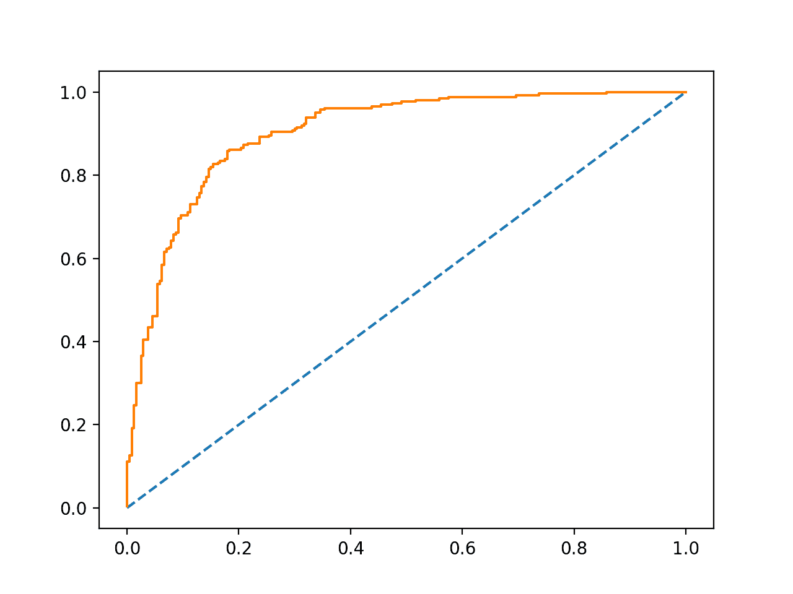

# Python 中概率评分方法的简要介绍

> 原文： [https://machinelearningmastery.com/how-to-score-probability-predictions-in-python/](https://machinelearningmastery.com/how-to-score-probability-predictions-in-python/)

#### 如何评估 Python 中的概率预测和
为不同的度量标准开发直觉。

为分类问题预测概率而不是类标签可以为预测提供额外的细微差别和不确定性。

增加的细微差别允许使用更复杂的度量来解释和评估预测的概率。通常，用于评估预测概率的准确率的方法被称为[评分规则](https://en.wikipedia.org/wiki/Scoring_rule)或评分函数。

在本教程中，您将发现三种评分方法，可用于评估分类预测性建模问题的预测概率。

完成本教程后，您将了解：

*   对数损失得分严重影响远离其预期值的预测概率。
*   Brier 得分比对数损失更温和，但仍与预期值的距离成比例。
*   ROC 曲线下的区域总结了模型预测真阳性病例的概率高于真阴性病例的可能性。

让我们开始吧。

*   **更新 Sept / 2018** ：修正了 AUC 无技能的描述。


Python 中概率评分方法的简要介绍
[Paul Balfe](https://www.flickr.com/photos/paul_e_balfe/39642542840/) 的照片，保留一些权利。

## 教程概述

本教程分为四个部分;他们是：

1.  记录损失分数
2.  布里尔得分
3.  ROC AUC 得分
4.  调整预测概率

## 记录损失分数

对数损失，也称为“逻辑损失”，“对数损失”或“交叉熵”可以用作评估预测概率的度量。

将每个预测概率与实际类输出值（0 或 1）进行比较，并计算基于与预期值的距离来惩罚概率的分数。罚分为对数，小差异（0.1 或 0.2）得分较小，差异较大（0.9 或 1.0）。

具有完美技能的模型具有 0.0 的对数损失分数。

为了总结使用对数损失的模型的技能，计算每个预测概率的对数损失，并报告平均损失。

可以使用 scikit-learn 中的 [log_loss（）](http://scikit-learn.org/stable/modules/generated/sklearn.metrics.log_loss.html)函数在 Python 中实现日志丢失。

例如：

```
from sklearn.metrics import log_loss
...
model = ...
testX, testy = ...
# predict probabilities
probs = model.predict_proba(testX)
# keep the predictions for class 1 only
probs = probs[:, 1]
# calculate log loss
loss = log_loss(testy, probs)
```

在二分类案例中，函数将真实结果值列表和概率列表作为参数，并计算预测的平均对数损失。

我们可以通过一个例子来制作单一的对数损失分数。

给定 0 的特定已知结果，我们可以以 0.01 增量（101 个预测）预测 0.0 到 1.0 的值，并计算每个的对数损失。结果是曲线显示每个预测在概率远离预期值时受到多少惩罚。我们可以对已知的 1 结果重复此操作，并反过来看相同的曲线。

下面列出了完整的示例。

```
# plot impact of logloss for single forecasts
from sklearn.metrics import log_loss
from matplotlib import pyplot
from numpy import array
# predictions as 0 to 1 in 0.01 increments
yhat = [x*0.01 for x in range(0, 101)]
# evaluate predictions for a 0 true value
losses_0 = [log_loss([0], [x], labels=[0,1]) for x in yhat]
# evaluate predictions for a 1 true value
losses_1 = [log_loss([1], [x], labels=[0,1]) for x in yhat]
# plot input to loss
pyplot.plot(yhat, losses_0, label='true=0')
pyplot.plot(yhat, losses_1, label='true=1')
pyplot.legend()
pyplot.show()
```

运行该示例会创建一个折线图，显示真实标签为 0 和 1 的情况下概率预测的损失分数从 0.0 到 1.0。

这有助于建立对评估预测时损失分数的影响的直觉。



具有对数损失的评估预测线图

模型技能被报告为测试数据集中预测的平均对数损失。

平均而言，当测试集中两个类之间存在较大的不平衡时，我们可以预期得分将适用于平衡数据集并具有误导性。这是因为预测 0 或小概率将导致小的损失。

我们可以通过比较损失值的分布来预测平衡和不平衡数据集的不同常数概率来证明这一点。

首先，对于 50 个 0 级和 1 级示例的平衡数据集，下面的示例以 0.1 为增量预测值为 0.0 到 1.0。

```
# plot impact of logloss with balanced datasets
from sklearn.metrics import log_loss
from matplotlib import pyplot
from numpy import array
# define an imbalanced dataset
testy = [0 for x in range(50)] + [1 for x in range(50)]
# loss for predicting different fixed probability values
predictions = [0.0, 0.1, 0.2, 0.3, 0.4, 0.5, 0.6, 0.7, 0.8, 0.9, 1.0]
losses = [log_loss(testy, [y for x in range(len(testy))]) for y in predictions]
# plot predictions vs loss
pyplot.plot(predictions, losses)
pyplot.show()
```

运行该示例，我们可以看到模型更好地预测不尖锐（靠近边缘）并回到分布中间的概率值。

错误概率的惩罚是非常大的。



预测平衡数据集对数损失的线图

我们可以使用不平衡的数据集重复此实验，其中 0 级到 1 级的比率为 10：1。

```
# plot impact of logloss with imbalanced datasets
from sklearn.metrics import log_loss
from matplotlib import pyplot
from numpy import array
# define an imbalanced dataset
testy = [0 for x in range(100)] + [1 for x in range(10)]
# loss for predicting different fixed probability values
predictions = [0.0, 0.1, 0.2, 0.3, 0.4, 0.5, 0.6, 0.7, 0.8, 0.9, 1.0]
losses = [log_loss(testy, [y for x in range(len(testy))]) for y in predictions]
# plot predictions vs loss
pyplot.plot(predictions, losses)
pyplot.show()
```

在这里，我们可以看到，倾向于预测非常小的概率的模型将表现良好，乐观地如此。

预测 0.1 的恒定概率的幼稚模型将是要击败的基线模型。

结果表明，在不平衡数据集的情况下，应该仔细解释用对数损失评估的模型技能，可能相对于数据集中第 1 类的基本速率进行调整。



预测不平衡数据集的对数损失的线图

## 布里尔得分

以格伦布里尔命名的布里尔分数计算预测概率与预期值之间的均方误差。

该分数总结了概率预测中的误差幅度。

错误分数始终介于 0.0 和 1.0 之间，其中具有完美技能的模型得分为 0.0。

远离预期概率的预测会受到惩罚，但与对数丢失的情况相比会受到严重影响。

模型的技能可以概括为针对测试数据集预测的所有概率的平均 Brier 分数。

可以使用 scikit-learn 中的 [brier_score_loss（）函数](http://scikit-learn.org/stable/modules/generated/sklearn.metrics.brier_score_loss.html)在 Python 中计算 Brier 分数。它将测试数据集中所有示例的真实类值（0,1）和预测概率作为参数，并返回平均 Brier 分数。

For example:

```
from sklearn.metrics import brier_score_loss
...
model = ...
testX, testy = ...
# predict probabilities
probs = model.predict_proba(testX)
# keep the predictions for class 1 only
probs = probs[:, 1]
# calculate bier score
loss = brier_score_loss(testy, probs)
```

我们可以通过比较单个概率预测的 Brier 得分来评估预测误差的影响，将误差从 0.0 增加到 1.0。

The complete example is listed below.

```
# plot impact of brier for single forecasts
from sklearn.metrics import brier_score_loss
from matplotlib import pyplot
from numpy import array
# predictions as 0 to 1 in 0.01 increments
yhat = [x*0.01 for x in range(0, 101)]
# evaluate predictions for a 1 true value
losses = [brier_score_loss([1], [x], pos_label=[1]) for x in yhat]
# plot input to loss
pyplot.plot(yhat, losses)
pyplot.show()
```

运行该示例创建概率预测误差的绝对值（x 轴）与计算的 Brier 分数（y 轴）的关系图。

我们可以看到熟悉的二次曲线，从 0 到 1，误差平方。



用 Brier 评分评估预测的线图

模型技能被报告为测试数据集中预测的平均 Brier。

与对数丢失一样，当测试集中两个类之间存在较大的不平衡时，我们可以预期得分将适用于平衡数据集并具有误导性。

We can demonstrate this by comparing the distribution of loss values when predicting different constant probabilities for a balanced and an imbalanced dataset.

First, the example below predicts values from 0.0 to 1.0 in 0.1 increments for a balanced dataset of 50 examples of class 0 and 1.

```
# plot impact of brier score with balanced datasets
from sklearn.metrics import brier_score_loss
from matplotlib import pyplot
from numpy import array
# define an imbalanced dataset
testy = [0 for x in range(50)] + [1 for x in range(50)]
# brier score for predicting different fixed probability values
predictions = [0.0, 0.1, 0.2, 0.3, 0.4, 0.5, 0.6, 0.7, 0.8, 0.9, 1.0]
losses = [brier_score_loss(testy, [y for x in range(len(testy))]) for y in predictions]
# plot predictions vs loss
pyplot.plot(predictions, losses)
pyplot.show()
```

运行这个例子，我们可以看到一个模型更好地预测道路概率值的中间值，如 0.5。

与对于紧密概率非常平坦的对数损失不同，抛物线形状显示随着误差增加而得分惩罚的明显二次增加。



平衡数据集预测 Brier 分数的线图

We can repeat this experiment with an imbalanced dataset with a 10:1 ratio of class 0 to class 1.

```
# plot impact of brier score with imbalanced datasets
from sklearn.metrics import brier_score_loss
from matplotlib import pyplot
from numpy import array
# define an imbalanced dataset
testy = [0 for x in range(100)] + [1 for x in range(10)]
# brier score for predicting different fixed probability values
predictions = [0.0, 0.1, 0.2, 0.3, 0.4, 0.5, 0.6, 0.7, 0.8, 0.9, 1.0]
losses = [brier_score_loss(testy, [y for x in range(len(testy))]) for y in predictions]
# plot predictions vs loss
pyplot.plot(predictions, losses)
pyplot.show()
```

运行该示例，我们看到不平衡数据集的图片非常不同。

与平均对数损失一样，平均 Brier 分数将在不平衡数据集上呈现乐观分数，奖励小预测值，从而减少大多数类别的错误。

在这些情况下，Brier 分数应该相对于幼稚预测（例如少数类的基本率或上例中的 0.1）进行比较，或者通过朴素分数进行归一化。

后一个例子很常见，称为 Brier 技能分数（BSS）。

```
BSS = 1 - (BS / BS_ref)
```

其中 BS 是模型的 Brier 技能，而 BS_ref 是朴素预测的 Brier 技能。

Brier 技能分数报告了概率预测相对于朴素预测的相对技能。

对 scikit-learn API 的一个很好的更新是将参数添加到`brier_score_loss()`以支持 Brier 技能分数的计算。



不平衡数据集预测 Brier 分数的线图

## ROC AUC 得分

二进制（两级）分类问题的预测概率可以用阈值来解释。

阈值定义概率映射到 0 级与 1 级的点，其中默认阈值为 0.5。替代阈值允许模型针对更高或更低的误报和漏报进行调整。

操作员调整阈值对于一种类型的错误或多或少比另一种错误或者模型不成比例地或多或少地具有特定类型的错误的问题尤为重要。

接收器操作特性或 ROC 曲线是对于多个阈值在 0.0 和 1.0 之间的模型的预测的真阳性率与假阳性率的曲线图。

在从左下角到右上角的图的对角线上绘制对于给定阈值没有技能的预测。此行表示每个阈值的无技能预测。

具有技能的模型在该对角线上方具有向左上角弯曲的曲线。

下面是在二分类问题上拟合逻辑回归模型并计算和绘制 500 个新数据实例的测试集上的预测概率的 ROC 曲线的示例。

```
# roc curve
from sklearn.datasets import make_classification
from sklearn.linear_model import LogisticRegression
from sklearn.model_selection import train_test_split
from sklearn.metrics import roc_curve
from matplotlib import pyplot
# generate 2 class dataset
X, y = make_classification(n_samples=1000, n_classes=2, random_state=1)
# split into train/test sets
trainX, testX, trainy, testy = train_test_split(X, y, test_size=0.5, random_state=2)
# fit a model
model = LogisticRegression()
model.fit(trainX, trainy)
# predict probabilities
probs = model.predict_proba(testX)
# keep probabilities for the positive outcome only
probs = probs[:, 1]
# calculate roc curve
fpr, tpr, thresholds = roc_curve(testy, probs)
# plot no skill
pyplot.plot([0, 1], [0, 1], linestyle='--')
# plot the roc curve for the model
pyplot.plot(fpr, tpr)
# show the plot
pyplot.show()
```

运行该示例创建了一个 ROC 曲线示例，可以与主对角线上的无技能线进行比较。



示例 ROC 曲线

ROC 曲线下的综合区域称为 AUC 或 ROC AUC，可以衡量所有评估阈值的模型技能。

AUC 得分为 0.5 表明没有技能，例如沿着对角线的曲线，而 AUC 为 1.0 表示完美技能，所有点沿着左侧 y 轴和顶部 x 轴朝向左上角。 AUC 为 0.0 表明完全不正确的预测。

具有较大面积的模型的预测在阈值上具有更好的技能，尽管模型之间的曲线的特定形状将变化，可能提供通过预先选择的阈值来优化模型的机会。通常，在准备好模型之后，操作员选择阈值。

可以使用 scikit-learn 中的 [roc_auc_score（）函数](http://scikit-learn.org/stable/modules/generated/sklearn.calibration.calibration_curve.html)在 Python 中计算 AUC。

此函数将真实输出值和预测概率列表作为参数，并返回 ROC AUC。

For example:

```
from sklearn.metrics import roc_auc_score
...
model = ...
testX, testy = ...
# predict probabilities
probs = model.predict_proba(testX)
# keep the predictions for class 1 only
probs = probs[:, 1]
# calculate log loss
loss = roc_auc_score(testy, probs)
```

AUC 分数是产生预测的模型将随机选择的正例高于随机选择的负例的可能性的度量。具体而言，真实事件（class = 1）的概率高于真实的非事件（class = 0）。

这是一个有用的定义，它提供了两个重要的直觉：

*   **朴素预测**。 ROC AUC 下的朴素预测是任何恒定概率。如果对每个例子预测相同的概率，则在正面和负面情况之间没有区别，因此该模型没有技能（AUC = 0.5）。
*   **对类不平衡的不敏感性**。 ROC AUC 是关于模型在不同阈值之间正确区分单个示例的能力的总结。因此，它不关心每个类的基本可能性。

下面，更新演示 ROC 曲线的示例以计算和显示 AUC。

```
# roc auc
from sklearn.datasets import make_classification
from sklearn.linear_model import LogisticRegression
from sklearn.model_selection import train_test_split
from sklearn.metrics import roc_auc_score
from matplotlib import pyplot
# generate 2 class dataset
X, y = make_classification(n_samples=1000, n_classes=2, random_state=1)
# split into train/test sets
trainX, testX, trainy, testy = train_test_split(X, y, test_size=0.5, random_state=2)
# fit a model
model = LogisticRegression()
model.fit(trainX, trainy)
# predict probabilities
probs = model.predict_proba(testX)
# keep probabilities for the positive outcome only
probs = probs[:, 1]
# calculate roc auc
auc = roc_auc_score(testy, probs)
print(auc)
```

运行该示例计算并打印在 500 个新示例上评估的逻辑回归模型的 ROC AUC。

```
0.9028044871794871
```

选择 ROC AUC 的一个重要考虑因素是它没有总结模型的具体判别能力，而是所有阈值的一般判别能力。

它可能是模型选择的更好工具，而不是量化模型预测概率的实际技能。

## 调整预测概率

可以调整预测概率以改进甚至游戏表现测量。

例如，对数损失和 Brier 分数量化概率中的平均误差量。因此，可以通过以下几种方式调整预测概率以改善这些分数：

*   **使概率不那么尖锐（不太自信）**。这意味着调整预测概率远离硬 0 和 1 界限，以限制完全错误处罚的影响。
*   **将分布转移到幼稚预测（基准率）**。这意味着将预测概率的平均值转换为基本概率的概率，例如对于平衡预测问题的 0.5。

通常，使用诸如可靠性图之类的工具来审查概率的校准可能是有用的。这可以使用 scikit-learn 中的 [calibration_curve（）函数](http://scikit-learn.org/stable/modules/generated/sklearn.calibration.calibration_curve.html)来实现。

某些算法（如 SVM 和神经网络）可能无法本地预测校准概率。在这些情况下，可以校准概率，进而可以改善所选择的度量。可以使用 [CalibratedClassifierCV](http://scikit-learn.org/stable/modules/generated/sklearn.calibration.CalibratedClassifierCV.html) 类在 scikit-learn 中校准分类器。

## 进一步阅读

如果您希望深入了解，本节将提供有关该主题的更多资源。

### API

*   [sklearn.metrics.log_loss API](http://scikit-learn.org/stable/modules/generated/sklearn.metrics.log_loss.html)
*   [sklearn.metrics.brier_score_loss API](http://scikit-learn.org/stable/modules/generated/sklearn.metrics.brier_score_loss.html)
*   [sklearn.metrics.roc_curve API](http://scikit-learn.org/stable/modules/generated/sklearn.metrics.roc_curve.html)
*   [sklearn.metrics.roc_auc_score API](http://scikit-learn.org/stable/modules/generated/sklearn.metrics.roc_auc_score.html)
*   [sklearn.calibration.calibration_curve API](http://scikit-learn.org/stable/modules/generated/sklearn.calibration.calibration_curve.html)
*   [sklearn.calibration.CalibratedClassifierCV API](http://scikit-learn.org/stable/modules/generated/sklearn.calibration.CalibratedClassifierCV.html)

### 用品

*   [评分规则，维基百科](https://en.wikipedia.org/wiki/Scoring_rule)
*   [交叉熵，维基百科](https://en.wikipedia.org/wiki/Cross_entropy)
*   [Log Loss，fast.ai](http://wiki.fast.ai/index.php/Log_Loss)
*   [Brier 得分，维基百科](https://en.wikipedia.org/wiki/Brier_score)
*   [接收器操作特性，维基百科](https://en.wikipedia.org/wiki/Receiver_operating_characteristic)

## 摘要

在本教程中，您发现了三个度量标准，可用于评估分类预测性建模问题的预测概率。

具体来说，你学到了：

*   对数损失得分严重影响远离其预期值的预测概率。
*   Brier 得分比对数损失更温和，但仍与预期值的距离成比例
*   ROC 曲线下的区域总结了模型预测真阳性病例的概率高于真阴性病例的可能性。

你有任何问题吗？
在下面的评论中提出您的问题，我会尽力回答。