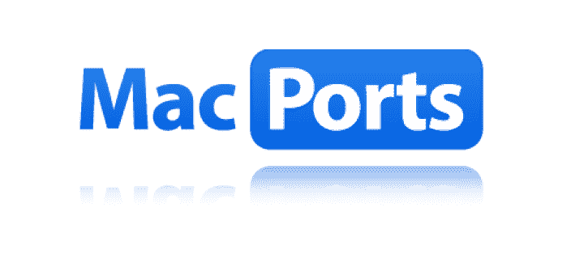
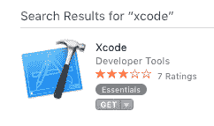
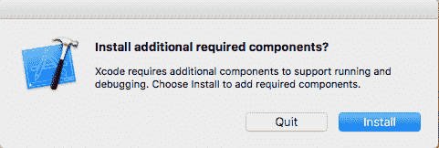
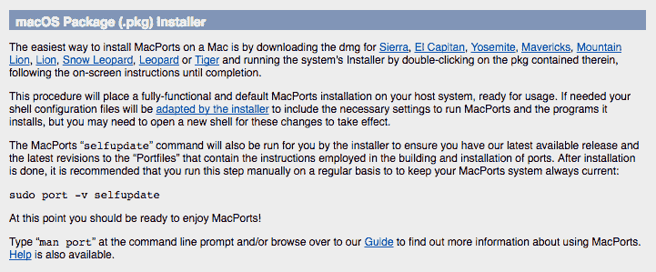
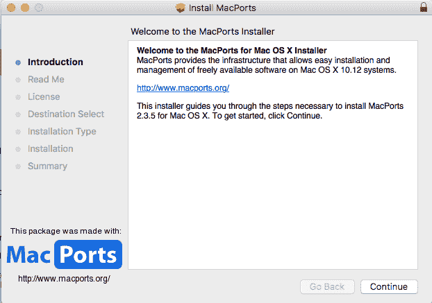

# 如何在 Mac OS X 上安装 Python 3 环境以进行机器学习和深度学习

> 原文： [https://machinelearningmastery.com/install-python-3-environment-mac-os-x-machine-learning-deep-learning/](https://machinelearningmastery.com/install-python-3-environment-mac-os-x-machine-learning-deep-learning/)

在 Mac OS X 上安装 Python 机器学习环境可能很困难。

必须首先安装 Python 本身，然后安装许多软件包，这对初学者来说可能会造成混淆。

在本教程中，您将了解如何使用 macport 设置 Python 3 机器学习和深度学习开发环境。

完成本教程后，您将拥有一个有效的 Python 3 环境，可以开始学习，练习和开发机器学习和深度学习软件。

让我们开始吧。

*   **2017 年 8 月更新**：添加了有关如何使您的环境保持最新的部分。



如何在 Mac OS X 上安装 Python 3 环境以进行机器学习和深度学习

## 教程概述

本教程分为以下 4 个步骤：

1.  安装 XCode 工具
2.  安装 Macports
3.  安装 SciPy 库
4.  安装深度学习库
5.  让您的环境保持最新状态

## 1.安装 XCode

XCode 是 OS X 上的开发 IDE。

需要安装 XCode，因为它包含 Python 开发所需的命令行工具。在此步骤中，您将安装 XCode 和 XCode 命令行工具。

此步骤假定您已拥有 Apple App Store 帐户，并且您具有足够的管理权限以在工作站上安装软件。

*   1.打开“ _App Store_ ”应用程序。搜索“`XCode`”并单击“`Get`”按钮进行安装。

系统将提示您输入 App Store 密码。

XCode 是免费的，大小至少为 4.5 GB，可能需要一些时间才能下载。



App Store 搜索 XCode

*   2.打开“_ 应用程序 _”，然后找到并启动“`XCode`”。

在启动 XCode 之前，系统可能会提示您安装其他组件。同意并安装。



安装其他 XCode 组件

*   3.安装 XCode 命令行工具，打开终端窗口并键入：

```
xcode-select --install
```

将出现一个对话框并安装所需的工具。

键入以下命令确认已安装工具：

```
xcode-select -p
```

您应该看到如下输出：

```
/Applications/Xcode.app/Contents/Developer
```

*   4.同意许可协议（如果需要）。打开终端窗口并键入：

```
sudo xcodebuild -license
```

使用“`space`”键导航到底部并同意。

您现在已安装 XCode 和 XCode 命令行工具。

## 2.安装 Macports

Macports 是一个用于在 OS X 上安装开发工具的包管理工具。

在此步骤中，您将安装 macports 包管理工具。

*   1.访问 [macports.org](https://www.macports.org/)
*   2.单击页面顶部的“_ 下载 _”按钮以访问[安装页面](https://www.macports.org/install.php)。
*   3.为您的 OS X 版本下载“ _macOS 软件包（.pkg）安装程序 _”。

在撰写本文时，最新版本的 OS X 是 Sierra。



Macports 包安装

您现在应该在工作站上有一个包。例如：

```
MacPorts-2.3.5-10.12-Sierra.pkg
```

*   4.双击包，然后按照向导安装 macports。



Macports 安装向导

*   5.更新 macport 并确认系统按预期工作。打开终端窗口并键入：

```
sudo port selfupdate
```

这将更新 port 命令和可用端口列表，并且不时有用。

您应该看到如下消息：

```
MacPorts base is already the latest version
```

## 3.安装 SciPy 和机器学习库

SciPy 是 Python 中机器学习开发所需的科学计算 Python 库的集合。

在此步骤中，您将安装 Python 3 和 SciPy 环境。

*   1.使用 macports 安装 Python 3.5 版。打开终端并输入：

```
sudo port install python35
```

要使其成为 Python 的默认版本，请键入：

```
sudo port select --set python python35
sudo port select --set python3 python35
```

关闭终端窗口并重新打开。

通过键入以下内容确认 Python 3.5 现在是系统的默认 Python：

```
python -V
```

您应该看到以下消息，或类似的消息：

```
Python 3.5.3
```

*   2.安装 SciPy 环境，包括库：
    *   NumPy 的
    *   SciPy 的
    *   Matplotlib
    *   熊猫
    *   Statsmodels
    *   Pip（包经理）

打开终端并输入：

```
sudo port install py35-numpy py35-scipy py35-matplotlib py35-pandas py35-statsmodels py35-pip
```

这可能需要一些时间来下载和安装。

要确保 Python 3 的 pip 是系统的默认值，请键入：

```
sudo port select --set pip pip35
```

*   3.使用 pip 安装 scikit-learn。打开命令行并键入：

```
sudo pip install -U scikit-learn
```

*   4.确认库已正确安装。打开文本编辑器并编写（复制粘贴）以下脚本：

```
# scipy
import scipy
print('scipy: %s' % scipy.__version__)
# numpy
import numpy
print('numpy: %s' % numpy.__version__)
# matplotlib
import matplotlib
print('matplotlib: %s' % matplotlib.__version__)
# pandas
import pandas
print('pandas: %s' % pandas.__version__)
# statsmodels
import statsmodels
print('statsmodels: %s' % statsmodels.__version__)
# scikit-learn
import sklearn
print('sklearn: %s' % sklearn.__version__)
```

使用文件名 _versions.py_ 保存脚本。

将目录更改为保存脚本的位置并键入：

```
python versions.py
```

输出应如下所示（或类似）：

```
scipy: 0.18.1
numpy: 1.12.0
matplotlib: 2.0.0
pandas: 0.19.2
statsmodels: 0.6.1
sklearn: 0.18.1
```

你得到了什么版本？
将输出粘贴到下面的注释中。

您可以根据需要使用这些命令更新机器学习和 SciPy 库。

尝试 scikit-learn 教程，例如：

*   [你的第一个 Python 循环机器学习项目](http://machinelearningmastery.com/machine-learning-in-python-step-by-step/)

## 4.安装深度学习库

在这一步中，我们将安装用于深度学习的 Python 库，特别是：Theano，TensorFlow 和 Keras。

*   1.输入以下命令安装 Theano 深度学习库：

```
sudo pip install theano
```

*   2.键入以下命令安装 TensorFlow 深度学习库：

```
sudo pip install tensorflow
```

*   3.要安装 Keras，请键入：

```
sudo pip install keras
```

*   4.确认您的深度学习环境已安装并正常运行。

创建一个打印每个库的版本号的脚本，就像我们之前为 SciPy 环境所做的那样。

```
# theano
import theano
print('theano: %s' % theano.__version__)
# tensorflow
import tensorflow
print('tensorflow: %s' % tensorflow.__version__)
# keras
import keras
print('keras: %s' % keras.__version__)
```

将脚本保存到文件 _deep_versions.py_ 。

键入以下命令运行脚本：

```
python deep_versions.py
```

You should see output like:

```
theano: 0.8.2
tensorflow: 0.12.1
Using TensorFlow backend.
keras: 1.2.1
```

What versions did you get?
Paste the output in the comments below.

尝试使用 Keras 深度学习教程，例如：

*   [用 Keras 逐步开发 Python 中的第一个神经网络](http://machinelearningmastery.com/tutorial-first-neural-network-python-keras/)

## 5.让您的环境保持最新状态

随着时间的推移保持环境最新非常重要。

使用相同的工具更新用于安装的库也很重要，例如： macports 和 pip。

本节提供了您可以使用的命令，例如每月一次，以确保您的环境是最新的。

### 更新 Macports 安装的库

第一步是更新 macports 本身。

```
sudo port selfupdate
```

接下来，您可以使用 macports 更新安装的库。

```
sudo port upgrade python35 py35-numpy py35-scipy py35-matplotlib py35-pandas py35-statsmodels py35-pip
```

您还可以通过键入以下内容来更新所有需要更新的库：

```
sudo port upgrade outdated
```

我自己不这样做，因为我无法控制正在更新的内容。

### 更新 Pip 安装的库

接下来，我们可以更新使用 pip 安装的库。

我不希望 pip 安装或更新可以用 macports 安装的东西，所以我更新了用 pip 安装的库而没有更新依赖项（例如-no-deps）

```
sudo pip install -U --no-deps keras tensorflow theano scikit-learn
```

这就是您需要做的就是让您的环境保持最新状态。

如果你在 macports 和 pip 之间得到一些交叉，（例如两个工具都安装了 numpy），你就会遇到问题。

要查看 pip 类型的确切安装内容：

```
sudo pip freeze
```

## 进一步阅读

本节提供了一些进一步阅读的资源。

*   [MacPorts 安装](https://www.macports.org/install.php)
*   [第 2 章安装 MacPorts](https://guide.macports.org/chunked/installing.macports.html)
*   [第 3 章使用 MacPorts](https://guide.macports.org/chunked/using.html)
*   [安装 SciPy 堆栈](https://www.scipy.org/install.html)
*   [Scikit-learn 安装](http://scikit-learn.org/stable/install.html)
*   [安装 Theano](http://deeplearning.net/software/theano/install.html)
*   [安装 TensorFlow Anaconda](https://www.tensorflow.org/get_started/os_setup#anaconda_installation)
*   [Keras 安装](https://keras.io/#installation)

## 摘要

恭喜，您现在在 Mac OS X 上有一个可用的 Python 开发环境，用于机器学习和深度学习。

您现在可以在工作站上学习和练习机器学习和深度学习。

你是怎么做的？
请在下面的评论中告诉我。