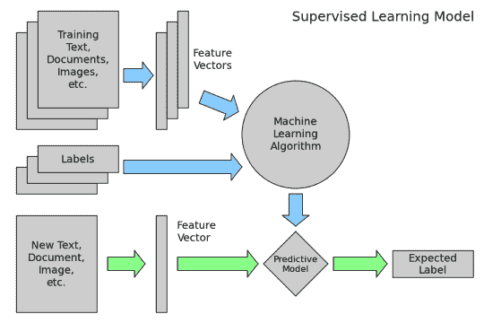
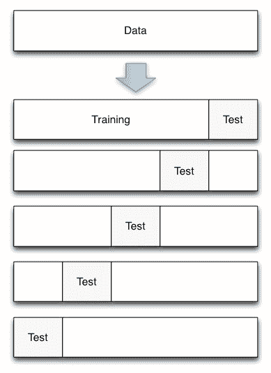

# 使用 scikit-learn 进行机器学习简介

> 原文： [https://machinelearningmastery.com/introduction-machine-learning-scikit-learn/](https://machinelearningmastery.com/introduction-machine-learning-scikit-learn/)

[scikit-learn 库](http://machinelearningmastery.com/a-gentle-introduction-to-scikit-learn-a-python-machine-learning-library/)是日常机器学习和数据科学最受欢迎的平台之一。原因是它是基于 Python 构建的，这是一种功能齐全的编程语言。

但是如何开始使用 scikit-learn 进行机器学习。

Kevin Markham 是一名数据科学训练师，他创建了一系列 9 个视频，向您展示如何使用 scikit-learn 开始机器学习。

在这篇文章中，您将发现这一系列视频以及所涵盖的内容，一步一步地帮助您确定材料是否对您有用。

## 视频系列概述

[Kevin Markham](https://www.linkedin.com/in/justmarkham) 是一名数据科学训练师，正式来自[大会](https://generalassemb.ly/)，计算机编程编程训练营。

Kevin 创建了自己的训练网站[数据学院](http://www.dataschool.io/)并分享了数据科学和机器学习的训练。他擅长机器学习，并且视频格式清晰。

2015 年，Mark 与机器学习竞赛网站 Kaggle 合作，创建了一系列 9 个视频和博客文章，使用 scikit-learn 轻松介绍机器学习。

9 个视频的主题是：

*   什么是机器学习，它是如何工作的？
*   为机器学习设置 Python：scikit-learn 和 IPython Notebook
*   scikit 入门 - 使用着名的虹膜数据集学习
*   用 scikit-learn 训练机器学习模型
*   比较 scikit-learn 中的机器学习模型
*   Python 中的数据科学：pandas，seaborn，scikit-learn
*   使用交叉验证选择 scikit 中的最佳模型
*   如何在 scikit-learn 中找到最佳模型参数
*   如何评估 scikit-learn 中的分类器

您可以在 Kaggle 上查看每个视频的[博客文章。还有一个](http://blog.kaggle.com/author/kevin-markham/) [YouTube 播放列表](https://www.youtube.com/playlist?list=PL5-da3qGB5ICeMbQuqbbCOQWcS6OYBr5A)，您可以一个接一个地观看所有 9 个视频。您还可以使用 9 个视频中的每个视频中使用的代码和演示材料访问 [IPython 笔记本](https://github.com/justmarkham/scikit-learn-videos)。

接下来我们将回顾该系列中的 9 个视频。

## 视频 1：计算机如何从数据中学习？

在第一个视频中，Mark 指出该系列的重点是针对 Python 程序员的 scikit-learn。它也没有假设任何先验知识或熟悉机器学习，但他很快指出，如果不了解机器学习，就不能有效地使用 scikit-learn。

该视频包括：

*   什么是机器学习？
*   机器学习的两大类是什么？ （有监督和无监督）
*   什么是机器学习的例子？ （泰坦尼克号沉没时的乘客生存）
*   机器学习如何运作？ （从示例中学习如何预测新数据）

&lt;iframe allowfullscreen="" frameborder="0" height="281" src="https://www.youtube.com/embed/elojMnjn4kk?feature=oembed" width="500"&gt;&lt;/iframe&gt;

他将机器学习定义为：

> 机器学习是从数据中半自动提取知识

他提供了应用机器学习过程的精美图像概述。

数据学校机器学习过程（[从这里](http://blog.kaggle.com/wp-content/uploads/2015/04/01_supervised_learning.png)）

## 视频 2：为机器学习设置 Python

第二个视频主要是关于如何使用 [IPython 笔记本](http://ipython.org/notebook.html)的教程（现在可能被取代为 [Jupyter 笔记本](http://jupyter.org/)）。

涉及的主题是：

*   scikit-learn 有哪些好处和缺点？
*   如何安装 scikit-learn？
*   我如何使用 IPython 笔记本？
*   学习 Python 有哪些好资源？

&lt;iframe allowfullscreen="" frameborder="0" height="281" src="https://www.youtube.com/embed/IsXXlYVBt1M?feature=oembed" width="500"&gt;&lt;/iframe&gt;

Mark 花了一些时间研究 scikit-learn 的好处，建议：

*   它为机器学习算法提供了一致的界面。
*   它为每种算法提供了许多调整参数，并使用合理的默认值。
*   它有很好的文档。
*   它具有丰富的机器学习相关任务功能。
*   它在 StackOverflow 和邮件列表上有一个活跃的开发人员社区。

将 scikit-learn 与 R 进行比较，他建议 R 在开始时更快地进行机器学习，但从长远来看，你可以更深入地学习 scikit-learn。

他还建议 R 具有统计学习焦点，对模型可解释性感兴趣，而 scikit-learn 具有机器学习焦点，对预测准确率感兴趣。

我建议 R 中的[插入符](http://machinelearningmastery.com/caret-r-package-for-applied-predictive-modeling/)是一个功能强大且可能无与伦比的工具。

## 视频 3：机器学习第一步使用 scikit-learn

本视频主要关注机器学习的“ _hello world_ ”，[虹膜花数据集](https://archive.ics.uci.edu/ml/datasets/Iris)。这包括加载数据和查看数据。

本视频涉及的主题包括：

*   什么是着名的虹膜数据集，它与机器学习有什么关系？
*   我们如何将虹膜数据集加载到 scikit-learn 中？
*   我们如何使用机器学习术语描述数据集？
*   什么是 scikit-learn 处理数据的四个关键要求？

&lt;iframe allowfullscreen="" frameborder="0" height="281" src="https://www.youtube.com/embed/hd1W4CyPX58?feature=oembed" width="500"&gt;&lt;/iframe&gt;

如果您希望在 scikit-learn 中使用它，Mark 会总结您的数据的 4 个要求：

*   输入和响应变量必须分隔对象（X 和 y）。
*   输入和响应变量必须是数字。
*   输入和响应变量必须是 numpy 数组（ndarray）。
*   输入和响应变量必须具有一致的形状（行和列）。

## 视频 4：使用 scikit-learn 做出预测

本视频重点介绍如何在 scikit-learn 中构建您的第一个机器学习模型。 K-Nearest Neighbors 模型。

涉及的主题包括：

*   什么是 K-最近邻分类模型？
*   scikit-learn 中模型训练和预测的四个步骤是什么？
*   如何将此模式应用于其他机器学习模型？

&lt;iframe allowfullscreen="" frameborder="0" height="281" src="https://www.youtube.com/embed/RlQuVL6-qe8?feature=oembed" width="500"&gt;&lt;/iframe&gt;

Mark 总结了在 scikit-learn 中使用任何模型（在 API 中调用估算器）时必须遵循的 4 个步骤：

*   您计划使用的导入课程。
*   实例化估算器（模型是估算器）。
*   通过调用.fit（）函数使模型适合数据（训练模型）。
*   通过调用.predict（）函数预测新观察（样本外）的响应。

## 视频 5：选择机器学习模型

本视频侧重于比较 scikit-learn 中的机器学习模型。

Mark 指出，构建有监督的机器学习模型的目标是推广到样本数据之外，即对未来的新数据做出准确的预测。

涵盖的主题包括：

*   如何选择用于我的监督学习任务的模型？
*   如何为该模型选择最佳调整参数？
*   如何估计模型在样本外数据上的可能性？

&lt;iframe allowfullscreen="" frameborder="0" height="281" src="https://www.youtube.com/embed/0pP4EwWJgIU?feature=oembed" width="500"&gt;&lt;/iframe&gt;

该视频开始研究使用单个数据集估算模型表现的方法，从测试精度开始，然后查看使用训练/测试分割并查看测试精度。

## 视频 6：Python 中的数据科学：pandas 和 scikit-learn

本视频介绍了在使用 scikit-learn 时非常有用的相关库，特别是用于加载和处理数据的 pandas 库以及用于简单和干净的数据可视化的 seaborn 库。

该视频也远离分类，并着眼于回归问题，实际值数据的预测。建立线性回归模型，并评估不同的表现指标以评估构建的模型。

以下是此较长视频中涵盖的主题列表：

*   如何使用 pandas 库将数据读入 Python？
*   如何使用 seaborn 库可视化数据？
*   什么是线性回归，它是如何工作的？
*   如何在 scikit-learn 中训练和解释线性回归模型？
*   回归问题的评估指标有哪些？
*   如何选择要包含在模型中的功能？

&lt;iframe allowfullscreen="" frameborder="0" height="281" src="https://www.youtube.com/embed/3ZWuPVWq7p4?feature=oembed" width="500"&gt;&lt;/iframe&gt;

## 视频 7：交叉验证简介

该视频通过使用 k-fold 交叉验证，深入研究了用于评估机器学习算法在看不见的数据上的表现的标准方法。

马克指出，单独使用训练精度会过拟合已知数据，模型不会很好地概括。在训练/测试拆分中单独使用测试数据将具有高差异，这意味着它将对训练和测试集的细节敏感。他建议交叉验证可以在这些问题之间取得良好的平衡。

该视频包含以下主题：

*   使用训练/测试拆分程序进行模型评估有什么缺点？
*   K-fold 交叉验证如何克服这一限制？
*   如何使用交叉验证来选择调整参数，在模型之间进行选择以及选择要素？
*   交叉验证有哪些可能的改进？

&lt;iframe allowfullscreen="" frameborder="0" height="281" src="https://www.youtube.com/embed/6dbrR-WymjI?feature=oembed" width="500"&gt;&lt;/iframe&gt;

交叉验证用于模型选择，调整模型参数和特征选择。

Mark 列出了三个从交叉验证中获得最大收益的技巧：

*   使用重复的 10 倍交叉验证来进一步减少估计表现的变化。
*   使用保持的验证数据集来确认从交叉验证中看到的估计值并捕获任何数据泄漏错误。
*   在交叉验证折叠中执行所有特征选择和工程设计，以避免数据泄漏错误。

数据学校 K 折交叉验证（[来自](http://blog.kaggle.com/wp-content/uploads/2015/06/07_cross_validation_diagram.png)）

## 视频 8：寻找最佳模型参数

本视频重点介绍可用于调整机器学习算法参数（称为超参数）的技术。

Mark 为算法调优引入了交叉验证，如何使用网格搜索来尝试参数组合和随机搜索参数组合以提高效率。

This video covers the following topics:

*   如何使用 K-fold 交叉验证来搜索最佳调整参数？
*   如何提高这一过程的效率？
*   如何一次搜索多个调整参数？
*   在进行实际预测之前，您如何处理这些调整参数？
*   如何减少这个过程的计算费用？

&lt;iframe allowfullscreen="" frameborder="0" height="281" src="https://www.youtube.com/embed/Gol_qOgRqfA?feature=oembed" width="500"&gt;&lt;/iframe&gt;

## 视频 9：如何在 scikit-learn 中评估分类器

这是该系列中的最终视频，也是最长的视频。

在这个视频中，Mark 介绍了很多关于技术的材料，这些技术可以用来评估分类问题的机器学习模型。

The topics covered in this video are:

*   模型评估的目的是什么，以及一些常见的评估程序是什么？
*   分类准确度的用途是什么，它的局限性是什么？
*   混淆矩阵如何描述分类器的表现？
*   可以从混淆矩阵计算哪些指标？
*   如何通过更改分类阈值来调整分类器表现？
*   ROC 曲线的目的是什么？
*   曲线下面积（AUC）与分类准确度有何不同？

&lt;iframe allowfullscreen="" frameborder="0" height="281" src="https://www.youtube.com/embed/85dtiMz9tSo?feature=oembed" width="500"&gt;&lt;/iframe&gt;

Mark 花了他的时间并仔细描述了混淆矩阵，敏感性和特异性的细节以及 ROC 曲线。

## 摘要

在这篇文章中，你发现了 Kevin Markham 的视频系列，题为“_ 机器学习与 scikit-learn_ 的简介”。

您了解到它包含 9 个视频：

*   什么是机器学习，它是如何工作的？
*   为机器学习设置 Python：scikit-learn 和 IPython Notebook
*   scikit 入门 - 使用着名的虹膜数据集学习
*   用 scikit-learn 训练机器学习模型
*   比较 scikit-learn 中的机器学习模型
*   Python 中的数据科学：pandas，seaborn，scikit-learn
*   使用交叉验证选择 scikit 中的最佳模型
*   如何在 scikit-learn 中找到最佳模型参数
*   如何评估 scikit-learn 中的分类器

Mark 已经制作了一个精彩的视频系列，向您介绍 scikit-learn 的机器学习。我强烈建议观看所有这些。

你看过一些或所有这些视频吗？你觉得呢？在评论区分享你的观点。