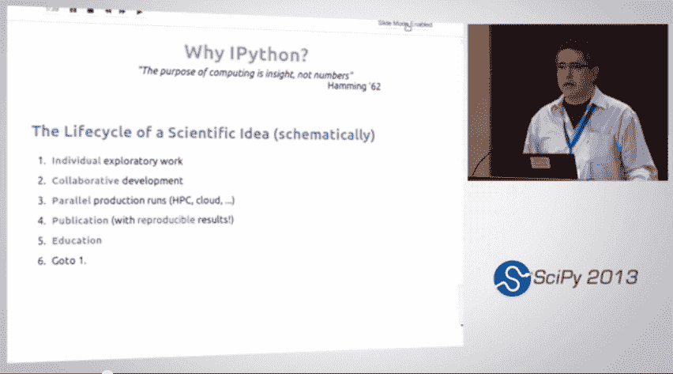
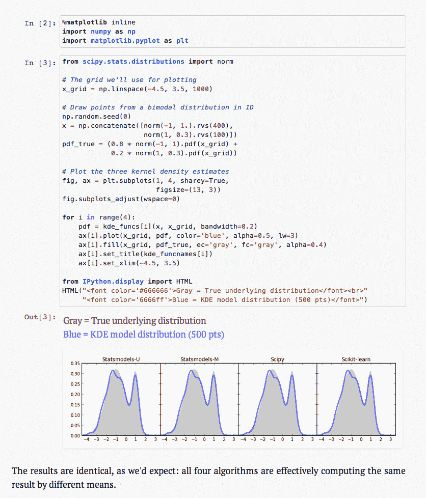
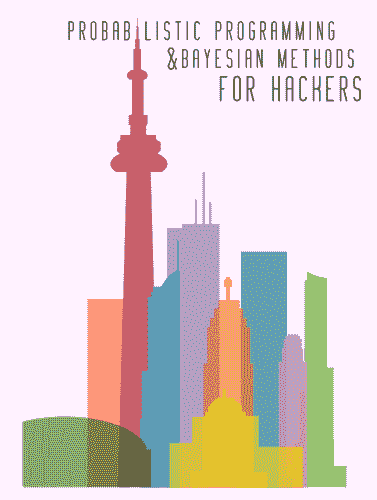

# 从 shell 到一本书，Fernando Perez 的单一工具 IPython 简介

> 原文： [https://machinelearningmastery.com/ipython-from-the-shell-to-a-book-with-a-single-tool-with-fernando-perez/](https://machinelearningmastery.com/ipython-from-the-shell-to-a-book-with-a-single-tool-with-fernando-perez/)

如果您在 python 中认真对待数据分析和机器学习，那么您将充分利用 IPython 笔记本。

在这篇文章中，我们将在 [SciPy 2013 的主题演讲中回顾 IPython 的创建者](http://conference.scipy.org/scipy2013/) [Fernando Perez](http://fperez.org/) 提出的一些要点。

谈话的标题是 [IPython：从 shell 到一本带有单一工具的书;疯狂背后的方法](https://conference.scipy.org/scipy2013/presentation_detail.php?id=191)。

&lt;iframe allowfullscreen="" frameborder="0" height="281" src="https://www.youtube.com/embed/j9YpkSX7NNM?feature=oembed" width="500"&gt;&lt;/iframe&gt;

费尔南多用[理查德汉明](http://en.wikipedia.org/wiki/Richard_Hamming)（1962）从[科学家和工程师的数值方法](http://www.amazon.com/dp/0486652416?tag=inspiredalgor-20)的序言中引用了一篇引人注目的话题，并重申：

> 计算的目的是洞察力，而不是数字

费尔南多提出了他所谓的科学思想生命周期的原理图，如下：

1.  **个人**：探索性工作
2.  **协作**：开发
3.  **并行**：生产运行
4.  **出版物**：**可重现**结果
5.  **教育**：分享学到的东西
6.  转到第 1 步

科学理念的生命周期

他强调要求能够在这个过程中前后移动，这不是线性的。他评论说，IPython 是在 2001 年 10 月或 11 月设计的，以满足这一要求。

IPython 最初是一个更好的 python shell。它开发包括实时交互式绘图，然后实时交互式并行计算和嵌入应用程序。交互性很重要，它是 IPython 中的“我”。该平台经历了 6 次迭代，并已到达 IPython Notebook。

IPython 笔记本允许您拥有可执行 python 代码和 markdown 描述的单元格。这允许单个文档包括运行计算的描述，计算（例如 Python scriptlet 和程序）和伪像（例如结果和图）。这是一个简单但非常强大的通信工具。

费尔南多将此描述为文学计算，超越了 Knuth 的[文学编程](http://en.wikipedia.org/wiki/Literate_programming)。

一个重要的贡献是 [IPython Notebook Viewer](http://nbviewer.ipython.org/) ，它将为您呈现任何笔记本并在网络上呈现。用于 Web 上的开源 Notebook 文件（例如 GitHub）的这项服务是一种强大的资源。

然后费尔南多提供了一些基础笔记本示例，以突出该技术的好处。

## 可重复的研究论文

论文[协作云启用工具允许快速，可重复的生物学见解](http://www.nature.com/ismej/journal/v7/n3/full/ismej2012123a.html)和[相关材料](http://qiime.org/home_static/nih-cloud-apr2012/)。

本文是作为 IPython 笔记本开发和编写的。它包括描述，计算，结果甚至配置，以启动集群以在集群上并行执行计算。完全可重复的研究。

## 基于笔记本的技术博客

博客 [Pythonic Perambulations，Musings 和漫游在 Python 世界和超越](http://jakevdp.github.io/)的 Jake VanderPlas。

截图来自 Jake VanderPlas 的 Pythonic Perambulations

Jake 博客使用 IPython 笔记本，允许以图形的形式组合描述，计算和执行计算的输出。

## 黑客的贝叶斯方法

书籍[黑客贝叶斯方法](https://github.com/CamDavidsonPilon/Probabilistic-Programming-and-Bayesian-Methods-for-Hackers)由 Cameron Davidson-Pilon 开发，作为一系列 IPython 笔记本（每章一个），您可以通过。

黑客的贝叶斯方法

这是一本高质量的书籍，是该技术的优秀使用案例和演示。

Fernando 花了一些时间来描述令人印象深刻的 IPython 内核和 shell 的架构，值得花时间更好地理解这些材料，

有关更多信息，您可以查看 [IPython 主页](http://ipython.org/)以及[着名的 IPython 笔记本](https://github.com/ipython/ipython/wiki/A-gallery-of-interesting-IPython-Notebooks)的精选图库。