# 如何使用 Python 3 为机器学习开发创建 Linux 虚拟机

> 原文： [https://machinelearningmastery.com/linux-virtual-machine-machine-learning-development-python-3/](https://machinelearningmastery.com/linux-virtual-machine-machine-learning-development-python-3/)

Linux 是使用 Python 进行机器学习开发的绝佳环境。

这些工具可以快速轻松地安装，您可以直接开发和运行大型模型。

在本教程中，您将了解如何使用 Python 创建和设置 Linux 虚拟机以进行机器学习。

完成本教程后，您将了解：

*   如何下载和安装 VirtualBox 以管理虚拟机。
*   如何下载和设置 Fedora Linux。
*   如何在 Python 3 中为机器学习安装 SciPy 环境。

如果您的基本操作系统是 Windows，Mac OS X 和 Linux，则本教程适用。

让我们开始吧。

## Linux 虚拟机的好处

您可能希望使用 Linux 虚拟机进行 Python 机器学习开发有很多原因。

例如，下面列出了使用虚拟机的 5 大优势：

*   使用系统上不可用的工具（如果您使用的是 Windows）。
*   在不影响本地环境的情况下安装和使用机器学习工具（例如，使用 Python 3 工具）。
*   为不同的项目（Python2 和 Python3）提供高度自定义的环境。
*   保存机器的状态并准确地拾取您离开的位置（从机器跳到机器）。
*   与其他开发人员共享开发环境（设置一次并重复使用多次）。

也许最有利的一点是第一个，能够轻松使用您的环境不支持的机器学习工具。

我是 OS X 用户，即使可以使用 _brew_ 和 _macports_ 安装机器学习工具，我仍然发现设置和使用 Linux 虚拟机进行机器学习开发更容易。

## 概观

本教程分为 3 个部分：

1.  下载并安装 VirtualBox。
2.  在虚拟机中下载并安装 Fedora Linux。
3.  安装 Python 机器学习环境

## 1.下载并安装 VirtualBox

VirtualBox 是一个免费的开源平台，用于创建和管理虚拟机。

安装后，只要您有要安装的 ISO 映像或 CD，就可以创建所需的所有虚拟机。

*   1.访问 [VirtualBox.org](https://www.virtualbox.org)
*   2.单击“_ 下载 VirtualBox_ ”以访问[下载页面](https://www.virtualbox.org/wiki/Downloads)。

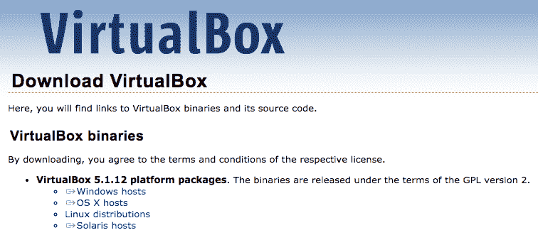

下载 VirtualBox

*   3.选择工作站的二进制文件。
*   4.安装系统软件并按照安装说明进行操作。

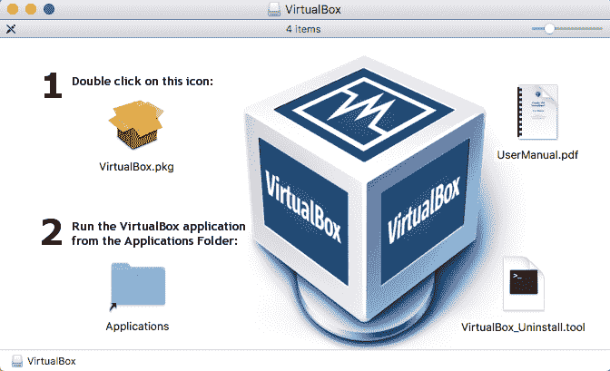

安装 VirtualBox

*   5.打开 VirtualBox 软件并确认其有效。

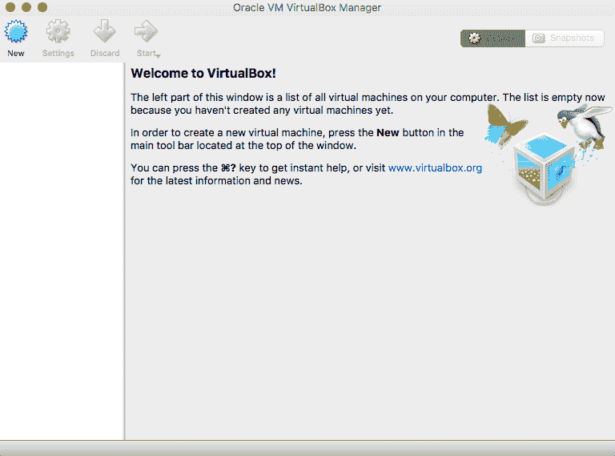

启动 VirtualBox

## 2.下载并安装 Fedora Linux

我之所以选择 [Fedora Linux](https://en.wikipedia.org/wiki/Fedora_(operating_system)) ，是因为我认为它比一些更友好，更温和的 Linux。

它是 RedHat Linux 的前沿，适用于工作站和开发人员。

### 2.1 下载 Fedora ISO 映像

让我们首先下载 Fedora Linux 的 ISO。在这种情况下，64 位版本的 Fedora 25。

*   1.访问 [GetFedora.org](https://getfedora.org) 。
*   2.单击“_ 工作站 _”以访问[工作站页面](https://getfedora.org/en/workstation/)。
*   3.单击“_ 立即下载 _”以访问[下载页面](https://getfedora.org/en/workstation/download/)。
*   4.在“其他下载”下单击“ _64 位 1.3GB 实时图像 _”

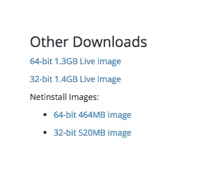

下载 Fedora

*   5.您现在应该拥有一个名为的 ISO 文件：
    *   “ _Fedora-Workstation-Live-x86_64-25-1.3.iso_ ”。

我们现在准备在 VirtualBox 中创建 VM。

### 2.2 创建 Fedora 虚拟机

现在，让我们在 VirtualBox 中创建 Fedora 虚拟机。

*   1.打开 VirtualBox 软件。
*   2.单击“ _New_ ”按钮。
*   3.选择名称和操作系统。
    *   名称： _Fedora25_
    *   类型： _Linux_
    *   版本： _Fedora（64 位）_
    *   点击“_ 继续 _”

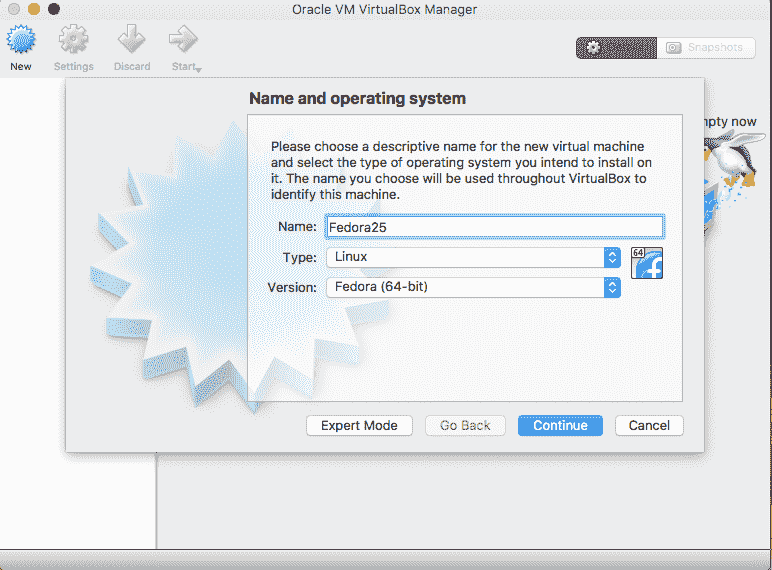

创建 Fedora VM 名称和操作系统

*   4.配置内存大小
    *   2048
*   5.配置硬盘
    *   立即创建虚拟硬盘
    *   硬盘文件类型
    *   VDI（VirtualBox 磁盘映像）
    *   存储在物理硬盘上
    *   动态分配
    *   文件位置和大小： _10GB_

我们现在准备从 ISO 映像安装 Fedora。

### 2.3 安装 Fedora Linux

现在，让我们在新的虚拟机上安装 Fedora Linux。

*   1.选择新虚拟机，然后单击“_ 启动 _”按钮。
*   2.单击文件夹图标，然后选择 Fedora ISO 文件：
    *   “ _Fedora-Workstation-Live-x86_64-25-1.3.iso_ ”。

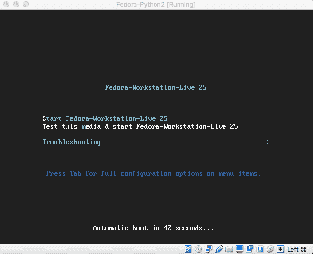

安装 Fedora

*   3.单击“_ 启动 _”按钮。
*   4.选择第一个选项“_ 启动 Fedora-Live-Workstation-Live 25_ ”，然后按 _ 确认 _ 键。
*   5.点击“ _Esc_ ”键跳过检查。
*   6.选择“_ 实时系统用户 _”。
*   7.选择“_ 安装到硬盘 _”。

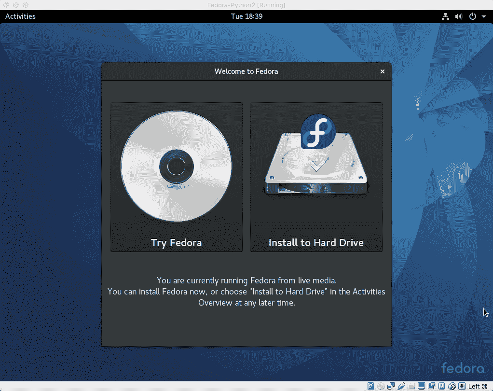

将 Fedora 安装到硬盘驱动器

*   8.完成“_ 语言选择 _”（英文）
*   9.完成“_ 安装目的地 _”（“ _ATA VBOX HARDDISK_ ”）。
    *   您可能需要等待一分钟才能让 VM 创建硬盘。

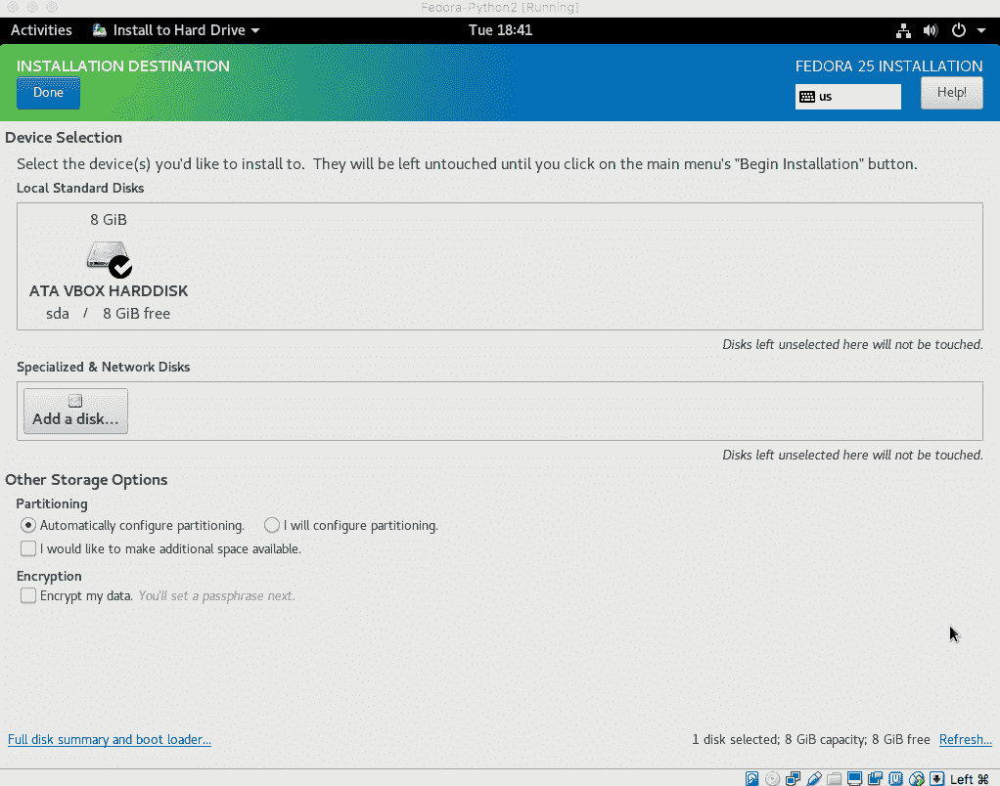

在虚拟硬盘上安装

*   10.单击“_ 开始安装 _”。
*   11.设置 root 密码。
*   12.为自己创建一个用户。
    *   记下用户名和密码（以便稍后使用）。
    *   勾选“_ 使该用户管理员 _”（这样您就可以安装软件）。

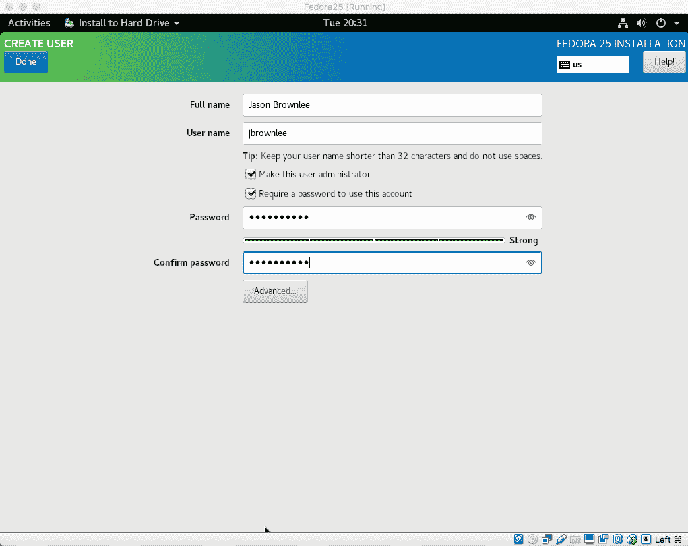

创建一个新用户

*   13.等待安装完成......（5 分钟？）
*   14.单击“_ 退出 _”，单击右上角的电源图标;选择关机。

### 2.4 完成 Fedora Linux 安装

已经安装了 Fedora Linux;让我们完成安装并准备好使用它。

*   1.在 VirtualBox 中选择 Fedora25 VM，在“ _Storage_ ”下，单击“ _Optical Drive_ ”。
    *   选择“_ 从虚拟驱动器 _ 中删除磁盘”以弹出 ISO 映像。
*   2.单击“ _Start_ ”按钮启动 Fedora Linux 安装。
*   3.以您创建的用户身份登录。

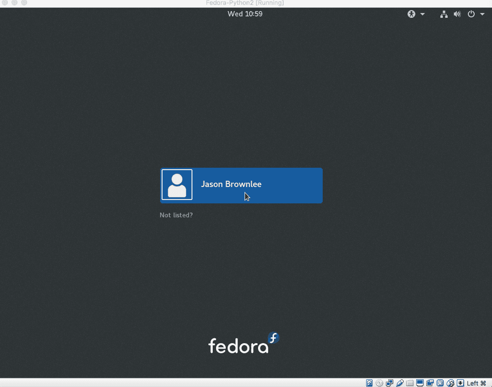

Fedora 以新用户身份登录

*   4.完成安装
    *   选择语言“_ 英语 _”
    *   点击“_ 下一个 _”
    *   选择键盘“ _US_ ”
    *   点击“_ 下一个 _”
    *   配置隐私
    *   点击“_ 下一个 _”
    *   连接您的在线帐户
    *   点击“_ 跳过 _”
    *   点击“_ 开始使用 Fedora_ ”
*   5.关闭自动启动的帮助系统。

我们现在有一个 Fedora Linux 虚拟机准备安装新软件。

## 3.安装 Python 机器学习环境

Fedora 使用 [Gnome 3](https://en.wikipedia.org/wiki/GNOME) 作为窗口管理器。

Gnome 3 与之前版本的 Gnome 完全不同;您可以使用内置帮助系统学习如何四处走动。

### 3.1 安装 Python 环境

让我们首先安装所需的 Python 库以进行机器学习开发。

*   1.打开终端。
    *   点击“_ 活动 _”
    *   输入“_ 终端 _”
    *   单击图标或按 Enter 键

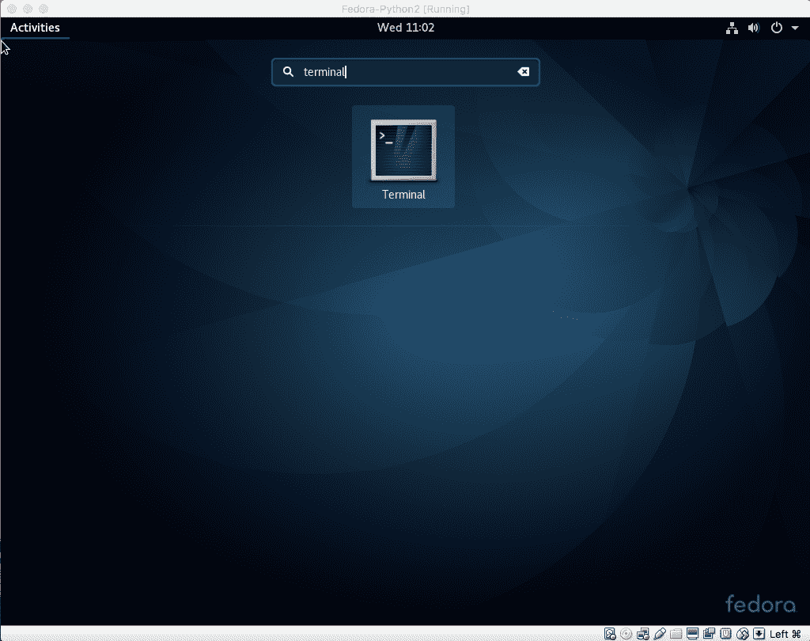

启动终端

*   2.确认已安装 Python3。

类型：

```
python3 --version
```

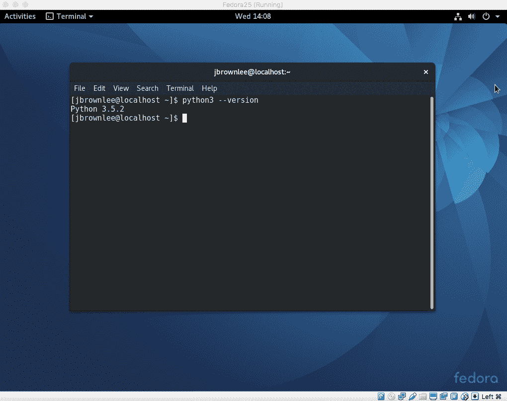

Python3 版本

*   3.安装 Python 机器学习环境。特别：
    *   NumPy 的
    *   SciPy 的
    *   熊猫
    *   Matplotlib
    *   Statsmodels
    *   Scikit-学习

[DNF](https://en.wikipedia.org/wiki/DNF_(software)) 是软件安装系统，正式为 yum。第一次运行 _dnf_ 时，它会更新软件包数据库，这可能需要一分钟。

Type:

```
sudo dnf install python3-numpy python3-scipy python3-scikit-learn python3-pandas python3-matplotlib python3-statsmodels
```

出现提示时输入密码。

按“ _y_ ”和“_ 进入 _”按钮提示确认安装。

### 3.2 确认 Python 环境

现在已经安装了环境，我们可以通过打印每个所需库的版本来确认它。

*   1.打开 Gedit。
    *   点击“_ 活动 _”
    *   输入“ _gedit_ ”
    *   单击图标或按 Enter 键
*   2.键入以下脚本并将其另存为主目录中的 _versions.py_ 。

```
# scipy
import scipy
print('scipy: %s' % scipy.__version__)
# numpy
import numpy
print('numpy: %s' % numpy.__version__)
# matplotlib
import matplotlib
print('matplotlib: %s' % matplotlib.__version__)
# pandas
import pandas
print('pandas: %s' % pandas.__version__)
# scikit-learn
import sklearn
print('sklearn: %s' % sklearn.__version__)
# statsmodels
import statsmodels
print('statsmodels: %s' % statsmodels.__version__)
```

没有复制粘贴支持;您可能希望在 VM 中打开 Firefox 并导航到此页面并将脚本复制粘贴到 Gedit 窗口中。

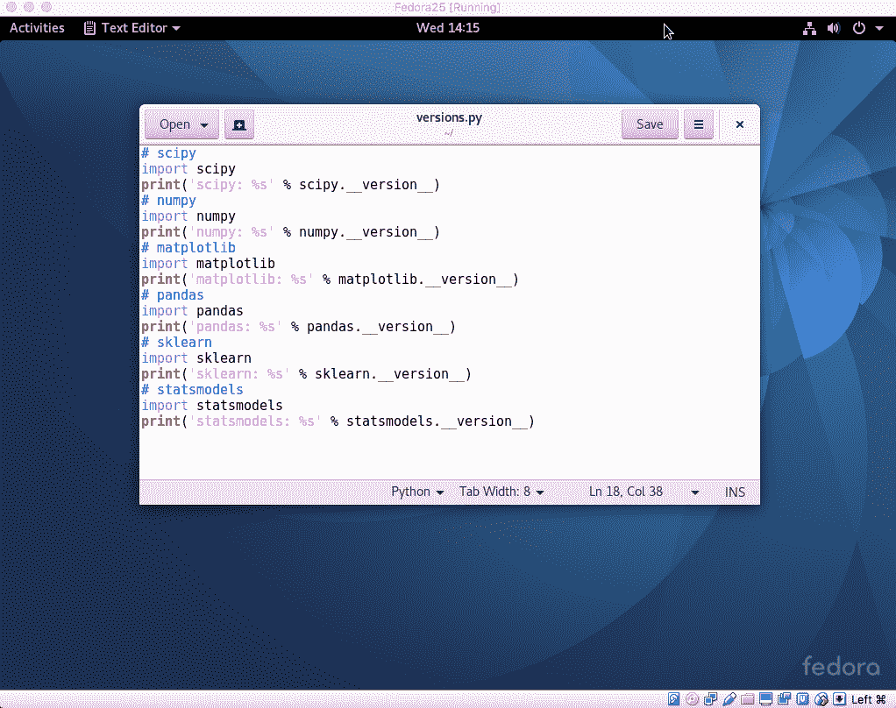

编写版本脚本

*   3.在终端中运行脚本。

Type:

```
python3 versions.py
```

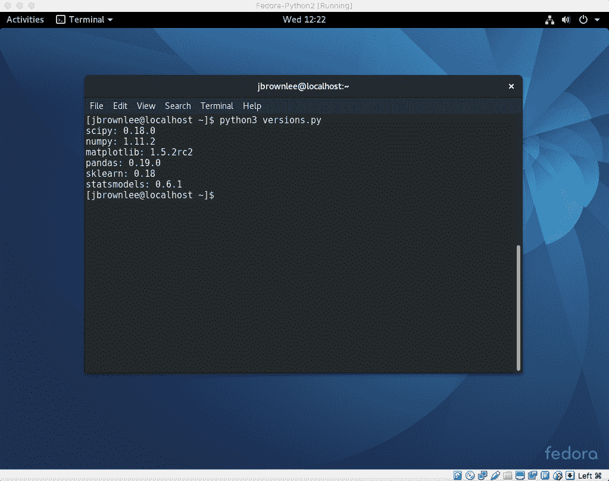

Python3 检查库版本

### 使用 VM 的提示

本节列出了使用 VM 进行机器学习开发的一些技巧。

*   **复制粘贴和文件夹共享**。这些功能需要在 Linux VM 中安装“ [Guest Additions](https://www.virtualbox.org/manual/ch04.html) ”。我无法正确安装，因此不使用这些功能。如果你愿意，你可以尝试;让我知道你在评论中的表现。
*   **使用 GitHub** 。我建议将所有代码存储在 GitHub 中，并检查 VM 中的代码。它使得代码和资产进出 VM 更加容易。
*   **使用 Sublime** 。我认为 sublime 是 Linux 上用于开发的优秀文本编辑器，至少比 Gedit 更好。
*   **将 AWS 用于大型作业**。您可以使用相同的步骤在 Amazon Web Services 上设置 Fedora Linux，以便在云中运行大型模型。
*   **VM Tools** 。您可以通过关闭窗口随时保存 VM。您还可以随时获取 VM 的快照并返回快照。如果要对文件系统进行大量更改，这将非常有用。
*   **Python2** 。您可以在 Linux 中轻松地将 Python2 与 Python 3 一起安装，并使用 python（而不是 python3）二进制文件或使用替代方法在两者之间切换。
*   **笔记本**。考虑在 VM 内部运行笔记本服务器并打开防火墙，以便可以从 VM 外部的主工作站连接和运行。

你有任何提示要分享吗？请在评论中告诉我。

## 进一步阅读

如果您不熟悉本教程中使用的工具，下面是一些可供进一步阅读的资源。

*   [VirtualBox 用户手册](https://www.virtualbox.org/manual/)
*   [Fedora 文档](https://docs.fedoraproject.org/en-US/index.html)
*   [Fedora Wiki](https://fedoraproject.org/wiki/Help) （关于常见主题的大量帮助）
*   [SciPy 主页](https://www.scipy.org/)
*   [Scikit-Learn Homepage](http://scikit-learn.org/)

## 摘要

在本教程中，您了解了如何为 Python 机器学习开发设置 Linux 虚拟机。

具体来说，你学到了：

*   如何下载和安装用于管理虚拟机的 VirtualBox 免费开源软件。
*   如何下载和安装 Fedora Linux，这是一个面向开发人员的友好 Linux 发行版。
*   如何安装和测试 Python3 环境以进行机器学习开发。

你完成了教程吗？
请在下面的评论中告诉我它是怎么回事。