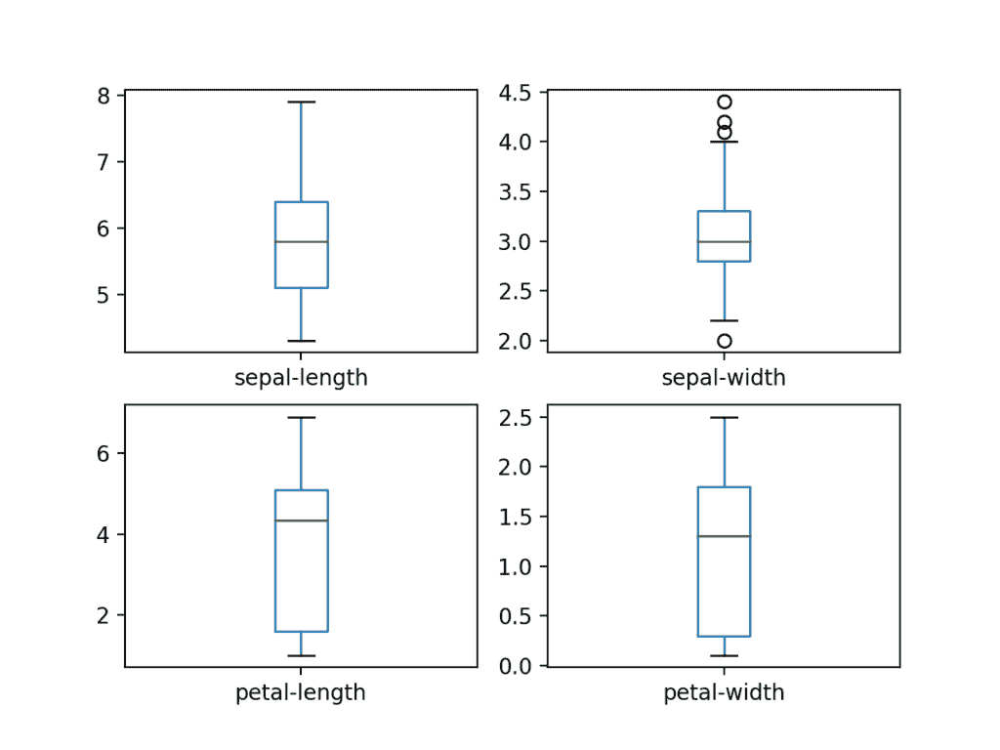
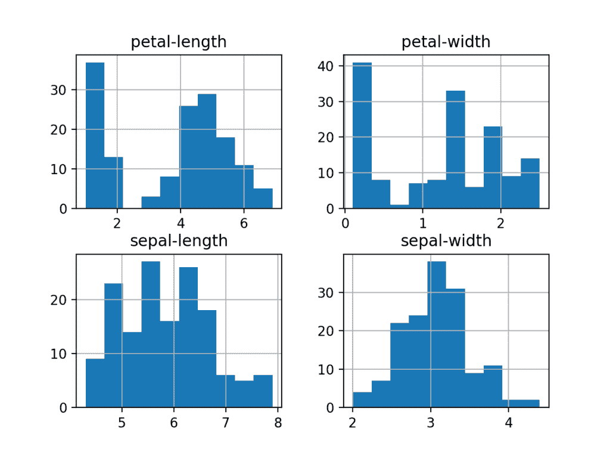
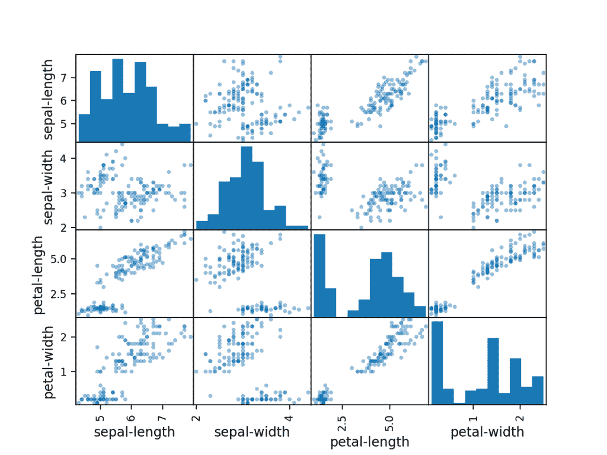
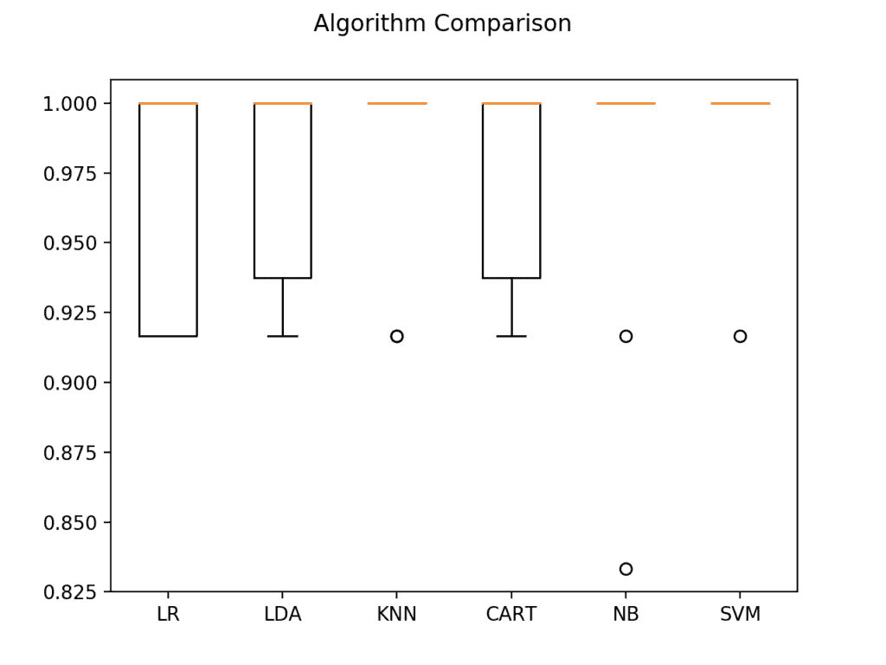

# 您在 Python 中的第一个机器学习项目循序渐进

> 原文： [https://machinelearningmastery.com/machine-learning-in-python-step-by-step/](https://machinelearningmastery.com/machine-learning-in-python-step-by-step/)

你想用 Python 做机器学习，但是你开始时遇到了麻烦吗？

在这篇文章中，您将使用 Python 完成您的第一个机器学习项目。

在本分步教程中，您将：

1.  下载并安装 Python SciPy 并获得最有用的 Python 机器学习包。
2.  加载数据集并使用统计摘要和数据可视化了解其结构。
3.  创建 6 个机器学习模型，挑选最佳并建立准确性可靠的信心。

如果您是一名机器学习初学者，并希望最终开始使用 Python，那么本教程就是为您设计的。

让我们开始吧！

*   **2017 年 1 月更新**：已更新，以反映版本 0.18 中 scikit-learn API 的更改。
*   **2017 年 3 月更新**：添加了帮助设置 Python 环境的链接。
*   **Update Apr / 2018** ：添加了一些有关随机性和预测的有用链接。
*   **Update Sep / 2018** ：由于 UCI 变得不可靠，添加了我自己托管的数据集版本的链接。
*   **2002 年 2 月更新**：更新以解决使用 SVM 和 Logistic 回归的 sklearn API 版本 0.20+的警告，还更新了结果和图表。


您在 Python 中的第一个机器学习项目循序渐进
照片由 [cosmoflash](https://www.flickr.com/photos/cosmoflash/2687052480/) ，保留一些权利。

## 如何在 Python 中启动机器学习？

学习机器学习的最好方法是设计和完成小项目。

### 入门时 Python 可能会令人生畏

Python 是一种流行且强大的解释语言。与 R 不同，Python 是一种完整的语言和平台，可用于研究和开发以及开发生产系统。

还有许多模块和库可供选择，提供了多种方法来完成每项任务。它可以感到压倒性的。

开始使用 Python 进行机器学习的最佳方法是完成一个项目。

*   它将强制您安装并启动 Python 解释器（至少）。
*   它将为您提供如何逐步完成小项目的鸟瞰图。
*   它会给你信心，也许会继续你自己的小项目。

### 初学者需要一个小型的端到端项目

书籍和课程令人沮丧。它们为您提供了大量的秘籍和片段，但您永远不会看到它们如何组合在一起。

当您将机器学习应用于您自己的数据集时，您正在处理一个项目。

机器学习项目可能不是线性的，但它有许多众所周知的步骤：

1.  定义问题。
2.  准备数据。
3.  评估算法。
4.  改善结果。
5.  目前的结果。

真正与新平台或工具达成协议的最佳方式是端到端地完成机器学习项目并涵盖关键步骤。即，从加载数据，汇总数据，评估算法和做出一些预测。

如果可以这样做，则可以使用可在数据集之后的数据集上使用的模板。一旦您更有信心，您可以填写差距，例如进一步的数据准备和改进结果任务。

### 你好机器学习世界

开始使用新工具的最佳小项目是虹膜花的分类（例如[虹膜数据集](https://archive.ics.uci.edu/ml/datasets/Iris)）。

这是一个很好的项目，因为它非常了解。

*   属性是数字，因此您必须弄清楚如何加载和处理数据。
*   这是一个分类问题，允许您练习一种更简单的监督学习算法。
*   这是一个多类别的分类问题（多名义），可能需要一些专门的处理。
*   它只有 4 个属性和 150 行，这意味着它很小，很容易适合内存（和屏幕或 A4 页面）。
*   所有数字属性都具有相同的单位和相同的比例，不需要任何特殊的缩放或变换即可开始。

让我们开始使用 Python 的 hello world 机器学习项目。

## Python 中的机器学习：循序渐进教程
（从这里开始）

在本节中，我们将通过端到端的小型机器学习项目进行工作。

以下是我们将要介绍的内容概述：

1.  安装 Python 和 SciPy 平台。
2.  加载数据集。
3.  总结数据集。
4.  可视化数据集。
5.  评估一些算法。
6.  做一些预测。

慢慢来。完成每个步骤。

尝试自己输入命令或复制并粘贴命令以加快速度。

如果您有任何疑问，请在帖子底部留言。

## 1.下载，安装和启动 Python SciPy

如果尚未安装，请在您的系统上安装 Python 和 SciPy 平台。

我不想详细介绍这个，因为其他人已经有了。这已经非常简单，特别是如果您是开发人员。如果您确实需要帮助，请在评论中提问。

### 1.1 安装 SciPy 库

本教程假定 Python 版本为 2.7 或 3.5+。

您需要安装 5 个密钥库。下面是本教程所需的 Python SciPy 库列表：

*   SciPy 的
*   numpy 的
*   matplotlib
*   大熊猫
*   sklearn

有许多方法可以安装这些库。我最好的建议是选择一种方法，然后在安装每个库时保持一致。

[scipy 安装页面](http://www.scipy.org/install.html)提供了在多个不同平台上安装上述库的优秀说明，例如 Linux，mac OS X 和 Windows。如果您有任何疑问或疑问，请参阅本指南，数千人已经关注。

*   在 Mac OS X 上，您可以使用 macport 来安装 Python 2.7 和这些库。有关 macports 的更多信息，[请参阅主页](https://www.macports.org/install.php)。
*   在 Linux 上，您可以使用您的包管理器，例如 Fedora 上的 yum 来安装 RPM。

如果你在 Windows 上或者你没有信心，我会建议你安装免费版的 [Anaconda](https://www.continuum.io/downloads) ，其中包括你需要的一切。

**注意**：本教程假设您安装了 scikit-learn 版本 0.18 或更高版本。

需要更多帮助？请参阅以下教程之一：

*   [如何使用 Anaconda 设置用于机器学习和深度学习的 Python 环境](http://machinelearningmastery.com/setup-python-environment-machine-learning-deep-learning-anaconda/)
*   [如何使用 Python 3](http://machinelearningmastery.com/linux-virtual-machine-machine-learning-development-python-3/) 为机器学习开发创建 Linux 虚拟机

### 1.2 启动 Python 并检查版本

确保您的 Python 环境已成功安装并按预期工作是一个好主意。

下面的脚本将帮助您测试您的环境。它导入本教程中所需的每个库并打印该版本。

打开命令行并启动 python 解释器：

```
python
```

我建议直接在解释器中工作或编写脚本并在命令行上运行它们，而不是大编辑器和 IDE。保持简单，专注于机器学习而不是工具链。

键入或复制并粘贴以下脚本：

```
# Check the versions of libraries

# Python version
import sys
print('Python: {}'.format(sys.version))
# scipy
import scipy
print('scipy: {}'.format(scipy.__version__))
# numpy
import numpy
print('numpy: {}'.format(numpy.__version__))
# matplotlib
import matplotlib
print('matplotlib: {}'.format(matplotlib.__version__))
# pandas
import pandas
print('pandas: {}'.format(pandas.__version__))
# scikit-learn
import sklearn
print('sklearn: {}'.format(sklearn.__version__))
```

这是我在 OS X 工作站上获得的输出：

```
Python: 3.6.8 (default, Dec 30 2018, 13:01:55) 
[GCC 4.2.1 Compatible Apple LLVM 9.1.0 (clang-902.0.39.2)]
scipy: 1.1.0
numpy: 1.15.4
matplotlib: 3.0.2
pandas: 0.23.4
sklearn: 0.20.2
```

将上述输出与您的版本进行比较。

理想情况下，您的版本应该匹配或更新。 API 不会快速更改，因此如果您只是背后的几个版本，请不要太担心，本教程中的所有内容很可能仍适用于您。

如果您收到错误，请停止。现在是时候解决它了。

如果您无法干净地运行上述脚本，则无法完成本教程。

我最好的建议是谷歌搜索你的错误信息或在 [Stack Exchange](http://stackoverflow.com/questions/tagged/python) 上发帖提问。

## 2.加载数据

我们将使用虹膜花数据集。这个数据集很有名，因为它几乎被所有人用作机器学习和统计中的“hello world”数据集。

该数据集包含 150 个鸢尾花的观察结果。以厘米为单位的花有四列测量值。第五列是观察到的花的种类。所有观察到的花属于三种物种之一。

您可以[在维基百科](https://en.wikipedia.org/wiki/Iris_flower_data_set)上了解有关此数据集的更多信息。

在此步骤中，我们将从 CSV 文件 URL 加载虹膜数据。

### 2.1 导入库

首先，让我们导入我们将在本教程中使用的所有模块，函数和对象。

```
# Load libraries
import pandas
from pandas.plotting import scatter_matrix
import matplotlib.pyplot as plt
from sklearn import model_selection
from sklearn.metrics import classification_report
from sklearn.metrics import confusion_matrix
from sklearn.metrics import accuracy_score
from sklearn.linear_model import LogisticRegression
from sklearn.tree import DecisionTreeClassifier
from sklearn.neighbors import KNeighborsClassifier
from sklearn.discriminant_analysis import LinearDiscriminantAnalysis
from sklearn.naive_bayes import GaussianNB
from sklearn.svm import SVC
```

一切都应该加载没有错误。如果您有错误，请停止。在继续之前，您需要一个有效的 SciPy 环境。请参阅上面有关设置环境的建议。

### 2.2 加载数据集

我们可以直接从 UCI 机器学习库加载数据。

我们正在使用 pandas 来加载数据。我们还将使用 pandas 来探索数据，包括描述性统计和数据可视化。

请注意，我们在加载数据时指定每列的名称。这将有助于我们以后探索数据。

```
# Load dataset
url = "https://raw.githubusercontent.com/jbrownlee/Datasets/master/iris.csv"
names = ['sepal-length', 'sepal-width', 'petal-length', 'petal-width', 'class']
dataset = pandas.read_csv(url, names=names)
```

数据集应该加载而不会发生意外。

如果确实存在网络问题，可以将 [iris.csv](https://raw.githubusercontent.com/jbrownlee/Datasets/master/iris.csv) 文件下载到工作目录中，并使用相同的方法加载它，将 URL 更改为本地文件名。

## 3.总结数据集

现在是时候看看数据了。

在这一步中，我们将以几种不同的方式来看看数据：

1.  数据集的维度。
2.  窥视数据本身。
3.  所有属性的统计摘要。
4.  按类变量细分数据。

别担心，每次查看数据都是一个命令。这些是有用的命令，您可以在将来的项目中反复使用这些命令。

### 3.1 数据集的维度

我们可以快速了解数据包含多少个实例（行）和多少属性（列）以及 shape 属性。

```
# shape
print(dataset.shape)
```

您应该看到 150 个实例和 5 个属性：

```
(150, 5)
```

### 3.2 查看数据

实际观察您的数据也是一个好主意。

```
# head
print(dataset.head(20))
```

您应该看到数据的前 20 行：

```
    sepal-length  sepal-width  petal-length  petal-width        class
0            5.1          3.5           1.4          0.2  Iris-setosa
1            4.9          3.0           1.4          0.2  Iris-setosa
2            4.7          3.2           1.3          0.2  Iris-setosa
3            4.6          3.1           1.5          0.2  Iris-setosa
4            5.0          3.6           1.4          0.2  Iris-setosa
5            5.4          3.9           1.7          0.4  Iris-setosa
6            4.6          3.4           1.4          0.3  Iris-setosa
7            5.0          3.4           1.5          0.2  Iris-setosa
8            4.4          2.9           1.4          0.2  Iris-setosa
9            4.9          3.1           1.5          0.1  Iris-setosa
10           5.4          3.7           1.5          0.2  Iris-setosa
11           4.8          3.4           1.6          0.2  Iris-setosa
12           4.8          3.0           1.4          0.1  Iris-setosa
13           4.3          3.0           1.1          0.1  Iris-setosa
14           5.8          4.0           1.2          0.2  Iris-setosa
15           5.7          4.4           1.5          0.4  Iris-setosa
16           5.4          3.9           1.3          0.4  Iris-setosa
17           5.1          3.5           1.4          0.3  Iris-setosa
18           5.7          3.8           1.7          0.3  Iris-setosa
19           5.1          3.8           1.5          0.3  Iris-setosa
```

### 3.3 统计摘要

现在我们可以看一下每个属性的摘要。

这包括计数，平均值，最小值和最大值以及一些百分位数。

```
# descriptions
print(dataset.describe())
```

我们可以看到所有数值都具有相同的比例（厘米）和 0 到 8 厘米之间的相似范围。

```
       sepal-length  sepal-width  petal-length  petal-width
count    150.000000   150.000000    150.000000   150.000000
mean       5.843333     3.054000      3.758667     1.198667
std        0.828066     0.433594      1.764420     0.763161
min        4.300000     2.000000      1.000000     0.100000
25%        5.100000     2.800000      1.600000     0.300000
50%        5.800000     3.000000      4.350000     1.300000
75%        6.400000     3.300000      5.100000     1.800000
max        7.900000     4.400000      6.900000     2.500000
```

### 3.4 类分布

现在让我们看一下属于每个类的实例（行）数。我们可以将其视为绝对计数。

```
# class distribution
print(dataset.groupby('class').size())
```

我们可以看到每个类具有相同数量的实例（数据集的 50％或 33％）。

```
class
Iris-setosa        50
Iris-versicolor    50
Iris-virginica     50
```

## 4.数据可视化

我们现在对数据有一个基本的想法。我们需要通过一些可视化来扩展它。

我们将看两种类型的图：

1.  单变量图可以更好地理解每个属性。
2.  多变量图可以更好地理解属性之间的关系。

### 4.1 单变量图

我们从一些单变量图开始，即每个变量的图。

鉴于输入变量是数字，我们可以创建每个的框和晶须图。

```
# box and whisker plots
dataset.plot(kind='box', subplots=True, layout=(2,2), sharex=False, sharey=False)
plt.show()
```

这使我们更清楚地了解输入属性的分布：



鸢尾花数据集的每个输入变量的框和晶须图

我们还可以创建每个输入变量的直方图，以了解分布。

```
# histograms
dataset.hist()
plt.show()
```

看起来可能有两个输入变量具有高斯分布。这很有用，因为我们可以使用可以利用这个假设的算法。



鸢尾花数据集的每个输入变量的直方图

### 4.2 多变量图

现在我们可以看看变量之间的相互作用。

首先，让我们看一下所有属性对的散点图。这有助于发现输入变量之间的结构化关系。

```
# scatter plot matrix
scatter_matrix(dataset)
plt.show()
```

注意一些属性对的对角分组。这表明高度相关性和可预测的关系。



鸢尾花数据集的每个输入变量的散点图矩阵

## 5.评估一些算法

现在是时候创建一些数据模型并估计它们对看不见的数据的准确性。

以下是我们将在此步骤中介绍的内容：

1.  分离出验证数据集。
2.  设置测试工具以使用 10 倍交叉验证。
3.  建立 5 种不同的模型来预测花卉测量的物种
4.  选择最佳型号。

### 5.1 创建验证数据集

我们需要知道我们创建的模型是好的。

稍后，我们将使用统计方法来估计我们在看不见的数据上创建的模型的准确性。我们还希望通过对实际看不见的数据进行评估，对未见数据的最佳模型的准确性进行更具体的估计。

也就是说，我们将阻止算法无法看到的一些数据，我们将使用这些数据来获得关于最佳模型实际精确度的第二个独立概念。

我们将加载的数据集分成两部分，其中 80％将用于训练我们的模型，20％我们将作为验证数据集。

```
# Split-out validation dataset
array = dataset.values
X = array[:,0:4]
Y = array[:,4]
validation_size = 0.20
seed = 7
X_train, X_validation, Y_train, Y_validation = model_selection.train_test_split(X, Y, test_size=validation_size, random_state=seed)
```

您现在在 _X_train_ 和 _Y_train_ 中有训练数据用于准备模型， _X_validation_ 和 _Y_validation_ 设置我们以后可以使用。

请注意，我们使用 python 切片来选择 NumPy 数组中的列。如果这对您来说是新手，您可能需要查看此帖子：

*   [如何在 Python 中为机器学习索引，切片和重塑 NumPy 数组](https://machinelearningmastery.com/index-slice-reshape-numpy-arrays-machine-learning-python/)

### 5.2 测试线束

我们将使用 10 倍交叉验证来估计准确性。

这会将我们的数据集分成 10 个部分，在 9 上训练并在 1 上进行测试，并重复列车测试分割的所有组合。

```
# Test options and evaluation metric
seed = 7
scoring = 'accuracy'
```

具体随机种子无关紧要，请在此处了解有关伪随机数生成器的更多信息：

*   [Python 机器学习随机数生成器简介](https://machinelearningmastery.com/introduction-to-random-number-generators-for-machine-learning/)

我们使用'_ 准确度 _'的度量来评估模型。这是正确预测的实例数除以数据集中实例总数乘以 100 得到百分比（例如 95％准确）的比率。我们将在运行构建时使用 _ 评分 _ 变量，然后评估每个模型。

### 5.3 构建模型

我们不知道哪个算法可以解决此问题或使用哪些配置。我们从图中得出一个概念，即某些类在某些维度上可以部分线性分离，因此我们期望得到普遍良好的结果。

让我们评估 6 种不同的算法：

*   Logistic 回归（LR）
*   线性判别分析（LDA）
*   K-Nearest Neighbors（KNN）。
*   分类和回归树（CART）。
*   高斯朴素贝叶斯（NB）。
*   支持向量机（SVM）。

这是简单线性（LR 和 LDA），非线性（KNN，CART，NB 和 SVM）算法的良好混合。我们在每次运行之前重置随机数种子，以确保使用完全相同的数据分割执行每个算法的评估。它确保结果可直接比较。

让我们构建和评估我们的模型：

```
# Spot Check Algorithms
models = []
models.append(('LR', LogisticRegression(solver='liblinear', multi_class='ovr')))
models.append(('LDA', LinearDiscriminantAnalysis()))
models.append(('KNN', KNeighborsClassifier()))
models.append(('CART', DecisionTreeClassifier()))
models.append(('NB', GaussianNB()))
models.append(('SVM', SVC(gamma='auto')))
# evaluate each model in turn
results = []
names = []
for name, model in models:
	kfold = model_selection.KFold(n_splits=10, random_state=seed)
	cv_results = model_selection.cross_val_score(model, X_train, Y_train, cv=kfold, scoring=scoring)
	results.append(cv_results)
	names.append(name)
	msg = "%s: %f (%f)" % (name, cv_results.mean(), cv_results.std())
	print(msg)
```

### 5.4 选择最佳模型

我们现在有 6 个模型和精度估计。我们需要将模型相互比较并选择最准确的模型。

运行上面的示例，我们得到以下原始结果：

```
LR: 0.966667 (0.040825)
LDA: 0.975000 (0.038188)
KNN: 0.983333 (0.033333)
CART: 0.975000 (0.038188)
NB: 0.975000 (0.053359)
SVM: 0.991667 (0.025000)
```

请注意，您的结果可能会有所不同。有关详细信息，请参阅帖子：

*   [在机器学习中拥抱随机性](https://machinelearningmastery.com/randomness-in-machine-learning/)

在这种情况下，我们可以看到支持向量机（SVM）看起来具有最大的估计准确度分数。

我们还可以创建模型评估结果的图表，并比较每个模型的传播和平均准确度。每种算法都有一组精确度测量值，因为每种算法都被评估了 10 次（10 次交叉验证）。

```
# Compare Algorithms
fig = plt.figure()
fig.suptitle('Algorithm Comparison')
ax = fig.add_subplot(111)
plt.boxplot(results)
ax.set_xticklabels(names)
plt.show()
```

您可以看到盒子和须状图在该范围的顶部被压扁，许多样品达到 100％的准确度。



鸢尾花数据集上的盒子和晶须图比较机器学习算法

## 6.做出预测

KNN 算法非常简单，是基于我们测试的精确模型。现在我们想要了解模型在验证集上的准确性。

这将使我们对最佳模型的准确性进行独立的最终检查。保留验证集非常有用，以防您在训练过程中出现问题，例如过度拟合训练集或数据泄漏。两者都会导致过于乐观的结果。

我们可以直接在验证集上运行 KNN 模型，并将结果汇​​总为最终准确度分数，[混淆矩阵](http://machinelearningmastery.com/confusion-matrix-machine-learning/)和分类报告。

```
# Make predictions on validation dataset
knn = KNeighborsClassifier()
knn.fit(X_train, Y_train)
predictions = knn.predict(X_validation)
print(accuracy_score(Y_validation, predictions))
print(confusion_matrix(Y_validation, predictions))
print(classification_report(Y_validation, predictions))
```

我们可以看到精度为 0.9 或 90％。混淆矩阵提供了三个错误的指示。最后，分类报告按精度，召回，f1 分数和支持显示每个类别的细分，显示出优异的结果（授予验证数据集很小）。

```
0.9
[[ 7  0  0]
 [ 0 11  1]
 [ 0  2  9]]
                 precision    recall  f1-score   support

    Iris-setosa       1.00      1.00      1.00         7
Iris-versicolor       0.85      0.92      0.88        12
 Iris-virginica       0.90      0.82      0.86        11

      micro avg       0.90      0.90      0.90        30
      macro avg       0.92      0.91      0.91        30
   weighted avg       0.90      0.90      0.90        30
```

您可以在此处了解有关如何进行预测和预测概率的更多信息：

*   [如何用 scikit-learn](https://machinelearningmastery.com/make-predictions-scikit-learn/) 进行预测

## 你可以用 Python 做机器学习

完成上面的教程。最多需要 5 到 10 分钟！

**你不需要了解一切**。 （至少现在不是）您的目标是端到端地完成教程并获得结果。您无需了解第一遍的所有内容。随时记下您的问题。在 Python 中大量使用 _ 帮助（“FunctionName”）_ 帮助语法来了解您正在使用的所有函数。

**你不需要知道算法如何工作**。了解限制以及如何配置机器学习算法非常重要。但是学习算法可以在以后学习。您需要在很长一段时间内慢慢构建此算法知识。今天，首先要熟悉平台。

**你不需要成为 Python 程序员**。如果您是新手，Python 语言的语法可以很直观。与其他语言一样，重点关注函数调用（例如 _ 函数（）_）和赋值（例如 _a =“b”_）。这将帮助您完成大部分工作。您是一名开发人员，您知道如何快速掌握语言的基础知识。刚开始并稍后深入了解细节。

**您不需要成为机器学习专家**。您可以稍后了解各种算法的优点和局限性，有很多帖子可供您稍后阅读，以了解机器学习项目的步骤以及使用交叉验证评估准确性的重要性。

**机器学习项目**中的其他步骤怎么样？我们没有涵盖机器学习项目中的所有步骤，因为这是您的第一个项目，我们需要关注关键步骤。即，加载数据，查看数据，评估一些算法并做出一些预测。在后面的教程中，我们可以查看其他数据准备和结果改进任务。

## 摘要

在这篇文章中，您逐步了解了如何使用 Python 完成第一个机器学习项目。

您发现完成一个小型端到端项目从加载数据到进行预测是熟悉新平台的最佳方式。

### 你的下一步

你是否完成了本教程？

1.  完成上面的教程。
2.  列出您的任何问题。
3.  搜索或研究答案。
4.  请记住，您可以使用 Python 中的 _ 帮助（“FunctionName”）_ 来获取任何函数的帮助。

你有问题吗？
在下面的评论中发布。