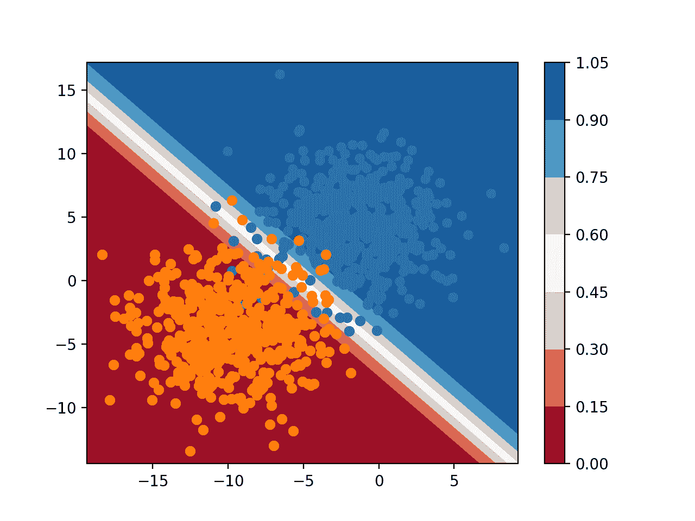

# 使用 Python 绘制机器学习算法的决策表面

> 原文：<https://machinelearningmastery.com/plot-a-decision-surface-for-machine-learning/>

最后更新于 2020 年 8 月 26 日

分类算法学习如何给例子分配类标签，尽管它们的决策可能看起来不透明。

理解分类算法所做决策的一个流行诊断是**决策表面**。这是一个曲线图，显示了拟合机器学习算法如何预测输入特征空间上的粗糙网格。

决策表面图是一个强大的工具，用于了解给定模型“*”如何看待*”预测任务，以及它如何决定按类别标签划分输入特征空间。

在本教程中，您将发现如何为分类机器学习算法绘制决策图。

完成本教程后，您将知道:

*   决策表面是一种诊断工具，用于了解分类算法如何划分特征空间。
*   如何为机器学习算法绘制使用清晰类标签的决策图？
*   如何使用预测概率绘制和解释决策表面？

**用我的新书[Python 机器学习精通](https://machinelearningmastery.com/machine-learning-with-python/)启动你的项目**，包括*分步教程*和所有示例的 *Python 源代码*文件。

我们开始吧。


用 Python 绘制机器学习算法的决策图
图片由[托尼·韦伯斯特](https://flickr.com/photos/diversey/15398123174/)提供，保留部分权利。

## 教程概述

本教程分为三个部分；它们是:

1.  决策表面
2.  数据集和模型
3.  绘制决策图

## 决策表面

分类机器学习算法学习给输入示例分配标签。

考虑用于定义连续输入特征空间的分类任务的数字输入特征。

我们可以考虑在特征空间上定义轴或尺寸的每个输入特征。两个输入要素将定义一个平面要素空间，点代表输入空间中的输入坐标。如果有三个输入变量，特征空间将是三维体积。

空间中的每个点都可以分配一个类别标签。就二维特征空间而言，我们可以认为刨子上的每个点根据其指定的类别具有不同的颜色。

分类算法的目标是学习如何划分特征空间，以便将标签正确分配给特征空间中的点，或者至少尽可能正确。

这是对分类预测建模的一个有用的几何理解。我们可以更进一步。

一旦分类机器学习算法划分了一个特征空间，我们就可以在任意网格上对特征空间中的每个点进行分类，从而了解算法选择如何划分特征空间。

这被称为**决策表面**或**决策边界**，它为理解分类预测建模任务上的模型提供了诊断工具。

虽然“*表面*的概念暗示了二维特征空间，但是该方法可以用于具有多于二维的特征空间，其中为每对输入特征创建表面。

现在我们已经熟悉了什么是决策表面，接下来，让我们定义一个数据集和模型，稍后我们将探索决策表面。

## 数据集和模型

在本节中，我们将定义一个分类任务和预测模型来学习该任务。

### 综合分类数据集

我们可以使用 [make_blobs() Sklearn 函数](https://Sklearn.org/stable/modules/generated/sklearn.datasets.make_blobs.html)定义一个分类任务，该分类任务具有一个二维类数值特征空间，每个点被分配两个类标签中的一个，例如二进制分类任务。

```py
...
# generate dataset
X, y = make_blobs(n_samples=1000, centers=2, n_features=2, random_state=1, cluster_std=3)
```

一旦定义，我们就可以创建特征空间的散点图，第一个特征定义 x 轴，第二个特征定义 y 轴，每个样本表示为特征空间中的一个点。

然后，我们可以根据散点图中的点的类别标签将它们着色为 0 或 1。

```py
...
# create scatter plot for samples from each class
for class_value in range(2):
	# get row indexes for samples with this class
	row_ix = where(y == class_value)
	# create scatter of these samples
	pyplot.scatter(X[row_ix, 0], X[row_ix, 1])
# show the plot
pyplot.show()
```

下面列出了定义和绘制综合分类数据集的完整示例。

```py
# generate binary classification dataset and plot
from numpy import where
from matplotlib import pyplot
from sklearn.datasets import make_blobs
# generate dataset
X, y = make_blobs(n_samples=1000, centers=2, n_features=2, random_state=1, cluster_std=3)
# create scatter plot for samples from each class
for class_value in range(2):
	# get row indexes for samples with this class
	row_ix = where(y == class_value)
	# create scatter of these samples
	pyplot.scatter(X[row_ix, 0], X[row_ix, 1])
# show the plot
pyplot.show()
```

运行该示例会创建数据集，然后将数据集绘制为散点图，其中的点由类标签着色。

我们可以看到这两个类的例子之间有明显的区别，我们可以想象机器学习模型如何画一条线来区分这两个类，例如，也许一条对角线正好穿过这两组的中间。


基于 2D 特征空间的二值分类数据集散点图

### 拟合分类预测模型

我们现在可以在数据集上拟合一个模型。

在这种情况下，我们将拟合逻辑回归算法，因为我们可以预测清晰的类标签和概率，这两者都可以在我们的决策表面中使用。

我们可以定义模型，然后将其拟合到训练数据集中。

```py
...
# define the model
model = LogisticRegression()
# fit the model
model.fit(X, y)
```

一旦定义，我们可以使用该模型对训练数据集进行预测，以了解它在划分训练数据集的特征空间和分配标签方面的学习程度。

```py
...
# make predictions
yhat = model.predict(X)
```

可以使用分类精确率来评估预测。

```py
...
# evaluate the predictions
acc = accuracy_score(y, yhat)
print('Accuracy: %.3f' % acc)
```

将这些联系在一起，下面列出了在合成二进制分类数据集上拟合和评估模型的完整示例。

```py
# example of fitting and evaluating a model on the classification dataset
from sklearn.datasets import make_blobs
from sklearn.linear_model import LogisticRegression
from sklearn.metrics import accuracy_score
# generate dataset
X, y = make_blobs(n_samples=1000, centers=2, n_features=2, random_state=1, cluster_std=3)
# define the model
model = LogisticRegression()
# fit the model
model.fit(X, y)
# make predictions
yhat = model.predict(X)
# evaluate the predictions
acc = accuracy_score(y, yhat)
print('Accuracy: %.3f' % acc)
```

运行该示例符合模型，并对每个示例进行预测。

**注**:考虑到算法或评估程序的随机性，或数值精确率的差异，您的[结果可能会有所不同](https://machinelearningmastery.com/different-results-each-time-in-machine-learning/)。考虑运行该示例几次，并比较平均结果。

在这种情况下，我们可以看到该模型实现了大约 97.2%的表现。

```py
Accuracy: 0.972
```

现在我们已经有了数据集和模型，让我们来探索如何开发决策表面。

## 绘制决策图

我们可以通过在训练数据集上拟合一个模型来创建一个决策表面，然后使用该模型对输入域中的值网格进行预测。

一旦我们有了预测网格，我们就可以绘制值和它们的类标签。

如果采用足够精细的网格，可以使用散点图。更好的方法是使用等高线图，它可以在点之间插入颜色。

可以使用 [contourf() Matplotlib 功能](https://matplotlib.org/api/_as_gen/matplotlib.pyplot.contourf.html)。

这需要几个步骤。

首先，我们需要定义一个跨越特征空间的点网格。

为此，我们可以找到每个要素的最小值和最大值，并将网格扩展一步，以确保覆盖整个要素空间。

```py
...
# define bounds of the domain
min1, max1 = X[:, 0].min()-1, X[:, 0].max()+1
min2, max2 = X[:, 1].min()-1, X[:, 1].max()+1
```

然后，我们可以使用[保证()函数](https://docs.scipy.org/doc/numpy/reference/generated/numpy.arange.html)以选定的分辨率在每个维度上创建一个统一的样本。在这种情况下，我们将使用 0.1 的分辨率。

```py
...
# define the x and y scale
x1grid = arange(min1, max1, 0.1)
x2grid = arange(min2, max2, 0.1)
```

现在我们需要把它变成一个网格。

我们可以使用 [meshgrid() NumPy 函数](https://docs.scipy.org/doc/numpy/reference/generated/numpy.meshgrid.html)从这两个向量创建一个网格。

如果第一个特征 x1 是特征空间的 x 轴，那么对于 y 轴上的每个点，我们需要一行网格的 x1 值。

同样，如果我们将 x2 作为特征空间的 y 轴，那么我们需要 x 轴上每个点的一列 x2 值。

*meshgrid()* 函数会为我们完成这个操作，根据需要为我们复制行和列。它为两个输入向量返回两个网格。x 值的第一个网格和 y 值的第二个网格，在要素空间中以适当大小的行和列网格组织。

```py
...
# create all of the lines and rows of the grid
xx, yy = meshgrid(x1grid, x2grid)
```

然后我们需要展平网格来创建样本，我们可以将这些样本输入模型并进行预测。

为此，首先，我们将每个网格展平为一个向量。

```py
...
# flatten each grid to a vector
r1, r2 = xx.flatten(), yy.flatten()
r1, r2 = r1.reshape((len(r1), 1)), r2.reshape((len(r2), 1))
```

然后，我们将向量作为输入数据集中的列并排堆叠，例如，像我们的原始训练数据集一样，但分辨率要高得多。

```py
...
# horizontal stack vectors to create x1,x2 input for the model
grid = hstack((r1,r2))
```

然后，我们可以将其输入到我们的模型中，并获得网格中每个点的预测。

```py
...
# make predictions for the grid
yhat = model.predict(grid)
# reshape the predictions back into a grid
```

目前为止，一切顺利。

正如我们的模型所预测的那样，我们有一个跨越要素空间和类标签的值网格。

接下来，我们需要将数值网格绘制为等高线图。

[contourf()函数](https://matplotlib.org/api/_as_gen/matplotlib.pyplot.contourf.html)为每个轴取单独的网格，就像我们之前调用 *meshgrid()* 返回的一样。太好了。

所以我们可以使用之前准备的 *xx* 和 *yy* ，简单的将模型中的预测( *yhat* )重塑成相同的形状。

```py
...
# reshape the predictions back into a grid
zz = yhat.reshape(xx.shape)
```

然后，我们用双色色图绘制决策表面。

```py
...
# plot the grid of x, y and z values as a surface
pyplot.contourf(xx, yy, zz, cmap='Paired')
```

然后，我们可以在顶部绘制数据集的实际点，以查看它们被逻辑回归决策表面分隔的程度。

下面列出了在我们的合成二进制分类数据集上绘制逻辑回归模型决策表面的完整示例。

```py
# decision surface for logistic regression on a binary classification dataset
from numpy import where
from numpy import meshgrid
from numpy import arange
from numpy import hstack
from sklearn.datasets import make_blobs
from sklearn.linear_model import LogisticRegression
from matplotlib import pyplot
# generate dataset
X, y = make_blobs(n_samples=1000, centers=2, n_features=2, random_state=1, cluster_std=3)
# define bounds of the domain
min1, max1 = X[:, 0].min()-1, X[:, 0].max()+1
min2, max2 = X[:, 1].min()-1, X[:, 1].max()+1
# define the x and y scale
x1grid = arange(min1, max1, 0.1)
x2grid = arange(min2, max2, 0.1)
# create all of the lines and rows of the grid
xx, yy = meshgrid(x1grid, x2grid)
# flatten each grid to a vector
r1, r2 = xx.flatten(), yy.flatten()
r1, r2 = r1.reshape((len(r1), 1)), r2.reshape((len(r2), 1))
# horizontal stack vectors to create x1,x2 input for the model
grid = hstack((r1,r2))
# define the model
model = LogisticRegression()
# fit the model
model.fit(X, y)
# make predictions for the grid
yhat = model.predict(grid)
# reshape the predictions back into a grid
zz = yhat.reshape(xx.shape)
# plot the grid of x, y and z values as a surface
pyplot.contourf(xx, yy, zz, cmap='Paired')
# create scatter plot for samples from each class
for class_value in range(2):
	# get row indexes for samples with this class
	row_ix = where(y == class_value)
	# create scatter of these samples
	pyplot.scatter(X[row_ix, 0], X[row_ix, 1], cmap='Paired')
# show the plot
pyplot.show()
```

运行该示例符合模型，并使用它来预测整个要素空间的值网格的结果，并将结果绘制为等高线图。

我们可以看到，正如我们可能已经怀疑的那样，逻辑回归使用直线划分特征空间。毕竟是线性模型；这是它能做的一切。

创建一个决策表几乎就像魔术一样。它提供了模型如何学习任务的即时和有意义的洞察。

**尝试不同的算法，比如 SVM 或决策树。**
在下面的评论中发布你的地图作为链接！


二元分类任务的逻辑回归决策表面

我们可以通过使用模型来预测概率而不是类标签来增加决策表面的深度。

```py
...
# make predictions for the grid
yhat = model.predict_proba(grid)
# keep just the probabilities for class 0
yhat = yhat[:, 0]
```

绘制时，我们可以看到要素空间中的每个点属于每个类别标签的置信度或可能性，如模型所示。

我们可以使用一个[不同的颜色图](https://matplotlib.org/tutorials/colors/colormaps.html)，它有层次，并显示一个图例，这样我们就可以解释颜色。

```py
...
# plot the grid of x, y and z values as a surface
c = pyplot.contourf(xx, yy, zz, cmap='RdBu')
# add a legend, called a color bar
pyplot.colorbar(c)
```

下面列出了使用概率创建决策表面的完整示例。

```py
# probability decision surface for logistic regression on a binary classification dataset
from numpy import where
from numpy import meshgrid
from numpy import arange
from numpy import hstack
from sklearn.datasets import make_blobs
from sklearn.linear_model import LogisticRegression
from matplotlib import pyplot
# generate dataset
X, y = make_blobs(n_samples=1000, centers=2, n_features=2, random_state=1, cluster_std=3)
# define bounds of the domain
min1, max1 = X[:, 0].min()-1, X[:, 0].max()+1
min2, max2 = X[:, 1].min()-1, X[:, 1].max()+1
# define the x and y scale
x1grid = arange(min1, max1, 0.1)
x2grid = arange(min2, max2, 0.1)
# create all of the lines and rows of the grid
xx, yy = meshgrid(x1grid, x2grid)
# flatten each grid to a vector
r1, r2 = xx.flatten(), yy.flatten()
r1, r2 = r1.reshape((len(r1), 1)), r2.reshape((len(r2), 1))
# horizontal stack vectors to create x1,x2 input for the model
grid = hstack((r1,r2))
# define the model
model = LogisticRegression()
# fit the model
model.fit(X, y)
# make predictions for the grid
yhat = model.predict_proba(grid)
# keep just the probabilities for class 0
yhat = yhat[:, 0]
# reshape the predictions back into a grid
zz = yhat.reshape(xx.shape)
# plot the grid of x, y and z values as a surface
c = pyplot.contourf(xx, yy, zz, cmap='RdBu')
# add a legend, called a color bar
pyplot.colorbar(c)
# create scatter plot for samples from each class
for class_value in range(2):
	# get row indexes for samples with this class
	row_ix = where(y == class_value)
	# create scatter of these samples
	pyplot.scatter(X[row_ix, 0], X[row_ix, 1], cmap='Paired')
# show the plot
pyplot.show()
```

运行该示例可以预测要素空间中网格上每个点的类成员概率，并绘制结果图。

在这里，我们可以看到，给定特征空间的那个区域中的采样噪声，模型在域的中间附近是不确定的(较浅的颜色)。我们还可以看到，模型在域的左下半部分和右上半部分非常自信(全彩)。

总之，清晰的类和概率决策表面是强大的诊断工具，有助于理解您的模型以及它如何为您的预测建模任务划分特征空间。



二元分类任务逻辑回归的概率决策表面

## 进一步阅读

如果您想更深入地了解这个主题，本节将提供更多资源。

*   [matplot lib . pyplot . contour API](https://matplotlib.org/api/_as_gen/matplotlib.pyplot.contourf.html)。
*   [Matplotlib 彩色地图](https://matplotlib.org/tutorials/colors/colormaps.html)
*   num py . mesh grid API。
*   [在虹膜数据集上绘制决策树的决策表面，sklearn 示例](https://Sklearn.org/stable/auto_examples/tree/plot_iris_dtc.html)。

## 摘要

在本教程中，您发现了如何为分类机器学习算法绘制决策图。

具体来说，您了解到:

*   决策表面是一种诊断工具，用于了解分类算法如何划分特征空间。
*   如何为机器学习算法绘制使用清晰类标签的决策图？
*   如何使用预测概率绘制和解释决策表面？

**你有什么问题吗？**
在下面的评论中提问，我会尽力回答。