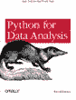

# 使用 Pandas 为 Python 中的机器学习准备数据

> 原文： [https://machinelearningmastery.com/prepare-data-for-machine-learning-in-python-with-pandas/](https://machinelearningmastery.com/prepare-data-for-machine-learning-in-python-with-pandas/)

如果您使用 Python 堆栈来学习和应用机器学习，那么您将要用于数据分析和数据操作的库是 Pandas。

这篇文章为您提供了熊猫库的快速介绍，并指出了正确的入门方向。

用于数据分析的熊猫。
照 [gzlu](https://www.flickr.com/photos/gzlu/7708872342) ，保留一些权利。

## Python 中的数据分析

Python SciPy 堆栈通常适用于科学计算。它提供了强大的库来处理网格数据（如 NumPy）和绘图（如 matplotlib）。直到最近，套件中缺少的一个部件才是处理数据的好库。

数据通常不是以易于使用的形式出现的。处理机器学习等数据驱动问题的很大一部分是数据分析和数据调整。

*   **数据分析**：这是使用统计和数据可视化等工具，通过了解数据来更好地理解问题。
*   **Data Munging** ：这是将原始数据转换为表格的过程，以便适合您的工作，如数据分析或机器学习。

传统上，您必须在 Python 中拼凑自己的脚本工具链来执行这些任务。

如今，如果您在 Python 中搜索数据分析，则无法避免了解 Pandas。它已迅速成为 Python 中数据处理的首选库。

## 什么是熊猫？

Pandas 是一个用于数据分析和数据操作的 Python 库。它将缺少的部分添加到 SciPy 框架以处理数据。

熊猫是由 [Wes McKinney](http://blog.wesmckinney.com/) 于 2008 年创建的，主要用于量化金融工作。因此，它在处理时间序列数据和图表方面具有坚实的基础。

您使用 Pandas 将数据加载到 Python 中并执行数据分析任务。它非常适合处理表格数据，如来自关系数据库的数据或来自电子表格的数据。

Wes 描述了 Pandas 对 crate 的看法：用于任何语言的最强大，最灵活的开源数据分析和操作工具。

如果只是为了让您自己的数据分析工作变得更容易，那么这项令人钦佩的任务就是让您想要支持他的事业。

## 熊猫特色

熊猫是一种乐趣。

根据我的经验，它简单，优雅，直观。来自 R，成语和操作是熟悉和相关的。

Pandas 构建在 SciPy 堆栈中的标准库之上。它使用 NumPy 进行快速数组处理，并为 StatsModels 的一些统计操作和 Matplotlib 的图表提供方便的包装。

鉴于库在金融领域的开始，人们非常关注时间序列。它还非常关注用于处理标准网格数据的数据帧。数据处理是此类库的核心要求，速度已成为优先事项。它速度快，提供数据结构和操作，如索引和稀疏性处理。

需要注意的一些重要功能包括“

*   **操纵**：移动列，切片，整形，合并，连接，过滤等。
*   **时间序列处理**：对日期/时间，重新采样，移动窗口和数据集自动对齐的操作。
*   **缺少数据处理**：自动排除，删除，替换，插入缺失值
*   **分组操作**：SQL like group by。
*   **分层索引**：数据结构级别，对按列有效组织数据非常有用。
*   **摘要统计**：快速而强大的数据汇总统计。
*   **可视化**：简化了对数据结构图的访问，例如直方图，箱形图，一般图和散点图。

Pandas 在许可许可证（Simplified BSD）下可用，并且可以与 SciPy 的其余部分一起轻松安装。

## 熊猫资源

这是对熊猫库的快速介绍，还有更多需要学习的内容。安装库，获取数据集并开始尝试。没有更好的入门方式。

访问 [Pandas 主页](http://pandas.pydata.org)并阅读库愿景和功能。您也可以查看项目的 [github 页面](https://github.com/pydata/pandas)。

一个很好的起点是[教程列表](http://pandas.pydata.org/pandas-docs/stable/tutorials.html)，其中包括指向网络上的烹饪书，课程和各种着名的 IPython 笔记本的链接。

最后，对我来说，我住在 [API 文档](http://pandas.pydata.org/pandas-docs/stable/api.html)中。

### 文件

我发现论文可以很好地概述开源库，特别是在 Python 和 R 生态系统中。请查看以下论文，了解熊猫的全部内容。

*   [Python 中统计计算的数据结构](http://scholar.google.com/scholar?hl=en&q=Data+Structures+for+Statistical+Computing+in+Python)
*   [pandas：用于数据分析和统计的基础 Python 库](http://scholar.google.com/scholar?q=pandas%3A+a+Foundational+Python+Library+for+Data+Analysis+and+Statistics)

### 影片

YouTube 上有很多关于人们在自己的数据和会议上展示 Pandas 的精彩视频。

一个很好的起点是 Wes 自己 [10 分钟的熊猫之旅](http://vimeo.com/59324550)。看一看。这是一个很小的时间序列数据，但它是一个伟大而快速的概述。您还可以查看他的 [IPython 笔记本进行本次巡演](http://nbviewer.ipython.org/urls/gist.github.com/wesm/4757075/raw/a72d3450ad4924d0e74fb57c9f62d1d895ea4574/PandasTour.ipynb)。

### 图书

 最后，Wes 是 Python 中关于数据分析的权威书籍的作者。如果你想认真练习，还要考虑抓住这本书。它被称为：[用于数据分析的 Python：与 Pandas，NumPy 和 IPython](http://www.amazon.com/dp/1449319793?tag=inspiredalgor-20) 进行数据争夺。