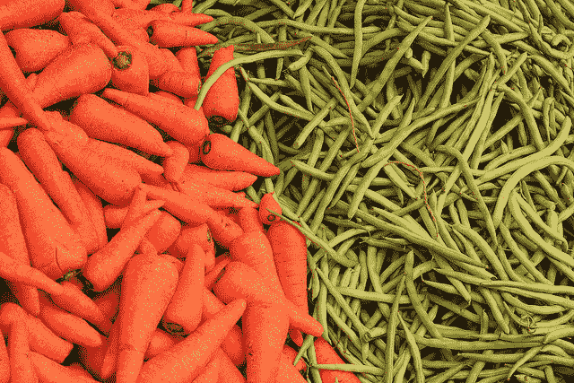

# 如何使用 Scikit-Learn 为 Python 机器学习准备数据

> 原文： [https://machinelearningmastery.com/prepare-data-machine-learning-python-scikit-learn/](https://machinelearningmastery.com/prepare-data-machine-learning-python-scikit-learn/)

许多机器学习算法都会对您的数据做出假设。

以这种方式准备数据通常是一个非常好的主意，以便最好地将问题的结构暴露给您打算使用的机器学习算法。

在这篇文章中，您将了解如何使用 scikit-learn 为 Python 中的机器学习准备数据。

让我们开始吧。

*   **更新 March / 2018** ：添加了备用链接以下载数据集，因为原始图像已被删除。



如何使用 Scikit-Learn
照片由 [Vinoth Chandar](https://www.flickr.com/photos/vinothchandar/5612099123/) 为 Python 机器学习准备数据，保留一些权利。

## 需要数据预处理

您几乎总是需要预处理数据。这是必需的步骤。

困难在于不同的算法对您的数据做出不同的假设，并且可能需要不同的变换。此外，当您遵循所有规则并准备数据时，有时算法可以在不进行预处理的情况下提供更好的结果。

通常，我建议您创建许多不同的视图和数据转换，然后在数据集的每个视图上运行一些算法。这将有助于您清除哪些数据转换可能更好地暴露您的问题结构。

## 预处理机器学习秘籍

本节列出了 4 种用于机器学习的不同数据预处理秘籍。

所有秘籍都设计为完整且独立的。

您可以将它们直接复制并粘贴到项目中并开始工作。

[Pima 印度糖尿病](https://archive.ics.uci.edu/ml/datasets/Pima+Indians+Diabetes)数据集用于每个秘籍。这是一个二分类问题，其中所有属性都是数字的，并且具有不同的比例。这是可以从预处理中受益的数据集的一个很好的例子。

您可以在 [UCI 机器学习库](https://archive.ics.uci.edu/ml/datasets/Pima+Indians+Diabetes)网页上了解有关此数据集的更多信息（更新：[从此处下载](https://raw.githubusercontent.com/jbrownlee/Datasets/master/pima-indians-diabetes.data.csv)）。

每个秘籍都遵循相同的结构：

1.  从 URL 加载数据集。
2.  将数据集拆分为输入和输出变量以进行机器学习。
3.  对输入变量应用预处理变换。
4.  总结数据以显示更改。

变换的计算方式使它们可以应用于您的训练数据以及将来可能拥有的任何数据样本。

[scikit-learn 文档](http://scikit-learn.org/stable/modules/preprocessing.html)提供了有关如何使用各种不同预处理方法的一些信息。您可以在此处查看 scikit-learn 中的[预处理 API。](http://scikit-learn.org/stable/modules/classes.html#module-sklearn.preprocessing)

### 1.重新调整数据

当您的数据由具有不同比例的属性组成时，许多机器学习算法可以从重新调整属性中受益，所有属性具有相同的比例。

这通常被称为归一化，并且属性通常被重新调整到 0 和 1 之间的范围。这对于在诸如梯度下降的机器学习算法的核心中使用的优化算法是有用的。对于使用诸如回归和神经网络之类的输入以及使用诸如 K-Nearest Neighbors 之类的距离度量的算法的算法，它也是有用的。

您可以使用 [MinMaxScaler](http://scikit-learn.org/stable/modules/generated/sklearn.preprocessing.MinMaxScaler.html) 类使用 scikit-learn 重新调整数据。

```
# Rescale data (between 0 and 1)
import pandas
import scipy
import numpy
from sklearn.preprocessing import MinMaxScaler
url = "https://raw.githubusercontent.com/jbrownlee/Datasets/master/pima-indians-diabetes.data.csv"
names = ['preg', 'plas', 'pres', 'skin', 'test', 'mass', 'pedi', 'age', 'class']
dataframe = pandas.read_csv(url, names=names)
array = dataframe.values
# separate array into input and output components
X = array[:,0:8]
Y = array[:,8]
scaler = MinMaxScaler(feature_range=(0, 1))
rescaledX = scaler.fit_transform(X)
# summarize transformed data
numpy.set_printoptions(precision=3)
print(rescaledX[0:5,:])
```

重新缩放后，您可以看到所有值都在 0 到 1 之间。

```
[[ 0.353  0.744  0.59   0.354  0\.     0.501  0.234  0.483]
 [ 0.059  0.427  0.541  0.293  0\.     0.396  0.117  0.167]
 [ 0.471  0.92   0.525  0\.     0\.     0.347  0.254  0.183]
 [ 0.059  0.447  0.541  0.232  0.111  0.419  0.038  0\.   ]
 [ 0\.     0.688  0.328  0.354  0.199  0.642  0.944  0.2  ]]
```

### 2.标准化数据

标准化是一种有用的技术，可以使用[高斯分布](https://en.wikipedia.org/wiki/Normal_distribution)转换属性，并将不同的均值和标准差转换为平均值为 0 且标准差为 1 的标准高斯分布。

它最适合于在输入变量中假设高斯分布并且对重新缩放的数据更好地工作的技术，例如线性回归，逻辑回归和线性判别分析。

您可以使用 [StandardScaler](http://scikit-learn.org/stable/modules/generated/sklearn.preprocessing.StandardScaler.html) 类使用 scikit-learn 标准化数据。

```
# Standardize data (0 mean, 1 stdev)
from sklearn.preprocessing import StandardScaler
import pandas
import numpy
url = "https://raw.githubusercontent.com/jbrownlee/Datasets/master/pima-indians-diabetes.data.csv"
names = ['preg', 'plas', 'pres', 'skin', 'test', 'mass', 'pedi', 'age', 'class']
dataframe = pandas.read_csv(url, names=names)
array = dataframe.values
# separate array into input and output components
X = array[:,0:8]
Y = array[:,8]
scaler = StandardScaler().fit(X)
rescaledX = scaler.transform(X)
# summarize transformed data
numpy.set_printoptions(precision=3)
print(rescaledX[0:5,:])
```

现在，每个属性的值的平均值为 0，标准差为 1。

```
[[ 0.64   0.848  0.15   0.907 -0.693  0.204  0.468  1.426]
 [-0.845 -1.123 -0.161  0.531 -0.693 -0.684 -0.365 -0.191]
 [ 1.234  1.944 -0.264 -1.288 -0.693 -1.103  0.604 -0.106]
 [-0.845 -0.998 -0.161  0.155  0.123 -0.494 -0.921 -1.042]
 [-1.142  0.504 -1.505  0.907  0.766  1.41   5.485 -0.02 ]]
```

### 3.规范化数据

scikit-learn 中的规范化是指将每个观察（行）重新缩放为长度为 1（在线性代数中称为单位范数）。

当使用加权输入值的算法（如神经网络和使用距离测量的算法，如 K-Nearest Neighbors）时，此预处理对于具有不同比例属性的稀疏数据集（大量零）非常有用。

您可以使用 [Normalizer](http://scikit-learn.org/stable/modules/generated/sklearn.preprocessing.Normalizer.html) 类通过 scikit-learn 对 Python 中的数据进行规范化。

```
# Normalize data (length of 1)
from sklearn.preprocessing import Normalizer
import pandas
import numpy
url = "https://raw.githubusercontent.com/jbrownlee/Datasets/master/pima-indians-diabetes.data.csv"
names = ['preg', 'plas', 'pres', 'skin', 'test', 'mass', 'pedi', 'age', 'class']
dataframe = pandas.read_csv(url, names=names)
array = dataframe.values
# separate array into input and output components
X = array[:,0:8]
Y = array[:,8]
scaler = Normalizer().fit(X)
normalizedX = scaler.transform(X)
# summarize transformed data
numpy.set_printoptions(precision=3)
print(normalizedX[0:5,:])
```

行被标准化为长度 1。

```
[[ 0.034  0.828  0.403  0.196  0\.     0.188  0.004  0.28 ]
 [ 0.008  0.716  0.556  0.244  0\.     0.224  0.003  0.261]
 [ 0.04   0.924  0.323  0\.     0\.     0.118  0.003  0.162]
 [ 0.007  0.588  0.436  0.152  0.622  0.186  0.001  0.139]
 [ 0\.     0.596  0.174  0.152  0.731  0.188  0.01   0.144]]
```

### 4.二值化数据（制作二进制）

您可以使用二进制阈值转换数据。高于阈值的所有值都标记为 1，所有等于或低于的值都标记为 0。

这称为二值化数据或阈值数据。当你有想要制作清晰价值的概率时，它会很有用。它在特征工程中很有用，并且您希望添加指示有意义的内容的新功能。

您可以使用 scikit-learn 与 [Binarizer](http://scikit-learn.org/stable/modules/generated/sklearn.preprocessing.Binarizer.html) 类在 Python 中创建新的二进制属性。

```
# binarization
from sklearn.preprocessing import Binarizer
import pandas
import numpy
url = "https://raw.githubusercontent.com/jbrownlee/Datasets/master/pima-indians-diabetes.data.csv"
names = ['preg', 'plas', 'pres', 'skin', 'test', 'mass', 'pedi', 'age', 'class']
dataframe = pandas.read_csv(url, names=names)
array = dataframe.values
# separate array into input and output components
X = array[:,0:8]
Y = array[:,8]
binarizer = Binarizer(threshold=0.0).fit(X)
binaryX = binarizer.transform(X)
# summarize transformed data
numpy.set_printoptions(precision=3)
print(binaryX[0:5,:])
```

您可以看到所有等于或小于 0 的值都标记为 0，而所有高于 0 的值都标记为 1。

```
[[ 1\.  1\.  1\.  1\.  0\.  1\.  1\.  1.]
 [ 1\.  1\.  1\.  1\.  0\.  1\.  1\.  1.]
 [ 1\.  1\.  1\.  0\.  0\.  1\.  1\.  1.]
 [ 1\.  1\.  1\.  1\.  1\.  1\.  1\.  1.]
 [ 0\.  1\.  1\.  1\.  1\.  1\.  1\.  1.]]
```

## 摘要

在这篇文章中，您了解了如何使用 scikit-learn 为 Python 中的机器学习准备数据。

你现在有秘籍：

*   重新调整数据。
*   标准化数据。
*   规范化数据。
*   二值化数据。

此帖子的操作步骤是键入或复制并粘贴每个秘籍，熟悉 scikit-learn 中的数据预处理。

您对 Python 或本文中的数据预处理有任何疑问吗？在评论中提问，我会尽力回答。