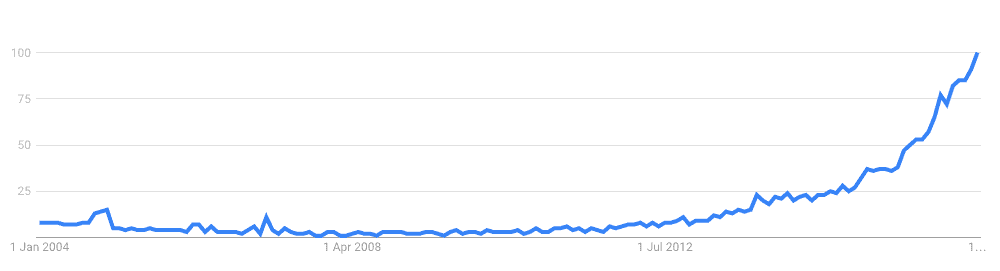
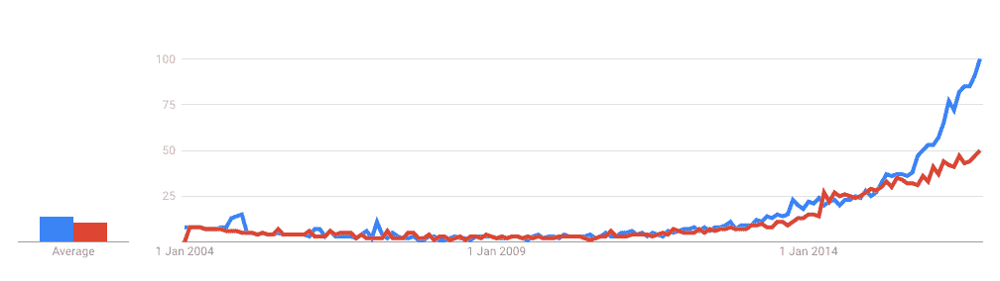
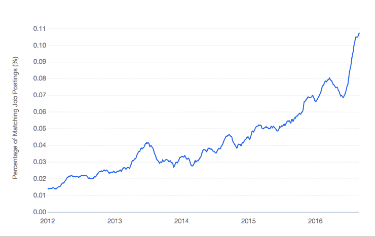
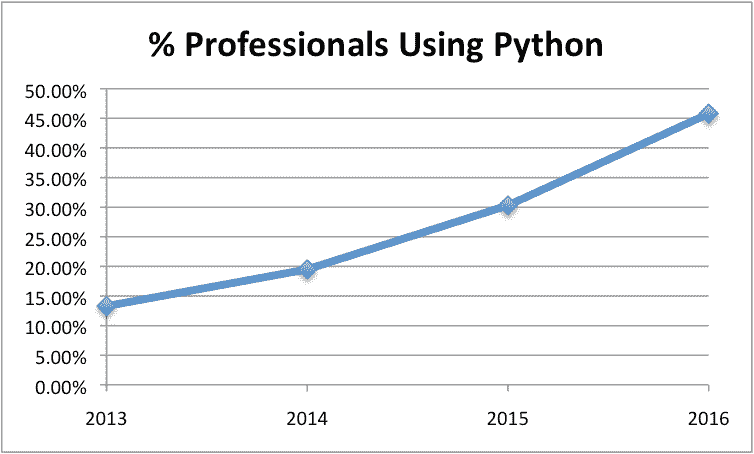
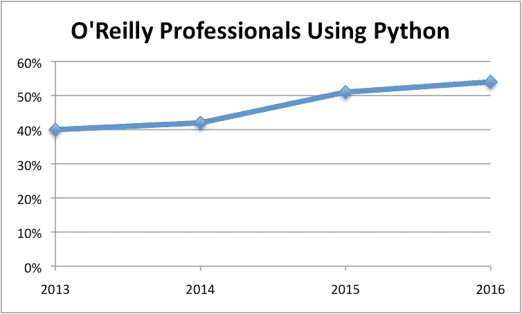

# Python 是应用机器学习的成长平台

> 原文： [https://machinelearningmastery.com/python-growing-platform-applied-machine-learning/](https://machinelearningmastery.com/python-growing-platform-applied-machine-learning/)

你应该为这份工作挑选合适的工具。

您正在处理的特定预测建模问题应该规定要使用的特定编程语言，库甚至机器学习算法。

但是，如果您刚刚开始并寻找一个学习和练习机器学习的平台怎么办？

在这篇文章中，您将发现 Python 是应用机器学习的增长平台，可能在采用和可能性方面超过和推翻 R.

阅读这篇文章后你会知道：

*   Python 机器学习的搜索量正在快速增长，并且已经超过了 R.
*   Python 机器学习工作的百分比正在增长，并且已经超过了 R.
*   近 50％的受访专业人士使用 Python 并且不断增长。

让我们开始吧。

## 用于机器学习的 Python 正在增长

让我们看一下 3 个区域，我们可以看到 Python 用于机器学习的增长：

1.  搜索量。
2.  招聘广告。
3.  专业工具使用。

### Python 机器学习搜索量正在增长

搜索量可能表示学生，工程师和其他从业者正在搜索信息以开始或深入了解该主题。

Google 提供了一个名为 [Google 趋势](https://www.google.com/trends/)的工具，可以深入了解关键字随时间的搜索量。

我们可以[研究 2004 年到 2016 年（过去 12 年）“Python 机器学习”的增长](https://www.google.com.au/trends/explore?date=all&q=python%20machine%20learning)。以下是此期间搜索量变化的图表：



Python 机器学习搜索流量的增长

我们可以看到，趋势向上开始于 2012 年，从 2015 年开始陡升，可能受到 TensorFlow 等 Python 深度学习工具的推动。

我们也可以[将其与 R 机器学习](https://www.google.com.au/trends/explore?date=all&q=python%20machine%20learning,r%20machine%20learning)的搜索量进行对比，我们可以看到，从 2015 年中期开始，Python 机器学习已经击败了 R.



Python 机器学习与 R 机器学习搜索量

蓝色表示“Python 机器学习”，红色表示“R 机器学习”。

### Python 机器学习工作正在增长

[确实](http://indeed.com)是一个求职网站，就像 Google 趋势一样，它们显示了与关键字匹配的招聘广告数量。

我们可以调查过去 4 年对“蟒蛇机器学习工作”的需求。



Python 机器学习工作的增长

我们可以看到沿 x 轴的时间以及与关键字匹配的职位发布百分比。该图显示了 2012 年至 2015 年的近乎线性增长，2016 年曲棍球棒增加。

我们还可以比较 python 和 R 的招聘广告。


Python 机器学习工作与 R 机器学习工作

蓝色显示“Python 机器学习”，橙色显示“R 机器学习”。

与 Google 搜索量相比，我们看到了更为明显的故事。 Indeed.com 提供的招聘广告百分比表明，至少自 2012 年以来，对于机器学习技能的需求一直主导着 R 机器学习技能，近年来差距只有扩大。

### KDNuggets 调查结果：更多人使用 Python 进行机器学习

通过查看 KDnuggets 软件调查结果的结果，我们可以深入了解机器学习从业者使用的工具。

以下是 2016 年业绩报价：

> R 仍然是领先的工具，拥有 49％的份额，但 Python 增长更快，几乎赶上了 R.

- Gregory Piatetsky

民意调查跟踪机器学习和数据科学专业人员使用的工具，参与者可以选择多个工具（这是我期望的标准）

以下是过去 4 年中用于机器学习的 Python 的增长：

```
2016   45.8%
2015   30.3%
2014   19.5%
2013   13.3%
```

下面是这种增长的情节。



KDNuggets 民意调查结果 - 使用 Python.png 的专业人员百分比

我们可以看到近乎线性的增长趋势，2016 年使用的 Python 仅占不到 50％的专业人士。

值得注意的是，近年来，民意调查的参与者人数也从数百人增加到数千人，参与者是自我选择的。

有趣的是，scikit-learn 也在投票中单独出现，占 17.2％。

有关更多信息，请参阅： [KDnuggets 2016 年软件调查结果](http://www.kdnuggets.com/2016/06/r-python-top-analytics-data-mining-data-science-software.html)。

### O'Reilly 调查结果：更多人使用 Python 进行机器学习

O'Reilly 每年进行一次数据科学薪酬调查。

他们从专业数据科学家和机器学习从业者那里收集了大量数据，并将结果呈现在非常好的报告中。例如，这里是 [2016 年数据科学薪资调查报告](http://www.oreilly.com/data/free/2016-data-science-salary-survey.csp) [[查看 PDF 报告](http://www.oreilly.com/data/free/files/2016-data-science-salary-survey.pdf)]。

该调查跟踪从业者的工具使用情况，以及 KDNuggets 数据。

引用 2016 年报告的主要发现，我们可以看到 Python 在数据科学工资中发挥着重要作用。

> Python 和 Spark 是最有助于薪水的工具之一。

- 2016 年第 1 页数据科学薪酬调查报告。

回顾调查结果，我们可以看到过去 4 年中使用 Python 生态系统进行机器学习的类似增长趋势。

```
2016   54%
2015   51%
2014   42% (interpreted from graph)
2013   40%
```

再次，我们可以描绘这种增长。



O'Reilly 民意调查结果 - 使用 Python.png 的专业人士百分比

有趣的是，2016 年的结果与 KDNuggets 民意调查结果非常相似。

## 行情

您可以找到支持互联网上任何位置的报价。

拿一粒盐报价。尽管如此，报价可以是有洞察力的，提高和支持点。

让我们先来看看新闻网站和博客中有关机器学习 Python 发展的一些樱桃摘要。

### 新闻报价

> Python 在过去几年中已成为数据科学编程的领导者。虽然仍然有很多人使用 R，SPSS，Julia 或其他几种流行语言，但 Python 在该领域的日益普及在其数据科学库的发展中显而易见。

- Katharine Jarmul，[数据科学入门：如何使用 Python“大数据”](http://dataconomy.com/big-data-python/)，Dataconomy

> 我们的研究表明，Python 是最流行的数据科学分析语言之一，超过三分之一（36％）的组织使用它。

- Dave Menninger，[大数据在 Strata + Hadoop World 2016](http://www.smartdatacollective.com/dave-menninger/445221/big-data-grows-stratahadoop-world-2016) 增长，SmartDataCollective

> ...过去几年中，已经出现了大量尖端的，商业上可用的机器学习框架，包括非常成功的 scikit-learn Python 库和广为人知的库版本，如 Google 的 Tensorflow 和 Microsoft Research 的 CNTK。

- Josh Schwartz，[机器学习不再仅仅是专家](https://hbr.org/2016/10/machine-learning-is-no-longer-just-for-experts)，哈佛商业评论

请注意，scikit-learn，TensorFlow 和 CNTK 都是 Python 机器学习库。

> Python 功能多样，简单易学，功能强大，因为它在各种环境中都很有用，其中一些与数据科学无关。 R 是一个专门的环境，可以优化数据分析，但更难学习。如果你坚持使用 R 而不是使用 Python，你将获得更多报酬

- Roger Huang，[数据科学性感：你的 Python 和 R 指南，哪一个最好](http://thenextweb.com/dd/2016/04/08/start-using-python-andor-r-data-science-one-best/)，TheNextWeb

### Quora 行情

以下是从 [Quora](https://www.quora.com/) 问题中使用 Python 进行机器学习的一些樱桃选择引文。

> Python 如果是一种流行的科学语言和机器学习的后起之秀。如果能从 R 中获取数据分析，我会感到惊讶，但 NumPy 中的矩阵处理可能会挑战 MATLAB，而像 IPython 这样的通信工具非常具有吸引力，是未来再现性的一个步骤。我认为用于机器学习和数据分析的 SciPy 栈可以用于一次性项目（如论文），而像 scikit-learn 这样的框架可能已经足够成熟，可以用于生产系统。

- 生产工程师 Aswath Muralidharan。响应 Quora 问题“[机器学习的前 5 种编程语言是什么？](https://www.quora.com/What-are-the-top-5-programming-languages-for-Machine-Learning) “

> 我还推荐 Python，因为它是一种非常棒的全面编程语言，对于绘制代码片段和探索数据非常有用（使用 IPython shell），非常适合在分析流程链中记录步骤和结果（IPython Notebook），为几乎所有机器学习目标提供了大量库，甚至可以针对生产系统实现进行优化。在我看来，在任何这些类别中都有一些优于 Python 的语言 - 但它们都没有提供这种多功能性。

- Benedikt Koehler，创始人兼 CEO DataLion。回答 Quora 问题“[第一次学习机器学习时使用的最佳语言是什么？](https://www.quora.com/What-is-the-best-language-to-use-while-learning-machine-learning-for-the-first-time) “

> [...]这是因为语言可以为那些只想快速完成某些事情的人创造一个富有成效的环境。包装 C 库相当容易，而 C ++是可行的。这使 Python 可以访问各种现有代码。当实现事物时，语言也不会妨碍。在许多方面，它使编码“再次有趣”，适用于各种任务。

- Shawn Masters，工程副总裁。响应 Quora 问题“ [Python 会变得像 Java 一样流行，因为 Python 用于机器学习吗？](https://www.quora.com/Will-Python-become-as-popular-as-Java-given-that-Python-is-used-in-Machine-Learning) “

> 在我看来，Python 真正支配这一类别。快速搜索几乎所有人工智能，机器学习，NLP 或数据分析主题，再加上“Python”，将返回有用的，积极维护的库的示例。

- 程序员 Ryan Hill。回答 Quora 问题“[哪种编程语言拥有最好的机器学习库存储库？](https://www.quora.com/Which-programming-language-has-the-best-repository-of-machine-learning-libraries) “

## 摘要

在这篇文章中，您发现 Python 是应用机器学习的增长平台。

具体来说，您了解到：

*   对机器学习感兴趣的 Python 人数大于 R 并且正在增长。
*   为 Python 机器学习技能发布的作业数量大于 R 并且还在增长。
*   使用 Python 的受访数据科学专业人员数量逐年增长。

**这是否影响了您开始使用
Python 生态系统进行机器学习的决定？**
在下面的评论中分享您的想法。