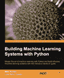
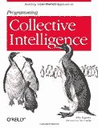
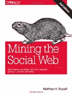
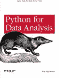

# Python 机器学习书籍

> 原文： [https://machinelearningmastery.com/python-machine-learning-books/](https://machinelearningmastery.com/python-machine-learning-books/)

Python 是一种非常流行的机器学习语言。

Python 中的机器学习库和框架（特别是围绕 SciPy 堆栈）正在快速成熟。它们可能不像 R 那样功能丰富，但它们足够强大，适用于中小规模的生产实施。

如果你是一个想要进入机器学习的 Python 程序员，或者你通常有兴趣通过 Python 进入机器学习，那么我想用这篇文章指出一些你可能会觉得对你的旅程有用的重要书籍。

这绝不是一本完整的书籍清单，但我认为如果你对 Python 中的机器学习感兴趣，那么你应该选择这些书籍。

## Python 中的机器学习

 [使用 Python 构建机器学习系统](http://www.amazon.com/dp/1782161406?tag=inspiredalgor-20)（2013）：掌握使用 Python 进行机器学习的艺术，并使用此强化实践指南构建有效的机器学习系统。

[学习 scikit-learn：Python 中的机器学习](http://www.amazon.com/dp/1783281936?tag=inspiredalgor-20)（2013）：通过使用 Python 和开源 scikit-learn 库将它们应用于实际问题，体验机器学习技术的好处。

[机器学习在行动](http://www.amazon.com/dp/1617290181?tag=inspiredalgor-20)（2012）：机器学习在行动是一本独特的书，它将机器学习的基础理论与构建日常数据分析工具的实际现实相结合。您将使用灵活的 Python 编程语言来构建实现数据分类，预测，建议和更高级功能（如摘要和简化）的算法的程序。

 [编程集体智慧：构建智能 Web 2.0 应用程序](http://www.amazon.com/dp/0596529325?tag=inspiredalgor-20)（2007）：这本引人入胜的书演示了如何构建 Web 2.0 应用程序以挖掘人们创建的大量数据互联网。

[机器学习：算法视角](http://www.amazon.com/dp/B005H6YE18?tag=inspiredalgor-20)（2011）：该领域已经准备好了一个文本，不仅演示了如何使用构成机器学习方法的算法，还提供了理解如何以及为什么需要的背景这些算法有效。机器学习：算法视角就是文本。

## Python 中的专业机器学习

 [挖掘社交网络：数据挖掘 Facebook，Twitter，LinkedIn，Google +，GitHub 等](http://www.amazon.com/dp/1449367615?tag=inspiredalgor-20)（2013）：您将学习如何获取，分析和总结来自社交网络各个角落的数据，包括 Facebook，Twitter，LinkedIn，Google +，GitHub，电子邮件，网站和博客。

[Python 自然语言处理](http://www.amazon.com/dp/0596516495?tag=inspiredalgor-20)（2009）：本书提供了一个高度可访问的自然语言处理介绍，该领域支持各种语言技术，从预测文本和电子邮件过滤到自动摘要和翻译。

[使用 Python 编程计算机视觉：用于分析图像的工具和算法](http://www.amazon.com/dp/1449316549?tag=inspiredalgor-20)（2012）：如果您想要对计算机视觉的基础理论和算法有基本的了解，那么这种实践性的介绍是理想的起点。当您遵循用 Python 编写的清晰示例时，您将学习对象识别，3D 重建，立体成像，增强现实和其他计算机视觉应用程序的技术。

 [用于数据分析的 Python：与 Pandas，NumPy 和 IPython 进行数据争夺](http://www.amazon.com/dp/1449319793?tag=inspiredalgor-20)（2012）：它也是一个实用的，现代的 Python 科学计算入门，专为数据量身定制密集的应用程序。这是一本关于 Python 语言部分的书和有效解决大量数据分析问题所需的库。本书不是对使用 Python 作为实现语言的分析方法的阐述。

我是否错过了必读的 Python 机器学习书？发表评论并告诉我。