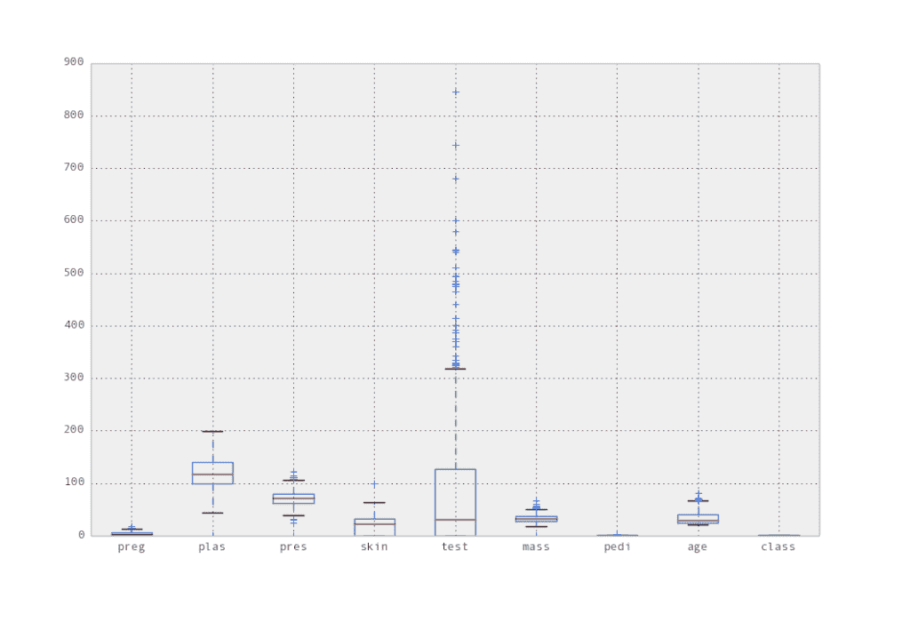
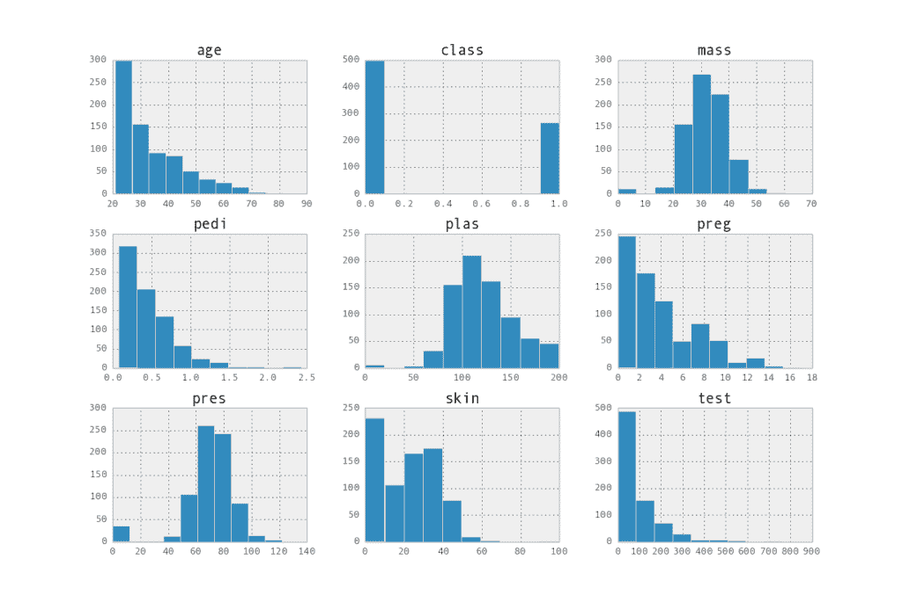
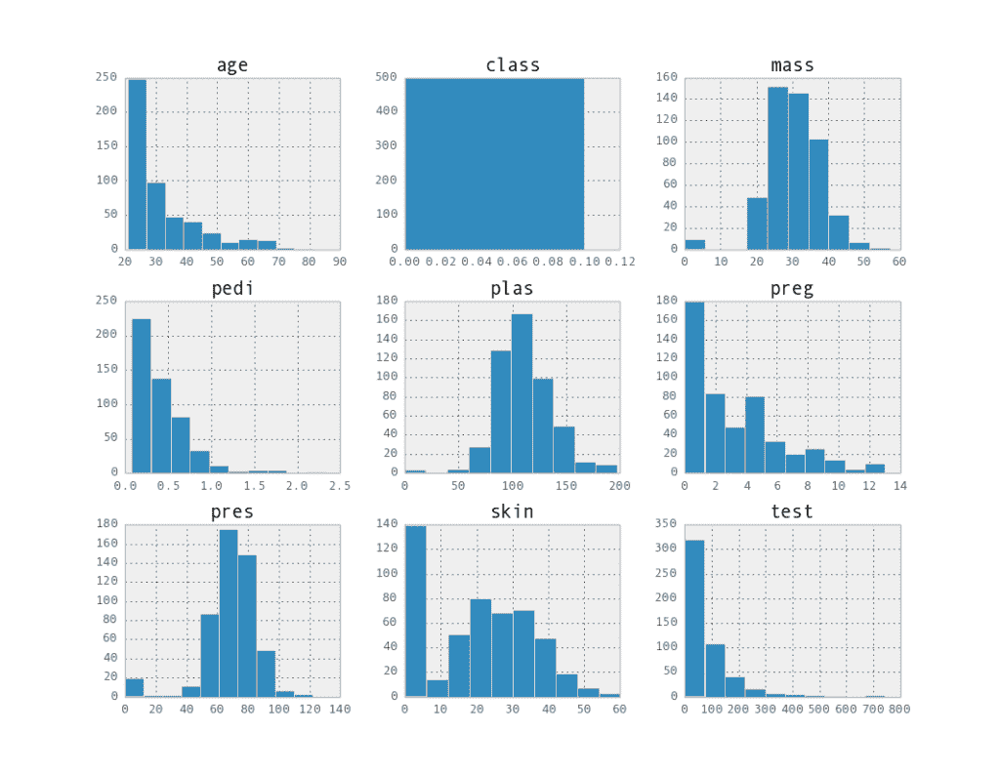
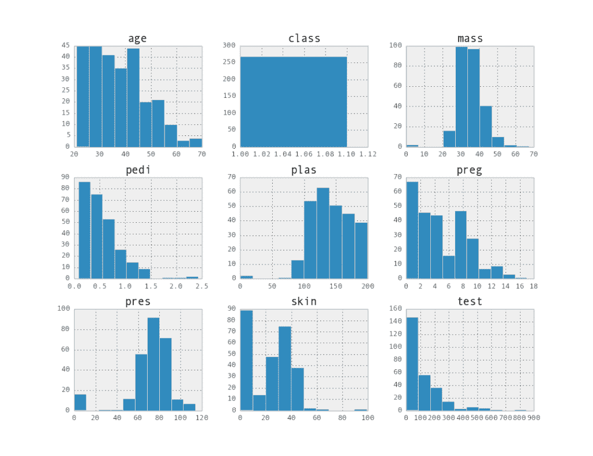
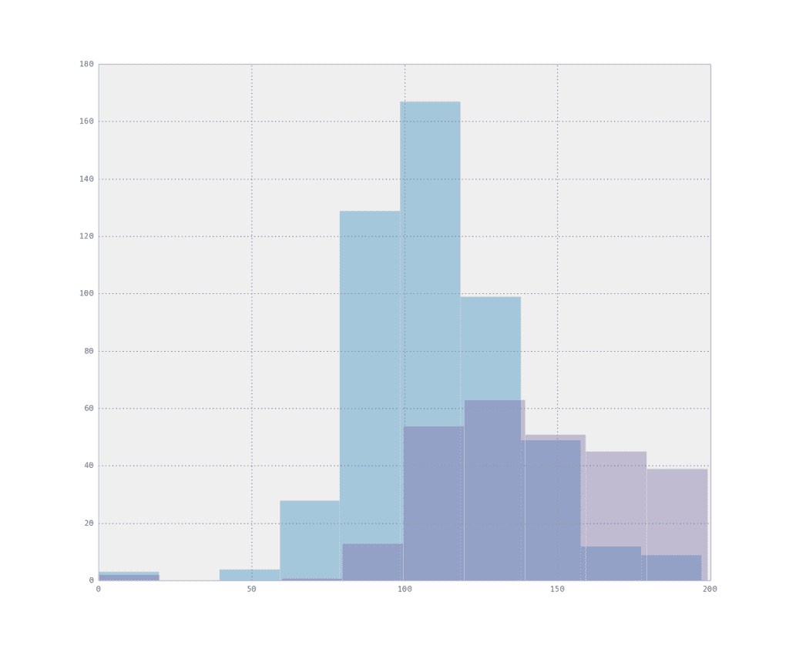
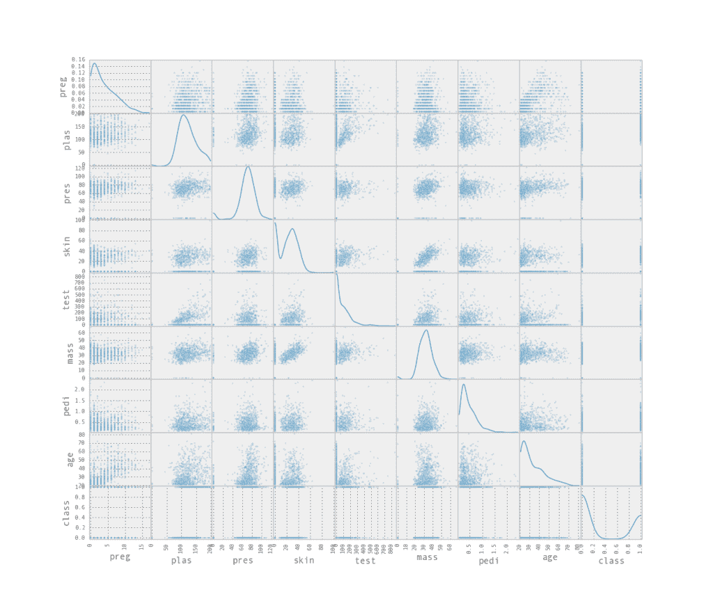

# 使用 Pandas 的快速和肮脏的数据分析

> 原文： [https://machinelearningmastery.com/quick-and-dirty-data-analysis-with-pandas/](https://machinelearningmastery.com/quick-and-dirty-data-analysis-with-pandas/)

在为建模选择和准备数据之前，您需要了解您必须从哪开始。

如果您正在使用 Python 栈进行机器学习，那么可以用来更好地理解数据的库是 Pandas。

在这篇文章中，您将发现一些快速而肮脏的 Pandas 秘籍，以提高您对数据结构，分布和关系的理解。

*   **更新 March / 2018** ：添加了备用链接以下载数据集，因为原始图像已被删除。

## 数据分析

[数据分析](http://machinelearningmastery.com/quick-and-dirty-data-analysis-for-your-machine-learning-problem/ "Quick and Dirty Data Analysis for your Machine Learning Problem")是关于询问和回答有关您数据的问题。

作为机器学习从业者，您可能不熟悉您所在的领域。拥有主题专家是理想的，但这并不总是可行的。

当您使用标准机器学习数据集，咨询或处理竞争数据集学习应用机器学习时，这些问题也适用。

您需要激发有关您可以追求的数据的问题。您需要更好地了解您拥有的数据。您可以通过汇总和可视化数据来实现。

### 熊猫

[Pandas Python 库](http://machinelearningmastery.com/prepare-data-for-machine-learning-in-python-with-pandas/ "Prepare Data for Machine Learning in Python with Pandas")专为快速数据分析和操作而构建。如果您在其他平台（如 R）上完成此任务，那么它既简单又熟悉。

Pandas 的优势似乎在数据处理方面，但它带有非常方便易用的数据分析工具，为 [statsmodels](http://statsmodels.sourceforge.net/) 中的标准统计方法和 [matplotlib 中的图形方法提供包装器](http://matplotlib.org/)。

### 糖尿病的发病

我们需要一个小数据集，您可以使用它来探索使用 Pandas 的不同数据分析秘籍。

UIC 机器学习库提供了大量不同的标准机器学习数据集，您可以使用它们来学习和实践应用的机器学习。我最喜欢的是[皮马印第安人糖尿病数据集](http://archive.ics.uci.edu/ml/datasets/Pima+Indians+Diabetes)。

该数据集使用其医疗记录中的详细信息描述了女性[皮马印第安人](http://en.wikipedia.org/wiki/Pima_people)中糖尿病发病的发生或缺乏。 （更新：[从这里下载](https://raw.githubusercontent.com/jbrownlee/Datasets/master/pima-indians-diabetes.data.csv)）。下载数据集并将其保存到当前工作目录中，名称为 _pima-indians-diabetes.data_ 。

## 总结数据

我们将从了解我们拥有的数据开始，通过查看它的结构。

### 加载数据

首先将 CSV 数据从文件作为数据帧加载到内存中。我们知道所提供数据的名称，因此我们将在从文件加载数据时设置这些名称。

Python

```
import pandas as pd
names = ['preg', 'plas', 'pres', 'skin', 'test', 'mass', 'pedi', 'age', 'class']
data = pd.read_csv('pima-indians-diabetes.data', names=names)
```

了解有关 [Pandas IO 功能](http://pandas.pydata.org/pandas-docs/stable/io.html)和 [read_csv 功能](http://pandas.pydata.org/pandas-docs/stable/io.html#io-read-csv-table)的更多信息。

### 描述数据

我们现在可以看一下数据的形状。

我们可以通过直接打印数据框来查看前 60 行数据。

Python

```
print(data)
```

我们可以看到所有数据都是数字的，最后的类值是我们想要做出预测的因变量。

在数据转储结束时，我们可以看到数据框本身的描述为 768 行和 9 列。所以现在我们已经了解了数据的形状。

接下来，我们可以通过查看摘要统计量来了解每个属性的分布情况。

Python

```
print(data.describe())
```

这将显示数据框中每个属性的详细分布信息表。具体来说：计数，平均值，标准差，最小值，最大值，第 25 个，第 50 个（中位数），第 75 个百分点。

我们可以查看这些统计量并开始注意有关我们问题的有趣事实。如平均怀孕次数为 3.8，最小年龄为 21 岁，有些人的体重指数为 0，这是不可能的，并且有迹象表明某些属性值应标记为缺失。

了解有关 DataFrame 上[描述函数](http://pandas.pydata.org/pandas-docs/stable/generated/pandas.DataFrame.describe.html)的更多信息。

## 可视化数据

图表更能说明属性的分布和关系。

然而，重要的是要花时间并首先审查统计量。每当您以不同的方式查看数据时，您就会打开自己，注意到不同的方面，并可能对问题有不同的见解。

Pandas 使用 matplotlib 创建图形并提供方便的功能。您可以[详细了解 Pandas 中的数据可视化。](http://pandas.pydata.org/pandas-docs/stable/visualization.html)

### 特征分布

要审查的第一个简单属性是每个属性的分布。

我们可以通过查看 box 和 whisker 图来开始并查看每个属性的传播。

Python

```
import matplotlib.pyplot as plt
pd.options.display.mpl_style = 'default'
data.boxplot()
```

此片段将绘制图形的样式（通过 matplotlib）更改为默认样式，该样式看起来更好。

[](https://3qeqpr26caki16dnhd19sv6by6v-wpengine.netdna-ssl.com/wp-content/uploads/2014/06/boxplots.png)

属性框和胡须图

我们可以看到 test 属性有很多异常值。我们还可以看到 plas 属性似乎具有相对均匀的正态分布。我们还可以通过将值离散化为桶来查看每个属性的分布，并将每个桶中的频率作为直方图进行检查。

Python

```
data.hist()
```

这使您可以记录属性分布的有趣属性，例如 pres 和 skin 等属性的可能正态分布。

[](https://3qeqpr26caki16dnhd19sv6by6v-wpengine.netdna-ssl.com/wp-content/uploads/2014/06/histograms.png)

属性直方图矩阵

您可以在 DataFrame 上查看有关 [boxplot](http://pandas.pydata.org/pandas-docs/stable/generated/pandas.DataFrame.boxplot.html#pandas.DataFrame.boxplot) 和 [hist 函数](http://pandas.pydata.org/pandas-docs/stable/generated/pandas.DataFrame.hist.html#pandas.DataFrame.hist)的更多详细信息

### 特征级关系

探索的下一个重要关系是 class 属性的每个属性。

一种方法是可视化每个类的数据实例的属性分布以及注释和差异。您可以为每个属性生成直方图矩阵，为每个类值生成一个直方图矩阵，如下所示：

Python

```
data.groupby('class').hist()
```

数据按类属性（两组）分组，然后为每个组中的属性创建直方图矩阵。结果是两个图像。

[](https://3qeqpr26caki16dnhd19sv6by6v-wpengine.netdna-ssl.com/wp-content/uploads/2014/06/histogram_class0.png)

0 类的属性直方图矩阵

[](https://3qeqpr26caki16dnhd19sv6by6v-wpengine.netdna-ssl.com/wp-content/uploads/2014/06/histograpm_class1.png)

1 类属性直方图矩阵

这有助于指出类之间的分布差异，如 plas 属性的分布。

您可以更好地对同一图表中每个类的属性值进行对比

```
data.groupby('class').plas.hist(alpha=0.4)
```

这将按类别对数据进行分组，仅绘制等离子体的直方图，其中红色的类值为 0，蓝色的类值为 1。你可以看到一个类似形状的正态分布，但是一个转变。此属性可能有助于区分类。

[](https://3qeqpr26caki16dnhd19sv6by6v-wpengine.netdna-ssl.com/wp-content/uploads/2014/06/histogram_overlapping.png)

每个类的重叠属性直方图

您可以在 DataFrame 上阅读有关 [groupby 函数](http://pandas.pydata.org/pandas-docs/stable/generated/pandas.DataFrame.groupby.html#pandas.DataFrame.groupby)的更多信息。

### 特征 - 特征关系

探索的最后一个重要关系是属性之间的关系。

我们可以通过查看每对属性的交互分布来查看属性之间的关系。

Python

```
from pandas.plotting import scatter_matrix
scatter_matrix(data, alpha=0.2, figsize=(6, 6), diagonal='kde')
```

这使用构建函数来创建所有属性与所有属性的散点图矩阵。每个属性相对于自身绘制的对角线显示了属性的核密度估计。

[](https://3qeqpr26caki16dnhd19sv6by6v-wpengine.netdna-ssl.com/wp-content/uploads/2014/06/scatterplots.png)

属性散点图矩阵

这是一个强大的情节，可以从中获得关于数据的大量灵感。例如，我们可以看到年龄和 preg 之间可能的相关性以及皮肤和质量之间的另一种可能的关系。

## 摘要

我们在这篇文章中介绍了很多内容。

我们开始研究快速和脏的单行程序，以便以 CSV 格式加载我们的数据并使用汇总统计量对其进行描述。

接下来，我们研究了绘制数据以揭示有趣结构的各种不同方法。我们查看了框中的数据分布以及晶须图和直方图，然后我们查看了与类属性相比的属性分布，最后查看了成对散点图中属性之间的关系。