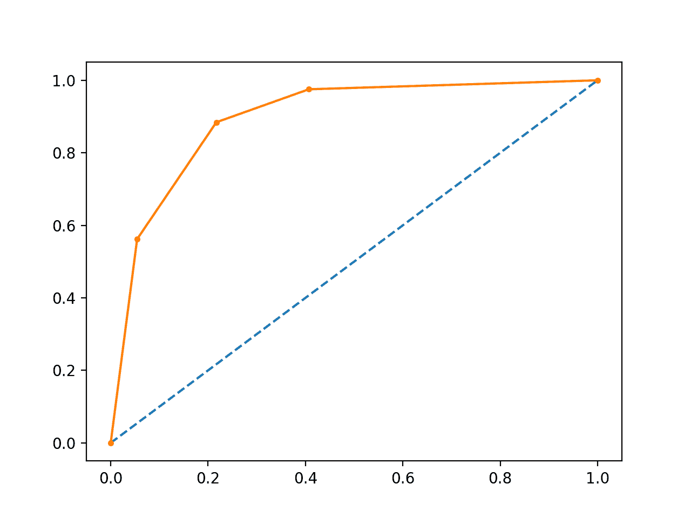
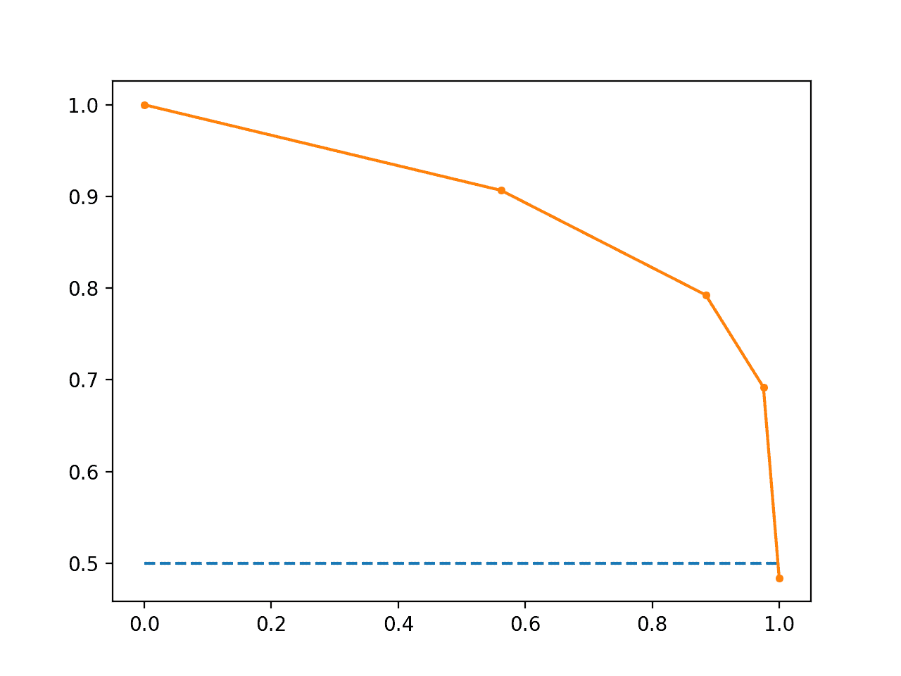
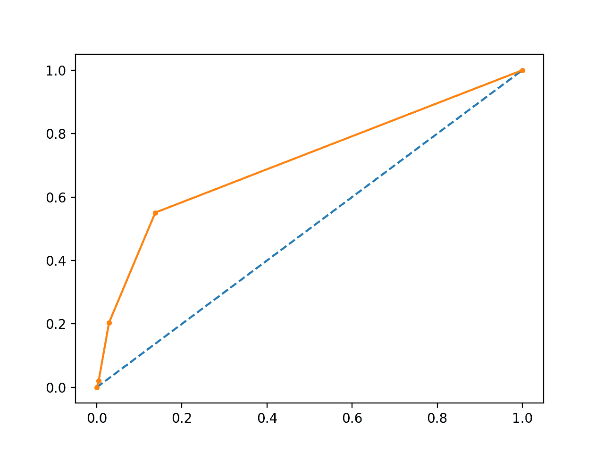
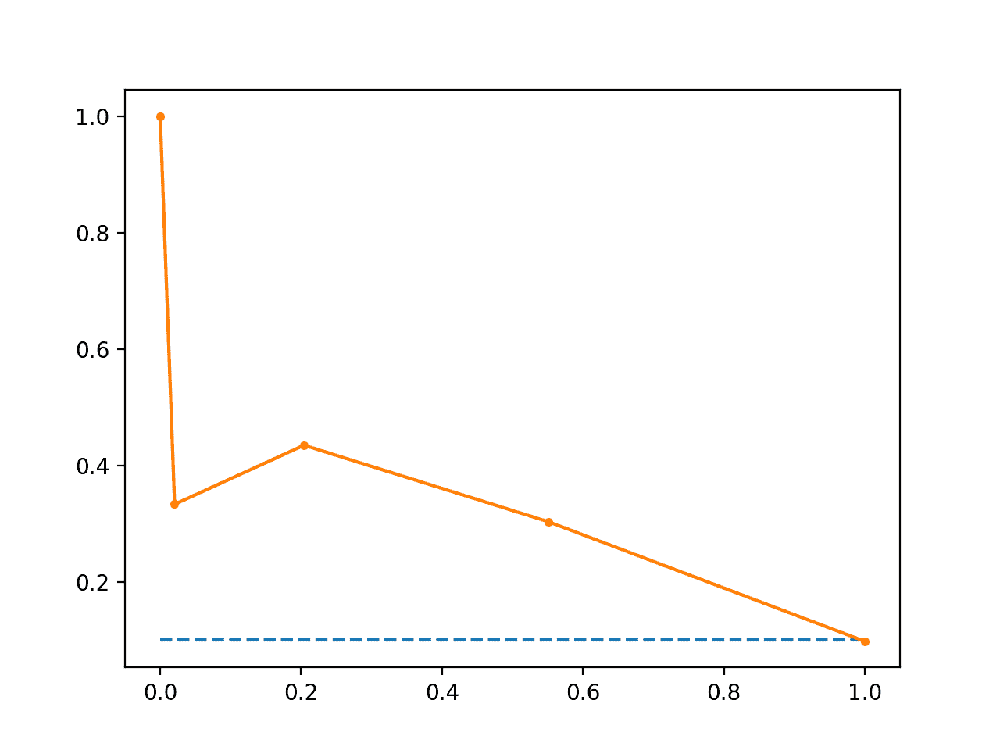

# 如何以及何时使用 ROC 曲线和精确调用曲线进行 Python 分类

> 原文： [https://machinelearningmastery.com/roc-curves-and-precision-recall-curves-for-classification-in-python/](https://machinelearningmastery.com/roc-curves-and-precision-recall-curves-for-classification-in-python/)

可以更灵活地预测属于分类问题中每个类的观察的概率，而不是直接预测类。

这种灵活性来自于可以使用不同阈值来解释概率的方式，该阈值允许模型的操作者在模型所做的错误中权衡关注，例如与假阴性的数量相比的假阳性的数量。当使用一个错误的成本超过其他类型错误的成本的模型时，这是必需的。

有助于解释二元（两类）分类预测建模问题的概率预测的两种诊断工具是 ROC 曲线和精确回忆曲线。

在本教程中，您将发现 ROC 曲线，精确回忆曲线以及何时使用每个曲线来解释二分类问题的概率预测。

完成本教程后，您将了解：

*   ROC 曲线总结了使用不同概率阈值的预测模型的真阳性率和假阳性率之间的权衡。
*   精确回忆曲线总结了使用不同概率阈值的预测模型的真阳性率和阳性预测值之间的权衡。
*   当观察值在每个类别之间平衡时，ROC 曲线是合适的，而精确回忆曲线适用于不平衡的数据集。

让我们开始吧。

*   **更新 Aug / 2018** ：修正了精确召回图的无技能线表示中的错误。还修正了错误，我将 ROC 称为[相对](https://news.ycombinator.com/item?id=17883130)而不是接收器（感谢拼写检查）。
*   **更新 Nov / 2018** ：修正了关于解释每个轴上的值大小的描述，感谢 Karl Humphries。


如何以及何时使用 ROC 曲线和精确回忆曲线进行分类
照片由 [Giuseppe Milo](https://www.flickr.com/photos/giuseppemilo/35000793430/) 拍摄，保留一些权利。

## 教程概述

本教程分为 6 个部分;他们是：

1.  预测概率
2.  什么是 ROC 曲线？
3.  Python 中的 ROC 曲线和 AUC
4.  什么是精确回忆曲线？
5.  Python 中的精确调用曲线和 AUC
6.  何时使用 ROC 与精确回忆曲线？

## 预测概率

在分类问题中，我们可能决定直接预测类值。

或者，可以更灵活地预测每个类的概率。其原因是提供选择甚至校准如何解释预测概率的阈值的能力。

例如，默认值可能是使用 0.5 的阈值，这意味着[0.0,0.49]中的概率是负结果（0），[0.5,1.0]中的概率是正结果（1）。

可以调整此阈值以针对特定问题调整模型的行为。一个例子是减少一种或另一种类型的错误。

在对二进制或两类分类问题做出预测时，我们可以做出两种类型的错误。

*   **误报**。预测没有事件时的事件。
*   **假阴性**。实际上有一个事件，预测没有事件。

通过预测概率和校准阈值，可以由模型的操作者选择这两个问题的平衡。

例如，在烟雾预测系统中，我们可能更关心低假阴性而不是低假阳性。假阴性意味着不会警告雾霾日，事实上它是一个高雾日，导致公众健康问题无法采取预防措施。误报意味着公众会在不需要时采取预防措施。

比较预测两类问题概率的模型的常用方法是使用 ROC 曲线。

## 什么是 ROC 曲线？

预测二元结果概率时的一个有用工具是[接收器工作特性曲线](https://en.wikipedia.org/wiki/Receiver_operating_characteristic)或 ROC 曲线。

它是假阳性率（x 轴）对真实阳性率（y 轴）的曲线图，其中许多不同的候选阈值在 0.0 和 1.0 之间。换句话说，它描绘了误报率与命中率的关系。

真阳性率计算为真阳性数除以真阳性数和假阴性数之和。它描述了当实际结果为正时，模型在预测正类时有多好。

```
True Positive Rate = True Positives / (True Positives + False Negatives)
```

真阳性率也称为敏感性。

```
Sensitivity = True Positives / (True Positives + False Negatives)
```

假阳性率计算为假阳性的数量除以假阳性的数量和真阴性的数量之和。

它也被称为误报率，因为它总结了当实际结果为负时预测正类的频率。

```
False Positive Rate = False Positives / (False Positives + True Negatives)
```

假阳性率也称为反转特异性，其中特异性是真阴性的总数除以真阴性和假阳性的总和。

```
Specificity = True Negatives / (True Negatives + False Positives)
```

哪里：

```
False Positive Rate = 1 - Specificity
```

ROC 曲线是一个有用的工具，原因如下：

*   不同模型的曲线可以直接比较或针对不同的阈值进行比较。
*   曲线下面积（AUC）可用作模型技能的摘要。

曲线的形状包含大量信息，包括我们可能最关心的问题，预期的假阳性率和假阴性率。

为了明确这一点：

*   图的 x 轴上的较小值表示较低的假阳性和较高的真阴性。
*   图的 y 轴上的较大值表示较高的真阳性和较低的假阴性。

如果您感到困惑，请记住，当我们预测二元结果时，它是正确的预测（真阳性）或不是（假阳性）。这些选择之间存在紧张关系，同样存在真正的消极和误报。

熟练的模型将为随机选择的实际正面事件分配比平均负面事件更高的概率。当我们说模型具有技巧时，这就是我们的意思。通常，熟练的模型由曲线向左上方的曲线表示。

没有技能的模型在[0.5,0.5]处表示。在每个阈值处没有技能的模型由从图的左下角到右上角的对角线表示，并且具有 0.5 的 AUC。

具有完美技能的模型表示为[0.0,1.0]点。具有完美技能的模型由从绘图的左下角到左上角然后跨越顶部到右上角的线表示。

操作员可以绘制最终模型的 ROC 曲线，并选择在假阳性和假阴性之间给出理想平衡的阈值。

## Python 中的 ROC 曲线和 AUC

我们可以使用`roc_curve()`scikit-learn 函数在 Python 中绘制模型的 ROC 曲线。

该函数获取测试集的真实结果（0,1）和 1 类的预测概率。该函数返回每个阈值的误报率，每个阈值的真正正率和阈值。

```
# calculate roc curve
fpr, tpr, thresholds = roc_curve(y, probs)
```

可以使用`roc_auc_score()`函数计算 ROC 的 AUC。

与`roc_curve()`函数一样，AUC 函数同时获取测试集中的真实结果（0,1）和 1 类的预测概率。它返回的 AUC 分数在 0.0 和 1.0 之间，分别对于没有技能和完美技能。

```
# calculate AUC
auc = roc_auc_score(y, probs)
print('AUC: %.3f' % auc)
```

下面列出了计算小测试问题的逻辑回归模型的 ROC 曲线和 AUC 的完整示例。

```
# roc curve and auc
from sklearn.datasets import make_classification
from sklearn.neighbors import KNeighborsClassifier
from sklearn.model_selection import train_test_split
from sklearn.metrics import roc_curve
from sklearn.metrics import roc_auc_score
from matplotlib import pyplot
# generate 2 class dataset
X, y = make_classification(n_samples=1000, n_classes=2, weights=[1,1], random_state=1)
# split into train/test sets
trainX, testX, trainy, testy = train_test_split(X, y, test_size=0.5, random_state=2)
# fit a model
model = KNeighborsClassifier(n_neighbors=3)
model.fit(trainX, trainy)
# predict probabilities
probs = model.predict_proba(testX)
# keep probabilities for the positive outcome only
probs = probs[:, 1]
# calculate AUC
auc = roc_auc_score(testy, probs)
print('AUC: %.3f' % auc)
# calculate roc curve
fpr, tpr, thresholds = roc_curve(testy, probs)
# plot no skill
pyplot.plot([0, 1], [0, 1], linestyle='--')
# plot the roc curve for the model
pyplot.plot(fpr, tpr, marker='.')
# show the plot
pyplot.show()
```

运行该示例将打印 ROC 曲线下的区域。

```
AUC: 0.895
```

还创建了模型的 ROC 曲线图，表明模型具有技能。



ROC 曲线的线图

## 什么是精确回忆曲线？

有许多方法可以评估预测模型的技能。

[信息检索](https://en.wikipedia.org/wiki/Information_retrieval)（基于查询查找文档）的相关领域中的方法测量[精度和召回](https://en.wikipedia.org/wiki/Precision_and_recall)。

这些度量在用于评估二分类模型的应用机器学习中也是有用的。

精确度是真阳性数除以真阳性和假阳性之和的比率。它描述了模型在预测积极阶级方面有多好。精度被称为阳性预测值。

```
Positive Predictive Power = True Positives / (True Positives + False Positives)
```

要么

```
Precision = True Positives / (True Positives + False Positives)
```

召回计算为真阳性数除以真阳性和假阴性之和的比率。召回与敏感度相同。

```
Recall = True Positives / (True Positives + False Negatives)
```

or

```
Sensitivity = True Positives / (True Positives + False Negatives)
```

```
Recall == Sensitivity
```

在两个类别之间的观察不平衡的情况下，检查精度和召回都很有用。具体来说，有许多没有事件的例子（0 级）和只有一些事件的例子（1 级）。

其原因在于，通常大量的 0 级示例意味着我们对正确预测 0 级的模型技能不太感兴趣，例如高真阴性。

计算精度和召回的关键是计算不使用真正的否定。它只关注少数民族阶级 1 的正确预测。

精确回忆曲线是不同阈值的精度（y 轴）和回忆（x 轴）的图，非常类似于 ROC 曲线。

无技能线由阳性病例总数除以阳性和阴性病例总数来定义。对于具有相同数量的正面和负面情况的数据集，这是 0.5 的直线。此线以上的点显示技巧。

具有完美技能的模型被描绘为[1.0,1.0]处的点。一个熟练的模型用一条曲线表示，该曲线比无技能的扁平线高出[1.0,1.0]。

还有综合分数，试图总结精确度和召回率;三个例子包括：

*   **F 得分**或 [F1 得分](https://en.wikipedia.org/wiki/F1_score)：计算精度和召回的调和平均值（调和平均值，因为精度和召回率是比率）。
*   **平均精度**：总结了精确召回曲线中阈值的每次调用变化的加权精度增加。
*   **曲线下面积**：与 AUC 一样，总结了精确回忆曲线下面积的积分或近似值。

在模型选择方面，F1 总结了特定概率阈值的模型技能，而平均精度和曲线下面积总结了模型跨越阈值的技能，如 ROC AUC。

这使得精确回忆和精确度与召回和汇总测量的图表成为二分类问题的有用工具，这些问题在每个类别的观察中具有不平衡。

## Python 中的 Precision-Recall 曲线

可以通过`precision_score()`和`recall_score()`函数以 scikit-learn 计算精度和召回率。

可以使用`precision_recall_curve()`函数计算阈值的精度和调用，该函数将真实输出值和正类的概率作为输出，并返回精度，调用和阈值。

```
# calculate precision-recall curve
precision, recall, thresholds = precision_recall_curve(testy, probs)
```

可以通过调用`f1_score()`函数来计算 F1 得分，该函数将真实的类值和预测的类值作为参数。

```
# calculate F1 score
f1 = f1_score(testy, yhat)
```

精确调用曲线下的面积可以通过调用`auc()`函数并将其传递给每个阈值计算的调用和精度值来近似。

```
# calculate precision-recall AUC
auc = auc(recall, precision)
```

最后，可以通过调用`average_precision_score()`函数并将其传递给真实的类值和预测的类值来计算平均精度。

下面列出了完整的示例。

```
# precision-recall curve and f1
from sklearn.datasets import make_classification
from sklearn.neighbors import KNeighborsClassifier
from sklearn.model_selection import train_test_split
from sklearn.metrics import precision_recall_curve
from sklearn.metrics import f1_score
from sklearn.metrics import auc
from sklearn.metrics import average_precision_score
from matplotlib import pyplot
# generate 2 class dataset
X, y = make_classification(n_samples=1000, n_classes=2, weights=[1,1], random_state=1)
# split into train/test sets
trainX, testX, trainy, testy = train_test_split(X, y, test_size=0.5, random_state=2)
# fit a model
model = KNeighborsClassifier(n_neighbors=3)
model.fit(trainX, trainy)
# predict probabilities
probs = model.predict_proba(testX)
# keep probabilities for the positive outcome only
probs = probs[:, 1]
# predict class values
yhat = model.predict(testX)
# calculate precision-recall curve
precision, recall, thresholds = precision_recall_curve(testy, probs)
# calculate F1 score
f1 = f1_score(testy, yhat)
# calculate precision-recall AUC
auc = auc(recall, precision)
# calculate average precision score
ap = average_precision_score(testy, probs)
print('f1=%.3f auc=%.3f ap=%.3f' % (f1, auc, ap))
# plot no skill
pyplot.plot([0, 1], [0.5, 0.5], linestyle='--')
# plot the precision-recall curve for the model
pyplot.plot(recall, precision, marker='.')
# show the plot
pyplot.show()
```

首先运行该示例打印 F1，曲线下面积（AUC）和平均精度（AP）分数。

```
f1=0.836 auc=0.892 ap=0.840
```

然后创建精确回忆曲线图，显示与无技能模型相比的每个阈值的精度/召回率。



精确回忆曲线的线图

## 何时使用 ROC 与精确回忆曲线？

通常，ROC 曲线和精确回忆曲线的使用如下：

*   当每个类的观察数量大致相等时，应使用 ROC 曲线。
*   当存在中等到大的不平衡时，应使用精确调用曲线。

这个建议的原因是 ROC 曲线在具有类不平衡的数据集上呈现模型的乐观图像。

> 但是，如果类分布中存在较大的偏差，则 ROC 曲线可能会对算法的表现提供过于乐观的视图。 [...]精确回忆（PR）曲线（通常用于信息检索）被引用作为类别分布中具有大偏差的任务的 ROC 曲线的替代。

- [精确回忆与 ROC 曲线之间的关系](https://dl.acm.org/citation.cfm?id=1143874)，2006。

有些人进一步指出，使用带有不平衡数据集的 ROC 曲线可能具有欺骗性，并导致对模型技能的错误解释。

> [...]由于对特异性的直观但错误的解释，在不平衡数据集的背景下 ROC 图的视觉可解释性对于关于分类表现可靠性的结论可能具有欺骗性。另一方面，[精确回忆曲线]图可以为观察者提供对未来分类表现的准确预测，因为他们评估了正面预测中真阳性的分数。

- [精确回忆图在评估不平衡数据集上的二分类器时比 ROC 图更具信息性](https://www.ncbi.nlm.nih.gov/pmc/articles/PMC4349800/)，2015。

这种乐观情况的主要原因是由于在 ROC 曲线中使用了假阳性率并且在精确回忆曲线中小心避免了这种速率。

> 如果测试集中正负实例的比例发生变化，则 ROC 曲线不会改变。精度，精度，升力和 F 分数等指标使用混淆矩阵的两列值。随着阶级分布的变化，即使基本分类器表现不变，这些度量也会发生变化。 ROC 图基于 TP 速率和 FP 速率，其中每个维度是严格的柱状比率，因此不依赖于类别分布。

- [ROC 图：数据挖掘研究人员的注释和实际考虑因素](http://www.blogspot.udec.ugto.saedsayad.com/docs/ROC101.pdf)，2003。

我们可以用一个简短的例子来具体化。

下面是具有修改问题的相同 ROC 曲线示例，其中 class = 0 与 class = 1 观察值之比为 10：1。

```
# roc curve and auc on imbalanced dataset
from sklearn.datasets import make_classification
from sklearn.neighbors import KNeighborsClassifier
from sklearn.model_selection import train_test_split
from sklearn.metrics import roc_curve
from sklearn.metrics import roc_auc_score
from matplotlib import pyplot
# generate 2 class dataset
X, y = make_classification(n_samples=1000, n_classes=2, weights=[0.9,0.09], random_state=1)
# split into train/test sets
trainX, testX, trainy, testy = train_test_split(X, y, test_size=0.5, random_state=2)
# fit a model
model = KNeighborsClassifier(n_neighbors=3)
model.fit(trainX, trainy)
# predict probabilities
probs = model.predict_proba(testX)
# keep probabilities for the positive outcome only
probs = probs[:, 1]
# calculate AUC
auc = roc_auc_score(testy, probs)
print('AUC: %.3f' % auc)
# calculate roc curve
fpr, tpr, thresholds = roc_curve(testy, probs)
# plot no skill
pyplot.plot([0, 1], [0, 1], linestyle='--')
# plot the precision-recall curve for the model
pyplot.plot(fpr, tpr, marker='.')
# show the plot
pyplot.show()
```

运行该示例表明该模型具有技能。

```
AUC: 0.713
```

事实上，它具有技巧，但大部分技能被衡量为做出正确的假阴性预测，并且有很多假阴性预测要做。

ROC 曲线图确认了 AUC 对大多数概率阈值的熟练模型的解释。



ROC 曲线不平衡数据集的线图

我们还可以在同一数据集上重复对同一模型的测试，并计算精确回忆曲线和统计数据。

The complete example is listed below.

```
# precision-recall curve and auc
from sklearn.datasets import make_classification
from sklearn.neighbors import KNeighborsClassifier
from sklearn.model_selection import train_test_split
from sklearn.metrics import precision_recall_curve
from sklearn.metrics import f1_score
from sklearn.metrics import auc
from sklearn.metrics import average_precision_score
from matplotlib import pyplot
# generate 2 class dataset
X, y = make_classification(n_samples=1000, n_classes=2, weights=[0.9,0.09], random_state=1)
# split into train/test sets
trainX, testX, trainy, testy = train_test_split(X, y, test_size=0.5, random_state=2)
# fit a model
model = KNeighborsClassifier(n_neighbors=3)
model.fit(trainX, trainy)
# predict probabilities
probs = model.predict_proba(testX)
# keep probabilities for the positive outcome only
probs = probs[:, 1]
# predict class values
yhat = model.predict(testX)
# calculate precision-recall curve
precision, recall, thresholds = precision_recall_curve(testy, probs)
# calculate F1 score
f1 = f1_score(testy, yhat)
# calculate precision-recall AUC
auc = auc(recall, precision)
# calculate average precision score
ap = average_precision_score(testy, probs)
print('f1=%.3f auc=%.3f ap=%.3f' % (f1, auc, ap))
# plot no skill
pyplot.plot([0, 1], [0.1, 0.1], linestyle='--')
# plot the precision-recall curve for the model
pyplot.plot(recall, precision, marker='.')
# show the plot
pyplot.show()
```

首先运行该示例打印 F1，AUC 和 AP 分数。

鉴于熟练的模型通常高于 0.5，分数看起来并不令人鼓舞。

```
f1=0.278 auc=0.302 ap=0.236
```

从情节来看，我们可以看到精确度和召回后快速崩溃。



精确回忆曲线不平衡数据集的线图

## 进一步阅读

如果您希望深入了解，本节将提供有关该主题的更多资源。

### 文件

*   [作为检索系统表现测量的召回和精确度的重要调查](https://dl.acm.org/citation.cfm?id=65945)，1989。
*   [精确回忆与 ROC 曲线之间的关系](https://dl.acm.org/citation.cfm?id=1143874)，2006。
*   [精确回忆图在评估不平衡数据集上的二分类器时比 ROC 图更具信息性](https://www.ncbi.nlm.nih.gov/pmc/articles/PMC4349800/)，2015。
*   [ROC 图：数据挖掘研究人员的注释和实际考虑因素](http://www.blogspot.udec.ugto.saedsayad.com/docs/ROC101.pdf)，2003 年。

### API

*   [sklearn.metrics.roc_curve API](http://scikit-learn.org/stable/modules/generated/sklearn.metrics.roc_curve.html)
*   [sklearn.metrics.roc_auc_score API](http://scikit-learn.org/stable/modules/generated/sklearn.metrics.roc_auc_score.html)
*   [sklearn.metrics.precision_recall_curve API](http://scikit-learn.org/stable/modules/generated/sklearn.metrics.precision_recall_curve.html)
*   [sklearn.metrics.auc API](http://scikit-learn.org/stable/modules/generated/sklearn.metrics.auc.html)
*   [sklearn.metrics.average_precision_score API](http://scikit-learn.org/stable/modules/generated/sklearn.metrics.average_precision_score.html)
*   [Precision-Recall，scikit-learn](http://scikit-learn.org/stable/auto_examples/model_selection/plot_precision_recall.html)
*   [精确，召回和 F 测量，scikit-learn](http://scikit-learn.org/stable/modules/model_evaluation.html#precision-recall-f-measure-metrics)

### 用品

*   维基百科上的[接收器操作特性](https://en.wikipedia.org/wiki/Receiver_operating_characteristic)
*   [维基百科](https://en.wikipedia.org/wiki/Sensitivity_and_specificity)的敏感性和特异性
*   [维基百科上的精确和召回](https://en.wikipedia.org/wiki/Precision_and_recall)
*   [维基百科上的信息检索](https://en.wikipedia.org/wiki/Information_retrieval)
*   维基百科上的 [F1 得分](https://en.wikipedia.org/wiki/F1_score)
*   [ROC 和精确召回与不平衡数据集](https://classeval.wordpress.com/simulation-analysis/roc-and-precision-recall-with-imbalanced-datasets/)，博客。

### 摘要

在本教程中，您发现了 ROC 曲线，精确回忆曲线，以及何时使用每个曲线来解释二分类问题的概率预测。

具体来说，你学到了：

*   ROC 曲线总结了使用不同概率阈值的预测模型的真阳性率和假阳性率之间的权衡。
*   精确回忆曲线总结了使用不同概率阈值的预测模型的真阳性率和阳性预测值之间的权衡。
*   当观察值在每个类别之间平衡时，ROC 曲线是合适的，而精确回忆曲线适用于不平衡的数据集。

你有任何问题吗？
在下面的评论中提出您的问题，我会尽力回答。