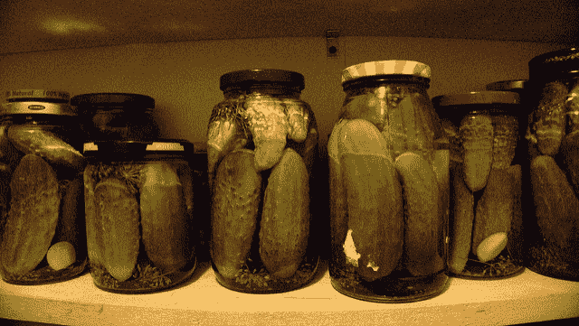

# 使用 scikit-learn 在 Python 中保存和加载机器学习模型

> 原文： [https://machinelearningmastery.com/save-load-machine-learning-models-python-scikit-learn/](https://machinelearningmastery.com/save-load-machine-learning-models-python-scikit-learn/)

找到准确的机器学习模型并不是项目的终点。

在这篇文章中，您将了解如何使用 scikit-learn 在 Python 中保存和加载机器学习模型。

这允许您将模型保存到文件并稍后加载以进行预测。

让我们开始吧。

*   **2017 年 1 月更新**：已更新，以反映版本 0.18 中 scikit-learn API 的更改。
*   **更新 March / 2018** ：添加了备用链接以下载数据集，因为原始图像已被删除。



使用 scikit-learn
照片保存并加载机器学习模型 [Christine](https://www.flickr.com/photos/spanginator/3414847568/) ，保留一些权利。

## 用泡菜完成你的模型

Pickle 是在 Python 中序列化对象的标准方法。

您可以使用 [pickle](https://docs.python.org/2/library/pickle.html) 操作来序列化您的机器学习算法并将序列化格式保存到文件中。

稍后您可以加载此文件以反序列化您的模型并使用它来进行新的预测。

下面的例子演示了如何训练 [Pima 印第安人糖尿病数据集](https://archive.ics.uci.edu/ml/datasets/Pima+Indians+Diabetes)的逻辑回归模型，将模型保存到文件并加载它以对未见的测试集进行预测（更新：[下载从这里](https://raw.githubusercontent.com/jbrownlee/Datasets/master/pima-indians-diabetes.data.csv)）。

```
# Save Model Using Pickle
import pandas
from sklearn import model_selection
from sklearn.linear_model import LogisticRegression
import pickle
url = "https://raw.githubusercontent.com/jbrownlee/Datasets/master/pima-indians-diabetes.data.csv"
names = ['preg', 'plas', 'pres', 'skin', 'test', 'mass', 'pedi', 'age', 'class']
dataframe = pandas.read_csv(url, names=names)
array = dataframe.values
X = array[:,0:8]
Y = array[:,8]
test_size = 0.33
seed = 7
X_train, X_test, Y_train, Y_test = model_selection.train_test_split(X, Y, test_size=test_size, random_state=seed)
# Fit the model on 33%
model = LogisticRegression()
model.fit(X_train, Y_train)
# save the model to disk
filename = 'finalized_model.sav'
pickle.dump(model, open(filename, 'wb'))

# some time later...

# load the model from disk
loaded_model = pickle.load(open(filename, 'rb'))
result = loaded_model.score(X_test, Y_test)
print(result)
```

运行该示例将模型保存到本地工作目录中的 **finalized_model.sav** 。加载已保存的模型并对其进行评估可以估算模型对未见数据的准确性。

```
0.755905511811
```

## 使用 joblib 完成模型

[Joblib](https://pypi.python.org/pypi/joblib) 是 SciPy 生态系统的一部分，提供用于管道化 Python 作业的实用程序。

它提供了[实用程序，用于保存和加载有效利用 NumPy 数据结构的 Python 对象](https://pythonhosted.org/joblib/generated/joblib.dump.html)。

这对于需要大量参数或存储整个数据集的某些机器学习算法（如 K-Nearest Neighbors）非常有用。

下面的示例演示了如何在 Pima Indians 糖尿病数据集开始时训练逻辑回归模型，使用 joblib 将模型保存到文件并加载它以对看不见的测试集进行预测。

```
# Save Model Using joblib
import pandas
from sklearn import model_selection
from sklearn.linear_model import LogisticRegression
from sklearn.externals import joblib
url = "https://raw.githubusercontent.com/jbrownlee/Datasets/master/pima-indians-diabetes.data.csv"
names = ['preg', 'plas', 'pres', 'skin', 'test', 'mass', 'pedi', 'age', 'class']
dataframe = pandas.read_csv(url, names=names)
array = dataframe.values
X = array[:,0:8]
Y = array[:,8]
test_size = 0.33
seed = 7
X_train, X_test, Y_train, Y_test = model_selection.train_test_split(X, Y, test_size=test_size, random_state=seed)
# Fit the model on 33%
model = LogisticRegression()
model.fit(X_train, Y_train)
# save the model to disk
filename = 'finalized_model.sav'
joblib.dump(model, filename)

# some time later...

# load the model from disk
loaded_model = joblib.load(filename)
result = loaded_model.score(X_test, Y_test)
print(result)
```

运行该示例将模型保存为文件 **finalized_model.sav** ，并为模型中的每个 NumPy 数组创建一个文件（另外四个文件）。加载模型后，将报告模型对未见数据的准确性估计值。

```
0.755905511811
```

## 完成模型的提示

本节列出了最终确定机器学习模型时的一些重要注意事项。

*   **Python 版**。记下 python 版本。几乎可以肯定，当您稍后加载并反序列化时，您需要使用相同的主要（可能是次要）版本的 Python 来序列化模型。
*   **库版本**。在反序列化已保存的模型时，机器学习项目中使用的所有主要库的版本几乎肯定需要相同。这不仅限于 NumPy 的版本和 scikit-learn 的版本。
*   **手动序列化**。您可能希望手动输出学习模型的参数，以便将来可以直接在 scikit-learn 或其他平台中使用它们。通常，机器学习算法用于进行预测的算法比用于学习参数的算法简单得多，可以很容易地在您可以控制的自定义代码中实现。

请注意该版本，以便您可以在以后因某种原因无法在其他计算机或其他平台上重新加载模型时重新创建环境。

## 摘要

在这篇文章中，您发现了如何使用 scikit-learn 在 Python 中持久保存机器学习算法。

您学习了两种可以使用的技术：

*   用于序列化标准 Python 对象的 pickle API。
*   joblib API 用于使用 NumPy 数组有效地序列化 Python 对象。

您对保存和加载机器学习算法或此帖子有任何疑问吗？在评论中提出您的问题，我会尽力回答。