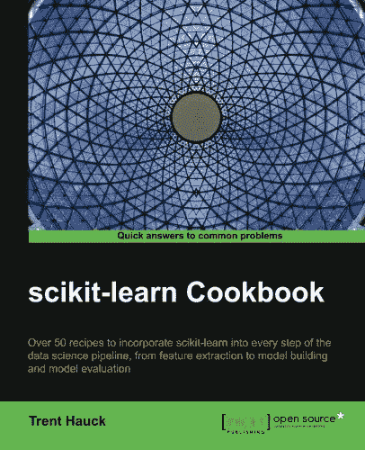

# scikit-learn 秘籍的书评

> 原文： [https://machinelearningmastery.com/scikit-learn-cookbook-book-review/](https://machinelearningmastery.com/scikit-learn-cookbook-book-review/)

scikit-learn 库是 Python 中机器学习的首选库。

在线文档非常好，但有时可能会感到支离破碎或受到狭隘范例的限制。

在这篇文章中，您将发现 Trent Hauck 的书 [Scikit-Learn Cookbook](http://www.amazon.com/dp/1783989483?tag=inspiredalgor-20) ，它提供了一个桌面参考，以补充在线文档并帮助您快速学习 scikit-learn。

我们进入吧。

## 图书概述

[Scikit-Learn Cookbook](http://www.amazon.com/dp/1783989483?tag=inspiredalgor-20) 是由 [Trent Hauck](https://www.linkedin.com/in/trent-hauck-7253bb23) 撰写并由 [Packt Publishing](https://www.packtpub.com/big-data-and-business-intelligence/scikit-learn-cookbook) 出版的重点书。

这本书的副标题是：

> 超过 50 个将 scikit-learn 纳入数据科学管道的每一步的秘籍，从特征提取到模型构建和模型评估。

它于 2014 年底出版，长度不到 200 页。我喜欢这个外形。厚厚的参考文本真的让我离开这些日子（想想[数字秘籍](http://www.amazon.com/dp/0521880688?tag=inspiredalgor-20)，它自豪地坐在我的架子上）。我宁愿有 10 个较小的焦点参考文本，如迷你百科全书系列。

我喜欢它是关于 scikit-learn 秘籍的小型尖锐文本。

### 预订观众

这本书不适合机器学习初学者。做记录。

它假定：

*   熟悉 Python。
*   熟悉 SciPy 栈。
*   熟悉机器学习。

对于已经在项目中使用 scikit-learn 的人来说，这些是合理的假设，在这种情况下，本书成为桌面参考，用于咨询特定的 ad hoc 机器学习任务。

### 书籍内容

这本书由 50 个秘籍组成？ （如果我相信目录和我自己的计数，可能有 57 个秘籍）分为 5 章。

*   第 1 章：预编程工作流程
*   第 2 章：使用线性模型
*   第 3 章：使用距离度量建立模型
*   第 4 章：使用 scikit-learn 对数据进行分类
*   第 5 章：Postmodel 工作流程

这些章节通常映射到标准数据科学项目的工作流程：

1.  获取并准备数据。
2.  尝试一些线性模型
3.  尝试一些非线性模型
4.  尝试一些更多的非线性模型。
5.  完成模型

对于一本书来说，这是一个好的结构，问题是仅靠 scikit-learn 并不能很好地服务于所有这些步骤。它擅长于建模部分，并且在数据预处理方面做得很好，但在数据加载和数据分析步骤中却很难被忽略。

接下来我们将依次逐步介绍每一章。

## 章节演练

在本节中，我们将详细介绍五章中的每个章节。

### 第 1 章：预编程工作流程

本章重点介绍数据准备。这是重新格式化数据以最好地将问题的结构暴露给我们可能选择稍后使用的机器学习算法。

本章共有 17 个秘籍，我将它们分组如下：

*   数据加载：加载您自己的数据并使用内置数据集。
*   数据清理：诸如输入缺失值之类的任务。
*   数据预处理：缩放和特征工程。
*   降维：SVD，PCA 和因子分析。
*   其他：管道，高斯过程和梯度下降。

我很伤心，我必须在这里设计自己的结构。我也很遗憾有一个“_ 其他 _”类别。这表明章节中的秘籍组织可以更清洁。

我想更多和单独的缩放方法的秘籍。我发现自己在使用它们之前会对数据集进行大量扩展。这可能是获得良好结果所需的最常见的预处理步骤。

### 第 2 章：使用线性模型

本章的重点是线性模型。这个较短的章节包含 9 个秘籍。

通常，本章的秘籍包括：

*   线性回归
*   规范化回归
*   逻辑回归
*   回归的更多奇特变化，如提升。

这又是另一个奇怪的秘籍组合。

我想我觉得线性模型的重点可以进一步扩展到 LDA，Perceptron 和平台支持的其他模型，而不仅限于回归。

### 第 3 章：使用距离度量建立模型

许多算法确实在其核心使用距离测量。

可能会想到的第一个是 KNN，但实际上你可以更广泛地解释它并引入支持向量机和使用内核的相关技术等技术。

本章重点介绍使用距离测量的技术，并且几乎专注于 K-Means（本章 9 个秘籍中的 8 个）。本章末尾有一个 KNN 秘籍。

该章应该被称为聚类或 K-Means。

此外，我最好注意我的偏见，因为我根本不使用聚类方法，我发现它们对于预测性建模完全没用。

### 第 4 章：使用 scikit-learn 对数据进行分类

从标题来看，本章是关于分类算法的。

我将在本章中组织 11 个秘籍如下：

*   决策树（CART 和随机森林）
*   支持向量机
*   判别分析（LDA 和 QDA）
*   朴素贝叶斯
*   其他（半监督学习，梯度下降等）

我会把 LDA 和 QDA 放在线性模型章节（第 2 章）中，我会添加更多的算法。 scikit-learn 的一大好处是它提供了许多开箱即用的算法。

本章涉及的那些算法很好，我所说的是我会将数字增加一倍或三倍，并使算法的秘籍成为本书的重点。

### 第 5 章：Postmodel 工作流程

本章包含 11 个关于一般岗位建模任务的方法。

这是技术上不准确的，因为您将这些任务作为建模的一部分来执行，但是，我看到了作者的目的。

我将总结本章的秘籍如下：

*   重采样方法（交叉验证和变化）。
*   算法调整（网格搜索，随机搜索，手动搜索等）。
*   特征选择。
*   其他（模型持久性，模型评估和基线）。

一个涵盖重要主题的好章节。非常重要的主题。

通常，我会在 k-fold 交叉验证的上下文中介绍每种算法，因为对于大多数用例，以任何其他方式评估算法可能不是一个好主意。

我也很惊讶地看到这本书的特色选择如此晚。我原本预计会出现在第 1 章中。它属于数据准备工作。

## 对书的思考

这本书很好。我建议那些寻找好桌面参考的人来支持 scikit-learn 的在线文档。

我通常喜欢每种秘籍的呈现方式。事实上，它的冗长程度很好，而在其他书籍中，秘籍可能过于简短。结构如下：

*   秘籍名称和描述。
*   做好准备（例如前提条件或要求）。
*   怎么做（实际代码和实现结果所需的步骤）。
*   工作原理（API 或流程的附加说明）。
*   还有更多（秘籍的可选附加变体是有用的）。

鉴于上述软推荐，我在阅读时注意到了一些事情。

我对许多秘籍的内容感到沮丧。这么多，以至于我永远不会使用它们在我自己的 scikit - 学习秘籍库中使用它们从项目到项目。

我使用 scikit - 学习了一点点，我花时间阅读并尝试了大部分 API。书中的许多秘籍都是手工制作的功能，实际上已经存在于 scikit-learn API 中。也许 API 自发布以来已经更新，但是这确实困扰了我。更少的代码是更少的维护，如果你使用像 scikit-learn 这样的库，那么你应该使用它，并且很好。

此外，通常在解释中有一些方程式。它们主要是提供技术的快捷描述并避免说明。它很好，但它们也可能被排除在外并指向一个好的参考文本，并将激光专注于 scikit-learn API。

有些秘籍太长了。我轻盈，专注，自足。我可以复制和粘贴的东西，用于在我自己的项目中启动流程。

你不能涵盖整个 scikit-learn API，本书的内容非常好。它涵盖了库的关键部分。我希望看到它涵盖了区分库的一些方面，例如更详细的管道，学习线图和模型校准。

## 摘要

在这篇文章中，你发现了 Trent Hauck 的书 [Scikit-Learn Cookbook](http://www.amazon.com/dp/1783989483?tag=inspiredalgor-20) 。

您了解到这是一本包含 50 多种使用 scikit-learn 主题的秘籍的书，例如：

*   数据准备。
*   线性和非线性算法。
*   模型评估和算法调整。

这是一本合理的秘籍，可用作桌面参考，以补充 scikit-learn 库的在线文档。

你对这本书有什么问题吗？你读过这本书吗？发表评论，让我知道你对它的看法。