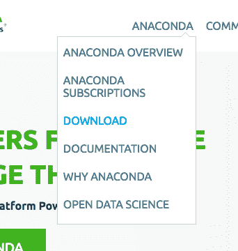
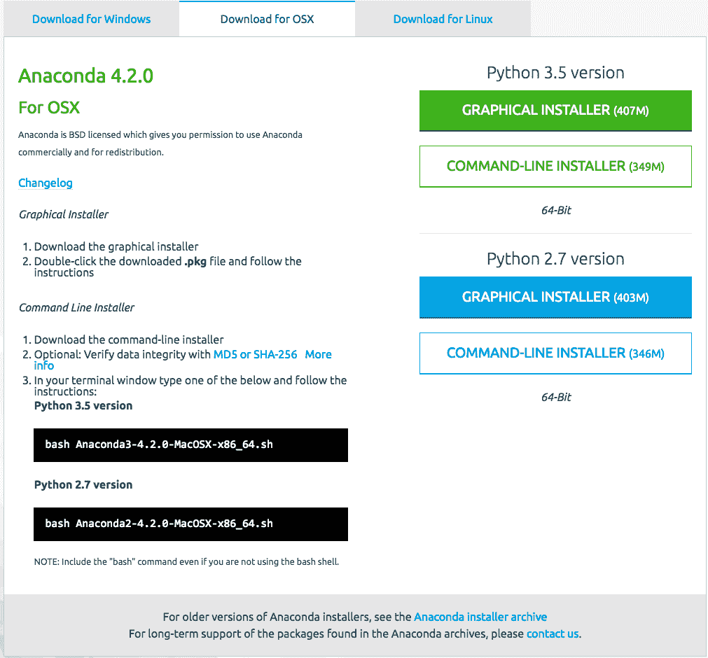
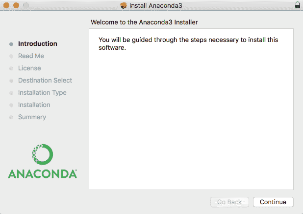
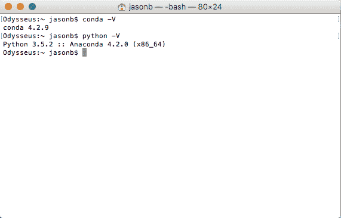
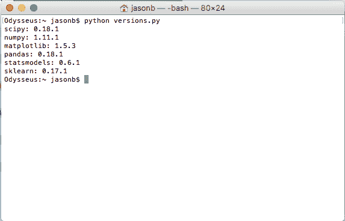
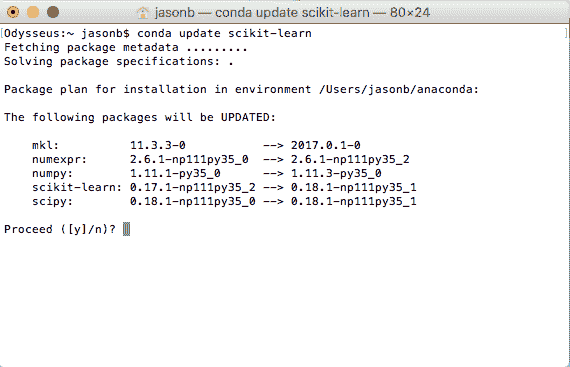
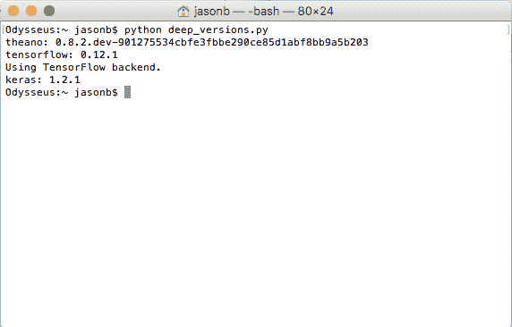

# 如何使用 Anaconda 为机器学习和深度学习设置 Python 环境

> 原文： [https://machinelearningmastery.com/setup-python-environment-machine-learning-deep-learning-anaconda/](https://machinelearningmastery.com/setup-python-environment-machine-learning-deep-learning-anaconda/)

在某些平台上安装 Python 机器学习环境可能很困难。

必须首先安装 Python 本身，然后安装许多软件包，这对初学者来说可能会造成混淆。

在本教程中，您将了解如何使用 Anaconda 设置 Python 机器学习开发环境。

完成本教程后，您将拥有一个可用的 Python 环境，可以开始学习，练习和开发机器学习和深度学习软件。

这些说明适用于 Windows，Mac OS X 和 Linux 平台。我将在 OS X 上演示它们，因此您可能会看到一些 mac 对话框和文件扩展名。

*   **2017 年 3 月更新**：补充说明你只需要 Theano 或 TensorFlow 中的一个来使用 Kears 进行深度学习。


如何使用 Anaconda 为机器学习和深度学习设置 Python 环境

## 概观

在本教程中，我们将介绍以下步骤：

1.  下载 Anaconda
2.  安装 Anaconda
3.  启动并更新 Anaconda
4.  更新 scikit-learn Library
5.  安装深度学习库

## 1.下载 Anaconda

在此步骤中，我们将为您的平台下载 Anaconda Python 软件包。

Anaconda 是一个免费且易于使用的科学 Python 环境。

*   1.访问 [Anaconda 主页](https://www.continuum.io/)。
*   2.单击菜单中的“Anaconda”，然后单击“下载”进入[下载页面](https://www.continuum.io/downloads)。



单击 Anaconda 和下载

*   3.选择适合您平台的下载（Windows，OSX 或 Linux）：
    *   选择 Python 3.5
    *   选择图形安装程序



为您的平台选择 Anaconda 下载

这会将 Anaconda Python 软件包下载到您的工作站。

我在 OS X 上，所以我选择了 OS X 版本。该文件大约 426 MB。

你应该有一个名称如下的文件：

```
Anaconda3-4.2.0-MacOSX-x86_64.pkg
```

## 2.安装 Anaconda

在此步骤中，我们将在您的系统上安装 Anaconda Python 软件。

此步骤假定您具有足够的管理权限以在系统上安装软件。

*   1.双击下载的文件。
*   2.按照安装向导进行操作。



Anaconda Python 安装向导

安装快速无痛。

应该没有棘手的问题或难点。


Anaconda Python 安装向导编写文件

安装应该不到 10 分钟，并占用硬盘驱动器上 1 GB 以上的空间。

## 3.启动并更新 Anaconda

在此步骤中，我们将确认您的 Anaconda Python 环境是最新的。

Anaconda 附带一套名为 Anaconda Navigator 的图形工具。您可以从应用程序启动器中打开 Anaconda Navigator。


Anaconda Navigator GUI

您可以在这里了解 [Anaconda Navigator 的所有信息。](https://docs.continuum.io/anaconda/navigator.html)

您可以稍后使用 Anaconda Navigator 和图形开发环境;现在，我建议从名为 [conda](http://conda.pydata.org/docs/index.html) 的 Anaconda 命令行环境开始。

Conda 快速，简单，隐藏错误消息很难，您可以快速确认您的环境已安装并正常工作。

*   1.打开终端（命令行窗口）。
*   2.输入以下命令确认 conda 已正确安装：

```
conda -V
```

你应该看到以下（或类似的东西）：

```
conda 4.2.9
```

*   3.键入以下命令确认 Python 已正确安装：

```
python -V
```

You should see the following (or something similar):

```
Python 3.5.2 :: Anaconda 4.2.0 (x86_64)
```



确认已安装 Conda 和 Python

如果命令不起作用或出现错误，请查看文档以获取适用于您的平台的帮助。

请参阅“进一步阅读”部分中的一些资源。

*   4.确认您的 conda 环境是最新的，键入：

```
conda update conda
conda update anaconda
```

您可能需要安装一些软件包并确认更新。

*   5.确认您的 SciPy 环境。

下面的脚本将打印机器学习开发所需的关键 SciPy 库的版本号，特别是：SciPy，NumPy，Matplotlib，Pandas，Statsmodels 和 Scikit-learn。

您可以键入“python”并直接键入命令。或者，我建议打开文本编辑器并将脚本复制粘贴到编辑器中。

```
# scipy
import scipy
print('scipy: %s' % scipy.__version__)
# numpy
import numpy
print('numpy: %s' % numpy.__version__)
# matplotlib
import matplotlib
print('matplotlib: %s' % matplotlib.__version__)
# pandas
import pandas
print('pandas: %s' % pandas.__version__)
# statsmodels
import statsmodels
print('statsmodels: %s' % statsmodels.__version__)
# scikit-learn
import sklearn
print('sklearn: %s' % sklearn.__version__)
```

将脚本保存为名为`versions.py`的文件。

在命令行上，将目录更改为保存脚本的位置并键入：

```
python versions.py
```

您应该看到如下输出：

```
scipy: 0.18.1
numpy: 1.11.1
matplotlib: 1.5.3
pandas: 0.18.1
statsmodels: 0.6.1
sklearn: 0.17.1
```

你得到了什么版本？
将输出粘贴到下面的注释中。



确认 Anaconda SciPy 环境

## 4.更新 scikit-learn Library

在这一步中，我们将更新用于 Python 机器学习的主库，名为 scikit-learn。

*   1.更新 scikit-学习最新版本。

在撰写本文时，Anaconda 附带的 scikit-learn 版本已过时（0.17.1 而不是 0.18.1）。您可以使用 conda 命令更新特定库;下面是更新 scikit-learn 到最新版本的示例。

在终端输入：

```
conda update scikit-learn
```



更新 Anikonda 中的 scikit-learn

或者，您可以通过键入以下内容将库更新为特定版本：

```
conda install -c anaconda scikit-learn=0.18.1
```

确认安装成功并通过键入以下命令重新运行`versions.py`脚本来更新 scikit-learn：

```
python versions.py
```

You should see output like the following:

```
scipy: 0.18.1
numpy: 1.11.3
matplotlib: 1.5.3
pandas: 0.18.1
statsmodels: 0.6.1
sklearn: 0.18.1
```

What versions did you get?
Paste the output in the comments below.

您可以根据需要使用这些命令更新机器学习和 SciPy 库。

尝试 scikit-learn 教程，例如：

*   [你的第一个 Python 循环机器学习项目](http://machinelearningmastery.com/machine-learning-in-python-step-by-step/)

## 5.安装深度学习库

在这一步中，我们将安装用于深度学习的 Python 库，特别是：Theano，TensorFlow 和 Keras。

**注**：我建议使用 Keras 进行深度学习，而 Keras 只需要安装 Theano 或 TensorFlow 中的一个。你不需要两个！在某些 Windows 计算机上安装 TensorFlow 可能会出现问题。

*   1.输入以下命令安装 Theano 深度学习库：

```
conda install theano
```

*   2.键入以下命令安装 TensorFlow 深度学习库（Windows 以外的所有库）：

```
conda install -c conda-forge tensorflow
```

或者，您可以选择使用 pip 和特定版本的 tensorflow 为您的平台安装。

有关张量流，请参阅[安装说明。](https://www.tensorflow.org/get_started/os_setup#anaconda_installation)

*   3.输入以下命令安装 Keras：

```
pip install keras
```

*   4.确认您的深度学习环境已安装并正常运行。

创建一个打印每个库的版本号的脚本，就像我们之前为 SciPy 环境所做的那样。

```
# theano
import theano
print('theano: %s' % theano.__version__)
# tensorflow
import tensorflow
print('tensorflow: %s' % tensorflow.__version__)
# keras
import keras
print('keras: %s' % keras.__version__)
```

将脚本保存到文件`deep_versions.py`。键入以下命令运行脚本：

```
python deep_versions.py
```

您应该看到如下输出：

```
theano: 0.8.2.dev-901275534cbfe3fbbe290ce85d1abf8bb9a5b203
tensorflow: 0.12.1
Using TensorFlow backend.
keras: 1.2.1
```



Anaconda 确认深度学习库

你得到了什么版本？
将您的输出粘贴到下面的注释中。

尝试使用 Keras 深度学习教程，例如：

*   [用 Keras 逐步开发 Python 中的第一个神经网络](http://machinelearningmastery.com/tutorial-first-neural-network-python-keras/)

## 进一步阅读

本节提供了一些进一步阅读的链接。

*   [Anaconda 文档](https://docs.continuum.io/)
*   [Anaconda 文档：安装](https://docs.continuum.io/anaconda/install)
*   [Conda](http://conda.pydata.org/docs/index.html)
*   [使用 conda](http://conda.pydata.org/docs/using/)
*   [Anaconda Navigator](https://docs.continuum.io/anaconda/navigator.html)
*   [安装 Theano](http://deeplearning.net/software/theano/install.html)
*   [安装 TensorFlow Anaconda](https://www.tensorflow.org/get_started/os_setup#anaconda_installation)
*   [Keras 安装](https://keras.io/#installation)

## 摘要

恭喜，您现在拥有一个可用于机器学习和深度学习的 Python 开发环境。

您现在可以在工作站上学习和练习机器学习和深度学习。

你是怎么去的？
请在下面的评论中告诉我。