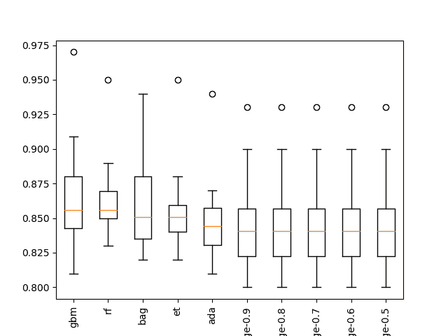
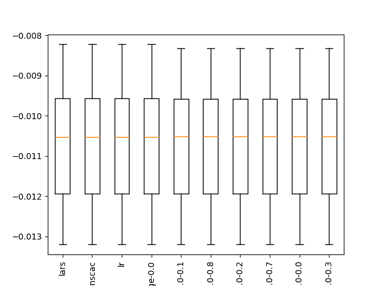
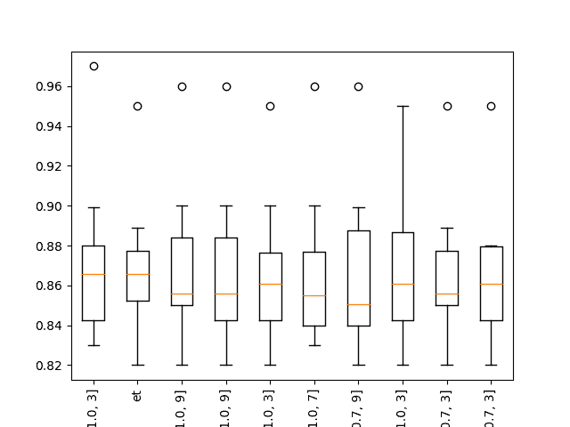

# 如何在 Python 中开发可重复使用的抽样检查算法框架

> 译文： [https://machinelearningmastery.com/spot-check-machine-learning-algorithms-in-python/](https://machinelearningmastery.com/spot-check-machine-learning-algorithms-in-python/)

[抽样检查算法](https://machinelearningmastery.com/spot-check-classification-machine-learning-algorithms-python-scikit-learn/)是一种应用机器学习技术，旨在快速客观地为新的预测建模问题提供第一组结果。

与寻找算法的最佳算法或最佳配置的网格搜索和其他类型的算法调整不同，点检查旨在快速评估各种算法并提供粗略的第一切结果。如果问题或问题表示确实是可预测的，则可以使用该第一剪切结果，如果是，则可能值得进一步研究该问题的算法类型。

现场检查是一种帮助克服应用机器学习的“[难题](https://machinelearningmastery.com/applied-machine-learning-is-hard/)”的方法，并鼓励您清楚地考虑在任何机器学习项目中执行的[高阶搜索问题](https://machinelearningmastery.com/applied-machine-learning-as-a-search-problem/) 。

在本教程中，您将发现现场检查算法对新预测建模问题的有用性，以及如何在 python 中为分类和回归问题开发用于抽样检查算法的标准框架。

完成本教程后，您将了解：

*   抽样检查提供了一种快速发现在预测建模问题上表现良好的算法类型的方法。
*   如何开发用于加载数据，定义模型，评估模型和总结结果的通用框架。
*   如何应用框架进行分类和回归问题。

让我们开始吧。


如何在 Python 中开发可重复使用的抽样检查算法框架
[Jeff Turner](https://www.flickr.com/photos/respres/16216077206/) 的照片，保留一些权利。

## 教程概述

本教程分为五个部分;他们是：

1.  抽样检查算法
2.  Python 中的 Spot-Checking 框架
3.  现场检查分类
4.  现场检查回归
5.  框架扩展

## 1.抽样检查算法

我们事先无法知道哪些算法在给定的预测建模问题上表现良好。

这是应用机器学习的[难点部分，只能通过系统实验来解决。](https://machinelearningmastery.com/applied-machine-learning-is-hard/)

[抽查](https://machinelearningmastery.com/why-you-should-be-spot-checking-algorithms-on-your-machine-learning-problems/)是解决这个问题的方法。

它涉及针对问题快速测试大量不同的机器学习算法，以便快速发现哪些算法可能起作用以及在哪里集中注意力。

*   **速度很快**;它绕过准备和分析的几天或几周，并使用可能不会导致结果的算法。
*   **它是客观的**，允许您发现什么可能适用于问题，而不是使用您上次使用的。
*   **得到结果**;您将实际拟合模型，进行预测并了解您的问题是否可以预测以及基线技能可能是什么样子。

抽样检查可能需要您使用数据集的一小部分样本才能快速转换结果。

最后，现场检查的结果是一个起点。一个起点。他们建议将注意力集中在问题上，而不是最佳算法。该过程旨在让您摆脱典型的思考和分析，转而关注结果。

您可以在帖子中了解有关抽查的更多信息：

*   [为什么你应该在机器学习问题上进行抽样检查算法](https://machinelearningmastery.com/why-you-should-be-spot-checking-algorithms-on-your-machine-learning-problems/)

现在我们知道了什么是现场检查，让我们看看如何在 Python 中系统地执行抽样检查。

## 2\. Python 中的 Spot-Checking 框架

在本节中，我们将构建一个脚本框架，该框架可用于在分类或回归问题上对机器学习算法进行抽样检查。

我们需要开发框架有四个部分;他们是：

*   加载数据集
*   定义模型
*   评估模型
*   总结结果

让我们依次看看每一个。

### 加载数据集

框架的第一步是加载数据。

必须针对给定问题实现该功能，并专门针对该问题。它可能涉及从一个或多个 CSV 文件加载数据。

我们将调用此函数 _load_data（）_;它不需要参数并返回输入（`X`）和输出（`y`）用于预测问题。

```
# load the dataset, returns X and y elements
def load_dataset():
	X, y = None, None
	return X, y
```

### 定义模型

下一步是定义模型以评估预测建模问题。

定义的模型将特定于类型预测建模问题，例如，分类或回归。

定义的模型应该是多样的，包括以下的混合：

*   线性模型。
*   非线性模型。
*   合奏模型。

每个模型应该是一个很好的机会，可以很好地解决问题。这可能意味着提供模型的一些变体，使用不同的常见或众所周知的配置，平均表现良好。

我们将调用此函数 _define_models（）_。它将返回映射到 scikit-learn 模型对象的模型名称字典。名称应该很短，例如'`svm`'，并且可以包括配置细节，例如“KNN-7”。

该函数还将字典作为可选参数;如果未提供，则创建并填充新字典。如果提供了字典，则会向其添加模型。

如果您希望使用多个函数来定义模型，或者添加具有不同配置的特定类型的大量模型，则可以增加灵活性。

```
# create a dict of standard models to evaluate {name:object}
def define_models(models=dict()):
	# ...
	return models
```

我们的想法不是网格搜索模型参数;那可以晚点来。

相反，每个模型应该有机会表现良好（即不是最佳）。这可能意味着在某些情况下尝试许多参数组合，例如在梯度增强的情况下。

### 评估模型

下一步是评估已加载数据集上的已定义模型。

scikit-learn 库提供了在评估期间管道模型的能力。这允许在用于拟合模型之前变换数据，并且这以正确的方式完成，使得变换在训练数据上准备并应用于测试数据。

我们可以定义一个函数，在评估之前准备给定的模型，以允许在抽样检查过程中使用特定的变换。它们将以一揽子方式对所有模型进行。这对于执行标准化，规范化和特征选择等操作非常有用。

我们将定义一个名为 _make_pipeline（）_ 的函数，它接受一个已定义的模型并返回一个管道。下面是准备管道的示例，该管道将首先标准化输入数据，然后在拟合模型之前对其进行标准化。

```
# create a feature preparation pipeline for a model
def make_pipeline(model):
	steps = list()
	# standardization
	steps.append(('standardize', StandardScaler()))
	# normalization
	steps.append(('normalize', MinMaxScaler()))
	# the model
	steps.append(('model', model))
	# create pipeline
	pipeline = Pipeline(steps=steps)
	return pipeline
```

此函数可以扩展为添加其他变换，或者简化为返回提供的模型而不进行变换。

现在我们需要评估准备好的模型。

我们将使用 k-fold 交叉验证评估模型的标准。对每个定义的模型的评估将产生结果列表。这是因为该模型的 10 个不同版本将被拟合和评估，从而得到 k 分数列表。

我们将定义一个名为 _evaluate_model（）_ 的函数，该函数将获取数据，定义的模型，多个折叠以及用于评估结果的表现指标。它将返回分数列表。

该函数调用 _make_pipeline（）_ 为定义的模型准备所需的任何数据变换，然后调用 [cross_val_score（）](http://scikit-learn.org/stable/modules/generated/sklearn.model_selection.cross_val_score.html) scikit-learn 函数。重要的是，`n_jobs`参数设置为-1，以允许模型评估并行发生，从而利用硬件上可用的核心数量。

```
# evaluate a single model
def evaluate_model(X, y, model, folds, metric):
	# create the pipeline
	pipeline = make_pipeline(model)
	# evaluate model
	scores = cross_val_score(pipeline, X, y, scoring=metric, cv=folds, n_jobs=-1)
	return scores
```

模型的评估可能会因异常而失败。我已经看到了这一点，特别是在 statsmodels 库中的一些模型的情况下。

评估模型也可能产生大量警告信息。我已经看到了这一点，特别是在使用 XGBoost 模型的情况下。

在抽查时我们不关心异常或警告。我们只想知道哪些有效，哪些有效。因此，我们可以在评估每个模型时捕获异常并忽略所有警告。

名为 _robust_evaluate_model（）_ 的函数实现了此行为。 _evaluate_model（）_ 的调用方式是捕获异常并忽略警告。如果发生异常并且给定模型无法得到结果，则返回 _ 无 _ 结果。

```
# evaluate a model and try to trap errors and and hide warnings
def robust_evaluate_model(X, y, model, folds, metric):
	scores = None
	try:
		with warnings.catch_warnings():
			warnings.filterwarnings("ignore")
			scores = evaluate_model(X, y, model, folds, metric)
	except:
		scores = None
	return scores
```

最后，我们可以定义顶级函数来评估已定义模型的列表。

我们将定义一个名为 _evaluate_models（）_ 的函数，它将模型字典作为参数，并将模型名称字典返回到结果列表。

交叉验证过程中的折叠数可以由默认为 10 的可选参数指定。根据模型的预测计算的度量也可以由可选参数指定，默认为分类精度。

有关支持的指标的完整列表，请参阅此列表：

*   [评分参数：定义模型评估规则，scikit-learn](http://scikit-learn.org/stable/modules/model_evaluation.html#scoring-parameter) 。

跳过任何无结果，不会将其添加到结果字典中。

重要的是，我们提供了一些详细的输出，总结了每个模型评估后的平均值和标准差。如果数据集上的抽样检查过程需要几分钟到几小时，这将非常有用。

```
# evaluate a dict of models {name:object}, returns {name:score}
def evaluate_models(X, y, models, folds=10, metric='accuracy'):
	results = dict()
	for name, model in models.items():
		# evaluate the model
		scores = robust_evaluate_model(X, y, model, folds, metric)
		# show process
		if scores is not None:
			# store a result
			results[name] = scores
			mean_score, std_score = mean(scores), std(scores)
			print('>%s: %.3f (+/-%.3f)' % (name, mean_score, std_score))
		else:
			print('>%s: error' % name)
	return results
```

请注意，如果由于某种原因您想要查看警告和错误，您可以更新 _evaluate_models（）_ 以直接调用 _evaluate_model（）_ 函数，绕过强大的错误处理。在测试静默失败的新方法或方法配置时，我发现这很有用。

### 总结结果

最后，我们可以评估结果。

真的，我们只想知道哪些算法表现良好。

总结结果的两种有用方法是：

1.  排名前 10 位的算法的平均值和标准差的线摘要。
2.  前 10 名执行算法的框和胡须图。

线条摘要快速而精确，但假设表现良好的高斯分布，这可能不合理。

盒子和须状图假设没有分布，并提供了一种直观的方法，可以直接比较模型的分数在中位数表现和分数差异方面的分布。

我们将定义一个名为 _summarize_results（）_ 的函数，该函数获取结果字典，打印结果摘要，并创建保存到文件的 boxplot 图像。该函数接受一个参数来指定评估得分是否最大化，默认情况下为`True`。要汇总的结果数也可以作为可选参数提供，默认为 10。

该功能首先在打印摘要和创建框和须图之前对得分进行排序。

```
# print and plot the top n results
def summarize_results(results, maximize=True, top_n=10):
	# check for no results
	if len(results) == 0:
		print('no results')
		return
	# determine how many results to summarize
	n = min(top_n, len(results))
	# create a list of (name, mean(scores)) tuples
	mean_scores = [(k,mean(v)) for k,v in results.items()]
	# sort tuples by mean score
	mean_scores = sorted(mean_scores, key=lambda x: x[1])
	# reverse for descending order (e.g. for accuracy)
	if maximize:
		mean_scores = list(reversed(mean_scores))
	# retrieve the top n for summarization
	names = [x[0] for x in mean_scores[:n]]
	scores = [results[x[0]] for x in mean_scores[:n]]
	# print the top n
	print()
	for i in range(n):
		name = names[i]
		mean_score, std_score = mean(results[name]), std(results[name])
		print('Rank=%d, Name=%s, Score=%.3f (+/- %.3f)' % (i+1, name, mean_score, std_score))
	# boxplot for the top n
	pyplot.boxplot(scores, labels=names)
	_, labels = pyplot.xticks()
	pyplot.setp(labels, rotation=90)
	pyplot.savefig('spotcheck.png')
```

现在我们已经专门设计了一个用于 Python 中的抽样算法的框架，让我们看一下如何将它应用于分类问题。

## 3.现场检查分类

我们将使用 [make_classification（）函数](http://scikit-learn.org/stable/modules/generated/sklearn.datasets.make_classification.html)生成二元分类问题。

该函数将生成 1,000 个样本，包含 20 个变量，一些冗余变量和两个类。

```
# load the dataset, returns X and y elements
def load_dataset():
	return make_classification(n_samples=1000, n_classes=2, random_state=1)
```

作为分类问题，我们将尝试一套分类算法，具体来说：

### 线性算法

*   Logistic 回归
*   岭回归
*   随机梯度下降分类器
*   被动攻击性分类器

我尝试了 LDA 和 QDA，但他们遗憾地在某处的 C 代码中崩溃了。

### 非线性算法

*   k-最近邻居
*   分类和回归树
*   额外的树
*   支持向量机
*   朴素贝叶斯

### 集合算法

*   AdaBoost 的
*   袋装决策树
*   随机森林
*   额外的树木
*   梯度增压机

此外，我为一些算法添加了多种配置，如 Ridge，kNN 和 SVM，以便为他们提供很好的解决问题的机会。

下面列出了完整的 _define_models（）_ 函数。

```
# create a dict of standard models to evaluate {name:object}
def define_models(models=dict()):
	# linear models
	models['logistic'] = LogisticRegression()
	alpha = [0.1, 0.2, 0.3, 0.4, 0.5, 0.6, 0.7, 0.8, 0.9, 1.0]
	for a in alpha:
		models['ridge-'+str(a)] = RidgeClassifier(alpha=a)
	models['sgd'] = SGDClassifier(max_iter=1000, tol=1e-3)
	models['pa'] = PassiveAggressiveClassifier(max_iter=1000, tol=1e-3)
	# non-linear models
	n_neighbors = range(1, 21)
	for k in n_neighbors:
		models['knn-'+str(k)] = KNeighborsClassifier(n_neighbors=k)
	models['cart'] = DecisionTreeClassifier()
	models['extra'] = ExtraTreeClassifier()
	models['svml'] = SVC(kernel='linear')
	models['svmp'] = SVC(kernel='poly')
	c_values = [0.1, 0.2, 0.3, 0.4, 0.5, 0.6, 0.7, 0.8, 0.9, 1.0]
	for c in c_values:
		models['svmr'+str(c)] = SVC(C=c)
	models['bayes'] = GaussianNB()
	# ensemble models
	n_trees = 100
	models['ada'] = AdaBoostClassifier(n_estimators=n_trees)
	models['bag'] = BaggingClassifier(n_estimators=n_trees)
	models['rf'] = RandomForestClassifier(n_estimators=n_trees)
	models['et'] = ExtraTreesClassifier(n_estimators=n_trees)
	models['gbm'] = GradientBoostingClassifier(n_estimators=n_trees)
	print('Defined %d models' % len(models))
	return models
```

而已;我们现在准备好检查问题的算法。

下面列出了完整的示例。

```
# binary classification spot check script
import warnings
from numpy import mean
from numpy import std
from matplotlib import pyplot
from sklearn.datasets import make_classification
from sklearn.model_selection import cross_val_score
from sklearn.preprocessing import StandardScaler
from sklearn.preprocessing import MinMaxScaler
from sklearn.pipeline import Pipeline
from sklearn.linear_model import LogisticRegression
from sklearn.linear_model import RidgeClassifier
from sklearn.linear_model import SGDClassifier
from sklearn.linear_model import PassiveAggressiveClassifier
from sklearn.neighbors import KNeighborsClassifier
from sklearn.tree import DecisionTreeClassifier
from sklearn.tree import ExtraTreeClassifier
from sklearn.svm import SVC
from sklearn.naive_bayes import GaussianNB
from sklearn.ensemble import AdaBoostClassifier
from sklearn.ensemble import BaggingClassifier
from sklearn.ensemble import RandomForestClassifier
from sklearn.ensemble import ExtraTreesClassifier
from sklearn.ensemble import GradientBoostingClassifier

# load the dataset, returns X and y elements
def load_dataset():
	return make_classification(n_samples=1000, n_classes=2, random_state=1)

# create a dict of standard models to evaluate {name:object}
def define_models(models=dict()):
	# linear models
	models['logistic'] = LogisticRegression()
	alpha = [0.1, 0.2, 0.3, 0.4, 0.5, 0.6, 0.7, 0.8, 0.9, 1.0]
	for a in alpha:
		models['ridge-'+str(a)] = RidgeClassifier(alpha=a)
	models['sgd'] = SGDClassifier(max_iter=1000, tol=1e-3)
	models['pa'] = PassiveAggressiveClassifier(max_iter=1000, tol=1e-3)
	# non-linear models
	n_neighbors = range(1, 21)
	for k in n_neighbors:
		models['knn-'+str(k)] = KNeighborsClassifier(n_neighbors=k)
	models['cart'] = DecisionTreeClassifier()
	models['extra'] = ExtraTreeClassifier()
	models['svml'] = SVC(kernel='linear')
	models['svmp'] = SVC(kernel='poly')
	c_values = [0.1, 0.2, 0.3, 0.4, 0.5, 0.6, 0.7, 0.8, 0.9, 1.0]
	for c in c_values:
		models['svmr'+str(c)] = SVC(C=c)
	models['bayes'] = GaussianNB()
	# ensemble models
	n_trees = 100
	models['ada'] = AdaBoostClassifier(n_estimators=n_trees)
	models['bag'] = BaggingClassifier(n_estimators=n_trees)
	models['rf'] = RandomForestClassifier(n_estimators=n_trees)
	models['et'] = ExtraTreesClassifier(n_estimators=n_trees)
	models['gbm'] = GradientBoostingClassifier(n_estimators=n_trees)
	print('Defined %d models' % len(models))
	return models

# create a feature preparation pipeline for a model
def make_pipeline(model):
	steps = list()
	# standardization
	steps.append(('standardize', StandardScaler()))
	# normalization
	steps.append(('normalize', MinMaxScaler()))
	# the model
	steps.append(('model', model))
	# create pipeline
	pipeline = Pipeline(steps=steps)
	return pipeline

# evaluate a single model
def evaluate_model(X, y, model, folds, metric):
	# create the pipeline
	pipeline = make_pipeline(model)
	# evaluate model
	scores = cross_val_score(pipeline, X, y, scoring=metric, cv=folds, n_jobs=-1)
	return scores

# evaluate a model and try to trap errors and and hide warnings
def robust_evaluate_model(X, y, model, folds, metric):
	scores = None
	try:
		with warnings.catch_warnings():
			warnings.filterwarnings("ignore")
			scores = evaluate_model(X, y, model, folds, metric)
	except:
		scores = None
	return scores

# evaluate a dict of models {name:object}, returns {name:score}
def evaluate_models(X, y, models, folds=10, metric='accuracy'):
	results = dict()
	for name, model in models.items():
		# evaluate the model
		scores = robust_evaluate_model(X, y, model, folds, metric)
		# show process
		if scores is not None:
			# store a result
			results[name] = scores
			mean_score, std_score = mean(scores), std(scores)
			print('>%s: %.3f (+/-%.3f)' % (name, mean_score, std_score))
		else:
			print('>%s: error' % name)
	return results

# print and plot the top n results
def summarize_results(results, maximize=True, top_n=10):
	# check for no results
	if len(results) == 0:
		print('no results')
		return
	# determine how many results to summarize
	n = min(top_n, len(results))
	# create a list of (name, mean(scores)) tuples
	mean_scores = [(k,mean(v)) for k,v in results.items()]
	# sort tuples by mean score
	mean_scores = sorted(mean_scores, key=lambda x: x[1])
	# reverse for descending order (e.g. for accuracy)
	if maximize:
		mean_scores = list(reversed(mean_scores))
	# retrieve the top n for summarization
	names = [x[0] for x in mean_scores[:n]]
	scores = [results[x[0]] for x in mean_scores[:n]]
	# print the top n
	print()
	for i in range(n):
		name = names[i]
		mean_score, std_score = mean(results[name]), std(results[name])
		print('Rank=%d, Name=%s, Score=%.3f (+/- %.3f)' % (i+1, name, mean_score, std_score))
	# boxplot for the top n
	pyplot.boxplot(scores, labels=names)
	_, labels = pyplot.xticks()
	pyplot.setp(labels, rotation=90)
	pyplot.savefig('spotcheck.png')

# load dataset
X, y = load_dataset()
# get model list
models = define_models()
# evaluate models
results = evaluate_models(X, y, models)
# summarize results
summarize_results(results)
```

运行该示例为每个评估模型打印一行，结束对问题的前 10 个执行算法的摘要。

我们可以看到决策树的集合对这个问题表现最好。这表明了一些事情：

*   决策树的集合可能是集中注意力的好地方。
*   如果进一步调整，梯度提升可能会很好。
*   该问题的“良好”表现是准确度约为 86％。
*   岭回归的相对较高的表现表明需要进行特征选择。

```
...
>bag: 0.862 (+/-0.034)
>rf: 0.865 (+/-0.033)
>et: 0.858 (+/-0.035)
>gbm: 0.867 (+/-0.044)

Rank=1, Name=gbm, Score=0.867 (+/- 0.044)
Rank=2, Name=rf, Score=0.865 (+/- 0.033)
Rank=3, Name=bag, Score=0.862 (+/- 0.034)
Rank=4, Name=et, Score=0.858 (+/- 0.035)
Rank=5, Name=ada, Score=0.850 (+/- 0.035)
Rank=6, Name=ridge-0.9, Score=0.848 (+/- 0.038)
Rank=7, Name=ridge-0.8, Score=0.848 (+/- 0.038)
Rank=8, Name=ridge-0.7, Score=0.848 (+/- 0.038)
Rank=9, Name=ridge-0.6, Score=0.848 (+/- 0.038)
Rank=10, Name=ridge-0.5, Score=0.848 (+/- 0.038)
```

还创建了一个盒子和胡须图，以总结前 10 个表现良好的算法的结果。

该图显示了由决策树集合组成的方法的高程。该情节强调了进一步关注这些方法将是个好主意的观念。



分类问题前 10 个抽样检验算法的箱线图

如果这是一个真正的分类问题，我会跟进进一步的抽查，例如：

*   使用各种不同的特征选择方法进行抽查。
*   无需数据缩放方法的抽查。
*   使用 sklearn 或 XGBoost 中的梯度增强配置的课程网格进行抽查。

接下来，我们将看到如何将框架应用于回归问题。

## 4.现场检查回归

我们可以通过非常小的变化来探索回归预测建模问题的相同框架。

我们可以使用 [make_regression（）函数](http://scikit-learn.org/stable/modules/generated/sklearn.datasets.make_regression.html#sklearn.datasets.make_regression)来生成一个人为的回归问题，包括 1,000 个示例和 50 个特征，其中一些是冗余的。

定义的 _load_dataset（）_ 功能如下所示。

```
# load the dataset, returns X and y elements
def load_dataset():
	return make_regression(n_samples=1000, n_features=50, noise=0.1, random_state=1)
```

然后我们可以指定一个 _get_models（）_ 函数来定义一套回归方法。

Scikit-learn 提供了广泛的线性回归方法，非常出色。并非所有这些都可能是您的问题所必需的。我建议使用最小的线性回归和弹性网，后者有一套很好的 alpha 和 lambda 参数。

不过，我们将测试有关此问题的全套方法，包括：

### Linear Algorithms

*   线性回归
*   套索回归
*   岭回归
*   弹性网络回归
*   胡贝尔回归
*   LARS 回归
*   Lasso LARS 回归
*   被动攻击性回归
*   RANSAC 回归量
*   随机梯度下降回归
*   Theil 回归

### Nonlinear Algorithms

*   k-最近邻居
*   分类和回归树
*   额外的树
*   支持向量回归

### Ensemble Algorithms

*   AdaBoost 的
*   袋装决策树
*   随机森林
*   额外的树木
*   梯度增压机

完整的 _get_models（）_ 功能如下所示。

```
# create a dict of standard models to evaluate {name:object}
def get_models(models=dict()):
	# linear models
	models['lr'] = LinearRegression()
	alpha = [0.0, 0.1, 0.2, 0.3, 0.4, 0.5, 0.6, 0.7, 0.8, 0.9, 1.0]
	for a in alpha:
		models['lasso-'+str(a)] = Lasso(alpha=a)
	for a in alpha:
		models['ridge-'+str(a)] = Ridge(alpha=a)
	for a1 in alpha:
		for a2 in alpha:
			name = 'en-' + str(a1) + '-' + str(a2)
			models[name] = ElasticNet(a1, a2)
	models['huber'] = HuberRegressor()
	models['lars'] = Lars()
	models['llars'] = LassoLars()
	models['pa'] = PassiveAggressiveRegressor(max_iter=1000, tol=1e-3)
	models['ranscac'] = RANSACRegressor()
	models['sgd'] = SGDRegressor(max_iter=1000, tol=1e-3)
	models['theil'] = TheilSenRegressor()
	# non-linear models
	n_neighbors = range(1, 21)
	for k in n_neighbors:
		models['knn-'+str(k)] = KNeighborsRegressor(n_neighbors=k)
	models['cart'] = DecisionTreeRegressor()
	models['extra'] = ExtraTreeRegressor()
	models['svml'] = SVR(kernel='linear')
	models['svmp'] = SVR(kernel='poly')
	c_values = [0.1, 0.2, 0.3, 0.4, 0.5, 0.6, 0.7, 0.8, 0.9, 1.0]
	for c in c_values:
		models['svmr'+str(c)] = SVR(C=c)
	# ensemble models
	n_trees = 100
	models['ada'] = AdaBoostRegressor(n_estimators=n_trees)
	models['bag'] = BaggingRegressor(n_estimators=n_trees)
	models['rf'] = RandomForestRegressor(n_estimators=n_trees)
	models['et'] = ExtraTreesRegressor(n_estimators=n_trees)
	models['gbm'] = GradientBoostingRegressor(n_estimators=n_trees)
	print('Defined %d models' % len(models))
	return models
```

默认情况下，框架使用分类准确性作为评估模型预测的方法。

这对回归没有意义，我们可以改变这对回归更有意义的东西，例如均方误差。我们可以通过在调用 _evaluate_models（）_ 函数时传递 _metric ='neg_mean_squared_error'_ 参数来做到这一点。

```
# evaluate models
results = evaluate_models(models, metric='neg_mean_squared_error')
```

请注意，默认情况下，scikit-learn 会反转错误分数，以便最大化而不是最小化。这就是为什么均方误差为负，并在汇总时会有负号。因为分数被反转，我们可以继续假设我们在 _summarize_results（）_ 函数中最大化分数，并且不需要像我们在使用时所预期的那样指定 _maximize = False_ 。错误指标。

完整的代码示例如下所示。

```
# regression spot check script
import warnings
from numpy import mean
from numpy import std
from matplotlib import pyplot
from sklearn.datasets import make_regression
from sklearn.model_selection import cross_val_score
from sklearn.preprocessing import StandardScaler
from sklearn.preprocessing import MinMaxScaler
from sklearn.pipeline import Pipeline
from sklearn.linear_model import LinearRegression
from sklearn.linear_model import Lasso
from sklearn.linear_model import Ridge
from sklearn.linear_model import ElasticNet
from sklearn.linear_model import HuberRegressor
from sklearn.linear_model import Lars
from sklearn.linear_model import LassoLars
from sklearn.linear_model import PassiveAggressiveRegressor
from sklearn.linear_model import RANSACRegressor
from sklearn.linear_model import SGDRegressor
from sklearn.linear_model import TheilSenRegressor
from sklearn.neighbors import KNeighborsRegressor
from sklearn.tree import DecisionTreeRegressor
from sklearn.tree import ExtraTreeRegressor
from sklearn.svm import SVR
from sklearn.ensemble import AdaBoostRegressor
from sklearn.ensemble import BaggingRegressor
from sklearn.ensemble import RandomForestRegressor
from sklearn.ensemble import ExtraTreesRegressor
from sklearn.ensemble import GradientBoostingRegressor

# load the dataset, returns X and y elements
def load_dataset():
	return make_regression(n_samples=1000, n_features=50, noise=0.1, random_state=1)

# create a dict of standard models to evaluate {name:object}
def get_models(models=dict()):
	# linear models
	models['lr'] = LinearRegression()
	alpha = [0.0, 0.1, 0.2, 0.3, 0.4, 0.5, 0.6, 0.7, 0.8, 0.9, 1.0]
	for a in alpha:
		models['lasso-'+str(a)] = Lasso(alpha=a)
	for a in alpha:
		models['ridge-'+str(a)] = Ridge(alpha=a)
	for a1 in alpha:
		for a2 in alpha:
			name = 'en-' + str(a1) + '-' + str(a2)
			models[name] = ElasticNet(a1, a2)
	models['huber'] = HuberRegressor()
	models['lars'] = Lars()
	models['llars'] = LassoLars()
	models['pa'] = PassiveAggressiveRegressor(max_iter=1000, tol=1e-3)
	models['ranscac'] = RANSACRegressor()
	models['sgd'] = SGDRegressor(max_iter=1000, tol=1e-3)
	models['theil'] = TheilSenRegressor()
	# non-linear models
	n_neighbors = range(1, 21)
	for k in n_neighbors:
		models['knn-'+str(k)] = KNeighborsRegressor(n_neighbors=k)
	models['cart'] = DecisionTreeRegressor()
	models['extra'] = ExtraTreeRegressor()
	models['svml'] = SVR(kernel='linear')
	models['svmp'] = SVR(kernel='poly')
	c_values = [0.1, 0.2, 0.3, 0.4, 0.5, 0.6, 0.7, 0.8, 0.9, 1.0]
	for c in c_values:
		models['svmr'+str(c)] = SVR(C=c)
	# ensemble models
	n_trees = 100
	models['ada'] = AdaBoostRegressor(n_estimators=n_trees)
	models['bag'] = BaggingRegressor(n_estimators=n_trees)
	models['rf'] = RandomForestRegressor(n_estimators=n_trees)
	models['et'] = ExtraTreesRegressor(n_estimators=n_trees)
	models['gbm'] = GradientBoostingRegressor(n_estimators=n_trees)
	print('Defined %d models' % len(models))
	return models

# create a feature preparation pipeline for a model
def make_pipeline(model):
	steps = list()
	# standardization
	steps.append(('standardize', StandardScaler()))
	# normalization
	steps.append(('normalize', MinMaxScaler()))
	# the model
	steps.append(('model', model))
	# create pipeline
	pipeline = Pipeline(steps=steps)
	return pipeline

# evaluate a single model
def evaluate_model(X, y, model, folds, metric):
	# create the pipeline
	pipeline = make_pipeline(model)
	# evaluate model
	scores = cross_val_score(pipeline, X, y, scoring=metric, cv=folds, n_jobs=-1)
	return scores

# evaluate a model and try to trap errors and and hide warnings
def robust_evaluate_model(X, y, model, folds, metric):
	scores = None
	try:
		with warnings.catch_warnings():
			warnings.filterwarnings("ignore")
			scores = evaluate_model(X, y, model, folds, metric)
	except:
		scores = None
	return scores

# evaluate a dict of models {name:object}, returns {name:score}
def evaluate_models(X, y, models, folds=10, metric='accuracy'):
	results = dict()
	for name, model in models.items():
		# evaluate the model
		scores = robust_evaluate_model(X, y, model, folds, metric)
		# show process
		if scores is not None:
			# store a result
			results[name] = scores
			mean_score, std_score = mean(scores), std(scores)
			print('>%s: %.3f (+/-%.3f)' % (name, mean_score, std_score))
		else:
			print('>%s: error' % name)
	return results

# print and plot the top n results
def summarize_results(results, maximize=True, top_n=10):
	# check for no results
	if len(results) == 0:
		print('no results')
		return
	# determine how many results to summarize
	n = min(top_n, len(results))
	# create a list of (name, mean(scores)) tuples
	mean_scores = [(k,mean(v)) for k,v in results.items()]
	# sort tuples by mean score
	mean_scores = sorted(mean_scores, key=lambda x: x[1])
	# reverse for descending order (e.g. for accuracy)
	if maximize:
		mean_scores = list(reversed(mean_scores))
	# retrieve the top n for summarization
	names = [x[0] for x in mean_scores[:n]]
	scores = [results[x[0]] for x in mean_scores[:n]]
	# print the top n
	print()
	for i in range(n):
		name = names[i]
		mean_score, std_score = mean(results[name]), std(results[name])
		print('Rank=%d, Name=%s, Score=%.3f (+/- %.3f)' % (i+1, name, mean_score, std_score))
	# boxplot for the top n
	pyplot.boxplot(scores, labels=names)
	_, labels = pyplot.xticks()
	pyplot.setp(labels, rotation=90)
	pyplot.savefig('spotcheck.png')

# load dataset
X, y = load_dataset()
# get model list
models = get_models()
# evaluate models
results = evaluate_models(X, y, models, metric='neg_mean_squared_error')
# summarize results
summarize_results(results)
```

运行该示例总结了所评估的每个模型的表现，然后打印出前 10 个表现良好的算法的表现。

我们可以看到许多线性算法可能在这个问题上找到了相同的最优解。值得注意的是，那些表现良好的方法使用正则化作为一种​​特征选择，允许他们放大最佳解决方案。

这将表明在对此问题进行建模时特征选择的重要性，并且线性方法将成为关注的领域，至少目前是这样。

查看评估模型的打印分数还显示了对此问题执行的非线性和集合算法的差异程度。

```
...
>bag: -6118.084 (+/-1558.433)
>rf: -6127.169 (+/-1594.392)
>et: -5017.062 (+/-1037.673)
>gbm: -2347.807 (+/-500.364)

Rank=1, Name=lars, Score=-0.011 (+/- 0.001)
Rank=2, Name=ranscac, Score=-0.011 (+/- 0.001)
Rank=3, Name=lr, Score=-0.011 (+/- 0.001)
Rank=4, Name=ridge-0.0, Score=-0.011 (+/- 0.001)
Rank=5, Name=en-0.0-0.1, Score=-0.011 (+/- 0.001)
Rank=6, Name=en-0.0-0.8, Score=-0.011 (+/- 0.001)
Rank=7, Name=en-0.0-0.2, Score=-0.011 (+/- 0.001)
Rank=8, Name=en-0.0-0.7, Score=-0.011 (+/- 0.001)
Rank=9, Name=en-0.0-0.0, Score=-0.011 (+/- 0.001)
Rank=10, Name=en-0.0-0.3, Score=-0.011 (+/- 0.001)
```

在这种情况下，会创建一个盒子和胡须图，而不是真正为结果分析增加价值。



回归问题前 10 个点检算法的箱形图

## 5.框架扩展

在本节中，我们将探讨抽样检查框架的一些方便扩展。

### 课程网格搜索梯度提升

我发现自己使用 XGBoost 和梯度提升很多直接分类和回归问题。

因此，我喜欢在抽样检查时使用方法的标准配置参数的课程网格。

下面是一个可以直接在现场检查框架中使用的功能。

```
# define gradient boosting models
def define_gbm_models(models=dict(), use_xgb=True):
	# define config ranges
	rates = [0.001, 0.01, 0.1]
	trees = [50, 100]
	ss = [0.5, 0.7, 1.0]
	depth = [3, 7, 9]
	# add configurations
	for l in rates:
		for e in trees:
			for s in ss:
				for d in depth:
					cfg = [l, e, s, d]
					if use_xgb:
						name = 'xgb-' + str(cfg)
						models[name] = XGBClassifier(learning_rate=l, n_estimators=e, subsample=s, max_depth=d)
					else:
						name = 'gbm-' + str(cfg)
						models[name] = GradientBoostingClassifier(learning_rate=l, n_estimators=e, subsample=s, max_depth=d)
	print('Defined %d models' % len(models))
	return models
```

默认情况下，该函数将使用 XGBoost 模型，但如果函数的`use_xgb`参数设置为`False`，则可以使用 sklearn 梯度增强模型。

同样，我们并没有尝试在问题上优化调整 GBM，只是很快找到配置空间中可能值得进一步调查的区域。

此功能可以直接用于分类和回归问题，只需稍微改变“`XGBClassifier`”到“`XGBRegressor`”和“`GradientBoostingClassifier`”到“[HTG6” ] GradientBoostingRegressor “。例如：

```
# define gradient boosting models
def get_gbm_models(models=dict(), use_xgb=True):
	# define config ranges
	rates = [0.001, 0.01, 0.1]
	trees = [50, 100]
	ss = [0.5, 0.7, 1.0]
	depth = [3, 7, 9]
	# add configurations
	for l in rates:
		for e in trees:
			for s in ss:
				for d in depth:
					cfg = [l, e, s, d]
					if use_xgb:
						name = 'xgb-' + str(cfg)
						models[name] = XGBRegressor(learning_rate=l, n_estimators=e, subsample=s, max_depth=d)
					else:
						name = 'gbm-' + str(cfg)
						models[name] = GradientBoostingXGBRegressor(learning_rate=l, n_estimators=e, subsample=s, max_depth=d)
	print('Defined %d models' % len(models))
	return models
```

为了具体化，下面是更新的二元分类示例，以定义 XGBoost 模型。

```
# binary classification spot check script
import warnings
from numpy import mean
from numpy import std
from matplotlib import pyplot
from sklearn.datasets import make_classification
from sklearn.model_selection import cross_val_score
from sklearn.preprocessing import StandardScaler
from sklearn.preprocessing import MinMaxScaler
from sklearn.pipeline import Pipeline
from sklearn.linear_model import LogisticRegression
from sklearn.linear_model import RidgeClassifier
from sklearn.linear_model import SGDClassifier
from sklearn.linear_model import PassiveAggressiveClassifier
from sklearn.neighbors import KNeighborsClassifier
from sklearn.tree import DecisionTreeClassifier
from sklearn.tree import ExtraTreeClassifier
from sklearn.svm import SVC
from sklearn.naive_bayes import GaussianNB
from sklearn.ensemble import AdaBoostClassifier
from sklearn.ensemble import BaggingClassifier
from sklearn.ensemble import RandomForestClassifier
from sklearn.ensemble import ExtraTreesClassifier
from sklearn.ensemble import GradientBoostingClassifier
from xgboost import XGBClassifier

# load the dataset, returns X and y elements
def load_dataset():
	return make_classification(n_samples=1000, n_classes=2, random_state=1)

# create a dict of standard models to evaluate {name:object}
def define_models(models=dict()):
	# linear models
	models['logistic'] = LogisticRegression()
	alpha = [0.1, 0.2, 0.3, 0.4, 0.5, 0.6, 0.7, 0.8, 0.9, 1.0]
	for a in alpha:
		models['ridge-'+str(a)] = RidgeClassifier(alpha=a)
	models['sgd'] = SGDClassifier(max_iter=1000, tol=1e-3)
	models['pa'] = PassiveAggressiveClassifier(max_iter=1000, tol=1e-3)
	# non-linear models
	n_neighbors = range(1, 21)
	for k in n_neighbors:
		models['knn-'+str(k)] = KNeighborsClassifier(n_neighbors=k)
	models['cart'] = DecisionTreeClassifier()
	models['extra'] = ExtraTreeClassifier()
	models['svml'] = SVC(kernel='linear')
	models['svmp'] = SVC(kernel='poly')
	c_values = [0.1, 0.2, 0.3, 0.4, 0.5, 0.6, 0.7, 0.8, 0.9, 1.0]
	for c in c_values:
		models['svmr'+str(c)] = SVC(C=c)
	models['bayes'] = GaussianNB()
	# ensemble models
	n_trees = 100
	models['ada'] = AdaBoostClassifier(n_estimators=n_trees)
	models['bag'] = BaggingClassifier(n_estimators=n_trees)
	models['rf'] = RandomForestClassifier(n_estimators=n_trees)
	models['et'] = ExtraTreesClassifier(n_estimators=n_trees)
	models['gbm'] = GradientBoostingClassifier(n_estimators=n_trees)
	print('Defined %d models' % len(models))
	return models

# define gradient boosting models
def define_gbm_models(models=dict(), use_xgb=True):
	# define config ranges
	rates = [0.001, 0.01, 0.1]
	trees = [50, 100]
	ss = [0.5, 0.7, 1.0]
	depth = [3, 7, 9]
	# add configurations
	for l in rates:
		for e in trees:
			for s in ss:
				for d in depth:
					cfg = [l, e, s, d]
					if use_xgb:
						name = 'xgb-' + str(cfg)
						models[name] = XGBClassifier(learning_rate=l, n_estimators=e, subsample=s, max_depth=d)
					else:
						name = 'gbm-' + str(cfg)
						models[name] = GradientBoostingClassifier(learning_rate=l, n_estimators=e, subsample=s, max_depth=d)
	print('Defined %d models' % len(models))
	return models

# create a feature preparation pipeline for a model
def make_pipeline(model):
	steps = list()
	# standardization
	steps.append(('standardize', StandardScaler()))
	# normalization
	steps.append(('normalize', MinMaxScaler()))
	# the model
	steps.append(('model', model))
	# create pipeline
	pipeline = Pipeline(steps=steps)
	return pipeline

# evaluate a single model
def evaluate_model(X, y, model, folds, metric):
	# create the pipeline
	pipeline = make_pipeline(model)
	# evaluate model
	scores = cross_val_score(pipeline, X, y, scoring=metric, cv=folds, n_jobs=-1)
	return scores

# evaluate a model and try to trap errors and and hide warnings
def robust_evaluate_model(X, y, model, folds, metric):
	scores = None
	try:
		with warnings.catch_warnings():
			warnings.filterwarnings("ignore")
			scores = evaluate_model(X, y, model, folds, metric)
	except:
		scores = None
	return scores

# evaluate a dict of models {name:object}, returns {name:score}
def evaluate_models(X, y, models, folds=10, metric='accuracy'):
	results = dict()
	for name, model in models.items():
		# evaluate the model
		scores = robust_evaluate_model(X, y, model, folds, metric)
		# show process
		if scores is not None:
			# store a result
			results[name] = scores
			mean_score, std_score = mean(scores), std(scores)
			print('>%s: %.3f (+/-%.3f)' % (name, mean_score, std_score))
		else:
			print('>%s: error' % name)
	return results

# print and plot the top n results
def summarize_results(results, maximize=True, top_n=10):
	# check for no results
	if len(results) == 0:
		print('no results')
		return
	# determine how many results to summarize
	n = min(top_n, len(results))
	# create a list of (name, mean(scores)) tuples
	mean_scores = [(k,mean(v)) for k,v in results.items()]
	# sort tuples by mean score
	mean_scores = sorted(mean_scores, key=lambda x: x[1])
	# reverse for descending order (e.g. for accuracy)
	if maximize:
		mean_scores = list(reversed(mean_scores))
	# retrieve the top n for summarization
	names = [x[0] for x in mean_scores[:n]]
	scores = [results[x[0]] for x in mean_scores[:n]]
	# print the top n
	print()
	for i in range(n):
		name = names[i]
		mean_score, std_score = mean(results[name]), std(results[name])
		print('Rank=%d, Name=%s, Score=%.3f (+/- %.3f)' % (i+1, name, mean_score, std_score))
	# boxplot for the top n
	pyplot.boxplot(scores, labels=names)
	_, labels = pyplot.xticks()
	pyplot.setp(labels, rotation=90)
	pyplot.savefig('spotcheck.png')

# load dataset
X, y = load_dataset()
# get model list
models = define_models()
# add gbm models
models = define_gbm_models(models)
# evaluate models
results = evaluate_models(X, y, models)
# summarize results
summarize_results(results)
```

运行该示例表明，确实有些 XGBoost 模型在问题上表现良好。

```
...
>xgb-[0.1, 100, 1.0, 3]: 0.864 (+/-0.044)
>xgb-[0.1, 100, 1.0, 7]: 0.865 (+/-0.036)
>xgb-[0.1, 100, 1.0, 9]: 0.867 (+/-0.039)

Rank=1, Name=xgb-[0.1, 50, 1.0, 3], Score=0.872 (+/- 0.039)
Rank=2, Name=et, Score=0.869 (+/- 0.033)
Rank=3, Name=xgb-[0.1, 50, 1.0, 9], Score=0.868 (+/- 0.038)
Rank=4, Name=xgb-[0.1, 100, 1.0, 9], Score=0.867 (+/- 0.039)
Rank=5, Name=xgb-[0.01, 50, 1.0, 3], Score=0.867 (+/- 0.035)
Rank=6, Name=xgb-[0.1, 50, 1.0, 7], Score=0.867 (+/- 0.037)
Rank=7, Name=xgb-[0.001, 100, 0.7, 9], Score=0.866 (+/- 0.040)
Rank=8, Name=xgb-[0.01, 100, 1.0, 3], Score=0.866 (+/- 0.037)
Rank=9, Name=xgb-[0.001, 100, 0.7, 3], Score=0.866 (+/- 0.034)
Rank=10, Name=xgb-[0.01, 50, 0.7, 3], Score=0.866 (+/- 0.034)
```



XGBoost 分类问题前 10 个抽样检验算法的箱线图

### 重复评估

上述结果也突出了评估的嘈杂性，例如：此次运行中额外树木的结果与上面的运行不同（0.858 对 0.869）。

我们使用 k 折交叉验证来产生一个分数，但人口很少，计算的平均值会很吵。

只要我们将抽样检查结果作为起点而不是算法对问题的明确结果，这就没问题了。这很难做到;它需要从业者的纪律。

或者，您可能希望调整框架，使模型评估方案更好地匹配您打算用于特定问题的模型评估方案。

例如，在评估诸如袋装或增强决策树之类的随机算法时，最好在相同的训练/测试集（称为重复）上多次运行每个实验，以便考虑学习算法的随机性质。

我们可以更新 _evaluate_model（）_ 函数来重复给定模型的 n 次评估，每次都有不同的数据分割，然后返回所有分数。例如，10 次交叉验证的三次重复将导致每次 30 分，以计算模型的平均表现。

```
# evaluate a single model
def evaluate_model(X, y, model, folds, repeats, metric):
	# create the pipeline
	pipeline = make_pipeline(model)
	# evaluate model
	scores = list()
	# repeat model evaluation n times
	for _ in range(repeats):
		# perform run
		scores_r = cross_val_score(pipeline, X, y, scoring=metric, cv=folds, n_jobs=-1)
		# add scores to list
		scores += scores_r.tolist()
	return scores
```

或者，您可能更喜欢从每个 k 倍交叉验证运行计算平均分数，然后计算所有运行的平均值，如下所述：

*   [如何评估深度学习模型的技巧](https://machinelearningmastery.com/evaluate-skill-deep-learning-models/)

然后我们可以更新 _robust_evaluate_model（）_ 函数来传递重复参数和 _evaluate_models（）_ 函数来定义默认值，例如 3。

下面列出了具有三次重复模型评估的二元分类示例的完整示例。

```
# binary classification spot check script
import warnings
from numpy import mean
from numpy import std
from matplotlib import pyplot
from sklearn.datasets import make_classification
from sklearn.model_selection import cross_val_score
from sklearn.preprocessing import StandardScaler
from sklearn.preprocessing import MinMaxScaler
from sklearn.pipeline import Pipeline
from sklearn.linear_model import LogisticRegression
from sklearn.linear_model import RidgeClassifier
from sklearn.linear_model import SGDClassifier
from sklearn.linear_model import PassiveAggressiveClassifier
from sklearn.neighbors import KNeighborsClassifier
from sklearn.tree import DecisionTreeClassifier
from sklearn.tree import ExtraTreeClassifier
from sklearn.svm import SVC
from sklearn.naive_bayes import GaussianNB
from sklearn.ensemble import AdaBoostClassifier
from sklearn.ensemble import BaggingClassifier
from sklearn.ensemble import RandomForestClassifier
from sklearn.ensemble import ExtraTreesClassifier
from sklearn.ensemble import GradientBoostingClassifier

# load the dataset, returns X and y elements
def load_dataset():
	return make_classification(n_samples=1000, n_classes=2, random_state=1)

# create a dict of standard models to evaluate {name:object}
def define_models(models=dict()):
	# linear models
	models['logistic'] = LogisticRegression()
	alpha = [0.1, 0.2, 0.3, 0.4, 0.5, 0.6, 0.7, 0.8, 0.9, 1.0]
	for a in alpha:
		models['ridge-'+str(a)] = RidgeClassifier(alpha=a)
	models['sgd'] = SGDClassifier(max_iter=1000, tol=1e-3)
	models['pa'] = PassiveAggressiveClassifier(max_iter=1000, tol=1e-3)
	# non-linear models
	n_neighbors = range(1, 21)
	for k in n_neighbors:
		models['knn-'+str(k)] = KNeighborsClassifier(n_neighbors=k)
	models['cart'] = DecisionTreeClassifier()
	models['extra'] = ExtraTreeClassifier()
	models['svml'] = SVC(kernel='linear')
	models['svmp'] = SVC(kernel='poly')
	c_values = [0.1, 0.2, 0.3, 0.4, 0.5, 0.6, 0.7, 0.8, 0.9, 1.0]
	for c in c_values:
		models['svmr'+str(c)] = SVC(C=c)
	models['bayes'] = GaussianNB()
	# ensemble models
	n_trees = 100
	models['ada'] = AdaBoostClassifier(n_estimators=n_trees)
	models['bag'] = BaggingClassifier(n_estimators=n_trees)
	models['rf'] = RandomForestClassifier(n_estimators=n_trees)
	models['et'] = ExtraTreesClassifier(n_estimators=n_trees)
	models['gbm'] = GradientBoostingClassifier(n_estimators=n_trees)
	print('Defined %d models' % len(models))
	return models

# create a feature preparation pipeline for a model
def make_pipeline(model):
	steps = list()
	# standardization
	steps.append(('standardize', StandardScaler()))
	# normalization
	steps.append(('normalize', MinMaxScaler()))
	# the model
	steps.append(('model', model))
	# create pipeline
	pipeline = Pipeline(steps=steps)
	return pipeline

# evaluate a single model
def evaluate_model(X, y, model, folds, repeats, metric):
	# create the pipeline
	pipeline = make_pipeline(model)
	# evaluate model
	scores = list()
	# repeat model evaluation n times
	for _ in range(repeats):
		# perform run
		scores_r = cross_val_score(pipeline, X, y, scoring=metric, cv=folds, n_jobs=-1)
		# add scores to list
		scores += scores_r.tolist()
	return scores

# evaluate a model and try to trap errors and hide warnings
def robust_evaluate_model(X, y, model, folds, repeats, metric):
	scores = None
	try:
		with warnings.catch_warnings():
			warnings.filterwarnings("ignore")
			scores = evaluate_model(X, y, model, folds, repeats, metric)
	except:
		scores = None
	return scores

# evaluate a dict of models {name:object}, returns {name:score}
def evaluate_models(X, y, models, folds=10, repeats=3, metric='accuracy'):
	results = dict()
	for name, model in models.items():
		# evaluate the model
		scores = robust_evaluate_model(X, y, model, folds, repeats, metric)
		# show process
		if scores is not None:
			# store a result
			results[name] = scores
			mean_score, std_score = mean(scores), std(scores)
			print('>%s: %.3f (+/-%.3f)' % (name, mean_score, std_score))
		else:
			print('>%s: error' % name)
	return results

# print and plot the top n results
def summarize_results(results, maximize=True, top_n=10):
	# check for no results
	if len(results) == 0:
		print('no results')
		return
	# determine how many results to summarize
	n = min(top_n, len(results))
	# create a list of (name, mean(scores)) tuples
	mean_scores = [(k,mean(v)) for k,v in results.items()]
	# sort tuples by mean score
	mean_scores = sorted(mean_scores, key=lambda x: x[1])
	# reverse for descending order (e.g. for accuracy)
	if maximize:
		mean_scores = list(reversed(mean_scores))
	# retrieve the top n for summarization
	names = [x[0] for x in mean_scores[:n]]
	scores = [results[x[0]] for x in mean_scores[:n]]
	# print the top n
	print()
	for i in range(n):
		name = names[i]
		mean_score, std_score = mean(results[name]), std(results[name])
		print('Rank=%d, Name=%s, Score=%.3f (+/- %.3f)' % (i+1, name, mean_score, std_score))
	# boxplot for the top n
	pyplot.boxplot(scores, labels=names)
	_, labels = pyplot.xticks()
	pyplot.setp(labels, rotation=90)
	pyplot.savefig('spotcheck.png')

# load dataset
X, y = load_dataset()
# get model list
models = define_models()
# evaluate models
results = evaluate_models(X, y, models)
# summarize results
summarize_results(results)
```

运行该示例可以更准确地估计分数。

```
...
>bag: 0.861 (+/-0.037)
>rf: 0.859 (+/-0.036)
>et: 0.869 (+/-0.035)
>gbm: 0.867 (+/-0.044)

Rank=1, Name=et, Score=0.869 (+/- 0.035)
Rank=2, Name=gbm, Score=0.867 (+/- 0.044)
Rank=3, Name=bag, Score=0.861 (+/- 0.037)
Rank=4, Name=rf, Score=0.859 (+/- 0.036)
Rank=5, Name=ada, Score=0.850 (+/- 0.035)
Rank=6, Name=ridge-0.9, Score=0.848 (+/- 0.038)
Rank=7, Name=ridge-0.8, Score=0.848 (+/- 0.038)
Rank=8, Name=ridge-0.7, Score=0.848 (+/- 0.038)
Rank=9, Name=ridge-0.6, Score=0.848 (+/- 0.038)
Rank=10, Name=ridge-0.5, Score=0.848 (+/- 0.038)
```

报告的方法仍然存在一些差异，但不到一次 k-fold 交叉验证。

可以增加重复次数以进一步减少这种变化，代价是运行时间较长，并且可能违背抽样检查的意图。

### 各种输入表示

在拟合模型之前，我非常喜欢避免对数据表示的假设和建议。

相反，我也想检查输入数据的多个表示和变换，我将其称为视图。我在帖子中解释了这个：

*   [如何充分利用机器学习数据](https://machinelearningmastery.com/how-to-get-the-most-from-your-machine-learning-data/)

我们可以更新框架，以便对每个模型的多个不同表示进行抽查。

一种方法是更新 _evaluate_models（）_ 函数，以便我们可以提供可用于每个已定义模型的 _make_pipeline（）_ 函数列表。

```
# evaluate a dict of models {name:object}, returns {name:score}
def evaluate_models(X, y, models, pipe_funcs, folds=10, metric='accuracy'):
	results = dict()
	for name, model in models.items():
		# evaluate model under each preparation function
		for i in range(len(pipe_funcs)):
			# evaluate the model
			scores = robust_evaluate_model(X, y, model, folds, metric, pipe_funcs[i])
			# update name
			run_name = str(i) + name
			# show process
			if scores is not None:
				# store a result
				results[run_name] = scores
				mean_score, std_score = mean(scores), std(scores)
				print('>%s: %.3f (+/-%.3f)' % (run_name, mean_score, std_score))
			else:
				print('>%s: error' % run_name)
	return results
```

然后，可以将所选择的流水线函数向下传递给 _robust_evaluate_model（）_ 函数以及可以使用它的 _evaluate_model（）_ 函数。

然后我们可以定义一堆不同的管道函数;例如：

```
# no transforms pipeline
def pipeline_none(model):
	return model

# standardize transform pipeline
def pipeline_standardize(model):
	steps = list()
	# standardization
	steps.append(('standardize', StandardScaler()))
	# the model
	steps.append(('model', model))
	# create pipeline
	pipeline = Pipeline(steps=steps)
	return pipeline

# normalize transform pipeline
def pipeline_normalize(model):
	steps = list()
	# normalization
	steps.append(('normalize', MinMaxScaler()))
	# the model
	steps.append(('model', model))
	# create pipeline
	pipeline = Pipeline(steps=steps)
	return pipeline

# standardize and normalize pipeline
def pipeline_std_norm(model):
	steps = list()
	# standardization
	steps.append(('standardize', StandardScaler()))
	# normalization
	steps.append(('normalize', MinMaxScaler()))
	# the model
	steps.append(('model', model))
	# create pipeline
	pipeline = Pipeline(steps=steps)
	return pipeline
```

然后创建一个可以提供给 _evaluate_models（）_ 函数的函数名列表。

```
# define transform pipelines
pipelines = [pipeline_none, pipeline_standardize, pipeline_normalize, pipeline_std_norm]
```

下面列出了更新为检查管道变换的分类案例的完整示例。

```
# binary classification spot check script
import warnings
from numpy import mean
from numpy import std
from matplotlib import pyplot
from sklearn.datasets import make_classification
from sklearn.model_selection import cross_val_score
from sklearn.preprocessing import StandardScaler
from sklearn.preprocessing import MinMaxScaler
from sklearn.pipeline import Pipeline
from sklearn.linear_model import LogisticRegression
from sklearn.linear_model import RidgeClassifier
from sklearn.linear_model import SGDClassifier
from sklearn.linear_model import PassiveAggressiveClassifier
from sklearn.neighbors import KNeighborsClassifier
from sklearn.tree import DecisionTreeClassifier
from sklearn.tree import ExtraTreeClassifier
from sklearn.svm import SVC
from sklearn.naive_bayes import GaussianNB
from sklearn.ensemble import AdaBoostClassifier
from sklearn.ensemble import BaggingClassifier
from sklearn.ensemble import RandomForestClassifier
from sklearn.ensemble import ExtraTreesClassifier
from sklearn.ensemble import GradientBoostingClassifier

# load the dataset, returns X and y elements
def load_dataset():
	return make_classification(n_samples=1000, n_classes=2, random_state=1)

# create a dict of standard models to evaluate {name:object}
def define_models(models=dict()):
	# linear models
	models['logistic'] = LogisticRegression()
	alpha = [0.1, 0.2, 0.3, 0.4, 0.5, 0.6, 0.7, 0.8, 0.9, 1.0]
	for a in alpha:
		models['ridge-'+str(a)] = RidgeClassifier(alpha=a)
	models['sgd'] = SGDClassifier(max_iter=1000, tol=1e-3)
	models['pa'] = PassiveAggressiveClassifier(max_iter=1000, tol=1e-3)
	# non-linear models
	n_neighbors = range(1, 21)
	for k in n_neighbors:
		models['knn-'+str(k)] = KNeighborsClassifier(n_neighbors=k)
	models['cart'] = DecisionTreeClassifier()
	models['extra'] = ExtraTreeClassifier()
	models['svml'] = SVC(kernel='linear')
	models['svmp'] = SVC(kernel='poly')
	c_values = [0.1, 0.2, 0.3, 0.4, 0.5, 0.6, 0.7, 0.8, 0.9, 1.0]
	for c in c_values:
		models['svmr'+str(c)] = SVC(C=c)
	models['bayes'] = GaussianNB()
	# ensemble models
	n_trees = 100
	models['ada'] = AdaBoostClassifier(n_estimators=n_trees)
	models['bag'] = BaggingClassifier(n_estimators=n_trees)
	models['rf'] = RandomForestClassifier(n_estimators=n_trees)
	models['et'] = ExtraTreesClassifier(n_estimators=n_trees)
	models['gbm'] = GradientBoostingClassifier(n_estimators=n_trees)
	print('Defined %d models' % len(models))
	return models

# no transforms pipeline
def pipeline_none(model):
	return model

# standardize transform pipeline
def pipeline_standardize(model):
	steps = list()
	# standardization
	steps.append(('standardize', StandardScaler()))
	# the model
	steps.append(('model', model))
	# create pipeline
	pipeline = Pipeline(steps=steps)
	return pipeline

# normalize transform pipeline
def pipeline_normalize(model):
	steps = list()
	# normalization
	steps.append(('normalize', MinMaxScaler()))
	# the model
	steps.append(('model', model))
	# create pipeline
	pipeline = Pipeline(steps=steps)
	return pipeline

# standardize and normalize pipeline
def pipeline_std_norm(model):
	steps = list()
	# standardization
	steps.append(('standardize', StandardScaler()))
	# normalization
	steps.append(('normalize', MinMaxScaler()))
	# the model
	steps.append(('model', model))
	# create pipeline
	pipeline = Pipeline(steps=steps)
	return pipeline

# evaluate a single model
def evaluate_model(X, y, model, folds, metric, pipe_func):
	# create the pipeline
	pipeline = pipe_func(model)
	# evaluate model
	scores = cross_val_score(pipeline, X, y, scoring=metric, cv=folds, n_jobs=-1)
	return scores

# evaluate a model and try to trap errors and and hide warnings
def robust_evaluate_model(X, y, model, folds, metric, pipe_func):
	scores = None
	try:
		with warnings.catch_warnings():
			warnings.filterwarnings("ignore")
			scores = evaluate_model(X, y, model, folds, metric, pipe_func)
	except:
		scores = None
	return scores

# evaluate a dict of models {name:object}, returns {name:score}
def evaluate_models(X, y, models, pipe_funcs, folds=10, metric='accuracy'):
	results = dict()
	for name, model in models.items():
		# evaluate model under each preparation function
		for i in range(len(pipe_funcs)):
			# evaluate the model
			scores = robust_evaluate_model(X, y, model, folds, metric, pipe_funcs[i])
			# update name
			run_name = str(i) + name
			# show process
			if scores is not None:
				# store a result
				results[run_name] = scores
				mean_score, std_score = mean(scores), std(scores)
				print('>%s: %.3f (+/-%.3f)' % (run_name, mean_score, std_score))
			else:
				print('>%s: error' % run_name)
	return results

# print and plot the top n results
def summarize_results(results, maximize=True, top_n=10):
	# check for no results
	if len(results) == 0:
		print('no results')
		return
	# determine how many results to summarize
	n = min(top_n, len(results))
	# create a list of (name, mean(scores)) tuples
	mean_scores = [(k,mean(v)) for k,v in results.items()]
	# sort tuples by mean score
	mean_scores = sorted(mean_scores, key=lambda x: x[1])
	# reverse for descending order (e.g. for accuracy)
	if maximize:
		mean_scores = list(reversed(mean_scores))
	# retrieve the top n for summarization
	names = [x[0] for x in mean_scores[:n]]
	scores = [results[x[0]] for x in mean_scores[:n]]
	# print the top n
	print()
	for i in range(n):
		name = names[i]
		mean_score, std_score = mean(results[name]), std(results[name])
		print('Rank=%d, Name=%s, Score=%.3f (+/- %.3f)' % (i+1, name, mean_score, std_score))
	# boxplot for the top n
	pyplot.boxplot(scores, labels=names)
	_, labels = pyplot.xticks()
	pyplot.setp(labels, rotation=90)
	pyplot.savefig('spotcheck.png')

# load dataset
X, y = load_dataset()
# get model list
models = define_models()
# define transform pipelines
pipelines = [pipeline_none, pipeline_standardize, pipeline_normalize, pipeline_std_norm]
# evaluate models
results = evaluate_models(X, y, models, pipelines)
# summarize results
summarize_results(results)
```

运行该示例表明，我们通过将管道号添加到算法描述名称的开头来区分每个管道的结果，例如， '`0rf`'表示第一个管道的 RF，没有变换。

树算法的集合在这个问题上表现良好，并且这些算法对于数据缩放是不变的。这意味着它们在每个管道上的结果将是相似的（或相同的），反过来它们将挤出前 10 个列表中的其他算法。

```
...
>0gbm: 0.865 (+/-0.044)
>1gbm: 0.865 (+/-0.044)
>2gbm: 0.865 (+/-0.044)
>3gbm: 0.865 (+/-0.044)

Rank=1, Name=3rf, Score=0.870 (+/- 0.034)
Rank=2, Name=2rf, Score=0.870 (+/- 0.034)
Rank=3, Name=1rf, Score=0.870 (+/- 0.034)
Rank=4, Name=0rf, Score=0.870 (+/- 0.034)
Rank=5, Name=3bag, Score=0.866 (+/- 0.039)
Rank=6, Name=2bag, Score=0.866 (+/- 0.039)
Rank=7, Name=1bag, Score=0.866 (+/- 0.039)
Rank=8, Name=0bag, Score=0.866 (+/- 0.039)
Rank=9, Name=3gbm, Score=0.865 (+/- 0.044)
Rank=10, Name=2gbm, Score=0.865 (+/- 0.044)
```

## 进一步阅读

如果您希望深入了解，本节将提供有关该主题的更多资源。

*   [为什么你应该在机器学习问题上进行抽样检查算法](https://machinelearningmastery.com/why-you-should-be-spot-checking-algorithms-on-your-machine-learning-problems/)
*   [使用 scikit-learn](https://machinelearningmastery.com/spot-check-classification-machine-learning-algorithms-python-scikit-learn/) 在 Python 中进行 Spot-Check 分类机器学习算法
*   [使用 scikit-learn](https://machinelearningmastery.com/spot-check-regression-machine-learning-algorithms-python-scikit-learn/) 在 Python 中使用 Spot 检查回归机器学习算法
*   [如何评估深度学习模型的技巧](https://machinelearningmastery.com/evaluate-skill-deep-learning-models/)
*   [为什么应用机器学习很难](https://machinelearningmastery.com/applied-machine-learning-is-hard/)
*   [应用机器学习作为搜索问题的温和介绍](https://machinelearningmastery.com/applied-machine-learning-as-a-search-problem/)
*   [如何充分利用机器学习数据](https://machinelearningmastery.com/how-to-get-the-most-from-your-machine-learning-data/)

## 摘要

在本教程中，您发现了点检查算法对新预测建模问题的有用性，以及如何为 python 中的点检查算法开发标准框架以用于分类和回归问题。

具体来说，你学到了：

*   抽样检查提供了一种快速发现在预测建模问题上表现良好的算法类型的方法。
*   如何开发用于加载数据，定义模型，评估模型和总结结果的通用框架。
*   如何应用框架进行分类和回归问题。

您是否使用过这个框架，或者您是否有进一步的建议来改进它？
请在评论中告诉我。

你有任何问题吗？
在下面的评论中提出您的问题，我会尽力回答。