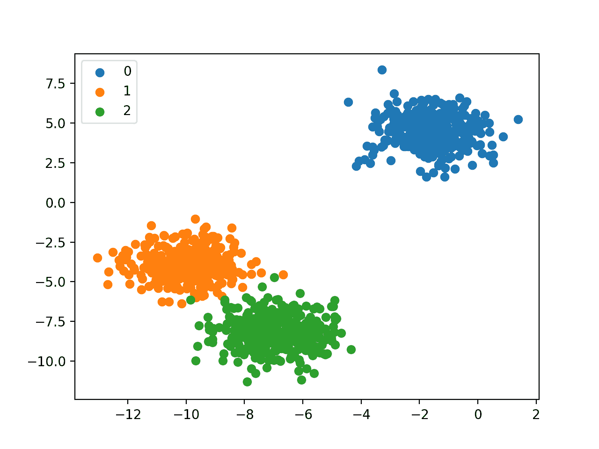

# 机器学习中的 4 种分类任务

> 原文：<https://machinelearningmastery.com/types-of-classification-in-machine-learning/>

最后更新于 2020 年 8 月 19 日

机器学习是一个研究领域，与从例子中学习的算法有关。

分类是一项需要使用机器学习算法的任务，该算法学习如何为来自问题领域的示例分配类别标签。一个容易理解的例子是将电子邮件分类为“T0”垃圾邮件“T1”或“T2”而不是垃圾邮件“T3”

在机器学习中，您可能会遇到许多不同类型的分类任务，以及可用于每种任务的专门建模方法。

在本教程中，您将发现机器学习中不同类型的分类预测建模。

完成本教程后，您将知道:

*   分类预测建模包括给输入示例分配一个类标签。
*   二元分类是指预测两个类别中的一个，多类别分类是指预测两个以上类别中的一个。
*   多标签分类涉及为每个示例预测一个或多个类，不平衡分类是指示例在类之间的分布不相等的分类任务。

**用我的新书[Python 机器学习精通](https://machinelearningmastery.com/machine-learning-with-python/)启动你的项目**，包括*分步教程*和所有示例的 *Python 源代码*文件。

我们开始吧。


机器学习中的分类类型
图片由 [Rachael](https://flickr.com/photos/114369518@N06/24742980862/) 提供，保留部分权利。

## 教程概述

本教程分为五个部分；它们是:

1.  分类预测建模
2.  二元分类
3.  多类分类
4.  多标签分类
5.  不平衡分类

## 分类预测建模

在机器学习中，[分类](https://en.wikipedia.org/wiki/Statistical_classification)指的是预测建模问题，其中为输入数据的给定示例预测类别标签。

分类问题的例子包括:

*   举个例子，分类它是不是垃圾邮件。
*   给定一个手写字符，将其归类为已知字符之一。
*   给定最近的用户行为，分类为流失与否。

从建模的角度来看，分类需要一个包含许多输入和输出示例的训练数据集，以便从中学习。

模型将使用训练数据集，并计算如何将输入数据的示例最佳地映射到特定的类标签。因此，训练数据集必须充分代表问题，并且每个类标签都有许多示例。

类别标签通常是字符串值，例如“*垃圾邮件*”、“*非垃圾邮件*”，并且在被提供给算法进行建模之前必须被映射为数值。这通常被称为[标签编码](https://machinelearningmastery.com/how-to-prepare-categorical-data-for-deep-learning-in-python/)，其中一个唯一的整数被分配给每个类别标签，例如“*垃圾邮件*”= 0，“*无垃圾邮件*”= 1。

有许多不同类型的分类算法用于建模分类预测建模问题。

关于如何将算法映射到问题类型上，没有好的理论；相反，通常建议从业者使用受控实验，并发现对于给定的分类任务，哪种算法和算法配置导致最佳表现。

基于分类预测建模算法的结果对其进行评估。分类精确率是一种流行的度量标准，用于基于预测的类标签来评估模型的表现。[分类准确率并不完美](https://machinelearningmastery.com/failure-of-accuracy-for-imbalanced-class-distributions/)但是对于很多分类任务来说是一个很好的起点。

代替类标签，一些任务可能需要预测每个例子的类成员的[概率。这为应用程序或用户可以解释的预测提供了额外的不确定性。评估预测概率的一个流行诊断是](https://machinelearningmastery.com/probability-metrics-for-imbalanced-classification/) [ROC 曲线](https://machinelearningmastery.com/roc-curves-and-precision-recall-curves-for-classification-in-python/)。

你可能会遇到四种主要的分类任务；它们是:

*   二元分类
*   多类分类
*   多标签分类
*   不平衡分类

让我们依次仔细看看每一个。

## 二元分类

[二进制分类](https://en.wikipedia.org/wiki/Binary_classification)是指那些有两个类标签的分类任务。

例子包括:

*   电子邮件垃圾邮件检测(垃圾邮件与否)。
*   流失预测(流失与否)。
*   转换预测(买还是不买)。

通常，二进制分类任务涉及一个属于正常状态的类和另一个属于异常状态的类。

例如“*非垃圾邮件*”为正常状态，“*垃圾邮件*”为异常状态。再比如“*癌症未检出*”是涉及医学测试的任务的正常状态，“*癌症检出*”是异常状态。

正常状态的类被赋予类标签 0，异常状态的类被赋予类标签 1。

通常用预测每个例子的[伯努利概率分布](https://machinelearningmastery.com/discrete-probability-distributions-for-machine-learning/)的模型来模拟二元分类任务。

伯努利分布是一种离散的概率分布，它涵盖了一个事件的二元结果为 0 或 1 的情况。对于分类，这意味着模型预测属于类别 1 的例子的概率，或者异常状态。

可用于二进制分类的流行算法包括:

*   逻辑回归
*   k-最近邻
*   决策树
*   支持向量机
*   朴素贝叶斯

有些算法是专门为二进制分类设计的，本身不支持两个以上的类；例子包括逻辑回归和支持向量机。

接下来，让我们仔细看看一个数据集，为二进制分类问题开发一种直觉。

我们可以使用 [make_blobs()函数](https://Sklearn.org/stable/modules/generated/sklearn.datasets.make_blobs.html)生成一个合成的二进制分类数据集。

下面的示例生成一个数据集，其中有 1，000 个属于两个类之一的示例，每个类都有两个输入要素。

```py
# example of binary classification task
from numpy import where
from collections import Counter
from sklearn.datasets import make_blobs
from matplotlib import pyplot
# define dataset
X, y = make_blobs(n_samples=1000, centers=2, random_state=1)
# summarize dataset shape
print(X.shape, y.shape)
# summarize observations by class label
counter = Counter(y)
print(counter)
# summarize first few examples
for i in range(10):
	print(X[i], y[i])
# plot the dataset and color the by class label
for label, _ in counter.items():
	row_ix = where(y == label)[0]
	pyplot.scatter(X[row_ix, 0], X[row_ix, 1], label=str(label))
pyplot.legend()
pyplot.show()
```

运行该示例首先总结了创建的数据集，该数据集显示了分为输入( *X* )和输出( *y* )元素的 1，000 个示例。

然后总结类标签的分布，显示实例属于类 0 或类 1，并且每个类中有 500 个实例。

接下来，对数据集中的前 10 个示例进行总结，显示输入值是数字，目标值是代表类成员身份的整数。

```py
(1000, 2) (1000,)

Counter({0: 500, 1: 500})

[-3.05837272  4.48825769] 0
[-8.60973869 -3.72714879] 1
[1.37129721 5.23107449] 0
[-9.33917563 -2.9544469 ] 1
[-11.57178593  -3.85275513] 1
[-11.42257341  -4.85679127] 1
[-10.44518578  -3.76476563] 1
[-10.44603561  -3.26065964] 1
[-0.61947075  3.48804983] 0
[-10.91115591  -4.5772537 ] 1
```

最后，为数据集中的输入变量创建散点图，并根据它们的类值对点进行着色。

我们可以看到两个不同的集群，我们可能会认为很容易区分。


二元分类数据集的散点图

## 多类分类

[多类分类](https://en.wikipedia.org/wiki/Multiclass_classification)是指那些有两个以上类标签的分类任务。

例子包括:

*   人脸分类。
*   植物种类分类。
*   光学字符识别。

与二元分类不同，多类分类没有正常和异常结果的概念。相反，示例被分类为属于一系列已知类别中的一个。

在某些问题上，类标签的数量可能非常大。例如，模型可以预测照片属于人脸识别系统中成千上万张人脸中的一张。

涉及预测单词序列的问题，例如文本翻译模型，也可以被认为是一种特殊类型的多类分类。要预测的单词序列中的每个单词都涉及多类分类，其中词汇的大小定义了可以预测的可能类别的数量，并且大小可以是几万或几十万个单词。

通常用预测每个例子的[多项式概率分布](https://machinelearningmastery.com/discrete-probability-distributions-for-machine-learning/)的模型来建模多类分类任务。

多项式分布是一种离散的概率分布，它涵盖了一个事件将有一个分类结果的情况，例如{1，2，3，…， *K* 中的*K*}。对于分类，这意味着模型预测一个例子属于每个类标签的概率。

许多用于二进制分类的算法可以用于多类分类。

可用于多类分类的流行算法包括:

*   k-最近邻居。
*   决策树。
*   朴素贝叶斯。
*   随机森林。
*   梯度助推。

为二进制分类设计的算法可以适用于多类问题。

这包括使用一种策略，为每个类和所有其他类拟合多个二元分类模型(称为一对一对一)，或者为每对类拟合一个模型(称为一对一对一)。

*   **One-vs-Rest** :每个类相对于所有其他类适合一个二元分类模型。
*   **一对一**:每对类拟合一个二元分类模型。

可以将这些策略用于多类分类的二进制分类算法包括:

*   逻辑回归。
*   支持向量机。

接下来，让我们仔细看看数据集，为多类分类问题开发一种直觉。

我们可以使用 [make_blobs()函数](https://Sklearn.org/stable/modules/generated/sklearn.datasets.make_blobs.html)生成一个合成的多类分类数据集。

下面的示例生成一个数据集，其中有 1，000 个属于三个类之一的示例，每个类都有两个输入要素。

```py
# example of multi-class classification task
from numpy import where
from collections import Counter
from sklearn.datasets import make_blobs
from matplotlib import pyplot
# define dataset
X, y = make_blobs(n_samples=1000, centers=3, random_state=1)
# summarize dataset shape
print(X.shape, y.shape)
# summarize observations by class label
counter = Counter(y)
print(counter)
# summarize first few examples
for i in range(10):
	print(X[i], y[i])
# plot the dataset and color the by class label
for label, _ in counter.items():
	row_ix = where(y == label)[0]
	pyplot.scatter(X[row_ix, 0], X[row_ix, 1], label=str(label))
pyplot.legend()
pyplot.show()
```

运行该示例首先总结了创建的数据集，该数据集显示了分为输入( *X* )和输出( *y* )元素的 1，000 个示例。

然后总结类标签的分布，显示实例属于类 0、类 1 或类 2，并且每个类中大约有 333 个示例。

接下来，对数据集中的前 10 个示例进行总结，显示输入值是数字，目标值是代表类成员身份的整数。

```py
(1000, 2) (1000,)

Counter({0: 334, 1: 333, 2: 333})

[-3.05837272  4.48825769] 0
[-8.60973869 -3.72714879] 1
[1.37129721 5.23107449] 0
[-9.33917563 -2.9544469 ] 1
[-8.63895561 -8.05263469] 2
[-8.48974309 -9.05667083] 2
[-7.51235546 -7.96464519] 2
[-7.51320529 -7.46053919] 2
[-0.61947075  3.48804983] 0
[-10.91115591  -4.5772537 ] 1
```

最后，为数据集中的输入变量创建散点图，并根据它们的类值对点进行着色。

我们可以看到三个不同的集群，我们可能会认为很容易区分。



多分类数据集的散点图

## 多标签分类

[多标签分类](https://en.wikipedia.org/wiki/Multi-label_classification)是指那些具有两个或多个类别标签的分类任务，其中每个示例可以预测一个或多个类别标签。

考虑[照片分类](https://machinelearningmastery.com/object-recognition-with-deep-learning/)的例子，其中给定的照片可能在场景中具有多个对象，并且模型可以预测照片中多个已知对象的存在，例如“*自行车*、“*苹果*、“*人*等。

这不同于二进制分类和多类分类，在多类分类中，为每个示例预测单个类标签。

通常使用预测多个输出的模型来对多标签分类任务建模，每个输出被预测为伯努利概率分布。这本质上是一个模型，为每个示例进行多个二进制分类预测。

用于二分类或多分类的分类算法不能直接用于多标签分类。可以使用标准分类算法的专用版本，即所谓的算法的多标签版本，包括:

*   多标签决策树
*   多标签随机森林
*   多标签梯度增强

另一种方法是使用单独的分类算法来预测每个类别的标签。

接下来，让我们仔细看看数据集，为多标签分类问题开发一种直觉。

我们可以使用[make _ multi label _ classification()函数](https://Sklearn.org/stable/modules/generated/sklearn.datasets.make_classification.html)生成一个合成的多标签分类数据集。

下面的示例生成了一个包含 1，000 个示例的数据集，每个示例都有两个输入要素。有三个类，每个类可以有两个标签(0 或 1)中的一个。

```py
# example of a multi-label classification task
from sklearn.datasets import make_multilabel_classification
# define dataset
X, y = make_multilabel_classification(n_samples=1000, n_features=2, n_classes=3, n_labels=2, random_state=1)
# summarize dataset shape
print(X.shape, y.shape)
# summarize first few examples
for i in range(10):
	print(X[i], y[i])
```

运行该示例首先总结了创建的数据集，该数据集显示了分为输入( *X* )和输出( *y* )元素的 1，000 个示例。

接下来，对数据集中的前 10 个示例进行总结，显示输入值是数字，目标值是代表类标签成员身份的整数。

```py
(1000, 2) (1000, 3)

[18\. 35.] [1 1 1]
[22\. 33.] [1 1 1]
[26\. 36.] [1 1 1]
[24\. 28.] [1 1 0]
[23\. 27.] [1 1 0]
[15\. 31.] [0 1 0]
[20\. 37.] [0 1 0]
[18\. 31.] [1 1 1]
[29\. 27.] [1 0 0]
[29\. 28.] [1 1 0]
```

## 不平衡分类

[不平衡分类](https://machinelearningmastery.com/what-is-imbalanced-classification/)是指每个类中的例子数量分布不均匀的分类任务。

典型地，不平衡分类任务是二元分类任务，其中训练数据集中的大多数例子属于正常类，少数例子属于异常类。

例子包括:

*   欺诈检测。
*   异常检测。
*   医学诊断测试。

这些问题被建模为二元分类任务，尽管可能需要专门的技术。

可以使用专门的技术通过对多数类进行欠采样或对少数类进行过采样来改变训练数据集中样本的组成。

例子包括:

*   [随机欠采样](https://machinelearningmastery.com/random-oversampling-and-undersampling-for-imbalanced-classification/)。
*   [SMOTE 过采样](https://machinelearningmastery.com/smote-oversampling-for-imbalanced-classification/)。

当在训练数据集上拟合模型时，可以使用更关注少数类的专门建模算法，例如对成本敏感的机器学习算法。

例子包括:

*   [成本敏感型逻辑回归](https://machinelearningmastery.com/cost-sensitive-logistic-regression/)。
*   成本敏感决策树。
*   成本敏感的支持向量机。

最后，可能需要替代表现指标，因为报告分类准确性可能会产生误导。

例子包括:

*   精准。
*   回忆一下。
*   衡量。

接下来，让我们仔细看看数据集，为不平衡的分类问题开发一种直觉。

我们可以使用 [make_classification()函数](https://Sklearn.org/stable/modules/generated/sklearn.datasets.make_classification.html)生成一个合成的不平衡二进制分类数据集。

下面的示例生成一个数据集，其中有 1，000 个属于两个类之一的示例，每个类都有两个输入要素。

```py
# example of an imbalanced binary classification task
from numpy import where
from collections import Counter
from sklearn.datasets import make_classification
from matplotlib import pyplot
# define dataset
X, y = make_classification(n_samples=1000, n_features=2, n_informative=2, n_redundant=0, n_classes=2, n_clusters_per_class=1, weights=[0.99,0.01], random_state=1)
# summarize dataset shape
print(X.shape, y.shape)
# summarize observations by class label
counter = Counter(y)
print(counter)
# summarize first few examples
for i in range(10):
	print(X[i], y[i])
# plot the dataset and color the by class label
for label, _ in counter.items():
	row_ix = where(y == label)[0]
	pyplot.scatter(X[row_ix, 0], X[row_ix, 1], label=str(label))
pyplot.legend()
pyplot.show()
```

运行该示例首先总结了创建的数据集，该数据集显示了分为输入( *X* )和输出( *y* )元素的 1，000 个示例。

然后总结类别标签的分布，显示严重的类别不平衡，大约 980 个例子属于类别 0，大约 20 个例子属于类别 1。

接下来，对数据集中的前 10 个示例进行总结，显示输入值是数字，目标值是代表类成员身份的整数。在这种情况下，我们可以看到大多数例子都属于类 0，正如我们所期望的那样。

```py
(1000, 2) (1000,)

Counter({0: 983, 1: 17})

[0.86924745 1.18613612] 0
[1.55110839 1.81032905] 0
[1.29361936 1.01094607] 0
[1.11988947 1.63251786] 0
[1.04235568 1.12152929] 0
[1.18114858 0.92397607] 0
[1.1365562  1.17652556] 0
[0.46291729 0.72924998] 0
[0.18315826 1.07141766] 0
[0.32411648 0.53515376] 0
```

最后，为数据集中的输入变量创建散点图，并根据它们的类值对点进行着色。

我们可以看到一个属于 0 类的例子和几个属于 1 类的分散例子的主集群。直觉告诉我们，具有这种不平衡类标签属性的数据集更难建模。


不平衡二进制分类数据集的散点图

## 进一步阅读

如果您想更深入地了解这个主题，本节将提供更多资源。

*   [统计分类，维基百科](https://en.wikipedia.org/wiki/Statistical_classification)。
*   [二进制分类，维基百科](https://en.wikipedia.org/wiki/Binary_classification)。
*   [多类分类，维基百科](https://en.wikipedia.org/wiki/Multiclass_classification)。
*   [多标签分类，维基百科](https://en.wikipedia.org/wiki/Multi-label_classification)。
*   [多类和多标签算法，Sklearn API](https://Sklearn.org/stable/modules/multiclass.html) 。

## 摘要

在本教程中，您发现了机器学习中不同类型的分类预测建模。

具体来说，您了解到:

*   分类预测建模包括给输入示例分配一个类标签。
*   二元分类是指预测两个类别中的一个，多类别分类是指预测两个以上类别中的一个。
*   多标签分类涉及为每个示例预测一个或多个类，不平衡分类是指示例在类之间的分布不相等的分类任务。

**你有什么问题吗？**
在下面的评论中提问，我会尽力回答。