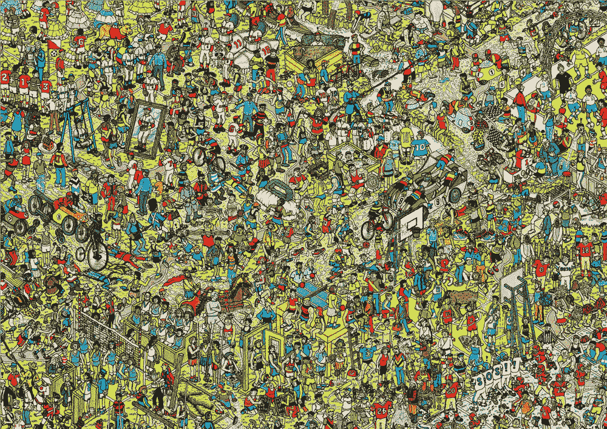
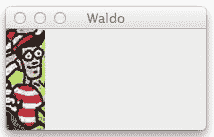
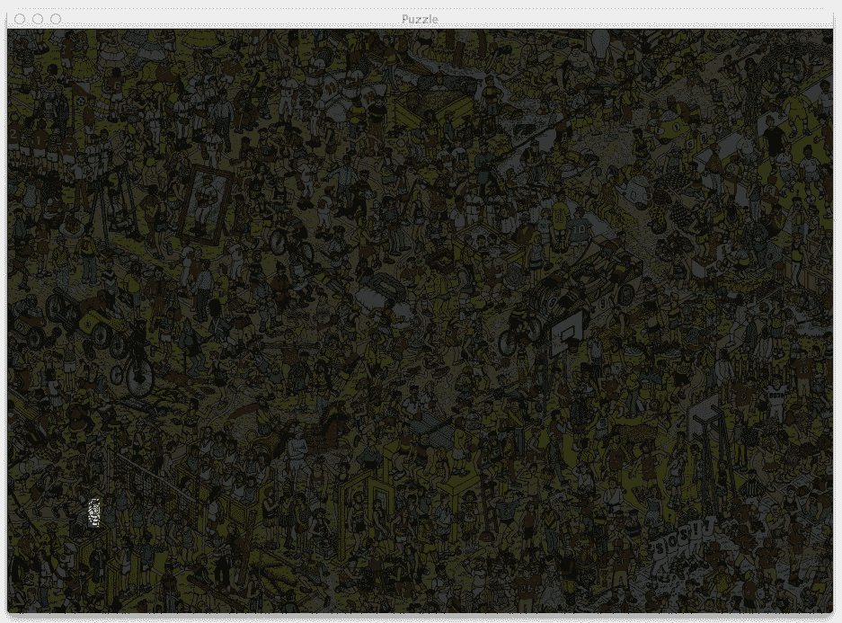

# 使用 OpenCV，Python 和模板匹配来播放“哪里是 Waldo？”

> 原文： [https://machinelearningmastery.com/using-opencv-python-and-template-matching-to-play-wheres-waldo/](https://machinelearningmastery.com/using-opencv-python-and-template-matching-to-play-wheres-waldo/)

**_ 这是来自 [PyImageSearch](http://www.pyimagesearch.com) 的 Adrian Rosebrock 的客座文章，这是一个关于计算机视觉，图像处理和建筑图像搜索引擎的博客。_**

[](https://3qeqpr26caki16dnhd19sv6by6v-wpengine.netdna-ssl.com/wp-content/uploads/2014/05/puzzle_small.jpg)

图 1：在这个难题中找到 Waldo 需要多长时间？

看看上面的 Where's Waldo 拼图。找到 Waldo 需要多长时间？ 10 秒？ 30 秒？一分钟？

Waldo 是人类隐藏和寻求的终极游戏。他实际上是“隐藏”在平常的视线中 - 但由于所有的噪音和分心，我们不能立即接他！

Waldo 的核心只是一种视觉模式。他戴眼镜。一顶帽子。而他经典的白色和红色水平条纹衬衫。我们可能需要花一点时间在页面上上下左右扫描，但我们的大脑能够挑选出这种模式，即使是在所有的分心中也是如此。

问题是，计算机可以做得更好吗？我们可以创建一个程序可以 **_ 自动 _** 找到 Waldo 吗？

事实上，我们可以。

使用计算机视觉技术，我们可以在一秒钟内找到 Waldo，比我们任何人都快得多！

在这篇博文中，我将向您展示如何使用 OpenCV 和模板匹配功能来找到那个总是隐藏在视线中的讨厌的 Waldo。

以下是我们将要做的快速概述：

*   **我们要做什么：**使用 OpenCV 构建一个 Python 脚本，可以在“Where's Waldo？”拼图中找到 Waldo。
*   **您将学到什么：**如何使用`cv2.matchTemplate`和`cv2.minMaxLoc`来利用 Python，OpenCV 和模板匹配。使用这些功能，我们将能够在拼图中找到 Waldo。
*   **你需要什么：** Python，NumPy 和 OpenCV。对基本图像处理概念有一点了解会有所帮助，但 _ 绝对不是一个要求 _。本操作指南旨在介绍如何使用 OpenCV 应用模板匹配。没有安装这些库？没问题。我创建了一个预配置的虚拟机，其中预装了所有必要的计算机视觉，图像处理和机器学习包。 [点击此处了解更多](https://www.pyimagesearch.com/practical-python-opencv/)。
*   **假设：**我假设您在 python2.6 或 python2.7 环境中安装了 [NumPy](http://www.numpy.org/) 和 [OpenCV](http://opencv.org/) 。同样，您可以在此处下载已安装所有必需软件包[的预配置虚拟机。](https://www.pyimagesearch.com/practical-python-opencv/)

## 目标：

那么我们要创建的 Python 脚本的总体目标是什么？

**给出 Waldo 和拼图图像的查询图像的目的是在拼图中找到 Waldo 并突出显示他的位置。**

正如您将在本文后面看到的，我们将能够在 _ 中完成这两行 Python 代码 _。其余的代码只是处理逻辑，如参数解析和显示解决的拼图到我们的屏幕。

## 我们的拼图和查询图像

我们需要两个图像来构建我们的 Python 脚本来执行模板匹配。

第一张图片是我们要解决的 Where's Waldo 拼图。您可以在本文顶部的**图 1** 中看到我们的拼图图像。

第二张图片是我们对 Waldo 的查询图片：

[](https://3qeqpr26caki16dnhd19sv6by6v-wpengine.netdna-ssl.com/wp-content/uploads/2014/05/waldo_query.jpg)

图 2：我们的 Waldo 查询图像

使用我们的 Waldo 查询图像，我们将在原始拼图中找到他。

不幸的是，这是我们的方法的实用性破坏的地方。

为了在我们的拼图中找到 Waldo，我们首先需要 Waldo 自己的形象。你可能会问，如果我已经有了 Waldo 的形象，为什么我在玩这个拼图呢？

好点子。

使用计算机视觉和图像处理技术在图像 _ 中找到 Waldo 当然是可能的 _。

但是，它需要一些稍微更先进的技术，例如：

1.  过滤掉不是红色的颜色。
2.  计算条纹图案的相关性，以匹配 Waldo 衬衫的红色和白色过渡。
3.  图像区域的二值化与条纹图案具有高度相关性。

这篇文章的目的是 _ 介绍 _ 到基本的计算机视觉技术，如模板匹配。稍后我们可以深入研究更先进的技术。哪个是 Waldo 只是一个很酷而简单的方法来执行模板匹配，我 _ 只是 _ 与你分享！

## 弄脏我们的手

准备看一些代码？好吧，我们这样做：

A How-To Guide to Template Matching with OpenCV and Python Python

```
# import the necessary packages
import numpy as np
import argparse
import imutils
import cv2

# construct the argument parser and parse the arguments
ap = argparse.ArgumentParser()
ap.add_argument("-p", "--puzzle", required = True,
	help = "Path to the puzzle image")
ap.add_argument("-w", "--waldo", required = True,
	help = "Path to the waldo image")
args = vars(ap.parse_args())

# load the puzzle and waldo images
puzzle = cv2.imread(args["puzzle"])
waldo = cv2.imread(args["waldo"])
(waldoHeight, waldoWidth) = waldo.shape[:2]
```

**第 1-13 行**只是导入我们将要使用的包并配置我们的参数解析器。我们将使用 NumPy 进行数组操作，使用`argparse`解析命令行参数，使用`cv2`进行 OpenCV 绑定。包`imutils`实际上是一组便利功能，用于处理基本图像处理，例如旋转，调整大小和平移。您可以在这里阅读更多关于这些类型的基本图像操作 [](http://www.pyimagesearch.com/2014/01/20/basic-image-manipulations-in-python-and-opencv-resizing-scaling-rotating-and-cropping/) 。

从那里，我们需要设置两个命令行参数。第一个，`--puzzle`是我们 Where's Waldo 拼图图像的路径，`--waldo`是 Waldo 查询图像的路径。

同样，我们的目标是使用模板匹配在拼图图像中查找查询图像。

现在我们已经有了图像的路径，我们使用`cv2.imread`功能将它们从**第 16 行和第 17 行**上的磁盘上加载 - 这种方法只是从磁盘上读取图像，然后将其存储为多个 - 维数 NumPy 数组。

由于图像在 OpenCV 中表示为 NumPy 数组，因此我们可以轻松访问图像的尺寸。在**第 18 行**上，我们分别获取 Waldo 查询图像的高度和宽度。

我们现在准备执行模板匹配：

A How-To Guide to Template Matching with OpenCV and Python Python

```
# import the necessary packages
import numpy as np
import argparse
import imutils
import cv2

# construct the argument parser and parse the arguments
ap = argparse.ArgumentParser()
ap.add_argument("-p", "--puzzle", required = True,
	help = "Path to the puzzle image")
ap.add_argument("-w", "--waldo", required = True,
	help = "Path to the waldo image")
args = vars(ap.parse_args())

# load the puzzle and waldo images
puzzle = cv2.imread(args["puzzle"])
waldo = cv2.imread(args["waldo"])
(waldoHeight, waldoWidth) = waldo.shape[:2]

# find the waldo in the puzzle
result = cv2.matchTemplate(puzzle, waldo, cv2.TM_CCOEFF)
(_, _, minLoc, maxLoc) = cv2.minMaxLoc(result)
```

我们使用`cv2.matchTemplate function`在 **Line 21** 上完成模板匹配。该方法需要三个参数。第一个是我们的`puzzle`图像，图像包含我们正在搜索的内容。第二个是我们的查询图像，`waldo`。此图像包含在拼图图像中，我们希望确定其位置。最后，第三个参数是我们的模板匹秘籍法。有多种方法可以执行模板匹配，但在这种情况下，我们使用由标志`cv2.TM_CCOEFF`指定的相关系数。

那么`cv2.matchTemplate`函数究竟在做什么呢？

本质上，这个函数采用我们的`waldo`查询图像的“滑动窗口”，并在我们的拼图图像中从左到右，从上到下，一次一个像素。然后，对于这些位置中的每一个，我们计算相关系数以确定匹配的“好”或“坏”。对于我们的 waldo 模板，具有足够高相关性的区域可以被认为是“匹配”。

从那里，我们所需要的是调用 **22 行**上的`cv2.minMaxLoc`来找到我们的“好”匹配的位置。

这就是模板匹配的全部！

实际上，它只花了我们两行代码。

我们的其余源代码涉及提取包含 Waldo 的区域，然后在原始拼图图像中突出显示：

A How-To Guide to Template Matching with OpenCV and Python Python

```
# import the necessary packages
import numpy as np
import argparse
import imutils
import cv2

# construct the argument parser and parse the arguments
ap = argparse.ArgumentParser()
ap.add_argument("-p", "--puzzle", required = True,
	help = "Path to the puzzle image")
ap.add_argument("-w", "--waldo", required = True,
	help = "Path to the waldo image")
args = vars(ap.parse_args())

# load the puzzle and waldo images
puzzle = cv2.imread(args["puzzle"])
waldo = cv2.imread(args["waldo"])
(waldoHeight, waldoWidth) = waldo.shape[:2]

# find the waldo in the puzzle
result = cv2.matchTemplate(puzzle, waldo, cv2.TM_CCOEFF)
(_, _, minLoc, maxLoc) = cv2.minMaxLoc(result)

# grab the bounding box of waldo and extract him from
# the puzzle image
topLeft = maxLoc
botRight = (topLeft[0] + waldoWidth, topLeft[1] + waldoHeight)
roi = puzzle[topLeft[1]:botRight[1], topLeft[0]:botRight[0]]

# construct a darkened transparent 'layer' to darken everything
# in the puzzle except for waldo
mask = np.zeros(puzzle.shape, dtype = "uint8")
puzzle = cv2.addWeighted(puzzle, 0.25, mask, 0.75, 0)
```

**第 26 行**根据我们的滑动窗口抓取包含最佳匹配的图像的左上角（x，y）坐标。然后，我们根据 **Line 27** 上`waldo`图像的宽度和高度计算右下角（x，y）坐标。最后，我们在**第 28 行**上提取`roi`（感兴趣区域）。

下一步是构建一个透明层，使图像 _ 中的所有内容变暗，但 _ Waldo。我们首先在 **Line 32** 上初始化`mask`，其形状与填充零的拼图相同。通过用零填充图像，我们创建了一个充满黑色的图像。

为了创建透明效果，我们使用 **Line 33** 上的`cv2.addWeighted`功能。第一个参数是我们的`puzzle`图像，第二个参数表示我们希望它占我们输出图像的 25％。然后我们提供`mask`作为第三个参数，使其占我们输出图像的 75％。通过利用`cv2.addWeighted`功能，我们已经能够创建透明效果。

但是，我们仍需要突出 Waldo 地区！这很简单：

A How-To Guide to Template Matching with OpenCV and Python Python

```
# import the necessary packages
import numpy as np
import argparse
import imutils
import cv2

# construct the argument parser and parse the arguments
ap = argparse.ArgumentParser()
ap.add_argument("-p", "--puzzle", required = True,
	help = "Path to the puzzle image")
ap.add_argument("-w", "--waldo", required = True,
	help = "Path to the waldo image")
args = vars(ap.parse_args())

# load the puzzle and waldo images
puzzle = cv2.imread(args["puzzle"])
waldo = cv2.imread(args["waldo"])
(waldoHeight, waldoWidth) = waldo.shape[:2]

# find the waldo in the puzzle
result = cv2.matchTemplate(puzzle, waldo, cv2.TM_CCOEFF)
(_, _, minLoc, maxLoc) = cv2.minMaxLoc(result)

# grab the bounding box of waldo and extract him from
# the puzzle image
topLeft = maxLoc
botRight = (topLeft[0] + waldoWidth, topLeft[1] + waldoHeight)
roi = puzzle[topLeft[1]:botRight[1], topLeft[0]:botRight[0]]

# construct a darkened transparent 'layer' to darken everything
# in the puzzle except for waldo
mask = np.zeros(puzzle.shape, dtype = "uint8")
puzzle = cv2.addWeighted(puzzle, 0.25, mask, 0.75, 0)

# put the original waldo back in the image so that he is
# 'brighter' than the rest of the image
puzzle[topLeft[1]:botRight[1], topLeft[0]:botRight[0]] = roi

# display the images
cv2.imshow("Puzzle", imutils.resize(puzzle, height = 650))
cv2.imshow("Waldo", waldo)
cv2.waitKey(0)
```

在这里，我们只是使用 **Line 37** 上的一些 NumPy 阵列切片技术将 Waldo ROI 重新放回到原始图像中。什么都没有。

最后，**第 40-42 行**通过在屏幕上显示我们的 Waldo 查询和拼图图像并等待按键来显示我们的工作结果。

要运行我们的脚本，请启动 shell 并执行以下命令：

A How-To Guide to Template Matching with OpenCV and Python Shell

```
$ python find_waldo.py --puzzle puzzle.png --waldo waldo.png
```

当您的脚本执行完毕后，您应该在屏幕上看到类似的内容：

[](https://3qeqpr26caki16dnhd19sv6by6v-wpengine.netdna-ssl.com/wp-content/uploads/2014/05/puzzle_found_waldo1.jpg)

图 3：我们成功找到了 Waldo！

我们在图像的左下角发现了 Waldo！

所以你有它！

使用 Python 和 OpenCV 进行模板匹配实际上非常简单。首先，您只需要两个图像 - 要匹配的对象的图像和包含该对象的图像。从那里，你只需要调用 cv2.matchTemplate 和 cv2.minMaxLaoc。其余的只是将这些函数的输出粘合在一起的包装代码。

## 在单一周末学习计算机视觉

当然，我们只是在研究计算机视觉和图像处理的表面。模板匹配只是一个开始。

幸运的是，_ 我可以在一个周末教你计算机视觉的基础知识。_

我知道，这听起来很疯狂。

但我的方法确实有效。

看，我刚刚写完了我的新书， _Practical Python 和 OpenCV_ 。我希望这本书尽可能亲自动手。我想要一些你可以轻松学习的东西，没有与大学水平的计算机视觉和图像处理课程相关的所有严谨和细节。

最重要的是，Practical Python 和 OpenCV 是**最好的，保证快速入门指南**学习计算机视觉和图像处理的基础知识。

另外，我已经创建了一个可下载的 Ubuntu VirtualBox 虚拟机，其中包含 OpenCV，PIL，mahotas，scikit-image，scikit-learn 以及许多其他预先配置和预安装的计算机视觉和图像处理库。

所以，继续，开始你的计算机视觉教育。 **不要浪费时间安装包装......投入时间学习！**

要了解有关我的新书和可下载虚拟机​​的更多信息，请 **[点击此处](https://www.pyimagesearch.com/practical-python-opencv/)** 。

**UPDATE** ：继续关于 Reddit 的[讨论。](http://www.reddit.com/r/computervision/comments/25p85i/play_wheres_waldo_with_opencv_and_python/)